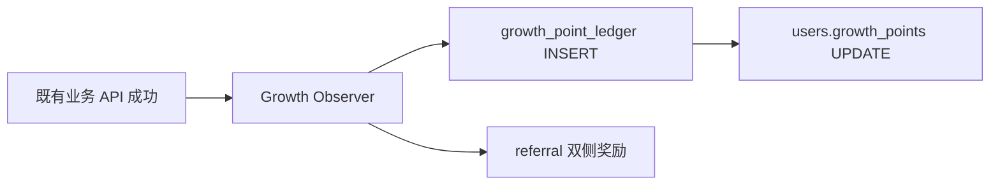
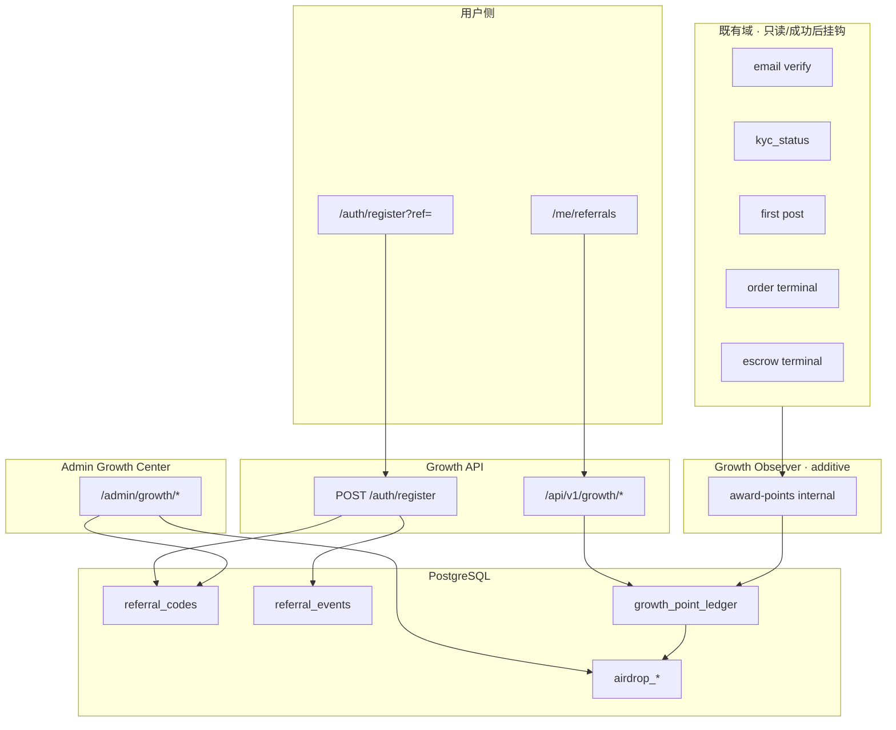

# 102 · Referral 与早鸟增长系统 v1.0 实施蓝图

**Version:** 1.2.0 · **最后更新：** 2026-06-08  
**规范名称：** **TravelTrust Referral & Early Bird Growth System v1.0**  
**受众**：后端 / 全栈 / 产品 / 增长运营  
**状态**：**已吸收入 [101 v2.0.0](./101-CMS与内容运营中心实施蓝图.md) · 运行时冻结 SSOT [133-G-S8](./133-G-S8-Growth-Release-Freeze-Report.md) · 本文保留 P3 历史分册索引**  
**与 spec 关系**：**partial** — 实施边界见 **101 v2.0.0 §1.3 · §8.4**；Growth API/DDL 运行时以 **126–133** 为准，**本文 §0 运行时摘要已过时**（仍写「不存在」处请读 133）。

> **SSOT（必读）**：**engineering 仅为导读**；**不替代 spec**。**HTTP 机读**真源 **[04 §3.4](../../spec/04-后端与API.md)**；**域矩阵**真源 **[93](../../spec/93-全站功能验证矩阵-域别回归清单.md)**；**实现**真源 **`crates/`·`frontend/`**。删 **spec** 须 **[08 §3](./08-文档与spec迁移台账.md#mig-2-matrix)** 程序。

**阶段口径**：**① 本地 → ② 测试网 → ③ 公网/生产**（须顺序，禁止跳阶）。**① 积分/空投分配 ≠ ③ 链上 GOV 真发放**。

**先读**：[101-CMS与内容运营中心实施蓝图 v2.0.0](./101-CMS与内容运营中心实施蓝图.md) · [133-G-S8 Growth Freeze](./133-G-S8-Growth-Release-Freeze-Report.md) · [40-D-Admin机制](./40-D-Admin机制.md)

> **v1.2.0 索引（2026-06-08）**：Growth **G-S1～G-S8 链下运行时已交付并冻结**（133）。下文各节保留作 **P3 深读附录**；**运行时状态以 133 为准**，冲突以 **101 v2.0.0** 为准。

---

<a id="gr102-0-exec"></a>

## 0. 执行摘要

| 维度 | 现状（① 代码真源） | v1.0 目标态 |
|------|-------------------|-------------|
| Referral / 邀请码 | **不存在** | 用户码 + KOL/向导/商家/区域码 |
| Growth Points | **不存在** | 积分账本 + 早鸟倍率 |
| Early Bird | **不存在** | Stage 1–3 配置 |
| Airdrop | **不存在** | 快照 · 占比 · 分配记录（链下） |
| Anti-Fraud | **部分**（community risk_signals） | Growth 专用风控中心 |
| Admin Growth Center | **不存在**（仅有 `/admin/trust-growth` A/B 实验） | 7 子模块导航 |
| 用户 `/me/referrals` | **不存在** | 推荐中心 + KOL 仪表盘 |

**定位**：冷启动、主播/KOL 推广、区域运营商、未来治理币（GOV）空投的**统一增长层**——**先积分、后空投、不直接发币**。

**与 `/admin/trust-growth` 分工**

| 系统 | 职责 |
|------|------|
| **trust-growth**（已有） | Banner/首页 A/B、CTR、autopilot 权重 |
| **Growth Center**（新建） | Referral · Points · Early Bird · Airdrop · KOL · 防刷 |

---

<a id="gr102-1-boundary"></a>

## 1. 实施边界（必须遵守）

### 1.1 允许

- 新增 **Growth Center** Admin 导航组与子路由  
- 新增 **Referral System**（码生成、绑定、统计）  
- 新增 **Early Bird Program**（阶段 · 倍率 · 人数上限）  
- 新增 **Airdrop Center**（Campaign · 快照 · 分配记录 · 导出）  
- 新增 **`/me/referrals`** 用户侧推荐中心  
- 注册页 **Referral Code（选填）** 字段  
- 新增 PostgreSQL 增长表族 + 只读 **事件投影** 发积分  

### 1.2 禁止（FINAL System Audit 已冻结域）

| 禁止项 | 说明 | 合规做法 |
|--------|------|----------|
| 修改 **Escrow** 合约/页逻辑 | OED 域已 PASS frozen | 在 escrow **状态已变更后** 异步写 `growth_point_ledger` |
| 修改 **订单状态机** | `OrderState` 真源不变 | **Observer/投影**：监听现有 API 成功响应或 DB 审计行 append ledger |
| 修改 **治理执行逻辑** | Governor/链上 vote 不变 | Airdrop 仅写 **`airdrop_allocations` 链下记录**；③ 才链接上 transfer |
| 修改 **支付链路** | Stripe/webhook 不变 | 首单积分在 `orders` 达终态后投影 |
| 修改 **Final System Audit** 已闭业务链 | 见 [FINAL-SYSTEM-AUDIT-REPORT](../../runbook/FINAL-SYSTEM-AUDIT-REPORT.md) | 新模块 **additive only** |

### 1.3 五主路由 UI 冻结

`/me/referrals` 为 **新增非五主路由**；`/auth/register` 仅增 **选填字段**，须遵守 [AUTH-REGISTER-UI-FREEZE](../../../frontend/evidence/GO_local_auth_l5/AUTH-REGISTER-UI-FREEZE.md)（数据链/i18n 允许，禁止结构回流）。

---

<a id="gr102-2-gap"></a>

## 2. 缺口审计（Phase 1）

| 能力 | 代码扫描 | Admin | DB | API |
|------|----------|-------|-----|-----|
| referral_code | **无** | 无 | users 无列 | 无 |
| referred_by | **无** | 无 | 无 | 无 |
| growth_points | **无** | 无 | 无 | 无 |
| referral_events | **无** | 无 | 无 | 无 |
| growth_point_ledger | **无** | 无 | 无 | 无 |
| airdrop | **无** | 无 | 无 | 无 |
| `/me/referrals` | **无** | — | — | 无 |
| register `?ref=` | **无** | — | — | 无 |
| KOL 仪表盘 | **无** | 无 | 无 | 无 |
| 防刷（growth 专用） | **部分** community_risk_signals | 无 | 有 community 表 | admin community risk |

**users 表现有列**（`20250228000001_users_sessions.sql`）：`id, email, password_hash, role, kyc_status, nickname, avatar_url, default_wallet_address, created_at, updated_at` — **无 referral/growth 字段**。

---

<a id="gr102-3-modules"></a>

## 3. Growth Center 模块结构

### 3.1 Admin 导航

```
Admin
└── Growth Center          （新侧栏组 id: growth）
    ├── /admin/growth                           Hub
    ├── /admin/growth/referral-codes            Referral Codes
    ├── /admin/growth/early-bird                Early Bird Program
    ├── /admin/growth/airdrop-campaigns         Airdrop Campaigns
    ├── /admin/growth/kol-center                KOL Center
    ├── /admin/growth/reward-ledger             Reward Ledger
    ├── /admin/growth/anti-fraud                Anti-Fraud Center
    └── /admin/growth/analytics                 Growth Analytics
```

### 3.2 用户侧

| 路由 | 功能 |
|------|------|
| **`/me/referrals`** | 我的推荐中心（普通用户 + KOL 增强视图） |
| **`/auth/register?ref=TT-xxx`** | 注册页预填推荐码 |
| **`GET /api/v1/growth/referrals/validate?code=`** | 注册前校验码（公开） |

### 3.3 七子模块职责

| 模块 | Admin 能力 | 用户可见 |
|------|------------|----------|
| **Referral Codes** | 创建/禁用/改码 · 绑定 KOL · 类型分配 | 我的码 · 邀请链接 |
| **Early Bird Program** | Stage 配置 · 倍率 · 人数上限 | 早鸟阶段 badge（可选） |
| **Airdrop Campaigns** | 创建 · 快照 · 导出 · 发放记录 | 预计空投 GOV |
| **KOL Center** | 主播列表 · 码 · 漏斗 · GMV | KOL 扩展仪表盘 |
| **Reward Ledger** | 积分流水查询 · 人工调账（审批） | 累计积分 |
| **Anti-Fraud Center** | 风险规则 · 冻结 · 人工复核 | 无（仅后果） |
| **Growth Analytics** | 转化漏斗 · 排行榜 | 无 |

---

<a id="gr102-4-referral"></a>

## 4. Referral System（推荐体系）

### 4.1 邀请码格式

前缀 **`TT-`** + 6–8 位大写字母数字（ Crockford 基，排除易混字符可选）。

| 类型 | 示例 | 绑定 |
|------|------|------|
| 普通用户 | `TT-8F2KDQ` | 注册时自动生成 |
| 主播/KOL | `TT-KOL888` | Admin 创建 · 绑定 user |
| 向导 | `TT-GUIDE888` | 绑定 guides |
| 商家 | `TT-MERCHANT888` | 绑定 provider |
| 区域运营商 | `TT-SG001` · `TT-CN001` · `TT-US001` | Admin 配置 region |

**存储**：独立表 `referral_codes`（见 §8），`users.referral_code` 为**用户自有码**冗余/cache。

### 4.2 注册绑定

1. 用户访问 `https://traveltrust.com/register?ref=TT-8F2KDQ`  
2. 前端读 `ref` query → 预填 **Referral Code（选填）**  
3. `POST /auth/register` body 增 **`referral_code`**（optional）  
4. 服务端：校验码有效 → 写 `users.referred_by_user_id` + `referral_events(event_type=register)`  
5. **双端积分**：referrer + referee（见 §5）

### 4.3 我的推荐中心 UI（`/me/referrals`）

**普通用户显示**

| 字段 | 示例 |
|------|------|
| 我的推荐码 | `TT-8F2KDQ` |
| 邀请链接 | `https://traveltrust.com/register?ref=TT-8F2KDQ` |
| 累计邀请 | 18 |
| 有效邀请 | 12 |
| 获得积分 | 3600 |
| 预计空投 | 360 GOV（来自 active campaign 估算） |

**KOL/主播增强**（同页 role-gated 区块）

| 字段 |
|------|
| 邀请人数 · 累计积分 · 活跃用户 · 认证用户 · 订单用户 · GMV · 预计空投 |

---

<a id="gr102-5-points"></a>

## 5. Growth Points（成长积分）

### 5.1 原则

- **不直接发治理币**；GOV 仅通过 **Airdrop Campaign** 按积分占比分配  
- 所有变动 **append-only** 写入 `growth_point_ledger`  
- `users.growth_points` 为 **物化缓存**（与 ledger SUM 对账）

### 5.2 积分规则（v1.0 默认）

| 事件 | source 键 | 被奖励用户 | 基础 Points | 推荐人奖励 |
|------|-----------|------------|-------------|------------|
| 注册 | `register` | 新用户 | 0 | — |
| 邮箱验证成功 | `email_verified` | 本人 | **+100** | — |
| KYC 完成 | `kyc_verified` | 本人 | **+200** | 推荐人 **+100** |
| 发布第一篇社区帖 | `first_post` | 本人 | **+50** | — |
| 发布第一份行程/订单草稿→发布 | `first_itinerary` | 本人 | **+100** | — |
| 完成第一笔订单 | `first_order_completed` | 本人 | **+300** | 推荐人 **+200** |
| 完成第一笔 Escrow 订单 | `first_escrow_completed` | 本人 | **+500** | 推荐人 **+200**（可配置是否叠加） |

**注册填码即时奖励（规范示例）**

| 事件 | 用户 B（被邀请） | 用户 A（推荐人） |
|------|------------------|------------------|
| B 注册并填 `TT-ABC123` | +100（email_verified 后） | +50 |
| B KYC | +200 | +100 |
| B 首单 | +300 | +200 |

> 实现：**幂等** — 每 `(user_id, source, idempotency_key)` 仅记一笔；推荐奖励用 `(referrer_id, source, referred_user_id)` 唯一。

### 5.3 Early Bird 倍率（见 §6）

最终积分 = `base_points × early_bird_multiplier`（在 ledger 行记录 `multiplier` 与 `stage`）。

### 5.4 事件触发（不修改状态机）



| 触发点 | 挂载方式 |
|--------|----------|
| email verified | `auth_verify_email` 成功后 |
| kyc_verified | `users.kyc_status` 变更投影（或现有 KYC webhook） |
| first_post | `community_posts` INSERT 计数 = 1 |
| first_itinerary | `orders` / `itineraries` 首条 production 行 |
| first_order_completed | `orders.status` 进入终态 **只读检测**（不 hook 状态机定义） |
| first_escrow_completed | `orders.escrow_address` 非空 + 终态 **只读检测** |

---

<a id="gr102-6-earlybird"></a>

## 6. Early Bird Program（早鸟计划）

### 6.1 阶段配置（默认）

| Stage | 用户序号范围 | 倍率 |
|-------|-------------|------|
| **Stage 1** | 前 **1,000** | **3×** |
| **Stage 2** | 1,001 – **5,000** | **2×** |
| **Stage 3** | 5,001 – **10,000** | **1.5×** |
| Stage 4+ | >10,000 | **1×** |

### 6.2 示例

注册基础 `email_verified` = 100 Points，用户为全网第 800 名注册用户：

```
100 × 3 = 300 Points（ledger 记录 base=100, multiplier=3, stage=1）
```

### 6.3 Admin

- `/admin/growth/early-bird` — 编辑 stage 边界、倍率、启用/停用  
- 用户注册时 **原子分配** `users.early_bird_stage`（`SELECT COUNT(*)+1 FOR UPDATE` 或序号序列表）

---

<a id="gr102-7-airdrop"></a>

## 7. Airdrop Campaign（治理币空投）

### 7.1 原则

- **①② 阶段**：仅 **链下分配记录** + 导出名单；**不**调用 Governor/mint  
- **③ 阶段**：Owner 授权后对接链上 transfer（独立 runbook）

### 7.2 规则

| 项 | 默认值 |
|----|--------|
| 总池 | **10,000,000 GOV**（campaign 级配置） |
| 快照时点 | Admin 触发 `snapshot_at` |
| 公式 | `用户积分 ÷ 全网积分 × 空投池 = gov_amount` |

**示例**

| 用户积分 | 全网积分 | 占比 | 池 | 获得 |
|----------|----------|------|-----|------|
| 10,000 | 1,000,000 | 1% | 10,000,000 GOV | **100,000 GOV** |

### 7.3 状态机

`draft → snapshot_locked → calculated → approved → distributed | cancelled`

- **snapshot_locked**：冻结积分快照表 `airdrop_snapshots`  
- **calculated**：写入 `airdrop_allocations`  
- **approved**：SuperAdmin + `admin.approve`  
- **distributed**：③ 链上执行后回填 tx_hash  

### 7.4 用户展示

`/me/referrals` **预计空投** = 当前 active campaign 下 `growth_points / network_points × pool`（只读估算，带 disclaimer）。

---

<a id="gr102-8-antifraud"></a>

## 8. Anti-Fraud Center（防刷）

### 8.1 检测维度

| 信号 | 说明 |
|------|------|
| 同 IP | 短窗口多注册 / 多码绑定 |
| 同设备 | fingerprint / client_id（前端 consent） |
| 同钱包 | `default_wallet_address` 碰撞 |
| 同邮箱规则 | 别名邮箱 `+tag`、一次性域名 |
| 异常邀请速度 | referrer 每小时 > N |
| 异常注册频率 | 全局 / 单码 |

### 8.2 风险等级

| 等级 | 动作 |
|------|------|
| **LOW** | 记录 |
| **MEDIUM** | 延迟发积分 · 标记复核 |
| **HIGH** | **冻结积分** · **冻结空投资格** · 人工审核队列 |

### 8.3 Admin

`/admin/growth/anti-fraud` — 规则配置 · 命中列表 · 关联 `growth_fraud_cases` · 链接现有 `/admin/community/risk-signals`（只读对照）

### 8.4 与现有 community 风控关系

- **复用** `community_risk_signals` 投影思路  
- **独立** `growth_fraud_signals` 表，避免改 community 审核逻辑  

---

<a id="gr102-9-database"></a>

## 9. PostgreSQL 表设计

### 9.1 users 扩展

```sql
ALTER TABLE users
  ADD COLUMN referral_code VARCHAR(64) UNIQUE,
  ADD COLUMN referred_by_user_id UUID REFERENCES users(id),
  ADD COLUMN growth_points BIGINT NOT NULL DEFAULT 0,
  ADD COLUMN early_bird_stage INT,
  ADD COLUMN growth_fraud_status TEXT NOT NULL DEFAULT 'normal'
    CHECK (growth_fraud_status IN ('normal','points_frozen','airdrop_ineligible','banned'));
CREATE INDEX idx_users_referred_by ON users(referred_by_user_id);
CREATE INDEX idx_users_referral_code ON users(referral_code);
```

### 9.2 referral_codes（Admin 管理码）

```sql
CREATE TABLE referral_codes (
  id UUID PRIMARY KEY DEFAULT gen_random_uuid(),
  code VARCHAR(64) NOT NULL UNIQUE,
  code_type TEXT NOT NULL CHECK (code_type IN (
    'user','kol','guide','merchant','region_operator'
  )),
  owner_user_id UUID REFERENCES users(id),
  region_iso CHAR(2),
  label TEXT,
  is_active BOOLEAN NOT NULL DEFAULT true,
  max_uses INT,
  use_count INT NOT NULL DEFAULT 0,
  metadata JSONB NOT NULL DEFAULT '{}',
  created_by UUID REFERENCES users(id),
  created_at TIMESTAMPTZ NOT NULL DEFAULT now(),
  updated_at TIMESTAMPTZ NOT NULL DEFAULT now()
);
```

### 9.3 referral_events

```sql
CREATE TABLE referral_events (
  id UUID PRIMARY KEY DEFAULT gen_random_uuid(),
  referrer_user_id UUID NOT NULL REFERENCES users(id),
  referred_user_id UUID NOT NULL REFERENCES users(id),
  referral_code_id UUID REFERENCES referral_codes(id),
  event_type TEXT NOT NULL,  -- register|email_verified|kyc|first_order|...
  points_awarded_referrer BIGINT NOT NULL DEFAULT 0,
  points_awarded_referred BIGINT NOT NULL DEFAULT 0,
  idempotency_key TEXT UNIQUE,
  created_at TIMESTAMPTZ NOT NULL DEFAULT now()
);
CREATE INDEX idx_referral_events_referrer ON referral_events(referrer_user_id);
CREATE INDEX idx_referral_events_referred ON referral_events(referred_user_id);
```

### 9.4 growth_point_ledger（append-only SSOT）

```sql
CREATE TABLE growth_point_ledger (
  id UUID PRIMARY KEY DEFAULT gen_random_uuid(),
  user_id UUID NOT NULL REFERENCES users(id),
  source TEXT NOT NULL,
  points BIGINT NOT NULL,
  base_points BIGINT,
  early_bird_multiplier NUMERIC(4,2) DEFAULT 1.0,
  early_bird_stage INT,
  related_user_id UUID REFERENCES users(id),
  related_entity_type TEXT,
  related_entity_id UUID,
  idempotency_key TEXT NOT NULL UNIQUE,
  fraud_status TEXT NOT NULL DEFAULT 'cleared',
  created_at TIMESTAMPTZ NOT NULL DEFAULT now()
);
CREATE INDEX idx_growth_ledger_user ON growth_point_ledger(user_id, created_at DESC);
```

### 9.5 early_bird_program

```sql
CREATE TABLE early_bird_stages (
  id UUID PRIMARY KEY DEFAULT gen_random_uuid(),
  stage_number INT NOT NULL UNIQUE,
  user_rank_from INT NOT NULL,
  user_rank_to INT,
  multiplier NUMERIC(4,2) NOT NULL,
  is_active BOOLEAN NOT NULL DEFAULT true,
  updated_at TIMESTAMPTZ NOT NULL DEFAULT now()
);
```

### 9.6 airdrop

```sql
CREATE TABLE airdrop_campaigns (
  id UUID PRIMARY KEY DEFAULT gen_random_uuid(),
  name TEXT NOT NULL,
  gov_pool_amount NUMERIC(38,0) NOT NULL,
  status TEXT NOT NULL DEFAULT 'draft',
  snapshot_at TIMESTAMPTZ,
  network_points_total BIGINT,
  created_by UUID REFERENCES users(id),
  created_at TIMESTAMPTZ NOT NULL DEFAULT now(),
  updated_at TIMESTAMPTZ NOT NULL DEFAULT now()
);

CREATE TABLE airdrop_snapshots (
  id UUID PRIMARY KEY DEFAULT gen_random_uuid(),
  campaign_id UUID NOT NULL REFERENCES airdrop_campaigns(id),
  user_id UUID NOT NULL REFERENCES users(id),
  points_at_snapshot BIGINT NOT NULL,
  UNIQUE(campaign_id, user_id)
);

CREATE TABLE airdrop_allocations (
  id UUID PRIMARY KEY DEFAULT gen_random_uuid(),
  campaign_id UUID NOT NULL REFERENCES airdrop_campaigns(id),
  user_id UUID NOT NULL REFERENCES users(id),
  points BIGINT NOT NULL,
  gov_amount NUMERIC(38,0) NOT NULL,
  status TEXT NOT NULL DEFAULT 'pending'
    CHECK (status IN ('pending','approved','distributed','revoked')),
  tx_hash TEXT,
  created_at TIMESTAMPTZ NOT NULL DEFAULT now(),
  UNIQUE(campaign_id, user_id)
);
```

### 9.7 防刷

```sql
CREATE TABLE growth_fraud_signals (
  id UUID PRIMARY KEY DEFAULT gen_random_uuid(),
  subject_user_id UUID NOT NULL REFERENCES users(id),
  signal_type TEXT NOT NULL,
  risk_level TEXT NOT NULL CHECK (risk_level IN ('LOW','MEDIUM','HIGH')),
  payload JSONB NOT NULL DEFAULT '{}',
  created_at TIMESTAMPTZ NOT NULL DEFAULT now()
);

CREATE TABLE growth_fraud_cases (
  id UUID PRIMARY KEY DEFAULT gen_random_uuid(),
  subject_user_id UUID NOT NULL REFERENCES users(id),
  status TEXT NOT NULL DEFAULT 'open',
  resolution TEXT,
  reviewer_id UUID REFERENCES users(id),
  created_at TIMESTAMPTZ NOT NULL DEFAULT now(),
  updated_at TIMESTAMPTZ NOT NULL DEFAULT now()
);
```

### 9.8 表计数

| 类别 | 新表 | users ALTER |
|------|------|-------------|
| P0 | **9** | **5 列** |

---

<a id="gr102-10-api"></a>

## 10. API 设计清单

> 合入前写入 **04 §3.4**；Handler：`crates/api/src/routes/growth/` · `crates/api/src/routes/admin/growth/`

### 10.1 用户 / 公开

| Method | Path | 说明 |
|--------|------|------|
| GET | `/api/v1/growth/referrals/me` | 我的推荐中心汇总 |
| GET | `/api/v1/growth/referrals/me/stats` | KOL 扩展统计 |
| GET | `/api/v1/growth/referrals/validate` | `?code=` 校验码 |
| GET | `/api/v1/growth/points/ledger` | 本人积分流水（分页） |
| GET | `/api/v1/growth/airdrop/estimate` | 当前 campaign 预计 GOV |

### 10.2 注册扩展

| Method | Path | 变更 |
|--------|------|------|
| POST | `/auth/register` | body 增 optional `referral_code` |

### 10.3 Admin — `/api/v1/admin/growth/*`

| 域 | 端点概要 |
|----|----------|
| referral-codes | GET/POST/PATCH · disable · bind-kol |
| early-bird | GET/PATCH stages |
| airdrop-campaigns | CRUD · snapshot · calculate · export · approve |
| kol-center | GET list · detail stats |
| reward-ledger | GET ledger · POST manual-adjust（审批） |
| anti-fraud | GET signals/cases · PATCH resolve · freeze |
| analytics | GET funnel · leaderboards |

### 10.4 Internal / 投影

| Method | Path | 说明 |
|--------|------|------|
| POST | `/api/v1/internal/growth/award-points` | 幂等发积分（observer 调用） |
| POST | `/api/v1/internal/growth/fraud-scan` | 注册后扫描 |

**规模估算**：新增 ~**35** Admin + **5** 用户 + **2** internal + **1** register 变更

---

<a id="gr102-11-rbac"></a>

## 11. RBAC 权限

### 11.1 新增 Permission

| ID | 说明 | SuperAdmin only |
|----|------|-----------------|
| `admin.growth.read` | Growth Center 读 | |
| `admin.growth.write` | 码/早鸟/规则编辑 | |
| `admin.growth.publish` | 空投 snapshot/approve · 人工调账 | **是** |
| `admin.growth.fraud` | 防刷冻结/解封 | |

### 11.2 角色矩阵

| 角色 | read | write | publish | fraud |
|------|------|-------|---------|-------|
| SuperAdmin | ✓ | ✓ | ✓ | ✓ |
| Ops | ✓ | ✓ | ✗ | ✓ |
| CS | ✓ | ✗ | ✗ | ✗ |
| Risk | ✓ | ✗ | ✗ | ✓ |
| Finance | ✓ | ✗ | ✗ | ✗ |
| Auditor | ✓ | ✗ | ✗ | ✗ |

### 11.3 审批 action

| action | 触发 |
|--------|------|
| `growth.airdrop.approve` | 空投分配批准 |
| `growth.points.manual_adjust` | 人工调账 |
| `growth.referral_code.create_kol` | 批量 KOL 码 |

**同步**：`admin_rbac.rs` · `registry/admin-rbac-*.yaml` · `adminPermissionIds.ts`

---

<a id="gr102-12-frontend"></a>

## 12. 前端路由

### 12.1 用户

```
frontend/app/me/referrals/
├── page.tsx                    → MeReferralsPageMain
├── MeReferralsPageMain.tsx
├── MeReferralsKolSection.tsx   （KOL 增强）
└── useMeReferralsPage.ts
```

**导航入口**：`/me/identities` Hub 或 settings 侧栏增 **推荐中心**（i18n）

### 12.2 注册

```
frontend/app/auth/register/
└── RegisterTouristForm.tsx     增 Referral Code 选填
    RegisterPageMain.tsx        读 searchParams.ref
```

### 12.3 Admin

```
frontend/app/admin/growth/
├── page.tsx
├── referral-codes/ [id]/
├── early-bird/
├── airdrop-campaigns/ [id]/
├── kol-center/ [id]/
├── reward-ledger/
├── anti-fraud/ cases/[id]/
└── analytics/
```

**侧栏 SSOT**：`adminShellGrowthNavLinks.ts`（新建）· 插入 `adminShellSidebarModel.ts`

---

<a id="gr102-13-dataflow"></a>

## 13. 数据流架构



---

<a id="gr102-14-integration"></a>

## 14. 与 101 CMS / 冷启动集成

| 101 模块 | 102 集成点 |
|----------|-----------|
| M7 官方账号 | KOL 码绑定 `ops_official_accounts` |
| M10 冷启动 Campaign | Growth referral 作为 acquisition channel |
| 区域运营商 | `TT-CN001` 与 catalog 国家 ISO 对齐 |

**不合并系统**：101 Content Center 管内容资产；102 Growth Center 管增长与激励。

---

<a id="gr102-15-backlog"></a>

## 15. Implementation Backlog

### P0 — 必须做（v1.0 核心）

| ID | 工作项 | 工作量 |
|----|--------|--------|
| G0-DB | migration users 扩展 + 9 表 | M |
| G0-RBAC | 4 permission + 侧栏 growth 组 | S |
| G1 | Referral 码生成 + register 绑定 | L |
| G2 | growth_point_ledger + observer 框架 | L |
| G3 | 邮箱/KYC/首单/escrow 积分规则 | L |
| G4 | 推荐双侧奖励 | M |
| G5 | Early Bird stage 分配 + 倍率 | M |
| G6 | `/me/referrals` UI | M |
| G7 | Admin Referral Codes + Reward Ledger | L |
| G8 | Anti-Fraud 基础规则 + HIGH 冻结 | L |
| G9 | Airdrop campaign 快照 + calculate（链下） | L |
| G10 | smoke + contract tests | M |

**P0 合计**：~**55–70 dev-days**

### P1 — 建议做

| ID | 工作项 |
|----|--------|
| G-P1-01 | KOL Center 完整 GMV 漏斗 |
| G-P1-02 | Growth Analytics 排行榜 |
| G-P1-03 | 注册页 ref 深度链接 UTM |
| G-P1-04 | 与 101 KOL 官方账号 batch 联动 |
| G-P1-05 | 设备 fingerprint（consent） |

### P2 — 后期

| ID | 工作项 |
|----|--------|
| G-P2-01 | ③ 链上 GOV distribute |
| G-P2-02 | 区域运营商分润 |
| G-P2-03 | 多 campaign 并行 |
| G-P2-04 | 推荐排行榜 NFT/徽章 |

---

<a id="gr102-16-sprints"></a>

## 16. 开发顺序（5 Sprint）

| Sprint | 交付 | 退出标准 |
|--------|------|----------|
| **G-S1** | DB + RBAC + 码生成 + register ref | 注册绑码成功 |
| **G-S2** | Ledger + observer + 邮箱/KYC 积分 | ledger 对账 users.growth_points |
| **G-S3** | Early Bird + 推荐双侧 + 首单投影 | Stage1 3× 验证 |
| **G-S4** | `/me/referrals` + Admin codes/ledger/fraud | 用户可见积分 |
| **G-S5** | Airdrop snapshot/calculate + Analytics MVP | 导出名单 CSV |

**依赖**：可与 **101 S4–S5**（Official/KOL）并行，但 KOL 码批量绑定建议在 101 M7 之后。

---

<a id="gr102-17-owner"></a>

## 17. Owner 确认项

| # | 决策 | 建议 |
|---|------|------|
| 1 | Admin 路由 | `/admin/growth/*` |
| 2 | 用户路由 | `/me/referrals` |
| 3 | 码前缀 | `TT-` |
| 4 | 积分 vs GOV | ①② 仅链下分配 |
| 5 | 首单/Escrow 积分 | Observer 投影，不改状态机 |
| 6 | airdrop approve | SuperAdmin |
| 7 | HIGH 防刷 | 自动冻结积分+空投 |
| 8 | 与 trust-growth 并存 | 不合并 |
| 9 | 注册 UI | 仅增选填字段 |
| 10 | Phase | 本文 = 蓝图；G-S1 起开发 |

---

<a id="gr102-18-verify"></a>

## 18. 工程验证（G-S1 起）

| 项 | 命令/产物 |
|----|-----------|
| 04 契约 | `bash scripts/run-check-04-routes.sh` |
| RBAC | 扩展 `registry/admin-rbac-route-matrix.v1.yaml` |
| Growth smoke（待建） | `bash scripts/dev/smoke-growth-referral-p0-local.sh` |
| 幂等 | ledger idempotency_key 单测 |
| 边界 | 无 `OrderState` / escrow 核心 diff |
| Handbook | `bash scripts/check-handbook-frontmatter.sh` |

---

<a id="gr102-19-refs"></a>

## 19. 真源索引

| 主题 | 路径 |
|------|------|
| users 表 | `crates/api/migrations/20250228000001_users_sessions.sql` |
| 注册 | `crates/api/src/routes/auth.rs` · `frontend/app/auth/register/` |
| KYC | `users.kyc_status` · `crates/api/src/db/users_sessions.rs` |
| 订单（只读挂钩） | [20-B-订单机制](./20-B-订单机制.md) |
| Admin 壳 | `frontend/app/admin/` · `adminShellSidebarModel.ts` |
| trust-growth（勿混） | `/admin/trust-growth` |
| CMS/KOL | [101](./101-CMS与内容运营中心实施蓝图.md) |
| 系统审计冻结 | [FINAL-SYSTEM-AUDIT-REPORT](../../runbook/FINAL-SYSTEM-AUDIT-REPORT.md) |

---

**文档状态**：**TravelTrust Referral & Early Bird Growth System v1.0** 规范合订 **COMPLETE** · **无代码变更**  
**下一步（须 Owner 授权）**：G-S1 migration · 04 §3.4 Growth API 契约段落
