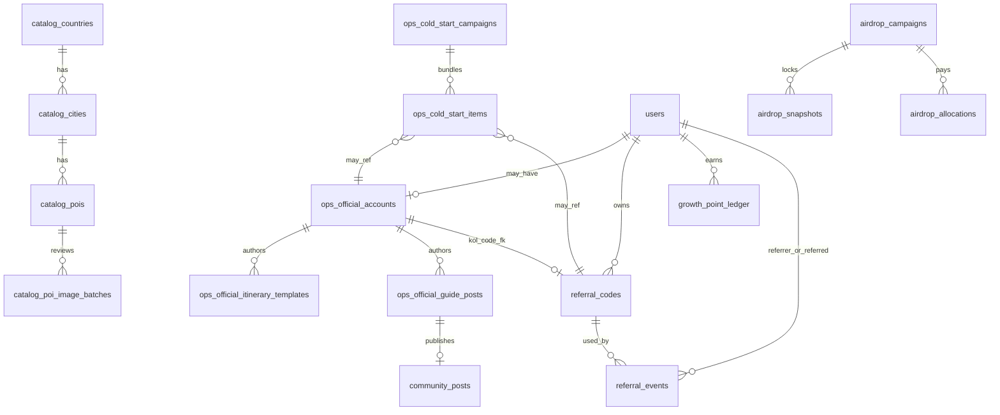
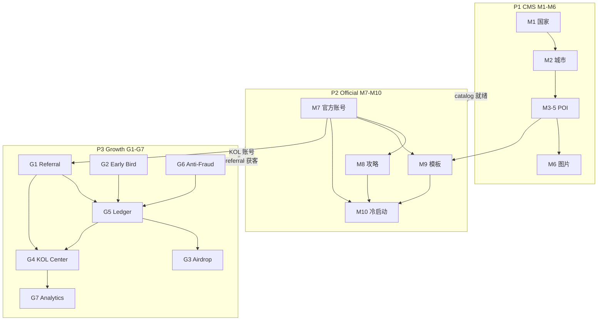

# 103 · CMS-OPS-Growth 统一架构补充（Addendum）

**Version:** 1.1.0 · **最后更新：** 2026-06-07  
**文档类型：** **Architecture Review Addendum（历史）** — 内容已吸收入 **[101 v1.1.0](./101-CMS与内容运营中心实施蓝图.md)**  
**状态：** **Archived · 归并完成 · 实施以 101 为准**  
**与 spec 关系**：**partial** — 统一导读；HTTP/RBAC 机读合入仍走 **04 §3.4** + **registry/admin-rbac-*.yaml**

> **SSOT（必读）**：本 Addendum **不替代** 101/102 分册细节；冲突时以 **101（CMS/Official OPS）** + **102（Growth）** + **FINAL System Audit 冻结边界** 为准。删 **spec** 须 **[08 §3](./08-文档与spec迁移台账.md#mig-2-matrix)** 程序。

**阶段口径**：**① → ② → ③**；本补充为 **① 架构归位**，不含实现 GO。

> **v1.1.0**：本 Addendum 已合入 **101**；保留本文仅供 Architecture Review 过程追溯。

**先读**：[101-CMS与内容运营中心实施蓝图 v1.1.0](./101-CMS与内容运营中心实施蓝图.md)

---

<a id="add103-0-review"></a>

## 0. Architecture Review 结论

### 0.1 101 十模块审查：Growth Center **整体遗漏**

| 101 原模块 | Growth 相关能力 | 101 覆盖 | 缺口 |
|------------|-----------------|----------|------|
| M1–M6 CMS | — | ✓ | — |
| M7 官方账号 | KOL **身份**创建 | **部分**（account_kind 无 referral 绑定） | 无 `referral_codes` 联动 |
| M8 官方攻略 | — | ✓ | — |
| M9 官方行程模板 | — | ✓ | — |
| M10 冷启动推荐 | **获客渠道** | **部分**（Campaign 无 referral 维度） | 无邀请码/积分/空投 |
| — | **Referral Codes** | **缺失** | → 102 |
| — | **Early Bird** | **缺失** | → 102 |
| — | **Airdrop Campaigns** | **缺失** | → 102 |
| — | **KOL Center（增长仪表盘）** | **缺失** | → 102（与 M7 分工） |
| — | **Reward Ledger / Points** | **缺失** | → 102 |
| — | **Anti-Fraud（增长专用）** | **缺失** | → 102 |
| — | **Growth Analytics** | **缺失** | → 102 |
| `/admin/trust-growth` | Banner A/B | **误关联** M10 | 与 Growth Center **不同系统** |

**审查结论**：101 的「十模块」正确覆盖 **Content + Official Seed**，但 **未将 Growth Center 列为独立架构平面**；冷启动 M10 与增长激励混在同一 OPS 叙事下 **不足**。本 Addendum 将 Growth 升格为 **第四平面**，与 CMS / Official OPS / Legacy Admin 并列。

### 0.2 归位原则（四平面）

| 平面 | Admin 组 id | 职责边界 | 文档 SSOT |
|------|-------------|----------|-----------|
| **P1 · Content（CMS）** | `content` | 国家/城市/POI/图片/交通 — 可发布内容资产 | **101** M1–M6 |
| **P2 · Official OPS** | `official_ops` | 官方账号/攻略/模板/冷启动 Campaign — `official_seed` 编排 | **101** M7–M10 |
| **P3 · Growth** | `growth` | Referral/Points/Early Bird/Airdrop/KOL 增长/防刷/增长分析 | **102** |
| **P4 · Legacy Admin** | 既有组 | 用户/订单/社区审核/财务/治理观测/trust-growth A/B | **40-D** / **70** |

**关键分工（消除重复建设）**

| 概念 | 归属 | 禁止 |
|------|------|------|
| KOL **官方账号**（是谁） | P2 · M7 `ops_official_accounts` | 在 Growth 重复建 user |
| KOL **邀请码**（怎么推） | P3 · `referral_codes` | 在 Official OPS 建码 |
| KOL **业绩仪表盘**（推得怎样） | P3 · `/admin/growth/kol-center` | 在 M7 页面堆 GMV |
| 冷启动 **内容/账号 seed** | P2 · M10 `ops_cold_start_*` | 在 Growth 写 content |
| 冷启动 **获客/激励** | P3 · Referral + Early Bird + Points | 在 M10 发积分 |
| Banner A/B | P4 · `/admin/trust-growth` | 并入 Growth Analytics |

---

<a id="add103-1-unified-modules"></a>

## 1. 统一模块清单（16 模块 · 四平面）

### 1.1 完整模块表

| ID | 平面 | 模块名 | Admin 路由 | 表前缀 | 优先级 |
|----|------|--------|------------|--------|--------|
| **M1** | P1 | 国家 | `/admin/content/countries` | `catalog_countries` | P0 |
| **M2** | P1 | 城市 | `/admin/content/cities` | `catalog_cities` | P0 |
| **M3** | P1 | 景区 | `/admin/content/pois?type=attraction` | `catalog_pois` | P0 |
| **M4** | P1 | 酒店 | `/admin/content/pois?type=hotel` | `catalog_pois` | P0 |
| **M5** | P1 | 美食 | `/admin/content/pois?type=food` | `catalog_pois` | P0 |
| **M6** | P1 | POI 图片 | `/admin/content/poi-images` | `catalog_poi_image_*` | P0 |
| **M7** | P2 | 官方账号 | `/admin/official/accounts` | `ops_official_accounts` | P0 |
| **M8** | P2 | 官方攻略 | `/admin/official/guides` | `ops_official_guide_posts` | P0 |
| **M9** | P2 | 官方行程模板 | `/admin/official/itinerary-templates` | `ops_official_itinerary_templates` | P0 |
| **M10** | P2 | 冷启动 Campaign | `/admin/official/cold-start` | `ops_cold_start_*` | P0 |
| **G1** | P3 | Referral Codes | `/admin/growth/referral-codes` | `referral_codes` | P0 |
| **G2** | P3 | Early Bird Program | `/admin/growth/early-bird` | `early_bird_stages` | P0 |
| **G3** | P3 | Airdrop Campaigns | `/admin/growth/airdrop-campaigns` | `airdrop_*` | P0 |
| **G4** | P3 | KOL Center | `/admin/growth/kol-center` | 读模型 · 联表 | P0 |
| **G5** | P3 | Reward Ledger | `/admin/growth/reward-ledger` | `growth_point_ledger` | P0 |
| **G6** | P3 | Anti-Fraud Center | `/admin/growth/anti-fraud` | `growth_fraud_*` | P0 |
| **G7** | P3 | Growth Analytics | `/admin/growth/analytics` | 聚合 · 无独立主表 | P1 |

**用户侧统一入口**

| 路由 | 平面 | 模块 |
|------|------|------|
| `/me/referrals` | P3 | G1/G3/G4/G5 只读聚合 |
| `/auth/register?ref=` | P3 | G1 |
| `GET /catalog/*` | P1 | M1–M6 |
| 公众 feed/market | P2 seed 产出 | M8–M10 deploy 后 |

---

<a id="add103-2-admin-menu"></a>

## 2. 统一 Admin 菜单结构

在现有 `ADMIN_SHELL_SIDEBAR_GROUPS` 中，**operations 与 community 之间**插入三组；**governance 之前**可选 Growth Hub 卡片。

```
Workspace                          （不变）
├── /admin
└── /admin/inbox

Onboarding                           （不变）

Operations                           （不变 · Legacy 交易 OPS）

★ Content Center          [content]
├── /admin/content
├── /admin/content/countries              M1
├── /admin/content/cities                 M2
├── /admin/content/pois                   M3–M5
├── /admin/content/poi-images             M6
└── /admin/content/publish-queue

★ Official Ops Center     [official_ops]
├── /admin/official
├── /admin/official/accounts              M7
├── /admin/official/itinerary-templates   M9
├── /admin/official/guides                M8
└── /admin/official/cold-start            M10

★ Growth Center           [growth]        ← 101 原十模块遗漏 · 102 归位
├── /admin/growth
├── /admin/growth/referral-codes          G1
├── /admin/growth/early-bird              G2
├── /admin/growth/airdrop-campaigns       G3
├── /admin/growth/kol-center              G4
├── /admin/growth/reward-ledger           G5
├── /admin/growth/anti-fraud              G6
└── /admin/growth/analytics               G7

Community                            （不变）
Finance                              （不变）
Governance                           （不变）
  └── /admin/trust-growth              P4 · Banner A/B（≠ Growth Center）
More                                 （不变）
```

### 2.1 Inbox 统一队列源（扩展）

| queue_key | 平面 | 触发 |
|-----------|------|------|
| `catalog_publish_pending` | P1 | M1–M6 publish 审批 |
| `poi_image_review_pending` | P1 | M6 批次 |
| `official_content_pending` | P2 | M8/M9 publish |
| `cold_start_deploy_pending` | P2 | M10 deploy |
| `airdrop_approve_pending` | P3 | G3 approve |
| `growth_fraud_review_pending` | P3 | G6 HIGH 命中 |
| `growth_points_adjust_pending` | P3 | G5 人工调账 |

---

<a id="add103-3-rbac"></a>

## 3. 统一 RBAC 权限矩阵

### 3.1 Permission 全集（CMS + OPS + Growth）

| Permission ID | 平面 | SuperAdmin only |
|---------------|------|-----------------|
| `admin.content.read` | P1 | |
| `admin.content.write` | P1 | |
| `admin.content.publish` | P1 | **是** |
| `admin.official.read` | P2 | |
| `admin.official.write` | P2 | |
| `admin.official.publish` | P2 | **是** |
| `admin.growth.read` | P3 | |
| `admin.growth.write` | P3 | |
| `admin.growth.publish` | P3 | **是** |
| `admin.growth.fraud` | P3 | |
| `admin.approve` | 横切 | **是**（已有） |
| `admin.trust_growth.write` | P4 | （已有 · A/B） |

### 3.2 六角色 × 十 permission（CMS/OPS/Growth）

| 角色 | content | official | growth.read | growth.write | growth.publish | growth.fraud |
|------|---------|----------|-------------|--------------|----------------|--------------|
| SuperAdmin | R+W+P | R+W+P | R | W | P | ✓ |
| Ops | R+W | R+W | R | W | — | ✓ |
| CS | R | R | R | — | — | — |
| Risk | R | R | R | — | — | ✓ |
| Finance | — | — | R | — | — | — |
| Auditor | R | R | R | — | — | — |

### 3.3 审批 action 横切注册表

| action | 平面 | 模块 |
|--------|------|------|
| `catalog.entity.publish` | P1 | M1–M5 |
| `catalog.poi_image.publish` | P1 | M6 |
| `ops.official.guide.publish` | P2 | M8 |
| `ops.itinerary_template.publish` | P2 | M9 |
| `ops.cold_start.deploy` | P2 | M10 |
| `growth.airdrop.approve` | P3 | G3 |
| `growth.points.manual_adjust` | P3 | G5 |
| `growth.referral_code.create_kol` | P3 | G1 |

**2FA 高危写（扩展 policy）**：`content.publish` · `official.publish` · `growth.publish` · `growth.fraud` 解封 · `ops.cold_start.deploy` · `growth.airdrop.approve`

---

<a id="add103-4-database"></a>

## 4. 统一数据模型

### 4.1 表族总览

| 表族 | 表数 | 平面 | SSOT 文档 |
|------|------|------|-----------|
| `catalog_*` | 8 | P1 | 101 §5 |
| `ops_*` | 6 | P2 | 101 §5 |
| `growth_*` / `referral_*` / `airdrop_*` / `early_bird_*` | 9 + users 扩展 | P3 | 102 §9 |
| **users 扩展列** | 5+5 合并见 §4.3 | P2+P3 | 本 Addendum |
| **community_posts 扩展** | 2 列 | P2 | 101 |
| **既有** | 103 表不变 | P4 | — |

**P0 新建合计**：**23 表** + **users ALTER（合并一次 migration）** + **community_posts ALTER**

### 4.2 实体关系（统一 ER）



### 4.3 users 表统一 ALTER（单次 migration）

```sql
-- P2 Official OPS（101）
-- （ops_official_accounts 独立表，users 不重复 official 标记）

-- P3 Growth（102）
ALTER TABLE users
  ADD COLUMN referral_code VARCHAR(64) UNIQUE,
  ADD COLUMN referred_by_user_id UUID REFERENCES users(id),
  ADD COLUMN growth_points BIGINT NOT NULL DEFAULT 0,
  ADD COLUMN early_bird_stage INT,
  ADD COLUMN growth_fraud_status TEXT NOT NULL DEFAULT 'normal';

-- 索引见 102 §9.1
```

### 4.4 跨平面 FK / 软链接

| 从 | 到 | 链接方式 | 用途 |
|----|-----|----------|------|
| `referral_codes.owner_user_id` | `users.id` | FK | KOL 码归属 |
| `referral_codes.owner_user_id` | `ops_official_accounts.user_id` | **同 user_id 对齐** | M7 创建 KOL 后 G1 绑码 |
| `referral_codes.region_iso` | `catalog_countries.iso3166` | 软链接 | 区域运营商 TT-CN001 |
| `ops_cold_start_items` | `referral_codes.id` | item_type=`referral_code` | M10 Campaign 推码 |
| `ops_cold_start_items` | `ops_official_*` | 既有 | 内容 seed |
| `growth_point_ledger.related_entity_id` | `orders.id` / `community_posts.id` | 多态 | Observer 投影 |
| `airdrop_allocations` | `growth_point_ledger` 快照 SUM | 无 FK · 快照时计算 | G3 |

### 4.5 数据所有权（避免双写）

| 数据 | 唯一 SSOT 表 | 投影/缓存 |
|------|-------------|-----------|
| 用户总积分 | `growth_point_ledger` SUM | `users.growth_points` |
| KOL GMV | `orders` + `referral_events` 聚合 | G4 读模型 · 无 GMV 表 |
| 官方帖 | `community_posts` | `ops_official_guide_posts` |
| 旅行 POI | `catalog_pois` published | 下线 `cityDetails` TS |
| 邀请统计 | `referral_events` | `/me/referrals` API 聚合 |

---

<a id="add103-5-api"></a>

## 5. 统一 API 命名空间

| 命名空间 | 平面 | 方法规模 |
|----------|------|----------|
| `GET /api/v1/catalog/*` | P1 | ~8 |
| `/api/v1/admin/content/*` | P1 | ~25 |
| `/api/v1/admin/official/*` | P2 | ~25 |
| `/api/v1/growth/*` | P3 用户 | ~5 |
| `/api/v1/admin/growth/*` | P3 Admin | ~30 |
| `POST /auth/register` (+ referral_code) | P3 | 1 变更 |
| `/api/v1/internal/catalog/import-*` | P1 | 1 |
| `/api/v1/internal/growth/award-points` | P3 | 2 |

**Handler 目录规划（additive）**

```
crates/api/src/routes/
├── catalog/           P1 公众读
├── admin/content/     P1
├── admin/official/    P2
├── admin/growth/      P3
└── growth/            P3 用户读
```

---

<a id="add103-6-dependencies"></a>

## 6. 跨平面依赖关系

### 6.1 依赖图（实施顺序约束）



### 6.2 冷启动 × 增长 统一 SOP（跨平面）

| 步骤 | 平面 | 动作 | 模块 |
|------|------|------|------|
| 1 | P1 | 发布 catalog + POI 图 | M1–M6 |
| 2 | P2 | batch-create 官方/KOL 账号 | M7 |
| 3 | P3 | 为 KOL 创建 `TT-KOL*` 码并绑定 | G1 ← M7 user_id |
| 4 | P2 | 发布攻略/模板 | M8–M9 |
| 5 | P3 | 配置 Early Bird 倍率 | G2 |
| 6 | P2 | M10 Campaign：items = 内容 + **referral_code** | M10 + G1 |
| 7 | P3 | 监控 Growth Analytics · 防刷 | G6/G7 |
| 8 | P3 | 快照 → Airdrop 计算（链下） | G3 |

### 6.3 并行 Sprint 建议（三轨）

| 轨 | Sprint | 平面 | 可并行 |
|----|--------|------|--------|
| **A** | S1–S6 | P1 CMS | 与 B 部分并行 |
| **B** | S4–S5 | P2 Official | 依赖 A 的 catalog import |
| **C** | G-S1–G-S5 | P3 Growth | G-S1 可与 A-S1 并行；G-S4 KOL 绑码依赖 B M7 |

**汇合闸**：**Unified GO-Local-Growth-CMS**（待建 smoke）— 三轨均 **exit 0** 后宣称 ① 冷启动闭环。

---

<a id="add103-7-overlap"></a>

## 7. 重叠消解清单

| 潜在重叠 | 裁决 | 理由 |
|----------|------|------|
| M7 vs G4 KOL | **M7 建人 · G4 看数** | 身份 vs 业绩 |
| M10 vs G1 Referral | **M10 编排 · G1 执行** | Campaign item 可引用码 |
| M10 vs G2 Early Bird | **G2 全局 · M10 不管倍率** | 早鸟按注册序号 |
| M10 vs G3 Airdrop | **分离** | 内容冷启动 ≠ 代币分配 |
| trust-growth vs G7 Analytics | **分离** | CTR 实验 vs 转化漏斗 |
| community risk vs G6 | **分离表 · 可互链** | 域不同 |
| P1 featured vs P2 cold-start items | **P2 ops_featured_slots P1** | 101 P1 项 |

---

<a id="add103-8-amendments"></a>

## 8. 对 101 / 102 的正式修订项

### 8.1 101 修订（文档级 · 下版 1.1.0）

1. **§0 执行摘要** — 增第四平面 **P3 Growth**，链本 Addendum  
2. **§1 十模块** — 脚注：「完整运营体系 = M1–M10 + G1–G7，见 **103**」  
3. **§3 Admin 菜单** — 插入 `growth` 组（本 Addendum §2）  
4. **§7 RBAC** — 合并 §3.1–3.2 十 permission  
5. **§9 M10** — 增 `ops_cold_start_items.item_type = referral_code`  
6. **§14 M7** — 增「创建 KOL 后须 G1 绑码」交接项  
7. **§10 P1-10 Banner** — 明确与 P4 trust-growth 并存，不与 G7 合并  

### 8.2 102 修订（文档级 · 下版 1.1.0）

1. **§14 与 101 集成** — 升格为 **103 §6.2 统一 SOP**  
2. **§9 referral_codes** — 增 optional `official_account_id UUID` FK → `ops_official_accounts`  
3. **§11 RBAC** — 与 Addendum §3 对齐十 permission 全集  

### 8.3 103 自身（本文件）

- 作为 **101 + 102 的架构上层索引**；实施时 **103 → 101/102 分册** 下钻，不第四份重复 DDL。

---

<a id="add103-9-boundary"></a>

## 9. 冻结域合规（全平面）

| 平面 | 允许 | 禁止 |
|------|------|------|
| P1 CMS | 新 catalog 表 · 公众读 API | 改订单/escrow |
| P2 Official | seed 写 posts/orders · Campaign | 改订单状态机 |
| P3 Growth | ledger append · Observer | 改 Escrow/支付/治理执行 |
| P4 Legacy | 只读 + 既有写路径 | — |

**Growth Observer**（P3）对 P4 业务域：**只读挂钩 + 异步 append**，见 102 §5.4。

---

<a id="add103-10-roadmap"></a>

## 10. 统一路线图（P0 汇合）

| 序 | 交付 | 平面 | 依赖 |
|----|------|------|------|
| 1 | 统一 migration 001：`catalog_*` | P1 | — |
| 2 | 统一 migration 002：`ops_*` + community_posts | P2 | — |
| 3 | 统一 migration 003：`growth_*` + users ALTER | P3 | — |
| 4 | RBAC 10 perm + 3 nav groups | 横切 | 1–3 |
| 5 | catalog import + public API | P1 | 1 |
| 6 | official batch + cold-start | P2 | 2,5 |
| 7 | referral + ledger + early bird | P3 | 3 |
| 8 | KOL bind + kol-center | P3 | 6,7 |
| 9 | M10+G1 campaign 联调 | P2+P3 | 6,8 |
| 10 | airdrop snapshot 链下 | P3 | 7 |
| 11 | `/me/referrals` + register ref | P3 | 7 |
| 12 | unified smoke exit 0 | 横切 | 9–11 |

**工作量汇合估算**

| 平面 | dev-days |
|------|----------|
| P1 CMS（101） | 95–120 |
| P2 Official（101） | 含上 |
| P3 Growth（102） | 55–70 |
| 横切 RBAC/Inbox/Smoke | 10–15 |
| **合计** | **~160–205**（三轨并行可压至 ~14–18 周） |

---

<a id="add103-11-owner"></a>

## 11. Owner 确认项（Addendum）

| # | 决策 | 建议 |
|---|------|------|
| 1 | Growth 升格为第四平面 P3 | **采纳** |
| 2 | 模块编号 M1–M10 + G1–G7 | **采纳** |
| 3 | KOL：M7 身份 + G1 码 + G4 仪表盘 | **采纳** |
| 4 | M10 Campaign 可引用 referral_code | **采纳** |
| 5 | users ALTER 单次 migration | **采纳** |
| 6 | RBAC 10 permission 一次扩展 | **采纳** |
| 7 | trust-growth 保持 P4 不并入 Growth | **采纳** |
| 8 | 101/102 升版 1.1.0 吸收本 Addendum | 待 Owner |
| 9 | 实施禁止越冻结域 | **强制** |
| 10 | 103 为架构 SSOT 索引 | **采纳** |

---

<a id="add103-12-refs"></a>

## 12. 文档索引

| 文档 | 角色 |
|------|------|
| **[101](./101-CMS与内容运营中心实施蓝图.md)** | P1+P2 分册 SSOT |
| **[102](./102-Referral与早鸟增长系统v1.0实施蓝图.md)** | P3 分册 SSOT |
| **103（本文）** | 统一架构 · 归位 · 依赖 · RBAC/菜单/DDL 汇合 |
| [40-D](./40-D-Admin机制.md) | Legacy Admin P4 |
| [FINAL-SYSTEM-AUDIT-REPORT](../../runbook/FINAL-SYSTEM-AUDIT-REPORT.md) | 冻结边界 |

---

**Addendum 状态**：**CMS & OPS Architecture Review COMPLETE** · Growth Center **已归位 P3** · **无代码变更**
