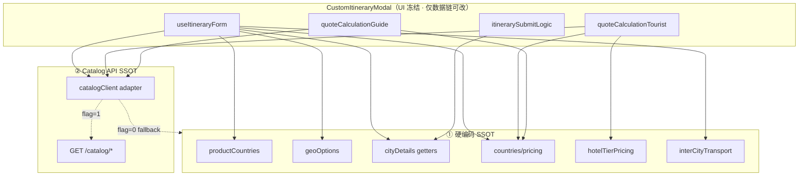

# 105 · S2 Catalog CMS 深度设计评审

**Version:** 1.0.0 · **最后更新：** 2026-06-07  
**文档类型：** **S2 Deep Design Review** — Content Center 闭环设计（**仅 P1 CMS**）  
**基准**：[104-Admin-Coverage-Gap-Report](./104-Admin-Coverage-Gap-Report.md) P0-ADM-01/07 · [101 v1.1.0](./101-CMS与内容运营中心实施蓝图.md) M1–M6 · S1 DDL  
**约束**：**禁止** Referral · Airdrop · Growth · Official OPS 实现；**不**改 Custom Itinerary **UI 结构**（FIVE-MAIN 冻结）；**不**改订单/Escrow/报价状态机逻辑 — 仅 **数据源 SSOT 迁移**。

> **SSOT**：HTTP 合入前写 **[04 §3.4](../../spec/04-后端与API.md)**；实现真源 S2 起 **`catalog_*` + Admin CRUD**；硬编码真源见 §2。

**阶段口径**：**① 设计评审 → ② S2 实现 → ③ S6 切流**；本文 = **设计评审完成**，不含代码。

**先读**：[104](./104-Admin-Coverage-Gap-Report.md) · [101](./101-CMS与内容运营中心实施蓝图.md) · [21-B-市场与托管机制](./21-B-市场与托管机制.md)

---

<a id="s2cms-0-goal"></a>

## 0. 设计目标

**运营人员无需改代码**即可维护：

| 能力 | 现硬编码 | S2 目标 |
|------|----------|---------|
| 十国/城市清单 | productCountries · geoOptions · preset_cities.rs | M1/M2 Admin CRUD + API |
| 景区/美食/POI | cityDetails/*.ts | M3–M5 Admin CRUD |
| POI 主图验收 | poiImageVerification/* | M6 批次审核发布 |
| 国家报价模板 | lib/countries/* | **M1-pricing** Admin |
| 酒店档次 | hotels.ts · hotelTierPricing.ts | **catalog_hotel_tiers** Admin |
| 城际交通规则 | interCityTransport.ts | **M2-transport** 规则 + routes |
| 首页国家氛围图 | landingAmbientByCountry.ts | M1 payload / 媒体库 |
| Custom Itinerary 选项 | 上述全部 | `GET /catalog/*` 只读聚合 |

**S2 退出标准（闭环）**

1. Admin 可 CRUD + 提交审核 + SuperAdmin 发布 **国家/城市/POI/定价/交通规则/POI 图**  
2. `POST /internal/catalog/import-from-cityDetails` 一次性导入 + **对拍测试 exit 0**  
3. `GET /catalog/pois?city=北京&type=attraction` 返回与 TS **published 集等价**  
4. CustomItineraryModal 在 `NEXT_PUBLIC_CATALOG_API_ENABLED=1` 下 **功能等价**（报价数值一致）  
5. **Growth/Official 路由零新增**

---

<a id="s2cms-1-inventory"></a>

## 1. 硬编码运营数据全量清单

### 1.1 主数据（目录）

| ID | 资产 | 路径 | ~行数 | 消费面 | CMS 模块 |
|----|------|------|-------|--------|----------|
| HC-C01 | 十国 ISO/中文名 | `productCountries.ts` | 30 | Landing/Market/注册/Itinerary API | **M1** |
| HC-C02 | 十国（Rust） | `crates/core/product_countries.rs` | 50 | POST itineraries · meta | **M1** |
| HC-C03 | 国家→城市 | `geoOptions.ts` CITIES_BY_COUNTRY | 114 | 筛选/行程/向导注册 | **M2** |
| HC-C04 | 预设城市（Rust） | `preset_cities.rs` | 53 | POST itineraries 校验 | **M2** |
| HC-C05 | 城市→地区 | `cityDetails/constants.ts` CITY_TO_REGION | 15 | 交通/选图 | **M2** payload |
| HC-C06 | 景区明细 | `attractions.ts` | 280 | CustomItineraryModal | **M3** |
| HC-C07 | 美食明细 | `food.ts` | 282 | 同上 | **M5** |
| HC-C08 | 酒店档次（非 named hotel） | `hotels.ts` HOTEL_TIERS | 56 | 行程卡片 | **M4-tier** |
| HC-C09 | 国家层 POI 索引 | `productCountryPoi.ts` | 232 | 语义/覆盖 | **M3–M5** payload |
| HC-C10 | 语义→库存图 | `poiSemanticMaps.ts` | 323 | 图片回退 | **M6** metadata |
| HC-C11 | 库存图池 | `poiStockPool.ts` | 110 | 图片 URL | **媒体库** |
| HC-C12 | 行程库存图 | `itineraryStockImages.ts` | 37 | 交通/默认图 | **媒体库** |

### 1.2 定价与交通（报价链）

| ID | 资产 | 路径 | 结构 | 消费面 | CMS 模块 |
|----|------|------|------|--------|----------|
| HC-P01 | 国家定价模板 ×10 | `lib/countries/{cn,jp,...}.ts` | `CountryPricingConfig` | quoteCalculation* | **catalog_pricing_templates** |
| HC-P02 | 定价索引 | `countries/index.ts` BY_COUNTRY | 78 | getPricingForCountry | 同上 |
| HC-P03 | 酒店档次倍数 | `hotelTierPricing.ts` | 3 tier × multiplier | 每晚预算 | **catalog_hotel_tiers** |
| HC-P04 | 城际 mode 规则 | `interCityTransport.ts` | 区域 Set + pair Set | 跨城日卡片 | **catalog_intercity_routes** + **catalog_transport_region_rules** |
| HC-P05 | 城际报价单价 | 嵌在 `CountryPricingConfig.intercityPricePerPerson` | flight/rail | 报价 | **pricing_templates** |

### 1.3 媒体与验收

| ID | 资产 | 路径 | 说明 | CMS 模块 |
|----|------|------|------|----------|
| HC-M01 | POI 候选批次 | `poiImageCandidates.ts` | 仅北京示范 | **M6** batch |
| HC-M02 | 白名单 | `poiImageWhitelist.ts` | ~空 | **catalog_poi_images_published** |
| HC-M03 | 图片 override | `attractionImageOverrides.ts` 等 | 硬编码 URL | POI payload / 媒体库 |
| HC-M04 | Landing 氛围 | `landingAmbientByCountry.ts` | 十国 Unsplash | **M1** payload `landing_ambient` |
| HC-M05 | 证据 markdown | `frontend/evidence/poi-image-verification/` | 人工验收 | M6 审计附件 |

### 1.4 Custom Itinerary 数据源依赖图



**Import 热点（S6 须改数据链 · 不动 layout）**

| 文件 | 依赖 |
|------|------|
| `useItineraryForm.ts` | geoOptions · cityDetails · countries |
| `quoteCalculationTourist.ts` | countries · hotelTierPricing |
| `quoteCalculationGuide.ts` | countries |
| `itinerarySubmitLogic.ts` | cityDetails · countries |
| `TouristDayCard*.tsx` | getAttraction/Food/HotelDetails |
| `GuideDayCardCrossCity*.tsx` | interCityTransport |
| `StickyFilterBar.tsx` | geoOptions |
| `landing/constants.ts` | geoOptions |

---

<a id="s2cms-2-er"></a>

## 2. Catalog CMS 实体关系图（S2 完整版）

### 2.1 逻辑 ER（含 S2 扩展表）

```mermaid
erDiagram
  catalog_countries ||--o{ catalog_cities : has
  catalog_countries ||--o| catalog_pricing_templates : prices
  catalog_countries ||--o{ catalog_media_assets : ambient_optional

  catalog_cities ||--o{ catalog_pois : contains
  catalog_cities ||--o{ catalog_poi_image_batches : reviews
  catalog_cities }o--|| catalog_countries : belongs

  catalog_pois ||--o| catalog_poi_images_published : hero_image
  catalog_pois }o--o| catalog_media_assets : payload_image_ref

  catalog_poi_image_batches ||--o{ catalog_poi_image_candidates : generates
  catalog_cities ||--o{ catalog_intercity_routes : from
  catalog_cities ||--o{ catalog_intercity_routes : to

  catalog_transport_region_rules }o--|| catalog_countries : region_default

  catalog_hotel_tier_definitions ||--o{ catalog_pois : tier_ref_optional

  catalog_countries ||--o{ catalog_content_revisions : versioned
  catalog_cities ||--o{ catalog_content_revisions : versioned
  catalog_pois ||--o{ catalog_content_revisions : versioned

  admin_approval_requests }o--|| catalog_pois : publish_gate
```

### 2.2 S1 已有 vs S2 新增表

| 表 | S1 migration | S2 设计新增 | 用途 |
|----|--------------|-------------|------|
| catalog_countries | ✓ | payload 扩展规范 | M1 + landing_ambient |
| catalog_cities | ✓ | payload.region_country_zh | M2 · CITY_TO_REGION |
| catalog_pois | ✓ | payload 分 type schema | M3–M5 |
| catalog_intercity_routes | ✓ | rules_json 规范化 | 成对交通 |
| catalog_poi_image_* | ✓ | — | M6 |
| catalog_content_revisions | ✓ | — | 版本/回滚 |
| **catalog_pricing_templates** | — | **S2-004** | 国家报价 |
| **catalog_hotel_tier_definitions** | — | **S2-004** | 三档酒店 |
| **catalog_transport_region_rules** | — | **S2-004** | 区域交通默认 |
| **catalog_media_assets** | — | **S2-004** | 媒体库 |

### 2.3 S2-004 DDL 草案（设计 · 未实现）

```sql
-- 国家报价模板（替代 lib/countries/*）
CREATE TABLE catalog_pricing_templates (
  id UUID PRIMARY KEY DEFAULT gen_random_uuid(),
  country_id UUID NOT NULL UNIQUE REFERENCES catalog_countries(id) ON DELETE CASCADE,
  currency_code CHAR(3) NOT NULL DEFAULT 'USD',
  city_transport_price JSONB NOT NULL,      -- { sedan, suv, van }
  intercity_price_per_person JSONB NOT NULL, -- { flight, rail }
  per_attraction_cents BIGINT NOT NULL,
  per_food_cents BIGINT NOT NULL,
  hotel_base_per_night_cents BIGINT NOT NULL,
  guide_levels_per_day JSONB NOT NULL,       -- primary..expert
  publish_status TEXT NOT NULL DEFAULT 'draft',
  version INT NOT NULL DEFAULT 1,
  published_at TIMESTAMPTZ,
  created_at TIMESTAMPTZ NOT NULL DEFAULT now(),
  updated_at TIMESTAMPTZ NOT NULL DEFAULT now()
);

-- 全球酒店档次定义（替代 HOTEL_TIERS + MULTIPLIER）
CREATE TABLE catalog_hotel_tier_definitions (
  id UUID PRIMARY KEY DEFAULT gen_random_uuid(),
  tier_code TEXT NOT NULL UNIQUE,            -- tier_economy|comfort|luxury
  sort_order INT NOT NULL,
  multiplier NUMERIC(4,2) NOT NULL DEFAULT 1.0,
  label_key TEXT NOT NULL,
  description_key TEXT NOT NULL,
  stock_image_asset_id UUID REFERENCES catalog_media_assets(id),
  publish_status TEXT NOT NULL DEFAULT 'published',
  version INT NOT NULL DEFAULT 1,
  created_at TIMESTAMPTZ NOT NULL DEFAULT now(),
  updated_at TIMESTAMPTZ NOT NULL DEFAULT now()
);

-- 区域/国家交通默认（替代 interCityTransport 区域分支）
CREATE TABLE catalog_transport_region_rules (
  id UUID PRIMARY KEY DEFAULT gen_random_uuid(),
  country_id UUID NOT NULL REFERENCES catalog_countries(id) ON DELETE CASCADE,
  default_modes TEXT[] NOT NULL,             -- ['rail','flight']
  rail_ui_label_key TEXT,
  flight_ui_label_key TEXT,
  notes TEXT,
  publish_status TEXT NOT NULL DEFAULT 'draft',
  version INT NOT NULL DEFAULT 1,
  UNIQUE(country_id)
);

-- 媒体库（Unsplash/上传引用 · 不存 bytes）
CREATE TABLE catalog_media_assets (
  id UUID PRIMARY KEY DEFAULT gen_random_uuid(),
  asset_kind TEXT NOT NULL CHECK (asset_kind IN (
    'poi_hero','landing_ambient','hotel_tier_stock','transport_stock','generic'
  )),
  source_type TEXT NOT NULL CHECK (source_type IN ('unsplash','upload','external_url')),
  url TEXT NOT NULL,
  source_page_url TEXT,
  license JSONB NOT NULL DEFAULT '{}',
  alt_text_zh TEXT,
  alt_text_en TEXT,
  country_id UUID REFERENCES catalog_countries(id),
  city_id UUID REFERENCES catalog_cities(id),
  poi_id UUID REFERENCES catalog_pois(id),
  publish_status TEXT NOT NULL DEFAULT 'draft',
  created_by UUID REFERENCES users(id),
  created_at TIMESTAMPTZ NOT NULL DEFAULT now(),
  updated_at TIMESTAMPTZ NOT NULL DEFAULT now()
);
```

### 2.4 POI payload JSON Schema（按 type）

**attraction / food（M3/M5）**

```json
{
  "image_url": "https://...",
  "image_asset_id": "uuid-optional",
  "description_zh": "...",
  "description_en": "...",
  "semantic_key": "forbidden_city",
  "stock_pool_key": "beijingForbiddenCity",
  "sort_weight": 100
}
```

**hotel — 两模式（M4）**

| 模式 | tier 字段 | payload | 说明 |
|------|-----------|---------|------|
| **Tier 模式（P0 默认）** | `tier_economy` 等 | 同 HOTEL_TIERS | 与 `catalog_hotel_tier_definitions` 联动 |
| **Named 模式（P1）** | null | name · image · stars | 未来 named 酒店 POI |

**catalog_countries.payload（M1 扩展）**

```json
{
  "guide_register_label_key": "community_region_cn",
  "landing_ambient": {
    "image_url": "https://...",
    "image_asset_id": "uuid",
    "video_slug": "cn"
  },
  "open_markets": ["landing", "market", "itinerary"]
}
```

**catalog_intercity_routes.rules_json**

```json
{
  "allowed_modes": ["rail"],
  "mode_only": true,
  "rail_label_override_key": "transport_rail_jp_shinkansen",
  "duration_min": 150,
  "price_override_cents": null
}
```

---

<a id="s2cms-3-admin"></a>

## 3. Admin CRUD 设计

### 3.1 页面路由（S2 实现范围）

| 路由 | 实体 | 操作 | Permission |
|------|------|------|------------|
| `/admin/content/countries` | M1 | list · create · edit | content.read/write |
| `/admin/content/countries/[id]` | M1 | 详情 · pricing tab · ambient | 同上 |
| `/admin/content/cities` | M2 | list · filter by country | 同上 |
| `/admin/content/cities/[id]` | M2 | edit · region · open_status | 同上 |
| `/admin/content/pois` | M3–M5 | list · `?type=&city=` | 同上 |
| `/admin/content/pois/[id]` | M3–M5 | edit payload · tier | 同上 |
| `/admin/content/pricing` | pricing_templates | 按国家编辑报价 | content.write |
| `/admin/content/hotel-tiers` | hotel_tier_definitions | 三档倍数/图 | content.write |
| `/admin/content/intercity-routes` | routes + rules | 成对编辑 | content.write |
| `/admin/content/poi-images` | M6 | batch list | content.read |
| `/admin/content/poi-images/batches/[id]` | M6 | 候选对比 · select | content.write |
| `/admin/content/media` | media_assets | 媒体库 | content.read/write |
| `/admin/content/publish-queue` | 全局 | 待审聚合 | content.read |
| `/admin/content/revisions/[entity]/[id]` | 审计 | 版本历史 · 回滚 | content.read |

**Hub 页（S1 已有）**：`/admin/content` 升级为模块卡片导航。

### 3.2 Admin API 清单（S2 · 写入 04 §3.4）

**公众只读**

| Method | Path | 说明 |
|--------|------|------|
| GET | `/api/v1/catalog/countries` | published 国家 |
| GET | `/api/v1/catalog/countries/:iso` | 含 pricing published |
| GET | `/api/v1/catalog/cities` | `?country_iso=` |
| GET | `/api/v1/catalog/cities/:id` | 含 region |
| GET | `/api/v1/catalog/pois` | `?city_id=&type=` |
| GET | `/api/v1/catalog/pois/:id` | 含 hero image |
| GET | `/api/v1/catalog/intercity-routes` | `?from_city=&to_city=` |
| GET | `/api/v1/catalog/hotel-tiers` | 三档定义 |
| GET | `/api/v1/catalog/poi-images/:poi_id` | published hero |
| GET | `/api/v1/meta/product_countries` | **改读** catalog（兼容） |

**Admin 写**

| Method | Path | 说明 |
|--------|------|------|
| GET/POST | `/api/v1/admin/content/countries` | CRUD |
| PATCH | `/api/v1/admin/content/countries/:id` | 乐观锁 version |
| POST | `/api/v1/admin/content/countries/:id/submit-review` | → in_review |
| POST | `/api/v1/admin/content/countries/:id/publish` | SuperAdmin |
| POST | `/api/v1/admin/content/countries/:id/archive` | 下架 |
| * | `/api/v1/admin/content/cities/*` | 同模式 |
| * | `/api/v1/admin/content/pois/*` | 同模式 |
| * | `/api/v1/admin/content/pricing-templates/*` | 国家报价 |
| * | `/api/v1/admin/content/hotel-tiers/*` | 档次 |
| * | `/api/v1/admin/content/intercity-routes/*` | 交通 |
| * | `/api/v1/admin/content/poi-image-batches/*` | M6 |
| * | `/api/v1/admin/content/media-assets/*` | 媒体库 |
| GET | `/api/v1/admin/content/publish-queue` | 聚合 |
| GET | `/api/v1/admin/content/revisions` | 审计 |
| POST | `/api/v1/admin/content/revisions/:id/rollback` | 回滚 |

**Internal**

| Method | Path | 说明 |
|--------|------|------|
| POST | `/api/v1/internal/catalog/import-from-cityDetails` | 一次性导入 |
| GET | `/api/v1/internal/catalog/import-coverage-report` | 对拍报告 |

### 3.3 列表 UX 要点

- **国家**：ISO · 中英文名 · open_status · publish_status · version · 最后发布  
- **城市**：所属国 · slug · POI 计数 · 图片覆盖率（M6 指标）  
- **POI**：type 色标 · legacy_value（迁移键）· 是否有 published 图  
- **定价**：仅 `publish_status=published` 进入报价 API  
- **交通**：from→to · allowed_modes · 与 TS 规则 diff 标记（导入后）

---

<a id="s2cms-4-workflow"></a>

## 4. 审核流（Publish Workflow）

### 4.1 状态机（全 catalog 实体统一）

```
draft ──submit-review──► in_review ──approve/publish──► published
   ▲                        │                              │
   │                        reject                         │
   └────────────────────────┘                              │
   ◄────────────────── archive ◄─────────────────────────┘
                              (published → archived)
```

| 状态 | 公众 API | Admin 编辑 |
|------|----------|--------------|
| draft | **不可见** | Ops 可改 |
| in_review | **不可见** | Ops 可改；出现在 publish-queue |
| published | **可见** | 改内容 → 新 draft 或 version+1（见 §5） |
| archived | **不可见** | 只读；可 restore→draft |

### 4.2 与既有审批链集成

| action | 触发 | 角色 |
|--------|------|------|
| `catalog.entity.publish` | M1–M5 · pricing · routes publish | SuperAdmin + `admin.approve` |
| `catalog.poi_image.publish` | M6 select→publish | SuperAdmin |
| `catalog.pricing.publish` | 报价模板发布 | SuperAdmin |

**publish-queue inbox 键**

| queue_key | 实体 |
|-----------|------|
| `catalog_publish_pending` | countries/cities/pois/pricing/routes in_review |
| `poi_image_review_pending` | M6 batch status=review |

### 4.3 双轨发布策略（已发布内容编辑）

**策略 A（推荐 · S2）**：Published 行 **原地 version++**

1. Ops PATCH published 行 → 自动 fork 为 `draft` 副本 **或** 同 ID `version+1` + `publish_status=draft`  
2. submit-review → SuperAdmin publish → 原子 swap published_at  

**策略 B（简单）**：每次编辑 published 必须先 **archive** 再新建 — **不采用**（运营负担大）

---

<a id="s2cms-5-version"></a>

## 5. 版本管理

### 5.1 字段

| 字段 | 用途 |
|------|------|
| `version INT` | 乐观锁；PATCH 须 `If-Match: version` |
| `published_at` | 最近一次发布 |
| `catalog_content_revisions` | append-only 快照 |

### 5.2 修订记录写入时机

| 事件 | action | before/after |
|------|--------|--------------|
| PATCH 任意字段 | `update` | 行级 JSON diff |
| submit-review | `submit_review` | status 变更 |
| publish | `publish` | 全行 after |
| archive | `archive` | status |
| rollback | `rollback` | 见 §6 |

### 5.3 并发控制

- PATCH 409：`catalog_version_conflict`  
- Admin UI：冲突时提示刷新并重填  
- 与 `config_releases` 相同乐观锁语义（101 原则）

---

<a id="s2cms-6-rollback"></a>

## 6. 回滚策略

### 6.1 单实体回滚

1. Admin 打开 `/admin/content/revisions?entity_type=catalog_pois&entity_id=…`  
2. 选择目标 `version` 的 `before_json` 或 `after_json`（publish 快照）  
3. SuperAdmin `POST …/revisions/rollback` + `admin.approve`  
4. 系统：当前行 → archived；插入新 draft **或** 直接 restore 为 published（选项 `mode=restore_published`）  
5. 写 `catalog_content_revisions` action=`rollback`

### 6.2 批量回滚（P1）

- 按 `import_batch_id`（导入时打标）回滚 — S2 **不实现**，仅登记  
- M6 图片回滚：恢复 `catalog_poi_images_published` 上一 revision 指向的 URL

### 6.3 紧急降级（运行时）

| 杠杆 | 效果 |
|------|------|
| `NEXT_PUBLIC_CATALOG_API_ENABLED=0` | FE 回退 cityDetails TS |
| 单国 `open_status=closed` | API 过滤；TS fallback 仍可读（S6 前） |
| archive 全部 POI | 公众 API 空 → FE fallback |

---

<a id="s2cms-7-media"></a>

## 7. 媒体库方案

### 7.1 原则

- **MVP 不存对象 bytes** — 与现有 `media/signed-urls` 治理链一致  
- 存 **URL + license + source 元数据**；上传走既有 presign 流程（P1）  
- M6 候选图 **必须** 可链到 `catalog_media_assets` 或 batch candidate

### 7.2 三层图像解析（替代 resolveVerifiedPoiImage 链）

```
1. catalog_poi_images_published.hero  （M6 验收 SSOT）
2. catalog_pois.payload.image_url / image_asset_id
3. catalog_media_assets stock_pool_key 语义回退（可选 · P1）
```

**禁止**：S2 仍写 `poiImageWhitelist.ts` — 导入时灌入 published 表。

### 7.3 M6 工作流（运营闭环）


| 步骤 | Admin 动作 | API |
|------|------------|-----|
| 建批次 | 选 city · type=attraction | POST poi-image-batches |
| 生成候选 | Unsplash/AI · 每 POI N 张 | POST …/generate-candidates |
| 审核 | 并排对比 · 备注 | PATCH candidates |
| 选定 | select candidate_id | POST …/select |
| 发布 | publish batch | POST …/publish → approval |

### 7.4 媒体库 Admin

- 搜索：country · city · kind · license  
- 禁止删除已 published 关联的 asset（archive only）  
- Unsplash import：保留 `source_page_url` + license JSON（合规）

---

<a id="s2cms-8-migration"></a>

## 8. 迁移路径（cityDetails → Catalog）

### 8.1 阶段

| 阶段 | 交付 | 公众面 |
|------|------|--------|
| **S1** ✓ | DDL + Hub + RBAC | 仍 TS |
| **S2a** | Admin CRUD + import + 对拍 | 仍 TS |
| **S2b** | GET /catalog/* + meta 改读 | API 可用 · FE flag=0 |
| **S3** | M6 北京→TOP10 城 图片 publish | 部分 POI 图 API |
| **S6** | FE adapter · flag=1 绿集 | TS fallback 保留 |

### 8.2 import-from-cityDetails 映射

| TS 源 | 目标表 | 键 |
|-------|--------|-----|
| PRODUCT_COUNTRIES | catalog_countries | iso3166 |
| CITIES_BY_COUNTRY | catalog_cities | country_id + name_zh slug |
| ATTRACTIONS_DETAILS_BY_CITY | catalog_pois type=attraction | legacy_value=value |
| FOOD details | catalog_pois type=food | 同上 |
| HOTEL_TIERS | catalog_hotel_tier_definitions | tier_code |
| BY_COUNTRY pricing | catalog_pricing_templates | country_id |
| interCityTransport Sets | catalog_intercity_routes + region_rules | pair + rules_json |
| CITY_TO_REGION | catalog_cities.payload.region_country_zh | — |
| LANDING_AMBIENT | catalog_countries.payload.landing_ambient | — |
| poiImageWhitelist | catalog_poi_images_published | poi_id |

**导入后 publish_status**：批量 `draft` → Ops 抽检 → 分批 publish（**非**自动 published）。

### 8.3 对拍测试（S2 退出）

| 测试 | 断言 |
|------|------|
| `cityDetailsCoverage.test.ts` | 每 city 每 type POI count = PG |
| `pricingParity.test.ts` | 十国 pricing 字段 = countries/*.ts |
| `interCityTransportParity.test.ts` | 全 pair allowed_modes 一致 |
| `productCountriesParity.test.ts` | ISO 序 = core/product_countries.rs |
| `presetCitiesParity.test.ts` | 城市清单 = preset_cities.rs |

### 8.4 Rust/TS 双写退役顺序

1. S2b：`GET /meta.product_countries` 读 catalog  
2. S6：`POST /itineraries` 校验改读 catalog cities（**或** cache 同步 job）  
3. S6+1：删除 `preset_cities.rs` 硬编码 **改为** catalog cache（需 core 读 PG 或 startup snapshot）  
4. 最后：删除 `cityDetails/*.ts` 生产 import（测试 fixture 可保留）

---

<a id="s2cms-9-pricing"></a>

## 9. 报价链设计（Custom Itinerary 不断逻辑）

### 9.1 数据流（发布后）

```
GET /catalog/countries/CN/pricing  → CountryPricingConfig 形状
GET /catalog/hotel-tiers           → tier multipliers
GET /catalog/intercity-routes      → allowed_modes + price
         ↓
frontend/catalogPricingAdapter.ts  （新建 · 同构 getPricingForCountry）
         ↓
quoteCalculationTourist/Guide      （**不改公式**）
```

### 9.2 字段映射（cents vs 元）

| TS 现字段 | DB 建议 | 说明 |
|-----------|---------|------|
| `hotelPerNightPerPerson: 50` | `hotel_base_per_night_cents: 5000` | 导入 ×100 |
| `perAttraction: 18` | `per_attraction_cents: 1800` | 同上 |
| `intercityPricePerPerson.flight: 400` | JSONB cents | 同上 |

Admin UI 显示「元/USD」；API 统一 **minor units**（与 finance 惯例对齐）。

### 9.3 酒店档次

| tier_code | multiplier | 来源 |
|-----------|------------|------|
| tier_economy | 1.0 | HOTEL_TIER_MULTIPLIER |
| tier_comfort | 1.65 | 同上 |
| tier_luxury | 2.5 | 同上 |

`hotelNightRatePerPerson(tier, pricing)` **公式不变** — 仅 pricing/tier 来源改 API。

---

<a id="s2cms-10-outscope"></a>

## 10. 明确排除（本轮不设计）

| 排除项 | 原因 |
|--------|------|
| Referral · Early Bird · Airdrop · Growth Analytics | Owner 指令 · 101 P3 |
| Official OPS M7–M10 | S4–S5 轨 |
| Market listing Admin | 104 P1-ADM-07 |
| 社区 UGC 内容 CMS | community moderation 已存在 |
| Landing **UI/layout** 变更 | FIVE-MAIN 冻结 |
| Escrow/订单 Admin 写 | FINAL Audit frozen |

---

<a id="s2cms-11-backlog"></a>

## 11. S2 工作包（设计→实现）

| ID | 包 | 依赖 | 退出 |
|----|-----|------|------|
| S2-DB-004 | migration pricing/tiers/media/rules | S1 apply | sqlx ok |
| S2-API-RO | GET /catalog/* | S2-DB-004 | contract test |
| S2-API-RW | admin/content CRUD | RBAC | RBAC smoke |
| S2-API-IMP | internal import | S2-API-RW | coverage exit 0 |
| S2-FE-ADM | Admin 全页 CRUD | S2-API-RW | 手工走通 publish |
| S2-FE-ADP | catalogClient adapter | S2-API-RO | flag=0 无回归 |
| S2-M6-MVP | 北京 batch 示范 | S2-FE-ADM | 1 城 POI 图 publish |
| S2-QA | smoke-admin-content-p0-local.sh | 全部 | exit 0 |

**估算**：~**35–45 dev-days**（S2 单轨；不含 S6 切流）

---

<a id="s2cms-12-gaps"></a>

## 12. 相对 104 的缺口消化

| 104 ID | S2 设计覆盖 |
|--------|-------------|
| P0-ADM-01 | §2–§3 全模块 |
| P0-ADM-07 | §7 M6 |
| P0-ADM-08 | §3.2 API 清单 |
| HC-01～HC-12 | §1 清单 + §8 import |
| P1-ADM-01 open_status | M1/M2 字段已有 |
| P1-ADM-02 定价 CMS | §9 catalog_pricing_templates |
| P1-ADM-10 Banner/SEO | landing_ambient in M1 payload（SEO P2） |

---

<a id="s2cms-13-refs"></a>

## 13. 真源索引

| 主题 | 路径 |
|------|------|
| 硬编码 POI | `frontend/lib/cityDetails/` |
| 定价 | `frontend/lib/countries/` |
| 地理 | `frontend/lib/geoOptions.ts` · `productCountries.ts` |
| Rust 锁 | `crates/core/preset_cities.rs` · `product_countries.rs` |
| 行程弹窗 | `frontend/components/market/CustomItineraryModal/` |
| S1 DDL | `crates/api/migrations/20260607120000_cms_catalog_p1.sql` |
| Admin 侧栏 | `frontend/lib/admin/adminShellContentNavLinks.ts` |
| 104 缺口 | [104-Admin-Coverage-Gap-Report.md](./104-Admin-Coverage-Gap-Report.md) |

---

**评审状态**：**S2 Catalog CMS Deep Design Review COMPLETE** · **无代码变更**  
**下一步（Schema v1.0 已冻结）**：落盘 S2-004 migration（逐字实现 [107-Catalog-Schema-v1.0](./107-Catalog-Schema-v1.0.md)）→ 见 [106](./106-Catalog-CMS-Implementation-Readiness-Report.md)
