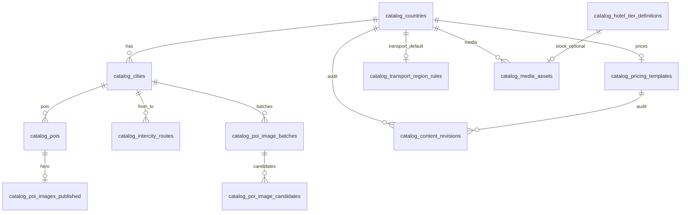

# 106 · Catalog CMS Implementation Readiness Report

**Version:** 1.0.0 · **最后更新：** 2026-06-07  
**文档类型：** **S2 Implementation Review** — S2-DB-004 数据模型验证 · Migration 审计 · 导入/回滚就绪度  
**基准**：[105-S2-Catalog-CMS深度设计评审](./105-S2-Catalog-CMS深度设计评审.md) · S1 `20260607120000_cms_catalog_p1.sql` · 105 §2.3 S2-004 草案  
**约束**：**仅 Catalog CMS 第一阶段**；**不含** Growth · Referral · Airdrop · Official OPS · **无业务代码变更**

> **SSOT**：本报告为 **Migration 审计登记**；DDL 定稿后写入 `crates/api/migrations/20260607130000_cms_catalog_s2_004.sql`（建议文件名）。

**阶段口径**：**① Implementation Review** → Owner 确认 §8 修订项 → **② 落盘 S2-004 migration** → ③ API/Admin。

**先读**：[105](./105-S2-Catalog-CMS深度设计评审.md) · [104](./104-Admin-Coverage-Gap-Report.md)

---

<a id="irr106-0-verdict"></a>

## 0. 总裁决

| 维度 | 裁决 | 说明 |
|------|------|------|
| **十国旅游内容运营（P0 范围）** | **CONDITIONAL GO** | S1 八表骨架 **基本满足**；S2-004 四表 **草案可用** 但须 **11 项 P0 修订** 后落盘 |
| **cityDetails 导入** | **GO（附映射规则）** | ~10 国 · **38 城** · ~**38×(景区+美食)** POI 行 · **3** 全局酒店档 · **10** 定价模板 |
| **POI 图片迁移** | **CONDITIONAL** | S1 候选表 **字段不足** vs `poiImageVerification/types.ts`；须扩列 + 批次元数据 |
| **价格模板迁移** | **GO** | `CountryPricingConfig` ↔ `catalog_pricing_templates` **1:1**；minor units 规则明确 |
| **交通规则迁移** | **CONDITIONAL** | **成对规则**须落 `catalog_intercity_routes`；`transport_region_rules` **仅兜底** |
| **酒店档次迁移** | **GO** | 3 行全局 `catalog_hotel_tier_definitions`；**勿**按城 import `catalog_pois type=hotel` |
| **回滚策略** | **CONDITIONAL** | `catalog_content_revisions` 已有；须增 **entity_type 约束 · import_batch · 路由/定价 revision** |

**Implementation Readiness：`CONDITIONAL GO`** — 完成 §8 P0 修订后即可启动 S2-004 migration 与 import 脚本设计（仍 **不**含 Growth/Official）。

---

<a id="irr106-1-volume"></a>

## 1. 导入量级（cityDetails 真源 · 十国）

| 实体 | 真源 | 导入行数（估） | 目标表 |
|------|------|----------------|--------|
| 国家 | PRODUCT_COUNTRIES ×10 | **10** | catalog_countries |
| 城市 | CITIES_BY_COUNTRY | **38** | catalog_cities |
| 景区 POI | ATTRACTIONS_DETAILS_BY_CITY ×38 城 | **~190–220** | catalog_pois (attraction) |
| 美食 POI | FOOD details ×38 城 | **~190–220** | catalog_pois (food) |
| 酒店档次 | HOTEL_TIERS（全局 3 档） | **3** | catalog_hotel_tier_definitions |
| 国家定价 | BY_COUNTRY ×10 | **10** | catalog_pricing_templates |
| 城际成对规则 | interCityTransport Sets + 区域分支 | **~80–150** 有向对 × mode | catalog_intercity_routes |
| 区域交通默认 | 十国 region 分支 | **10** | catalog_transport_region_rules |
| Landing 氛围 | LANDING_AMBIENT ×10 | **10** media + payload | catalog_media_assets + countries.payload |
| POI 验收批次 | poiImageCandidates（北京示范） | **1 batch · N 候选** | M6 表族 |

**不导入（P0）**

| 数据 | 原因 |
|------|------|
| LANGUAGES_BY_COUNTRY · SERVICE_TYPE_OPTIONS | 105/106 **P1**；暂留 geoOptions TS |
| 意大利/英国 city（constants 孤儿） | 不在十国 product 清单 |
| catalog_pois type=hotel 按城 ×3 | TS 为 **全局 tier**；见 §4.4 |

---

<a id="irr106-2-matrix"></a>

## 2. 逐表审计矩阵

**图例**：✅ 就绪 · ⚠️ 须修订 · ❌ 阻塞 · N/A S2-004 新增

| 表 | 状态 | 十国运营 | 导入 | 回滚 | 关键发现 |
|----|------|----------|------|------|----------|
| **catalog_countries** | ⚠️ | ✅ | ✅ | ✅ | payload 承载 landing · guide_register_label_key；缺 `open_status` CHECK |
| **catalog_cities** | ⚠️ | ✅ | ⚠️ | ✅ | 中文 slug 须规范；建议 UNIQUE(country_id, name_zh) |
| **catalog_pois** | ⚠️ | ✅ | ⚠️ | ✅ | hotel type 语义与 TS 不一致；attraction/food ✅ |
| **catalog_intercity_routes** | ⚠️ | ✅ | ⚠️ | ✅ | 须存 pair+mode+rules_json；不能只靠 region 表 |
| **catalog_pricing_templates** | ⚠️ N/A→新增 | ✅ | ✅ | ⚠️ | 缺 revision 挂钩；currency 文档化 |
| **catalog_hotel_tier_definitions** | ⚠️ N/A→新增 | ✅ | ✅ | ✅ | FK→media 循环；缺 submit_label_zh |
| **catalog_transport_region_rules** | ⚠️ N/A→新增 | ⚠️ | ⚠️ | ✅ | **不能单独**替代 interCityTransport |
| **catalog_media_assets** | ⚠️ N/A→新增 | ✅ | ✅ | ⚠️ | 缺 import_batch_id；M6 候选字段不全 |
| catalog_poi_image_batches | ⚠️ | ✅ | ⚠️ | ⚠️ | 缺 kind/poi_type · batch 级 status 枚举对齐 TS |
| catalog_poi_image_candidates | ❌ | ⚠️ | ❌ | ⚠️ | 缺 status/license/source_page/scene/notes |
| catalog_poi_images_published | ⚠️ | ✅ | ✅ | ⚠️ | 无历史快照列；回滚靠 revisions |
| catalog_content_revisions | ⚠️ | ✅ | N/A | ⚠️ | 缺 entity_type CHECK · batch · unique version |

---

<a id="irr106-3-s1"></a>

## 3. S1 表详细审计（已落盘 migration）

### 3.1 catalog_countries

**满足**

- iso3166 UNIQUE · 十国 ISO 锁死对齐 `product_countries.rs`
- publish_status 四态 · version 乐观锁 · payload JSONB（landing_ambient · guide_register_label_key）

**修订（P0）**

| ID | 项 | 建议 |
|----|-----|------|
| C-01 | `open_status` 无 CHECK | `CHECK (open_status IN ('open','closed','preview'))` |
| C-02 | 无 `import_batch_id` | payload 或列 `import_batch_id UUID` 便于批量回滚 |
| C-03 | sort_order 导入 | 按 PRODUCT_COUNTRIES 数组序 0..9 |

**导入映射**

```text
PRODUCT_COUNTRIES[i] → iso3166, name_zh, name_en, sort_order=i
landingAmbientByCountry → payload.landing_ambient + catalog_media_assets
guideRegisterLabelKey → payload.guide_register_label_key
```

---

### 3.2 catalog_cities

**满足**

- country_id FK · slug UNIQUE(country_id, slug)
- region_label 列 + payload 扩展

**修订（P0）**

| ID | 项 | 建议 |
|----|-----|------|
| CI-01 | slug 自中文名 | 规则：`slug = legacy_slugify(name_zh)` 或 import 表 `{北京→beijing}`；**禁止**随机 UUID slug |
| CI-02 | 幂等 | `UNIQUE (country_id, name_zh)` |
| CI-03 | CITY_TO_REGION | `payload.parent_country_zh` 或 `region_label` = 中国/日本… |
| CI-04 | 查询索引 | `INDEX (country_id, publish_status)` |

**Rust 对齐**：导入后 `preset_cities.rs` 校验 **name_zh 全等**（非 slug）。

---

### 3.3 catalog_pois

**满足（attraction / food）**

- `legacy_value` = TS `value`（故宫、全聚德烤鸭）
- description_zh · payload.image_url · semantic_key
- UNIQUE(city_id, poi_type, slug)

**修订（P0）**

| ID | 项 | 建议 |
|----|-----|------|
| P-01 | slug | `slugify(legacy_value)` 或 `legacy_value` 哈希短码 |
| P-02 | 图片 | import 写 payload.image_url；M6 publish 后 **以 published 为准** |
| P-03 | productCountryPoi | payload.semantic_key · stock_pool_key |
| P-04 | **hotel type** | **P0 不 import** 38×3 假 POI；酒店由 tier 表 + API `/catalog/hotel-tiers` |

**可迁移性**：✅ attraction/food **100%** 行级映射；food 默认图/region 图 import 时 materialize 到 payload。

---

### 3.4 catalog_intercity_routes

**满足（结构）**

- from/to city_id · mode · rules_json · publish_status

**修订（P0）**

| ID | 项 | 建议 |
|----|-----|------|
| R-01 | rules_json schema | `{ "allowed_modes":["rail"], "mode_only":true, "rail_label_key":"...", "priority":1 }` |
| R-02 | 导入算法 | 对十国 **38 城** 有向对：跑 TS `getInterCityTransportModes` → 每 mode 一行 |
| R-03 | 特殊对 | 悉尼↔墨尔本、巴黎↔尼斯等 **必须** 成对行，不能仅靠 region 默认 |
| R-04 | 新加坡 | 无城际 → **零行**（TS 返回 []） |
| R-05 | price_ref_cents | 可选；报价仍来自 pricing_templates.intercity |

**可迁移性**：⚠️ **逻辑等价可迁移**，但须 **离线生成** ~80–150 行；region_rules **不替代** pair Sets。

---

<a id="irr106-4-s2004"></a>

## 4. S2-004 草案表审计（未落盘）

### 4.1 catalog_pricing_templates — ⚠️ READY

| TS 字段 | DB 列 | 转换 |
|---------|-------|------|
| cityTransportPrice.sedan/suv/van | city_transport_price JSONB | ×100 → cents |
| intercityPricePerPerson | intercity_price_per_person JSONB | ×100 |
| perAttraction | per_attraction_cents | ×100 |
| perFood | per_food_cents | ×100 |
| hotelPerNightPerPerson | hotel_base_per_night_cents | ×100 |
| guideLevelsSuggestedPerDay | guide_levels_per_day JSONB | ×100 各档 |

**修订（P0）**

| ID | 项 |
|----|-----|
| PR-01 | `CHECK (per_*_cents >= 0)` |
| PR-02 | `updated_at TIMESTAMPTZ` |
| PR-03 | `entity_type='catalog_pricing_templates'` 纳入 revisions |
| PR-04 | `currency_code` 十国 import 默认 **`CNY` 展示口径**（与现 TS「元」一致）；API 层文档化 |

**回滚**：publish 快照入 revisions；rollback 恢复整行 JSON。

---

### 4.2 catalog_hotel_tier_definitions — ⚠️ READY

| TS | DB |
|----|-----|
| HOTEL_TIERS[].value | tier_code |
| HOTEL_TIER_MULTIPLIER | multiplier |
| labelKey / descriptionKey | label_key / description_key |
| HOTEL_TIER_SUBMIT_LABELS | **新增** `submit_label_zh TEXT` |
| tier image URL | stock_image_asset_id → media_assets |

**修订（P0）**

| ID | 项 |
|----|-----|
| HT-01 | **FK 顺序**：先 CREATE media_assets **无 FK** → seed tiers → 再 ALTER 加 FK；或 tier 表暂不 FK |
| HT-02 | 全局 3 行 seed：`tier_economy|tier_comfort|tier_luxury` |
| HT-03 | publish_status 默认 **published**（import 后即运营可用） |

**可迁移性**：✅ **100%**（3 行 + 3 媒体 asset）。

---

### 4.3 catalog_transport_region_rules — ⚠️ PARTIAL

**作用**：仅表达 `getInterCityTransportModes` 中 **区域默认分支**（无 pair 命中时）。

| 国家 | default_modes（import 建议） |
|------|-------------------------------|
| 日本/中国/韩国/… | `['rail','flight']` |
| 泰国 | `['rail','flight']`（flight_only 对靠 routes） |
| 阿联酋 | `['rail','flight']`（ground 对靠 routes mode_only rail） |
| 澳大利亚 | `['flight']` |
| 新加坡 | `[]` |

**修订（P0）**

| ID | 项 |
|----|-----|
| TR-01 | `rail_ui_label_key` 按国：JP→market_transportShinkansen 等（与 TS 函数对齐） |
| TR-02 | **禁止**指望本表单独实现 interCityTransport；**必须**配合 routes |

---

### 4.4 catalog_media_assets — ⚠️ READY

**用途**：landing_ambient · tier_stock · poi_hero · transport_stock · generic

**修订（P0）**

| ID | 项 |
|----|-----|
| M-01 | `import_batch_id UUID` |
| M-02 | `url TEXT NOT NULL` + 可选 `UNIQUE(url)` 防重复 import |
| M-03 | license JSONB：`{ "type":"unsplash", "text":"..." }` 对齐 TS |
| M-04 | publish_status 参与公众 API 过滤 |

---

<a id="irr106-5-m6"></a>

## 5. POI 图片链（M6）迁移审计

### 5.1 TS vs S1 字段差距

| TS 字段 | S1 catalog_poi_image_candidates | 裁决 |
|---------|--------------------------------|------|
| status PENDING/APPROVED/REJECTED | **缺失** | **P0 ADD** |
| sourcePageUrl | **缺失** | **P0 ADD** |
| sceneDescription | **缺失** | **P0 ADD** |
| license | **缺失** | **P0 ADD** |
| notes | metadata? | **P0 ADD** 或 metadata.notes |
| selectedCandidateId | batch 级 | batch 表 ADD `selected_candidate_id` |

### 5.2 导入路径（北京示范）

1. import POI rows（attraction）  
2. CREATE batch（city=北京 · kind=attraction）  
3. INSERT candidates from poiImageCandidates.ts  
4. **不自动 publish** — 运营 Admin 审核后 publish  
5. whitelist → `catalog_poi_images_published`

### 5.3 回滚

| 层级 | 机制 |
|------|------|
| 单 POI 图 | revisions 记录 published 行 before/after；rollback 恢复 URL |
| 整 batch | batch.status→archived；published 行批量 revert |
| import 批次 | `import_batch_id` 标记 → P1 批量 archive |

**就绪度**：❌ **须 S2-004b 扩列 migration**（可与 S2-004 同文件 §8）。

---

<a id="irr106-6-rollback"></a>

## 6. 回滚策略就绪度

### 6.1 机制（105 设计 vs S1 实现）

| 能力 | S1 | 缺口 |
|------|-----|------|
| 行 version 乐观锁 | ✅ 主表 | pricing/tiers/rules/media 同步 |
| catalog_content_revisions | ✅ | entity_type 无 ENUM；无 UNIQUE(entity,version) |
| publish 快照 | 设计有 | API 未实现 |
| Admin rollback API | 设计有 | 未实现 |
| FE fallback | TS 保留 | `CATALOG_API_ENABLED=0` |
| 单国 closed | open_status | CHECK 未加 |

### 6.2 导入回滚（P0 设计）

```text
import_batch_id = uuid_v4()  -- 单次 import 运行
所有 insert 行写入 import_batch_id（列或 payload.meta.import_batch_id）
回滚：WHERE import_batch_id = ? → archive 或 DELETE draft 行
published 行：须走 revisions rollback，禁止 CASCADE 误删
```

### 6.3 裁决

**回滚策略：CONDITIONAL GO** — revisions 表 **足够**；须 **import_batch + M6 扩列 + rollback API**（S2 实现项，非 DDL 阻塞）。

---

<a id="irr106-7-import"></a>

## 7. 可迁移性总表

| 源 | 目标 | 就绪 | 阻塞项 |
|----|------|------|--------|
| productCountries + landing | countries + media | ✅ | C-01..03 |
| geoOptions cities | cities | ✅ | CI-01 slug |
| attractions.ts | pois attraction | ✅ | P-01..03 |
| food.ts | pois food | ✅ | region 默认图 materialize |
| hotels.ts HOTEL_TIERS | hotel_tier_definitions | ✅ | HT-01 FK 顺序 |
| hotelTierPricing | tier.multiplier | ✅ | — |
| countries/*.ts | pricing_templates | ✅ | PR-04 货币 |
| interCityTransport | routes + region_rules | ⚠️ | R-01 离线生成器 |
| poiImageCandidates | batches/candidates | ❌ | M6 扩列 |
| poiImageWhitelist | poi_images_published | ✅ | 空 whitelist 无阻 |

---

<a id="irr106-8-amendments"></a>

## 8. S2-004 定稿修订清单（P0 · Owner 确认后落盘）

| # | 修订 | 影响表 |
|---|------|--------|
| 1 | 新增四表：pricing_templates · hotel_tier_definitions · transport_region_rules · media_assets（105 草案 + §8 列修正） | S2-004 |
| 2 | `catalog_countries.open_status` CHECK | S2-004 ALTER |
| 3 | `catalog_cities UNIQUE(country_id, name_zh)` + slug 规范文档 | S2-004 ALTER |
| 4 | `catalog_pois` — **文档** P0 不 import type=hotel 按城 | 导入脚本 |
| 5 | `catalog_poi_image_candidates` + batches **扩列**（§5.1） | S2-004 |
| 6 | 全表 `import_batch_id UUID NULL` 或 payload 统一键 | S2-004 |
| 7 | `catalog_hotel_tier_definitions.submit_label_zh` | S2-004 |
| 8 | `catalog_pricing_templates.updated_at` + CHECK cents | S2-004 |
| 9 | `catalog_content_revisions` ADD CHECK entity_type IN (...) | S2-004 ALTER |
| 10 | media_assets 先于 tier FK；或 tier.stock_image_asset_id **无 FK** 首期 | S2-004 |
| 11 | `intercity_routes` 导入规范 + rules_json JSON Schema 文档化 | 导入脚本 |

**建议 migration 文件名**

`20260607130000_cms_catalog_s2_004_pricing_tiers_media.sql`

**可选同文件 Part B**：`ALTER` S1 表 M6 扩列 + countries/cities 约束。

---

<a id="irr106-9-er"></a>

## 9. 定稿 ER（Implementation 视角）



**FK 创建顺序（migration 脚本）**

1. catalog_media_assets（无 tier FK 依赖）  
2. catalog_hotel_tier_definitions  
3. catalog_pricing_templates · catalog_transport_region_rules  
4. ALTER candidates/batches · countries/cities constraints  

---

<a id="irr106-10-outscope"></a>

## 10. 明确排除

| 排除 | 原因 |
|------|------|
| Growth / Referral / Airdrop | Owner 指令 |
| ops_* · official_* | Official OPS S4+ |
| LANGUAGES_BY_COUNTRY CMS | P1 · 104 P1 |
| Admin API / FE adapter | S2 实现轨，本报告仅 DDL |

---

<a id="irr106-11-next"></a>

## 11. 下一步（Implementation 轨）

| 序 | 动作 | 退出 |
|----|------|------|
| 1 | Owner 确认 §8 **11 项 P0** | 签字 |
| 2 | 落盘 S2-004 migration + `sqlx migrate run` | 12 表 + 4 新表 apply |
| 3 | 编写 import 规范（含 intercity 离线生成器 **设计**） | 106 附录或 runbook |
| 4 | parity tests 清单（105 §8.3） | 用例登记 |
| 5 | S2-API-RO `GET /catalog/*` | ④ 之后 |

---

<a id="irr106-12-refs"></a>

## 12. 审计真源

| 主题 | 路径 |
|------|------|
| S1 DDL | `crates/api/migrations/20260607120000_cms_catalog_p1.sql` |
| S2-004 | **未落盘** · 105 §2.3 草案 |
| 覆盖测试 | `frontend/lib/cityDetails/cityDetailsCoverage.test.ts` |
| 交通逻辑 | `frontend/lib/cityDetails/interCityTransport.ts` |
| 定价 | `frontend/lib/countries/types.ts` |
| M6 类型 | `frontend/lib/cityDetails/poiImageVerification/types.ts` |
| 105 设计 | [105-S2-Catalog-CMS深度设计评审.md](./105-S2-Catalog-CMS深度设计评审.md) |

---

**报告状态**：**S2 Catalog CMS Implementation Review COMPLETE** · **CONDITIONAL GO**  
**DDL 状态**：**107-Catalog-Schema-v1.0 FROZEN** → S2-004 migration 一次落盘 · 见 [107](./107-Catalog-Schema-v1.0.md)
