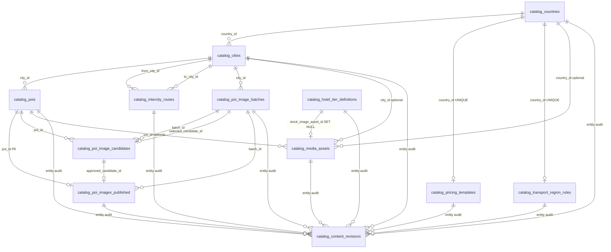

# 107 · Catalog Schema v1.0（DDL Finalization）

**Version:** 1.0.0 · **状态：** **FROZEN** · **最后更新：** 2026-06-07  
**文档类型：** **Catalog DDL Finalization Review** — ER · 表定义 · 约束 · 索引 · FK · Import Batch · Media Lifecycle  
**基准**：[106-Catalog-CMS-Implementation-Readiness-Report](./106-Catalog-CMS-Implementation-Readiness-Report.md) §8 · [105-S2-Catalog-CMS深度设计评审](./105-S2-Catalog-CMS深度设计评审.md) · S1 `20260607120000_cms_catalog_p1.sql`  
**约束**：**仅 Catalog CMS P0**；**禁止** Growth · Referral · Airdrop · Official OPS；**本文不含 migration SQL**

> **SSOT**：本文为 **Catalog Schema v1.0 冻结稿**。S2-004 migration **必须逐字实现**本文；偏离须新开 **107 v1.1** 修订 PR，**禁止** silent drift。

**先读**：[106](./106-Catalog-CMS-Implementation-Readiness-Report.md) · [105](./105-S2-Catalog-CMS深度设计评审.md)

---

<a id="cs107-0-verdict"></a>

## 0. Finalization 总裁决

| 项 | 裁决 |
|----|------|
| **106 §8 十一项 P0** | **全部 ACCEPTED**（见 §1 逐项签核） |
| **Catalog Schema v1.0** | **FROZEN** — 12 表 · 无新表超出本稿 |
| **S2-004 一次落盘** | **GO** — 按 §6 FK 顺序 + §3–§5 表定义，**无需返工** |
| **migration SQL** | **不在本文** — 实现轨单独 PR |

---

<a id="cs107-1-p0-signoff"></a>

## 1. §8 P0 逐项 Finalization 签核

| # | 106 §8 修订 | Finalization 裁决 | v1.0 落点 |
|---|-------------|-------------------|-----------|
| **1** | 新增四表 + 列修正 | **ACCEPTED** | §3.8–§3.11 完整定义 |
| **2** | `countries.open_status` CHECK | **ACCEPTED** | §3.1 · 同步 **cities.open_status** |
| **3** | `cities UNIQUE(country_id, name_zh)` + slug 规范 | **ACCEPTED** | §3.2 · §7.2 |
| **4** | P0 不 import `pois type=hotel` 按城 | **ACCEPTED（策略）** | §7.3 · 非 DDL 删列 |
| **5** | M6 batches/candidates 扩列 | **ACCEPTED** | §3.9–§3.11 · §5 |
| **6** | 全表 `import_batch_id` | **ACCEPTED** | §3 各表 · §8 |
| **7** | `hotel_tier_definitions.submit_label_zh` | **ACCEPTED** | §3.9 |
| **8** | `pricing_templates.updated_at` + cents CHECK | **ACCEPTED** | §3.8 |
| **9** | `content_revisions.entity_type` CHECK + UNIQUE | **ACCEPTED** | §3.12 |
| **10** | media 先于 tier FK | **ACCEPTED** | §6.2 · tier FK **nullable SET NULL** |
| **11** | intercity `rules_json` JSON Schema | **ACCEPTED** | §4 · §7.4 |

**§8 #4 说明**：`catalog_pois.poi_type='hotel'` **保留列值**供 P1 Named Hotel；P0 import **零行** hotel POI。

**§8 #10 说明**：**无循环 FK**。`catalog_media_assets` 不引用 tier；`stock_image_asset_id` 为 **NULL 可** FK → media，创建顺序 media → tiers。

---

<a id="cs107-2-er"></a>

## 2. ER Diagram（v1.0 冻结）



**表计数**：**12**（S1 八表 + S2 四表；M6 三表为 S1 子集，非新表）。

---

<a id="cs107-3-tables"></a>

## 3. Table Definitions（v1.0）

**全局列约定（所有 12 表）**

| 列 | 类型 | 说明 |
|----|------|------|
| `import_batch_id` | `UUID NULL` | 批量导入标记；手工编辑 **NULL** |
| `publish_status` | `TEXT` | 四态（除 revisions）：`draft` · `in_review` · `published` · `archived` |
| `version` | `INT NOT NULL DEFAULT 1` | 乐观锁（**revisions 除外**） |
| `created_at` / `updated_at` | `TIMESTAMPTZ` | 审计时间戳 |

**publish_status CHECK（凡含此列）**

```text
CHECK (publish_status IN ('draft','in_review','published','archived'))
```

---

### 3.1 catalog_countries（S1 + S2 ALTER）

| 列 | 类型 | 约束 | 说明 |
|----|------|------|------|
| id | UUID | PK, DEFAULT gen_random_uuid() | |
| iso3166 | CHAR(2) | NOT NULL, UNIQUE | 十国 ISO |
| name_zh | TEXT | NOT NULL | |
| name_en | TEXT | NOT NULL | |
| sort_order | INT | NOT NULL DEFAULT 0 | import 0..9 |
| open_status | TEXT | NOT NULL DEFAULT 'open' | **CHECK** §3.1.1 |
| publish_status | TEXT | NOT NULL | 四态 CHECK |
| version | INT | NOT NULL DEFAULT 1 | |
| payload | JSONB | NOT NULL DEFAULT '{}' | §3.1.2 |
| import_batch_id | UUID | NULL | **S2 增** |
| published_at | TIMESTAMPTZ | NULL | |
| created_at | TIMESTAMPTZ | NOT NULL DEFAULT now() | |
| updated_at | TIMESTAMPTZ | NOT NULL DEFAULT now() | |

**§3.1.1 open_status CHECK**

```text
CHECK (open_status IN ('open','closed','preview'))
```

**§3.1.2 payload 键（P0）**

| 键 | 类型 | 说明 |
|----|------|------|
| guide_register_label_key | string | i18n key |
| landing_ambient | object | `{ image_url, image_asset_id?, video_slug? }` |
| open_markets | string[] | 可选 |

**索引**

| 名 | 列 |
|----|-----|
| idx_catalog_countries_publish | (publish_status, sort_order) |
| idx_catalog_countries_import_batch | (import_batch_id) WHERE import_batch_id IS NOT NULL |

---

### 3.2 catalog_cities（S1 + S2 ALTER）

| 列 | 类型 | 约束 | 说明 |
|----|------|------|------|
| id | UUID | PK | |
| country_id | UUID | NOT NULL, FK → countries ON DELETE CASCADE | |
| slug | TEXT | NOT NULL | §7.2 |
| name_zh | TEXT | NOT NULL | **UNIQUE(country_id, name_zh)** |
| name_en | TEXT | NOT NULL | |
| region_label | TEXT | NULL | 中国/日本… |
| sort_order | INT | NOT NULL DEFAULT 0 | |
| open_status | TEXT | NOT NULL DEFAULT 'open' | 同 countries CHECK |
| publish_status | TEXT | NOT NULL | 四态 CHECK |
| version | INT | NOT NULL DEFAULT 1 | |
| payload | JSONB | NOT NULL DEFAULT '{}' | parent_country_zh 等 |
| import_batch_id | UUID | NULL | **S2 增** |
| published_at | TIMESTAMPTZ | NULL | |
| created_at / updated_at | TIMESTAMPTZ | NOT NULL | |

**UNIQUE**

- `(country_id, slug)`
- `(country_id, name_zh)` — **S2 增**

**索引**

| 名 | 列 |
|----|-----|
| idx_catalog_cities_country_id | (country_id) |
| idx_catalog_cities_country_publish | (country_id, publish_status) — **S2 增** |
| idx_catalog_cities_import_batch | (import_batch_id) WHERE NOT NULL |

---

### 3.3 catalog_pois（S1 + S2 ALTER）

| 列 | 类型 | 约束 | 说明 |
|----|------|------|------|
| id | UUID | PK | |
| city_id | UUID | NOT NULL, FK → cities CASCADE | |
| poi_type | TEXT | NOT NULL | CHECK §3.3.1 |
| slug | TEXT | NOT NULL | slugify(legacy_value) |
| name_zh / name_en | TEXT | NOT NULL | |
| description_zh / description_en | TEXT | NULL | 列 + payload 双写可选 |
| tier | TEXT | NULL | P1 named hotel |
| tags | TEXT[] | NOT NULL DEFAULT '{}' | |
| sort_order | INT | NOT NULL DEFAULT 0 | |
| publish_status | TEXT | NOT NULL | 四态 CHECK |
| version | INT | NOT NULL DEFAULT 1 | |
| payload | JSONB | NOT NULL DEFAULT '{}' | §3.3.2 |
| legacy_value | TEXT | NULL | TS value 真源 |
| import_batch_id | UUID | NULL | **S2 增** |
| published_at | TIMESTAMPTZ | NULL | |
| created_at / updated_at | TIMESTAMPTZ | NOT NULL | |

**§3.3.1 poi_type CHECK**

```text
CHECK (poi_type IN ('attraction','hotel','food'))
```

**§3.3.2 payload 键（attraction/food P0）**

| 键 | 说明 |
|----|------|
| image_url | import 默认图；M6 publish 后 **published 优先** |
| image_asset_id | 可选 FK 语义 |
| semantic_key | productCountryPoi |
| stock_pool_key | 语义池 |
| sort_weight | int |

**UNIQUE** `(city_id, poi_type, slug)`

**索引**

| 名 | 列 |
|----|-----|
| idx_catalog_pois_city_type | (city_id, poi_type) |
| idx_catalog_pois_legacy | (legacy_value) WHERE legacy_value IS NOT NULL |
| idx_catalog_pois_import_batch | (import_batch_id) WHERE NOT NULL |

---

### 3.4 catalog_intercity_routes（S1 + S2 ALTER）

| 列 | 类型 | 约束 | 说明 |
|----|------|------|------|
| id | UUID | PK | |
| from_city_id | UUID | NOT NULL, FK → cities CASCADE | |
| to_city_id | UUID | NOT NULL, FK → cities CASCADE | |
| mode | TEXT | NOT NULL | CHECK §3.4.1 |
| duration_min | INT | NULL | 可选 |
| price_ref_cents | BIGINT | NULL | 可选；报价主源 pricing_templates |
| rules_json | JSONB | NOT NULL DEFAULT '{}' | §4 |
| publish_status | TEXT | NOT NULL | 四态 CHECK |
| version | INT | NOT NULL DEFAULT 1 | |
| import_batch_id | UUID | NULL | **S2 增** |
| published_at | TIMESTAMPTZ | NULL | |
| created_at / updated_at | TIMESTAMPTZ | NOT NULL | |

**§3.4.1 约束**

```text
CHECK (mode IN ('flight','rail'))
CHECK (from_city_id <> to_city_id)
UNIQUE (from_city_id, to_city_id, mode)
```

**索引**

| 名 | 列 |
|----|-----|
| idx_catalog_intercity_from_to | (from_city_id, to_city_id) |
| idx_catalog_intercity_publish | (publish_status) |
| idx_catalog_intercity_import_batch | (import_batch_id) WHERE NOT NULL |

**语义**：每 **有向** city 对 × 可用 **mode** 一行；TS `getInterCityTransportModes` 离线展开。

---

### 3.5 catalog_media_assets（S2 新表）

| 列 | 类型 | 约束 | 说明 |
|----|------|------|------|
| id | UUID | PK | |
| asset_kind | TEXT | NOT NULL | CHECK §3.5.1 |
| source_type | TEXT | NOT NULL | CHECK §3.5.2 |
| url | TEXT | NOT NULL | **UNIQUE** |
| source_page_url | TEXT | NULL | |
| license | JSONB | NOT NULL DEFAULT '{}' | `{ type, text }` |
| alt_text_zh / alt_text_en | TEXT | NULL | |
| stock_pool_key | TEXT | NULL | P1 语义回退 |
| country_id | UUID | NULL, FK → countries SET NULL | |
| city_id | UUID | NULL, FK → cities SET NULL | |
| poi_id | UUID | NULL, FK → pois SET NULL | |
| publish_status | TEXT | NOT NULL DEFAULT 'draft' | 四态 CHECK |
| version | INT | NOT NULL DEFAULT 1 | |
| import_batch_id | UUID | NULL | |
| created_by | UUID | NULL, FK → users SET NULL | |
| published_at | TIMESTAMPTZ | NULL | |
| created_at / updated_at | TIMESTAMPTZ | NOT NULL | |

**§3.5.1 asset_kind CHECK**

```text
CHECK (asset_kind IN (
  'poi_hero','landing_ambient','hotel_tier_stock','transport_stock','generic'
))
```

**§3.5.2 source_type CHECK**

```text
CHECK (source_type IN ('unsplash','upload','external_url'))
```

**索引**

| 名 | 列 |
|----|-----|
| idx_catalog_media_kind_publish | (asset_kind, publish_status) |
| idx_catalog_media_country | (country_id) WHERE country_id IS NOT NULL |
| idx_catalog_media_poi | (poi_id) WHERE poi_id IS NOT NULL |
| idx_catalog_media_import_batch | (import_batch_id) WHERE NOT NULL |

**存储原则**：仅存 **URL 引用**，不存 bytes。

---

### 3.6 catalog_pricing_templates（S2 新表）

| 列 | 类型 | 约束 | 说明 |
|----|------|------|------|
| id | UUID | PK | |
| country_id | UUID | NOT NULL, UNIQUE, FK → countries CASCADE | 一国一行 |
| currency_code | CHAR(3) | NOT NULL DEFAULT 'CNY' | 展示口径 §3.6.1 |
| city_transport_price | JSONB | NOT NULL | `{ sedan, suv, van }` **cents** |
| intercity_price_per_person | JSONB | NOT NULL | `{ flight, rail }` **cents** |
| per_attraction_cents | BIGINT | NOT NULL | ≥0 |
| per_food_cents | BIGINT | NOT NULL | ≥0 |
| hotel_base_per_night_cents | BIGINT | NOT NULL | ≥0 |
| guide_levels_per_day | JSONB | NOT NULL | `{ primary, intermediate, advanced, expert }` **cents** |
| publish_status | TEXT | NOT NULL DEFAULT 'draft' | 四态 CHECK |
| version | INT | NOT NULL DEFAULT 1 | |
| import_batch_id | UUID | NULL | |
| published_at | TIMESTAMPTZ | NULL | |
| created_at / updated_at | TIMESTAMPTZ | NOT NULL | |

**§3.6.1 currency_code**

- P0 import 十国默认 **`CNY`**（与 TS「元」整数一致；API 文档化 minor units）。
- 列保留扩展他国本地币。

**CHECK**

```text
CHECK (per_attraction_cents >= 0)
CHECK (per_food_cents >= 0)
CHECK (hotel_base_per_night_cents >= 0)
-- JSONB 内各值 ≥0 由 import/API 校验；DB 可选 jsonb 路径 CHECK P1
```

**JSONB 键约束（应用层 + import 强制）**

| 键 | 必须 |
|----|------|
| city_transport_price | sedan, suv, van |
| intercity_price_per_person | flight, rail |
| guide_levels_per_day | primary, intermediate, advanced, expert |

**索引**

| 名 | 列 |
|----|-----|
| idx_catalog_pricing_publish | (publish_status) |
| idx_catalog_pricing_import_batch | (import_batch_id) WHERE NOT NULL |

---

### 3.7 catalog_hotel_tier_definitions（S2 新表）

| 列 | 类型 | 约束 | 说明 |
|----|------|------|------|
| id | UUID | PK | |
| tier_code | TEXT | NOT NULL, UNIQUE | §3.7.1 |
| sort_order | INT | NOT NULL | 0..2 |
| multiplier | NUMERIC(4,2) | NOT NULL DEFAULT 1.00 | HOTEL_TIER_MULTIPLIER |
| label_key | TEXT | NOT NULL | i18n |
| description_key | TEXT | NOT NULL | i18n |
| submit_label_zh | TEXT | NOT NULL | HOTEL_TIER_SUBMIT_LABELS |
| stock_image_asset_id | UUID | NULL, FK → media_assets **ON DELETE SET NULL** | §6.2 |
| publish_status | TEXT | NOT NULL DEFAULT 'published' | 四态 CHECK |
| version | INT | NOT NULL DEFAULT 1 | |
| import_batch_id | UUID | NULL | |
| published_at | TIMESTAMPTZ | NULL | |
| created_at / updated_at | TIMESTAMPTZ | NOT NULL | |

**§3.7.1 tier_code CHECK**

```text
CHECK (tier_code IN ('tier_economy','tier_comfort','tier_luxury'))
```

**P0 seed**：3 行全局；**非** per-city。

**索引**

| 名 | 列 |
|----|-----|
| idx_catalog_hotel_tiers_publish | (publish_status) |
| idx_catalog_hotel_tiers_sort | (sort_order) |

---

### 3.8 catalog_transport_region_rules（S2 新表）

| 列 | 类型 | 约束 | 说明 |
|----|------|------|------|
| id | UUID | PK | |
| country_id | UUID | NOT NULL, UNIQUE, FK → countries CASCADE | |
| default_modes | TEXT[] | NOT NULL | §3.8.1 |
| rail_ui_label_key | TEXT | NULL | 按国 i18n |
| flight_ui_label_key | TEXT | NULL | |
| notes | TEXT | NULL | 运营备注 |
| publish_status | TEXT | NOT NULL DEFAULT 'draft' | 四态 CHECK |
| version | INT | NOT NULL DEFAULT 1 | |
| import_batch_id | UUID | NULL | |
| published_at | TIMESTAMPTZ | NULL | |
| created_at / updated_at | TIMESTAMPTZ | NOT NULL | |

**§3.8.1 default_modes**

- 元素仅 `flight` · `rail`；新加坡 `[]`。
- **不替代** pair-specific routes（§3.4）。

**索引**

| 名 | 列 |
|----|-----|
| idx_catalog_transport_region_publish | (publish_status) |

---

### 3.9 catalog_poi_image_batches（S1 + S2 ALTER · M6）

| 列 | 类型 | 约束 | 说明 |
|----|------|------|------|
| id | UUID | PK | |
| city_id | UUID | NULL, FK → cities SET NULL | |
| country_id | UUID | NULL, FK → countries SET NULL | **S2 增** 反查 |
| batch_name | TEXT | NOT NULL | |
| poi_kind | TEXT | NOT NULL DEFAULT 'attraction' | CHECK §3.9.1 **S2 增** |
| status | TEXT | NOT NULL DEFAULT 'draft' | CHECK §3.9.2 |
| selected_candidate_id | UUID | NULL | **S2 增** FK §6.3 |
| notes | TEXT | NULL | **S2 增** |
| started_at | TIMESTAMPTZ | NULL | **S2 增** import startedAt |
| import_batch_id | UUID | NULL | **S2 增** |
| version | INT | NOT NULL DEFAULT 1 | **S2 增** |
| created_by | UUID | NULL, FK → users SET NULL | |
| created_at / updated_at | TIMESTAMPTZ | NOT NULL | |

**§3.9.1 poi_kind CHECK**

```text
CHECK (poi_kind IN ('attraction','food'))
```

**§3.9.2 status CHECK（工作流态 · 非 TS review 态）**

```text
CHECK (status IN ('draft','generating','review','published','archived'))
```

**TS batchStatus 映射**

| TS | DB status |
|----|-----------|
| PENDING | review |
| APPROVED | published |
| REJECTED | archived |

**索引**

| 名 | 列 |
|----|-----|
| idx_poi_image_batches_city_kind | (city_id, poi_kind) |
| idx_poi_image_batches_import_batch | (import_batch_id) WHERE NOT NULL |

---

### 3.10 catalog_poi_image_candidates（S1 + S2 ALTER · M6）

| 列 | 类型 | 约束 | 说明 |
|----|------|------|------|
| id | UUID | PK | |
| batch_id | UUID | NOT NULL, FK → batches CASCADE | |
| poi_id | UUID | NOT NULL, FK → pois CASCADE | |
| candidate_url | TEXT | NOT NULL | = TS previewUrl |
| source | TEXT | NULL | 简短来源标签 |
| source_page_url | TEXT | NULL | **S2 增** |
| scene_description | TEXT | NULL | **S2 增** |
| license | TEXT | NULL | **S2 增** TS string |
| review_status | TEXT | NOT NULL DEFAULT 'pending' | CHECK §3.10.1 **S2 增** |
| notes | TEXT | NULL | **S2 增** |
| rank | INT | NOT NULL DEFAULT 0 | |
| metadata | JSONB | NOT NULL DEFAULT '{}' | 扩展 |
| import_batch_id | UUID | NULL | **S2 增** |
| created_at | TIMESTAMPTZ | NOT NULL DEFAULT now() | |

**§3.10.1 review_status CHECK**

```text
CHECK (review_status IN ('pending','approved','rejected'))
```

**TS status 映射**：PENDING→pending · APPROVED→approved · REJECTED→rejected

**UNIQUE** `(batch_id, poi_id, rank)` — 同 POI 多候选靠 rank 区分

**索引**

| 名 | 列 |
|----|-----|
| idx_poi_image_candidates_batch | (batch_id) |
| idx_poi_image_candidates_poi | (poi_id) |
| idx_poi_image_candidates_review | (batch_id, review_status) |

---

### 3.11 catalog_poi_images_published（S1 + S2 ALTER · M6）

| 列 | 类型 | 约束 | 说明 |
|----|------|------|------|
| poi_id | UUID | PK, FK → pois CASCADE | 1 POI 1 行 |
| image_url | TEXT | NOT NULL | |
| scene_description | TEXT | NULL | **S2 增** whitelist |
| source_page_url | TEXT | NULL | **S2 增** |
| license | TEXT | NULL | **S2 增** |
| approved_candidate_id | UUID | NULL, FK → candidates SET NULL | **S2 增** |
| media_asset_id | UUID | NULL, FK → media_assets SET NULL | **S2 增** 可选升格 |
| batch_id | UUID | NULL, FK → batches SET NULL | |
| import_batch_id | UUID | NULL | **S2 增** |
| version | INT | NOT NULL DEFAULT 1 | **S2 增** |
| published_by | UUID | NULL, FK → users SET NULL | |
| published_at | TIMESTAMPTZ | NOT NULL DEFAULT now() | |
| updated_at | TIMESTAMPTZ | NOT NULL DEFAULT now() | |

**索引**

| 名 | 列 |
|----|-----|
| idx_poi_images_published_batch | (batch_id) |

---

### 3.12 catalog_content_revisions（S1 + S2 ALTER）

| 列 | 类型 | 约束 | 说明 |
|----|------|------|------|
| id | UUID | PK | |
| entity_type | TEXT | NOT NULL | CHECK §3.12.1 **S2 增** |
| entity_id | UUID | NOT NULL | |
| version | INT | NOT NULL | |
| before_json | JSONB | NULL | |
| after_json | JSONB | NULL | |
| actor_id | UUID | NULL, FK → users SET NULL | |
| action | TEXT | NOT NULL | publish · rollback · import · edit |
| request_id | TEXT | NULL | |
| created_at | TIMESTAMPTZ | NOT NULL DEFAULT now() | |

**§3.12.1 entity_type CHECK**

```text
CHECK (entity_type IN (
  'catalog_countries',
  'catalog_cities',
  'catalog_pois',
  'catalog_intercity_routes',
  'catalog_pricing_templates',
  'catalog_hotel_tier_definitions',
  'catalog_transport_region_rules',
  'catalog_media_assets',
  'catalog_poi_image_batches',
  'catalog_poi_images_published'
))
```

**UNIQUE** `(entity_type, entity_id, version)` — **S2 增**

**索引**

| 名 | 列 |
|----|-----|
| idx_catalog_content_revisions_entity | (entity_type, entity_id, created_at DESC) |

**注意**：`catalog_poi_image_candidates` **不入** entity_type（批次级审计）；单候选变更记 batch revision。

---

<a id="cs107-4-rules-json"></a>

## 4. catalog_intercity_routes.rules_json Schema（§8 #11 冻结）

**每行语义**：单一 `mode` 是否允许 + UI/覆盖元数据。与列 `mode` **一致**。

```json
{
  "$schema": "catalog_intercity_route_rules_v1",
  "allowed_modes": ["rail"],
  "mode_only": true,
  "rail_label_override_key": "market_transportShinkansen",
  "flight_label_override_key": null,
  "priority": 100,
  "source_pair_key": "东京::大阪",
  "notes": "JAPAN_RAIL_ONLY"
}
```

| 字段 | 类型 | 必须 | 说明 |
|------|------|------|------|
| allowed_modes | string[] | 是 | 子集 of flight,rail；通常 `[mode列值]` |
| mode_only | boolean | 否 | true = 仅允许此 mode（TS Set 语义） |
| rail_label_override_key | string \| null | 否 | 覆盖 getInterCityRailLabelKey |
| flight_label_override_key | string \| null | 否 | |
| priority | int | 否 | 冲突时高优先；默认 100 |
| source_pair_key | string | 否 | import 追溯 `from::to` |
| notes | string | 否 | 运营/审计 |

**解析顺序（API · 与 TS 等价）**

1. 查 `(from_city, to_city, mode)` **published** 行  
2. 若无：查 **反向** 对（若业务允许对称）— P0 import **有向** 全展开，不依赖反向  
3. 若无：读 `catalog_transport_region_rules.default_modes`  
4. 新加坡等 `default_modes=[]` → 空

**price**：列 `price_ref_cents` 可选；**报价计算**读 `catalog_pricing_templates.intercity_price_per_person[mode]`。

---

<a id="cs107-5-media"></a>

## 5. Media Lifecycle（v1.0 冻结）

### 5.1 状态机（catalog_media_assets）

```text
draft → in_review → published → archived
         ↑_______________|
              rollback
```

| 态 | 公众 API | Admin |
|----|----------|-------|
| draft | 不可见 | 可编辑 |
| in_review | 不可见 | 审核 |
| published | **可见** | 可 archive |
| archived | 不可见 | 只读/恢复 |

### 5.2 资产种类与创建路径

| asset_kind | 创建路径 | 关联 |
|------------|----------|------|
| landing_ambient | import landingAmbientByCountry | countries.payload.landing_ambient.image_asset_id |
| hotel_tier_stock | import HOTEL_TIERS.image | hotel_tier_definitions.stock_image_asset_id |
| poi_hero | M6 publish **或** import payload.image_url 升格 | pois · published.media_asset_id |
| transport_stock | P1 | — |
| generic | Admin 上传 | 可选 country/city/poi |

### 5.3 M6 POI 图片生命周期

```text
[import candidates] → batch.status=review
       ↓ Admin select candidate
batch.selected_candidate_id + candidate.review_status=approved
       ↓ publish batch
batch.status=published → UPSERT poi_images_published
       ↓ optional P1
promote → catalog_media_assets (poi_hero) + published.media_asset_id
```

**解析优先级（公众 POI 图 · 替代 resolveVerifiedPoiImage）**

1. `catalog_poi_images_published.image_url`（published 行存在）  
2. `catalog_pois.payload.image_url`（import 默认）  
3. FE TS fallback（`CATALOG_API_ENABLED=0`）

### 5.4 url UNIQUE 与重复 import

- `catalog_media_assets.url` **UNIQUE**：同 URL 重复 import **UPSERT** 或跳过（import 脚本定一种）。  
- M6 `candidate_url` **不** UNIQUE（同 URL 可不同 batch 复测）。

---

<a id="cs107-6-fk"></a>

## 6. FK Dependencies & Creation Order

### 6.1 依赖图（简）

```text
users (existing)
  ↑
catalog_countries
  ├── catalog_cities
  │     ├── catalog_pois
  │     ├── catalog_intercity_routes
  │     └── catalog_poi_image_batches
  ├── catalog_pricing_templates
  ├── catalog_transport_region_rules
  └── catalog_media_assets ←── catalog_pois (optional poi_id)
        ↑
catalog_hotel_tier_definitions (stock_image_asset_id)
        ↑
catalog_poi_images_published (media_asset_id optional)
catalog_poi_image_candidates
  ↑ (selected_candidate_id deferred)
catalog_poi_image_batches
catalog_content_revisions (no FK to entities — soft ref)
```

### 6.2 S2-004 推荐创建顺序（一次 migration · 无返工）

| 步 | 动作 | 说明 |
|----|------|------|
| **A1** | ALTER `catalog_countries` | open_status CHECK · import_batch_id |
| **A2** | ALTER `catalog_cities` | open_status CHECK · import_batch_id · UNIQUE(name_zh) · index |
| **A3** | ALTER `catalog_pois` | import_batch_id |
| **A4** | ALTER `catalog_intercity_routes` | import_batch_id · mode CHECK · from≠to |
| **B1** | CREATE `catalog_media_assets` | **先于 tier** |
| **B2** | CREATE `catalog_hotel_tier_definitions` | FK stock_image_asset_id → media |
| **B3** | CREATE `catalog_pricing_templates` | |
| **B4** | CREATE `catalog_transport_region_rules` | |
| **C1** | ALTER `catalog_poi_image_batches` | poi_kind · country_id · selected_candidate_id · notes · started_at · version · import_batch_id |
| **C2** | ALTER `catalog_poi_image_candidates` | review 列族 · import_batch_id · UNIQUE(batch,poi,rank) |
| **C3** | ALTER `catalog_poi_images_published` | whitelist 列 · media_asset_id · version · import_batch_id |
| **C4** | ALTER `catalog_content_revisions` | entity_type CHECK · UNIQUE(entity,version) |
| **D1** | ADD FK `batches.selected_candidate_id` → `candidates(id)` **DEFERRABLE** 或 C2 后 ALTER | 避免 chicken-egg |

**§8 #10 结论**：**B1 → B2** 顺序固定；tier FK **nullable + ON DELETE SET NULL**；seed 顺序：**media assets（3 tier + 10 landing）→ tiers → countries payload 引用**。

### 6.3 selected_candidate_id 延迟 FK

`selected_candidate_id` 指向同 batch 内 candidate；migration 在 **candidates 表扩列完成后** 再 ADD CONSTRAINT。

---

<a id="cs107-7-import"></a>

## 7. Import Batch Strategy（v1.0）

### 7.1 import_batch_id 规则

| 规则 | 说明 |
|------|------|
| 生成 | 每次 import run 一个 `UUID v4` |
| 写入 | **所有** INSERT 行（12 表中含 import_batch_id 者） |
| 手工编辑 | Admin 后续编辑 **不修改** import_batch_id（保持 NULL 或原值） |
| 查询 | `WHERE import_batch_id = $1` 列出本次 touch 行 |

### 7.2 City slug 规范（§8 #3）

| 规则 | 说明 |
|------|------|
| 字符集 | `[a-z0-9-]` ASCII |
| 来源 | **静态映射表** `city_slug_map.v1.yaml`（import SSOT）；禁止 UUID slug |
| 示例 | 北京→`beijing` · 东京→`tokyo` · 首尔→`seoul` |
| 校验 | import 后 `name_zh` 与 `preset_cities.rs` **全等** |

### 7.3 POI import 范围（§8 #4）

| poi_type | P0 import |
|----------|-----------|
| attraction | ✅ 全量 |
| food | ✅ 全量 |
| hotel | ❌ **零行** — 用 `catalog_hotel_tier_definitions` + pricing `hotel_base_per_night_cents` |

### 7.4 Intercity import（§8 #11）

1. 加载 38 城 **有向** 对（from≠to，同国或 TS 允许跨国对 — 按 TS 逻辑）  
2. 对每对调用 TS 等价 `getInterCityTransportModes(from,to)`  
3. 对每个 mode INSERT 一行；`rules_json.mode_only=true` 当且仅当 TS Set 为 single-mode  
4. 区域默认 INSERT `catalog_transport_region_rules` **10 行**  
5. 新加坡：routes **0 行**，region `default_modes=[]`

### 7.5 Pricing import

- TS 元 → DB **cents**：`round(yuan * 100)`  
- JSONB 内各 numeric 同样 ×100  
- `currency_code = 'CNY'`

### 7.6 回滚矩阵

| 行 publish_status | 回滚方式 |
|-------------------|----------|
| draft / in_review | `DELETE WHERE import_batch_id=?`（或 archive） |
| published | **禁止** CASCADE DELETE；`catalog_content_revisions` rollback 恢复 before_json |
| M6 published 图 | revisions on `catalog_poi_images_published` + batch.status→archived |

---

<a id="cs107-8-summary"></a>

## 8. 表清单总览

| # | 表 | 来源 | import_batch | publish_status |
|---|-----|------|--------------|----------------|
| 1 | catalog_countries | S1+ALTER | ✅ | ✅ |
| 2 | catalog_cities | S1+ALTER | ✅ | ✅ |
| 3 | catalog_pois | S1+ALTER | ✅ | ✅ |
| 4 | catalog_intercity_routes | S1+ALTER | ✅ | ✅ |
| 5 | catalog_media_assets | **S2 NEW** | ✅ | ✅ |
| 6 | catalog_pricing_templates | **S2 NEW** | ✅ | ✅ |
| 7 | catalog_hotel_tier_definitions | **S2 NEW** | ✅ | ✅ |
| 8 | catalog_transport_region_rules | **S2 NEW** | ✅ | ✅ |
| 9 | catalog_poi_image_batches | S1+ALTER | ✅ | status 工作流 |
| 10 | catalog_poi_image_candidates | S1+ALTER | ✅ | review_status |
| 11 | catalog_poi_images_published | S1+ALTER | ✅ | 隐式 published |
| 12 | catalog_content_revisions | S1+ALTER | ❌ | N/A |

---

<a id="cs107-9-next"></a>

## 9. 下一步（Implementation 轨）

| 序 | 动作 | 输入 |
|----|------|------|
| 1 | 落盘 `20260607130000_cms_catalog_s2_004_pricing_tiers_media.sql` | **✅ 见 [108](./108-S2-004-Migration-Audit-Report.md)** |
| 2 | `sqlx migrate run` | 本地 PG |
| 3 | import runbook + `city_slug_map.v1.yaml` | **✅ 109 + data/catalog/** |
| 4 | parity tests（105 §8.3） | import 后 |
| 5 | S2-API-RO | migration apply 后 |

---

<a id="cs107-10-refs"></a>

## 10. 引用

| 文档 | 关系 |
|------|------|
| [106](./106-Catalog-CMS-Implementation-Readiness-Report.md) | Implementation Review → **本稿 supersede §8–§9 ER** |
| [105](./105-S2-Catalog-CMS深度设计评审.md) | Deep Design · Admin/API 仍有效 |
| S1 DDL | `crates/api/migrations/20260607120000_cms_catalog_p1.sql` |

---

**文档状态**：**Catalog Schema v1.0 FROZEN** · **106 CONDITIONAL GO → DDL GO**  
**禁止**：未修订 **107** 而变更 S2-004 列语义
