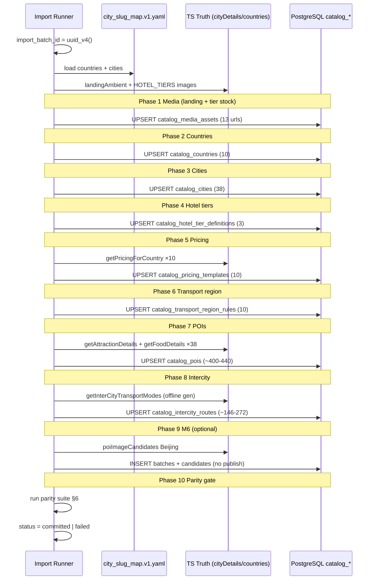

# 109 · Catalog Import v1.0（Architecture Review · FROZEN）

**Version:** 1.0.1 · **状态：** **FROZEN** · **最后更新：** 2026-06-07  
**文档类型：** **Catalog Import Architecture Review** — 数据契约 · 序列 · 对拍 · 回滚 · 重导  
**基准**：[108-S2-004-Migration-Audit-Report](./108-S2-004-Migration-Audit-Report.md) · [107-Catalog-Schema-v1.0](./107-Catalog-Schema-v1.0.md)  
**约束**：**仅 Import 规范**；**禁止** Catalog API · Admin CRUD · Growth · Official OPS · **Import Runner 见 §11**

> **SSOT**：本文为 **Catalog Import v1.0.1 冻结稿**（110 Preflight Sprint 补丁）。实现 import runner 须逐字遵循 **§11**；偏离须 **109 v1.2** 修订。

**先读**：[107](./107-Catalog-Schema-v1.0.md) · [108](./108-S2-004-Migration-Audit-Report.md)

**配套数据文件**

| 文件 | 用途 |
|------|------|
| `data/catalog/city_slug_map.v1.yaml` | 十国 38 城 slug · country 映射 |
| `data/catalog/country_transport_region.v1.yaml` | 区域交通默认 |
| `data/catalog/poi_slug_overrides.v1.yaml` | poiSlugV1 人工 slug（§11.1） |

---

<a id="ci109-0-verdict"></a>

## 0. 总裁决

| 维度 | 裁决 |
|----|------|
| **cityDetails / countries / interCityTransport 无损迁移** | **GO** — 契约 + 序列 + 对拍矩阵已覆盖 |
| **Import v1.0** | **FROZEN** |
| **实现轨** | import runner（CLI/内部 job）· parity tests · **不含** 公众 API |

**目标**：TS 静态真源 → PostgreSQL catalog_* **语义等价**；`CATALOG_API_ENABLED=1` 后 FE 可切换读库而不改业务逻辑。

---

<a id="ci109-1-scope"></a>

## 1. 范围与真源

### 1.1 纳入（P0）

| 真源 | 路径 | 目标表 |
|------|------|--------|
| 十国 | `productCountries.ts` · `product_countries.rs` | catalog_countries |
| 38 城 | `geoOptions.ts` CITIES_BY_COUNTRY | catalog_cities |
| 景区 | `attractions.ts` + `productCountryPoi.ts` | catalog_pois (attraction) |
| 美食 | `food.ts` + `productCountryPoi.ts` | catalog_pois (food) |
| 酒店档 | `hotels.ts` · `hotelTierPricing.ts` | catalog_hotel_tier_definitions |
| 定价 | `countries/{cn,jp,...}.ts` · `index.ts` BY_COUNTRY | catalog_pricing_templates |
| 城际规则 | `interCityTransport.ts` | catalog_intercity_routes + transport_region_rules |
| Landing 图 | `landingAmbientByCountry.ts` | catalog_media_assets + countries.payload |
| POI 验收 | `poiImageVerification/*` | M6 三表（**不 auto-publish**） |

### 1.2 排除（P0）

| 真源 | 原因 |
|------|------|
| LANGUAGES_BY_COUNTRY · SERVICE_TYPE_OPTIONS | 107 P1 · 留 geoOptions |
| catalog_pois type=hotel 按城 | 107 §7.3 · 全局 tier 表 |
| 意大利/英国 city · pricingIT/UK | 非十国 product 清单 |
| Growth · ops_* | Owner 指令 |

### 1.3 导入量级（冻结）

| 实体 | 行数 |
|------|------|
| countries | 10 |
| cities | 38 |
| pois attraction | ~190–220 |
| pois food | ~190–220 |
| hotel tiers | 3 |
| pricing templates | 10 |
| transport region rules | 10 |
| intercity routes | **146–272**（有向对 × mode） |
| landing media | 10 |
| tier stock media | 3 |
| M6 batch（北京示范） | 1 batch · N candidates |

---

<a id="ci109-2-contract"></a>

## 2. Import Data Contract

### 2.1 全局字段

| 字段 | 规则 |
|------|------|
| `import_batch_id` | 单次 run 一个 `UUID v4`；**所有** INSERT/UPSERT 行写入 |
| `publish_status` | P0 内容行默认 **`published`**（与 TS 静态可读等价）；M6 批次 **`review`** |
| `version` | 新行 `1`；变更见 **§11.4** |
| `currency` | pricing 存 **minor units（cents）**；TS 元 × **100** `Math.round` |

### 2.2 CountryRecord

```typescript
interface CountryRecord {
  iso3166: string;           // PRODUCT_COUNTRIES[i].iso
  name_zh: string;
  name_en: string;           // city_slug_map.v1.yaml
  sort_order: number;        // 0..9
  open_status: "open";
  publish_status: "published";
  payload: {
    guide_register_label_key: string;
    landing_ambient: {
      image_url: string;       // landingAmbientByCountry
      image_asset_id: string;  // UUID after media insert
      video_slug?: string;     // lowercase iso
    };
  };
  import_batch_id: UUID;
}
```

**幂等键**：`iso3166`

### 2.3 CityRecord

```typescript
interface CityRecord {
  country_iso: string;
  slug: string;              // city_slug_map.v1.yaml — 禁止 UUID
  name_zh: string;             // CITIES_BY_COUNTRY value
  name_en: string;
  region_label: string;        // CITY_TO_REGION[city]
  sort_order: number;          // 国别内 0..n-1
  open_status: "open";
  publish_status: "published";
  payload: { parent_country_zh: string };
  import_batch_id: UUID;
}
```

**幂等键**：`(country_id, name_zh)` · `(country_id, slug)`

### 2.4 PoiRecord

```typescript
interface PoiRecord {
  city_name_zh: string;
  poi_type: "attraction" | "food";  // P0 禁止 hotel
  slug: string;                      // poiSlugV1 — §3.2
  name_zh: string;                   // label
  name_en: string;                   // label 或 slug
  description_zh: string;
  legacy_value: string;              // TS value — 对拍主键
  sort_order: number;                // 数组序
  publish_status: "published";
  payload: {
    image_url: string;               // getAttractionDetails / getFoodDetails 解析后
    semantic_key?: string;           // ATTRACTION_SEMANTIC / food 池
    stock_pool_key?: string;
    region_fallback_image?: string;    // food 专用
  };
  import_batch_id: UUID;
}
```

**attraction 真源**：`getAttractionDetails(city)` 输出（含 `resolveAttractionImage`）  
**food 真源**：`getFoodDetails(city)` 输出（含 region fallback · description 解析）

**幂等键**：`(city_id, poi_type, slug)` · 对拍 `(city, legacy_value)`

### 2.5 HotelTierRecord

```typescript
interface HotelTierRecord {
  tier_code: "tier_economy" | "tier_comfort" | "tier_luxury";
  sort_order: 0 | 1 | 2;
  multiplier: number;                // HOTEL_TIER_MULTIPLIER
  label_key: string;                 // HOTEL_TIERS[].labelKey
  description_key: string;
  submit_label_zh: string;           // HOTEL_TIER_SUBMIT_LABELS
  stock_image_asset_id: UUID;        // 先 insert media
  publish_status: "published";
  import_batch_id: UUID;
}
```

**幂等键**：`tier_code`

### 2.6 PricingTemplateRecord

```typescript
interface PricingTemplateRecord {
  country_name_zh: string;           // BY_COUNTRY key
  currency_code: "CNY";             // P0 十国统一展示口径
  city_transport_price: { sedan, suv, van };      // cents
  intercity_price_per_person: { flight, rail };   // cents
  per_attraction_cents: number;
  per_food_cents: number;
  hotel_base_per_night_cents: number;
  guide_levels_per_day: { primary, intermediate, advanced, expert };
  publish_status: "published";
  import_batch_id: UUID;
}
```

**转换**：`cents = Math.round(yuan * 100)` — 见 `countries/cn.ts` 等

**幂等键**：`country_id` UNIQUE

### 2.7 IntercityRouteRecord

```typescript
interface IntercityRouteRecord {
  from_city_name_zh: string;
  to_city_name_zh: string;
  mode: "flight" | "rail";
  rules_json: {
    $schema: "catalog_intercity_route_rules_v1";
    allowed_modes: [mode];
    mode_only: boolean;              // modes.length===1 from TS Set
    rail_label_override_key?: string; // getInterCityRailLabelKey when mode=rail
    flight_label_override_key?: string;
    priority: number;                // 100 default; pair Set 110
    source_pair_key: string;         // "东京::大阪"
    notes?: string;                  // Set 名 e.g. JAPAN_RAIL_ONLY
  };
  publish_status: "published";
  import_batch_id: UUID;
}
```

**幂等键**：`(from_city_id, to_city_id, mode)`

### 2.8 TransportRegionRuleRecord

```typescript
interface TransportRegionRuleRecord {
  country_iso: string;
  default_modes: ("flight"|"rail")[];
  rail_ui_label_key: string | null;
  flight_ui_label_key: string | null;
  publish_status: "published";
  import_batch_id: UUID;
}
```

**真源**：`data/catalog/country_transport_region.v1.yaml`

### 2.9 MediaAssetRecord

```typescript
interface MediaAssetRecord {
  asset_kind: "landing_ambient" | "hotel_tier_stock" | "poi_hero" | "generic";
  source_type: "unsplash" | "external_url";
  url: string;                       // UNIQUE — UPSERT by url
  source_page_url?: string;
  license: { type: string; text: string };
  alt_text_zh?: string;
  country_id?: UUID;
  publish_status: "published";
  import_batch_id: UUID;
}
```

### 2.10 M6BatchRecord / M6CandidateRecord

```typescript
interface M6BatchRecord {
  batch_name: string;                // POI_IMAGE_VERIFICATION_BATCHES.batchId
  city_name_zh: string;
  country_iso: string;
  poi_kind: "attraction" | "food";
  status: "review";                   // TS PENDING → review
  started_at: ISO8601;
  notes?: string;
  import_batch_id: UUID;
}

interface M6CandidateRecord {
  batch_name: string;
  poi_legacy_value: string;
  candidate_url: string;             // previewUrl
  source_page_url: string;
  scene_description: string;
  license: string;
  review_status: "pending"|"approved"|"rejected";
  rank: number;
  notes?: string;
  import_batch_id: UUID;
}
```

**P0 不写入** `catalog_poi_images_published`（运营审核后 publish）。

---

<a id="ci109-3-strategies"></a>

## 3. 分实体 Import 策略

### 3.1 Country mappings

| TS 字段 | DB 列 / payload |
|---------|-----------------|
| iso | iso3166 |
| nameZh | name_zh |
| city_slug_map name_en | name_en |
| array index | sort_order |
| guideRegisterLabelKey | payload.guide_register_label_key |
| landingAmbientImageUrl | media + payload.landing_ambient |

**顺序**：先 INSERT `catalog_media_assets` (landing) → UPSERT country → 回写 `image_asset_id`。

### 3.2 POI import strategy

**算法**

1. 遍历 `city_slug_map` 每城 `name_zh`  
2. `attraction`：`getAttractionDetails(city)` 逐条  
3. `food`：`getFoodDetails(city)` 逐条  
4. **跳过** `poi_type=hotel`  
5. `slug = poiSlugV1(citySlug, poiType, legacyValue)`  

**poiSlugV1（冻结 · 详 §11.1）**

```text
lookupKey = "{city_slug}:{poi_type}:{legacy_value}"
1. poi_slug_overrides.v1.yaml entries[lookupKey] → slug
2. legacy_value 匹配 /^[a-zA-Z0-9_-]+$/ → lowercase
3. "v1-" + fnv1a32(lookupKey).toString(16).padStart(8,"0")
```

**图片**：import 时 materialize `get*Details` 最终 `image` 到 `payload.image_url`（含 override 链结果）。

### 3.3 Hotel tier import

| TS | DB |
|----|-----|
| HOTEL_TIERS[3] | 3 rows tier_code |
| HOTEL_TIER_MULTIPLIER | multiplier |
| HOTEL_TIER_SUBMIT_LABELS | submit_label_zh |
| tier.image | media asset → stock_image_asset_id |

**全局 3 行**；与 city **无关**。

### 3.4 Pricing template import

```typescript
for (const { nameZh } of PRODUCT_COUNTRIES) {
  const cfg = getPricingForCountry(nameZh);
  upsertPricing({
    country_name_zh: nameZh,
    city_transport_price: mapValues(cfg.cityTransportPrice, yuanToCents),
    intercity_price_per_person: mapValues(cfg.intercityPricePerPerson, yuanToCents),
    per_attraction_cents: yuanToCents(cfg.perAttraction),
    per_food_cents: yuanToCents(cfg.perFood),
    hotel_base_per_night_cents: yuanToCents(cfg.hotelPerNightPerPerson),
    guide_levels_per_day: mapValues(cfg.guideLevelsSuggestedPerDay, yuanToCents),
  });
}
```

**不 import** pricingIT · pricingUK（非十国 BY_COUNTRY）。

### 3.5 Intercity route generator（TS 同源 · §11.2）

**强制**：Runner **必须** `import` 下列模块，**禁止** Rust/手工复刻 Set 逻辑：

```typescript
import { PRODUCT_COUNTRIES } from "@/lib/productCountries";
import { CITIES_BY_COUNTRY } from "@/lib/geoOptions";
import {
  getInterCityTransportModes,
  getInterCityRailLabelKey,
} from "@/lib/cityDetails/interCityTransport";
```

**输入**：38 城 · 国别内二重循环（**不跨国**）

**行数预算**：**146** 有向对 · **146–272** route 行

**算法**

```typescript
for (const country of PRODUCT_COUNTRIES) {
  const cities = CITIES_BY_COUNTRY[country.nameZh].map(c => c.value);
  for (const from of cities) {
    for (const to of cities) {
      if (from === to) continue;
      const modes = getInterCityTransportModes(from, to);
      for (const mode of modes) {
        upsertRoute({
          from, to, mode,
          rules_json: {
            allowed_modes: [mode],
            mode_only: modes.length === 1,
            rail_label_override_key: mode === "rail"
              ? getInterCityRailLabelKey(from, to) : null,
            flight_label_override_key: mode === "flight"
              ? "market_transportFlight" : null,
            priority: modes.length === 1 ? 110 : 100,
            source_pair_key: `${from}::${to}`,
          },
        });
      }
    }
  }
}
```

**特殊对**（须与 TS Set **完全一致**）：JAPAN_RAIL_ONLY · JAPAN_FLIGHT_ONLY · CHINA_RAIL_ONLY · KOREA_* · THAILAND_FLIGHT_ONLY · UAE_GROUND_ONLY · US_FLIGHT_ONLY · EUROPE_RAIL_ONLY · 悉尼↔墨尔本 · 巴黎↔尼斯 · 马德里↔巴塞罗那 · 新加坡 `[]`

**输出校验**：随机抽样 50 对 `(from,to)` — DB modes 集合 === `getInterCityTransportModes(from,to)`。

### 3.6 Media import batches

| 批次 | asset_kind | 数量 |
|------|------------|------|
| landing | landing_ambient | 10 |
| hotel tier | hotel_tier_stock | 3 |
| POI default | poi_hero（可选 P1） | 0 P0 |

**license 默认**：Unsplash `{ type: "unsplash", text: "Unsplash License" }`

**url UNIQUE**：同 URL **UPSERT** 复用 `id` · 更新 `import_batch_id`。

### 3.7 M6 import（北京示范）

1. 依赖 POI 已 import（故宫等 legacy_value 可解析 poi_id）  
2. INSERT batch `CN-北京-attraction-01` · status=`review`  
3. INSERT candidates from `poiImageCandidates.ts` · review_status 映射 §2.10  
4. **不** UPSERT published  

---

<a id="ci109-4-sequence"></a>

## 4. Import Sequence Diagram



**Phase 顺序不可打乱**：countries 先于 cities；cities 先于 pois/routes；media 先于 tier/country payload。

---

<a id="ci109-5-lifecycle"></a>

## 5. import_batch Lifecycle

```text
created → running → validating → committed
              ↓           ↓
           failed     rollback_pending → archived
```

| 态 | 含义 | DB 表现 |
|----|------|---------|
| created | 生成 UUID · 写 run manifest | 无行 |
| running | Phase 1–9 执行中 | 行带同一 import_batch_id |
| validating | parity suite | 只读 |
| committed | 全部 PASS | manifest 存档 · **§11.6 历史索引** |
| failed | 任 Phase 非 0 exit | 见 §7 rollback |
| rollback_pending | 运营确认回滚 | DELETE draft 行 / revision 恢复 published |
| archived | 历史 batch 只读 | import_batch_id 保留 |

**Run manifest（JSON · P0 文件 · 详 §11.6）**

```json
{
  "import_batch_id": "uuid",
  "schema_version": "catalog_import_v1.0.1",
  "status": "committed",
  "started_at": "ISO8601",
  "finished_at": "ISO8601",
  "git_sha": "string",
  "input_hash": "sha256 of TS+yaml sources",
  "phases": [{ "name": "media", "rows": 13, "status": "ok" }],
  "parity": { "passed": true, "failed_cases": [] },
  "supersedes": null
}
```

**路径**：`data/catalog/import_runs/{import_batch_id}.manifest.json`  
**索引**：`data/catalog/import_runs/index.json` — `{ runs: [{ import_batch_id, status, started_at }] }`

---

<a id="ci109-6-parity"></a>

## 6. Parity Matrix

### 6.1 结构对拍（必过）

| ID | TS 断言 | DB 查询 | 容差 |
|----|---------|---------|------|
| P-01 | `PRODUCT_COUNTRIES.length === 10` | `count(*) FROM catalog_countries WHERE publish_status='published'` | 0 |
| P-02 | 38 城 | `count(*) FROM catalog_cities` | 0 |
| P-03 | 每国 city 数 | join countries · group by iso | 0 |
| P-04 | `name_zh` 与 preset_cities | 逐城字符串相等 | 0 |
| P-05 | slug 与 yaml | catalog_cities.slug === yaml | 0 |
| P-06 | 每城 attraction 数 | vs `getAttractionDetails(city).length` | 0 |
| P-07 | 每城 food 数 | vs `getFoodDetails(city).length` | 0 |
| P-08 | 每城 hotel tier 数 | TS 恒 3 · DB tier 表 3 | 0 |
| P-09 | legacy_value 全集 | pois.legacy_value 覆盖 TS value 集 | 0 |
| P-10 | pricing keys | BY_COUNTRY keys === pricing country_ids | 0 |
| P-11 | cents 反算 | DB cents / 100 === TS yuan | 0 |
| P-12 | intercity 50 对抽样 | modes 集合相等 | 0 |
| P-13 | 新加坡无城际 | routes 涉及 SG 城对 = 0 | 0 |
| P-14 | landing url | countries.payload image_url === TS | 0 |
| P-15 | tier multiplier | DB === HOTEL_TIER_MULTIPLIER | 0 |
| P-16 | zero hotel pois | `count pois type=hotel` = 0 | 0 |

### 6.2 行为对拍（P0 抽测）

| ID | 场景 | 期望 |
|----|------|------|
| B-01 | quoteCalculation 用 CN pricing | DB 与 getPricingForCountry('中国') 等价 |
| B-02 | hotelNightRatePerPerson tier_comfort | DB base × multiplier === TS |
| B-03 | normalizeInterCityTransport 东京→大阪 | DB routes mode 含 rail |
| B-04 | 曼谷→清迈 | 仅 flight |
| B-05 | POI 图解析 | payload.image_url === getAttractionDetails image |

### 6.3 现有测试继承

| 测试 | 扩展 |
|------|------|
| `cityDetailsCoverage.test.ts` | + catalog DB fixture 版 |
| `landingAmbientByCountry.test.ts` | + payload 对拍 |
| `poiImageCandidatesIntegrity.test.ts` | + M6 batch 行数 |

**退出**：P-01..P-16 **全部 PASS** 方可 `committed`。

---

<a id="ci109-7-rollback"></a>

## 7. Rollback Strategy

### 7.1 按 publish_status

| 态 | 动作 |
|----|------|
| draft / in_review | `DELETE FROM … WHERE import_batch_id = $1` |
| published（本 run 新 insert） | `catalog_content_revisions` rollback 或 mark archived |
| published（UPSERT 覆盖） | 恢复 revision before_json |

### 7.2 Phase 级逆向（failed mid-run）

| 失败 Phase | 逆向 |
|------------|------|
| 1–4 | DELETE media/countries/cities/tiers WHERE import_batch_id |
| 5–6 | + pricing · region_rules |
| 7 | + pois |
| 8 | + intercity_routes |
| 9 | + M6 candidates/batches |

**禁止**：`CASCADE` 删除已有 **其他 batch** 的 published 行。

### 7.3 M6 特殊

- batch.status → `archived`  
- published 行若存在（不应 P0 auto）→ revision 恢复  

---

<a id="ci109-8-reimport"></a>

## 8. Re-import Policy

| 实体 | 策略 | 自然键 |
|------|------|--------|
| countries | UPSERT | iso3166 |
| cities | UPSERT | (country_id, name_zh) |
| pois | UPSERT | (city_id, poi_type, slug) |
| pricing | UPSERT | country_id |
| hotel tiers | UPSERT | tier_code |
| transport region | UPSERT | country_id |
| intercity routes | UPSERT | (from, to, mode) |
| media | UPSERT | url UNIQUE |
| M6 batch | **INSERT 新 batch** | 不覆盖旧 batch |
| M6 candidates | INSERT 随新 batch | — |

**规则**

1. **全量 re-import**：新 `import_batch_id` · **manifest 历史保留**（§11.6）· 行级 `import_batch_id` **更新为最新 run**（§11.3）  
2. **增量 re-import（P1）**：按 country_iso 子集 · 同 UPSERT 键  
3. **字段级**：内容 hash 变 → UPSERT · version+1 · revision（§11.5）  
4. **published 删除**：**禁止** DELETE；archive + revision rollback  
5. **幂等重跑（P1）**：`input_hash` 相同且 parity PASS → no-op skip

---

<a id="ci109-9-checklist"></a>

## 9. Import Audit Checklist

### 9.1 Pre-import

- [ ] S2-004 migration **installed**（108 PASS）
- [ ] `bash scripts/check-catalog-slug-map.sh` **PASS**（§11.6）
- [ ] `country_transport_region.v1.yaml` 10 国
- [ ] TS 单测 green（cityDetailsCoverage 等）
- [ ] 空库或 preflight（108 §5 非空库四条件）
- [ ] `import_batch_id` 已生成 · manifest 路径可写

### 9.2 Per-phase

- [ ] P1 Media：13 URL HEAD 200（landing×10 + tier×3）
- [ ] P2 Countries：10 行 · payload.landing_ambient 完整
- [ ] P3 Cities：38 行 · slug/name_zh 对拍 yaml
- [ ] P4 Tiers：3 行 · multiplier 对拍
- [ ] P5 Pricing：10 行 · cents 对拍
- [ ] P6 Region rules：10 行 · default_modes 对拍 yaml
- [ ] P7 POIs：attraction+food · legacy_value 100% · hotel=0
- [ ] P8 Intercity：抽样 50 对 PASS · 新加坡零行
- [ ] P9 M6：batch review · 无 published 行

### 9.3 Post-import

- [ ] Parity P-01..P-16 PASS
- [ ] manifest status = committed
- [ ] `import_batch_id` 写入所有目标行
- [ ] 无 orphan FK（media/tier/country 链接）
- [ ] FE `CATALOG_API_ENABLED=0` 仍可用（fallback 未破坏）

### 9.4 Sign-off

| 角色 | 项 |
|------|-----|
| Import runner 作者 | §9.1–9.2 |
| QA / parity | §6 · §9.3 |
| Owner | committed → 允许 S2-API-RO |

---

<a id="ci109-11-impl"></a>

## 11. v1.0.1 实现契约（110 Preflight Sprint 补丁）

> 本节为 **Import Runner 强制规范**；与 §2–§8 冲突时 **以本节为准**。

### 11.1 poiSlugV1 与 overrides

**文件**：`data/catalog/poi_slug_overrides.v1.yaml`

**lookupKey**：`{city_slug}:{poi_type}:{legacy_value}`（UTF-8 原样）

**算法**

```typescript
function poiSlugV1(citySlug: string, poiType: "attraction"|"food", legacyValue: string): string {
  const key = `${citySlug}:${poiType}:${legacyValue}`;
  const override = overrides.entries[key];
  if (override) return override.slice(0, 80);
  if (/^[a-zA-Z0-9_-]+$/.test(legacyValue)) return legacyValue.toLowerCase().slice(0, 80);
  const hash = fnv1a32(key);
  return `v1-${hash.toString(16).padStart(8, "0")}`;
}

function fnv1a32(input: string): number {
  let h = 0x811c9dc5;
  for (let i = 0; i < input.length; i++) {
    h ^= input.charCodeAt(i);
    h = Math.imul(h, 0x01000193);
  }
  return h >>> 0;
}
```

**约束**：slug 字符集 `[a-z0-9-]` · max 80 · `entries` 空对象 **合法**（全 fnv/ASCII 兜底）

**单测向量（Runner P0）**

| lookupKey | 期望 slug |
|-----------|-----------|
| `beijing:attraction:故宫` | `v1-` + fnv1a32 hex(8) |
| `melbourne:food:brunch` | `brunch` |
| override `beijing:attraction:故宫` → `gugong` | `gugong` |

### 11.2 Intercity TS 同源生成器

| 项 | 规则 |
|----|------|
| 语言 | **TypeScript only**（tsx） |
| 入口 | 直接调用 `getInterCityTransportModes` · `getInterCityRailLabelKey` |
| 循环 | `PRODUCT_COUNTRIES` × 国内 `CITIES_BY_COUNTRY` 有向对 |
| 禁止 | 复制 Set 到 Rust/SQL · 手写 pair 表 |
| 校验 | Phase 10：P-12（50 对）+ 总量 ∈ [146,272] |
| 金样 | 东京→大阪 `[rail]` · 曼谷→清迈 `[flight]` · 新加坡任意对 `[]` |

### 11.3 UPSERT 与 re-import 语义

**行级 `import_batch_id`**

| 操作 | 行 import_batch_id | 历史 |
|------|-------------------|------|
| INSERT 新行 | 当前 run UUID | manifest 记录 |
| UPSERT 命中 · 内容同 hash | 可选不变（P1 skip） | — |
| UPSERT 命中 · 内容变 | **更新为当前 run UUID** | revision before_json |

**「旧 batch 保留」含义**

- **不**保留旧 UUID 在行上  
- **保留**旧 manifest 文件 + `catalog_content_revisions` 快照  
- 运维按 manifest `import_batch_id` 查 **当时** 触达行清单（JOIN 当前行若 batch_id 已更新，以 revision 为准）

**M6**：re-import **不 UPSERT** batch/candidate；仅 **INSERT** 新 batch。

### 11.4 version bump 规则

**content_hash**：对实体 **import 契约 JSON**（§2 列 subset）canonical `JSON.stringify` 后 sha256。

| 事件 | version |
|------|---------|
| INSERT | `1` |
| UPSERT · hash 不变 | **不变** |
| UPSERT · hash 变 | `version + 1` |
| 无列级 diff 仅 import_batch_id 变 | **不变**（P1） |

适用表：凡含 `version` 列的 catalog_*（107 §3）。

### 11.5 catalog_content_revisions 写入规则

**何时写**：UPSERT **且 content_hash 变** · 或首次 INSERT published 行。

| 字段 | 值 |
|------|-----|
| entity_type | 107 §3.12.1 枚举 |
| entity_id | 行 PK |
| version | **变更后** version |
| before_json | UPSERT 前快照；INSERT 为 null |
| after_json | UPSERT 后快照 |
| action | `import` |
| actor_id | null（系统 import） |
| request_id | manifest `import_batch_id` |

**M6 candidates**：不写单行 revision；变更记 **batch** revision（`catalog_poi_image_batches`）。

**首库 failed mid-run**：无 revision；DELETE by `import_batch_id`（§7.2）。

### 11.6 Manifest 历史与 preflight

**manifest 文件**

- 每 run：`data/catalog/import_runs/{import_batch_id}.manifest.json`  
- 索引：`data/catalog/import_runs/index.json`（append-only）

**Preflight 门禁**

```bash
bash scripts/check-catalog-slug-map.sh
```

验证：`city_slug_map.v1.yaml` ↔ `geoOptions` · `productCountries` · `preset_cities.rs`（38 城 · 10 国 · slug · sort_order · guide_register_label_key）

**Runner Phase 0**：preflight PASS → 生成 `import_batch_id` → manifest `status=created`。

---

<a id="ci109-10-refs"></a>

## 10. 引用

| 主题 | 路径 |
|------|------|
| Schema | [107-Catalog-Schema-v1.0.md](./107-Catalog-Schema-v1.0.md) |
| Migration | [108-S2-004-Migration-Audit-Report.md](./108-S2-004-Migration-Audit-Report.md) |
| city slug | `data/catalog/city_slug_map.v1.yaml` |
| poi slug overrides | `data/catalog/poi_slug_overrides.v1.yaml` |
| transport region | `data/catalog/country_transport_region.v1.yaml` |
| preflight | `scripts/check-catalog-slug-map.sh` |
| Readiness | [110-Catalog-Import-Readiness-Report](./110-Catalog-Import-Readiness-Report.md) |
| TS 景区 | `frontend/lib/cityDetails/attractions.ts` |
| TS 美食 | `frontend/lib/cityDetails/food.ts` |
| TS 交通 | `frontend/lib/cityDetails/interCityTransport.ts` |
| TS 定价 | `frontend/lib/countries/index.ts` |

---

**文档状态**：**Catalog Import v1.0.1 FROZEN** · **Preflight Sprint COMPLETE**  
**下一步**：Import Runner（§11 · [110](./110-Catalog-Import-Readiness-Report.md) §7）
