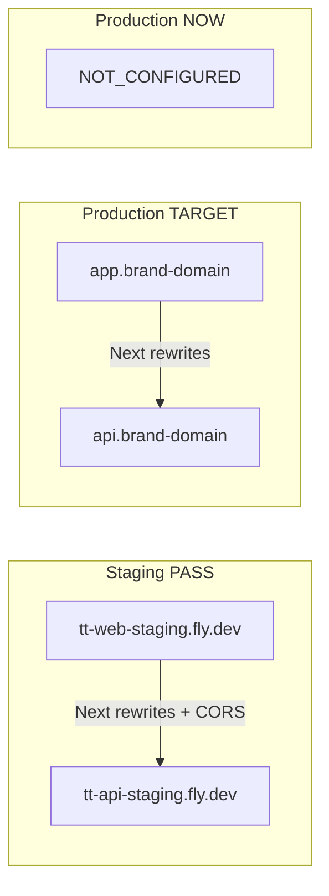

# 121 · PI3-002 Production Domain / CDN / CORS Readiness Report

> **Sprint**：PI3 Closure Sprint · **Phase 1 · PI3-002**  
> **审计 SSOT**：[PHASE3-ENTRY-PRODUCTION-READINESS-MATRIX](../../runbook/PHASE3-ENTRY-PRODUCTION-READINESS-MATRIX.md) · [120-S5-Catalog-Release-Freeze-Report](./120-S5-Catalog-Release-Freeze-Report.md) · [PRODUCTION-INFRASTRUCTURE-AUDIT-REPORT](../../runbook/PRODUCTION-INFRASTRUCTURE-AUDIT-REPORT.md)  
> **日期**：2026-06-07  
> **纪律**：**仅审计与方案确认** · **不修改生产配置** · **禁止新功能 / Catalog S6+ / Admin CRUD / Growth / OPS**  
> **结论**：**PI3-002 HOLD**

---

## 1. Executive verdict

| 维度 | 判定 |
|------|------|
| **PI3-002 审计 Sprint（121 交付）** | **COMPLETE** — 全量扫描 + 方案 + 实施序 |
| **Staging 边缘（代理）** | **PASS** — TLS · CORS · `/health` · env 对拍 |
| **Production 专用域名** | **NOT_CONFIGURED** — 无 Owner 登记 `app.*` / `api.*` |
| **Production Fly apps** | **TEMPLATE_READY** — `tt-api-prod` / `tt-web-prod` 未 cutover |
| **CORS 生产锁定** | **NOT_APPLIED** — `CORS_ORIGINS` 仍为 example 占位 |
| **CDN / HLS（P3-COM-1）** | **NOT_STARTED** — P1 defer（PI3-007） |
| **Stripe Live webhook URL** | **NOT_REGISTERED** — 属 PI3-003；本报告登记回调模板 |
| **Catalog / Admin 冻结** | **UNCHANGED** — `CATALOG_RELEASE_FREEZE_GO` 维持 |

**PI3-002 正式裁定：** **HOLD** — 生产域名 / DNS / TLS / 锁定 CORS 尚未闭合；**禁止 Production cutover** 直至 Owner 完成 §8 实施序并复审计。

**与 Phase ③ Entry 关系：** `PHASE3_ENTRY_GO` **不** 等同 PI3-002 GO；Entry 仅确认 staging + Catalog S5 冻结入口，PI3-002 仍为 Production GO P0 blocker。

---

## 2. 审计范围与方法

| 项 | 说明 |
|----|------|
| **扫描对象** | Fly 拓扑 · Next.js rewrites/headers · Rust CORS/安全头 · Cookie · CSP · Stripe webhook 路径 · env 模板 · staging 公网探针 |
| **未执行** | 生产 Fly secrets 变更 · DNS 注册 · `fly certs add` · CDN 开通 · Stripe Live Dashboard 配置 |
| **机读 gate** | `bash scripts/check-pi3-002-production-domain-cdn-cors-readiness.sh` |
| **基础设施审计** | `bash scripts/dev/run-production-infrastructure-audit.sh`（`PROD_*` 未设 → 预期 INF-P0-004） |
| **Staging 对拍** | `bash scripts/dev/check-staging-web-alignment.sh` — **2026-06-07 PASS=14 FAIL=0 WARN=2** |

---

## 3. 当前拓扑 inventory

### 3.1 Staging（② 代理 · 已运维）

| 组件 | URL / App | TLS | 健康 |
|------|-----------|-----|------|
| Web | `https://tt-web-staging.fly.dev` · `tt-web-staging` | `*.fly.dev` · 至 **2026-07-21** | `/` → **200** |
| API | `https://tt-api-staging.fly.dev` · `tt-api-staging` | 同上 | `/health` → **200** |
| PG | `tt-traveltrust-staging` | Fly 内网 | — |
| 链 | Sepolia `chain_id=11155111` | — | `/meta` 对拍 **PASS** |

**Build env（staging · 已填实）：** `deploy/fly/tt-web-staging/build.env.local`

- `NEXT_PUBLIC_API_BASE_URL=https://tt-api-staging.fly.dev`
- `NEXT_PUBLIC_SITE_URL=https://tt-web-staging.fly.dev`
- `API_REWRITE_TARGET=https://tt-api-staging.fly.dev`

### 3.2 Production（③ 规划 · 未 cutover）

| 组件 | 规划 App | 当前状态 | 配置路径 |
|------|----------|----------|----------|
| API | `tt-api-prod` | **未部署 / 无专用域** | `deploy/fly/tt-api-prod/fly.toml` |
| Web | `tt-web-prod` | **未部署 / 无专用域** | `frontend/fly.production.toml` |
| PG | `tt-traveltrust-prod` | **待创建 + backup（PI3-001）** | — |
| 公网 FE | `https://app.<brand-domain>` | **Owner 未注册** | `deploy/fly/tt-web-prod/build.env.example` |
| 公网 API | `https://api.<brand-domain>` | **Owner 未注册** | `scripts/dev/.env.production.example` |

**占位符：** 仓库内一律使用 `app.example.com` / `api.example.com`；**无** 已登记品牌域名的 committed secrets。

### 3.3 架构示意（目标 vs 现状）



---

## 4. 域名 / DNS / TLS

### 4.1 正式上线所需域名（Owner 决策）

| 用途 | 建议 FQDN | DNS 目标 | 备注 |
|------|-----------|----------|------|
| 用户 DApp / Next | `app.<brand-domain>` | Fly `tt-web-prod` · `fly certs add` | 须 HTTPS 全链路 |
| 公网 API | `api.<brand-domain>` | Fly `tt-api-prod` | 与 `PUBLIC_API_BASE_URL` 一致 |
| Stripe webhook | 同上 API host | — | `POST /api/v1/hooks/stripe/onboarding` |
| 社区对象存储（若启用） | `cdn.<brand-domain>` 或 R2 公网域 | R2/S3 · 桶 CORS | P1 · 非 PI3-002 P0 |
| 邮件 / 品牌链接（Growth 蓝图参考） | `traveltrust.com` 等 | 未纳入本 Sprint | 101 蓝图 · **冻结未实施** |

### 4.2 TLS 探针（2026-06-07）

| Host | 证书 CN | notAfter | `/health` or `/` |
|------|---------|----------|------------------|
| `tt-api-staging.fly.dev` | `*.fly.dev` | 2026-07-21 | **200** |
| `tt-web-staging.fly.dev` | `*.fly.dev` | 2026-07-21 | **200** |
| `app.<prod>` | — | — | **N/A — 未配置** |
| `api.<prod>` | — | — | **N/A — 未配置** |

**风险 R-DNS-01：** Staging `*.fly.dev` **≠** 生产 GO；Fly 共享证书不适用于品牌域名与 SEO/信任展示。

**风险 R-DNS-02：** 证书续期 — staging 约 **2026-07-21** 前须确认 Fly 自动续期或安排 cutover，避免 ② 代理中断。

### 4.3 DNS 实施要点（Owner · 不改代码）

1. 注册品牌域 · 创建 `app` / `api` A/AAAA 或 CNAME → Fly 分配地址  
2. `fly certs add app.<domain> -a tt-web-prod` · `fly certs add api.<domain> -a tt-api-prod`  
3. 等待 Fly 签发 · `fly certs show` 验证  
4. 填实 `PROD_WEB_BASE` / `PROD_API_BASE` · 复跑本报告 gate  

---

## 5. CDN

| 项 | Staging | Production | PI3 |
|----|---------|------------|-----|
| 静态 / Next | Fly 直连 | **Fly 直连（规划）** | PI3-002 |
| 社区 HLS / 大文件 | `cdn-staging.example.test`（Next `remotePatterns` 占位） | **NOT_STARTED** | PI3-007 P1 |
| Fly 边缘缓存 | 默认 | 未配置自定义 CDN | — |

**裁定：** CDN **不单独挡** PI3-002 审计闭合，但 **挡** 社区视频规模化 GO（P3-COM-1 · 登记为 P1 INF-P1-002）。

**十日首发最小路径：** `app.*` + `api.*` Fly TLS 即可；CDN 可 post-GA 按 [PRODUCTION-OPS-RUNBOOK §4](../../runbook/PRODUCTION-OPS-RUNBOOK.md) 迭代。

---

## 6. CORS / Cookie / CSP / Allowed Origins

### 6.1 API CORS（Rust · `crates/api/src/middleware/timeout_cors.rs`）

| 模式 | 行为 |
|------|------|
| `CORS_ORIGINS` **未设 / 空** | `CorsLayer::very_permissive()` — **仅开发态** |
| `CORS_ORIGINS` **非空** | 显式 origin 列表 + **自动并入** localhost:3012/3000 |
| Credentials | `allow_credentials(true)` — preflight 须精确 origin，**禁止** `*` |
| 允许头 | `authorization`, `content-type`, `accept`, `origin`, `x-request-id`, `idempotency-key`, `x-idempotency-key` |
| STRICT 门禁 | `STRICT_SSOT=1` 或 `CHECK_SSOT=1` 时 **空 CORS_ORIGINS → 拒绝启动**（`startup/mod.rs`） |

**Staging 实测（2026-06-07）：**

```http
OPTIONS https://tt-api-staging.fly.dev/meta
Origin: https://tt-web-staging.fly.dev
→ access-control-allow-origin: https://tt-web-staging.fly.dev
→ access-control-allow-credentials: true
```

**Production 必达（go-live §3.2）：**

```bash
# 仅 prod FE origin；禁止 staging origin 残留
CORS_ORIGINS=https://app.<brand-domain>
# 多入口时逗号分隔，仍禁止 *
```

**闭合脚本（执行期 · 本 Sprint 未跑）：**

```bash
PROD_WEB_BASE=https://app.<brand-domain> bash scripts/dev/patch-tt-api-prod-cors.sh
```

**风险 R-CORS-01：** 若生产误留 staging origin 或 `very_permissive` 等价配置 → 跨环境 session / CSRF 面扩大。

**风险 R-CORS-02：** `timeout_cors.rs` 在显式列表下 **仍注入 localhost** — 生产 `CORS_ORIGINS` 须 Owner 确认是否可接受（开发便利 vs 攻击面）；若需剔除 localhost 须 **新 Sprint 代码变更**（**本 Sprint 禁止**）。

### 6.2 Next.js 跨域策略（`frontend/lib/api.ts` + `next.config.js`）

| 场景 | 浏览器 API 路径 |
|------|-----------------|
| 本地 loopback API | 相对路径 → Next **rewrites** → 后端（**无 CORS**） |
| Staging / Prod（`NEXT_PUBLIC_SITE_URL` = 页 origin） | **同源 rewrites** → `API_REWRITE_TARGET` |
| 非 loopback 且 origin ≠ site | 直连 `NEXT_PUBLIC_API_BASE_URL` → **须 API CORS** |

**Production build 必设（`deploy/fly/tt-web-prod/build.env.example`）：**

- `NEXT_PUBLIC_API_BASE_URL=https://api.<brand-domain>`
- `NEXT_PUBLIC_SITE_URL=https://app.<brand-domain>`
- `API_REWRITE_TARGET=https://api.<brand-domain>`

**风险 R-CORS-03：** 若 `NEXT_PUBLIC_SITE_URL` 与真实页 origin 不一致，浏览器将 **直连 API** 并依赖 CORS — cutover 前须 `check-staging-web-alignment.sh` 等价脚本对 prod 跑一遍。

### 6.3 Cookie

| Cookie | 用途 | 属性 | Domain 注意 |
|--------|------|------|-------------|
| `traveltrust_user_id` | Admin middleware / SSR 转发 | `Path=/; SameSite=Lax` | **未设** `Domain=` → 绑定当前 host |
| `traveltrust_session_ok` | 与上配对 | `Max-Age=28800; SameSite=Lax` | 换域后用户须重新登录 |
| Bearer token | `localStorage` | — | 非 HttpOnly · XSS 面已在 FSA 基线登记 |

**Production：** 专用域 cutover 后 cookie **不** 自动迁移自 `*.fly.dev`；须预期全量 re-auth。

### 6.4 CSP / 安全头

| 层 | CSP | 其他 |
|----|-----|------|
| **Next（production）** | **未配置** `Content-Security-Policy` | `X-Frame-Options: SAMEORIGIN` · `nosniff` · `Referrer-Policy: strict-origin-when-cross-origin` · `Permissions-Policy` |
| **API** | **无 CSP** | `nosniff` · `X-Frame-Options: DENY` · `Referrer-Policy: no-referrer` · `Cache-Control: no-store`（默认） |
| **API HSTS** | — | 仅 `HSTS=1` 时发送 `Strict-Transport-Security` |

**风险 R-CSP-01：** 无 CSP — 依赖框架默认与 XSS 审计基线；若品牌安全评审要求 CSP，属 **PI3 后独立 Sprint**（本 Sprint 不改）。

### 6.5 对象存储 CORS（社区媒体 · 并行登记）

| 项 | 说明 |
|----|------|
| 桶 CORS | 须允许 `app.<domain>` 的 `PUT` + `ExposeHeader: ETag`（见 `.env.example` · COMMUNITY-MEDIA runbook） |
| 公网基址 | `COMMUNITY_MEDIA_S3_PUBLIC_BASE_URL` / `NEXT_PUBLIC_*` 须与 prod 域一致 |
| Staging | capabilities 已验；prod 桶 **未配置** |

---

## 7. Stripe / Webhook / Callback URLs

> **PI3-003** 负责 Live keys + webhook 验签；本节仅登记 **URL 拓扑**，供域名 cutover 时一并注册。

| 回调 | 方法 | Staging URL 模板 | Production URL 模板 |
|------|------|------------------|---------------------|
| Onboarding PSP | `POST` | `https://tt-api-staging.fly.dev/api/v1/hooks/stripe/onboarding` | `https://api.<brand-domain>/api/v1/hooks/stripe/onboarding` |
| 验签头 | — | `Stripe-Signature` | 同上 |
| Secret | — | `TRAVELTRUST_STRIPE_WEBHOOK_SECRET=whsec_*`（test） | **live** `whsec_*`（PI3-003） |

**Env（prod 清单 · `scripts/dev/.env.production.example`）：**

- `TRAVELTRUST_STRIPE_SECRET_KEY=sk_live_...`
- `TRAVELTRUST_STRIPE_WEBHOOK_SECRET=whsec_...`
- `TRAVELTRUST_ONBOARDING_STRIPE_ENABLED=1`

**风险 R-STRIPE-01：** API 域变更后 **须** 在 Stripe Dashboard **新建** webhook endpoint；旧 staging URL 不可复用于 live。

**Staging WARN（2026-06-07）：** `/meta` 未能机读确认 Stripe test enabled — 建议 Owner 在 PI3-003 前复验 `tt-api-staging` secrets。

---

## 8. 环境变量矩阵（Production cutover 对拍）

| 变量 | Staging 参考 | Production 必达 | 对拍脚本 / 文档 |
|------|--------------|-----------------|-----------------|
| `CORS_ORIGINS` | `https://tt-web-staging.fly.dev` | **仅** `https://app.<domain>` | `patch-tt-api-prod-cors.sh` |
| `PUBLIC_API_BASE_URL` | staging API host | `https://api.<domain>` | go-live §3.5 |
| `PROD_WEB_BASE` / `PROD_API_BASE` | `*.fly.dev` | 真实 FQDN | infra audit |
| `NEXT_PUBLIC_API_BASE_URL` | build.env.local | api FQDN | `deploy-tt-web-production.sh` |
| `NEXT_PUBLIC_SITE_URL` | build.env.local | app FQDN | 同上 |
| `API_REWRITE_TARGET` | = API base | = API base | `next.config.js` |
| `SEED_TEST_ACCOUNTS` | `1`（②） | **`0` / unset** | go-live §3.6 |
| `P3_CHAIN_OFF` | 可开 | **禁止** | go-live §3.6 |
| `STRICT_SSOT` / `CHECK_SSOT` | 可选 | 建议 `1` + 非空 CORS | go-live §3.2–3.3 |
| `INTERNAL_API_SECRET` | 必配 | 必配 + WAF 禁公网 `/internal/*` | go-live §3.4 |
| `HSTS` | 未要求 | 可选 `1` post-cutover | API middleware |
| Catalog flags | 任意 staging 试验 | **`NEXT_PUBLIC_CATALOG_API_ENABLED=0`** · **`CATALOG_SERVER_GEO_VALIDATION=0`** | [120](./120-S5-Catalog-Release-Freeze-Report.md) |

---

## 9. 风险项汇总

| ID | 优先级 | 域 | 说明 | 闭合归属 |
|----|--------|-----|------|----------|
| R-DNS-01 | **P0** | 域名 | 无专用 prod 域 | PI3-002 Owner |
| R-DNS-02 | P1 | TLS | staging  cert ~2026-07-21 | ② 运维 |
| R-CORS-01 | **P0** | CORS | prod `CORS_ORIGINS` 未锁定 | PI3-002 |
| R-CORS-02 | P2 | CORS | 生产列表仍含 localhost 注入 | 未来 Sprint |
| R-CORS-03 | **P0** | FE/API | `SITE_URL` 与 origin 不对拍 → 直连跨域 | cutover checklist |
| R-CSP-01 | P2 | CSP | 无 CSP 头 | 安全评审后 |
| R-STRIPE-01 | **P0** | Webhook | live URL 未注册 | PI3-003 |
| R-CDN-01 | P1 | CDN | HLS/社区 CDN 未起 | PI3-007 |
| R-FLY-01 | **P0** | Ops | fly CLI 本轮未 auth — 无法验 prod apps/certs | Owner 网络 |
| R-COOKIE-01 | P1 | Auth | 换域全量 re-auth | cutover 通讯 |

---

## 10. Owner 实施顺序（PI3-002 闭合 · 执行期）

| 步 | 动作 | 产物 / 命令 |
|----|------|-------------|
| 1 | 选定品牌域 · 注册 DNS | Registrar 记录 |
| 2 | 创建 / 确认 Fly apps | `tt-api-prod` · `tt-web-prod` |
| 3 | `fly certs add` · 等待签发 | `fly certs show` |
| 4 | 填 `scripts/dev/.env.production.local` | 自 `.env.production.example` |
| 5 | 填 `deploy/fly/tt-web-prod/build.env.local` | 自 `build.env.example` |
| 6 | 部署 API secrets + 镜像 | `phase3-production-fly-deploy-and-sync.sh` |
| 7 | **锁定 CORS** | `PROD_WEB_BASE=… patch-tt-api-prod-cors.sh` |
| 8 | 部署 Web | `deploy-tt-web-production.sh` |
| 9 | Prod 对拍 smoke | `PROD_*=… check-production-web-alignment.sh`（151） |
| 10 | 复审计 | `PROD_API_BASE=… PROD_WEB_BASE=… run-production-infrastructure-audit.sh` |
| 11 | 本 gate → **PI3-002 GO** | `check-pi3-002-production-domain-cdn-cors-readiness.sh` |

**并行依赖（不属 PI3-002 但挡 Production GO）：** PI3-001 PG backup · PI3-003 Stripe Live · PI3-004～006。

---

## 11. GO / HOLD 判定表

| 条件 | 状态 | 要求 |
|------|------|------|
| Staging TLS + CORS + meta 对拍 | **PASS** | 维持 |
| Prod `app.*` / `api.*` 注册且 DNS→Fly | **FAIL** | Owner |
| Prod TLS 有效 + `/health` 200 | **FAIL** | 步 3–6 |
| Prod `CORS_ORIGINS` 仅含 prod FE | **FAIL** | 步 7 |
| Prod build env 无 `example.com` | **FAIL** | 步 5 |
| CDN HLS | **DEFER P1** | 不挡 PI3-002 |
| Catalog S6+ / Admin CRUD | **FROZEN** | 不得借 PI3-002 开启 |
| 本 Sprint 改生产配置 | **NONE** | 纪律满足 |

**最终结论：PI3-002 HOLD**

**升格 PI3-002 GO 条件：** 步 1–11 完成 · infra audit **无** INF-P0-004 · prod CORS preflight 反射 **仅** prod FE origin · gate 输出 `PI3-002_GO`.

---

## 12. 证据与复跑

```bash
# PI3-002 只读 gate（本报告 SSOT）
bash scripts/check-pi3-002-production-domain-cdn-cors-readiness.sh

# Staging 对拍（基线）
bash scripts/dev/check-staging-web-alignment.sh

# 基础设施矩阵（PROD_* 填实后可验 prod 边）
PROD_API_BASE=https://api.<domain> PROD_WEB_BASE=https://app.<domain> \
  bash scripts/dev/run-production-infrastructure-audit.sh
```

**2026-06-07 探针摘要：**

- Staging alignment: **PASS=14 FAIL=0 WARN=2**
- Infra audit (`PROD_*` unset): **NO_GO** · INF-P0-004 prod domain · 预期
- API security headers: `nosniff` · `DENY` frame · CORS credentials **on**

---

## 13. 交叉引用

| 文档 | 关系 |
|------|------|
| [PHASE3-ENTRY-PRODUCTION-READINESS-MATRIX §4](../../runbook/PHASE3-ENTRY-PRODUCTION-READINESS-MATRIX.md) | PI3-002 P0 blocker |
| [120-S5-Catalog-Release-Freeze-Report](./120-S5-Catalog-Release-Freeze-Report.md) | Catalog 默认 flag 冻结 |
| [PRODUCTION-OPS-RUNBOOK §4](../../runbook/PRODUCTION-OPS-RUNBOOK.md) | 域名/TLS 运维 |
| [PRODUCTION-INFRASTRUCTURE-AUDIT-REPORT](../../runbook/PRODUCTION-INFRASTRUCTURE-AUDIT-REPORT.md) | I-01～I-10 矩阵 |
| [go-live-checklist §3](../../go-live-checklist.md) | CORS / PUBLIC_API_BASE_URL |

---

**维护者：** PI3-002 Audit Sprint · 2026-06-07  
**下一 Sprint 建议：** Owner 执行 §10 → 复跑 gate → 并联 PI3-001 / PI3-003
