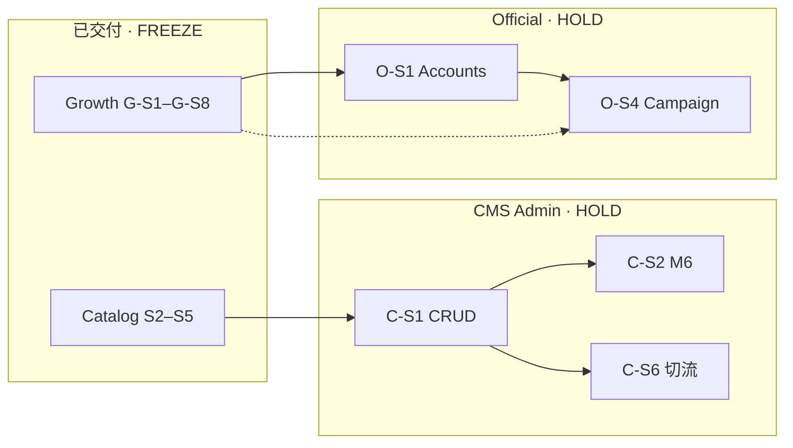

# 135 · DOC-101-RW CMS/Official OPS Blueprint Rewrite Report

> **Sprint**：DOC-101-RW · Blueprint Rewrite（文档 only · **零运行时代码**）  
> **输入**：[120-S5 Catalog Freeze](./120-S5-Catalog-Release-Freeze-Report.md) · [133-G-S8 Growth Freeze](./133-G-S8-Growth-Release-Freeze-Report.md) · [134 Post-Growth Recheck](./134-101-CMS-Official-OPS-Post-Growth-Recheck-Report.md) · [123 CMS Audit](./123-101-CMS-Audit-Report.md)  
> **输出**：[101 v2.0.0](./101-CMS与内容运营中心实施蓝图.md) · [104 v1.1.0](./104-Admin-Coverage-Gap-Report.md) · 102 交叉引用更新  
> **日期**：2026-06-08  
> **纪律**：**仅文档** · **禁止** 新功能 · **禁止** PI3 · 报价主链 · 支付 · 链上 GOV · 破 120/133 冻结  
> **结论**：**DOC_101_RW_GO** · RW-101-01～05 **CLOSED**

---

## 1. Executive verdict

| 维度 | v1.1.0（改写前） | v2.0.0（改写后） | Δ |
|------|------------------|------------------|---|
| §0 P1 CMS | 「基本缺失 · 无 GET /catalog/*」 | RO+Import+Consumer **FREEZE GO** · Admin **HOLD** | **REWRITE 关闭** |
| §0 P3 Growth | 「完全缺失 · 零 referral」 | **G-S8 FREEZE GO** | **REWRITE 关闭** |
| §11 Sprint | S1–S6 / G-S1–G-S5 混轨 | **C-S1～C-S6** + **O-S1～O-S4** + 冻结轨只读 | **统一路线** |
| 104 §1.9 | 「无 GET /catalog/*」 | RO **GO** · Admin **HOLD** | **REWRITE 关闭** |
| 104 §1.11 Growth | 全部 **M/S1** | **G-S8 GO** + HOLD 子项 | **REWRITE 关闭** |
| B 层运营 | HOLD（不变） | HOLD · 明确 **C-S/O-S** 消化顺序 | 文档对齐 |

**总裁定：** **DOC_101_RW_GO** · 101/104 与 **120/133/134** 真源一致 · **不得** 借本报告宣称 CMS Admin 或 B 层冷启动已闭环。

---

## 2. 改写范围

| 文件 | 版本 | 变更摘要 |
|------|------|----------|
| [101-CMS与内容运营中心实施蓝图.md](./101-CMS与内容运营中心实施蓝图.md) | **1.1.0 → 2.0.0** | 全篇重写：四平面现状 · 双读真源 · C-S/O-S 路线 · 冻结边界 · 移除过时 DDL 重复（指向 107/105） |
| [104-Admin-Coverage-Gap-Report.md](./104-Admin-Coverage-Gap-Report.md) | **1.0.0 → 1.1.0** | §0 · §1.8–1.11 · §2 · §4.1 · §5 · §7 · 索引 |
| [102-Referral与早鸟增长系统v1.0实施蓝图.md](./102-Referral与早鸟增长系统v1.0实施蓝图.md) | 1.1.0 → **1.2.0 索引** | 文首指向 101 v2.0.0 · 运行时 **133 SSOT** 声明 |
| [engineering/README.md](./README.md) | — | 101/104/135 一行摘要更新 |

**未改（有意）**：105–120 Catalog 证据链 · 126–133 Growth 证据链 · 123/124/125/134 审计正文（仅交叉引用 135）。

---

## 3. REWRITE 清单关闭（123 §4.1）

| ID | 过时陈述（v1.1.0） | v2.0.0 真源 | 状态 |
|----|---------------------|-------------|------|
| **RW-101-01** | §0「P1 基本缺失 · 无 GET /catalog/*」 | 112 RO 八端点 · 120 FREEZE | **CLOSED** |
| **RW-101-02** | §1 M1–M5「DB today: 无」 | migrations + import · RO **GO** | **CLOSED** |
| **RW-101-03** | §11 S2「Admin CRUD + 公众读」 | S2=API-RO 已交付 · Admin=**C-S1** | **CLOSED** |
| **RW-101-04** | §0「S1 地基开发已启动」 | Catalog **S5 FREEZE** · Growth **G-S8 FREEZE** | **CLOSED** |
| **RW-101-05** | 104 §1.9「无 GET /catalog/*」 | RO **GO** · Admin **HOLD** | **CLOSED** |

---

## 4. 新实施路线（101 §11 · 134 §6 合订）

### 4.1 CMS 轨 C-S1～C-S6

| Sprint | 范围 | P级 | 前置 | 退出标准 | 门禁 |
|--------|------|-----|------|----------|------|
| **C-S1** | Admin Content CRUD M1–M5 + publish-queue | P0 | DOC-101-RW | `smoke-admin-content-p0-local.sh` | **破 120** |
| **C-S2** | M6 POI 图审核闭环 | P0 | C-S1 | batch→publish E2E | 破 120 |
| **C-S3** | 定价/tier/交通/landing Admin | P1 | C-S1 | Admin CRUD + RO 可读 | 破 120 |
| **C-S4** | revisions · import Admin · 对拍面板 | P1 | C-S1 | revision 可查 | 破 120 |
| **C-S5** | Server geo 预备 · B-S4-02～06 | P1 | C-S1 | **不**默认开 flag | 120 回退不变 |
| **C-S6** | Consumer `ENABLED=1` opt-in | P1 | C-S1 published | `check-s5` + Owner | **120 opt-in** |

### 4.2 Official OPS 轨 O-S1～O-S4

| Sprint | 范围 | P级 | 前置 | 退出标准 |
|--------|------|-----|------|----------|
| **O-S1** | M7 Official Accounts | P1 | G-S8 | 替代 seed 运营路径 |
| **O-S2** | M8 Guides official publish | P1 | O-S1 | 下线 prod showcase inject |
| **O-S3** | M9 Templates instantiate | P2 | O-S1 | smoke |
| **O-S4** | M10 Cold Start deploy/rollback | P2 | O-S1 | 替代 env 矩阵 |

### 4.3 建议顺序

```
DOC-101-RW → C-S1 → C-S2 → C-S3 → C-S4 → C-S5 → C-S6
           ∥ O-S1 → O-S2 → O-S3 → O-S4
Catalog S2–S5 / Growth G-S1–G-S8：只读回归，不并行改语义
```

---

## 5. 依赖关系（合订）



---

## 6. 冻结边界（改写后仍不变）

| 来源 | CMS/Official Sprint 禁止 | 允许 |
|------|---------------------------|------|
| **120** | 默认 `ENABLED=1` · 报价 UI 切 Catalog · 无授权 Admin CRUD | C-S* 新 Sprint + Owner + check-s5 |
| **133** | 积分公式 · 链上 GOV · Airdrop approve | O-S 只读绑 G1 码 |
| **134** | 借文档宣称 B 层闭环 | 文档 REWRITE **本 Sprint** |
| **FINAL Audit** | Escrow/订单/支付 Admin 写 | O-S3 instantiate 程序内 orders 写 |

---

## 7. Production GO 裁定（不变）

| 层 | 判定 |
|----|------|
| **A 层 PI3** | CMS/Official **不阻塞** |
| **B 层 101 运营** | **HOLD** — C-S1 起 |
| **Catalog/Growth 冻结** | **GO** — 回归 gate 绿 |

---

## 8. 验证（文档 Sprint · 无运行时代码）

| 检查 | 命令 / 动作 |
|------|-------------|
| 冻结回归（非本 Sprint 必跑全量） | `bash scripts/check-s5-catalog-release-freeze.sh` · `bash scripts/check-g-s8-growth-release-freeze.sh` |
| Post-Growth 审计 | `bash scripts/check-134-cms-official-ops-post-growth-recheck.sh` |
| 蓝图兼容 | `bash scripts/check-101-102-blueprint-compatibility-audit.sh` |
| Handbook frontmatter | `bash scripts/check-handbook-frontmatter.sh` |
| 人工 | 101 v2.0.0 §0/§11 与 120/133/134 对读 |

**本 Sprint 交付物**：101 v2.0.0 · 104 v1.1.0 · 本报告 135 · **0** runtime diff。

---

## 9. 交叉引用

| 文档 | 关系 |
|------|------|
| [101 v2.0.0](./101-CMS与内容运营中心实施蓝图.md) | 改写 SSOT |
| [104 v1.1.0](./104-Admin-Coverage-Gap-Report.md) | Admin 覆盖对齐 |
| [123](./123-101-CMS-Audit-Report.md) | RW 清单来源 |
| [134](./134-101-CMS-Official-OPS-Post-Growth-Recheck-Report.md) | C-S/O-S 顺序来源 |
| [105](./105-S2-Catalog-CMS深度设计评审.md) | C-S1 Admin 设计 SSOT |

---

**报告状态**：**DOC_101_RW_GO** · RW-101-01～05 **CLOSED** · 下一步 **C-S1**（代码 Sprint · 破 120 程序）
