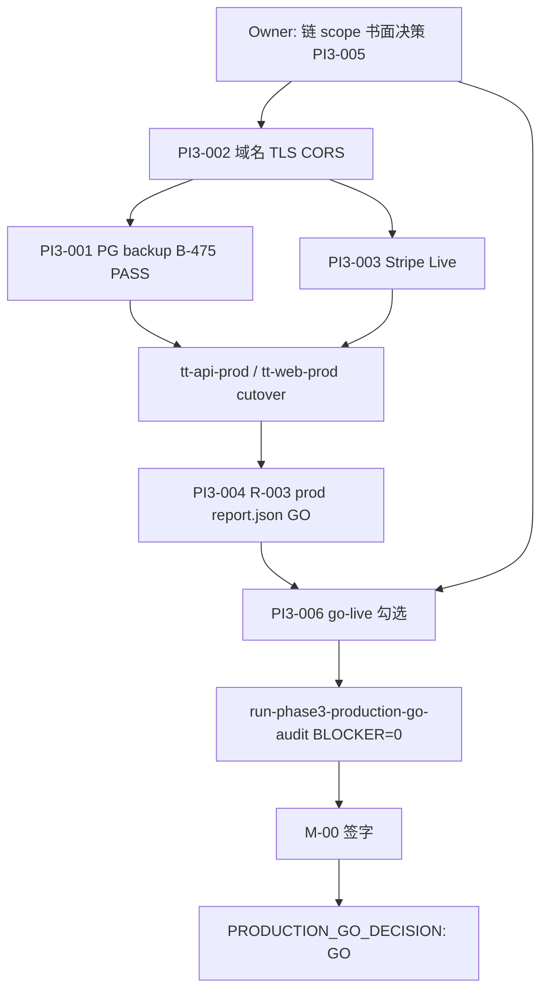

# 147 · PI3 Closure Program Audit Report

> **Sprint**：PI3 Closure Program Audit · **Phase ③ Production GO 程序复核**  
> **审计 SSOT**：[PHASE3-PRODUCTION-PREPARATION](../../runbook/PHASE3-PRODUCTION-PREPARATION.md) · [PRODUCTION-READINESS-REPORT](../../runbook/PRODUCTION-READINESS-REPORT.md) · [PRODUCTION-GO-DECISION-PACKAGE](../../runbook/PRODUCTION-GO-DECISION-PACKAGE.md) · [PHASE3-ENTRY-PRODUCTION-READINESS-MATRIX](../../runbook/PHASE3-ENTRY-PRODUCTION-READINESS-MATRIX.md)  
> **冻结基准**：[120-S5 Catalog Release Freeze](./120-S5-Catalog-Release-Freeze-Report.md) · [133-G-S8 Growth Release Freeze](./133-G-S8-Growth-Release-Freeze-Report.md) · [145 Operations Platform Freeze](./145-Operations-Platform-Release-Freeze-Report.md) · [146 C-S6 Consumer Opt-in](./146-C-S6-Catalog-Consumer-OptIn-Cutover-Report.md)  
> **分项审计**：[122 PI3-001](./122-PI3-001-Production-Database-Backup-Readiness-Report.md) · [121 PI3-002](./121-PI3-002-Production-Domain-CDN-CORS-Readiness-Report.md)  
> **日期**：2026-06-08  
> **纪律**：**仅审计与程序复核** · **禁止** 新增产品功能代码 · **禁止** 修改生产配置 · **禁止** 借 Ops/Catalog/Growth 冻结宣称 Production GO  
> **结论**：**PI3_CLOSURE_PROGRAM_AUDIT_GO** · **`PRODUCTION_GO_DECISION: NO_GO`**（PI3-001～006 **0/6 closed**）

---

## 1. Executive verdict

| 维度 | 判定 |
|------|------|
| **PI3 Closure Program Audit（147 交付）** | **GO** — 六轨复核 · 阻塞矩阵 · Owner 清单 · GO 路径 |
| **软件质量基线（FINAL_SYSTEM_AUDIT）** | **GO** — 冻结 · 不扩展审计 |
| **Phase ③ Entry（PHASE3_ENTRY_GO）** | **GO** — staging + Catalog S5 · 不替代 Production GO |
| **145 Ops Platform Freeze** | **GO** — CMS/Official/Growth 三平面 · **不闭合 PI3** |
| **146 C-S6 Consumer opt-in** | **GO** — staging `ENABLED=1` · **prod 仍 `ENABLED=0`** |
| **120 / 133 冻结** | **GO** — 默认 flag / Growth 链下运行时 · 链上 GOV **HOLD** |
| **PI3-001～006 闭合** | **0/6** — 全部挡 Production GO |
| **Production GO** | **NO-GO** — 维持 [PRODUCTION-GO-DECISION-PACKAGE §1](../../runbook/PRODUCTION-GO-DECISION-PACKAGE.md) |

**147 正式裁定：** **PI3_CLOSURE_PROGRAM_AUDIT_GO** — 程序审计完成；**Production cutover 仍禁止** 直至 PI3 P0 全 closed + `run-phase3-production-go-audit.sh` **BLOCKER=0** + **M-00** 签字。

---

## 2. 冻结基线交叉（145 / 146 / 120 / 133 → PI3 边界）

| 冻结包 | 状态 | 对 PI3 的含义 |
|--------|------|----------------|
| **120 Catalog** | `CATALOG_RELEASE_FREEZE_GO` · prod **`ENABLED=0`** | **不挡** PI3 · prod cutover 须维持 120 默认 |
| **133 Growth** | `GROWTH_RELEASE_FREEZE_GO` · 链上 GOV **HOLD** | **不挡** PI3-001～004/006 · 链上发放走 **PI3-005** 另轨 |
| **145 Ops Platform** | `OPERATIONS_PLATFORM_GO` · C-S1～O-S4 FREEZE | **不挡** PI3 · B 层运营就绪 **≠** Production GO |
| **146 C-S6** | `CATALOG_CONSUMER_OPT_IN_GO` · **staging only** | **不挡** PI3 · prod 切 Catalog PG 仍须 **120 显式程序** + PI3-002 域 |

**纪律重申：** Ops/CMS/Official/Growth/Catalog Consumer **冻结 GO** **不得** 替代 **PI3-001～006** 或 **go-live §0～§11** 勾选。

---

## 3. PI3-001～006 逐项裁定（GO / HOLD / BLOCKED）

| ID | 主题 | 裁定 | 挡 Production GO？ | 证据 / 缺口摘要 |
|----|------|------|-------------------|-----------------|
| **PI3-001** | Fly PG Backup · B-475 · 恢复演练 | **BLOCKED** | **是** | B-475 **`status=PLANNED`** · prod backup **未启用** · prod drill **NOT_RUN** · [122 §13](./122-PI3-001-Production-Database-Backup-Readiness-Report.md) |
| **PI3-002** | 生产域名 / CDN / CORS | **BLOCKED** | **是** | 无 `app.*` / `api.*` · prod `CORS_ORIGINS` 未锁定 · staging **PASS** · [121 §11](./121-PI3-002-Production-Domain-CDN-CORS-Readiness-Report.md) |
| **PI3-003** | Stripe Live / PSP | **BLOCKED** | **是** | 无 `sk_live` · 无 prod webhook URL · go-live §6 未勾 · staging test **GO** |
| **PI3-004** | R-002 / 93 Production Report | **BLOCKED** | **是** | 无 **production** `report.json` **`release_gate=GO`** · C7 社区子集 **≠** 全站 93 |
| **PI3-005** | Mainnet §9 · G0～G6+SL | **GO（Sepolia scope）** | **否**（Mainnet defer） | [148](./148-PI3-005-Production-Scope-Decision-Report.md) **`PRODUCTION_SCOPE_SEPOLIA`** · Mainnet **NOT_SELECTED** |
| **PI3-006** | go-live §0～§11 · P0 十二项 | **BLOCKED** | **是** | §0～§10 **大量 `[ ]`** · P0 十二项 **0/12** · 依赖 PI3-001～005 |

**汇总：** **GO = 1**（PI3-005 scope · [148](./148-PI3-005-Production-Scope-Decision-Report.md)） · **HOLD = 0** · **BLOCKED = 5**（PI3-001～004、006）

**机读（2026-06-07 基线 · 本审计未改）：**

```text
PRODUCTION_GO_DECISION: NO_GO
TT_PHASE3_PRODUCTION_GO_AUDIT: NO_GO
pi3_p0_open=6
pi3_p0_closed=0
go_audit_blockers=7
```

---

## 4. 阻塞矩阵（PI3 × 平面 × 依赖）

### 4.1 P0 阻塞矩阵

| 阻塞 ID | 域 | 现状 | 闭合归属 | 依赖 | 预计 Owner 工期 |
|---------|-----|------|----------|------|-----------------|
| **B-PI3-001** | PG backup / B-475 | `PLANNED` · prod drill 未跑 | Owner · Fly | `tt-traveltrust-prod` 存在 | **3～5 工作日** |
| **B-PI3-002** | 域名 / TLS / CORS | 无专用 prod 域 | Owner · DNS/Fly | 品牌域注册 | **5～10 工作日** |
| **B-PI3-003** | Stripe Live | 无 live 实例 | Owner · Finance | PI3-002 API 域 | **2～3 工作日**（域就绪后） |
| **B-PI3-004** | R-002 prod 回归 | 无 prod `report.json` | Release · QA | prod 环境可访问 | **5～7 工作日**（首次全站） |
| **B-PI3-005** | Mainnet / 链 scope | Shadow **NO_GO** | Owner · 链 | scope 决策 | **0d**（Sepolia 书面豁免）或 **+30～60d**（Mainnet） |
| **B-PI3-006** | go-live 并联 | 0/12 P0 | Owner · Ops | PI3-001～005 子集 | **3～5 工作日**（并联收尾） |

### 4.2 非阻塞但须登记（P1 · 不挡 147 / Entry）

| ID | 项 | 来源 | 说明 |
|----|-----|------|------|
| P1-CDN | 社区 HLS / CDN | PI3-007 · 121 | 十日首发可 Fly 直连 defer |
| P1-S5-ENV | Catalog S5 `draft_cap_exceeded` | 145 · 146 gate | 测试 DB 清理 · **非** PI3 功能回归 |
| P1-C-S6-PROD | Catalog Consumer prod `ENABLED=1` | 146 · 120 | **post-Production-GO** 或 staging 已 GO |
| P1-GOV | Growth 链上 GOV distribute | 133 | PI3-005 / Mainnet 另轨 |
| P1-145-UX | Official Admin MVP 增强 | 145 | post-freeze 可选 |

### 4.3 依赖 DAG（Production GO 最小路径）



---

## 5. Owner 动作清单（仅运维 · 禁止产品功能）

| 序 | ID | Owner 动作 | 验收 / gate | 预计完成 |
|----|-----|-----------|-------------|----------|
| **0** | **PI3-005** | **书面 scope**：Sepolia prod **或** Mainnet + Shadow Launch 计划 | TT-MASTER §0.3 存档 | **T+0～3d** |
| **1** | **PI3-002** | 注册域 → `fly certs add` → 填 `PROD_*` / build.env → 部署 prod apps | `check-pi3-002` → **PI3-002_GO** · infra audit 无 INF-P0-004 | **T+5～10d** |
| **2** | **PI3-001** | `fly pg backup enable` prod → `run-phase3-db-restore-drill-prod.sh` → B-475 **PASS** | `check-pi3-001` · `check-b475` **status=PASS** | **T+3～5d**（可与 #1 并行） |
| **3** | **PI3-003** | Stripe live keys · prod webhook on `api.<domain>` · Fly secrets · 一笔 live 烟测 | go-live §6 · `go_no_go.json` Stripe 项 PASS | **T+2～3d**（#1 后） |
| **4** | — | prod env 硬闸：`SEED=0` · `P3_CHAIN_OFF` off · `CORS_ORIGINS` 仅 prod FE · Catalog **`ENABLED=0`** · **`GEO_VALIDATION=0`** | `check-staging-web-alignment` 等价 prod · 120/146 对拍 | **T+1d**（#1 后） |
| **5** | **PI3-004** | R-003 **production** 全站 A+B → `report.json` → `validate-regression-report.py --fail-on-no-go` | go-live §0.3 四样齐 · 93 §7.1 **GO** | **T+5～7d**（#4 后） |
| **6** | **PI3-005** | 若 Mainnet：新 `run_<UTC>/` G0～G6+SL → `check-mainnet-launch-precheck-gate.sh` | `shadow_launch_verdict: GO` | **T+30～60d**（若 scope=Mainnet） |
| **7** | **PI3-006** | 逐项 [go-live-checklist §0～§11](../../go-live-checklist.md) + P0 十二项 | GL-00 · 缺口总表并联 | **T+3～5d**（#5 并行） |
| **8** | — | `bash scripts/dev/run-phase3-production-go-audit.sh`（**prod** base） | **BLOCKER=0** | **T+1d** |
| **9** | — | 更新 [PRODUCTION-GO-DECISION-PACKAGE](../../runbook/PRODUCTION-GO-DECISION-PACKAGE.md) → **M-00** | `PRODUCTION_GO_DECISION: GO` | **T+0d**（#8 后） |

**预计总工期（Owner 日历）：**

| 路径 | 假设 | 预计 Production GO 就绪 |
|------|------|-------------------------|
| **A · Sepolia prod（推荐最小）** | PI3-005 书面 Sepolia-only · 不做 Mainnet cutover | **~4～6 周**（#0～#9） |
| **B · Mainnet prod** | PI3-005 全 G0～G6+SL + Shadow GO | **~10～14 周**（含 #6） |

---

## 6. 分项复核摘要

### 6.1 PI3-001 · Production Database Backup

| 检查项 | Staging | Production | 裁定 |
|--------|---------|------------|------|
| B-475 `status` | `PLANNED` | 须 **PASS** | **BLOCKED** |
| Fly 托管 backup | **not enabled** | **not enabled** | **BLOCKED** |
| 恢复演练 | `2026-06-07` staging OK · pg_dump **FAIL** | **NOT_RUN** | **BLOCKED** |
| RPO/RTO 书面 | 草案 | Owner 未签字 | **HOLD**（文档） |

**升格 GO：** [122 §12.1](./122-PI3-001-Production-Database-Backup-Readiness-Report.md) → `PI3-001_GO`

### 6.2 PI3-002 · Production Domain / CDN / CORS

| 检查项 | Staging | Production | 裁定 |
|--------|---------|------------|------|
| TLS + `/health` | **PASS** · 至 2026-07-21 | **N/A** | staging **GO** |
| 专用域名 | `*.fly.dev` | **NOT_CONFIGURED** | **BLOCKED** |
| CORS 锁定 | staging origin 反射 | prod 未设 | **BLOCKED** |
| CDN HLS | defer P1 | NOT_STARTED | **HOLD**（不挡 PI3-002） |
| Catalog prod flags | staging 可试验 | **`ENABLED=0`** 必达 | **GO**（120/146 一致） |

**升格 GO：** [121 §10](./121-PI3-002-Production-Domain-CDN-CORS-Readiness-Report.md) → `PI3-002_GO`

### 6.3 PI3-003 · Stripe Live

| 检查项 | 现状 | 裁定 |
|--------|------|------|
| Staging test mode | webhook 路径已验 | **GO** |
| Live keys / webhook | 未配置 | **BLOCKED** |
| go-live §6 | 未勾 | **BLOCKED** |
| Growth / 准入费 | 133 链下 **GO** · 与 PSP live 正交 | 不挡 Growth 冻结 |

### 6.4 PI3-004 · Production Report（R-002 / 93）

| 检查项 | 现状 | 裁定 |
|--------|------|------|
| Staging / 子集 | C7 `release_gate=GO` · ISS-007 窄切片 | **≠** 全站 prod |
| Production `report.json` | **缺失** | **BLOCKED** |
| go-live §0.3 | 四样齐 **未满足** | **BLOCKED** |
| FINAL_SYSTEM_AUDIT | **PASS** | 不替代 R-002 prod |

### 6.5 PI3-005 · Mainnet 策略

| 检查项 | 现状 | 裁定 |
|--------|------|------|
| Shadow Launch | `shadow_launch_verdict: NO_GO`（2026-04-17 包） | Mainnet scope → **BLOCKED** |
| Sepolia staging | chain_id **11155111** · P0 链 **PASS** | staging **GO** |
| TT-MASTER §0.3 | 十日首发可 **排除** Mainnet | **HOLD** — 须 Owner **书面** scope |
| Growth 链上 GOV | 133 **HOLD** | 并轨 Mainnet 时挡 **PI3-005** |

### 6.6 PI3-006 · Go-Live Checklist

| 检查项 | 现状 | 裁定 |
|--------|------|------|
| §0 冻结 / digest | 未勾 | **BLOCKED** |
| §2.3 备份演练 | 依赖 PI3-001 | **BLOCKED** |
| §3.2 CORS | 依赖 PI3-002 | **BLOCKED** |
| §9 Mainnet | 依赖 PI3-005 | **HOLD/BLOCKED** |
| §11 P0 十二项 | **0/12** | **BLOCKED** |
| 145/146 Ops 冻结 | **不** 自动勾选 §5 Admin/CMS 新功能 | 纪律 **GO** |

---

## 7. 最终 Production GO 路径

### 7.1 阶段闸（顺序 SSOT）

| 阶段 | 闸门 | 通过标准 |
|------|------|----------|
| **G0** | 程序审计 | **147 GO**（本报告）· `check-pi3-closure-program-audit.sh` |
| **G1** | Scope | PI3-005 书面决策存档 |
| **G2** | Infra | PI3-001 **GO** + PI3-002 **GO** |
| **G3** | PSP | PI3-003 **GO** |
| **G4** | Quality | PI3-004 **GO** · prod `report.json` |
| **G5** | Checklist | PI3-006 **GO** · P0 十二项并联 |
| **G6** | 机读审计 | `run-phase3-production-go-audit.sh` · **BLOCKER=0** |
| **G7** | 决策 | **M-00** · `PRODUCTION_GO_DECISION: GO` |

### 7.2 禁止捷径（147 复核确认仍有效）

| 禁止 | 原因 |
|------|------|
| 145 Ops FREEZE → Production GO | B 层 **≠** A 层 PI3 |
| 146 staging opt-in → prod Catalog 默认 | 120 prod **`ENABLED=0`** |
| 133 Growth FREEZE → 链上 GOV live | 133 明示 **HOLD** |
| C7 / staging 93 → prod 全站 GO | PI3-004 |
| `*.fly.dev` → 生产域 | PI3-002 |
| 跳过 M-00 | [TT-MASTER](./TT-MASTER-PUBLISH-GO-CHECKLIST-001.md) |

---

## 8. 门禁与复跑

```bash
# 147 程序审计（本报告 · 零 prod 变更）
bash scripts/check-pi3-closure-program-audit.sh

# 分项（Owner 闭合后）
bash scripts/check-pi3-001-production-database-backup-readiness.sh
bash scripts/check-pi3-002-production-domain-cdn-cors-readiness.sh
bash scripts/dev/run-phase3-production-go-audit.sh

# 冻结回归（不得借 PI3 破冻）
bash scripts/check-operations-platform-release-freeze.sh   # 145
bash scripts/check-s5-catalog-release-freeze.sh            # 120
bash scripts/check-g-s8-growth-release-freeze.sh             # 133
bash scripts/check-c-s6-catalog-consumer-opt-in-cutover.sh   # 146 staging 程序
```

**147 成功输出：** `PI3_CLOSURE_PROGRAM_AUDIT_GO`  
**Production GO 输出（未满足）：** `PRODUCTION_GO_DECISION: NO_GO`

---

## 9. 与 101 / 145 / 146 路线关系

| 平面 | 冻结/GO | Production GO |
|------|---------|---------------|
| CMS C-S1～C-S6 | **145/146 GO** | **不阻塞** · prod **`ENABLED=0`** |
| Official O-S1～O-S4 | **145 GO** | **不阻塞** |
| Growth G-S1～G-S8 | **133 GO** | **不阻塞**（链上另轨） |
| Catalog S2–S5 | **120 GO** | **不阻塞** |
| **PI3-001～006** | **0/6 closed** | **唯一 A 层 Production GO 闸** |

**101 B 层**：Ops 三平面 **GO** · **A 层 PI3** 仍 **NO-GO** — 与 [101 §0](./101-CMS与内容运营中心实施蓝图.md) 一致。

---

## 10. Implementation Log

| Phase | 内容 | 文档 |
|-------|------|------|
| PI3-001 Audit | DB backup / B-475 | **122** |
| PI3-002 Audit | Domain / CDN / CORS | **121** |
| Production prep | P0 merchant / drill / rollback | [PHASE3-PRODUCTION-PREPARATION](../../runbook/PHASE3-PRODUCTION-PREPARATION.md) |
| Production GO audit | `go_no_go.json` | [PRODUCTION-READINESS-REPORT](../../runbook/PRODUCTION-READINESS-REPORT.md) |
| Ops/CMS/Growth/Catalog | 145 · 146 · 120 · 133 | 145 · 146 · 120 · 133 |
| **PI3 Closure Program** | **六轨复核 + 阻塞矩阵 + GO 路径** | **147** |

---

**报告状态**：**PI3 Closure Program Audit · `PI3_CLOSURE_PROGRAM_AUDIT_GO` · `PRODUCTION_GO_DECISION: NO_GO`**
