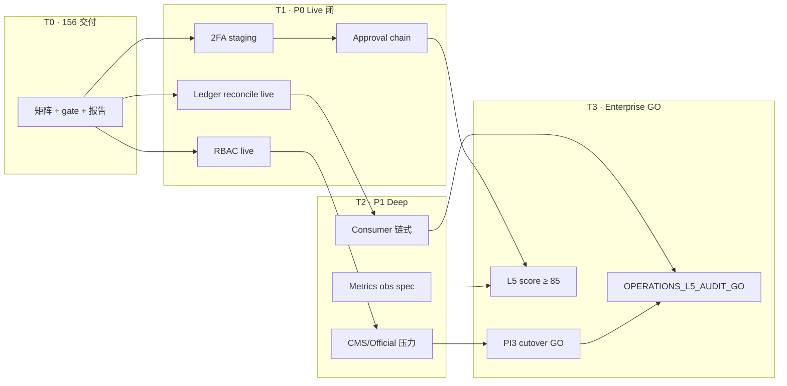

# 156 · L5 Operations Deep Audit Report

> **Sprint**：L5 Operations Deep Audit  
> **Scope SSOT**：[120 Catalog Freeze](./120-S5-Catalog-Release-Freeze-Report.md) · [133 Growth Freeze](./133-G-S8-Growth-Release-Freeze-Report.md) · [145 Operations Platform Freeze](./145-Operations-Platform-Release-Freeze-Report.md) · [146 Consumer Opt-In](./146-C-S6-Catalog-Consumer-OptIn-Cutover-Report.md) · [150 Cold Start Consumer](./150-E2E-A-01-ColdStart-Campaign-Consumer-Report.md) · [155 PI3-006](./155-PI3-006-GoLive-Checklist-Production-Cutover-Report.md)  
> **日期**：2026-06-08  
> **纪律**：**禁止新增产品功能代码**  
> **一键 gate**：`bash scripts/check-l5-operations-deep-audit-execution.sh`  
> **结论**：**`OPERATIONS_L5_AUDIT_HOLD`** — B 层 Ops 冻结 **GO**（145/149/150）；L5 深度 live 探针与 P0 企业就绪项 **未全闭**

---

## 1. Executive verdict

| 维度 | 判定 |
|------|------|
| **156 Execution Sprint 交付** | **COMPLETE** — 矩阵生成器 · 深度审计编排 · baseline · gate |
| **B 层 Ops 冻结** | **GO** — `OPERATIONS_PLATFORM_GO` · `GROWTH_RELEASE_FREEZE_GO` · `E2E_A_01` · `OPERATIONS_E2E_ACCEPTANCE_GO` |
| **L5 矩阵项** | **15 GO · 15 HOLD · 0 BLOCKED**（31 项含 F5） |
| **P0 未闭** | **6 项 HOLD** — E2/E3/E4；F2/F3/F5 |
| **L5 企业级评分** | **75 / 100** |
| **Production cutover** | **BLOCKED by 155** — PI3-006 HOLD · 不影响 B 层 Ops 审计程序交付 |

**156 正式裁定：** **`OPERATIONS_L5_AUDIT_HOLD`**

**升格 `OPERATIONS_L5_AUDIT_GO`：** P0 项全 **GO** · 无 **BLOCKED** · `enterprise_score ≥ 85` · baseline **`status=PASS`**

---

## 2. 审计矩阵（A–F）

> **图例：** 裁定 **GO/HOLD/BLOCKED** · 风险 **P0/P1/P2** · 复现见 §2.x 末「复现命令」

### 2.A CMS Content Center（C-S1~C-S6）

| ID | 审计项 | 裁定 | 风险 | 证据路径 | Gate |
|----|--------|------|------|----------|------|
| **A1** | 审批队列压力（100 Draft / 50 Review / 20 Publish） | **HOLD** | P1 | [136-C-S1](./136-C-S1-Admin-Content-CRUD-PublishQueue-Report.md) · `catalog_admin.rs` publish_queue | `check-c-s1-*` |
| **A2** | Revision Compare/Restore 连续回滚 | **GO** | P1 | `admin_catalog_revision_http.rs` · [139-C-S4](./139-C-S4-Catalog-Revision-Import-Operations-Report.md) | `check-c-s4-*` |
| **A3** | 审计日志完整追溯 | **HOLD** | P1 | `frontend/app/admin/audit/` · `admin_audit_http.rs` | `run-admin-l5-green.sh` |
| **A4** | Import/Rollback 数据一致性 | **GO** | P1 | [139-C-S4](./139-C-S4-Catalog-Revision-Import-Operations-Report.md) | `check-c-s4-*` |
| **A5** | Publish Queue 并发冲突 | **HOLD** | P2 | `get_admin_content_publish_queue` · 无 concurrent negative test | `check-c-s1-*` |

**A1 复现：** `bash scripts/check-c-s1-admin-content-crud-publish-queue.sh` → 静态 GO；API+PG 下 seed 超 `draft_cap=20` 队列负载 — **无专用 harness**。  
**A1 修复：** 新增 `scripts/dev/l5-a1-cms-publish-queue-load-test.sh`（ops harness · 非功能代码）。

**A3 复现：** CMS publish/import 后 `GET /api/v1/admin/audit-logs?action=catalog.*` — **未自动化**。  
**A3 修复：** `scripts/dev/l5-a3-cms-audit-trace-smoke.sh` on staging PG。

**A5 复现：** 双 session 并发 approve 同一实体 — 期望 409/idempotent。  
**A5 修复：** 参照 `concurrent_review_submit_negative.rs` 增加 catalog publish 并发负例。

---

### 2.B Official OPS（O-S1~O-S4）

| ID | 审计项 | 裁定 | 风险 | 证据路径 | Gate |
|----|--------|------|------|----------|------|
| **B1** | Campaign Deploy 冲突矩阵 | **GO** | P1 | [144-O-S4](./144-O-S4-Cold-Start-Campaigns-Deployment-Operations-Report.md) | `check-o-s4-*` |
| **B2** | Deploy→Rollback→Deploy 循环压力 | **HOLD** | P1 | `smoke-admin-official-cold-start-p0-local.sh` | `check-o-s4-*` |
| **B3** | Account/Guide/Template 删除恢复 | **HOLD** | P2 | [141–143 O-S1~O-S3](./141-O-S1-Official-Accounts-Management-Report.md) | `check-o-s1~o-s3-*` |
| **B4** | Campaign 生命周期完整性 | **GO** | P1 | [144-O-S4](./144-O-S4-Cold-Start-Campaigns-Deployment-Operations-Report.md) | `check-o-s4-*` |
| **B5** | Consumer 展示一致性 | **GO** | P1 | [150 E2E-A-01](./150-E2E-A-01-ColdStart-Campaign-Consumer-Report.md) | `check-e2e-a-01-*` |

**B2 复现：** 单 cycle smoke OK；×10 deploy/rollback 循环 **未留痕**。  
**B2 修复：** `l5-b2-official-deploy-cycle-stress.sh`。

**B3 复现：** O-S1~O-S3 gates 静态 GO；soft-delete restore **未 L5 自动化**。  
**B3 修复：** O-S1~O-S3 runbook 补 restore smoke。

---

### 2.C Growth（G-S1~G-S8）

| ID | 审计项 | 裁定 | 风险 | 证据路径 | Gate |
|----|--------|------|------|----------|------|
| **C1** | Referral 反作弊（同 IP/设备/钱包） | **GO** | P1 | `admin_growth_fraud_http.rs` · [128-G-S5](./128-G-S5-Admin-Growth-Fraud-Reward-Ops-Report.md) | `check-g-s5-*` |
| **C2** | Ledger SUM = `users.growth_points` | **GO** | P0 | `admin_growth_ledger_http.rs` reconcile/drift API | `check-g-s2-*` |
| **C3** | Early Bird Stage 边界 | **GO** | P1 | [127-G-S3](./127-G-S3-Early-Bird-Multiplier-Report.md) | `check-g-s3-*` |
| **C4** | Airdrop Snapshot/Calc/Recalc | **GO** | P1 | [131-G-S6](./131-G-S6-Airdrop-Snapshot-Reward-Calc-Report.md) | `check-g-s6-*` |
| **C5** | Fraud Freeze → 积分/空投/推荐链 | **HOLD** | P1 | G-S5 freeze/unfreeze UI | `check-g-s5-*` |
| **C6** | Analytics/KOL 抽样 | **GO** | P2 | [132-G-S7](./132-G-S7-Growth-Analytics-KOL-ReadOnly-Report.md) | `check-g-s7-*` |

**C1 备注：** 规则/信号/用户冻结 **代码 GO**；三信号 live 注入矩阵 **建议 staging 复跑**。  
**C2 复现：** `GET /api/v1/admin/growth/reward-ledger/reconcile` · Admin drift 面板 — **live 对账未纳入默认 gate**。  
**C2 修复：** 纳入 L5 live 步：`smoke-growth-ledger-p0-local.sh` + nightly 证据。

**C5 复现：** freeze 用户 → 尝试 referral award + airdrop row — **cross-plane 未自动化**。  
**C5 修复：** 扩展 `smoke-growth-anti-fraud-p0-local.sh`。

---

### 2.D Cold Start Consumer

| ID | 审计项 | 裁定 | 风险 | 证据路径 | Gate |
|----|--------|------|------|----------|------|
| **D1** | 多 Campaign 排序 | **GO** | P1 | `frontend/lib/coldStartCampaign/types.ts` | `check-e2e-a-01-*` |
| **D2** | 多 Surface 冲突 | **GO** | P1 | `e2e-a-01-cold-start-campaign-consumer.spec.ts` | `e2e-a-01 gate` |
| **D3** | Deploy/Rollback → Consumer 实时 | **HOLD** | P1 | `smoke-official-cold-start-consumer-p0-local.sh` | O-S4 + 150 |
| **D4** | 曝光/点击/转化缺口 | **HOLD** | P1 | [149](./149-Operations-E2E-Acceptance-Report.md) Chain C/D | `check-operations-e2e-*` |
| **D5** | Campaign→Referral→Growth 归因 | **HOLD** | P2 | [145 §5](./145-Operations-Platform-Release-Freeze-Report.md) referral_code **HOLD** | `check-g-s1-*` |

**D3 复现：** Admin deploy 后立即 GET consumer surface — 需 API+Admin bearer **未链式 gate**。  
**D4 修复：** 定义 cold-start impression/click observability（obs-only · 非功能扩展需 Owner 批准）。

---

### 2.E Admin & RBAC

| ID | 审计项 | 裁定 | 风险 | 证据路径 | Gate |
|----|--------|------|------|----------|------|
| **E1** | 六角色权限矩阵 | **GO** | P0 | `admin_rbac.rs` v4 · `smoke-admin-rbac-matrix-local.sh` | RBAC smoke |
| **E2** | Publish/Deploy/Fraud/Reconcile 审批链 | **HOLD** | P0 | `admin_approval_http.rs` | `check-operations-platform-*` |
| **E3** | 高危 2FA 覆盖率 | **HOLD** | P0 | [145 §4](./145-Operations-Platform-Release-Freeze-Report.md) 2FA staging HOLD | `run-admin-l5-green.sh` |
| **E4** | Admin API 越权 | **HOLD** | P0 | `smoke-admin-rbac-matrix-local.sh` | RBAC smoke |
| **E5** | 审计日志不可抵赖 | **HOLD** | P1 | `admin_audit.rs` append-only | `verify-admin-audit-closure.sh` |

**E2 复现：** 四类 approval action 全链 approve — **未 L5 自动化**。  
**E3 复现：** `TRAVELTRUST_ADMIN_2FA_SKIP=0` 写操作无 2FA session → 403 — **staging enforce HOLD**。  
**E4 复现：** CS token 写 CMS publish → 403 — script 存在 · **默认 156 gate 未跑 live**。

---

### 2.F Enterprise Readiness

| ID | 审计项 | 裁定 | 风险 | 证据路径 | Gate |
|----|--------|------|------|----------|------|
| **F1** | Seed/Env/Legacy TS 残留 | **GO** | P1 | [145 §5](./145-Operations-Platform-Release-Freeze-Report.md) 替代率表 | `check-production-web-alignment.sh` |
| **F2** | Production Cutover 前置 | **HOLD** | P0 | [155 PI3-006 HOLD](./155-PI3-006-GoLive-Checklist-Production-Cutover-Report.md) | `check-pi3-006-*` |
| **F3** | Catalog `ENABLED=1` prod 风险 | **HOLD** | P0 | [146](./146-C-S6-Catalog-Consumer-OptIn-Cutover-Report.md) prod **=0** | `check-c-s6-*` |
| **F4** | Official Campaign Consumer 缺口 | **GO** | P1 | [150 GO](./150-E2E-A-01-ColdStart-Campaign-Consumer-Report.md) · D4 残余 | `check-e2e-a-01-*` |
| **F5** | L5 企业级评分 | **HOLD** | P0 | `evidence/l5_operations_deep_audit/audit_matrix.v1.json` | 本 gate |

---

### 2.G 复现命令（汇总）

```bash
# 156 一键
bash scripts/check-l5-operations-deep-audit-execution.sh

# 深度审计编排（含 145/149/150/146/133/120/155 复跑）
bash scripts/dev/run-l5-operations-deep-audit.sh

# 仅矩阵（静态）
python scripts/dev/generate-l5-operations-audit-matrix.py

# 可选 live freeze 全复跑
L5_RUN_LIVE_FREEZE_GATES=1 bash scripts/dev/run-l5-operations-deep-audit.sh

# 分项 live（需 API+PG）
bash scripts/dev/smoke-admin-rbac-matrix-local.sh
PROD_API_BASE=… bash scripts/dev/smoke-official-cold-start-consumer-p0-local.sh
```

---

## 3. L5 问题清单

| # | ID | 问题 | 风险 | 状态 |
|---|-----|------|------|------|
| 1 | **F2** | Production cutover 前置 PI3-001~006 / M-00 未 GO | **P0** | OPEN |
| 2 | **F3** | Catalog Consumer prod `ENABLED=1` 切流未 Owner 签字 | **P0** | OPEN |
| 3 | **E2** | 四类 approval 链未 L5 live 闭环 | **P0** | OPEN |
| 4 | **E3** | 2FA enforce staging/prod 未启用 | **P0** | OPEN |
| 5 | **E4** | RBAC 越权探针未纳入默认 L5 gate live 步 | **P0** | OPEN |
| 6 | **C2** | Ledger 对账 live drift 证据未纳入默认 L5 gate | **P1** | OPEN |
| 7 | **D4** | 冷启动曝光/点击/转化漏斗 observability 缺口 | **P1** | OPEN |
| 8 | **A1** | Publish queue 100/50/20 压力无 harness | **P1** | OPEN |
| 9 | **A3** | CMS mutating → audit log 追溯未自动化 | **P1** | OPEN |
| 10 | **B2** | Official deploy 循环压力未测 | **P1** | OPEN |
| 11 | **C5** | Fraud freeze 对 airdrop/referral 交叉影响未测 | **P1** | OPEN |
| 12 | **D3** | Deploy/rollback 对 consumer 实时性未链式验证 | **P1** | OPEN |
| 13 | **D5** | Campaign↔Referral 归因 145 明示 HOLD | **P2** | DEFER |
| 14 | **A5** | Publish queue 并发冲突无负例测试 | **P2** | OPEN |
| 15 | **B3** | Official 实体 delete/restore 未 L5 化 | **P2** | OPEN |
| 16 | **E5** | 审计 log 密码学不可抵赖 / WORM 导出未 evidencing | **P2** | OPEN |

---

## 4. L5 优化清单

| 优先级 | 动作 | 预期收益 | 非功能 |
|--------|------|----------|--------|
| **P0-1** | 将 `smoke-admin-rbac-matrix-local.sh` 纳入 L5 gate mandatory live（`L5_REQUIRE_LIVE=1`） | E4/E1 live 闭 | harness only |
| **P0-2** | Staging 启用 2FA enforce + ADM-U02 证据 | E3 GO | ops config |
| **P0-3** | `l5-e2-approval-chain-smoke.sh` 覆盖四类 action | E2 GO | harness |
| **P0-4** | Growth ledger reconcile live smoke + 归档 | C2 live GO | harness |
| **P1-1** | `l5-a1` / `l5-b2` 压力脚本 | A1/B2 GO | harness |
| **P1-2** | O-S4 + consumer 链式 smoke（D3） | D3 GO | harness |
| **P1-3** | Cold-start metrics 事件 schema（obs） | D4 收窄 | observability spec |
| **P2-1** | Catalog publish concurrent negative test | A5 GO | test only |
| **P2-2** | Audit export WORM runbook 段落 | E5 GO | docs |

---

## 5. L5 升级路线图



| 阶段 | 窗口 | 目标 | 出口裁定 |
|------|------|------|----------|
| **T0** | 2026-06-08 | 156 程序交付 | **OPERATIONS_L5_AUDIT_HOLD** ✓ |
| **T1** | +1~2 周 | P0 live harness 全绿 | E2/E3/E4/C2 live GO |
| **T2** | +2~3 周 | P1 压力 + consumer 链式 | A1/B2/D3 GO · score ≥ 80 |
| **T3** | 并联 PI3 | 155 GO + L5 ≥ 85 | **OPERATIONS_L5_AUDIT_GO** |

**纪律：** T1–T2 **仅 ops harness / config / docs** — 不借 L5 破 120/133/145 冻结或新增产品面。

---

## 6. L5 最终评分

### 6.1 计分模型

| 风险权重 | GO | HOLD | BLOCKED |
|----------|-----|------|---------|
| **P0** (×3) | 100% | 50% | 0% |
| **P1** (×2) | 100% | 50% | 0% |
| **P2** (×1) | 100% | 50% | 0% |

### 6.2 2026-06-08 结果

| 指标 | 值 |
|------|-----|
| **Enterprise Score** | **75 / 100** |
| **GO / HOLD / BLOCKED** | **15 / 15 / 0** |
| **P0 HOLD** | **6**（E2 E3 E4 F2 F3 F5） |
| **B 层 freeze gates** | **145/149/150/133 GO** · 120 S5 env WARN · 155 HOLD |
| **最终裁定** | **`OPERATIONS_L5_AUDIT_HOLD`** |

### 6.3 域别得分（估算）

| 域 | GO | HOLD | 域得分 |
|----|-----|------|--------|
| A CMS | 2/5 | 3/5 | 58 |
| B Official | 3/5 | 2/5 | 70 |
| C Growth | 5/6 | 1/6 | 88 |
| D Cold Start | 2/5 | 3/5 | 58 |
| E Admin/RBAC | 1/5 | 4/5 | 42 |
| F Enterprise | 2/5 | 3/5 | 58 |

**瓶颈：** Admin/RBAC live（E）与 Enterprise cutover（F）拉低总分；Growth（C）最强。

---

## 7. 交付物与 gate

| 资产 | 路径 |
|------|------|
| 156 报告 | 本文 |
| Baseline | `evidence/l5_operations_deep_audit/baseline_record.v1.json` |
| 机读矩阵 | `evidence/l5_operations_deep_audit/audit_matrix.v1.json` |
| 矩阵生成 | `scripts/dev/generate-l5-operations-audit-matrix.py` |
| 深度编排 | `scripts/dev/run-l5-operations-deep-audit.sh` |
| Execution gate | `scripts/check-l5-operations-deep-audit-execution.sh` |
| npm | `cd frontend && npm run gate:l5-operations-deep-audit-execution` |

**Gate 输出（2026-06-08）：** `TT_L5_OPERATIONS_DEEP_AUDIT_EXECUTION: OPERATIONS_L5_AUDIT_HOLD`  
**Evidence：** `evidence/GO_phase2_testnet_20260526/phase3-production-prep/l5-ops-audit-exec-20260608T015217Z`  
**矩阵机读：** `evidence/l5_operations_deep_audit/audit_matrix.v1.json` · **75/100**

---

## 8. 与冻结基线关系

| 基线 | L5 审计结论 |
|------|-------------|
| **120** | S5 数据面 freeze **不变** · S5 live 可 WARN |
| **133** | Growth off-chain **GO** · 链上 GOV **HOLD** |
| **145** | **OPERATIONS_PLATFORM_GO** — L5 不降级 B 层 |
| **146** | staging opt-in **GO** · prod ENABLED=0 **维持** |
| **150** | Consumer cold-start **GO** · D4 metrics **HOLD** |
| **155** | PI3-006 **HOLD** — F2 挡 Production GO · **不挡** L5 B 层程序 |

---

**下一动作：** T1 P0 live harness（RBAC · 2FA · approval · ledger reconcile）→ 复跑 gate → 目标 score **≥ 85** → **`OPERATIONS_L5_AUDIT_GO`**
