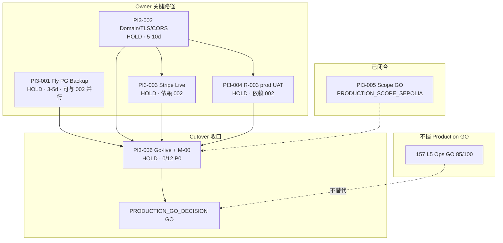

# 158 · Production Readiness Deep Audit Report

> **Sprint**：Production Readiness Deep Audit · **PI3-001～006 L5 逐项审计**  
> **Scope SSOT**：[148 PI3-005](./148-PI3-005-Production-Scope-Decision-Report.md) · **`PRODUCTION_SCOPE_SEPOLIA`**  
> **并联基线**：[147 PI3 Closure](./147-PI3-Closure-Program-Audit-Report.md) · [151～155 Execution](./151-PI3-002-Production-Domain-TLS-CDN-CORS-Execution-Report.md) · [157 L5-P0 GO](./157-L5-P0-Closure-Report.md)  
> **日期**：2026-06-08  
> **纪律**：**禁止新增业务功能代码** — 仅审计 harness / 证据链  
> **一键 gate**：`bash scripts/check-production-readiness-deep-audit-execution.sh`  
> **目标**：诚实 **`PRODUCTION_GO_DECISION: GO`** 路径图（非 L5 Ops GO 替代）

---

## 1. Executive verdict

| 维度 | 判定 |
|------|------|
| **158 审计程序** | **COMPLETE** — 六轨矩阵 · gate · 阻塞图 · Owner 工时 |
| **PI3 执行程序（151～155）** | **5/5 COMPLETE** — harness 已交付 |
| **PI3 Owner 闭合** | **0/5 GO** — 001/002/003/004/006 均 **HOLD** |
| **PI3-005 Scope** | **GO** — Sepolia scope 已锁 · Mainnet defer |
| **157 L5 Ops** | **`OPERATIONS_L5_AUDIT_GO` 85/100** — **不替代** Production GO |
| **Production Readiness Score** | **58/100**（程序 50% 权重已交付 · Owner 闭合 0%） |
| **Production GO** | **`NO_GO`** — 维持 147 / 155 决策包 |

**158 正式裁定：** **`PRODUCTION_READINESS_DEEP_AUDIT_HOLD`**

**升格 `PRODUCTION_READINESS_DEEP_AUDIT_GO`：** PI3-001～004 + PI3-006 **Owner GO** → M-00 **BLOCKER=0** + 签字 → **`production_go_decision=GO`** → score **≥ 90**。

---

## 2. PI3 逐项 L5 审计（GO / HOLD · 根因 · Owner · 工时 · 阻塞）

| ID | 裁定 | 根因（158 gate 复验） | Owner 实际操作（摘要） | 预计工时 | 被谁阻塞 | 阻塞谁 |
|----|------|----------------------|------------------------|----------|----------|--------|
| **PI3-001** | **HOLD** | B-475 **`PLANNED`** · prod Fly backup **未启用** · prod restore drill **NOT_RUN** · fly 未 auth 时 live probe SKIP | `fly auth login` → `enable-fly-pg-backup.sh tt-traveltrust-prod` → `run-phase3-db-restore-drill-prod.sh` → `verify-pi3-001-rpo-rto-baseline.sh` → execution gate **GO** | **24～40h**（3～5 工作日） | — | **PI3-006 §2** · go-live DB |
| **PI3-002** | **HOLD** | **`PROD_*` 未设** · prod domain **NOT_CONFIGURED** · alignment **SKIPPED** · CORS 占位 | 注册域 → DNS/Fly certs → `.env.production.local` + `build.env.local` → deploy API/Web → `patch-tt-api-prod-cors.sh` → `check-production-web-alignment.sh` → gate **GO** | **40～80h**（5～10 工作日） | — | **PI3-003** · **PI3-004** · **PI3-006 §3/5/7** |
| **PI3-003** | **HOLD** | 无 **`sk_live_*`** · prod webhook **NOT_REGISTERED** · `smoke-stripe-live-webhook-prod` **NOT_RUN**（staging H3 **PASS**） | Stripe Live 开通 → **依赖 PI3-002 API 域** → `register-stripe-live-webhook-prod.sh` → `sync-fly-stripe-onboarding-secrets-prod.sh` → live smoke → gate **GO** | **16～24h**（域就绪后 2～3 日） | **PI3-002** | **PI3-006 §6** |
| **PI3-004** | **HOLD** | `report.json` **`release_gate=NO_GO`** · R-003 prod **NOT_RUN** · 六域 UAT **NOT_RUN**（freeze gates **PASS**） | **PI3-002 prod bases** → `run-r003-production-regression.sh` → `run-production-uat-six-domains.sh` → cases PASS → `validate-regression-report.py --require-go` → go-live §0.3 签字 → gate **GO** | **40～56h**（5～7 工作日） | **PI3-002**（**PI3-003** 建议并联 §6） | **PI3-006 §0** · M-00 回归 |
| **PI3-005** | **GO** | **`PRODUCTION_SCOPE_SEPOLIA`** 已书面闭合 · Mainnet **NOT_SELECTED** | 维持 148 决策包 · 若改 Mainnet 须新 scope sprint | **0h**（已闭） | — | —（Sepolia prod 不挡） |
| **PI3-006** | **HOLD** | PI3-001～004 **HOLD** · go-live **0/12** · P0 **0/12** · M-00 **BLOCKER=7** · **`M-00_SIGNED=false`** | 001→004 Owner GO 后：勾选 go-live §0–§11 → P0 十二项 **12/12** → `run-production-cutover-smoke.sh` prod → `run-m00-final-release-audit.sh` **BLOCKER=0** → M-00 签字 → gate **GO** | **24～40h**（3～5 工作日收尾） | **PI3-001～004** | **`PRODUCTION_GO_DECISION`** |

**Gate 机读（2026-06-08 复验）：**

```text
TT_PI3_001_...: PI3-001_HOLD
TT_PI3_002_...: PI3-002_HOLD
TT_PI3_003_...: PI3-003_HOLD
TT_PI3_004_...: PI3-004_HOLD
TT_PI3_006_...: PI3-006_HOLD
PRODUCTION_GO_DECISION: NO_GO
M-00 blockers=7
```

---

## 3. 阻塞关系图



**关键路径（Sepolia Production）：** **PI3-002**（最长）→ **PI3-003 + PI3-004**（可部分并行）→ **PI3-006**；**PI3-001** 与 **PI3-002** 可并行，但 **PI3-006** 勾选前须两者均 **GO**。

---

## 4. 最终 Production GO 路径图（Owner 序）

| 阶段 | 轨 | Owner 动作 | 出口判据 | 累计工时（估） |
|------|-----|-----------|----------|----------------|
| **0** | PI3-005 | （已完成）维持 Sepolia scope | 148 **GO** | 0h |
| **1a** | PI3-002 | 域名 · TLS · CORS · prod deploy · alignment | `TT_PI3_002_*: PI3-002_GO` | 40～80h |
| **1b** | PI3-001 | Fly backup · prod drill · B-475 **PASS** | `TT_PI3_001_*: PI3-001_GO` | 24～40h（并行 1a） |
| **2a** | PI3-003 | Stripe Live · webhook · secrets · smoke | `TT_PI3_003_*: PI3-003_GO` | +16～24h |
| **2b** | PI3-004 | R-003 prod · 六域 UAT · `report.json GO` | `TT_PI3_004_*: PI3-004_GO` | +40～56h |
| **3** | PI3-006 | go-live §0–§11 · P0 12/12 · cutover smoke · M-00 | `TT_PI3_006_*: PI3-006_GO` · **M-00 签字** | +24～40h |
| **4** | Decision | 更新 [PRODUCTION-GO-DECISION-PACKAGE](../../runbook/PRODUCTION-GO-DECISION-PACKAGE.md) | **`PRODUCTION_GO_DECISION: GO`** | — |

**总 Owner 工时（首次 Sepolia prod cutover）：** 约 **144～240h**（**18～30 工作日**），含 DNS/Finance 等待；**关键路径约 80～160h**（以 PI3-002 为瓶颈）。

---

## 5. 与 L5 Ops（157）边界

| 项 | 157 L5 Ops | 158 Production Readiness |
|----|------------|--------------------------|
| **范围** | E2/E3/E4/C5/D3 运营探针 | PI3 infra · PSP · 回归 · cutover |
| **裁定** | **`OPERATIONS_L5_AUDIT_GO` 85/100** | **`PRODUCTION_READINESS_DEEP_AUDIT_HOLD` 58/100** |
| **能否公网 cutover** | **否** | **否** — 须 PI3-006 + M-00 |
| **F2/F3** | L5 可不挡 ops GO | Production **须 GO** |

---

## 6. 复现步骤

```bash
# 全量 158 gate（内含 PI3-001~004/006 execution gate 复跑 · 约 5～8 min）
bash scripts/check-production-readiness-deep-audit-execution.sh

# 仅静态矩阵（跳过 live gate 复跑）
PROD_READINESS_SKIP_GATES=1 bash scripts/dev/run-production-readiness-deep-audit.sh

# 单项 PI3 execution gate
bash scripts/check-pi3-002-production-domain-tls-cdn-cors-execution.sh
bash scripts/check-pi3-001-fly-pg-backup-disaster-recovery-execution.sh
bash scripts/check-pi3-003-stripe-live-production-webhook-execution.sh
bash scripts/check-pi3-004-production-readiness-verification-execution.sh
bash scripts/check-pi3-006-go-live-production-cutover-execution.sh
```

---

## 7. 证据链

| 资产 | 路径 |
|------|------|
| Audit matrix | `evidence/production_readiness_deep_audit/audit_matrix.v1.json` |
| Baseline | `evidence/production_readiness_deep_audit/baseline_record.v1.json` |
| Gate evidence | `evidence/GO_phase2_testnet_20260526/phase3-production-prep/prod-readiness-audit-exec-20260608T024444Z/` |
| PI3 execution 证据 | `evidence/GO_phase2_testnet_20260526/phase3-production-prep/pi3-*-exec-<UTC>/` |
| Cutover Runbook | `docs/runbook/PRODUCTION-CUTOVER-RUNBOOK-SEPOLIA-SCOPE.md` |
| GO 决策包 | `docs/runbook/PRODUCTION-GO-DECISION-PACKAGE.md` |

---

## 8. npm / 交叉引用

```bash
cd frontend && npm run gate:production-readiness-deep-audit-execution
```

| 文档 | 关系 |
|------|------|
| [147](./147-PI3-Closure-Program-Audit-Report.md) | 程序审计 GO · Production NO_GO |
| [155](./155-PI3-006-GoLive-Checklist-Production-Cutover-Report.md) | Cutover 程序 · PI3-006 HOLD |
| [157](./157-L5-P0-Closure-Report.md) | L5 ops GO · 不替代本审计 |
| [PHASE3-ENTRY-PRODUCTION-READINESS-MATRIX](../../runbook/PHASE3-ENTRY-PRODUCTION-READINESS-MATRIX.md) | Phase ③ 入口矩阵 |

---

**Gate 输出：** `TT_PRODUCTION_READINESS_DEEP_AUDIT: PRODUCTION_READINESS_DEEP_AUDIT_HOLD`

**下一动作：** Owner 从 **PI3-002 + PI3-001 并行** 开工 → 003/004 → **PI3-006 + M-00** → **`PRODUCTION_GO_DECISION: GO`**
