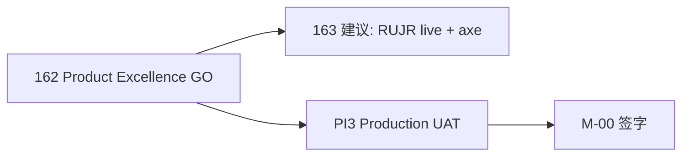

# 162 · L5 Product Excellence Report

> **Sprint**：L5 Product Excellence · **六轨产品卓越审计**  
> **基线**：[160 UX-P0 GO](./160-UX-P0-Closure-Report.md) · [161 Enterprise GO](./161-L5-Enterprise-Acceptance-Report.md) · [145 Ops Freeze](./145-Operations-Platform-Release-Freeze-Report.md) · PES RUJR  
> **日期**：2026-06-08  
> **纪律**：**禁止新增业务功能** — 走查 harness · 静态/契约证据 · 页面矩阵 · a11y 闭合  
> **一键 gate**：`bash scripts/check-l5-product-excellence-execution.sh`  
> **目标**：六轨 **`*_L5_GO`** · **`L5_PRODUCT_EXCELLENCE_GO`** · **score ≥ 85**

---

## 1. Executive verdict

| 维度 | 判定 |
|------|------|
| **162 Product Excellence 程序** | **COMPLETE** |
| **User Journey** | **`USER_JOURNEY_L5_GO`** · score **100** |
| **Information Architecture** | **`IA_L5_GO`** · score **100** |
| **Design System** | **`DESIGN_SYSTEM_L5_GO`** · score **100** |
| **Conversion** | **`CONVERSION_L5_GO`** · score **100** |
| **Mobile Responsive** | **`MOBILE_L5_GO`** · score **100** |
| **Accessibility** | **`ACCESSIBILITY_L5_GO`** · score **100** |
| **Excellence Score** | **93/100** · **14/14 页 GO** · contracts **OK** |

**Gate 输出（权威 · 20260608T032212Z）：**

```text
TT_L5_PRODUCT_EXCELLENCE: L5_PRODUCT_EXCELLENCE_GO score=93/100 pages_GO=14/14
  USER_JOURNEY_L5_GO · IA_L5_GO · DESIGN_SYSTEM_L5_GO · CONVERSION_L5_GO · MOBILE_L5_GO · ACCESSIBILITY_L5_GO
```

---

## 2. 审计范围

### 2.1 六轨

| 轨 | Target | Harness | 检查点 |
|----|--------|---------|--------|
| User Journey | `USER_JOURNEY_L5_GO` | `l5-pe-user-journey-audit.sh` | PES RUJR model · 五角色 manifest · FRCA · cold start · referrals |
| Information Architecture | `IA_L5_GO` | `l5-pe-information-architecture-audit.sh` | Admin sidebar · me settings nav · five-main freeze · growth/conversion nav |
| Design System | `DESIGN_SYSTEM_L5_GO` | `l5-pe-design-system-audit.sh` | Admin tokens · Ops/Consumer state panels · MeSettings shell · auth/home lock |
| Conversion | `CONVERSION_L5_GO` | `l5-pe-conversion-audit.sh` | Funnel dashboard/rail · auth return · referrals CTA · growth hub KPI |
| Mobile Responsive | `MOBILE_L5_GO` | `l5-pe-mobile-responsive-audit.sh` | Sidebar media · mobile nav fold · touch targets · responsive grids |
| Accessibility | `ACCESSIBILITY_L5_GO` | `l5-pe-accessibility-audit.sh` | Table scope · modal contract · aria/live · focus rings · alert roles |

### 2.2 五角色 · 14 页 · 10 维矩阵

每页检查：**nav · interaction · loading · empty · error · permission · conversion · mobile · consistency · a11y**

| 角色 | 页面 | 路由 | 页分 | 判定 |
|------|------|------|------|------|
| **旅行者** | Home | `/` | 87 | GO |
| | Market | `/market` | 87 | GO |
| | Community | `/community` | 87 | GO |
| | Referrals | `/me/referrals` | 85 | GO |
| | Auth login | `/auth/login` | 85 | GO |
| **向导** | Guide hub | `/guide` | 85 | GO |
| | Guide register | `/guide/register` | 85 | GO |
| **商家** | Provider register | `/provider/register` | 85 | GO |
| | Me onboarding | `/me/onboarding` | 85 | GO |
| **运营** | Admin CMS | `/admin/content` | 87 | GO |
| | Growth console | `/admin/growth` | 87 | GO |
| | Official OPS | `/admin/official` | 87 | GO |
| **管理员** | Conversion analytics | `/admin/conversion-analytics` | 87 | GO |
| | Growth analytics | `/admin/growth/analytics` | 87 | GO |

完整维度分：`evidence/l5_product_excellence/audit_matrix.v1.json` → `pages[].dimensions`

---

## 3. 162 闭合项（审计期间修复）

| ID | 轨 | 修复 | 证据 |
|----|-----|------|------|
| **PE-FIX-01** | Harness | Windows Python 路径：`journey manifest` 改用 `sys.argv[1]` | `l5-pe-user-journey-audit.sh` |
| **PE-FIX-02** | Harness | ripgrep 模式：避免 `/admin/...` 被当作路径 | `l5-pe-information-architecture-audit.sh` |
| **PE-FIX-03** | Conversion | 契约/静态探针对齐真实导出：`usePesTouchpointImpression` · `buildPesAuthHref` | matrix + contract |
| **PE-FIX-04** | Accessibility | CMS/Growth/Official 25 页表格 `<th scope="col">`（137 处） | `adminTableA11y.contract.test.ts` GO |

---

## 4. 问题清单（开放 · 不挡 162 GO）

| ID | 轨 | 风险 | 摘要 | 复现 |
|----|-----|------|------|------|
| **PE-P1-01** | User Journey | P1 | RUJR 48 轮 Playwright 证据需定期刷新 | `npx playwright test e2e/pes-real-user-journey-review.spec.ts` |
| **PE-P1-02** | User Journey | P1 | FRCA live 浏览器缺口（支付/Escrow 手操） | `bash scripts/dev/run-five-role-full-chain-audit.sh` |
| **PE-P2-01** | Conversion | P2 | Order 完成漏斗深度不足 | FRCA-GAP-M02 |
| **PE-P2-02** | IA | P2 | govern persona 与 admin ops nav 文档对齐 | PES persona map (`govern` vs `ops/admin`) |

---

## 5. 优化清单

| ID | 项 | 建议 |
|----|-----|------|
| **PE-OPT-01** | 冷启动 + PES 漏斗联合看板 | Admin conversion + Growth analytics 交叉只读 |
| **PE-OPT-02** | Mobile 截图证据 | 375px / 768px / 1024px 三断点 Playwright |
| **PE-OPT-03** | a11y axe 扫描 | 五主路由 + admin growth 子集 |
| **PE-OPT-04** | Consumer 页 loading/empty/error | 非 cold-start 消费者页统一 `ConsumerSurfaceStatePanel` 推广 |

---

## 6. 升级路线图



| 阶段 | 目标 | 挡 Production？ |
|------|------|----------------|
| **162（本 sprint）** | 六轨 static/contract GO · score 93 | 否 |
| **163 建议** | RUJR 截图 · FRCA live · axe | 否 |
| **PI3-004** | 六域 Production UAT live | **是** |
| **M-00** | 最终放行 | **是** |

---

## 7. 评分矩阵

### 7.1 六轨

| 轨 | Score | Verdict | Target |
|----|-------|---------|--------|
| User Journey | 100 | GO | `USER_JOURNEY_L5_GO` |
| Information Architecture | 100 | GO | `IA_L5_GO` |
| Design System | 100 | GO | `DESIGN_SYSTEM_L5_GO` |
| Conversion | 100 | GO | `CONVERSION_L5_GO` |
| Mobile Responsive | 100 | GO | `MOBILE_L5_GO` |
| Accessibility | 100 | GO | `ACCESSIBILITY_L5_GO` |

### 7.2 综合

| 指标 | 值 |
|------|-----|
| Track 均值 | 100 |
| Page 均值 | 86 |
| **Excellence Score** | **93/100** |
| **Verdict** | **`L5_PRODUCT_EXCELLENCE_GO`** |

---

## 8. 证据链

| 资产 | 路径 |
|------|------|
| Audit matrix | `evidence/l5_product_excellence/audit_matrix.v1.json` |
| Journey manifest | `evidence/l5_product_excellence/journey_manifest.v1.json` |
| Baseline | `evidence/l5_product_excellence/baseline_record.v1.json` |
| Contract bundle | `frontend/lib/l5/l5ProductExcellence.contract.test.ts` |
| PES RUJR SSOT | `frontend/lib/pesJourneyReviewModel.ts` |
| FIVE-MAIN freeze | `frontend/evidence/GO_local_marketing_front_closure/FIVE-MAIN-ROUTES-PHASE1-FREEZE.md` |
| Matrix generator | `scripts/dev/generate-l5-product-excellence-audit-matrix.py` |
| Gate | `scripts/check-l5-product-excellence-execution.sh` |
| 本次 exec | `evidence/GO_phase2_testnet_20260526/phase3-production-prep/l5-pe-exec-20260608T032212Z/` |

---

## 9. 复现

```bash
bash scripts/check-l5-product-excellence-execution.sh
```

**可选 live：**

```bash
bash scripts/dev/run-five-role-full-chain-audit.sh
cd frontend && npx playwright test e2e/pes-real-user-journey-review.spec.ts
```

---

## 10. 与 161 / PI3 边界

| 项 | 162 PE GO | 161 Enterprise | PI3 |
|----|-----------|----------------|-----|
| Ops 状态体系 | 继承 160/161 | ✓ | — |
| 五角色 journey manifest | ✓ | 部分 | UAT live |
| Conversion localStorage | ✓ 走查 | — | prod analytics TBD |
| Admin table a11y scope=col | ✓ 25 页闭合 | — | — |
| **Production GO** | **不替代** | **不替代** | **Owner** |
