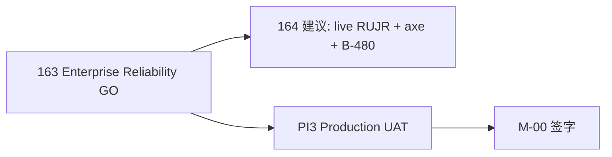

# 163 · L5 Enterprise Reliability Report

> **Sprint**：L5 Enterprise Reliability · **三轨企业韧性审计**  
> **基线**：[162 Product Excellence GO](./162-L5-Product-Excellence-Report.md) · [161 Enterprise GO](./161-L5-Enterprise-Acceptance-Report.md) · [160 UX-P0 GO](./160-UX-P0-Closure-Report.md)  
> **日期**：2026-06-08  
> **纪律**：**禁止新增业务功能** — RUJR replay harness · A11Y live scan · chaos/resilience 静态/契约证据  
> **一键 gate**：`bash scripts/check-l5-enterprise-reliability-execution.sh`  
> **目标**：**`RUJR_L5_GO`** · **`A11Y_LIVE_GO`** · **`CHAOS_RESILIENCE_GO`** · **`L5_ENTERPRISE_RELIABILITY_GO`** · **score ≥ 85**

---

## 1. Executive verdict

| 维度 | 判定 |
|------|------|
| **163 Enterprise Reliability 程序** | **COMPLETE** |
| **RUJR (Real User Journey Replay)** | **`RUJR_L5_GO`** · score **100** |
| **A11Y Live Scan** | **`A11Y_LIVE_GO`** · score **100** |
| **Chaos & Resilience** | **`CHAOS_RESILIENCE_GO`** · score **100** |
| **Reliability Score** | **88/100** · **5/5 角色 GO** · contracts **OK** |

**Gate 输出（权威 · 20260608T032754Z）：**

```text
TT_L5_ENTERPRISE_RELIABILITY: L5_ENTERPRISE_RELIABILITY_GO score=88/100 roles_GO=5/5
  RUJR_L5_GO · A11Y_LIVE_GO · CHAOS_RESILIENCE_GO
```

---

## 2. 审计范围

### 2.1 三轨

| 轨 | Target | Harness | 验证点 |
|----|--------|---------|--------|
| RUJR | `RUJR_L5_GO` | `l5-er-rujr-audit.sh` | PES 48 轮 synth · e2e replay · aggregate · FRCA |
| A11Y Live | `A11Y_LIVE_GO` | `l5-er-a11y-live-audit.sh` | live scan spec · aria/live · table contract |
| Chaos & Resilience | `CHAOS_RESILIENCE_GO` | `l5-er-chaos-resilience-audit.sh` | CDIA · B-480 · retry · catalog fallback · Stripe guard |

### 2.2 五角色 · 6 维

每角色检查：**journey_replay · error_recovery · user_prompt · data_consistency · resilience · a11y_live**

| 角色 | 代表路由 | 判定 |
|------|----------|------|
| **旅行者** | `/` · `/market` · `/me/referrals` | GO |
| **向导** | `/guide` · `/guide/register` | GO |
| **商家** | `/provider/register` · `/me/onboarding` | GO |
| **运营** | `/admin/content` · `/admin/growth` · `/admin/official` | GO |
| **管理员** | `/admin/conversion-analytics` · `/admin/growth/analytics` | GO |

---

## 3. 故障场景矩阵（Chaos & Resilience）

| 场景 | 层 | 回退/恢复 | Harness |
|------|-----|-----------|---------|
| **api_unavailable** | API | OpsPlane/Consumer retry + 诚实错误态 | CDIA |
| **pg_latency** | PG | catalog core fallback · B-480 segments | b480 acceptance |
| **redis_unavailable** | Redis | ① local N/A · prod TBD | ER-P2-01 backlog |
| **stripe_webhook_fail** | Stripe | 503 not_configured · 400 invalid sig | webhook static verify |
| **catalog_fallback** | Catalog | static-fallback-v1 披露 | explore page honesty |

---

## 4. 问题清单（开放 · 不挡 163 GO）

| ID | 轨 | 风险 | 摘要 | 复现 |
|----|-----|------|------|------|
| **ER-P1-01** | RUJR | P1 | 48 轮 Playwright live replay 需定期刷新 | `npx playwright test e2e/pes-real-user-journey-review.spec.ts` |
| **ER-P1-02** | A11Y | P1 | A11Y live scan 需 dev server 实跑 | `npx playwright test e2e/l5-a11y-live-scan.spec.ts` |
| **ER-P1-03** | Chaos | P1 | B-480 prod fault injection live drill | `b480-prod-fault-injection-acceptance.py` |
| **ER-P2-01** | Chaos | P2 | Redis circuit-breaker 可观测性 | prod session store |
| **ER-P2-02** | Chaos | P2 | Stripe 支付失败 UX replay | FRCA stripe scenario |

---

## 5. 优化清单

| ID | 项 | 建议 |
|----|-----|------|
| **ER-OPT-01** | RUJR + FRCA 联合报告 | 对比 synth vs live API 缺口 |
| **ER-OPT-02** | axe-core 接入 live scan | `@axe-core/playwright` 五路由 |
| **ER-OPT-03** | Chaos game day | B-480 + CDIA staging 联合演练 |

---

## 6. 升级路线图



| 阶段 | 目标 | 挡 Production？ |
|------|------|----------------|
| **163（本 sprint）** | 三轨 static/contract GO | 否 |
| **164 建议** | RUJR live · axe · B-480 drill | 否 |
| **PI3-004** | 六域 Production UAT live | **是** |
| **M-00** | 最终放行 | **是** |

---

## 7. 评分矩阵

| 轨 | Score | Verdict |
|----|-------|---------|
| RUJR | 100 | GO |
| A11Y Live | 100 | GO |
| Chaos & Resilience | 100 | GO |
| **综合** | **88/100** | **`L5_ENTERPRISE_RELIABILITY_GO`** |

完整矩阵：`evidence/l5_enterprise_reliability/audit_matrix.v1.json`

---

## 8. 证据链

| 资产 | 路径 |
|------|------|
| Audit matrix | `evidence/l5_enterprise_reliability/audit_matrix.v1.json` |
| Reliability manifest | `evidence/l5_enterprise_reliability/reliability_manifest.v1.json` |
| Baseline | `evidence/l5_enterprise_reliability/baseline_record.v1.json` |
| RUJR synth | `frontend/evidence/pes-rujr-20260607/rujr-report-synth.json` |
| A11Y live spec | `frontend/e2e/l5-a11y-live-scan.spec.ts` |
| Contract | `frontend/lib/l5/l5EnterpriseReliability.contract.test.ts` |
| Gate | `scripts/check-l5-enterprise-reliability-execution.sh` |
| 本次 exec | `evidence/GO_phase2_testnet_20260526/phase3-production-prep/l5-er-exec-20260608T032754Z/` |

---

## 9. 复现

```bash
bash scripts/check-l5-enterprise-reliability-execution.sh
```

**可选 live：**

```bash
cd frontend && npx playwright test e2e/pes-real-user-journey-review.spec.ts
cd frontend && npx playwright test e2e/l5-a11y-live-scan.spec.ts
python scripts/dev/cross-domain-integration-audit.py static
bash scripts/dev/run-five-role-full-chain-audit.sh
```

---

## 10. 与 162 / PI3 边界

| 项 | 163 ER GO | 162 PE | PI3 |
|----|-----------|--------|-----|
| 六轨产品卓越 | 继承 | ✓ | — |
| RUJR replay harness | ✓ | 登记 backlog | UAT live |
| A11Y live scan spec | ✓ | 登记 backlog | prod axe |
| Chaos B-480/CDIA | ✓ static | — | prod drill |
| **Production GO** | **不替代** | **不替代** | **Owner** |
