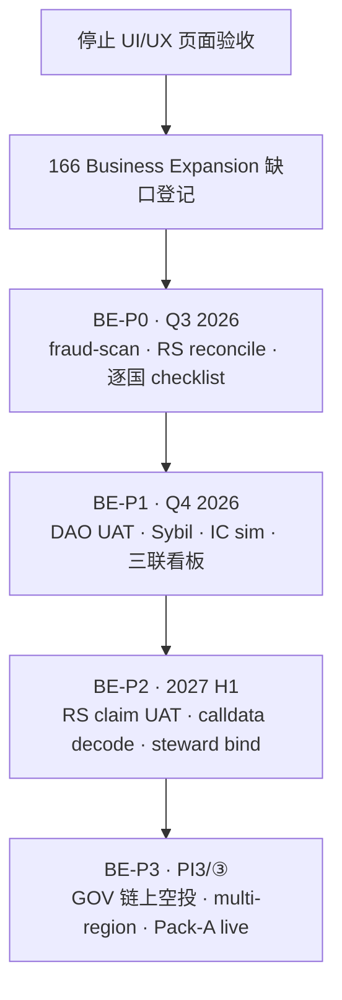

# 166 · Business Expansion Audit Report

> **Sprint**：Business Expansion · **商业能力扩展专项审计**  
> **基线**：[165 Business & Governance](./165-L5-Enterprise-Business-Governance-Report.md) · [133 G-S8 Growth Freeze](./133-G-S8-Growth-Release-Freeze-Report.md) · [Phase2 Sepolia Spine](../../runbook/TT-PHASE2-SEPOLIA-DEPLOYED-SPINE-SUMMARY.md)  
> **日期**：2026-06-08  
> **范围变更**：**停止 UI/UX 审计与页面级验收**；本 Sprint **仅** Business Expansion 五域  
> **静态探针**：`bash scripts/dev/run-business-expansion-audit.sh`  
> **机读缺口矩阵**：`evidence/business_expansion/gap_matrix.v1.json`

---

## 1. 范围切换声明

| 停止 | 转入 |
|------|------|
| L5 Product Excellence 页面 10 维矩阵 | RegionShare 商业闭环 |
| UI/UX P0/P1/P2 页面走查 | DAO 链上治理生产就绪 |
| Playwright 页面级 acceptance | 自动风控引擎 |
| A11Y live / 页面 Empty/Error 验收 | 投资人收益模拟 |
| — | 全球国家市场运营体系 |

**162–165 结论仍有效**，但 **166 不再扩展页面级 gate**。后续产能投入 **商业扩展缺口**，而非 UI 抛光。

---

## 2. 五域成熟度总览

| 域 | 现状 maturity | ① 本地/② Sepolia | ③ Production | P0 缺口数 |
|----|---------------|------------------|--------------|-----------|
| **RegionShare** | P2 Sepolia 试点 | RegionVault · CN epoch · Ledger pilot | 多辖区 + live reconcile **未闭** | 1 |
| **DAO 链上治理** | P2 栈已部署 | TTG/Timelock/Governor/Safe | queue/execute UAT · GOV 空投 **HOLD** | 1 |
| **自动风控引擎** | P1 人工运营 | freeze · hourly bind · Admin UI | fraud-scan POST **未建** | 1 |
| **投资人收益模拟** | P1 文档静态 | IC-49 · accruals API · Claim 合约 | 动态 sim harness **未建** | 0 |
| **全球国家市场运营** | P1 CMS/Catalog | C-S5 geo · country_ledger · CMS | 逐国 go-live SOP **未建** | 1 |

---

## 3. 域一 · RegionShare

### 3.1 已有能力（证据）

| 能力 | 证据 |
|------|------|
| FeeRouter → RegionVault 四腿路由 | [Sepolia Spine §2](../../runbook/TT-PHASE2-SEPOLIA-DEPLOYED-SPINE-SUMMARY.md) |
| RegionStewardStakePool (TTG Seat) | Spine §3 · `RegionStewardStakePool` |
| CountryPoolRedemptionEpoch CN 试点 | Spine §4 · `0x7120…0829` |
| CountryPoolLedgerV0 试点 | `COUNTRY_POOL_LEDGER_PILOT_ADDRESS` · 14 § CountryPoolLedger |
| RegionVault 事件投影 | Admin `/admin/region-vault` · governance vault-forwards |
| RegionDistributionClaim ABI | `contracts/abi/RegionDistributionClaim.json` |

### 3.2 剩余缺口

| ID | 优先级 | 缺口 | 影响 |
|----|--------|------|------|
| **BE-RS-01** | **P0** | RegionShare 链上快照 vs RegionVault/FeeRouter 投影 **无自动化 reconcile** | 区域分润无法审计闭环 |
| **BE-RS-02** | P1 | CountryPool 仅 **CN 试点** epoch，多辖区扩展未交付 | 全球 RegionShare 无法规模化 |
| **BE-RS-03** | P1 | RegionDistributionClaim × 运营席位 **UAT 未闭** | 收益领取路径未验证 |
| **BE-RS-04** | P2 | region_steward 与 RegionShare **分润对账看板**缺失 | 区域运营商无法自助对账 |

---

## 4. 域二 · DAO 链上治理

### 4.1 已有能力

| 能力 | 证据 |
|------|------|
| 治理栈 Sepolia 序 1 | TTG · Timelock · Governor · Safe admin |
| FundStack 序 2 | FeeRouter · Treasury · ReserveVault · EscrowFactory |
| FE 治理 Hub | `/governance` · proposals · delegate · distribution-claim |
| 链下投影 MVP | B-072 提案 · B-073 委托 · accruals 只读 |
| Safe 部署流测试 | `GovernanceSafeDeployFlow.t.sol` |
| ITG 深审 harness | `identity-trust-governance-deep-audit.py` |

### 4.2 剩余缺口

| ID | 优先级 | 缺口 | 影响 |
|----|--------|------|------|
| **BE-DAO-01** | **P0** | **③ queue · execute · Timelock delay** 生产 UAT 未闭 | 无法宣称链上治理 GO |
| **BE-DAO-02** | P1 | 提案 calldata → Treasury/FeeRouter **链上解码验证** incomplete | 投票透明性不足 |
| **BE-DAO-03** | P1 | **链上 GOV 空投 transfer** — 133/165 明确 **HOLD** | Growth 空投仍链下名义 |
| **BE-DAO-04** | P2 | 混合治理 → 链上自治 **迁移 runbook** 未 Owner 签字 | 合规/叙事风险 |

---

## 5. 域三 · 自动风控引擎

### 5.1 已有能力（G-S5/G-S6 冻结）

| 能力 | 证据 |
|------|------|
| Admin 风控中心 | freeze/unfreeze · 规则只读 · 信号列表 |
| `growth_fraud_status` 状态机 | normal / points_frozen / airdrop_ineligible / banned |
| Observer 跳过 frozen | G-S2 ledger · SkippedFrozen |
| Referral hourly bind limit | `referral_hourly_rate_limit` in `growth_referral.rs` |
| Airdrop eligible 过滤 | 快照时仅 `normal` 参与 |

### 5.2 剩余缺口

| ID | 优先级 | 缺口 | 影响 |
|----|--------|------|------|
| **BE-FRD-01** | **P0** | **`POST /api/v1/internal/growth/fraud-scan` 未实现**（102 §9.4 · 133 §8） | 注册后无自动扫描 |
| **BE-FRD-02** | P1 | **Sybil 自动扫描引擎**缺失 | 依赖人工 freeze |
| **BE-FRD-03** | P1 | community `risk_signals` 与 Growth 规则 **未合并** | 双轨风控 |
| **BE-FRD-04** | P2 | KOL GMV/订单 **反套利对拍**未建 | KOL 激励可被刷 |

---

## 6. 域四 · 投资人收益模拟

### 6.1 已有能力

| 能力 | 证据 |
|------|------|
| InvestorDistributionClaim 合约 | `InvestorDistributionClaim.sol` · Sepolia ABI |
| 应计分录 API | `GET …/governance/investor-distribution-accruals` |
| IC 决策模拟文档 | [49 企业级 IC 模拟](../../fundraising/internal/49-企业级投资委员会决策模拟.md) |
| 融资材料包 | Executive Summary · Data Room · LP pack gate |
| 治理 Claim UI | `/governance/distribution-claim` |

### 6.2 剩余缺口

| ID | 优先级 | 缺口 | 影响 |
|----|--------|------|------|
| **BE-INV-01** | P1 | IC-49 **未与 engineering evidence 机读联动** refresh | 融资叙事与交付脱节 |
| **BE-INV-02** | P1 | FeeRouter/RegionShare → accrual **动态模拟 harness** 缺失 | 无法演示收益路径 |
| **BE-INV-03** | P2 | Data Room Pack-A **live 演示**未定期刷新 | 投资人 demo 陈旧 |
| **BE-INV-04** | P2 | Cap table + token unlock **情景模型**未 productized | IC 只能读静态 PDF |

---

## 7. 域五 · 全球国家市场运营体系

### 7.1 已有能力

| 能力 | 证据 |
|------|------|
| CMS 国家/城市/POI | `/admin/content/*` · C-S1～C-S5 |
| meta.product_countries 对拍 | [140 C-S5](./140-C-S5-Catalog-Server-Geo-Validation-Operations-Report.md) |
| country_ledger 辖区路由 | `governance/country-ledger/{jurisdiction}` |
| Catalog consumer opt-in | 120/146 prod default ENABLED=0 |
| Official OPS 官方内容 | `/admin/official` · 冷启动联动 |

### 7.2 剩余缺口

| ID | 优先级 | 缺口 | 影响 |
|----|--------|------|------|
| **BE-GCM-01** | **P0** | **逐国 go-live checklist**（legal + ops + catalog）未标准化 | 无法复制开市场 |
| **BE-GCM-02** | P1 | country_ledger ↔ catalog ↔ RegionShare **三联 ops 看板**缺失 | 三国数据孤岛 |
| **BE-GCM-03** | P1 | region_steward 准入 × 国家市场 **绑定自动化** incomplete | 区域运营商 onboarding 手操 |
| **BE-GCM-04** | P2 | 多语言/多币种 **按国家分层** SOP 未与 CMS 发布队列联动 | 运营效率低 |

---

## 8. 问题清单（汇总 · 20 项）

完整机读：`evidence/business_expansion/gap_matrix.v1.json`

| 优先级 | 数量 | 代表项 |
|--------|------|--------|
| **P0** | 4 | fraud-scan · RegionShare reconcile · DAO UAT · 逐国 checklist |
| **P1** | 11 | Sybil 引擎 · 多辖区 CountryPool · IC sim harness · 三联看板 |
| **P2** | 5 | KOL 对拍 · Pack-A refresh · 多语言 SOP |

---

## 9. 优化清单

| ID | 优化 | 域 | 预期收益 |
|----|------|-----|----------|
| **BE-OPT-01** | RegionShare reconcile job（indexer + FeeRouter + RegionVault） | RegionShare | 分润可审计 |
| **BE-OPT-02** | fraud-scan internal route + 注册 hook | 风控 | 降 Sybil 成本 |
| **BE-OPT-03** | Sepolia governance game-day（queue/execute） | DAO | ③ 挡板前置 |
| **BE-OPT-04** | investor-return-sim.py（FeeRouter legs → accrual 投影） | 投资人 | 融资 demo 可信 |
| **BE-OPT-05** | country-market-playbook.md 模板 × CMS 发布 gate | 全球运营 | 可复制开市场 |

---

## 10. 升级路线图



| 阶段 | Sprint 建议 | 交付 | 挡 Production？ |
|------|-------------|------|----------------|
| **BE-P0** | 167 | fraud-scan MVP · RegionShare reconcile 只读 · country playbook v0 | 否 |
| **BE-P1** | 168–169 | Sepolia DAO game-day · Sybil v1 · investor sim harness | 否 |
| **BE-P2** | 170 | RegionDistributionClaim UAT · steward 绑定 · calldata 工具 | 部分 |
| **BE-P3** | PI3-005+ | 链上 GOV · 多辖区 CountryPool · 全球 ops 自动化 | **是** |

---

## 11. 风险矩阵（摘要）

| 域 | 最大风险 | 缓解 |
|----|----------|------|
| RegionShare | 链上/链下分润 drift | BE-OPT-01 reconcile |
| DAO | ③ 未 UAT 即宣称 GO | BE-DAO-01 game-day |
| 风控 | 羊毛/Sybil 规模化 | BE-FRD-01/02 |
| 投资人 | 叙事>可验证交付 | BE-INV-02 sim harness |
| 全球运营 | 逐国合规不一致 | BE-GCM-01 playbook |

---

## 12. 证据链

| 资产 | 路径 |
|------|------|
| 缺口矩阵 | `evidence/business_expansion/gap_matrix.v1.json` |
| 静态探针 | `scripts/dev/run-business-expansion-audit.sh` |
| Growth 冻结 | `docs/handbook/engineering/133-G-S8-Growth-Release-Freeze-Report.md` |
| Sepolia 主脊 | `docs/runbook/TT-PHASE2-SEPOLIA-DEPLOYED-SPINE-SUMMARY.md` |
| IC 模拟 | `docs/fundraising/internal/49-企业级投资委员会决策模拟.md` |
| C-S5 国家 | `docs/handbook/engineering/140-C-S5-Catalog-Server-Geo-Validation-Operations-Report.md` |

---

## 13. 复现

```bash
bash scripts/dev/run-business-expansion-audit.sh
```

**可选 live（商业扩展 · 非页面验收）：**

```bash
bash scripts/dev/phase2-sepolia-spine-audit.sh
bash scripts/check-g-s8-growth-release-freeze.sh
python scripts/dev/identity-trust-governance-deep-audit.py
bash scripts/export-investor-dataroom.sh
```

---

## 14. 与 PI3 / M-00 边界

166 **登记商业扩展缺口**，**不替代** PI3 Production UAT、链上 GOV 发放 Owner 授权、M-00 签字。133 纪律不变：**① 积分/空投链下 ≠ ③ 链上 GOV 真发放**。
