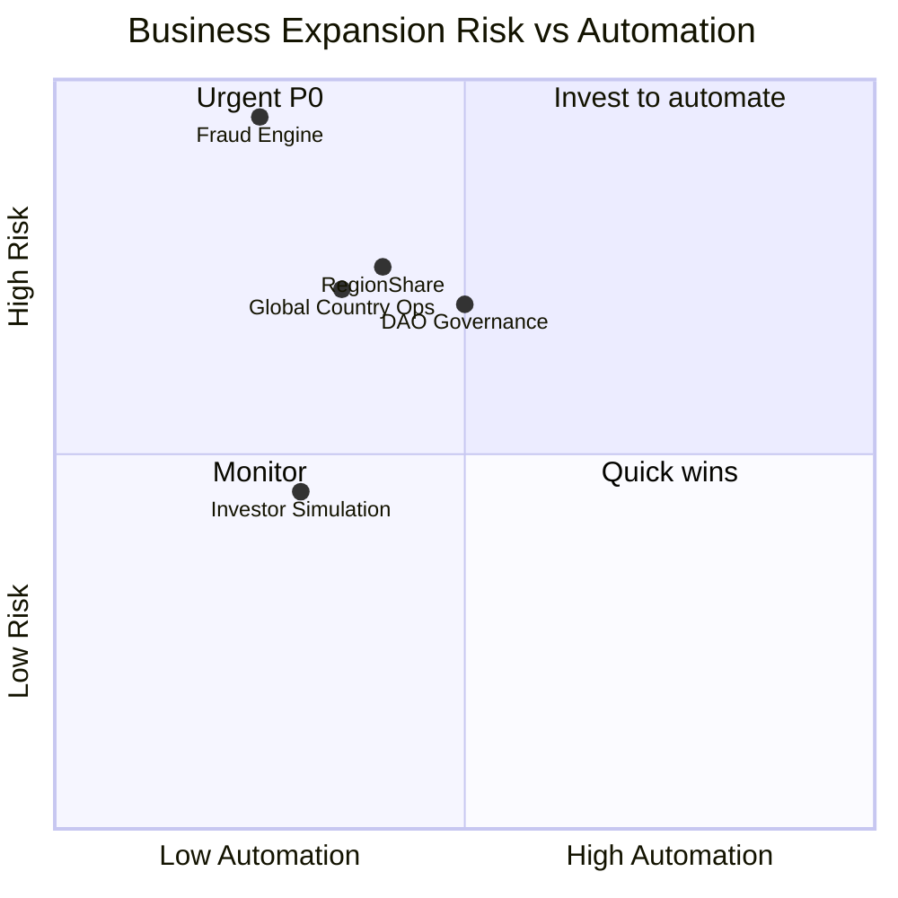
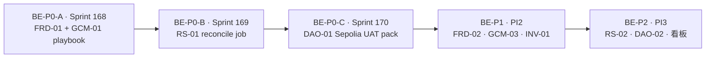

# 167 · Business Expansion Enterprise Gap Audit Report

> **Sprint**：Business Expansion · **企业级差距审计**  
> **基线**：[166 Business Expansion Audit](./166-Business-Expansion-Audit-Report.md) · [165 Business & Governance](./165-L5-Enterprise-Business-Governance-Report.md) · [133 G-S8 Growth Freeze](./133-G-S8-Growth-Release-Freeze-Report.md)  
> **日期**：2026-06-08  
> **范围**：**仅**五域（RegionShare · DAO Governance · Fraud Engine · Investor Simulation · Global Country Operations）  
> **排除**：UI/UX · Admin 页面 · 用户页面 · L5 产品验收  
> **静态探针**：`bash scripts/dev/run-business-expansion-enterprise-gap-audit.sh`  
> **机读矩阵**：`evidence/business_expansion/enterprise_gap_matrix.v1.json` · `gap_matrix.v1.json`

---

## 1. 审计结论（Executive Summary）

| 指标 | 值 |
|------|-----|
| **P0 企业级达标** | **0 / 4 MET** · 4 项均为 **NOT_MET** 或 **PARTIAL** |
| **五域平均 automation** | **36%**（人工/半自动为主） |
| **五域 revenue_closure** | 2×OPEN · 3×PARTIAL · 0×CLOSED |
| **链上治理 maturity（DAO/RS/INV）** | **P2 Sepolia 试点** · ③ Production UAT **未闭** |
| **下一阶段 gate** | `TT_BUSINESS_EXPANSION_ENTERPRISE: GAP_AUDIT_COMPLETE p0_enterprise=HOLD` |

**核心判断**：Business Expansion 五域在 **Sepolia ② 与链下运营 MVP** 上已有骨架，但 **P0 四项均未达企业级闭环**——自动化风控、区域分润对账、链上治理 UAT、逐国开市场 SOP 仍依赖人工与文档 Target，**商业风险与 ops 成本偏高**。

---

## 2. P0 四项 · 企业级标准核查

### 2.1 企业级判定标准（本 Sprint 定义）

| 维度 | 企业级门槛 |
|------|------------|
| **功能闭环** | 蓝图/FRD 指定能力 **已实现** 且可重复执行 |
| **自动化** | ≥ **70%** 关键路径无需人工介入 |
| **审计证据** | 机读报告 + 定时 job/contract test + evidence 目录 |
| **收益闭环** | 资金/权益路径 **可对账**（链上↔链下或 ops↔ledger） |
| **生产就绪** | ③ Production UAT 签字或明确 HOLD 边界（133 ③ 链上 GOV） |

### 2.2 P0 核查表

| ID | 域 | 企业级标准 | 现状证据 | 自动化 | 收益闭环 | 链上成熟度 | **判定** | 分数 |
|----|-----|-----------|----------|--------|----------|------------|----------|------|
| **BE-FRD-01** | Fraud Engine | `POST …/internal/growth/fraud-scan` · 注册后自动扫描 · 规则引擎 · audit/idempotency | `internal/growth.rs` 仅 **award-points / observe / reconcile**；规则 catalog 只读 · Admin 人工 freeze | **25%** | OPEN | N/A | **NOT_MET** | 35 |
| **BE-RS-01** | RegionShare | FeeRouter countryBucket ↔ RegionVault ↔ RegionShare snapshot **自动 reconcile** · drift alert | `region_vault_forwarded_events` · admin reconcile **有投影无闭环 job**；14 § 逐国账本仍 **Target** | **40%** | PARTIAL | P2 Sepolia | **PARTIAL** | 48 |
| **BE-DAO-01** | DAO Governance | Sepolia **live queue→execute** · Timelock delay drill · evidence pack · UI 时间线对齐 | TTG/Timelock/Governor/Safe **已部署** · B-417 scripts · Foundry 闭 · **live UAT pack 未 enterprise 签字** | **50%** | PARTIAL | P2 Deployed | **PARTIAL** | 55 |
| **BE-GCM-01** | Global Country Ops | **逐国 go-live checklist**（legal + ops + catalog + compliance）· CMS 发布 gate | C-S5 geo validation · country_ledger · CMS countries **有** · **无 playbook 模板** | **35%** | OPEN | N/A | **NOT_MET** | 42 |

**P0 汇总**：**无一项 MET**。BE-DAO-01、BE-RS-01 为 **PARTIAL**（② 能力存在，③/闭环未闭）；BE-FRD-01、BE-GCM-01 为 **NOT_MET**（关键交付物缺失）。

---

## 3. 全量 P0/P1/P2 缺口矩阵（含企业维度）

> 优先级沿用 [166 §7](./166-Business-Expansion-Audit-Report.md)；下表增补 **商业风险 · 自动化 · 运营成本 · 收益闭环 · 链上治理成熟度**。

### 3.1 RegionShare

| ID | P | 缺口 | 商业风险 | Auto% | Ops 成本 | 收益闭环 | 链上成熟度 |
|----|---|------|----------|-------|----------|----------|------------|
| BE-RS-01 | **P0** | 无 RegionShare 自动 reconcile | **HIGH** — 分润争议/审计失败 | 40 | HIGH | PARTIAL | P2 |
| BE-RS-02 | P1 | 仅 CN epoch 试点 | HIGH — 无法多辖区规模化 | 35 | HIGH | PARTIAL | P2 |
| BE-RS-03 | P1 | DistributionClaim UAT 未闭 | MEDIUM — 领取路径未验 | 45 | MEDIUM | PARTIAL | P2 |
| BE-RS-04 | P2 | 区域运营商自助对账看板 | MEDIUM | 30 | MEDIUM | OPEN | P1 |

### 3.2 DAO Governance

| ID | P | 缺口 | 商业风险 | Auto% | Ops 成本 | 收益闭环 | 链上成熟度 |
|----|---|------|----------|-------|----------|----------|------------|
| BE-DAO-01 | **P0** | ③ queue/execute 生产 UAT 未闭 | **HIGH** — 治理叙事与合规 | 50 | MEDIUM | PARTIAL | P2 |
| BE-DAO-02 | P1 | 提案 calldata 链上解码 incomplete | MEDIUM | 55 | LOW | PARTIAL | P2 |
| BE-DAO-03 | P1 | 链上 GOV 空投 transfer **HOLD**（133/165） | HIGH — 空投链下名义 | 20 | HIGH | OPEN | P1 |
| BE-DAO-04 | P2 | 混合→链上自治迁移 runbook 未签字 | MEDIUM | 40 | MEDIUM | OPEN | P1 |

### 3.3 Fraud Engine

| ID | P | 缺口 | 商业风险 | Auto% | Ops 成本 | 收益闭环 | 链上成熟度 |
|----|---|------|----------|-------|----------|----------|------------|
| BE-FRD-01 | **P0** | fraud-scan POST 未实现 | **CRITICAL** — Sybil/羊毛 | 25 | HIGH | OPEN | N/A |
| BE-FRD-02 | P1 | Sybil 自动扫描引擎 | CRITICAL | 25 | HIGH | OPEN | N/A |
| BE-FRD-03 | P1 | community risk_signals 未合并 | HIGH | 30 | MEDIUM | OPEN | N/A |
| BE-FRD-04 | P2 | KOL GMV 反套利对拍 | MEDIUM | 20 | MEDIUM | OPEN | N/A |

### 3.4 Investor Simulation

| ID | P | 缺口 | 商业风险 | Auto% | Ops 成本 | 收益闭环 | 链上成熟度 |
|----|---|------|----------|-------|----------|----------|------------|
| BE-INV-01 | P1 | 动态 sim harness（参数 sweep） | MEDIUM — IC/LP 决策滞后 | 30 | MEDIUM | PARTIAL | P1 |
| BE-INV-02 | P1 | Claim 路径 × accruals **E2E UAT** | MEDIUM | 40 | MEDIUM | PARTIAL | P2 |
| BE-INV-03 | P2 | 情景 stress（攻击/延迟）文档→可执行 | LOW | 25 | LOW | OPEN | P1 |
| BE-INV-04 | P2 | Data Room 与 sim 输出自动绑定 | LOW | 35 | LOW | PARTIAL | N/A |

### 3.5 Global Country Operations

| ID | P | 缺口 | 商业风险 | Auto% | Ops 成本 | 收益闭环 | 链上成熟度 |
|----|---|------|----------|-------|----------|----------|------------|
| BE-GCM-01 | **P0** | 逐国 go-live checklist 未标准化 | **HIGH** — 开市场不可复制 | 35 | HIGH | OPEN | N/A |
| BE-GCM-02 | P1 | region_steward 绑定 workflow | HIGH | 40 | HIGH | OPEN | N/A |
| BE-GCM-03 | P1 | catalog publish ↔ country activation gate | MEDIUM | 45 | MEDIUM | PARTIAL | N/A |
| BE-GCM-04 | P2 | 逐国合规/legal 证据目录 SSOT | MEDIUM | 30 | MEDIUM | OPEN | N/A |

**统计**：P0 **4** · P1 **11** · P2 **5** · 合计 **20**（与 166 一致）。

---

## 4. 五域企业画像

| 域 | Auto% | Ops 成本 | 收益闭环 | 链上成熟度 | 首要商业风险 |
|----|-------|----------|----------|------------|--------------|
| **RegionShare** | 40 | HIGH | PARTIAL | **P2** Sepolia 试点 | 分润无法审计 → 区域运营商信任 |
| **DAO Governance** | 50 | MEDIUM | PARTIAL | **P2** 栈已部署 · ③ HOLD | 治理 GO 无法宣称 → 融资/合规 |
| **Fraud Engine** | 25 | HIGH | OPEN | N/A（链下） | Sybil 边际成本 → 增长 ROI 为负 |
| **Investor Simulation** | 30 | MEDIUM | PARTIAL | **P1** 文档+API | LP/IC 决策依赖静态材料 |
| **Global Country Ops** | 35 | HIGH | OPEN | N/A | 逐国 ops 不可复制 → 扩张速度 |

---

## 5. 商业风险热力（按 P0/P1 加权）



| 风险等级 | 缺口 | 说明 |
|----------|------|------|
| **CRITICAL** | BE-FRD-01/02 | 增长规模化前必须自动化风控 |
| **HIGH** | BE-RS-01/02 · BE-DAO-01/03 · BE-GCM-01/02 | 分润、治理、开市场挡板 |
| **MEDIUM** | P1 其余 · P2 对账/看板 | 可排入 PI2–PI3 |

---

## 6. 收益闭环与链上治理成熟度

### 6.1 收益闭环（Revenue Closure）

| 闭环路径 | 状态 | 缺口 |
|----------|------|------|
| FeeRouter → RegionVault → 区域分润 | **PARTIAL** | BE-RS-01 reconcile · BE-RS-03 Claim UAT |
| Investor accruals → Claim | **PARTIAL** | BE-INV-02 E2E UAT |
| Growth 积分/空投 → 链上 GOV | **OPEN** | BE-DAO-03 133 HOLD |
| 逐国 catalog → 交易 GMV | **OPEN** | BE-GCM-01 playbook · BE-GCM-03 gate |

### 6.2 链上治理成熟度阶梯

| 级别 | 定义 | 当前落点 |
|------|------|----------|
| **P0** | 无合约 / 纯文档 | — |
| **P1** | 本地 Foundry + ABI 对齐 | Investor Claim · IC 文档 |
| **P2** | Sepolia 部署 + 索引投影 | **DAO 栈 · RegionVault · CN epoch** ← **当前主战场** |
| **P3** | Sepolia live UAT + evidence 签字 | **BE-DAO-01 目标** |
| **P4** | Production ③ + 多辖区 | RS-02 · GCM 规模化 |

**133 边界**：① 链下 growth/airdrop ≠ ③ 链上 GOV transfer；BE-DAO-03 不得与 BE-FRD/Growth 混 gate。

---

## 7. ROI 排序 · 下一阶段实施路线图

ROI 公式（本 Sprint）：`(商业风险降权 × 收益闭环加速 × 可复制性) / (工程人周 × 链上依赖)`，1–10 分。

| Rank | ID | Sprint | ROI | 人周 | 影响 | 依赖 |
|------|-----|--------|-----|------|------|------|
| **1** | **BE-FRD-01** | **168** | **9.2** | 3 | Sybil 边际成本骤降 · 注册漏斗可 scale | 102 §10.4 · 无链上 |
| **2** | **BE-GCM-01** | **168–169** | **8.5** | 4 | 逐国 checklist 模板 · 降 ops 人力 | C-S5 · CMS |
| **3** | **BE-RS-01** | **169** | **7.8** | 5 | 区域分润审计闭环 · 运营商信任 | indexer · 14 § |
| **4** | **BE-DAO-01** | **170 / PI3** | **6.5** | 8 | ③ 链上治理挡板 · Sepolia game-day | B-417 · Timelock |
| 5 | BE-FRD-02 | 169 | 7.5 | 4 | Sybil 规则引擎深化 | FRD-01 |
| 6 | BE-GCM-03 | 169 | 7.0 | 3 | catalog ↔ country activation | GCM-01 |
| 7 | BE-INV-01 | 170 | 6.8 | 4 | IC 动态 sim | accruals API |
| 8 | BE-RS-02 | PI3 | 6.2 | 6 | 多辖区 epoch | RS-01 |
| 9 | BE-DAO-02 | PI3 | 5.8 | 3 | 提案 calldata 透明 | DAO-01 |
| 10 | BE-DAO-03 | **HOLD** | — | — | 链上 GOV 空投 · 133 单独立项 | 合规 |

### 7.1 阶段划分



| 阶段 | 目标 gate | 交付物（示意） |
|------|-----------|----------------|
| **BE-P0-A** | P0 达标 2/4 | fraud-scan route + contract tests · `country-market-go-live-playbook.v1.md` |
| **BE-P0-B** | P0 达标 3/4 | `region-share-reconcile` cron + drift report |
| **BE-P0-C** | P0 达标 4/4 | Sepolia queue→execute evidence · Owner 签字 |
| **BE-P1** | 五域 Auto≥50% | Sybil 引擎 · catalog gate · sim harness |
| **BE-P2** | Revenue_closure≥3×PARTIAL | 多辖区 · 自助对账 · DAO 解码 |

---

## 8. 运营成本估算（Tier）

| Tier | 特征 | 当前域 |
|------|------|--------|
| **HIGH** | 每日人工 case · 无 cron · 开市场 ad-hoc | Fraud · RegionShare · GCM |
| **MEDIUM** | 半自动 + 偶发 game-day | DAO · Investor |
| **LOW** | 脚本化 + CI gate | （目标态，尚未达） |

**降本杠杆**：FRD-01（−40% fraud ops）· GCM-01（−50% 开市场协调）· RS-01（−30% finance reconcile）。

---

## 9. 探针与证据

```bash
bash scripts/dev/run-business-expansion-enterprise-gap-audit.sh
bash scripts/dev/run-business-expansion-audit.sh   # 166 基线
```

|  artifact | 路径 |
|-----------|------|
| 企业缺口矩阵 | `evidence/business_expansion/enterprise_gap_matrix.v1.json` |
| 166 缺口矩阵 | `evidence/business_expansion/gap_matrix.v1.json` |
| DAO queue/execute 证据（partial） | `docs/verification-evidence/governor-timelock-queue-execute-evidence.md` |
| C-S5 geo | [140-C-S5 Report](./140-C-S5-Catalog-Server-Geo-Validation-Operations-Report.md) |

**期望探针输出**：`TT_BUSINESS_EXPANSION_ENTERPRISE: GAP_AUDIT_COMPLETE p0_enterprise=HOLD`

---

## 10. 与 166 关系

- **166**：五域缺口枚举 · 停止 UI/UX 范围锁  
- **167**：在 166 基础上增加 **企业级六维**（风险 · 自动化 · ops · 收益 · 链上 · ROI）及 **P0 四项 explicit NOT_MET/PARTIAL 判定**  
- **下一步**：按 §7 ROI 顺序进入 **Sprint 168（BE-FRD-01 + BE-GCM-01）**；**不**恢复页面级 L5 验收

---

*167 · Business Expansion Enterprise Gap Audit · 2026-06-08*
