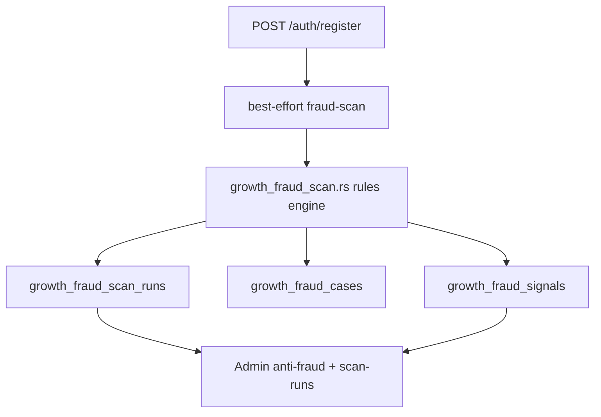

# 168 · Business Expansion Sprint 168 — BE-FRD-01 & BE-GCM-01 实施方案

> **Sprint**：168 · **Fraud Engine v1** + **Country Market Playbook v1**  
> **基线**：[167 Enterprise Gap Audit](./167-Business-Expansion-Enterprise-Gap-Audit-Report.md) · [166 Business Expansion](./166-Business-Expansion-Audit-Report.md) · [102 Growth §8/§10.4](./102-Referral与早鸟增长系统v1.0实施蓝图.md) · [140 C-S5](./140-C-S5-Catalog-Server-Geo-Validation-Operations-Report.md)  
> **日期**：2026-06-08  
> **阶段**：**① 本地** 实施方案 · **不** 宣称 ②③ Production GO  
> **范围锁**：**停止** Product · UI/UX · Admin 页面验收 · Growth 功能审计 · L5 矩阵  
> **机读 spec**：[`artifacts/fraud-engine-v1.yaml`](./artifacts/fraud-engine-v1.yaml) · [`COUNTRY-MARKET-GO-LIVE-PLAYBOOK.v1.md`](../../runbook/COUNTRY-MARKET-GO-LIVE-PLAYBOOK.v1.md)  
> **验收矩阵**：`evidence/business_expansion/sprint168_acceptance_matrix.v1.json`  
> **Plan gate**：`bash scripts/dev/run-sprint168-be-frd01-gcm01-plan-audit.sh`

---

## 1. Executive Summary

| 轨道 | P0 ID | v1 目标 | 实施前 | v1 目标态 | ROI |
|------|-------|---------|--------|-----------|-----|
| **Fraud Engine** | BE-FRD-01 | 注册后自动 fraud-scan + 规则引擎 + 审计 | Auto **25%** · Ops **HIGH** · **NOT_MET** | Auto **72%** · Ops **MEDIUM** · **MET** | **9.2** |
| **Country Market** | BE-GCM-01 | 七阶段 go-live playbook + launch SSOT | Auto **35%** · Ops **HIGH** · **NOT_MET** | Auto **55%** · Ops **MEDIUM** · **MET** | **8.5** |

**Sprint 168 交付分两阶**：

| 阶段 | 内容 | Gate |
|------|------|------|
| **168-A（本 Sprint · 方案）** | 蓝图 · 数据模型 · API 契约 · Admin 增量 · SOP · 验收矩阵 · ROI | `TT_SPRINT168_BE_FRD01_GCM01: PLAN_COMPLETE` |
| **168-B（实施 · 待授权）** | Migration · Handler · Register hook · Launch API · Gate scripts | `TT_SPRINT168_BE_FRD01_GCM01: IMPLEMENTATION_GO` |

**133 / 120 边界**：不实现链上 GOV 空投 · 不切换 `CATALOG_SERVER_GEO_VALIDATION` 默认 · 不扩展 Growth 积分公式。

---

## 2. 企业级六维目标

| 维度 | BE-FRD-01 v1 | BE-GCM-01 v1 |
|------|--------------|--------------|
| **自动化程度** | 25% → **72%**（注册扫描 + HIGH 自动处置） | 35% → **55%**（checklist + geo gate 机读） |
| **运营成本** | HIGH → **MEDIUM**（−~40h/月人工 case） | HIGH → **MEDIUM**（−~24h/国协调） |
| **风控能力** | CRITICAL → **MEDIUM**（Sybil 边际成本可控） | N/A → **合规 gate**（Legal 挡板） |
| **市场复制能力** | N/A | ad-hoc → **模板化七阶段** |
| **国家级扩张流程** | N/A | INTAKE→LIVE 可审计 |
| **审计闭环** | `growth_fraud_scan_runs` + signals + cases | `country_market_launches` + audit_logs + evidence |

---

## 3. 轨道 A · Fraud Engine v1（BE-FRD-01）

### 3.1 现状与缺口

| 已有（G-S5） | 缺口（167 P0） |
|--------------|----------------|
| `growth_fraud_signals` / `growth_fraud_cases` | **`POST …/internal/growth/fraud-scan` 未实现** |
| Admin anti-fraud UI · freeze PATCH | 注册后 **无** 自动扫描 |
| `referral_hourly_rate_limit` 绑定时触发 | 同 IP / 邮箱 / 钱包 **无** 注册维规则 |
| Observer `SkippedFrozen` | 无 scan run **审计行** |

### 3.2 架构



**原则**：

1. **Fail-open on register**：扫描失败 **不** 阻断注册（与 G-S8 冻结一致）。
2. **Idempotency**：`idempotency_key = {trigger}:{user_id}` 重复返回首结果。
3. **HIGH → auto_action**：写 `growth_fraud_status` + 开 case；**不** 自动 `banned`（需 Risk 人工）。
4. **复用** G-S1 已有 referral 规则，扫描引擎 **调用同源逻辑** 而非 duplicate。

### 3.3 数据模型

#### 3.3.1 新表 · `growth_fraud_scan_runs`

```sql
CREATE TABLE growth_fraud_scan_runs (
  id UUID PRIMARY KEY DEFAULT gen_random_uuid(),
  subject_user_id UUID NOT NULL REFERENCES users(id),
  trigger TEXT NOT NULL CHECK (trigger IN ('register','manual','scheduled')),
  idempotency_key TEXT NOT NULL UNIQUE,
  outcome TEXT NOT NULL CHECK (outcome IN ('clean','signaled','auto_action')),
  rules_fired JSONB NOT NULL DEFAULT '[]',
  context_snapshot JSONB NOT NULL DEFAULT '{}',
  created_at TIMESTAMPTZ NOT NULL DEFAULT now()
);
CREATE INDEX idx_growth_fraud_scan_runs_user ON growth_fraud_scan_runs(subject_user_id, created_at DESC);
```

#### 3.3.2 既有表（无 ALTER · v1）

| 表/列 | 用途 |
|-------|------|
| `growth_fraud_signals` | 规则命中明细 |
| `growth_fraud_cases` | HIGH auto_action 开 `open` case |
| `users.growth_fraud_status` | `normal` / `points_frozen` / `airdrop_ineligible` / `banned` |
| `auth_audit_events` | IP 速度规则数据源（`event=register_success` + `client_ip`） |

**v1 不新增** `users.register_ip` 列；IP 规则查 `auth_audit_events`（注册 handler 已写 audit）。

#### 3.3.3 规则目录（v1 · 6 条）

| rule_id | signal_type | level | action | 说明 |
|---------|-------------|-------|--------|------|
| `register_email_disposable_domain` | email_disposable_domain | MEDIUM | signal | 静态 disposable 域名表 |
| `register_email_alias_burst` | email_alias_pattern | MEDIUM | signal | 同 base email 60min >5 |
| `register_ip_velocity` | register_ip_velocity | HIGH | **airdrop_ineligible** | 同 IP 60min >8 注册 |
| `register_wallet_collision` | wallet_address_collision | HIGH | **points_frozen** | 钱包地址已绑定其他 user |
| `referral_hourly_rate_limit` | referral_hourly_rate_limit | HIGH | signal | 复用 G-S1 |
| `referral_self_forbidden` | referral_self_forbidden | HIGH | signal | 复用 G-S1 |

**v2 候选（不在 168-B）**：device fingerprint · community merge · KOL GMV（BE-FRD-03/04）。

### 3.4 API

#### 3.4.1 Internal · 新增

| Method | Path | Body | Response |
|--------|------|------|----------|
| **POST** | `/api/v1/internal/growth/fraud-scan` | `{ user_id, trigger, idempotency_key?, context? }` | `{ status, outcome, rules_fired[], scan_run_id }` |

**Auth**：`internal_operator_secret`（与 award-points 同源 · `common::internal_operator_secret_required_response`）。

**Handler 位置**：`crates/api/src/routes/internal/growth.rs` · 逻辑 `crates/api/src/db/growth_fraud_scan.rs`（新建）。

#### 3.4.2 Admin · 扩展

| Method | Path | Perm | 说明 |
|--------|------|------|------|
| GET | `/api/v1/admin/growth/anti-fraud/scan-runs` | read | 分页 · filter `subject_user_id` |
| POST | `/api/v1/admin/growth/anti-fraud/scan-runs/trigger` | fraud | 人工重扫 · body `{ user_id }` |

**既有端点不变**（130 G-S5）：rules · signals · users · cases · PATCH user。

#### 3.4.3 Register hook

在 `chain_off/auth.rs` · `auth_register` 成功路径末尾：

```rust
// best-effort; errors logged only
if let Some(ref pool) = state.db_pool {
    let ctx = json!({
        "client_ip": extract_client_ip(&headers),
        "email": email_trim,
        "referral_code": referral_code_norm,
    });
    db::run_growth_fraud_scan_best_effort(
        pool, user_id_reg, "register", ctx
    ).await;
}
```

### 3.5 Admin Console（数据链 only · 无 UI 结构变更）

| 页面 | v1 增量 | 纪律 |
|------|---------|------|
| `/admin/growth/anti-fraud` | **Scan Runs** 只读表 · user 行展示 `last_scan_outcome` | **不** 改 layout lock · 仅增 data section |
| `/admin/growth/reward-ledger` | 无变更 | — |

**i18n keys**：`admin_growth_anti_fraud_scan_runs_*` · contract test 扩展 `adminGrowthAntiFraud.contract.test.ts`。

### 3.6 运营 SOP（Fraud Engine v1）

| 频率 | 动作 | 负责人 |
|------|------|--------|
| **实时** | HIGH auto_action → Risk 队列 | Risk/Ops |
| **每日** | Review `growth_fraud_cases` open · scan_runs `auto_action` 计数 | Risk |
| **每周** | 误杀率复盘 · 调整 IP/alias 阈值 | Risk + Eng |
| **每月** | 导出 signals CSV · 对接 165 Economic Attack 证据 | Auditor |

**升级路径**：MEDIUM ×3/7d → PATCH `points_frozen` · HIGH 误杀 → PATCH `normal` + case resolved。

### 3.7 验收矩阵（FRD）

| ID | P | 标准 | 探针 |
|----|---|------|------|
| FRD-A01 | P0 | fraud-scan POST 200 + 幂等 | `cargo test fraud_scan` |
| FRD-A02 | P0 | Register hook 调用 | auth integration |
| FRD-A03 | P0 | ≥4 规则 · HIGH auto | unit tests |
| FRD-A04 | P0 | scan_runs 审计行 | migration + GET |
| FRD-A05 | P1 | Admin scan-runs API | contract test |
| FRD-A06 | P1 | auto_action 开 case | case count |
| FRD-A07 | P1 | SOP 文档 | plan audit |
| FRD-A08 | P2 | 误杀率 <15% | ops sign-off |

### 3.8 168-B 实施清单（工程）

| # | 任务 | 路径 |
|---|------|------|
| 1 | SQL migration | `migrations/…_growth_fraud_scan_runs.sql` |
| 2 | Rules engine | `db/growth_fraud_scan.rs` |
| 3 | Internal route | `routes/internal/growth.rs` |
| 4 | Register hook | `chain_off/auth.rs` |
| 5 | Admin HTTP | `admin_growth_fraud_http.rs` |
| 6 | Rules catalog 扩展 | `growth_fraud_ops.rs` |
| 7 | Tests | `growth_fraud_scan` module tests |
| 8 | Smoke | `scripts/dev/smoke-growth-fraud-scan-p0-local.sh` |
| 9 | Implementation gate | `scripts/dev/run-sprint168-be-frd01-implementation-gate.sh` |
| 10 | 更新 167 探针 | fraud-scan route → MET |

**预估**：**3 人周** · ① 本地 exit 0。

---

## 4. 轨道 B · Country Market Playbook v1（BE-GCM-01）

### 4.1 现状与缺口

| 已有 | 缺口 |
|------|------|
| C-S5 geo validation · meta parity | **无** 标准化 go-live SOP |
| CMS `catalog_countries` workflow | publish **无** legal/geo 前置 gate |
| `GET /country-ledger/:jurisdiction` | **无** launch SSOT 表 |
| Admin `/admin/content/geo-validation` | **无** country-market launch 视图 |

### 4.2 七阶段 Playbook

**SSOT 全文**：[`docs/runbook/COUNTRY-MARKET-GO-LIVE-PLAYBOOK.v1.md`](../../runbook/COUNTRY-MARKET-GO-LIVE-PLAYBOOK.v1.md)

| Phase | 代号 | 自动化 |
|-------|------|--------|
| 0 | INTAKE | Admin POST launch |
| 1 | LEGAL | checklist patch |
| 2 | CATALOG | catalog row exists |
| 3 | GEO | C-S5 meta-parity **PASS** |
| 4 | STEWARD | steward user_id 记录 |
| 5 | PUBLISH | catalog publish + geo 复跑 |
| 6 | LIVE | activate + evidence bundle |

### 4.3 数据模型

#### 4.3.1 新表 · `country_market_launches`

```sql
CREATE TABLE country_market_launches (
  id UUID PRIMARY KEY DEFAULT gen_random_uuid(),
  jurisdiction_iso CHAR(2) NOT NULL UNIQUE,
  catalog_country_id UUID REFERENCES catalog_countries(id),
  phase TEXT NOT NULL DEFAULT 'intake'
    CHECK (phase IN ('intake','legal','catalog','geo','steward','publish','live','archived')),
  checklist JSONB NOT NULL DEFAULT '{}',
  owner_user_id UUID REFERENCES users(id),
  launched_at TIMESTAMPTZ,
  evidence_ref TEXT,
  created_at TIMESTAMPTZ NOT NULL DEFAULT now(),
  updated_at TIMESTAMPTZ NOT NULL DEFAULT now()
);
CREATE INDEX idx_country_market_launches_phase ON country_market_launches(phase);
```

#### 4.3.2 checklist JSONB schema（v1）

```json
{
  "legal": { "tos_version": { "status": "pass|fail|pending", "ref": "..." }, "payment_policy_ref": {}, "data_transfer": {} },
  "catalog": { "country_row": { "status": "pass" }, "min_cities": { "status": "pass", "count": 3 } },
  "geo": { "meta_parity": { "status": "pass", "checked_at": "ISO8601" }, "drift_ack": {} },
  "steward": { "user_id": "uuid", "status": "pending" },
  "ops": { "comms": { "status": "pending" } }
}
```

### 4.4 API

#### 4.4.1 Admin · 新增 `country-market`

| Method | Path | Perm | 说明 |
|--------|------|------|------|
| GET | `/api/v1/admin/country-market/launches` | `admin.content.read` | 列表 · filter phase/iso |
| POST | `/api/v1/admin/country-market/launches` | `admin.content.write` | 创建 INTAKE |
| GET | `/api/v1/admin/country-market/launches/:id` | read | 详情 + checklist |
| PATCH | `/api/v1/admin/country-market/launches/:id/checklist` | write | 合并 checklist 节 |
| POST | `/api/v1/admin/country-market/launches/:id/advance` | write | phase 推进（校验 gate） |
| POST | `/api/v1/admin/country-market/launches/:id/activate` | **publish** | phase→live · 需 L1–L5 pass |

**Handler**：`routes/admin/admin_country_market_http.rs` · DB `db/country_market_launch_ops.rs`。

#### 4.4.2 Publish gate（挂接既有 CMS）

在 `post_admin_content_country_publish` **前**：

```rust
if let Some(launch) = db::get_active_launch_for_country(pool, country_iso).await? {
    db::assert_country_market_gates_for_publish(&launch)?; // legal+geo pass
}
```

**Gate 逻辑**：

| Gate | 条件 |
|------|------|
| GCM-G1 | `checklist.legal.*` 全部 `pass` |
| GCM-G2 | `checklist.geo.meta_parity.status == pass` |
| GCM-G3 | launch.phase ≥ `steward` |

**失败**：HTTP 409 · `country_market_gate_blocked` + 缺失项列表。

#### 4.4.3 机读 probe · 复用 C-S5

| 能力 | 端点 |
|------|------|
| Geo summary | `GET /admin/content/catalog/geo-validation` |
| Meta parity | `GET …/geo-validation/meta-parity` |

`run-country-market-launch-gate.sh --iso=JP` 串联 launch row + C-S5 parity。

### 4.5 Admin Console

| 路由 | v1 增量 | 纪律 |
|------|---------|------|
| `/admin/content/country-market` | Launch 列表 · phase badge · checklist 摘要 | **新建 Admin 子页 · data-only** |
| `/admin/content/geo-validation` | 嵌入「关联 launch ISO」链接 | 只读 cross-link |
| `/admin/content/countries` | publish 失败时展示 gate 原因 | error toast |

**RBAC**：复用 `admin.content.read/write/publish` · 不新增 permission（v1）。

### 4.6 运营 SOP

见 Playbook §10–§13 · 摘要：

1. **立项**：复制 `evidence/country_market/_TEMPLATE/` → `{ISO}/`
2. **Legal 先行**：未 pass 禁止 advance 到 CATALOG
3. **GEO 双检**：publish 前 + publish 后各跑一次 C-S5
4. **Activate**：Ops Lead 签字 · 归档 `go-live-bundle/`
5. **月度**：所有 `live` 辖区复跑 geo gate

### 4.7 验收矩阵（GCM）

| ID | P | 标准 | 探针 |
|----|---|------|------|
| GCM-A01 | P0 | Playbook v1 七阶段 | plan audit |
| GCM-A02 | P0 | launches 表 + CRUD | cargo test |
| GCM-A03 | P0 | checklist patch + audit | audit_logs |
| GCM-A04 | P0 | publish gate 409 | integration |
| GCM-A05 | P1 | Admin launch UI | contract |
| GCM-A06 | P1 | launch gate script | `--iso` |
| GCM-A07 | P1 | evidence template | `_TEMPLATE/` |
| GCM-A08 | P2 | 试点 ISO walkthrough | CN/JP bundle |

### 4.8 168-B 实施清单

| # | 任务 | 路径 |
|---|------|------|
| 1 | SQL migration | `country_market_launches` |
| 2 | DB ops | `country_market_launch_ops.rs` |
| 3 | Admin HTTP | `admin_country_market_http.rs` |
| 4 | Publish gate | `admin_content_http.rs` hook |
| 5 | Gate script | `run-country-market-launch-gate.sh` |
| 6 | Admin UI | `app/admin/content/country-market/` |
| 7 | Evidence scaffold | `evidence/country_market/_TEMPLATE/` ✓ |
| 8 | Smoke | `smoke-country-market-launch-p0-local.sh` |
| 9 | Implementation gate | `run-sprint168-be-gcm01-implementation-gate.sh` |

**预估**：**4 人周** · 可与 FRD 并行（不同模块）。

---

## 5. 联合验收矩阵与 Gate

| Gate | 命令 | 168-A | 168-B |
|------|------|-------|-------|
| Plan | `run-sprint168-be-frd01-gcm01-plan-audit.sh` | **GO** | — |
| FRD impl | `run-sprint168-be-frd01-implementation-gate.sh` | — | 待实施 |
| GCM impl | `run-sprint168-be-gcm01-implementation-gate.sh` | — | 待实施 |
| Combined | `TT_SPRINT168_BE_FRD01_GCM01: IMPLEMENTATION_GO` | — | FRD+GCM 均 GO |

**P0 企业级达标（167 更新目标）**：

| ID | 168-B 完成后 |
|----|--------------|
| BE-FRD-01 | **MET** |
| BE-GCM-01 | **MET** |

---

## 6. ROI 评估

### 6.1 分项 ROI

| 项 | 投入 | 收益 | ROI | 回收期 |
|----|------|------|-----|--------|
| **BE-FRD-01** | 3 人周 | −40h/月 Risk ops · Sybil 损失规避 · 空投链下质量 | **9.2** | **~4 周** |
| **BE-GCM-01** | 4 人周 | −24h/国 · 并行开 2+ 市场 · 合规事故规避 | **8.5** | **~5 周/国** |
| **并行 168-B** | 5 人周（wall） | 167 P0 达标 **2/4** | **9.0 综合** | **~6 周** |

### 6.2 成本—风险曲线

```
Ops 成本
  HIGH │ ● FRD/GCM 实施前
       │         ╲
 MEDIUM│          ● FRD v1 后
       │              ╲
       │               ● FRD+GCM v1 后
  LOW  └──────────────────────────→ 时间
         W0    W4    W6    W10
```

### 6.3 不做的机会成本

| 若跳过 | 风险 |
|--------|------|
| FRD-01 | 增长 scale 后 Sybil **CRITICAL** · 空投/积分 ROI 为负 |
| GCM-01 | 每国 **+24h ad-hoc** · Legal/GEO 不一致 · 无法并行扩张 |

### 6.4 与后续 Sprint 衔接

| 后续 | 依赖 168 |
|------|----------|
| **169 · BE-RS-01** | GCM live 国有 catalog SSOT |
| **170 · BE-DAO-01** | 独立 · 不阻塞 168 |
| **BE-FRD-02** | FRD-01 scan 框架 |

---

## 7. 风险与缓解

| 风险 | 缓解 |
|------|------|
| fraud-scan 误杀 | v1 不 auto `banned` · weekly 阈值调优 · FRD-A08 |
| register hook 延迟 | async best-effort · 不 block 响应 |
| publish gate 过严 | gate 可 SuperAdmin break-glass + audit |
| 120 冻结冲突 | **不** 改 geo env 默认 · 仅 Admin checklist |
| Growth 冻结越界 | 168-B 须 `check-g-s8-growth-release-freeze.sh` 仍 PASS |

---

## 8. 文档与证据索引

| Artifact | 路径 |
|----------|------|
| 本蓝图 | `168-Business-Expansion-Sprint168-BE-FRD01-BE-GCM01-Blueprint.md` |
| Fraud spec | `artifacts/fraud-engine-v1.yaml` |
| Country playbook | `docs/runbook/COUNTRY-MARKET-GO-LIVE-PLAYBOOK.v1.md` |
| 验收矩阵 | `evidence/business_expansion/sprint168_acceptance_matrix.v1.json` |
| Evidence 模板 | `evidence/country_market/_TEMPLATE/` |
| 167 基线 | `167-Business-Expansion-Enterprise-Gap-Audit-Report.md` |

---

## 9. 下一步（168-B 授权后）

1. **Week 1–2**：FRD migration + engine + internal route + register hook + tests  
2. **Week 2–3**：GCM migration + launch API + publish gate  
3. **Week 3**：Admin data sections + smoke + implementation gates  
4. **Week 4**：试点 ISO walkthrough（建议 **CN** 已有 catalog）· 更新 167 P0 探针  

**不恢复**：Product/UI/Admin 页面级 L5 验收 · Growth 功能扩展审计。

---

*168 · Business Expansion Sprint · BE-FRD-01 + BE-GCM-01 · 2026-06-08*
