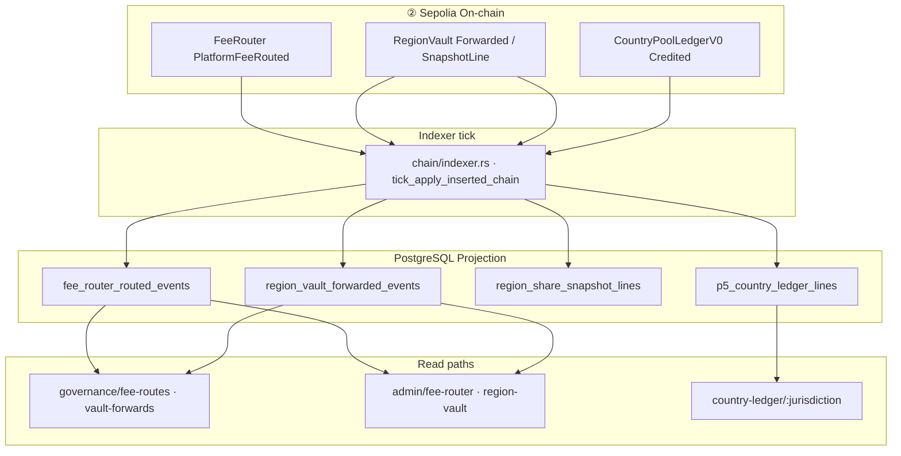
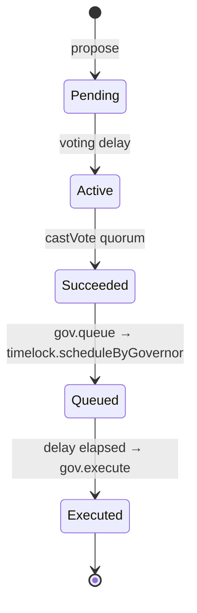

# 170 · Business Expansion Sprint 169 — RegionShare & Governance Enterprise Audit

> **Sprint**：169 · **BE-RS-01** + **BE-DAO-01 **企业级审计**（audit-only）  
> **基线**：[169 Sprint 168-B Implementation](./169-Sprint168B-Business-Expansion-Implementation-Report.md) · [167 Enterprise Gap Audit](./167-Business-Expansion-Enterprise-Gap-Audit-Report.md) · [Sepolia Spine](../../runbook/TT-PHASE2-SEPOLIA-DEPLOYED-SPINE-SUMMARY.md)  
> **LEGACY · READ-ONLY** — 表中 Pre–GovFreeze-V2 Sepolia 地址（含 **LEGACY TTG**）仅作 Sprint 169 审计旁证；**ACTIVE 读口：** [GOV-FREEZE-V2-SEPOLIA-BASELINE-FREEZE.md](../../spec/governance-token/GOV-FREEZE-V2-SEPOLIA-BASELINE-FREEZE.md)  
> **日期**：2026-06-08  
> **阶段**：**② Sepolia 试点** 审计 · **不** 宣称 ③ Production GO  
> **范围锁**：**停止** Fraud Engine · Country Market **开发**；**不含** UI/UX · 页面验收 · PI3 Production  
> **机读矩阵**：`evidence/business_expansion/sprint169_region_share_reconcile_matrix.v1.json`  
> **治理证据链**：`evidence/business_expansion/sprint169_governance_uat_evidence_chain.v1.json`  
> **探针**：`bash scripts/dev/run-sprint169-be-rs01-be-dao01-enterprise-audit.sh`

---

## 1. Executive Verdict

| 轨道 | P0 ID | 裁定 | 企业级分数 | 自动化 | 收益闭环 | 链上成熟度 |
|------|-------|------|------------|--------|----------|------------|
| **RegionShare Reconcile** | BE-RS-01 | **BE_RS_01_HOLD** | 48 → 目标 75 | **42%** | PARTIAL | P2 |
| **Governance UAT** | BE-DAO-01 | **BE_DAO_01_HOLD** | 55 → 目标 70 | **48%** | PARTIAL | P2 Deployed |

**Combined gate**：`TT_SPRINT169_BE_RS01_BE_DAO01: ENTERPRISE_AUDIT_COMPLETE`

**一句话**：② 上 **投影与 Foundry 闭环已具备**，但 **RegionShare 跨腿金额对账 job 缺失**、**Sepolia live queue→execute UAT 证据包未 enterprise 签字** — 两项 P0 **均未达 GO**。

---

## 2. 范围切换

| 停止 | 转入 |
|------|------|
| BE-FRD-01 / BE-GCM-01 功能开发 | RegionShare 全链路一致性审计 |
| 168-B 后续 polish | DAO Proposal→Execute 治理演练证据链 |
| UI/UX · L5 页面矩阵 | 自动化对账矩阵 + ROI/风险 |

**168-B 结论仍有效**：BE-FRD-01 · BE-GCM-01 已 **GO**（见 [169](./169-Sprint168B-Business-Expansion-Implementation-Report.md)），**本 Sprint 不复审**。

---

## 3. BE-RS-01 · RegionVault→Indexer→Projection→CountryLedger→RegionShare 全链路

### 3.1 链路拓扑



**命名说明**：仓库内 **无** `RegionShareLedger` 表；**SSOT** 为 `region_share_snapshot_lines`（B-115 / P5-3）。`CountryLedger` 为 **P5-1  orthogonal 试点**（DE），**不得**从 FeeRouter 投影推导（见 `P5-1-逐国链上账本SSOT`）。

### 3.2 各腿实现状态

| 腿 | 合约/事件 | 投影表 | Indexer | Admin/Gov 读 | 单腿 reconcile |
|----|-----------|--------|---------|--------------|----------------|
| FeeRouter countryBucket | `PlatformFeeRouted` | `fee_router_routed_events` | ✅ | ✅ | B383 条数 ✅ |
| RegionVault pool | `RegionVaultForwarded` | `region_vault_forwarded_events` | ✅ | ✅ + export | B384 条数 ✅ |
| RegionShare snapshot | `RegionShareSnapshotLine` | `region_share_snapshot_lines` | ✅ | 间接 observability | ❌ 无专项 |
| CountryLedger pilot | `CountryPoolLedgerCredited` | `p5_country_ledger_lines` | ✅ | ✅ | B385 条数 ✅ |

### 3.3 一致性缺口（企业级）

| 缺口 ID | 描述 | 商业风险 | 现状 |
|---------|------|----------|------|
| **RS-R04** | `Σ(to_country_u256)` ↔ Vault `balanceOf` ↔ forwarded 出金 **金额三角** | **HIGH** — 分润审计失败 | **未实现** |
| **RS-R05** | Snapshot epoch ↔ 链上 `RegionShareSnapshotLine` 窗口 | HIGH | 仅 block spread 观测 |
| **RS-R06** | B398 spread 含 FR/RV/P5 **块高**；**不含** snapshot 金额 | MEDIUM | PARTIAL |
| **RS-R07** | `region-share-reconcile.sh` + cron + drift alert | HIGH | **脚本不存在** |

**167 探针一致**：`run-business-expansion-enterprise-gap-audit.sh` → BE-RS-01 **PARTIAL**。

### 3.4 自动化对账矩阵（机读）

见 `sprint169_region_share_reconcile_matrix.v1.json` · 摘要：

| Check | Auto | Enterprise |
|-------|------|------------|
| RS-R01 B383 FeeRouter | SCRIPT | leg PASS |
| RS-R02 B384 RegionVault | SCRIPT | leg PASS |
| RS-R03 B385 CountryLedger | SCRIPT | orthogonal PASS |
| RS-R04 跨腿金额 | **NONE** | **FAIL** |
| RS-R05 Snapshot | OBS | **FAIL** |
| RS-R06 Block spread | OBS | **FAIL amount** |
| RS-R07 闭环 job | **NONE** | **FAIL** |

**自动化综合**：**42%**（单腿脚本 3/7 · 跨腿 0/7）

---

## 4. BE-DAO-01 · Proposal→Queue→Timelock→Execute 治理闭环

### 4.1 流程与成熟度



| 阶段 | P1 Local Foundry | P2 Sepolia Deploy | P3 Live UAT | 企业 GO 要求 |
|------|------------------|-------------------|-------------|--------------|
| propose→vote | ✅ B-089 | ✅ b417-sepolia-propose-vote | PARTIAL | ✅ |
| queue | ✅ vm in Foundry | ❌ script missing | **NOT_RUN** | ✅ live tx |
| Timelock delay | ✅ vm.warp | ❌ | **NOT_RUN** | ✅ real wait |
| execute | ✅ Foundry | PARTIAL execute-only script | **NOT_RUN** | ✅ + sidecar |
| evidence pack | ✅ md SSOT | ❌ not signed | **NOT_RUN** | ✅ verify exit 0 |

### 4.2 Sepolia 地址（Phase ② SSOT）

| 合约 | 地址 |
|------|------|
| TTG | **LEGACY** `0xaC2E29AC7089e4863C21dAF232cF8bbb025d91ca` · GovFreeze V2 ACTIVE `0x2837ea0c50e27d59b88af617abbb231a040062c5` |
| Timelock | `0x0359d4fB9c4B9f69188A1E9AE2202ABfeD1fEe8f` |
| Governor | `0xa79c8df5C225825f6d04a497043dB0F1995B55ae` |
| Treasury | `0x6a8323fb2394A1e9655F7132F4E4B8222d2898be` |

### 4.3 治理演练证据链

机读：`sprint169_governance_uat_evidence_chain.v1.json`

| Step | Artifact | Status |
|------|----------|--------|
| P1 Foundry B-089 | `governor-timelock-queue-execute-evidence.md` | **GO** |
| P1 B-431 payload align | Foundry tests | **GO** |
| P2 Sepolia spine | TT-PHASE2-SEPOLIA-DEPLOYED-SPINE-SUMMARY | **GO** |
| P3 preflight | `b417-sepolia-preflight.sh` | **MISSING** |
| P3 queue | `b417-governor-queue-testnet.sh` | **MISSING** |
| P3 orchestration | `b417-run-onchain-evidence.sh` | **MISSING** |
| P3 evidence verify | `b417-evidence-pack-verify.sh` | **MISSING** |
| P3 live pack | `evidence/b417_governance_execution_runs/run_<UTC>/` | **NOT_ENTERPRISE_SIGNED** |

**磁盘脚本**：4/9（`b417-env-gap-check` · propose-vote ×2 · execute）；**文档引用但缺失 5 个 orchestration 脚本** — 与 RUNBOOK / TT-LINE-B **漂移**。

**Foundry 主命令**（P1 SSOT · **不等于** P3 GO）：

```bash
cd contracts
forge test --match-test test_COMP_B089_governor_full_cycle_propose_vote_queue_execute -vv
```

### 4.4 BE-DAO-01 企业级标准对照

| 维度 | 门槛 | 现状 | 判定 |
|------|------|------|------|
| 功能闭环 | Sepolia live queue→execute 可重复 | orchestration 缺失 | **FAIL** |
| 自动化 | ≥70% | **48%** | **FAIL** |
| 审计证据 | report.json + verify + Owner 签字 | Foundry only | **FAIL** |
| Timelock drill | 真实 delay wait | 仅 vm.warp | **FAIL** |
| UI 时间线 | 与链上 ETA 对齐 | Epic A 只读 | **FAIL**（P1 可延期） |

**裁定**：**BE_DAO_01_HOLD**（P2 Deployed · P3 未闭）

---

## 5. 风险评估

### 5.1 RegionShare（BE-RS-01）

| 风险 | 等级 | 触发场景 | 缓解（170-B 目标） |
|------|------|----------|-------------------|
| 国家桶金额与 Vault 池漂移 | **HIGH** | 多辖区分润前 | RS-R04 reconcile job |
| Snapshot 与路由事件块不一致 | **HIGH** | 审计/监管 | RS-R05 + B398 扩展 |
| 运营商无法自证分润 | MEDIUM | RegionShare 规模化 | BE-RS-04 看板（P2） |
| P5 CountryLedger 与 RS 混读 | MEDIUM | 文档误用 | 保持 orthogonal SSOT |

### 5.2 Governance（BE-DAO-01）

| 风险 | 等级 | 触发场景 | 缓解 |
|------|------|----------|------|
| 治理 GO 叙事过度 | **HIGH** | 融资/外验 | 明确 P1 Foundry ≠ P3 UAT |
| B-417 文档/脚本漂移 | **HIGH** | Ops 无法复跑 | 恢复 5 缺失脚本 |
| Timelock 误操作 | MEDIUM | 生产前 | LINE-B Steps 0–9 game-day |
| BE-DAO-03 链上 GOV 空投 | HIGH | Growth 混淆 | **133 HOLD** 独立 gate |

---

## 6. ROI 与下一阶段排序

| Rank | 项 | ROI | 人周 | 依赖 | 解锁 |
|------|-----|-----|------|------|------|
| **1** | BE-RS-01 `region-share-reconcile.sh` + RS-R04/R07 | **7.8** | 5 | B383/B384 · Sepolia FundStack | 分润审计 · **BE_RS_01_GO** |
| **2** | BE-DAO-01 恢复 B-417 orchestration + Sepolia game-day | **6.5** | 8 | `.env` Sepolia · Owner | **BE_DAO_01_GO** |
| 3 | RS-R05 snapshot epoch reconcile | 6.2 | 3 | RS-01 | Snapshot 可信度 |
| 4 | B-430 post-execute indexer reconcile | 5.8 | 3 | DAO-01 | 治理投影闭环 |
| 5 | BE-RS-02 多辖区 epoch | 6.2 | 6 | RS-01 | 全球 RegionShare |

**170-B 建议并行**：RS reconcile job（后端/FinOps）+ B-417 脚本恢复（链上 Ops），**不**恢复 FRD/GCM 开发。

---

## 7. BE_RS_01_GO / BE_DAO_01_GO 判定标准（170-B 目标）

### 7.1 BE_RS_01_GO

| # | 条件 |
|---|------|
| 1 | `scripts/ops/region-share-reconcile.sh` exit 0 on Sepolia |
| 2 | RS-R04 金额三角 marker=`aligned`（或 documented `pending` + finality） |
| 3 | RS-R07 cron + `reconciliation_reports` / observability drift |
| 4 | Automation ≥ **75%** · evidence `evidence/GO_BE_RS_01/` |

### 7.2 BE_DAO_01_GO

| # | 条件 |
|---|------|
| 1 | 5 个缺失 B-417 脚本 restored |
| 2 | TT-LINE-B Steps 0–9 Sepolia **live** run |
| 3 | `b417-governance-execution-report.json` · `execution_verdict=GO` |
| 4 | `b417-evidence-pack-verify.sh` exit 0 |
| 5 | Owner sign-off on `evidence/b417_governance_execution_runs/run_<UTC>/` |
| 6 | Automation ≥ **70%** |

---

## 8. 探针与证据索引

```bash
bash scripts/dev/run-sprint169-be-rs01-be-dao01-enterprise-audit.sh
bash scripts/dev/run-business-expansion-enterprise-gap-audit.sh   # 167 全 P0
cd contracts && forge test --match-test test_COMP_B089_governor_full_cycle -vv
```

| Artifact | 路径 |
|----------|------|
| 本报告 | `170-Business-Expansion-Sprint169-RS-DAO-Enterprise-Audit-Report.md` |
| 对账矩阵 | `evidence/business_expansion/sprint169_region_share_reconcile_matrix.v1.json` |
| 治理证据链 | `evidence/business_expansion/sprint169_governance_uat_evidence_chain.v1.json` |
| Foundry SSOT | `docs/verification-evidence/governor-timelock-queue-execute-evidence.md` |
| LINE-B UAT | `docs/runbook/TT-LINE-B-GOVERNANCE-EXECUTION-CHECKLIST.md` |
| Spec 14 | `docs/spec/14-合约-API-ABI-前后端对齐.md` §1.1 RegionVault Target |

---

## 9. 与 167/168 关系

| Sprint | 结论 |
|--------|------|
| **167** | BE-RS-01 PARTIAL · BE-DAO-01 PARTIAL — **169 复核一致** |
| **168-B** | BE-FRD-01 · BE-GCM-01 **GO** — **169 不重复审计** |
| **169** | 深度全链路 + 证据链 + ROI — **BE_RS_01_HOLD · BE_DAO_01_HOLD** |
| **170-B（建议）** | 实施 RS reconcile job + B-417 恢复 + Sepolia game-day |

---

*170 · Sprint 169 · RegionShare & Governance Enterprise Audit · 2026-06-08*
