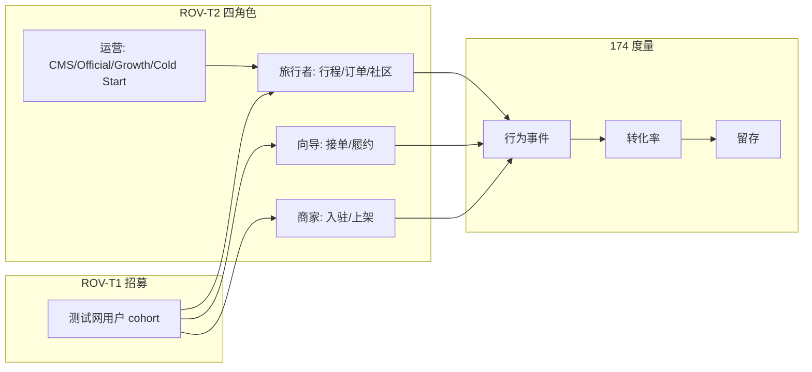

# 173 · ROV-01 Real Operations Validation Program Blueprint

**Version:** 1.0.0 · **最后更新：** 2026-06-08  
**受众**：工程 · 运营 · 融资 IR  
**状态**：**ACTIVE · ② 测试网**  
**与 spec 关系**：**partial** — 运营验证程序；**不替代** [04 §3.4](../../spec/04-后端与API.md)、[93](../../spec/93-全站功能验证矩阵-域别回归清单.md)、[148 PI3-005 Scope](./148-PI3-005-Production-Scope-Decision-Report.md)（**Sepolia only**）。

> **SSOT（必读）**：本程序为 **Real Operations Validation（ROV）** 唯一入口。**冻结基线**见 §2；**度量与裁定**见 [174 Real Operations Validation Report](./174-Real-Operations-Validation-Report.md)。**禁止**用 ① 本地 gate 绿或 L5/BE/PI3 审计分冒充 **② 真实用户运营已验**。

**程序 ID**：**ROV-01**  
**阶段**：**② 测试网 · Real Operations Validation**（**非 ③ Production GO**）  
**纪律**：**零新增业务功能代码** — 仅招募脚本、运营 runbook、证据采集、SQL/Admin 只读统计、投资人 demo 刷新  
**一键基线闸**：`bash scripts/check-rov-01-baseline-freeze.sh`  
**报告 SSOT**：[174-Real-Operations-Validation-Report.md](./174-Real-Operations-Validation-Report.md)

---

## 1. Executive verdict

| 裁定 | 判定 | 说明 |
|------|------|------|
| **L5 / UX / Enterprise 开发 Sprint** | **STOP** | 160–165 已 GO；**不再**开新 L5 审计 / P0 closure Sprint |
| **Business Expansion 实施 Sprint** | **STOP** | 169 / 171 / 172 为 **BE 冻结顶**；**不再**开 168-C / 170-C 等功能 Sprint |
| **PI3 审计 / Execution Sprint** | **STOP** | 147 **`PRODUCTION_GO_DECISION: NO_GO`** · 148 **Sepolia**；**不再**扩 PI3-00x execution scope |
| **ROV-01 程序** | **ACTIVE** | 仅 **真实运营验证**；产出 **[174](./174-Real-Operations-Validation-Report.md)** |
| **代码变更边界** | **MAINT + OPS ONLY** | bugfix · 证据 harness · runbook · 统计导出；**无**新 Admin 域 / 新 API 契约 |

**Gate 输出（基线冻结 · 权威）：**

```text
TT_ROV_01_BASELINE: FREEZE_OK baselines=12/12 program=ROV_01_ACTIVE phase=②
```

---

## 2. 冻结基线（只读 · 不可扩 scope）

| # | 文档 | 冻结裁定 | ROV 消费方式 |
|---|------|----------|--------------|
| **145** | [Operations Platform Release Freeze](./145-Operations-Platform-Release-Freeze-Report.md) | **`OPERATIONS_PLATFORM_GO`** | CMS / Official / Growth Admin 运营面 |
| **157** | [L5-P0 Closure](./157-L5-P0-Closure-Report.md) | **`OPERATIONS_L5_AUDIT_GO` 85/100** | 审批链 · 2FA · RBAC · Cold Start deploy 探针 |
| **160** | [UX-P0 Closure](./160-UX-P0-Closure-Report.md) | **`UI_UX_L5_GO`** | Consumer 冷启动状态机 · Admin Ops Plane UX |
| **161** | [L5 Enterprise Acceptance](./161-L5-Enterprise-Acceptance-Report.md) | **`L5_ENTERPRISE_ACCEPTANCE_GO`** | 五轨审计 · 五角色 journey manifest |
| **162** | [L5 Product Excellence](./162-L5-Product-Excellence-Report.md) | **`L5_PRODUCT_EXCELLENCE_GO`** | 产品完成度基线 |
| **163** | [L5 Enterprise Reliability](./163-L5-Enterprise-Reliability-Report.md) | **`L5_ENTERPRISE_RELIABILITY_GO`** | 可靠性 / DR 观测基线 |
| **164** | [L5 Enterprise Live Evidence](./164-L5-Enterprise-Live-Evidence-Report.md) | **`L5_ENTERPRISE_LIVE_EVIDENCE_GO`** | Live 证据 bundle 格式 |
| **165** | [L5 Enterprise Business & Governance](./165-L5-Enterprise-Business-Governance-Report.md) | **`L5_ENTERPRISE_BUSINESS_GOVERNANCE_GO` 95/100** | 商业规则 · Tokenomics · Investor readiness harness |
| **169** | [Sprint 168-B BE Implementation](./169-Sprint168B-Business-Expansion-Implementation-Report.md) | **`BE_FRD_01_GO` · `BE_GCM_01_GO`** | Fraud scan · Country Market Admin **data-only** |
| **171** | [BE-RS-01 RegionShare Reconcile](./171-BE-RS-01-RegionShare-Reconcile-Implementation-Report.md) | **`BE_RS_01_GO`** | 模拟分润对账 job · Admin reconcile 视图 |
| **172** | [BE-DAO-01 Governance UAT](./172-BE-DAO-01-Governance-UAT-Implementation-Report.md) | **`BE_DAO_01_GO`** | Sepolia governance UAT · **非 Mainnet** |

**显式排除（ROV 不重启）：** 166–168 蓝图/差距审计 · 170 RS/DAO 审计 · 158/159 PI3/L5 深审 **HOLD** 项 — 仅作 backlog 引用，**不开 Sprint**。

---

## 3. ROV-01 七轨验证

| 轨 ID | 名称 | ② 目标 | 基线 harness | 真实度要求 |
|-------|------|--------|--------------|------------|
| **ROV-T1** | 测试网真实用户招募 | ≥ **30** 名非 seed 测试网用户（可识别 cohort） | [TT-9618](../../runbook/TT-9618-onboarding-local-testnet.md) · [TT-TESTNET-FULLSTACK](../../runbook/TT-TESTNET-FULLSTACK-DEPLOY-CLOSELOOP-CHECKLIST.md) | **真实**注册 / 邀请 / 留存标签；**禁止**仅 `SEED_TEST_ACCOUNTS` |
| **ROV-T2** | 四角色完整业务链 | 旅行者 · 向导 · 商家 · 运营 **各 ≥1** 条端到端闭环 | 157 E2/E4 · 161 human journey · provider smoke · escrow smoke | **测试网** PG + API +（可选）Sepolia 草稿/模拟支付 |
| **ROV-T3** | Growth 转化漏斗 | 邀请 → 注册 → 首单/首帖 **漏斗可统计** | 133 G-S8 · `/me/referrals` · Admin growth analytics | Admin **`/admin/growth/analytics`** 时间窗 + ledger 对拍 |
| **ROV-T4** | Cold Start 内容运营 | **≥1** 次真实 campaign deploy → consumer 可见 → rollback 演练 | 144 O-S4 · 157 D3 · 160 UX-P0-01 | Ops **手工**内容 + deploy；**非** env inject |
| **ROV-T5** | Country Market 试点 | **≥1** 国别 launch 阶段推进（data-only gate） | 169 BE-GCM-01 · `country_market_launches` | Admin publish gate **不扩**新国别规则代码 |
| **ROV-T6** | RegionShare 模拟分润 | **≥1** 次 reconcile job **PASS** + Admin 报告归档 | 171 BE-RS-01 · `scripts/ops/region-share-reconcile.sh` | Sepolia/stub 金额三角 **机读 PASS** |
| **ROV-T7** | 投资人 Demo & Data Room | Demo **≤90s** 路径 + Data Room 导出 **日期戳一致** | 165 investor harness · `scripts/export-investor-dataroom.sh` | **真人** walkthrough 反馈录入 174 §6 |

---

## 4. 角色与链路（ROV-T2 明细）



| 角色 | 最小闭环（②） | 证据类型 |
|------|----------------|----------|
| **旅行者** | 注册 → 浏览 `/` 或 `/market` →（可选）创建行程/订单草稿 | session log · PG `users` · orders 投影 |
| **向导** | 接单 / accept →（可选）Sepolia 模拟 escrow 步骤 | order state · chain_off 事件 |
| **商家** | `smoke-provider-onboarding-staging.sh` 或等价测试网 KYB 路径 | provider application row · Admin 审批 |
| **运营** | SuperAdmin/Ops：content publish · official guide · cold start deploy · growth 只读/写 | Admin audit · 157 E2/E3 探针复跑 |

---

## 5. 度量采集（写入 174 · 禁止新功能表）

| 指标类 | 采集源（现有） | 刷新频率 | 负责人 |
|--------|----------------|----------|--------|
| **用户行为** | PG `users` · `orders` · `community_posts` · growth ledger | 周 | Ops |
| **Growth 漏斗** | `growth_analytics_ops` · referral binds · early_bird | 周 | Growth Ops |
| **Cold Start** | campaign deploy 记录 · consumer surface 探针 | 每次 deploy | Content Ops |
| **Country Market** | `country_market_launches` 阶段字段 | 每次试点动作 | Market Ops |
| **RegionShare** | `reconciliation_reports` · Admin reconcile latest | 每次 job | Finance/Ops |
| **运营成本** | 人工工时表 · Fly/Stripe/RPC 账单（测试网） | 双周 | Owner |
| **市场反馈** | 用户访谈 notes · NPS 简表 · 投资人 demo 纪要 | 事件驱动 | IR/Ops |

**SQL / Admin 只读模板**：见 [174 §3](./174-Real-Operations-Validation-Report.md#rov-174-metrics)。

---

## 6. 阶段纪律

| 允许 | 禁止 |
|------|------|
| bugfix（不扩契约） | 新 Sprint 168-C / L5-P1 / PI3-007 等 |
| 运营 runbook · 招募话术 · cohort 标签 | 新 migration 业务表 |
| 证据目录 `evidence/ROV_01/` | 新 Admin 路由域 |
| 复跑 **冻结 baseline gate** | 宣称 **③ Production GO** |
| `export-investor-dataroom.sh` 刷新 | Mainnet governance broadcast |

**Phase 标注**：ROV-01 全部结论须写 **`② 测试网`**；Sepolia 链上步骤须与 **148 `PRODUCTION_SCOPE_SEPOLIA`** 一致。

---

## 7. 证据链与 runbook

| 资产 | 路径 |
|------|------|
| 程序蓝图 | 本文 **173** |
| 验证报告 | [174](./174-Real-Operations-Validation-Report.md) |
| 证据根 | `evidence/ROV_01/` |
| Wave manifest 模板 | `evidence/ROV_01/rov_wave_manifest.v1.template.json` |
| 基线 gate | `scripts/check-rov-01-baseline-freeze.sh` |
| 测试网全栈 | [TT-TESTNET-FULLSTACK-DEPLOY-CLOSELOOP-CHECKLIST.md](../../runbook/TT-TESTNET-FULLSTACK-DEPLOY-CLOSELOOP-CHECKLIST.md) |
| 招募 / 准入 | [TT-9618-onboarding-local-testnet.md](../../runbook/TT-9618-onboarding-local-testnet.md) |
| Data Room | `scripts/export-investor-dataroom.sh` · [data-room/README](../../fundraising/data-room/README.md) |

---

## 8. 退出条件（ROV-01 → 下一程序）

| # | 条件 | 裁定字段 |
|---|------|----------|
| 1 | 七轨 **ROV-T1～T7** 均有 **② live** 证据 | `tracks_GO=7/7` |
| 2 | [174](./174-Real-Operations-Validation-Report.md) **`ROV_01_VALIDATION_GO`** | 见 174 §1 |
| 3 | 转化率 / 7日留存 / 运营成本 **有实数**（非 TBD） | `metrics_complete=true` |
| 4 | Owner sign-off | `evidence/ROV_01/owner_sign_off.json` |

**未满足前**：**不得**重启 Business Expansion 或 PI3 Execution Sprint；**不得**对外 **`PRODUCTION_GO`**。

---

## 9. 复现（基线冻结闸）

```bash
bash scripts/check-rov-01-baseline-freeze.sh
# 期望末行: TT_ROV_01_BASELINE: FREEZE_OK baselines=12/12 program=ROV_01_ACTIVE phase=②
```
