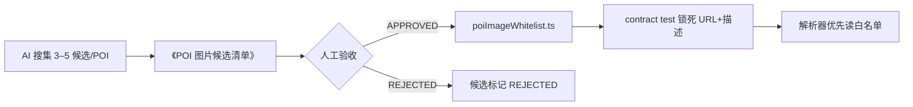

# POI Image Verification Sprint

**阶段**：① 本地 · 数据链配图验收  
**原则**：候选搜集 → 人工确认 → 白名单写入 → contract test 锁死。**禁止**跳过人工直接改 `poiStockPool.ts` 线上语义池。

## 流程



## 批次顺序

**国家 → 城市 → 类型（attraction / food）**

| batchId | 状态 | 范围 |
|---------|------|------|
| `CN-北京-attraction-01` | PENDING | 北京 6 景区 |

## 人工确认后操作清单

1. 在 `poiImageCandidates.ts` 将选定 `cand-XX` 标为 `APPROVED`，其余保留或标 `REJECTED`
2. 在 `poiImageWhitelist.ts` 写入：

```ts
"中国::北京::attraction::长城": {
  imageUrl: "https://images.unsplash.com/photo-…?w=800&q=80",
  sceneDescription: "慕田峪长城晴日…",
  approvedAt: "2026-06-07",
  approvedCandidateId: "cand-01",
  sourcePageUrl: "https://unsplash.com/photos/…",
  license: "Unsplash License (https://unsplash.com/license)",
},
```

3. 运行 `cd frontend && npm run test:poi-image-verification`（须 exit 0）
4. 浏览器验收：创建行程 → 选北京 → 核对预览卡
5. **不要**同步改 `poiStockPool.ts`，除非单独开「语义池迁移」任务

## 本地门禁

```bash
cd frontend && npm run test:poi-image-verification
cd frontend && npm run test:poi-media
# 可选联网探活
RUN_IMAGE_HEALTH=1 npm run test:poi-media:health
```

## POI ID 格式

`{国家}::{城市}::{attraction|food}::{value}`

示例：`中国::北京::attraction::天坛`
