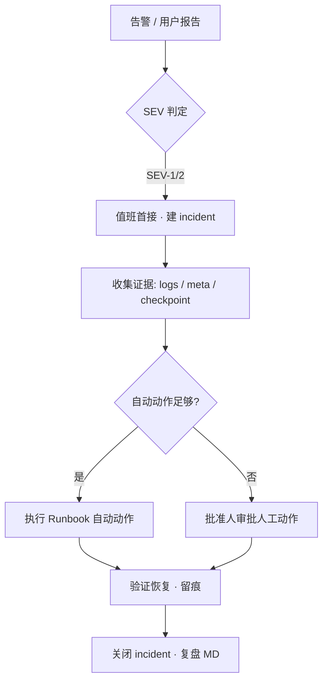

# Production 事故响应流程（Phase ③）

**Version:** 1.0.0 · **2026-06-07**  
**阶段：** **③ 准备轨** — 并联 [ops/RUNBOOK.md](../../ops/RUNBOOK.md) §1–§4 · **非** Production GO

---

## 1 · 分级与 SLA（书面）

| 级别 | 定义 | 首响 | 升级 |
|------|------|------|------|
| **SEV-1** | 资金异常 · 链上 pause 误触 · 数据不可恢复风险 | **15 min** | 立即批准人 |
| **SEV-2** | API 大面积 5xx · Indexer 停滞 · PG 不可用 | **30 min** | 30 min 未缓解 → 批准人 |
| **SEV-3** | 单域只读降级 · 非资金写路径故障 | **4 h** | 下一工作日 |
| **SEV-4** | 监控噪声 · 文档/非用户面 | 排期 | — |

**值班 / 批准人：** [RUNBOOK §2](../../ops/RUNBOOK.md)（代号 **plant**；监管级须异名双人实名）

---

## 2 · 响应流程（标准）



### 2.1 建单（API）

内网（须 `X-Internal-Api-Secret`）：

```bash
curl -sS -X POST "$API/api/v1/internal/incident/open" \
  -H "Content-Type: application/json" \
  -H "X-Internal-Api-Secret: $INTERNAL_API_SECRET" \
  -d '{"severity":"SEV-2","title":"indexer lag","source":"on-call"}' | jq .
```

Admin 只读：`GET /api/v1/admin/alerts/incidents/:id` · UI `/admin/alerts/incidents`

测试告警：`POST /api/v1/internal/alerts/test-fire`（内网）

### 2.2 常见场景速查

| 场景 | Runbook 锚 | 自动动作 | 人工动作 |
|------|------------|----------|----------|
| RPC 不可用 | RUNBOOK ① | 切换 RPC / 只读 | 批准人确认切换 |
| Indexer 落后 | RUNBOOK ② | 告警 · 暂停依赖写 | tick/reconcile/replay |
| reorg 疑似 | RUNBOOK ③ | pause 结算 | reorg-rewind 审批 |
| 配置误发布 | RUNBOOK ⑥ | 告警 | 回滚 env / 镜像 |
| PG 连接耗尽 | 本表 | 限流 · 扩容连接池 |  failover / restore |

### 2.3 Indexer 应急（内网）

```bash
bash scripts/internal-indexer-ops.sh status --live-reconcile
bash scripts/internal-indexer-ops.sh reconcile --persist
bash scripts/internal-indexer-ops.sh tick
bash scripts/indexer-reconcile-probe.sh   # exit 0 = 干净
```

证据落盘：`bash scripts/write-indexer-evidence.sh` → `evidence/GO_YYYYMMDD/`

---

## 3 · 通信模板

**内部（即时）：**

> [SEV-X] TravelTrust · \<title\> · 影响：\<scope\> · 值班：\<name\> · 状态：调查中/缓解中/已恢复 · 证据：\<path\>

**对外（仅 SEV-1/2 且法务批准后）：**

> 我们检测到 \<非技术摘要\>，正在处理。用户资金 \<08-4 口径\>。更新：\<status page URL\>

---

## 4 · 演练与证据

| 类型 | 频率 | 产物 |
|------|------|------|
| 桌面演练 | 季度 | `evidence/DR-YYYYQX-0N/` 或 `evidence/GO_*/artifacts/runbook-dr-*.md` |
| Indexer 探针 | 周 | `indexer-reconcile-probe.sh` log |
| 监控 smoke | 部署后 | `go-audit-*/monitoring-smoke.log` |
| 回滚演练 | 发版前 | `rollback-drill-*/rollback-drill.json` |

并联 [go-live-checklist §11.11](../go-live-checklist.md)（P0 #11 资损 runbook 演练）

---

## 5 · 事故后复盘（必填）

`evidence/GO_phase2_testnet_20260526/phase3-production-prep/incidents/INC-YYYYMMDD-<slug>.md`：

1. **时间线**（UTC）
2. **根因**（技术 + 流程）
3. **影响**（用户/资金/数据）
4. **修复**（临时 + 永久）
5. **跟进项**（入 PI-3 P1 若未挡发版）

---

## 6 · 诚实边界

- 本文 + `incident/open` 最小实现 **≠** 完整 PagerDuty/Opsgenie 集成  
- staging 演练 **≠** production on-call 达标  
- **Production GO** 须 PI-3 P0 全 closed + go-live 勾选 + M-00

---

*Production Incident Response · Phase ③ · 2026-06-07*
