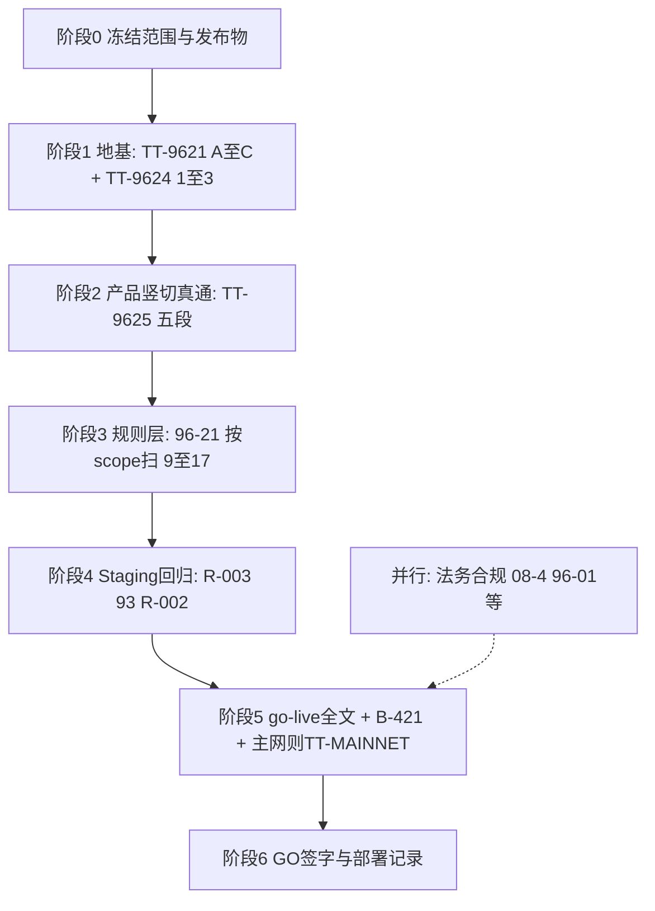

# TT-9626 · 从零到「可发版 / 生产 GO」的一条路

**Version:** 0.1.7  
**Status:** Runbook — **把闭环清单、竖切、回归、go-live 串成一条顺序**；**不**替代 **[go-live-checklist.md](../go-live-checklist.md)** 正文、**不**替代 **法务/商务单独签字**。

**仓库路径：** `docs/runbook/TT-9626-zero-to-production-go-single-path.md`

**与「先主脊、再全站、再生产」段式勾选：** **[TT-9627](TT-9627-delivery-order-spine-then-full-site.md)**（**段 1～6**）；**本文 TT-9626** 侧重 **阶段 0～6** 与 **go-live/R-002** 并联语义 —— **两篇同开不矛盾**（**TT-9627** = **交付顺序**，**TT-9626** = **到 GO 的一条路**）。

---

## 0. 诚实边界（读完这句再往下走）

| 说法 | 是否成立 |
|------|-----------|
| **按本文阶段顺序全部做完** | **≈** 仓库内 **工程与运维向** 的 **生产就绪 + 可发版**（与 **go-live-checklist**、**R-002**、**P0 官方总表** 对拍）。 |
| **「生产级」三字涵盖法务/牌照/对外承诺** | **不成立** —— 须 **并行**：**96-01～96-04**、**08-4** 等 **独立收口**（**go-live §11** 与 **官方总表 P0** 已要求部分项）。 |
| **主网真链 / `CHAIN_ID=1`** | **另闸**：**[TT-MAINNET](TT-MAINNET-LAUNCH-PRECHECK-AFTER-B435-001.md)** + **go-live §9**；**Sepolia 不能顶替**。 |
| **给 AI 的提示词（防一句跑偏）** | **推荐**：「按 **[本 TT-9626](TT-9626-zero-to-production-go-single-path.md)** **阶段 0～6** 执行；**阶段 3** 打开 **[96-21](../spec/96-21-工程闭环扩展清单进阶.md)** 按 **本轮 scope** 勾选 **9～17**。」**禁止**等价替换为：「只按 **96-21** 全部完成＝生产级 / 可发布」。 |

**阶次**（与 **CONTRIBUTING / AGENTS** 同源）：**① 本地 → ② 预发/测试网 → ③ 生产**；下文 **阶段 1～3** 多在 **①②**；**阶段 4～6** 进入 **②→③**；**禁止**用 **①②** 冒充 **③**。

**独立维护 / CI 欠费 / 云端复验：** 与 **[solo-dev-rhythm](../solo-dev-rhythm.md)** **§4 / §6.5** 同口径（**可不建合并请求**；**本地脚本 + 证据** 替代不可用的 Actions）；**GitHub Actions 恢复计费并可信后**补 **远端 workflow 与本地对拍**，**再**把结论写入 **③** 相关证据。**全链路「生产向」与验证顺序表**见 **[TT-9627](TT-9627-delivery-order-spine-then-full-site.md)** 开头 **§0.a**（**无 mock、无假环境写死**；**单库→分布式** 规划互指 **41/04/59**）。

**② 测试网含「新建治理币 + 投票服务 + 治理 UI」：** 若本轮 **scope** 将其列为必达，宣称 **②** 已闭前须完成 **[TT-9627](TT-9627-delivery-order-spine-then-full-site.md)** **§0.b** 表 **四项全 ☑**；任务卡须先写明 **MVP 信号票 vs Governor 链上票** 以何者为真（同文 **§0.b** **投票模式** 句）；证据建议按 **§0.b.1** 最小包落盘；与 **阶段 2～4** 并联，**不**可用 **①** 或 **`chain_off` / `placeholder` 冒充**（与 **04** **`data_source`** 语义对读）。

**防重复验证：** 已闭的 **阶段 / 段 / §0.b** 须按 **[TT-9627 §0.c](TT-9627-delivery-order-spine-then-full-site.md)** 留 **☑+日期+commit+证据**；**无复跑门槛** 时 **不**默认重跑 **93 全矩阵** 或整条 **TT-9625** 主脊。

---

## 1. 一条路总图（只保留一条主链）

---

## 2. 各阶段做什么、打开哪份、怎样算「过」

| 阶段 | 目的 | 主读（按顺序点开即可） | 最小过线（示例） |
|------|------|------------------------|------------------|
| **0 · 冻结** | 发布范围、环境、**谁签字** | **go-live §0**；**[07 §四 4.3](../spec/07-开发流程与顺序.md)** | **标签/commit/镜像 digest** 约定与 **go-live §0.1** 一致；**R-002** 路径与 Owner 写明 |
| **1 · 地基** | 后端/DB/链能支撑真数据 | **[TT-9621](TT-9621-master-order-96-backend-db-chain-frontend.md)** **Phase A→C**；**[TT-9624](TT-9624-closed-loop-checklist.md)** **#1～3** | **`cargo test -p traveltrust-api`**（或卡上子集）**exit 0**；**`DATABASE_URL`** 目标环境可迁移/可连；**`/meta`** 与链配置 **不互斥** |
| **2 · 产品竖切** | **用户能当真走完主脊** | **[TT-9625](TT-9625-golden-path-system-spine.md)**；打法对齐 **[TT-9623](TT-9623-vertical-slice-01-guides-catalog.md)** | **无 mock 冒充**；**注册→市场→创单→托管**（或本轮缩窄 scope）**真 API + 真读写**；**①②** 留痕 |
| **3 · 规则层** | 页背后不炸 | **[96-21](../spec/96-21-工程闭环扩展清单进阶.md)** **9～17**（按 **本轮路径** 勾选，不必一次扫全站） | 与 **04/03/01** **无互斥**；资金/状态机/权限 **至少** 覆盖本轮 **写路径** |
| **4 · Staging 回归** | **环境级** 证明 | **[R-003](../spec/R-003-Staging首次完整回归-A-B域-执行Runbook.md)**；**[93](../spec/93-全站功能验证矩阵-域别回归清单.md)**；**[R-002](../spec/R-002-回归执行闭环与发布准入.md)** | **`report.json`** **`python scripts/validate-regression-report.py … --fail-on-no-go`** **exit 0**；**`release_gate`** 符合 **93 §7.1** |
| **5 · go-live 全文** | **生产运维向** 逐项 | **[go-live-checklist.md](../go-live-checklist.md)** **§1～§11**；**`bash scripts/check-runbook-golive-doclink-gate.sh`** | **清单可勾**；**internal 不外露**；**生产 env** 与 **`.env.example` 禁忌** 对拍；**若主网**：**TT-MAINNET G0～G6+SL** 与 **§9** |
| **6 · GO 与发布** | **可对外说「发了」** | **go-live §11**；**[ops/RUNBOOK.md](../../ops/RUNBOOK.md)** Check-G 段；**evidence/README** | **双签 / manifest / Check-G 三连** 按文执行；**P0 官方总表** 并联行 **☑** |

**并行（与阶段 5～6 同周完成，不塞进「工程闭环」勾选代替）：**

- **08-4**、**官方总表 P0 #1**、**96-01～96-04** 范围内触发项 —— 见 **go-live §11** 与 **[缺口与待补-官方总表](../spec/缺口与待补-官方总表.md)**。
- **深度多维（与 95 正交）**：与 **[TT-9627](TT-9627-delivery-order-spine-then-full-site.md)** **§0.2**、**段 4～6** 同周对拍；真源 **[96-15](../spec/96-15-深度多维度检查与审计体系.md)** **§0～§3**（**何时必跑**见 **96-15 §0**）。

---

## 3. 和「闭环清单」怎么对齐（不重复造表）

| 清单 | 在一条路里的位置 |
|------|------------------|
| **TT-9624（1～8）** | **阶段 1** 为主；**阶段 2～4** 复查 **4～8** 相关行 |
| **96-21（9～17）** | **阶段 3**；**阶段 5**（观测/配置/部署/证据）与 **9～17** 再次对拍 |
| **96-20** | **阶段 2～4**：URL×API 矩阵不「待核验」糊弄 |
| **96-18** | **全程**：**P0 行键** 与 **阶段 0** scope **同键勾选** |

---

## 4. 一句话收口

**「闭环都做完」**若指 **TT-9624 + 96-21**：你得到的是 **工程与规则面几乎闭合**。  
**「可以发布 / 生产 GO」**：必须以 **本文阶段 4～6 + go-live + R-002 +（若主网）TT-MAINNET + 法务并联** 为准 —— **这一条路就是把它们串成同一序列**。

---

## 5. 修订记录

| 版本 | 日期 | 摘要 |
|------|------|------|
| 0.1.0 | 2026-04-30 | 首版：阶段 0～6 + Mermaid + 与闭环清单/go-live 对齐表 |
| 0.1.1 | 2026-04-30 | §0：**给 AI 的提示词** 推荐句式 + **禁止**「仅 96-21＝生产」 |
| 0.1.2 | 2026-04-30 | 文首互指 **[TT-9627](TT-9627-delivery-order-spine-then-full-site.md)**（段 1～6 交付顺序） |
| 0.1.3 | 2026-04-30 | **§2** 并行条增 **96-15 / TT-9627 §0.2**（深度多维与一条路同周对拍）。 |
| 0.1.4 | 2026-04-30 | **§0** 末段：**solo §6.5**、**CI 恢复后远端对拍**、互指 **TT-9627 §0.a**（生产向真值 + **单库→分布式** 规划）。 |
| 0.1.5 | 2026-04-30 | **§0**：**②** 治理全链互指 **TT-9627 §0.b**（新建治理币 + 投票 API + UI；**禁止** **①/占位** 冒充）。 |
| 0.1.6 | 2026-04-30 | **§0**：**②** 段增 **投票模式**、**§0.b.1** 证据包互指。 |
| 0.1.7 | 2026-04-30 | **§0**：增 **防重复验证**，互指 **TT-9627 §0.c**。 |

---

**文档结束**
