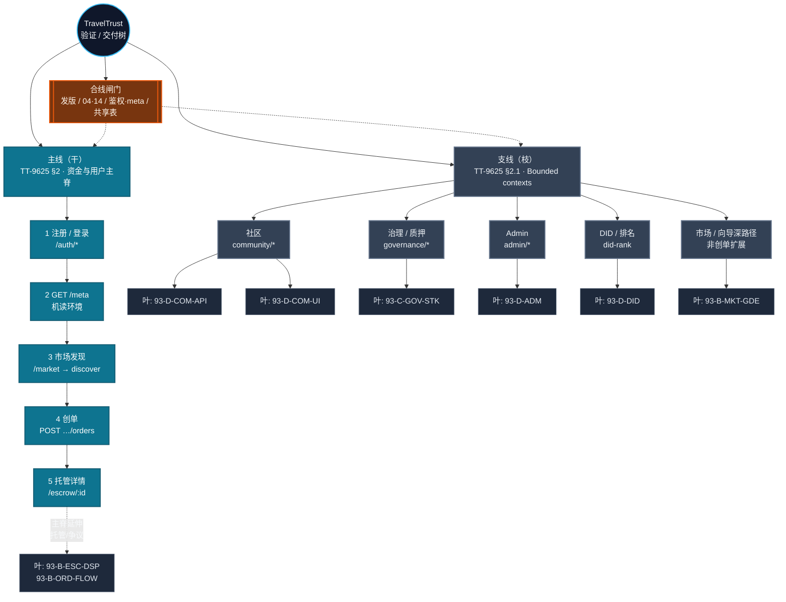
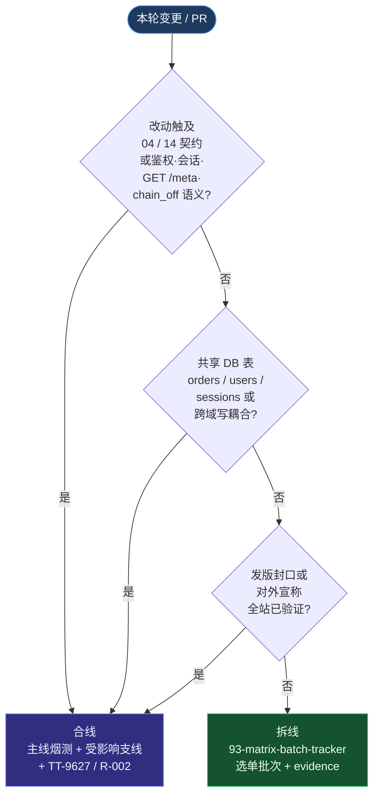

# TT-9628 · 主线与支线：拆线验证与独立升级闸门

**Version:** 0.1.28  
**Status:** Runbook — **把「全链路一口吞」拆成可并行维护的多条验证线**；与 **[TT-9625](TT-9625-golden-path-system-spine.md)**（**主线叙事**）、**[93-matrix-batch-tracker](93-matrix-batch-tracker.md)**（**93 分批**；拆线语境见 **[下一批执行指针](93-matrix-batch-tracker.md#tt-93-matrix-next-batch-pointer)**：**IMP** / **93** 分轨）、**[TT-9627](TT-9627-delivery-order-spine-then-full-site.md) §0.c**（**增量与完成标记**）**串读**。**不**替代 **[93](../spec/93-全站功能验证矩阵-域别回归清单.md)**、**[96-20](../spec/96-20-前后端页面对齐与UI生产级审计报告.md)**、**[R-002](../spec/R-002-回归执行闭环与发布准入.md)** 正文。

**仓库路径：** `docs/runbook/TT-9628-main-line-vs-branch-lines-delivery.md`

---

**阅前（CI 欠费 / Actions 关闭）**：后文若出现 **required checks**、**branch protection**、**远端 Build 必绿** 等表述，按 **组织恢复计费并启用 Actions 后** 的旁证语境理解即可；**独立开发当前默认**仍以 **[CONTRIBUTING · GitHub Actions 不可用](../../CONTRIBUTING.md#github-actions-unavailable)**、**[solo-dev-rhythm §6.5](../solo-dev-rhythm.md)**、**[TT-LOCAL-CI-DELIVERY-GATE-001](TT-LOCAL-CI-DELIVERY-GATE-001.md)** 为收口真源。

---

<a id="tt-9628-coverage-boundary"></a>

## 0.0 覆盖边界：页面 · 功能 · 弹窗 · 分权限用户

**问**：仓库文档是否已保证「每一页、每一功能、每一弹窗、不同权限用户」都已验证？**答**：**否**。采用 **分层真源**；下表为 **读者预期**，避免把「矩阵已写」误读为「全组合已验」。

| 维度 | 文档承诺什么 | 单源（执行顺序见 **[TT-9621](TT-9621-master-order-96-backend-db-chain-frontend.md)**） |
|------|----------------|----------------------------------------------------------------------------------------|
| **页面路由枚举与对齐盘点** | **有**：`page.tsx` 矩阵与 **待核验 → PASS** 的收口定义 | **[96-20 §5](../spec/96-20-前后端页面对齐与UI生产级审计报告.md)**，互证 **04**、**13-1 表 1**、**[93 §5](../spec/93-全站功能验证矩阵-域别回归清单.md)** |
| **域能力与回归用例** | **有**；同时 **§8** 声明 **非目标** 与 **专篇分工** | **[93](../spec/93-全站功能验证矩阵-域别回归清单.md)**（含 **§8**、**§8.0**） |
| **Modal / Dialog / 抽屉等非路由 UI** | **无单表穷尽**；走查与自动化分散在多篇 | **[96-13](../spec/96-13-UI-UX-i18n-a11y-性能走查.md)**、**[36](../spec/36-前端测试与质量门禁.md)**、**[39](../spec/39-上线前UI与UX总验收.md)**、**[130](../spec/130-阶段开发测试体系.md)**；资金区动效边界 **92** |
| **协议角色与 RBAC** | **规范与矩阵真源**；**≠** 全角色 × 全路径已手工/E2E 穷举 | **[87](../spec/87-TravelTrust-角色体系技术文档-融合架构版.md)**、**[13-1](../spec/13-1-UI产品级SSOT与页面规范.md)**、**[70](../spec/70-管理员系统开发文档.md)**；放行与工作流映射 **[R-002](../spec/R-002-回归执行闭环与发布准入.md)** |
| **归档 / 07 §6.4 tail 等** | **时点事实**；表内 **历史** `internal.rs` / `health_meta.rs` 等 **≠** 现行仓库单文件宿主 | **[spec/00 读前 · B-181](../spec/00-文档索引.md)**；**`crates/api/src/routes/internal/mod.rs`**、**`…/health_meta/mod.rs`** 等 **目录树** |

**删径程序链中的「专 PR」**（**98 / 96-索引 / 08** 等处）：在 **多人组织** 指 **GitHub 合并请求** 承载的 **可审计变更批次**；在 **单人维护** 指 **与删径正交的同一小提交序列 / 同批直推**，**不**要求 PR UI — 与 **[solo-dev-rhythm §7](../solo-dev-rhythm.md)**、**[SPEC-MIGRATION-STATUS](../handbook/corpus/SPEC-MIGRATION-STATUS.md)** 文首同条。

### 0.0.1 非路由 UI（Modal / Dialog / 抽屉）走读顺序（无单表时的默认顺序）

**目的**：在**没有**「弹窗全量矩阵」的前提下，仍有一条**固定走读链**，避免随机翻 spec。

1. **[96-13](../spec/96-13-UI-UX-i18n-a11y-性能走查.md)**（门禁式走查；a11y / i18n / 性能子集）。  
2. **[36](../spec/36-前端测试与质量门禁.md)**（脚本与单测门槛）。  
3. **[39](../spec/39-上线前UI与UX总验收.md)**（上线前 UX 总闸门）。  
4. **[130](../spec/130-阶段开发测试体系.md)** **§四～§八**（E2E / 发布门禁与分层策略）。  
5. 资金相关 UI 动效 / 灰区：**[92](../spec/92-P0-全站UI分区控制表-金融体验灰区与动效裁决.md)**。  

正文真源仍各归各篇；**合线 / 发版 / 对外承诺 UI Tier C** 时按 **[TT-9627 §0.c](TT-9627-delivery-order-spine-then-full-site.md)** 把本链涉及项 **勾选留证**。

### 0.0.2 词汇对照（主线 / 支线 ↔ TT-9627 ↔ 93）

| 本文件用词 | 常见叠读位置 | 读者手记 |
|------------|--------------|----------|
| **主线（干）** | **TT-9625 §2** 五段；**TT-9627** 段 **1～3** 多与其重叠 | **合线**或大版本前必须仍绿 |
| **支线（枝）** | **TT-9622** bounded context；**96-20 §5** 按 URL | 日常迭代优先只打开 **一枝** |
| **叶（93 批次）** | **[93-matrix-batch-tracker](93-matrix-batch-tracker.md)** 行、`93-D-*` / `93-B-*` 代号 | **拆线** 时选 tracker **「重跑入口」** |
| **拆线** | **TT-9627 §0.c** 增量裁剪 + 本文件 **§3** | **未** 触 04/14/共享表则可窄跑 |
| **合线** | **TT-9626**、**go-live-checklist**、**R-002 §1** | 与「对外宣称全站已验」同读 |

<a id="tt-9628-tt9627-gates-index"></a>

### 0.0.2a TT-9627 机读闸脚本一行索引（拆线勾选用）

**真源叙事与完成判据**仍以 **[TT-9627](TT-9627-delivery-order-spine-then-full-site.md)** 段表为准；下表仅汇总 **`scripts/gates/`** 下 **竖切 / TT-9627** 相关脚本，便于与本文件 **§3** 拆线决策 **对表选跑**。**阶次**：下表均为 **①** 机读或文件在位断言，**不**替代 **②③** 手点 / 真网关 / 生产 GO。**`ci-local`** 可选开关与 **`SEGMENT456`** 去重行为见 **[TT-LOCAL §2](TT-LOCAL-CI-DELIVERY-GATE-001.md)**、**[scripts/README](../../scripts/README.md)**。

| `scripts/gates/…` | **TT-9627** | **`ci-local-delivery-minimum.sh` 环境变量**（可选） | 备注 |
|---------------------|-------------|--------------------------------------------------------|------|
| **`vertical-slice-01-guides-catalog.sh`** | 段 **1**（竖切 01） | （经 **segment1-api-smoke** 或手跑） | 须 **API**；**`chain_off_mounted`** 等条件见 **TT-9627 段 1.6** |
| **`vertical-slice-02-main-spine.sh`** | 段 **1**（竖切 02） | （经 **segment1-api-smoke** 或手跑） | **`/health`** + **`/meta`** + **`/meta/build`** + **`GET …/discover/orders`** |
| **`vertical-slice-tt9627-segment1-api-smoke.sh`** | 段 **1** 编排 | **`TT9627_SEGMENT1_API_SMOKE=1`** | 先 **02** 再条件 **01** |
| **`vertical-slice-03-market-hub-public-smoke.sh`** | 段 **2**（竖切 03） | （经 **segment2-hub** 或手跑） | 公开 **`GET /api/v1/guides`** 等 |
| **`vertical-slice-04-community-explore-public-smoke.sh`** | 段 **2**（竖切 04） | （经 **segment2-hub** 或手跑） | **`/community/feed`** + **`posts-by-tag`** |
| **`vertical-slice-tt9627-segment2-hub-public-smoke.sh`** | 段 **2** 编排 | **`TT9627_SEGMENT2_API_SMOKE=1`** | **03** + **04** |
| **`scripts/dev/run-web3-itinerary-l5-green.sh`**（**非** `scripts/gates/`） | 段 **2.2-a**（**TT-9627** · **① FE 数据链**） | 手跑 | **`/` + `/market*` 四页** · **`localStorage`** · **debounce** · 收藏 **`localStorage` + F-020 best-effort**；**[LANDING-MARKET-PAGES-CODE-SSOT](../frontend/evidence/GO_local_web3_pages_closure/LANDING-MARKET-PAGES-CODE-SSOT.md)** · **不**替代上列 **03** 公开 GET 竖切 |
| **`vertical-slice-tt9627-segment3-r002-validate.sh`** | 段 **3** | **`TT9627_SEGMENT3_R002_VALIDATE=1`** + **`REPORT_JSON=…`** | 校验既有 **`report.json`**；**不**生成报告；**路径优先级**见 **§0.0.3** 锚 **`#tt-9628-report-json-path-convention`** |
| **`vertical-slice-tt9627-segment3-r002-prereport-chain.sh`** | 段 **3** 预链 | （手跑；**`exec`** 委托 **`local-verify-r002-prereport-chain.sh`**） | 与 **TT-9627 段 3.1** 对拍；**ISS-007** **`gen-r002`** 窄切片 **`release_gate` 常为 `PARTIAL_GO`**（**勿** **`--require-go`** 单机读当 staging **`GO`**）；**`evidence/GO_local_r002_verify/README.md`** |
| **`vertical-slice-tt9627-segment4-spec-presence.sh`** | 段 **4** | **`TT9627_SEGMENT4_SPEC_PRESENCE=1`** | 母表路径在位；**`SEGMENT456=1`** 时 **`ci-local`** 跳过 |
| **`vertical-slice-tt9627-segment5-spec-presence.sh`** | 段 **5** | **`TT9627_SEGMENT5_SPEC_PRESENCE=1`** | 同上 |
| **`vertical-slice-tt9627-segment6-spec-presence.sh`** | 段 **6** | **`TT9627_SEGMENT6_SPEC_PRESENCE=1`** | 同上 |
| **`vertical-slice-tt9627-segments-456-spec-presence.sh`** | 段 **4～6** 编排 | **`TT9627_SEGMENT456_SPEC_PRESENCE=1`** | **4+5+6** 一次；锚 **[TT-9627 · 段 4～6 编排](TT-9627-delivery-order-spine-then-full-site.md#tt-9627-segments-456-orchestration)** |

<a id="tt-9628-dual-owner-split"></a>

### 0.0.2b 双人拆线：双 Owner、任务卡字段、合线主持人

**目的**：两人在**同一仓库**并行推进时，把 **[TT-9627](TT-9627-delivery-order-spine-then-full-site.md) 段 1～6** 的全局顺序与**各自 scope** 对齐，避免互相改契约、互相打终局勾、证据与 staging 写库踩脚。

| 项 | 约定 |
|----|------|
| **身份与职责** | 各自在任务卡文首写明 **Owner 角色** 与 **负责面**（例：**后端** — 域内 API/DB/链下契约证据、**96-20** 中本域 URL 行；**前端** — 同域页面、E2E/手点证据、**96-20** 另一侧行）。**禁止**替对方改 **04** 契约句、替对方勾选「已全站闭 / ③ 生产已验」。 |
| **顺序与阶段映射** | **TT-9627 段 1～6** 为自上而下顺序；任务卡须写清 **本轮对应段号** 与 **[TT-9626](TT-9626-zero-to-production-go-single-path.md) 阶段 0～6** 中对应阶段。**未完成本段/本阶前，不宣称下一段/下一阶已闭**（与 **TT-9627** 文首「怎么用本清单」同条）。 |
| **并联对齐文档** | 对齐 **96-20 / 93 / go-live-checklist / 缺口官方总表 P0** 时，**只改本人 scope 内行项**；他域只 **开 issue / 任务卡转发**，不直接改表内结论列。 |
| **证据与 staging** | 证据 **分目录** 落盘（例：`evidence/<owner>-<batch>-<run_id>/`）；**若共用同一 staging 写库**，须在任务卡或书面约定中划分 **env/库/schema 前缀**，避免双写冲突。 |
| **进度口径** | 只报 **① 本地 / ② 测试网 / ③ 生产**；**禁止**用 **①②** 冒充 **③**（同 **§0.0.5**、**CONTRIBUTING**）。 |
| **96-15 深度多维** | 若任一方触发对外 **「深度审计」**、合同/安全附录级义务：**触发方** 按 **[96-15](../spec/96-15-深度多维度检查与审计体系.md)** 文首 **何时必跑** 完成 **Tier + §3 P0** 留证，并与 **TT-9627** 文首 **深度多维**（**§0.2**）及 **段 4～6** **同周对拍**一致。否则 **§3 P0** 可对本轮 scope **书面 N/A 一句**（与 **TT-9627**、**96-15** 同源）。 |
| **合线 / 发版** | 由**约定的一名主持人**在合线或发版前，按 **go-live-checklist + 缺口总表 P0 + R-002** 做 **差集补跑** 并产 **一份终局索引**；**禁止**两人各写一份互相矛盾的「已全站闭 / ③ 已验」。 |

### 0.0.3 「待核验」→ PASS 与 `report.json`（可执行的文档闭包）

- **96-20 §5** 矩阵：「待核验」**≠** 失败；改为 **PASS** 须满足 **[96-20 · §0.2 最小证据](../spec/96-20-前后端页面对齐与UI生产级审计报告.md#96-20-pending-to-pass)**，并在该行或 **`evidence/**` README 标明 **① / ② / ③**（阶次纪律同 **CONTRIBUTING** 篇首）。  
- **`report.json` `release_gate: GO`**（**[R-002 §1～§2](../spec/R-002-回归执行闭环与发布准入.md)**）：只证明**纳入该次回归的**用例集合；**不**自动包含 **§0.0** 表内 **弹窗 / 角色穷举** — 与 **[go-live-checklist · 与 P0 关系](../go-live-checklist.md)** 增补条、**CONTRIBUTING** **「后续工作重心」** 段同键。  
- **ISS-007 窄切片 `report.json`**（**`gen-r002-iss007-prereport.py`**）：43 锚 **PASS** 时 **`release_gate` 仍为 `PARTIAL_GO`**（设计如此）；机读收口用 **`validate-regression-report.py --fail-on-no-go`**，**勿** **`--require-go`** 冒充 **staging 全矩阵 `GO`**；自述 **`evidence/GO_local_r002_verify/README.md`**（与 **TT-9627 段 3.3**、**95 §1.1**、**`scripts/README`** 同口径）。  
- **E2E / Playwright**：用例目录以 **`frontend/e2e`** 与 **[130 §四～§五](../spec/130-阶段开发测试体系.md)** 为准；**无 spec 即无「默认可点」** 的页面，不在本 Runbook 展开。

<a id="tt-9628-report-json-path-convention"></a>

**段 3 机读 · `report.json` 路径（①）**：仓库**无**根目录单一默认 **`report.json`** 文件名。**`bash scripts/gates/vertical-slice-tt9627-segment3-r002-validate.sh`** 取路径优先级为 **argv1** > **`REPORT_JSON`** > **`TRAVELTRUST_R002_REPORT_PATH`**（与脚本头一致）。典型落盘由 **`scripts/ci/run_local_ci.sh`**、**`local-verify-r002-prereport-chain.sh`**、**窄域 G15** 等写在 **`evidence/…/report.json`**（示例 **`evidence/GO_YYYYMMDD/report.json`**，见 **`validate-regression-report.py`** 调用处与 **scripts/README**「回归机读闸」段）。**`TT9627_SEGMENT3_R002_VALIDATE=1`** 走 **`ci-local-delivery-minimum.sh`** 时**必须**显式 **`REPORT_JSON=…`**（与 **[TT-9627 段 3.3](TT-9627-delivery-order-spine-then-full-site.md)**、**[TT-LOCAL §2](TT-LOCAL-CI-DELIVERY-GATE-001.md)** 同条）。**staging/prod 放行**仍以 **[R-002](../spec/R-002-回归执行闭环与发布准入.md) §1**、**[96-11](../spec/96-11-发布签字与回归门禁.md) §1** 为契约 SSOT（**读前表**「日常段 3 机读」行 + **§1** 段首 **「与日常机读分轨」** 句）。

<a id="tt-9628-0-0-4-doc-hygiene"></a>

### 0.0.4 叙事互指维护约定（防一处改了、别处留旧）

凡改动 **「GitHub Actions 不可用 / 本地替代 CI / required checks 旁证」**、**「覆盖边界 / 矩阵≠穷举」**、**「`report.json` 路径 / 段 3 机读入参（argv / `REPORT_JSON` / `TRAVELTRUST_R002_REPORT_PATH`）」**、**「ISS-007 / `PARTIAL_GO` / `GO_local_r002_verify` / `gen-r002-iss007` 窄切片与 `--require-go` 分轨」**、**「R-001 / R-002 / R-003 / 96-11 / 130 中 `report.json` 接入门禁与日常机读分轨」**、**「handbook/engineering/05 中 `ci-local` / 竖切 / TT-9628 §0.0.2a / §0.0.3 互指」**、**「双人拆线 / 合线主持人（§0.0.2b）」**、**「AI 任务卡索引一览（`maybe-run-ai-task-card-index-overview-on-diff` / `check-ai-task-card-index-overview` / `SKIP_AI_TASK_CARD_INDEX_OVERVIEW` / `CI_LOCAL_SKIP_AI_TASK_CARD_INDEX` / `dev-preflight` / `ci-local`）与 04 · 零、`spec/00` 中 04 行、`docs/00`（B-179）、`docs/README`（目录短引）、**`docs/AI任务卡索引.from-stash`（未封口草稿）**/**`docs/任务母表`（主索引↔from-stash 流程）**、TT-LOCAL §2、`scripts/README`、`.github/PULL_REQUEST_TEMPLATE.md`」** 或 **「根 README / Cursor 规则 / 极简话术（含 `docs/AI协作话术-减负与边界` §0.2）里的 TT-9628 §0.0.2a / §0.0.3 / §0.0.2b / §0.0.4 互指」** 句式，**合并前**请在仓库根执行（或等价 `rg`）：

```bash
rg -n "github-actions-unavailable|GitHub Actions 不可用|9628-coverage-boundary|覆盖边界|tt-9628-no-false-completion|no-false-completion|禁止假完成|PARTIAL_GO|GO_local_r002_verify|gen-r002-iss007|tt-9628-tt9627-gates-index|tt-9628-report-json-path-convention|tt-9628-dual-owner-split|tt-9628-0-0-4-doc-hygiene|ai-collab-doc-hygiene-0-2|双人拆线|maybe-run-ai-task-card-index-overview-on-diff|SKIP_AI_TASK_CARD_INDEX_OVERVIEW|CI_LOCAL_SKIP_AI_TASK_CARD_INDEX|check-ai-task-card-index-overview|AI任务卡索引一览|main-branch-ai-index-gate" CONTRIBUTING.md README.md docs/solo-dev-rhythm.md docs/go-live-checklist.md docs/runbook/go-live-checklist.md docs/handbook/engineering/05-本地环境与常用门禁速查.md docs/spec/96-索引-全链路外生产验收分册.md docs/spec/R-001-全站回归报告模板与汇总JSON结构.md docs/spec/R-002-回归执行闭环与发布准入.md docs/spec/R-003-Staging首次完整回归-A-B域-执行Runbook.md docs/spec/96-11-发布签字与回归门禁.md docs/spec/04-后端与API.md docs/spec/00-文档索引.md docs/00-文档索引.md docs/README.md docs/AI任务卡索引.from-stash.md docs/任务母表.md scripts/README.md docs/runbook/TT-LOCAL-CI-DELIVERY-GATE-001.md .github/PULL_REQUEST_TEMPLATE.md scripts/gates/maybe-run-ai-task-card-index-overview-on-diff.sh .cursor/rules/traveltrust-ai-collab.mdc docs/runbook/TT-9628-main-line-vs-branch-lines-delivery.md docs/AI协作话术-减负与边界.md AGENTS.md docs/runbook/README.md docs/spec/缺口与待补-官方总表.md docs/spec/130-阶段开发测试体系.md evidence/GO_local_r002_verify/README.md
```

并在**同一合并批次**内把命中处 **语义对齐**（允许措辞微差，**禁止**旧句与新句 **互相矛盾**）。

<a id="tt-9628-no-false-completion"></a>

### 0.0.5 禁止假完成（须对齐真实数据与环境）

**定义**：**假完成**指对外或对内宣称「已验收 / 已闭 / GO / 已对齐 / 真实链路跑通」，但**缺少**与该阶次一致的 **可复现命令 + 环境（①②③）+ 证据落点**（`evidence/`、`report.json`、`README` 留痕、**96-20** 行级标注等）。

**禁止（非穷举）**：

| 禁止 | 须改成的说法 / 动作 |
|------|---------------------|
| 把 **①** 本地 `cargo test` / Vitest / `run-check-04-routes` 绿说成 **②** 已在 **测试库 + 测试网关** 验收 | 写明 **①**；要宣称 **②** 须按 **TT-9618 / R-003 / go-live** 等 runbook 在目标环境留痕 |
| 把 **②** 说成 **③** 生产 / 主网真 PSP 已 GO | **禁止**；**③** 须 **go-live / Production GO** 单独闸 |
| 把 **单份 `report.json` `release_gate: GO`** 或 **93 窄切片锚点数** 说成 **全站矩阵已 PASS** | 对照 **R-002**、**95 §9·ISS-007**、**[93-matrix-batch-tracker](93-matrix-batch-tracker.md)**；**staging 全矩阵**以 **R-003** 等为真源 |
| **96-20 §5** 仍为 **待核验** 却称「该路由页已对齐」 | 先完成 **[96-20 §0.2](../spec/96-20-前后端页面对齐与UI生产级审计报告.md#96-20-pending-to-pass)** 再改列 |
| **仅改 Markdown** 勾选称 **API/ABI/DB 已更新** | **[96-18-未完成](../spec/96-18-未完成清单与多维检查.md)** 篇首「生产级收口」与 **`#9618-doc-complete-align`** |
| **CI 顶栏绿** 或 **无 Actions** 作为**唯一**收口 | **CONTRIBUTING · [GitHub Actions 不可用](../../CONTRIBUTING.md#github-actions-unavailable)**、**solo-dev §6.5** |

**互指：** **[CONTRIBUTING · 禁止假完成](../../CONTRIBUTING.md#no-false-completion)**；**[R-002](../spec/R-002-回归执行闭环与发布准入.md)** **`environment.name`**；**[96-20 §0.2](../spec/96-20-前后端页面对齐与UI生产级审计报告.md#96-20-pending-to-pass)**。

---

## 0. 名词（本文件专用口径）

| 词 | 含义 | 真源互指 |
|----|------|----------|
| **主线** | **资金与用户主脊**：会话 → **`GET /meta`** → 市场发现 → 创单 → 托管（与 **TT-9625 §2** 五段一致）。 | **TT-9625**、**TT-9627** 段 **1～3** |
| **支线** | **主脊之外的 bounded context**：社区、治理、Admin、DID、质押扩展、市场子站等；可 **单独排期、单独留证、单独升级**。 | **TT-9625 §2.1**、**TT-9622**、**96-20** 按 URL 行 |
| **拆线** | 本轮变更 **只触达某支线** 时，**不**默认重跑整条主线手点；按 **93 批次 + 复跑门槛** 裁剪 scope。 | **TT-9627 §0.c**、**[93-matrix-batch-tracker · 下一批执行指针](93-matrix-batch-tracker.md#tt-93-matrix-next-batch-pointer)** |
| **合线** | **发版封口 / 共享契约变更 / 横切安全** 时，把 **主线 + 受影响支线** 拉回同一证据包对拍。 | **TT-9626**、**go-live-checklist**、**R-002** |
| **独立开发模式** | **无日常 PR / 无日常 CI** 时：**拆线/合线** 闸门仍适用；**日常收口**以 **[缺口与待补-官方总表 · §独立开发期口径](../spec/缺口与待补-官方总表.md)**、**[CONTRIBUTING · 推送前本地检查](../../CONTRIBUTING.md#pre-push-local)**、**[solo-dev-rhythm §6.5](../solo-dev-rhythm.md)** 为准，**不**以「每社区 PR 必远端全绿」叙事为真值。 | 同上 |

---

## 0.1 树形结构与示意图（阅图即览）

以下 **Mermaid** 在 **GitHub / VS Code / Cursor** 预览 Markdown 时均可渲染；若环境不支持，用 **0.1.3 ASCII 树**。

### 0.1.1 总树：主线为干、支线为枝、93 批次为叶



**读图约定**

- **干（主线）**：默认每次 **大版本 / 合线** 必须仍可自上而下 **绿**；日常迭代见 **§0.c 复跑门槛**，不必每 PR 手跑全长。  
- **枝（支线）**：按域升级时 **只点亮该枝下的叶（93 批次）** + **96-20 对应行**。  
- **虚线**：主脊 **延伸** 的订单深路径，与 **93-B-*** 批次重叠时，在任务卡里写明 **是否随社区 PR 一并跑**。

### 0.1.2 拆线 / 合线判定（决策树）



### 0.1.3 ASCII 树（无 Mermaid 时使用）

**口径：** 下面这棵树 = **「按域拆跑 / 合线」的交付与验证树**（干·枝·叶 = 主线 / 支线 / 93 批次示意）。**不**等于「全站每一页、每一维审计」的穷举；**深度多维、UI/UX、a11y、RBAC、生产 P0** 等见 **§0.1.4** 与下树 **第二根枝**。

```text
TravelTrust 验证 / 交付树（拆线用 · 非全能力枚举）
├── 主线（干） TT-9625 §2
│   ├── 1 注册/登录
│   ├── 2 GET /meta
│   ├── 3 市场发现 → /market
│   ├── 4 创单 POST …/orders
│   └── 5 托管 /escrow/:id
│       └── 延伸叶: 93-B-ORD-FLOW, 93-B-ESC-DSP, 93-B-MSG-NEG…
├── 支线（枝） TT-9625 §2.1 / TT-9622 / 96-20
│   ├── 社区 ── 叶: 93-D-COM-API, 93-D-COM-UI
│   ├── 治理/质押 ── 叶: 93-C-GOV-STK
│   ├── Admin ── 叶: 93-D-ADM
│   ├── DID/排名 ── 叶: 93-D-DID
│   └── 市场/向导深路径 ── 叶: 93-B-MKT-GDE（/guide 档期·接单 P2 薄入口 [TT-93](TT-93-guide-schedule-next-001.md#tt-93-guide-schedule-next-001)）
├── 合线闸门（根上汇聚）发版 | 04/14 | 鉴权·meta | 共享表
│   → 主线 + 受影响支线 + TT-9626 / go-live / R-002
└── 深度多维·体验·对齐（与上三枝正交；合线/发版/对外承诺时拉通）
    ├── 96-15（深度多维审计）↔ TT-9627 §0.2、§0.1 并联表（RBAC / UI·a11y·i18n）
    ├── 96-20（全站 URL×API 矩阵）+ 93 全文（非仅上表「叶」缩写）
    ├── 96-13 · 96-16 · 88（走查 / 总册 / 五主路由 UX 快照）
    ├── 96-21（9～17 闭环）+ TT-9624（八类闭环）+ 96-18 / 缺口官方总表 P0
    └── R-002 / R-003 / R-004（回归顺序与发布准入）
```

### 0.1.4 回答「全了吗」：本树与「深度多维 / UI·UX / 全功能对齐」的关系

| 维度 | 是否被 §0.1.3 树干单独穷举 | 真源 / 收口去哪 |
|------|---------------------------|-----------------|
| **按域拆跑、少跑全链** | **是**（树干本意） | 本文件 **§2～§4** + **93-matrix-batch-tracker** |
| **每一页 URL、每一 API 对齐** | **否**（应用 **96-20** 矩阵逐行勾，不在此 ASCII 展开） | **[96-20](../spec/96-20-前后端页面对齐与UI生产级审计报告.md)** |
| **全矩阵功能与负例** | **否**（叶只标 **代表性** 批次名；**A 域 / R-003 / §6 横切** 等见 tracker 全表） | **[93](../spec/93-全站功能验证矩阵-域别回归清单.md)** + **tracker 批次总表** |
| **UI / UX / a11y / i18n 深度** | **否** | **[96-16](../spec/96-16-全页面UI-UX优化方案总册.md)**、**[96-13](../spec/96-13-UI-UX-i18n-a11y-性能走查.md)**、**[88](../spec/88-五主路由页身实现快照与UX缺口审计-20260330.md)**；并联表见 **[TT-9627](TT-9627-delivery-order-spine-then-full-site.md) §0.1** |
| **深度多维审计体系** | **否** | **[96-15](../spec/96-15-深度多维度检查与审计体系.md)**（Tier A/B/C 与范围触发） |
| **工程闭环 9～17** | **否** | **[96-21](../spec/96-21-工程闭环扩展清单进阶.md)**、**[TT-9624](TT-9624-closed-loop-checklist.md)** |
| **RBAC / 多钱包** | **否** | **93** + **[87](../spec/87-TravelTrust-角色体系技术文档-融合架构版.md)** + **[96-17](../spec/96-17-多重身份与钱包真值.md)**（**TT-9627 §0.1** 行） |
| **生产向 P0 / GO** | **否**（合线闸门只点名） | **go-live-checklist**、**[缺口与待补-官方总表](../spec/缺口与待补-官方总表.md)**、**[TT-9626](TT-9626-zero-to-production-go-single-path.md)** |

**结论：** §0.1.3 **对「拆线跑通、合线收口」是结构完整的**；对「**深度多维 + 全 UI/UX + 全功能矩阵补缺口**」必须 **叠读上表**，并在 **合线 / 发版 / 对外承诺 Tier C** 时把 **第二根枝** 下的条目 **按 scope 勾选留证**（与 **TT-9627 §0.c** 一致）。

---

## 1. 为什么需要拆线

- **社区加内容、治理加能力** 等迭代频繁，若每次都 **「从注册跑到托管再跑全 93」**，成本高且易 **因无关红字阻塞交付**。
- 拆线 **不是** 降低质量：每条支线仍有 **93 行 + 96-20 行 + 证据目录**；**合线** 时才做 **全站或 staging 级** 收口。

---

## 2. 支线 ↔ 93 批次（执行单元）

**原则：** 支线升级 **默认只跑** 与该域相关的 **93 批次**（见 **[93-matrix-batch-tracker](93-matrix-batch-tracker.md)** 总表）；主线 **不**在每个社区 PR 重跑全量手点。

| 支线（示例） | 典型页面 / API 域 | 优先 93 批次（可增减以 93 改版为准） |
|--------------|-------------------|--------------------------------------|
| **社区** | `frontend/app/community/**`、`/api/v1/community/*` | **93-D-COM-API**、**93-D-COM-UI**；与消息交叉时加 **93-B-MSG-NEG** 子集 |
| **治理 / 质押** | `app/governance/*`、治理 API | **93-C-GOV-STK** |
| **Admin** | `app/admin/*`、internal 只读 | **93-D-ADM** |
| **DID / 排名** | `did-rank`、相关 GET | **93-D-DID** |
| **市场 / 向导（非创单）** | `/market` 扩展、guides 目录深路径、`/guide`（档期·接单 P2 薄入口 [TT-93](TT-93-guide-schedule-next-001.md#tt-93-guide-schedule-next-001)） | **93-B-MKT-GDE** |
| **订单 / 托管 / 争议** | 主脊延伸、 escrow、dispute | **93-B-ORD-FLOW**、**93-B-ESC-DSP** |

**R-003 / R-004 顺序**仍以 **[R-003](../spec/R-003-Staging首次完整回归-A-B域-执行Runbook.md)**、**[R-004](../spec/R-004-R003之后的扩展回归路线图.md)** 为准；本文件只解决 **「日常迭代跑哪批」**，**不**改写 staging 首轮硬规则。

---

## 3. 何时可以「只跑支线」

**允许只跑支线（+ 默认 CI / 受影响单测）** 当且仅当 **全部** 成立：

1. **契约**：未改 **04 / 14** 中与本支线 **无关** 的路由与错误码语义；若改了共享中间件（鉴权、幂等、`/meta` 键），按 **复跑门槛** 扩 scope。  
2. **数据**：未做 **跨域大 migration**（例：仅社区表/索引变更，且 **订单/用户核心表** 无破坏性 DDL）。  
3. **依赖**：支线功能 **不**新增对 **主线独有模块** 的 **写路径** 强依赖；若新增（例：社区发帖触发订单状态），须 **同时** 打开 **93-B-ORD-FLOW** 或相关行。  
4. **证据**：在本批次 **`evidence/93-batch-…/<run_id>/`**（或任务卡约定目录）写清 **commit、环境 ①/②、Owner**（与 **TT-9627 §0.c** 一致）。

---

## 4. 何时必须「合线」（带回主线或其它批次）

**须** 在合线清单里 **显式勾选**（非穷举，变更时以代码审为准）：

- **认证 / 会话 / `STRICT_SESSION_GATE` / `getAuthHeaders` 行为** 变更 → **主线** + **所有须登录的支线** 最小烟测（至少 **登录 → `/meta` → 一条支线写路径**）。  
- **`GET /meta` 机读键**、**`chain_off` 挂载语义**、**CORS / 网关** 变更 → **主线** + **TT-9621** 相关 Phase。  
- **共享 `orders` / `users` / `sessions` 表或 projection** 变更 → **主线** + **93-B-ORD-FLOW** 或 **93-B-ESC-DSP** 子集。  
- **发版 / 对外承诺「全站已验证」** → **TT-9627** 段表 + **go-live** 与 **R-002** 要求的全量或 staging 口径。

---

## 5. 与现有文档的叠读顺序（建议）

1. **定主线是否仍绿**：**TT-9625** 五段或 **TT-9627** 段 **1～2** 的快速烟测（不必每 PR 全量手点，**有复跑门槛再上**）。  
2. **定支线归属**：**TT-9622** 找 bounded context；**96-20** 勾 URL/API 行。  
3. **定本批 93**：**93-matrix-batch-tracker** 选批次 → 跑 **重跑入口** 列命令 / Playwright / 手工。  
4. **登记完成**：**TT-9627 §0.c** + **`report.json` / 证据 README**。

**分层编排（L0～L7）** 与多脚本顺序：另见 **[TT-STACK-LAYERS-REGRESSION-ORCH-001](TT-STACK-LAYERS-REGRESSION-ORCH-001.md)**。

---

## 6. 补全执行单（可勾选 · 与「深度多维」叠加）

**用途：** 把「拆线 / 合线」从 **概念** 落到 **可重复命令 + 证据目录**；**不**替代 **缺口官方总表 P0** 签字项。

### 6.1 合线最小集（发版前或横切 PR）

| ☐ | 动作 | 命令 / 落点 |
|---|------|-------------|
| ☐ | API 契约机读 | **`bash scripts/run-check-04-routes.sh`**（或 **`scripts/gates/run-check-04-routes.sh`**；见 **CONTRIBUTING** / **缺口总表** 流水 **步骤 5**） |
| ☐ | ABI / 合约闸（有 forge 时） | **`bash scripts/check-55-s13.sh`**（见 **缺口总表** 流水 **步骤 5**） |
| ☐ | 后端默认包 | **`cargo test -p traveltrust-api`** |
| ☐ | 前端构建（大改 UI 后） | **`cd frontend && npm run build`**；严格闸见 **`scripts/gates/check-frontend-npm-build.sh`** / **缺口总表 P1** |
| ☐ | 准入费 PG 一键（scope 含 onboarding 时） | **`bash scripts/gates/tt-9618-onboarding-pg-evidence.sh`**（**[TT-9618 §3.5.3](TT-9618-onboarding-local-testnet.md#tt-9618-pg-evidence-one-shot)**） |
| ☐ | 证据与 manifest | **`evidence/…/README`** + **`report.json`**；与 **TT-9627 §0.c**、**go-live-checklist** 对拍 |

### 6.2 支线「社区」增量（拆线）

| ☐ | 动作 | 命令 / 落点 |
|---|------|-------------|
| ☐ | API 子串测 | **`cargo test -p traveltrust-api matrix_93_d_com`**（子串以本机 **`-- --list`** 为准；与 **93-D-COM-API** 对拍） |
| ☐ | UI / Playwright | 仓库 **`frontend/e2e`** 中带 **`community`** 的 spec，或 **93-D-COM-UI** 手册步骤 |
| ☐ | 证据目录 | 建议 **`evidence/93-batch-D-com-api/<run_id>/`** 与 **`…-ui/…`** 分开落盘 |

### 6.3 文档真源仍须人补（不代写）

| 文档 | 说明 |
|------|------|
| **[08-4](../spec/08-4-对外口径包.md)** | **缺口总表 P1-B**：法务/运营/CFO 正文 |
| **[ops/RUNBOOK.md](../../ops/RUNBOOK.md)** | **P0 九项** 替换为项目实际口径 |
| **96-18-未完成 §2 P0/P1** | PSP、**mTLS**、OFAC 等与 **代码** 对拍后改状态（须 **证据**） |

---

## 7. 修订记录

| 版本 | 日期 | 摘要 |
|------|------|------|
| 0.1.0 | 2026-04-30 | 首版：主线/支线定义、93 批次映射、拆线/合线闸门、与 TT-9625/9627/93/R-003 互指。 |
| 0.1.1 | 2026-04-30 | **§0.1**：Mermaid **总树**（干·枝·叶）+ **拆线/合线决策树** + **ASCII 备用树**。 |
| 0.1.2 | 2026-04-30 | **§0.1.3** 标明非穷举；ASCII 增 **深度多维·体验·对齐** 枝；**§0.1.4** 对照表（96-15/96-20/93 全文/96-13/16/88 等）。 |
| 0.1.3 | 2026-04-30 | **§6**：**补全执行单**（合线最小集、社区拆线、文档人补项）。 |
| 0.1.4 | 2026-04-30 | **§0** 名词表增 **独立开发模式** 行；与 **缺口总表 §独立开发期**、**CONTRIBUTING#pre-push-local** 对读。 |
| 0.1.8 | 2026-04-30 | **§0.0** 增 **归档/B-181** 行；**§0.0.1** 非路由 UI 走读顺序；**§0.0.2** 词汇对照表；**§0.0.3** 待核验→PASS / `report.json` / E2E 文档闭包；**§0.0.4** 多文互指维护 `rg` 约定。 |
| 0.1.9 | 2026-04-30 | **§0.0.5** **禁止假完成**（真实数据与环境 + 证据链表）；**§0.0.4** `rg` 命中面扩至 **AI话术** / **AGENTS**；与 **CONTRIBUTING `#no-false-completion`** 对拍。 |
| 0.1.10 | 2026-04-30 | **§0.0.4** `rg` 再扩 **runbook/README**、**缺口官方总表**、**130**；与 **96-Hub / 93 / R-002** 读前互指补齐对拍。 |
| 0.1.11 | 2026-05-01 | **§0.0.2a**：**TT-9627** 竖切 / 段式机读闸 **`scripts/gates/`** 一行索引表 + 锚 **`#tt-9628-tt9627-gates-index`**（与 **TT-9627 §0** 互指）。 |
| 0.1.12 | 2026-05-01 | **§0.0.3**：锚 **`#tt-9628-report-json-path-convention`**（**`report.json`** 路径优先级、**无**仓库根默认、**`ci-local`** 须 **`REPORT_JSON`**）；**§0.0.2a** 表 **段 3** 备注互指；**§0.0.4** `rg` 串扩 **`tt-9628-tt9627-gates-index`** / **`tt-9628-report-json-path-convention`** 与触发句。 |
| 0.1.13 | 2026-05-01 | **§0.0.4**：`rg` 扫描面增 **根 `README.md`**；触发句增 **根 README / Cursor 规则 / 极简话术** 与 **§0.0.2a / §0.0.3** 互指改写场景。 |
| 0.1.14 | 2026-05-01 | **§0.0.3** 叙事互指：**根 `docs/go-live-checklist.md`**「与 P0 关系」并联 **①** 拆线机读 vs **staging/prod** 硬门槛；**`docs/runbook/go-live-checklist.md`** 薄入口增 **§0.0.3** 链；**§0.0.4** `rg` 扫描面增 **`docs/runbook/go-live-checklist.md`**。 |
| 0.1.15 | 2026-05-01 | **R-002** 读前表 + **§1** 段首分轨句；**96-11 §0** 新行 + **11.1** 执行要点；**§0.0.3** 末句互指 **R-002 §1** / **96-11 §1**；**§0.0.4** 触发句 + `rg` 增 **`R-002`** / **`96-11`**；**CONTRIBUTING** `rg` 手扫清单增 **R-002 / 96-11**。 |
| 0.1.16 | 2026-05-01 | **R-001** / **R-003** / **130** 读前互指 **§0.0.3**（及 **§0.0.2a**）；**§0.0.4** 触发句 + `rg` 增 **`R-001`** / **`R-003`** / **`130`**；**CONTRIBUTING** 手扫清单增 **R-001 / R-003**。 |
| 0.1.17 | 2026-05-01 | **engineering/05**：**§3** 矩阵 + **§4** 表增 **TT-9628 §0.0.3 / §0.0.2a**；**`validate-regression-report.py`** 头注释链 **§0.0.3**；**§0.0.4** 触发句 + `rg` 增 **`docs/handbook/engineering/05-…`**；**CONTRIBUTING** 手扫清单增 **handbook/engineering/05**。 |
| 0.1.18 | 2026-05-01 | **§0** 名词表 **拆线** 行 + **Status** 串读：**[93-matrix · 下一批执行指针](93-matrix-batch-tracker.md#tt-93-matrix-next-batch-pointer)**（**IMP** / **93** 分轨）。 |
| 0.1.19 | 2026-05-01 | **§0.1.3** ASCII 树 + **§2** 表：**`/guide` P2** 互指 **[TT-93 · 稳定锚](TT-93-guide-schedule-next-001.md#tt-93-guide-schedule-next-001)**。 |
| 0.1.20 | 2026-05-01 | **§0.0.2b** 双人拆线（双 Owner、任务卡字段、证据分目录、staging 书面划分、96-15 触发留证、合线主持人一份终局索引）；锚 **`#tt-9628-dual-owner-split`**。 |
| 0.1.21 | 2026-05-01 | **§0.0.4**：触发句增 **AI 一览** / **`maybe-run-…`** / **跳过变量** / **04 · 零** / **`spec/00`** / **TT-LOCAL** / **`scripts/README`** / **PR 模板**；`rg` 模式与扫描路径同上扩面；**CONTRIBUTING** 手扫清单对拍。 |
| 0.1.22 | 2026-05-01 | **§0.0.4**：锚 **`#tt-9628-0-0-4-doc-hygiene`**；**`rg`** 模式串增该锚；**AGENTS** / **`.cursor/rules/traveltrust-ai-collab.mdc`** 增互指（与 **`rg`** 扫描面同源）。 |
| 0.1.23 | 2026-05-01 | **§0.0.4**：触发句增 **`docs/00`（B-179）**；**`rg`** 扫描路径增 **`docs/00-文档索引.md`**；**CONTRIBUTING** 手扫清单增 **docs/00**；**§0.0.4** 链锚修正互指。 |
| 0.1.24 | 2026-05-01 | **互证收口**：**`spec/00`** 版本表 **`docs/00-文档索引（docs根 · B-179）`** 行与 **`docs/00`** **Version** 对拍；**`docs/00` §2** 更正 **`docs/README`** 叙事（目录短说明、无 **spec/00** 独立版本表行）；**`runbook/README`** **步 10e-c** 显式 **`docs/00`（B-179）**；**§2** **TT-9628** 指针 **v0.1.24**。 |
| 0.1.25 | 2026-05-01 | **§0.0.3**：增 **ISS-007** 窄切片 **`PARTIAL_GO`** / **`--fail-on-no-go` vs `--require-go`** 分轨句；**§0.0.2a** 表 **段 3 预链** 备注互指 **`evidence/GO_local_r002_verify/README.md`**；**§0.0.4** 触发句 + **`rg`** 串增 **`PARTIAL_GO` / `GO_local_r002_verify` / `gen-r002-iss007`**，扫描路径增 **`evidence/GO_local_r002_verify/README.md`**；与 **TT-9627 v0.1.26**、**CONTRIBUTING `#no-false-completion`** 对拍。 |
| 0.1.26 | 2026-05-01 | **`docs/README`** **`Version:`** + **`spec/00`** **`docs/README（docs根 · docs/ 目录说明）`** 行；**`docs/00`** **伴侣行** bump；**§0.0.4** **`rg`** 路径增 **`docs/README.md`**；**CONTRIBUTING** 手扫清单增 **`docs/README.md`**。 |
| 0.1.27 | 2026-05-01 | **§0.0.4** 触发句：**极简话术** 显式含 **`docs/AI协作话术-减负与边界` §0.2**；并列 **§0.0.4**；**AI话术** 增 **§0.2** 可复制句 + **极简版** 一句 **`tt-9628-0-0-4-doc-hygiene`**。 |
| 0.1.28 | 2026-05-01 | **§0.0.4**：触发句增 **`docs/AI任务卡索引.from-stash`/`docs/任务母表`**（主索引↔草稿 **流程裁断**）；**`rg`** 扫描路径增上列两文件；**`rg`** 模式串增 **`ai-collab-doc-hygiene-0-2`**（**AI话术 §0.2** 锚）；与 **CONTRIBUTING** 可选 **PR** 表 **`from-stash` 行**、**`docs/README` v1.0.1** **任务卡双文件** 短引对拍；与 **根 README / AGENTS / Cursor** **AI话术 §0.2** 叙事对拍。 |

---

**文档结束**
