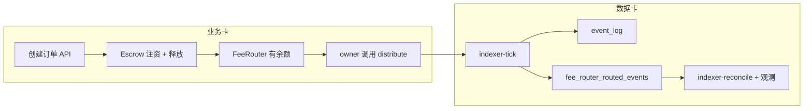

# TT-B402 · B-402 最小可运行 Revenue 闭环（数据卡 + 业务卡）

**母表**：`B-402` · **卡号**：`TT-B402-MIN-REVENUE-E2E-DATA-BUSINESS-CLOSE-LOOP-001`  
**类型**：**业务卡**（53 订单/Escrow 主路径 + FeeRouter 可调用） + **数据卡**（110 写库：`event_log` → `fee_router_routed_events`）  
**日期**：2026-04-15  
**状态**：**已封口**（**2026-04-15** · **母表** **B-402** **/** **主索引** **一览** **332** **/** **`ops/RUNBOOK.md` §2.55** **；** **不** **新增** **观测** **母表** **）

---

## 一句话结论

打通一条**从订单创建 → Escrow 释放产生平台费 → 平台费进入 FeeRouter → `distribute` 拆分并发出 `PlatformFeeRouted` → indexer-tick 写入 PG → indexer-reconcile 现有观测可验真**的最小闭环；**第二层**（RegionVault `RegionVaultForwarded`、CountryPool `CountryLedgerCredited`）为 **Stretch**，用于把 **B-386 bundle** 三腿对齐，但不阻塞「最小 revenue」定义。

---

## 1. 链上语义（与仓库一致）

| 环节 | 说明 |
|------|------|
| **Escrow** | `Released` / 争议路径等将 **`platformFeeAmount`** 以 ERC20 **`transfer(platformFeeRecipient, …)`** 打出（`contracts/src/Escrow.sol`）。 |
| **接 FeeRouter** | 部署/工厂须使 **`platformFeeRecipient == FeeRouter`**，平台费代币**进入 FeeRouter 余额**（尚未拆分）。 |
| **拆分即「收费 + 分配」第一层** | **`FeeRouter.distribute(token, amount)`**（`onlyOwner`，生产上多为 Timelock）：按 BPS 转四方并 **`emit PlatformFeeRouted`**（`contracts/src/FeeRouter.sol`）。 |
| **DB 投影** | `indexer-tick` 对 **`FEE_ROUTER_ADDRESS`** 拉 **`PlatformFeeRouted`**，写入 **`fee_router_routed_events`**（`crates/api/src/routes/internal/indexer/tick.rs` + `db::insert_fee_router_routed_event`）。 |

---

## 2. 最小业务链（MVP · 可手工/脚本验收）

1. **配置**：`CHAIN_RPC_URL`、`FEE_ROUTER_ADDRESS`、Escrow 工厂/`platformFeeRecipient` 已指向 FeeRouter（与 **`ops/RUNBOOK.md` §7.1**、**`GET /meta` `chain.contracts`** 一致）。  
2. **业务**：按 **53** 走通「创建订单 → 托管订单行与链上 Escrow 绑定 → 释放」使 **平台费进入 FeeRouter**（金额 > 0，`platformFeeBps` 合理）。  
3. **链上分配**：以 **`FeeRouter` owner** 身份调用 **`distribute(token, amount)`**（本地 Anvil 可用脚本/铸造 owner；测试网用已部署多签/Timelock 流程）。  
4. **数据**：跑 **`POST /api/v1/internal/indexer-tick`**（或 cron）直到 **`fee_router_routed_events`** 出现对应 **`chain_id, block_number, log_index`** 行。  
5. **观测验真（不重开新卡）**：  
   - **B-383**：`include_fee_router_platform_fee_routed_log_count_chain_vs_db_observability:true`  
   - **B-386**：`include_revenue_pipeline_log_count_chain_vs_db_bundle_observability:true`（三腿 bundle；若 **仅** 有 FeeRouter 行而 **384/385** 无同窗事件，**rollup 可能为 drift/unavailable** — 属预期，见 Stretch）  
   - **B-164**（默认 reconcile 体）：`fee_router_fee_routes_vs_routed_events_drift_observability` 与 **`GET /api/v1/governance/fee-routes`** 列表头/尾一致  
   - **B-081**（可选）：`verify_fee_router_events_rpc: 1～20` 抽样收据对投影字段  
   - **B-389/B-390**（可选）：persist 新鲜度与 suspect，依赖 **B-386** 同请求隐式计算  

---

## 3. Stretch（第二层分配 · 与 B-386 三腿对齐）

| 链上事件 | DB 表 | 观测子键 |
|----------|-------|----------|
| `RegionVaultForwarded` | `region_vault_forwarded_events` | B-384 |
| `CountryLedgerCredited` | `p5_country_ledger_lines` | B-385 |

在 **同一区块窗** 内若三表均有投影行，**B-386** `rollup.marker` 最有信息量。实现可在 **B-402 二期** 增加：RegionVault 转发脚本 + CountryPool 记账交易（见 **83/84**、**14 §1.1.1**）。

### 3.1 封口核对（文档 / 运维）

- [x] **`docs/任务母表.md`** **续表** **B-402** **行** **。**  
- [x] **`docs/AI任务卡索引.md`** **一览** **332** **+** **`### TT-B402-…`** **正文** **。**  
- [x] **`ops/RUNBOOK.md`** **§2.55** **B-402** **段** **+** **`scripts/ops/b402-min-revenue-e2e-reconcile-smoke.sh`** **。**  
- [x] **目标** **环境** **`bash scripts/ops/b402-min-revenue-e2e-reconcile-smoke.sh`** **`exit 0`** **（** **须** **API+DB+链** **；** **无** **链上** **投影** **时** **脚本** **仍** **可** **验** **HTTP/锚** **，** **bundle** **rollup** **可能** **非** **理想** **态** **）** **。**

### §3.1.1 目标环境留证（**`exit 0`** 后 stdout **末行**）

- **命令**：`bash scripts/ops/b402-min-revenue-e2e-reconcile-smoke.sh`（**须** **`INTERNAL_API_SECRET`**、**`ADMIN_BEARER_TOKEN`**、**`jq`**；本地可与 **[`scripts/ops/_local_b387_b388_smoke_orchestrator.sh`](../../scripts/ops/_local_b387_b388_smoke_orchestrator.sh)** **同源**：**`INTERNAL_API_SECRET=${INTERNAL_API_SECRET:-tt-local-b387-b388-smoke}`** **+** **`POST /auth/login`** **取得** **admin** **会话**。）
- **脚本末行（stdout 最后一行，脱敏原样）**：`b402-min-revenue-e2e-reconcile-smoke.sh: ok (B-383+B-386 reconcile == admin overview; bundle rollup.marker=incomparable)`
- **封口日**：**2026-04-15**（**本机** **`API_BASE_URL=http://127.0.0.1:8080`** **；** **`rollup.marker=incomparable`** **属** **B-386** **无** **三腿** **同窗** **对齐** **时** **之** **预期** **态** **。）

---

## 4. 需要修改或对接的代码位置（MVP 优先「接线与脚本」）

| 类别 | 路径 / 说明 |
|------|-------------|
| **Indexer 写库** | `crates/api/src/routes/internal/indexer/tick.rs`（已存在 PlatformFeeRouted 路径；一般**不改**，除非缺 topic/地址配置） |
| **投影插入** | `crates/api/src/db/fee_router_events.rs`（`insert_fee_router_routed_event`） |
| **Reconcile 观测** | `crates/api/src/routes/internal/reconcile/indexer_reconcile.rs`、`body.rs`（**已接线**；本卡**不**新增 flag） |
| **B-383/B-386 计算** | `crates/api/src/db/fee_router_platform_fee_routed_chain_vs_db_count_obs.rs`、`revenue_pipeline_log_count_chain_vs_db_bundle_obs.rs` |
| **治理只读列表** | `crates/api/src/routes/governance/governance_reads.rs`（`GET …/governance/fee-routes`） |
| **链配置** | `crates/api` 启动时 **`ChainConfig`** / env：`FEE_ROUTER_ADDRESS` 等（**`GET /meta`** 暴露） |
| **待补（常见缺口）** | **新增或固化**一条可重复执行的 **`forge script` / `scripts/ops/`**：在 Anvil 上 **fund → release → distribute** 的最小序列；或与现有 **`scripts/dev/`** 联调脚本对齐，避免「人手点 MetaMask」无法 CI |

> **原则**：MVP 尽量 **少改 Rust**；缺口多在 **部署参数 + 一键脚本 + 文档步骤**。

---

## 5. API 清单（本闭环会触达）

| 方法 | 路径 | 作用 |
|------|------|------|
| POST | `/api/v1/orders` 等 | 创建订单（以 **04 §3.4** + **53** 为准） |
| GET | `/api/v1/orders/:id`、`/escrow/...` | 状态与托管详情（业务验证） |
| POST | `/api/v1/internal/indexer-tick` | 索引入 **`event_log`** + **`fee_router_routed_events`** |
| POST | `/api/v1/internal/indexer-reconcile` | **`persist:true`** + 上节观测 flags；写 **`reconciliation_reports.summary`** |
| GET | `/api/v1/governance/fee-routes` | 与 B-164 / 投影对读 |
| GET | `/api/v1/admin/fee-router/routed-events` | 管理端确认行（可选） |
| GET | `/api/v1/admin/observability/overview` | 与 reconcile 同形回读（可选） |

无新要求则 **不必** 新增公共路由。

---

## 6. 数据库表

| 表 | 角色 |
|----|------|
| `orders` | 订单业务真值 |
| `orders_projection` | 与链上对拍（reconcile 主集） |
| `event_log` | 原始日志索引 |
| `checkpoints_sharded` | indexer 位点 |
| `fee_router_routed_events` | **PlatformFeeRouted** 投影（**revenue 第一落点**） |
| `reconciliation_reports` | persist 后 summary（含 B-383/B-386/B-164 等） |

（Stretch：`region_vault_forwarded_events`、`p5_country_ledger_lines`。）

---

## 7. 测试与验收步骤（建议顺序）

1. **机读不变量**：`cargo test -p traveltrust-api`；`bash scripts/run-check-04-routes.sh`。  
2. **本地链**：Anvil/测试网启动；**`FEE_ROUTER_ADDRESS`** 与非空 **`platformFeeRecipient`** 自检（**Runbook / meta**）。  
3. **业务**：走通 **一单** 释放，链上确认 **FeeRouter 代币余额 ≥ 拟 `distribute` 量**。  
4. **链上**：执行 **`distribute`**，链上确认 **`PlatformFeeRouted`** 日志。  
5. **索引**：`indexer-tick` 至 **`fee_router_routed_events`** 可查（**admin list** 或 SQL）。  
6. **观测**：`indexer-reconcile` **`persist:true`**，body 含 **B-383 + B-386**（及可选 B-081/B-389）；检查 **`summary`** 与 **overview** 键。  
7. **组合 smoke（B-402）**：**`bash scripts/ops/b402-min-revenue-e2e-reconcile-smoke.sh`** **exit** **0**（**单** **请求** **同验** **B-383+B-386** **与** **overview** **深相等** **；** **不** **替代** **b383-*** **/** **b386-*** **单卡** **脚本** **）** **。**  
8. **（Stretch）** 补 **384/385** 交易后重复 6，确认 **B-386 rollup** 三腿可解释。

---

## 8. 母表 / 索引登记

- **已落**：**`docs/任务母表.md`** **B-402** **；** **`docs/AI任务卡索引.md`** **一览** **332** **+** **`### TT-B402-…`** **正文** **。**  
- **划界**：**B-401** **占** **观测** **线** **（** **B-400×B-389** **）** **；** **B-402** **专指** **本** **「** **最小** **revenue** **E2E** **」** **台账** **（** **组合** **烟测** **脚本** **，** **不** **新增** **观测** **顶键** **）** **。**

---

## 9. 与 07 / 战略一句话对齐

本卡落实的是：**110 写库路径（`fee_router_routed_events`）** 与 **53/83/84 可执行语义（订单释放 + FeeRouter 拆分）** 的**同一条**最小闭环；观测卡仅作**验真**，不扩大范围。
