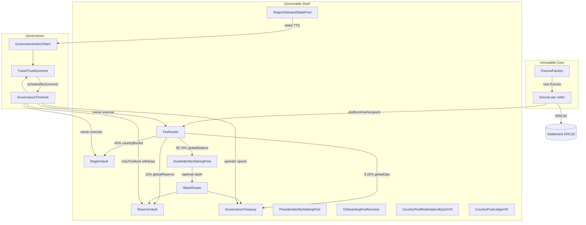
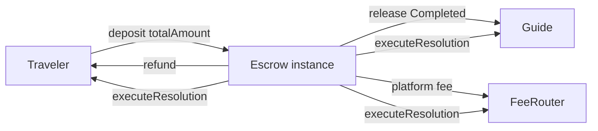
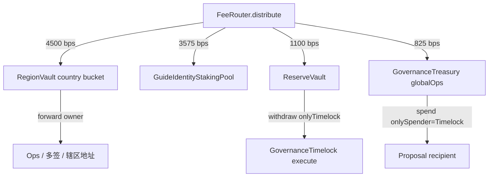
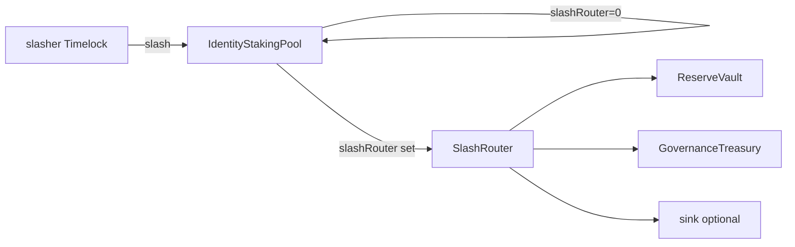
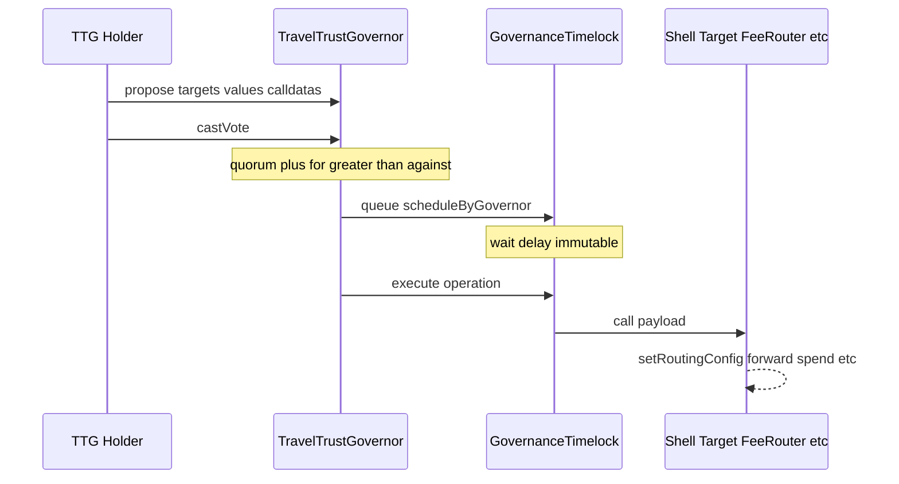

# TT-CHAIN-ARCHITECTURE-AUDITABLE-SPEC

**文档类型：** TravelTrust 链上系统 · **企业级可审计架构规格**（代码真源审查）

**审查基准（真源优先级）：** `contracts/src` → `contracts/test` → `contracts/script` → `registry/` → `docs/spec/`（14 · 01 · 08-4 · protocol-ssot）

**审查日期：** 2026-06-05

**阶段口径：** **① 本地 → ② 测试网 → ③ 主网/生产**

**架构规则（项目写死 · ②）：**

| 规则 | 结论 |
|------|------|
| **Immutable Core** | **Escrow 实例** — 无 owner · 无 Proxy · 无 emergency withdraw |
| **Governable Shell** | FeeRouter / RegionVault / Treasury / Factory pause / Protocol V0 `owner` 配置 |
| **Escrow Proxy** | **② 禁止引入**（每单 `new Escrow()`，非 EIP-1167） |
| **Proxy/UUPS 全库** | **`contracts/src/` 零实现** |

**诚实边界：** 本文 = **静态架构审计 + Foundry 覆盖盘点**；**≠** 第三方安全审计 **≠** ③ Production GO。

**互指：** [TT-PHASE2-CONTRACT-DEPLOYMENT-READINESS](./TT-PHASE2-CONTRACT-DEPLOYMENT-READINESS.md) · [TT-PHASE2-STAGING-READINESS-REPORT](./TT-PHASE2-STAGING-READINESS-REPORT.md) · [contracts/README](../../contracts/README.md) · [14-合约-API-ABI-前后端对齐](../spec/14-合约-API-ABI-前后端对齐.md) · [08-4-对外口径包](../spec/08-4-对外口径包.md)

---

## 1 · 执行摘要

| 维度 | 结论 |
|------|------|
| **可部署合约（生产向）** | **20** 个主合约 + **2** 抽象/库支撑（见 §2） |
| **资金池/托管面** | **13** 类（含动态 Escrow 实例；见 §3） |
| **治理栈** | TTG → Governor → Timelock → Shell 白名单 `execute` |
| **升级策略** | **无原地升级**；演进 = **新部署 + 指针迁移** |
| **Immutable Core 符合度** | **Escrow ✅** · Shell 须 **Timelock 绑定**（部署脚本部分 ✅ / P2 池默认 deployer ❌） |
| **Foundry** | **104 tests / 16 suites · 0 failed**（审查日） |
| **外部审计** | **未做** — ③ 阻塞 |
| **registry 测试网地址** | **`testnet_template` 全 null** |

---

## 2 · 合约清单表

### 2.1 生产合约（按域）

| # | 合约 | 文件 | 域 | 部署脚本 | ABI | 测试文件 | 测试数 |
|---|------|------|-----|----------|-----|----------|--------|
| 1 | **Escrow** | `Escrow.sol` | Immutable Core · 订单托管 | Factory 内 `new` | ✅ | `Escrow.t.sol` | 14 |
| 2 | **EscrowFactory** | `EscrowFactory.sol` | Shell · 工厂 | `Deploy.s.sol` · `DeployFundStackUnderTimelock.s.sol` | ✅ | （经 Escrow B091） | — |
| 3 | **FeeRouter** | `FeeRouter.sol` | Shell · 平台费路由 | 同上 | ✅ | `FeeRouter.t.sol` | 10 |
| 4 | **RegionVault** | `RegionVault.sol` | Shell · 国家桶 | 同上 | ✅ | `RegionVault.t.sol` | 16 |
| 5 | **ReserveVault** | `ReserveVault.sol` | Shell · 罚没/Reserve 腿 | 同上 | ✅ | `SlashRouter.t.sol` | 2 |
| 6 | **GovernanceTreasury** | `GovernanceTreasury.sol` | Shell · 治理金库 | 同上 | ✅ | `GovernanceTreasury.t.sol` | 8 |
| 7 | **GuideIdentityStakingPool** | `GuideIdentityStakingPool.sol` | 身份质押 · 向导 | 同上 | ✅ | `GuideIdentityStakingPool.t.sol` | 3 |
| 8 | **ProviderIdentityStakingPool** | `ProviderIdentityStakingPool.sol` | 身份质押 · 商家 | 同上 | ✅ | （同抽象逻辑） | — |
| 9 | **SlashRouter** | `SlashRouter.sol` | Shell · 罚没分流 | 手动/扩展 | ✅ | `SlashRouter.t.sol` | 5 |
| 10 | **GovernanceTimelock** | `GovernanceTimelock.sol` | 治理 · 延迟执行 | `DeployGovernanceStack.s.sol` · `Deploy.s.sol` | ✅ | `GovernanceTimelock.t.sol` | 7 |
| 11 | **TravelTrustGovernor** | `TravelTrustGovernor.sol` | 治理 · 提案投票 | `DeployGovernanceStack.s.sol` | ✅ | `TravelTrustGovernor.t.sol` | 6 |
| 12 | **GovernanceVotesToken (TTG)** | `GovernanceVotesToken.sol` | 治理币 · 投票权重 | `DeployGovernanceStack.s.sol` | ✅ | （经 Governor） | — |
| 13 | **RegionStewardStakePool** | `RegionStewardStakePool.sol` | Protocol P2 · 主理人 Seat | `DeployRegionStewardStakePool.s.sol` | ✅ | `RegionStewardStakePool.t.sol` | 3 |
| 14 | **CountryPoolRedemptionEpochV0** | `CountryPoolRedemptionEpochV0.sol` | Protocol P2 · 赎回窗 | `DeployCountryPoolRedemptionEpochV0.s.sol` | ✅ | `CountryPoolRedemptionEpochV0.t.sol` | 2 |
| 15 | **CountryPoolSubVaultsV0** | `CountryPoolSubVaultsV0.sol` | Protocol P2 · 子账登记 | 无默认脚本 | ✅ | （version 探针） | — |
| 16 | **CountryPoolLedgerV0** | `CountryPoolLedgerV0.sol` | Protocol P5 · 试点账本 | `DeployP51CountryLedger.s.sol` | ✅ | `CountryPoolLedgerV0.t.sol` | 7 |
| 17 | **Registry** | `Registry.sol` | 资格 · 方案 B | `Deploy.s.sol` | ✅ | **无** | 0 |
| 18 | **OnboardingFeeReceiver** | `OnboardingFeeReceiver.sol` | B 轨 · 准入费 | 无默认脚本 | ✅ | `OnboardingFeeReceiver.t.sol` | 6 |
| 19 | **InvestorDistributionClaim** | `InvestorDistributionClaim.sol` | 分红领取 | `Deploy.s.sol` | ✅ | `InvestorDistributionClaim.t.sol` | 9 |
| 20 | **RegionDistributionClaim** | `RegionDistributionClaim.sol` | 区域分红领取 | `Deploy.s.sol` | ✅ | `RegionDistributionClaim.t.sol` | 4 |
| 21 | **InvestorShareLockLedger** | `InvestorShareLockLedger.sol` | 份额锁账（无托管） | 无 | ✅ | `InvestorShareLockLedger.t.sol` | 2 |

### 2.2 支撑件（非独立部署产品面）

| 合约 | 类型 | 用途 |
|------|------|------|
| `IdentityStakingPool` | abstract | Guide/Provider 共用逻辑 |
| `StakeAccountingLib` | library | 三账本 / 罚没分配 |
| `RouterTreasuryGovernancePayload` | 纯函数 SSOT | B-407 Timelock payload 编码 |
| `ISlashRouter` | interface | SlashRouter 面 |
| `IERC20` | interface | 最小 ERC20 |
| `MockERC20` | 测试/本地 | Anvil 结算币 stub |

### 2.3 合约数量与依赖关系

**静态依赖（import 图 · 简化）：**



**运行时实例计数：**

| 类型 | 数量 |
|------|------|
| 固定单例（一次部署） | 治理 3 + 资金栈 ~10 + Protocol P2 ~4 + 可选 Claim/Ledger |
| **Escrow 实例** | **每订单 1**（`EscrowFactory.escrowOf[orderId]`） |
| **Identity 池** | **固定 2**（Guide + Provider 各一地址） |

---

## 3 · 池子清单表

| # | 池/托管面 | 合约 | 托管资产 | 入账来源 | 出账/操作 | 与 Escrow 隔离 |
|---|-----------|------|----------|----------|-----------|----------------|
| P1 | **订单 Escrow**（动态 N） | `Escrow` | 订单 `token` | traveler `deposit` | release/refund/executeResolution 等 | **自身即托管** |
| P2 | **FeeRouter 暂存** | `FeeRouter` | 平台费 ERC20 | Escrow → `platformFeeRecipient` | `distribute` → 四腿 | ✅ |
| P3 | **国家桶 RegionVault** | `RegionVault` | ERC20 | FeeRouter 45% | `forward` (owner) | ✅ |
| P4 | **Global Stakers 腿** | `GuideIdentityStakingPool` | 身份质押 token | FeeRouter 35.75% + 用户 stake | withdraw / slash | ✅ |
| P5 | **ReserveVault** | `ReserveVault` | ERC20 | FeeRouter 11% + SlashRouter | `withdraw` (仅 Timelock) | ✅ |
| P6 | **GovernanceTreasury** | `GovernanceTreasury` | ERC20 + ETH | FeeRouter 8.25% + 接收 | `spend` / `spendETH` (spender) | ✅ |
| P7 | **Provider 身份池** | `ProviderIdentityStakingPool` | 同 P4 | 用户 stake | 同 P4 | ✅ |
| P8 | **主理人 TTG Seat** | `RegionStewardStakePool` | TTG | 用户 `stake` | `claimReleased` | ✅（资产 TTG 非订单币） |
| P9 | **赎回窗金库** | `CountryPoolRedemptionEpochV0` | 结算 asset | `fundRedemptionVault` | `claim` | ✅ |
| P10 | **试点 Country Ledger** | `CountryPoolLedgerV0` | ERC20 | owner `credit` | 无用户 withdraw | ✅ |
| P11 | **B 轨准入费** | `OnboardingFeeReceiver` | ERC20 | 用户 `pay` | 无自动出账（滞留） | ✅ |
| P12 | **Investor 分红池** | `InvestorDistributionClaim` | ERC20 | owner 登记 + 预存 | holder `claim` | ✅ |
| P13 | **Region 分红池** | `RegionDistributionClaim` | ERC20 | owner 登记 + 预存 | holder `claim` | ✅ |

**非池：**

| 项 | 说明 |
|----|------|
| `CountryPoolSubVaultsV0` | **仅地址登记**，不持有 token |
| `InvestorShareLockLedger` | **仅记账** `lockedOf`，无 ERC20 托管 |
| `Registry` | 资格 mapping，无 token |

**FeeRouter 默认 BPS（与 protocol-ssot / 84 对齐）：**

| 腿 | BPS | 占比含义 |
|----|-----|----------|
| countryBucket | 4500 | 平台费 45% |
| globalStakers | 3575 | Global 55% × 65% |
| globalReserve | 1100 | Global 55% × 20% |
| globalOps | 825 | Global 55% × 15% |

---

## 4 · 权限表（owner / guardian / admin / slasher / authority）

### 4.1 总表

| 合约 | owner | guardian | admin | slasher | authority | pauser | 可升级 |
|------|-------|----------|-------|---------|-----------|--------|--------|
| **Escrow** | — | — | — | — | — | — | **否** |
| **EscrowFactory** | — | ✅ | — | — | — | =guardian | **否** |
| **FeeRouter** | ✅ | — | — | — | — | =owner | **否** |
| **RegionVault** | ✅ | — | — | — | — | — | **否** |
| **ReserveVault** | — | — | — | — | — | — | **否**（`timelock` immutable） |
| **GovernanceTreasury** | ✅ | — | — | — | — | — | **否** |
| **GovernanceTimelock** | — | — | ✅ | — | — | — | **否**（`delay` immutable） |
| **TravelTrustGovernor** | — | — | — | — | — | — | **否** |
| **GovernanceVotesToken** | — | — | — | — | — | — | **否** |
| **GuideIdentityStakingPool** | — | — | — | ✅ immutable | — | — | **否** |
| **ProviderIdentityStakingPool** | — | — | — | ✅ immutable | — | — | **否** |
| **SlashRouter** | — | — | — | — | — | — | **否**（参数全 immutable） |
| **RegionStewardStakePool** | ✅ | — | — | — | — | — | **否** |
| **CountryPool*V0** | ✅ | — | — | — | — | — | **否** |
| **Registry** | — | — | — | — | ✅ | — | **否** |
| **OnboardingFeeReceiver** | ✅ | — | — | — | — | =owner | **否** |
| **Investor/Region DistributionClaim** | ✅ | — | — | — | — | — | **否** |

### 4.2 ② 推荐控制面绑定

| 角色位 | ② 推荐 | 现网脚本默认 | 差距 |
|--------|--------|--------------|------|
| **Timelock.admin** | **多签** | DeployGovernanceStack: **deployer EOA** | 🔴 须改 |
| **FeeRouter.owner** | **Timelock** | DeployFundStack: ✅ · Deploy.s.sol: ✅ | — |
| **RegionVault.owner** | **Timelock** | DeployFundStack: ✅ | — |
| **Treasury.owner/spender** | **Timelock / Timelock** | DeployFundStack: ✅ | — |
| **ReserveVault.timelock** | **Timelock** | Deploy.s.sol: ✅ | — |
| **Identity slasher** | **Timelock** | DeployFundStack: ✅ · Deploy.s.sol: deployer | 🟡 |
| **EscrowFactory.guardian** | **多签** | deployer | 🔴 |
| **RegionStewardStakePool.owner** | **Timelock** | deployer | 🔴 |
| **CountryPool*.owner** | **Timelock** | deployer | 🔴 |
| **Registry.authority** | **Timelock 或多签** | deployer | 🟡 |
| **OnboardingFeeReceiver.owner** | **Timelock** | 未在默认脚本 | 🟡 |
| **DistributionClaim.owner** | **Timelock** | deployer | 🟡 |

### 4.3 Timelock 可调度范围（B-407）

**仅 `allowedExecutionTarget[target]=true` 可被 `schedule` / `scheduleByGovernor` / `execute`。**

| 典型 target | 可调操作示例 |
|-------------|--------------|
| FeeRouter | `setRoutingConfig` · `setDistributePaused` · `distribute` · `transferOwnership` |
| RegionVault | `forward` · `emitRegionShareSnapshotLine` |
| GovernanceTreasury | `spend` · `spendETH` |
| ReserveVault | `withdraw` |
| TravelTrustGovernor | `setOrderRatingReviewWindowDays` |
| GovernanceVotesToken | （若 proposal 含 transfer 等） |

**不能通过 Timelock：** 修改 **已部署 Escrow** 内部逻辑或参数（Escrow 无 admin 入口）。

---

## 5 · Immutable Core + Governable Shell 符合性

| 清单项 | 要求（08-4 / contracts/README） | 代码符合？ | 备注 |
|--------|-----------------------------------|------------|------|
| Escrow 无 admin 后门 | 无 owner · 无 emergency withdraw | **✅** | |
| Escrow 无 Proxy | 每单 full deploy | **✅** | ② 明确禁止 Proxy |
| Escrow 参数 init 后封存 | token/bps/parties 不可改 | **✅** | |
| 资金终态逻辑不可链上升级 | 无 delegatecall 换逻辑 | **✅** | |
| Shell 参数可治理 | FeeRouter BPS/地址 · pause | **✅** | 须 owner=Timelock |
| 治理不可改 Escrow 已部署实例 | 无 Escrow 在 Governor 目标列表 | **✅** | |
| Timelock 不可绕过白名单 | `TargetNotAllowed` | **✅** | 测试 B407 |
| TTG 不可增发 | 无 public mint | **✅** | |
| 部署 EOA 长期持有关键 owner | 08-4 禁止 | **❌ 风险** | P2 池 · Factory guardian |
| 外部审计 / 不可逆结构图 | 08-4 企业级 | **❌ 缺口** | ③ |

**Escrow 非 admin 但无 caller 门闸的路径（审计披露）：**

| 函数 | 状态 | 说明 |
|------|------|------|
| `release` / `releasePartialRefund` / `releaseSlashed` | Funded | **任意地址可调用** — keeper/自动化设计 |
| `openDispute` | Funded | **任意地址可调用** |
| `executeResolution` | Disputed | **任意地址可调用** — 须三腿守恒 |

---

## 6 · 资金流图

### 6.1 订单主路径（Immutable Core）



### 6.2 平台费拆分（Governable Shell · 83/84）



### 6.3 身份罚没（正交于 FeeRouter · 81/B-406）



### 6.4 B 轨 vs A 轨（双轨勿混）

| 轨 | 链上组件 | 资产 | 与 Escrow |
|----|----------|------|-----------|
| **B 轨** | **USDC → `OnboardingFeeReceiver`**（**① 默认**）· Stripe **② 可选** | 准入费 **USDC** | **隔离** |
| **A 轨** | RegionStewardStakePool · TTG | Seat 质押 | **隔离** |
| **订单** | Escrow | 订单托管 token | Core |

---

## 7 · 治理流图



**GovernanceVotesToken（TTG）：**

| 属性 | 值 |
|------|-----|
| symbol | TTG |
| decimals | 18 |
| 总供应 | constructor 一次 mint（默认 10M ether） |
| 投票 | `getPastVotes(account, snapshotBlock)` |
| 委托 | **无** `delegate()` — 余额即票权 checkpoint |

**TravelTrustGovernor immutable 参数：** votingDelay · votingPeriod · proposalThreshold · quorumNumeratorBps · token · timelock

**可变（仅 Timelock）：** `orderRatingReviewWindowDays`

---

## 8 · 升级 / 迁移策略

### 8.1 分级

| 级别 | 合约类 | ② 策略 |
|------|--------|--------|
| **L0 不可变** | Escrow 实例 · SlashRouter · ReserveVault(timelock) · Governor/TTG immutable 字段 | **永不原地升级** |
| **L1 配置可变（同地址）** | FeeRouter · RegionVault · Treasury · Factory pause · Protocol V0 owner 方法 | **Timelock.execute** |
| **L2 指针迁移（新地址）** | 新 FeeRouter · 新 Factory · RegionStewardStakePool V2 · CountryPool V1 | 部署新合约 + 改 env/registry + 新 Escrow 写新 recipient |
| **L3 禁止（②）** | Escrow Proxy · UUPS 换 Escrow 逻辑 | **不做** |

### 8.2 历史订单

| 场景 | 行为 |
|------|------|
| 迁 FeeRouter | **旧 Escrow** 仍向 **旧** `platformFeeRecipient` 付平台费 |
| 换 Factory | **旧** `escrowOf[orderId]` 不变 |
| 新 RegionSteward 池 | 用户须在新池 **重新 stake** |

---

## 9 · Sepolia ② 部署顺序

| 序 | 动作 | 脚本 | 关键 env |
|----|------|------|----------|
| 0 | pregate + forge test | TT-9630 序 0 | — |
| 1 | 治理栈 | `DeployGovernanceStack.s.sol` | `GOVERNOR_ADDRESS` · `TIMELOCK_ADDRESS` · `GOVERNANCE_TOKEN_ADDRESS` |
| 2 | 资金栈（已有 Timelock） | `DeployFundStackUnderTimelock.s.sol` | `TIMELOCK_ADDRESS` · `FUND_STACK_TOKEN_ADDRESS` |
| 3 | Factory guardian → 多签 | 链上 tx | — |
| 4 | Protocol P2 | `DeployRegionStewardStakePool` · `DeployCountryPoolRedemptionEpochV0` | `REGION_STEWARD_STAKE_POOL_ADDRESS` · `COUNTRY_POOL_REDEMPTION_EPOCH_CN_ADDRESS` |
| 5 | P2 owner → Timelock | 链上 tx | — |
| 6 | 可选 P5/P2 | `DeployP51CountryLedger` · SubVaults 手动 | — |
| 7 | registry + API `.env` + 重启 API | — | §10 |
| 8 | 只读 smoke | TT-9630 序 2 | — |

**禁止：** 已有 Timelock 时 **`Deploy.s.sol` 整包 broadcast**（会 duplicate Timelock）。

---

## 10 · registry / API 地址同步清单

### 10.1 registry

| 文件 | 字段 | 说明 |
|------|------|------|
| `registry/protocol-convergence-deployments.v1.yaml` | `testnet_template.*` | P2 地址 · `chain_id` |
| 同上 | `protocol_ssot.content_sha256` | SSOT yaml 变更同批 |

### 10.2 API `.env`（`GET /meta` · indexer）

| 变量 | 合约 |
|------|------|
| `CHAIN_RPC_URL` / `CHAIN_ID` | — |
| `GOVERNANCE_TOKEN_ADDRESS` | TTG |
| `GOVERNOR_ADDRESS` | TravelTrustGovernor |
| `TIMELOCK_ADDRESS` | GovernanceTimelock |
| `FEE_ROUTER_ADDRESS` | FeeRouter |
| `TREASURY_ADDRESS` | GovernanceTreasury |
| `GUIDE_STAKING_ADDRESS` | GuideIdentityStakingPool |
| `STAKING_PROVIDER_ADDRESS` | ProviderIdentityStakingPool |
| `ESCROW_FACTORY_ADDRESS` | EscrowFactory |
| `REGION_VAULT_ADDRESS` | RegionVault |
| `REGION_STEWARD_STAKE_POOL_ADDRESS` | RegionStewardStakePool |
| `COUNTRY_POOL_REDEMPTION_EPOCH_CN_ADDRESS` | CountryPoolRedemptionEpochV0 |

### 10.3 前端

| 变量 | 对齐 |
|------|------|
| `NEXT_PUBLIC_FEE_ROUTER_ADDRESS` | `FEE_ROUTER_ADDRESS` |
| `NEXT_PUBLIC_CHAIN_ID` | `CHAIN_ID` |

### 10.4 Escrow 创单

`EscrowParams.platformFeeRecipient` **必须** = `FEE_ROUTER_ADDRESS`（14 · Runbook §7.1）

---

## 11 · 测试覆盖

### 11.1 汇总（2026-06-05）

| 指标 | 值 |
|------|-----|
| 测试套件 | **16** |
| 测试用例 | **104** |
| 失败 | **0** |
| Fuzz | Escrow `testFuzz_B093_release_conservation`（256 runs） |

### 11.2 覆盖矩阵

| 合约/域 | 覆盖 | 缺口 |
|---------|------|------|
| Escrow 全路径 | **强**（14 + fuzz） | `openDispute` caller 策略未单测 |
| FeeRouter + pause + routing | **强** | — |
| Timelock + B407 白名单 | **强** | — |
| Governor 全周期 | **强** | 多操作 proposal（现 MVP 单 op） |
| Treasury ERC20/ETH | **强** | — |
| RegionVault + FeeRouter 串联 | **强** | — |
| SlashRouter + ReserveVault | **中** | 与 Identity 池 E2E 短 |
| RegionStewardStakePool | **中** | 多 jurisdiction 边界 |
| CountryPool Redemption | **中** | cancel 路径浅 |
| CountryPool Ledger | **中** | — |
| OnboardingFeeReceiver | **中** | Timelock owner 集成无 |
| Investor/Region Claim | **中** | — |
| **EscrowFactory** 独立 | **弱** | 仅 B091 经 Escrow 测 |
| **Registry** | **无** | 🔴 |
| **ProviderIdentityStakingPool** | **弱** | 无独立 suite |
| **CountryPoolSubVaultsV0** | **无** | 🟡 |
| **GovernanceVotesToken** 独立 | **弱** | 经 Governor |

---

## 12 · 风险缺口（企业审计向）

| ID | 严重度 | 缺口 | 阶段 |
|----|--------|------|------|
| R-01 | 🔴 | **无第三方合约审计** | ③ 前必须 |
| R-02 | 🟢 | **Timelock.admin / Factory.guardian / P2 owner 默认 EOA** — `Phase2ControlPlane` + 部署脚本 + Foundry | **✅ 代码已闭** · ② 链上 G-10 |
| R-03 | 🟡 | **registry Sepolia 地址 null** — 槽位/env 对拍 ✅ · 值待 broadcast 后填 | ② |
| R-04 | 🟡 | Escrow `release*`/`openDispute` **permissionless** — 产品/ MEV / 误触面 | ② 文档化 |
| R-05 | 🟡 | **EscrowFactory.implementation 字段误导**（非 proxy 模式） | ② 注释/文档 |
| R-06 | 🟢 | **Registry 零测试** — `RegistryTest` 最小覆盖 | **✅** |
| R-07 | 🟡 | **OnboardingFeeReceiver 未进默认 Sepolia 脚本** — B 轨 **USDC 官方收款** ② 待部署（Stripe 仅旁路） | ② 决策 |
| R-08 | 🟡 | **SlashRouter 默认 deploy 为 0**（Deploy.s.sol）— 罚没留池内 | ② 可选接线 |
| R-09 | 🟡 | 08-4 **多签权限矩阵一页表** 文档仍部分 ⬜ | ②/③ |
| R-10 | 🟡 | **immutable 结构图 / 监管 Kill Test** 书面证明未独立成 evidence | ③ |
| R-11 | 🟢 | Proxy/UUPS **未引入** — 降低升级攻击面 | ✅ |
| R-12 | 🟢 | Timelock **TargetNotAllowed** 已实现 | ✅ |

---

## 13 · Phase ② 验收清单（测试网）

| # | 项 | 证据 | ☐ |
|---|-----|------|---|
| 2-01 | `forge test` exit 0 | CI / 本地 log | ☐ |
| 2-02 | `check-protocol-convergence-pregate.sh` exit 0 | pregate log | ☐ |
| 2-03 | DeployGovernanceStack broadcast | 地址 log | ☐ |
| 2-04 | DeployFundStackUnderTimelock broadcast | 地址 log | ☐ |
| 2-05 | Timelock.admin = 多签（或 documented test multisig） | cast call | ☐ |
| 2-06 | Factory.guardian ≠ deployer EOA | cast call | ☐ |
| 2-07 | P2 pools owner = Timelock | cast call | ☐ |
| 2-08 | registry `testnet_template` 填址 | yaml | ☐ |
| 2-09 | API `/meta` chain.contracts 七键对拍 | curl | ☐ |
| 2-10 | `smoke-steward-stake-testnet-readonly.sh` | exit 0 | ☐ |
| 2-11 | `check-protocol-quote-parity.sh` | exit 0 | ☐ |
| 2-12 | Escrow 创单 `platformFeeRecipient=FEE_ROUTER` | 链上 read | ☐ |
| 2-13 | **确认未部署 Escrow Proxy** | 代码/链上无 proxy | ☑ |
| 2-14 | [TT-PHASE2-STAGING-READINESS](./TT-PHASE2-STAGING-READINESS-REPORT.md) G-1/G-2 机读绿 | bootstrap exit 0 | ☐ |

---

## 14 · Phase ③ 验收清单（主网/生产 · 另闸）

| # | 项 | ☐ |
|---|-----|---|
| 3-01 | 第三方安全审计报告 +  remediations closed | ☐ |
| 3-02 | Timelock.delay ≥ 48h（或法务签字值） | ☐ |
| 3-03 | 多签 N-of-M 链上部署 + Runbook §7 权限矩阵签字 | ☐ |
| 3-04 | 08-4 不可逆结构图 / 监管 Kill Test evidence | ☐ |
| 3-05 | `sk_live` / 主网 RPC **独立** env · 零 staging 混用 | ☐ |
| 3-06 | Escrow 历史订单迁移策略（若有 FeeRouter 迁址）书面化 | ☐ |
| 3-07 | Bug bounty / 监控 / 事件响应 runbook | ☐ |
| 3-08 | LEGAL / 84 法务签字（steward 经济叙事） | ☐ |
| 3-09 | Production GO · [go-live-checklist](../go-live-checklist.md) | ☐ |

---

## 15 · 机读摘要

```text
TT_CHAIN_ARCHITECTURE_AUDITABLE_SPEC: REVIEWED (2026-06-05)
Contracts (production): 20 deployable + 2 abstract/lib support
Pools/custody surfaces: 13 (+ dynamic Escrow per order)
Proxy/UUPS: NONE
Immutable Core: Escrow YES | Escrow Proxy Phase② FORBIDDEN
Governable Shell: FeeRouter RegionVault Treasury Factory Timelock-governed params
forge test: 104/104 passed (16 suites)
Critical gaps: external audit R-01 | registry sepolia addresses null (post-broadcast fill) R-03
R-02: CODE_CLOSED (Phase2ControlPlane + deploy scripts + check-phase2-chain-deployment-gate.sh)
Gate: docs/runbook/TT-PHASE2-CHAIN-DEPLOYMENT-GATE.md
SSOT: contracts/src + contracts/test + registry/protocol-convergence-deployments.v1.yaml + docs/spec/14
```

---

## 16 · 变更记录

| Date | Note |
|------|------|
| 2026-06-05 | 初版：企业级链上架构可审计规格 · 全合约/池/权限/流图/②③ 清单 |

---

**End of TT-CHAIN-ARCHITECTURE-AUDITABLE-SPEC**
