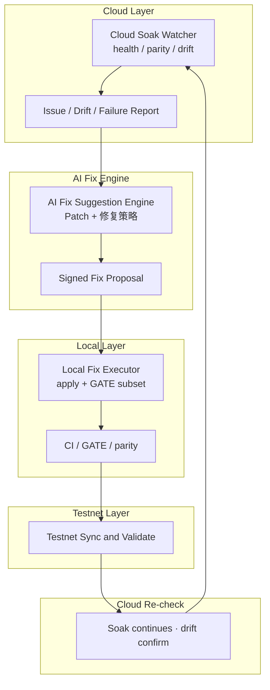

# TT-CLOUD-LOCAL-AI-SELF-HEALING-CI

**System name:** **Cloud-to-Local AI Self-Healing CI System**（云端驱动本地自动修复系统）  
**Status:** **ACTIVE · SSOT**  
**Card:** `TT-CLOUD-LOCAL-AI-SELF-HEALING-CI`  
**阶段口径:** **① 本地 → ② 测试网 → ③ 公网/生产**（须顺序 · **禁止跳阶**）

**核心目标（一句话）：** 云端负责发现问题 + 生成修复建议 + 自动生成 Patch；本地负责安全执行 Patch + 验证 + 回写测试网。

**机读真源:** [`registry/cloud-local-ai-self-healing-ci.v1.yaml`](../../registry/cloud-local-ai-self-healing-ci.v1.yaml)  
**与 Soak 关系:** [`TT-DEPLOYMENT-THREE-STATE-GOVERNANCE`](./TT-DEPLOYMENT-THREE-STATE-GOVERNANCE.md) · Fly `tt-soak-watcher-staging`  
**编排入口:** `bash scripts/ops/run-cloud-local-healing-cycle.sh --help`

> **诚实边界：** 本系统 **≠** ③ Production GO · **≠** AI 直接改生产 · Soak PASS **不**继承生产发布权限。Phase③ 须 **独立 GO gate**。

---

## 0 · 铁律（写死）

| # | 规则 |
|---|------|
| R-01 | **AI 不直接修系统** — 仅输出 **Signed Fix Proposal（Patch）** |
| R-02 | **本地不猜问题** — 仅执行 Cloud 签发的 **Issue Report → Fix Proposal** |
| R-03 | **测试网不开发** — 仅 **Sync Deploy + parity + SSOT alignment** 验证 |
| R-04 | **Fix Deploy 须三态分类** — `DEPLOYMENT_STATE=fix` + `FIX_DEPLOY_LEDGER_ID` + 本地 GATE 子集 exit 0 |
| R-06 | **Soak 升级暂停** — **连续 N 次**（默认 **3**）`TT_CLOUD_LAYER_ISSUE: REPORT` **或** 单次 **P0（severity=critical）** → **自动暂停**云端 Soak · **须 Owner 人工确认** 后 `--resume` 或 `--restart-72h`（见 §0.2） |

---

## 0.1 · 运行态（当前基线 · ACTIVE）

**前置：** 云端 Soak Watcher 已接管 · Healing CI 烟测 PASS · `TT_CLOUD_LAYER_ISSUE: CLEAR`

### Soak 运行 SSOT（写死 · Fly 唯一真源）

| 真源 | 非真源（禁止用于 Soak 有效性裁决） |
|------|-----------------------------------|
| Fly `tt-soak-watcher-staging` · `/data/soak/status.json` | 本地 `job-*/soak.log` 行数 / `pid.txt` |
| 同步后 `evidence/.../cloud-observe/latest.json` | 未 sync 的本地 `ok_polls=0` 占位 |
| Fly `/data/soak/COMPLETED.json`（完成后） | 本地推断 elapsed / remaining |

**只读同步入口（态 A · 定期）：**

```bash
export HTTPS_PROXY=http://127.0.0.1:15715   # 与 testnet sync 同源代理
bash scripts/ops/cloud-local-healing/observe-cloud-soak-readonly.sh
# 或轮询至 COMPLETED → 自动 Phase② 收尾（非 ③ GO）：
bash scripts/ops/p2fc-cloud-soak-orchestrator.sh --watch
```

**attest 消费：** `p2fc-soak-attest.sh` 在存在 `CLOUD-WATCHER.json` 时 **仅**读 `cloud-observe/latest.json` 或 `status.remote.json`；未 sync 则 `MISSING|cloud_ssot_unsynced`。

### 态 A — 只读等待（默认 · **NOW**）

| 允许 | 禁止 |
|------|------|
| Fly `tt-soak-watcher-staging` 探针 · **Fly SSOT** | Fix Deploy · Sync Deploy · redeploy |
| `observe-cloud-soak-readonly.sh` · `p2fc-cloud-soak-orchestrator.sh` | 全量 GATE · site10 重跑 |
| `cloud-detect-and-report.sh`（detect only） | schema / SSOT 结构变更 |
| `run-cloud-local-healing-cycle.sh --ci-local-smoke` | 无 Owner 授权的 Local Executor |

### 态 B — 修复循环（仅当 `TT_CLOUD_LAYER_ISSUE: REPORT`）

**触发：** Cloud Layer 发现 drift/issue（`ISSUE-REPORT.json` · issues.length > 0）

**顺序（写死 · 须 Owner 授权每一步 deploy）：**

```text
Issue Report
    → Agent/Owner 生成 FIX-PROPOSAL.json（schema 校验）
    → Owner 授权
    → local-fix-executor.sh（最小 patch + GATE 子集）
    → testnet-sync-validator.sh（Sync/Fix 三态 + parity）
    → cloud-recheck.sh（TT_CLOUD_LAYER_ISSUE: CLEAR）
    → Soak 只读继续（fail_polls 不增 · SHA aligned）
```

**编排：**

```bash
bash scripts/ops/run-cloud-local-healing-cycle.sh --phase detect    # 确认 REPORT
# Owner 签发 evidence/.../FIX-PROPOSAL.json 后：
bash scripts/ops/run-cloud-local-healing-cycle.sh --phase execute --proposal <path>
DEPLOYMENT_STATE=fix FIX_DEPLOY_LEDGER_ID=<id> \
  bash scripts/ops/run-cloud-local-healing-cycle.sh --phase validate --with-parity
bash scripts/ops/run-cloud-local-healing-cycle.sh --phase recheck
```

**退出条件：** `TT_CLOUD_LAYER_ISSUE: CLEAR` **且** Soak INFLIGHT · fail_polls=0 → 回到 **态 A**

**Phase③：** 修复循环 **不**签发 Production GO — 仍须独立 GO gate。

### Post-Soak · Phase② 收尾（Fly COMPLETED + fail_polls=0 后 · 自动衔接）

**触发：** Fly `/data/soak/COMPLETED.json` 经 `observe-cloud-soak-readonly.sh` 同步至本地 **且** `fail_polls=0`。

**顺序（写死 · Freeze @ SHA 不变 · 非 ③ GO）：**

```text
COMPLETED.json (Fly SSOT)
  → p2fc-post-soak-staging-live-closure-chain.sh
  → Gap Ledger / MR12 / Graduation · Evidence · SSOT · Registry · Matrix · 技术文档同步
  → Phase② Closure 裁决（Admin GO / Production GO 仍 = NO 直至独立闸）
  → Phase③ Production GO Gate（独立 · Soak PASS 不继承）
```

**编排：** `p2fc-cloud-soak-orchestrator.sh --watch` 在检测到 `TT_CLOUD_SOAK_OBSERVE: COMPLETED` 后自动调用 closure chain。

---

## 0.2 · Soak 升级暂停（企业级 · 防抖动 / 防 P0 空耗）

**问题：** 单次 `REPORT` 可能是网络抖动；真正 **P0** 不应继续消耗 72h Soak 窗口。

| 条件 | 动作 |
|------|------|
| **单次 P0**（`severity=critical`：`SOAK-FAIL-POLLS` · `SHA-DRIFT`） | **立即**暂停云端 Soak |
| **连续 N 次 REPORT**（默认 **N=3**，仅 `high` 如 `HEALTH-NON-200` 抖动） | 暂停云端 Soak |
| `TT_CLOUD_LAYER_ISSUE: CLEAR` | 连续计数 **归零** |

**P0 vs 抖动：**

| Issue ID | 级别 | 暂停策略 |
|----------|------|----------|
| `SOAK-FAIL-POLLS` | P0 · critical | 立即暂停 |
| `SHA-DRIFT` | P0 · critical | 立即暂停 |
| `HEALTH-NON-200` | P1 · high | 仅计入连续 REPORT |
| `CHAIN-DRIFT` | P1 · high | 仅计入连续 REPORT |

**暂停后（须 Owner）：**

```bash
# 从暂停点继续（保留 ok_polls 快照）
CLOUD_SOAK_OWNER_ACK=1 bash scripts/ops/cloud-local-healing/cloud-soak-resume-owner-ack.sh --resume

# 或 人工确认后重新开始 72h（ok_polls 归零）
CLOUD_SOAK_OWNER_ACK=1 bash scripts/ops/cloud-local-healing/cloud-soak-resume-owner-ack.sh --restart-72h
```

**证据：** `evidence/P2FC_SOAK_72H_STAGING/SOAK-PAUSED.json` · `evidence/CLOUD_LOCAL_HEALING_CI/issue-report-streak.json`

**环境变量：** `P2FC_CLOUD_ISSUE_REPORT_STREAK_ABORT=3`（可调）

**末行 grep：** `TT_CLOUD_SOAK_PAUSE: ACTIVE` · `TT_CLOUD_SOAK_RESUME: PASS`

**与态 B 关系：** 暂停 **不替代** Fix 循环 — Owner 可先修复再 `--resume` / `--restart-72h`；**重启 72h 须 Owner 明确选择**。

---

## 1 · 整体架构



---

## 2 · 系统分层

### 🟢 Layer 1 — Cloud Layer（发现问题）

**职责：** Soak 监控 · parity · SSOT diff · contract drift · health/web/chain/meta

| 输入 | 输出 |
|------|------|
| Fly `tt-soak-watcher-staging` · staging `/meta` | `evidence/CLOUD_LOCAL_HEALING_CI/issues/<stamp>/ISSUE-REPORT.json` |

**典型 Issue 示例：**

| ID | 描述 |
|----|------|
| `D3-F02` | timeout drift |
| `ITINERARY-52` | city rack delay |
| `BOOK-ESCROW` | booking escrow mismatch |
| `SHA-DRIFT` | git_sha ≠ expect |

**脚本：**

```bash
bash scripts/ops/p2fc-sync-cloud-soak-evidence.sh
bash scripts/ops/cloud-local-healing/cloud-detect-and-report.sh
```

**末行 grep：** `TT_CLOUD_LAYER_ISSUE: REPORT|CLEAR`

---

### 🟡 Layer 2 — AI Fix Engine（生成 Patch）

**职责：** 分析 error pattern · 匹配历史 fix 模式 · 生成 **可执行 Patch**

**本质：** 把错误变成可执行修复 — **不**直接 `git push` 或 fly deploy。

| 输出 | 路径 |
|------|------|
| Signed Fix Proposal | `evidence/CLOUD_LOCAL_HEALING_CI/proposals/<issue-id>/FIX-PROPOSAL.json` |
| Patch 正文 | 同目录 `patch.diff` 或 `fix-<id>.sh` |

**Proposal 示例：**

```diff
- waitForTimeout(60000)
+ waitForSelector("[data-tt-city-ready]")
```

或脚本：`fix-itinerary-52-rack.sh`

**消费方：** Cursor Agent / Owner — 须按 [`registry/artifacts/fix-proposal.v1.schema.json`](../../registry/artifacts/fix-proposal.v1.schema.json) 填写。

**末行 grep：** `TT_AI_FIX_PROPOSAL: READY|REJECTED`

---

### 🔵 Layer 3 — Local Fix Executor（安全执行）

**职责：** apply patch · run GATE **子集** · minimal CI · 确保无回归

| 允许 | 禁止 |
|------|------|
| `git apply` / 项级脚本 | AI 直连 production / staging fly |
| `cargo test -p traveltrust-api` 子集 | 全量 GATE 冒充 ② GO |
| vitest 绿集（受影响域） | 五主路由 UI 回流 |

```bash
export FIX_PROPOSAL_PATH=evidence/CLOUD_LOCAL_HEALING_CI/proposals/D3-F02/FIX-PROPOSAL.json
bash scripts/ops/cloud-local-healing/local-fix-executor.sh --dry-run
bash scripts/ops/cloud-local-healing/local-fix-executor.sh --execute
```

**末行 grep：** `TT_LOCAL_FIX_EXECUTOR: PASS|FAIL|BLOCKED`

---

### 🟣 Layer 4 — Testnet Sync Validator

**职责：** Sync Deploy · parity · SSOT alignment（**仅验证一致性**）

```bash
DEPLOYMENT_STATE=sync TESTNET_FREEZE_OVERRIDE=1 \
  bash scripts/ops/run-deployment-three-state.sh sync --parity
bash scripts/ops/cloud-local-healing/testnet-sync-validator.sh
```

**末行 grep：** `TT_TESTNET_SYNC_VALIDATOR: PASS|PARTIAL|FAIL`

---

### 🔴 Layer 5 — Cloud Re-check（闭环）

**职责：** Soak 继续 · drift 监控 · confirm fix success

```bash
bash scripts/ops/cloud-local-healing/cloud-recheck.sh
```

**成功条件：** Issue `resolved=true` · fail_polls 不增 · SHA aligned · 可选 parity `zero_drift=YES`

**末行 grep：** `TT_CLOUD_RECHECK: PASS|FAIL|INFLIGHT`

---

## 3 · 修复循环（闭环）

```text
Cloud detects issue
        ↓
AI generates patch (Fix Proposal)
        ↓
Local applies patch (Fix Executor)
        ↓
CI / GATE subset runs
        ↓
Testnet sync + validate
        ↓
Cloud re-validates
        ↓
Soak continues
```

**编排（单轮）：**

```bash
bash scripts/ops/run-cloud-local-healing-cycle.sh --issue D3-F02 --phase detect
bash scripts/ops/run-cloud-local-healing-cycle.sh --issue D3-F02 --phase execute --proposal evidence/.../FIX-PROPOSAL.json
bash scripts/ops/run-cloud-local-healing-cycle.sh --issue D3-F02 --phase validate
bash scripts/ops/run-cloud-local-healing-cycle.sh --issue D3-F02 --phase recheck
```

---

## 4 · 与当前 Soak / Freeze 的关系

| 层级 | 功能 | 当前实现 |
|------|------|----------|
| **Soak** | 找问题 | Fly `tt-soak-watcher-staging` + `p2fc-sync-cloud-soak-evidence.sh` |
| **AI Fix Engine** | 生成修复 | Agent 产出 `FIX-PROPOSAL.json`（schema 约束） |
| **Local CI** | 执行修复 | `local-fix-executor.sh` + GATE 子集 |
| **Testnet** | 验证修复 | Deployment 三态 **Sync/Fix** + parity |
| **Cloud Re-check** | 闭环 | `cloud-recheck.sh` · Soak **INFLIGHT 继续** |

**Freeze Candidate @ `3bbedda776b2` + Soak INFLIGHT：**

- Cloud Layer：**持续**只读探针 + Issue 检测  
- Layer 2–4：**仅**在 Owner 签发 Proposal 且非 Soak 禁止窗内执行 Fix  
- Soak 满周期 + fail_polls=0 → **Phase② gap ledger**（18 项）— 与本系统 Fix 循环 **正交**，不得跳过独立 GO gate 进 ③

---

## 5 · CI 系统设计（本地优先 · ①）

| 阶段 | 命令 / 脚本 | 阻断 |
|------|-------------|------|
| L1 detect | `cloud-detect-and-report.sh` | Issue CRITICAL + Soak fail_polls↑ |
| L2 proposal | schema validate `fix-proposal.v1.schema.json` | 无 signature / 无 gates |
| L3 execute | `local-fix-executor.sh` | GATE 子集 FAIL |
| L4 validate | `testnet-sync-validator.sh` | parity PARTIAL |
| L5 recheck | `cloud-recheck.sh` | SHA drift 复现 |

**Pre-push 可选子集（与 [`CONTRIBUTING`](../../CONTRIBUTING.md) 同源）：**

```bash
bash scripts/ops/run-cloud-local-healing-cycle.sh --ci-local-smoke
```

---

## 6 · 证据目录

```text
evidence/CLOUD_LOCAL_HEALING_CI/
  issues/<stamp>/ISSUE-REPORT.json
  proposals/<issue-id>/FIX-PROPOSAL.json
  proposals/<issue-id>/patch.diff
  executions/<stamp>/EXECUTION-RESULT.json
  validations/<stamp>/VALIDATION-RESULT.json
  rechecks/<stamp>/RECHECK-RESULT.json
  cycles/<stamp>/CYCLE-MANIFEST.json
```

---

## 7 · 变更边界

- **禁止**将 Layer 2 改为自动 merge / auto deploy staging（须 Local Executor + 三态 Deploy）  
- **禁止**用本系统窄循环 GO 冒充 Phase② 毕业或 Phase③ Production GO  
- 增删 Layer 须 bump `registry/cloud-local-ai-self-healing-ci.v1.yaml` 与同文档
