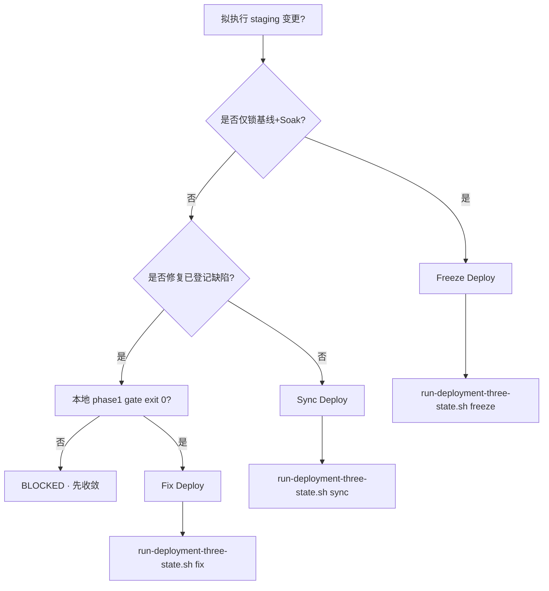

# TT-DEPLOYMENT-THREE-STATE-GOVERNANCE

**Status:** **ACTIVE · SSOT**（Phase **②** staging / testnet 部署分类与执行）  
**Card:** `TT-DEPLOYMENT-THREE-STATE-GOVERNANCE`  
**阶段口径:** **① 本地 → ② 测试网 → ③ 公网/生产**（须顺序 · **禁止跳阶**）  
**生效:** 2026-06-26

**末行 grep（分类闸）:** `TT_DEPLOYMENT_THREE_STATE: PASS state=`  
**机读真源:** [`registry/deployment-three-state.v1.yaml`](../../registry/deployment-three-state.v1.yaml)  
**统一入口:** `bash scripts/ops/run-deployment-three-state.sh <sync|fix|freeze> …`

> **诚实边界：** 本模型 **仅** 约束 **② 测试网 staging 部署分类与证据链**。**≠** ③ Production GO · **≠** 主网合约 broadcast（见 [TT-PHASE2-GOVERNANCE-STACK-SEPOLIA-BROADCAST-CHECKLIST](./TT-PHASE2-GOVERNANCE-STACK-SEPOLIA-BROADCAST-CHECKLIST.md) · Owner-only）。

---

## 0 · 铁律（写死）

| # | 规则 |
|---|------|
| R-01 | **任何** 触达 Fly staging（API / Web / secrets / 镜像）的部署，**必须先** 声明且 **仅** 声明 `sync` \| `fix` \| `freeze` 之一 |
| R-02 | **禁止混合模式**：同一轮不得同时 `--deploy` + `--freeze-soak`；不得 `sync` 态携带 `FIX_DEPLOY_LEDGER_ID`；不得 `freeze` 态触发 fly redeploy |
| R-03 | **禁止无状态部署**：裸跑 `phase2-staging-fly-deploy-and-sync.sh` / `deploy-tt-web-staging.sh` **无** `DEPLOYMENT_STATE` → **BLOCKED** |
| R-04 | **Freeze 不等于 Deploy**：`freeze` 仅锁定基线 + 72h 只读 Soak；**零** 镜像 / migration / config 变更 |
| R-05 | **Sync 不改变业务语义**：仅版本 SHA + env/registry 对齐；**禁止** 夹带新功能或行为分叉 |
| R-06 | **Fix 须 P0/P1 收敛**：ledger 项 **本地 phase1 闸 exit 0** 后，方可在 ② 执行 overlay deploy |

**与既有 SSOT 关系（收敛 · 不替代）：**

| 文档 / 脚本 | 角色 |
|-------------|------|
| [PHASE2-LOCAL-STAGING-PARITY-LOOP](./PHASE2-LOCAL-STAGING-PARITY-LOOP.md) S5 | 推 staging 六步闭环 · **须** 经本模型分类 |
| [run-testnet-sync-package.sh](../../scripts/ops/run-testnet-sync-package.sh) | **Sync / Freeze** 编排真源 |
| [TT-PHASE2-TESTNET-CLOSURE-GOVERNANCE-STANDARD](./TT-PHASE2-TESTNET-CLOSURE-GOVERNANCE-STANDARD.md) | ② 毕业总标准 · Soak / 签字闸 |
| **本文** | **部署三态分类 + 混合禁止 + 证据 stamp** |

---

## 1 · 三态定义

### 1.1 Sync Deploy（同步部署）

**用途：** 本地 HEAD 与 **② staging** 基线对齐 — **仅** 覆盖版本与配置一致性，**不改变**已冻结的业务逻辑语义。

| 维度 | 允许 | 禁止 |
|------|------|------|
| Fly API/Web | overlay 重建镜像 · forward migration on boot | DB wipe · 测试网重建 · 全量 GATE 重跑 |
| Env / SSOT | Sepolia merge · registry validate · fly secrets（无 PRIVATE_KEY） | 新 feature flag 语义变更 · 五主路由 UI 结构变更 |
| 数据 | 保留 staging PG | schema 破坏性 migration（除非 Fix 态单独立项） |
| 阶段 | **②** | ③ 生产 · 主网 broadcast |

**前置（AND）：**

- GATE-P1-01 = 25/25 + `phase1.closed.json`（**不重跑** site10 全链）
- `TESTNET_FREEZE_OVERRIDE=1`（若 `TESTNET_STAGING_FREEZE/ACTIVE.json` 存在）
- 工作区 deploy 路径干净（`crates/` `frontend/` `deploy/` `registry/`）或 `--allow-dirty` **仅 Owner 书面授权**

**典型编排：**

```bash
bash scripts/ops/run-deployment-three-state.sh sync --preflight
TESTNET_FREEZE_OVERRIDE=1 bash scripts/ops/run-deployment-three-state.sh sync --through-parity
```

**证据：** `evidence/TESTNET_SYNC_PACKAGE/<stamp>/` · `deploy-complete.json` · `parity.json`

---

### 1.2 Fix Deploy（修复部署）

**用途：** 在 **受控 ② 环境** 修复 **已确认的系统级缺陷** — 缺陷须 ledger 登记、本地收敛已闭。

| 维度 | 允许 | 禁止 |
|------|------|------|
| 代码 | 针对 ledger 项的最小 diff | 新行为分叉 · 扩 scope · 五主 UI 回流 |
| 验证 | 项级 phase1 gate exit 0 → staging overlay → parity → 人工 spot-check | 跳过本地收敛直接推 staging |
| 混合 | — | 与 Sync 同轮 · 与 Freeze 同轮 |

**前置（AND）：**

- `FIX_DEPLOY_LEDGER_ID=<id>`（如 `BOOK-P0-04`）— 见 [`complexity-convergence-fix-ledger.v1.yaml`](../../registry/complexity-convergence-fix-ledger.v1.yaml)
- 该项 `phase1.gate` **本地 exit 0**（脚本自动执行或 `FIX_DEPLOY_LOCAL_GATE_PASS=1` + 证据路径）
- 项 status ∈ `{phase1_closed, closed}` 或本轮收敛后机读确认
- `TESTNET_FREEZE_OVERRIDE=1`（冻结态下）
- **禁止** 在 open P0/P1 **未收敛项** 上宣称 Fix Deploy 完成

**典型编排：**

```bash
FIX_DEPLOY_LEDGER_ID=BOOK-P0-04 \
  TESTNET_FREEZE_OVERRIDE=1 \
  bash scripts/ops/run-deployment-three-state.sh fix --deploy --parity
```

**证据：** `evidence/DEPLOYMENT_THREE_STATE/<stamp>/classification.json` + ledger 项 `evidence/` 目录

---

### 1.3 Freeze Deploy（冻结部署）

**用途：** 锁定 **GATE-P1-01 + TESTNET_SYNC_PACKAGE_PARITY + zero_drift** 稳定态，进入 **72h Soak**（**只读探针**）。

| 维度 | 允许 | 禁止 |
|------|------|------|
| 运行时 | `engage-testnet-staging-baseline-freeze.sh` · `p2fc-launch-staging-soak-72h.sh` | **任何** fly redeploy / restart / migration / config change |
| 探针 | `p2fc-soak-attest.sh` · meta/health 只读 | 全量 GATE · site10 25-spec 重跑 · 测试网重建 |
| SSOT | Freeze Candidate manifest 写入 | SSOT 结构变更 · 04/93 契约扩面 |

**前置（AND）：**

- GATE-P1-01 = 25/25 + phase1_closed
- `TESTNET_SYNC_PACKAGE` parity **`zero_drift=YES`** · `sha_hard_match=true`
- 人工验证 Booking Core + Itinerary **PASS** → `TESTNET_MANUAL_VERIFY_PASS=1`
- staging SHA = local HEAD（硬匹配）

**典型编排：**

```bash
export TESTNET_MANUAL_VERIFY_PASS=1
bash scripts/ops/run-deployment-three-state.sh freeze --freeze-soak
# 观察（只读）
P2FC_SOAK_DIR=evidence/P2FC_SOAK_72H_STAGING bash scripts/ops/p2fc-soak-attest.sh
```

**证据：** `evidence/TESTNET_STAGING_FREEZE/ACTIVE.json` · `evidence/P2FC_SOAK_72H_STAGING/job-*/` · `freeze-soak-complete.json`

---

## 2 · 判定流程（必须先分类）



**混合模式示例（一律 BLOCKED）：**

| 组合 | 原因 |
|------|------|
| `sync` + `FIX_DEPLOY_LEDGER_ID` | Sync 不得夹带修复语义 |
| `fix` + 无 ledger id | Fix 须可追溯缺陷项 |
| `freeze` + `--deploy` / fly 脚本 | Freeze 零 redeploy |
| 同轮 `sync --through-parity` + `freeze --freeze-soak` | 须分两轮、分 stamp |

---

## 3 · 环境变量与分类证据

| 变量 | 态 | 含义 |
|------|-----|------|
| `DEPLOYMENT_STATE` | 全部 | `sync` \| `fix` \| `freeze`（统一入口自动设置） |
| `TESTNET_FREEZE_OVERRIDE` | sync/fix | .lift ACTIVE freeze 后允许 overlay |
| `FIX_DEPLOY_LEDGER_ID` | fix | ledger 项 id（必填） |
| `FIX_DEPLOY_LOCAL_GATE_PASS` | fix | Owner 跳过自动 gate（须附证据路径） |
| `TESTNET_MANUAL_VERIFY_PASS` | freeze | 人工清单已完成 |
| `TESTNET_SYNC_EXPECT_SHA` | freeze | 可选 SHA 硬闸 |

**分类 stamp：** 每轮写入 `evidence/DEPLOYMENT_THREE_STATE/<stamp>/classification.json`

---

## 4 · 与 Phase ①→②→③ 映射

| 阶段 | 允许的部署态 | 说明 |
|------|-------------|------|
| **① 本地** | —（无 Fly deploy） | P0/P1 收敛 · GATE-P1-01 · 绿集 |
| **② 测试网** | **Sync · Fix · Freeze** | 本文 SSOT |
| **③ 生产** | **另闸** | `go-live-checklist` · PSP live · 主网 — **禁止** 用 ② Sync 冒充 ③ GO |

---

## 5 · 审计命令

```bash
# 分类 + 执行（推荐唯一入口）
bash scripts/ops/run-deployment-three-state.sh --help

# 只验证分类闸（不 deploy）
DEPLOYMENT_STATE=sync bash scripts/ops/lib/deployment-three-state-lib.sh assert-only

# 末行须含
# TT_DEPLOYMENT_THREE_STATE: PASS state=sync|fix|freeze
```

---

## 6 · 云端 Soak Watcher（② · 独立 Fly 服务）

本地 72h worker 可 **迁移** 至 `tt-soak-watcher-staging`（**不** redeploy staging API/Web）：

```bash
bash scripts/ops/p2fc-migrate-soak-to-cloud-watcher.sh --preflight
bash scripts/ops/p2fc-migrate-soak-to-cloud-watcher.sh --execute
bash scripts/ops/p2fc-cloud-soak-orchestrator.sh --watch
```

| 组件 | 角色 |
|------|------|
| Fly `tt-soak-watcher-staging` | health/web/chain/meta 只读探针 · fail_polls · SHA 一致性 |
| `p2fc-sync-cloud-soak-evidence.sh` | 证据回传 → 本地 `evidence/P2FC_SOAK_72H_STAGING/` |
| `p2fc-cloud-soak-orchestrator.sh` | COMPLETED + fail_polls=0 → Phase② gap ledger 链 |
| Phase③ | **独立 GO gate** — Soak **不**继承 Production GO |

Soak 期间仍 **禁止** staging Sync/Fix redeploy · schema/SSOT/GATE 操作。

**Cloud-to-Local AI Self-Healing CI：** 见 [TT-CLOUD-LOCAL-AI-SELF-HEALING-CI](./TT-CLOUD-LOCAL-AI-SELF-HEALING-CI.md) — Cloud Layer 在 Soak INFLIGHT 可 detect；Fix 循环须 Proposal + Local Executor + 三态 Deploy。

---

## 7 · 变更边界

- 增删部署态 **禁止** — 仅 `sync|fix|freeze` 三态
- 动 fly 底层脚本须保持 `deployment-three-state-lib.sh` 硬闸
- ③ 生产部署须 **单独立项** runbook — **不得** 扩写为本文件第四态
