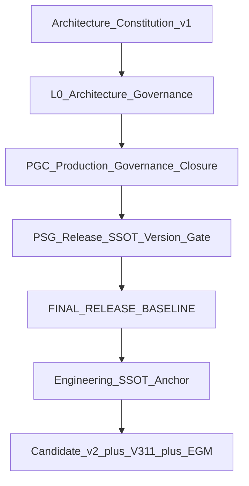

# TT · FINAL RELEASE · 系统总架构视图（PSG 最高锚）

**STATUS:** LIVING under FINAL RELEASE BASELINE · **≠** GO  
**唯一体系：** Candidate v2 + V3.1.1 Final + PSG-EGM Final  
**Pin / Tip：** `PSG-REL-20260720-WEB3-CAND-V2` @ `97289a718561…`  
**同读：** [FINAL RELEASE BASELINE](./TT-FINAL-RELEASE-BASELINE-LATEST.md) · [Engineering SSOT Anchor](./TT-ENGINEERING-SSOT-ANCHOR-LATEST.md) · [Candidate v2](./TT-WEB3-CANDIDATE-V2-LATEST.md)

> 本图描述 **现行唯一释放体系**。旧 Capability 硬门图 [`TT-PSG-FULL-ARCHITECTURE-LATEST`](./TT-PSG-FULL-ARCHITECTURE-LATEST.md)（FROZEN v6）仍为历史 Capability 地图；**新流不以该图覆盖本唯一 tip/pin**。

---

## A · 治理栈（上 → 下）



| 层 | SSOT | 机器键 |
|----|------|--------|
| Constitution | `docs/governance/TT-ARCHITECTURE-CONSTITUTION-v1.md` | `TT_ARCHITECTURE_CONSTITUTION_V1` |
| L0 | `docs/governance/TT-L0-ARCHITECTURE-GOVERNANCE.md` | — |
| PGC | `docs/runbook/TT-PRODUCTION-GOVERNANCE-CLOSURE.md` | `TT_PRODUCTION_GOVERNANCE_CLOSURE` |
| PSG Release SSOT | `registry/psg-release-source-of-truth.v1.yaml` | `TT_PSG_RELEASE_SSOT` |
| FINAL RELEASE | `registry/final-release-baseline.v1.yaml` | `TT_FINAL_RELEASE_BASELINE` |
| Engineering Anchor | `registry/engineering-ssot-anchor.v1.yaml` | `TT_ENGINEERING_SSOT_ANCHOR` |

---

## B · 唯一三基线（不可分叉 ACTIVE）


| 基线 | Human | Machine | 状态 |
|------|-------|---------|------|
| Candidate v2 | `TT-WEB3-CANDIDATE-V2-LATEST.md` | `registry/web3-candidate-v2.v1.yaml` | ACTIVE Web3 mainline |
| V3.1.1 Final | `TT-ECONOMIC-CONSTITUTION-V3.1.1-FINAL.md` | `registry/traveltrust-economic-constitution-v3.1.v1.yaml` | LOCKED Target |
| PSG-EGM Final | `TT-EGM-MASTER.md` | `registry/economic-governance/egm-baseline.yaml` | CLOSED_AS_FRAMEWORK_DESIGN · evidence WAIT |

**禁止 ACTIVE：** `STAGING-ALIGN-W0` · FG-15-A living · V3.1（无 .1）· Reality W0–W7 当释放主链 · `gov_freeze_v2_clean_baseline` 当 money-path ACTIVE。

---

## C · 工程实体 ↔ 八轴 / 七轴

| 工程实体 | FINAL 八轴 | Version Gate 七轴 | 绑定入口 |
|----------|------------|-------------------|----------|
| Git | local_git | git_sha | HEAD == ACTIVE tip |
| Web 镜像 | web_image | artifact/runtime | bake + `/api/release-identity` |
| API 镜像 | api_image | runtime | `/meta` build |
| Runtime 证言 | runtime_meta | attestation | `attestation_status=ok` |
| Contract | （profile） | contract_bytecode_pin | `v311_fund_safety_candidate_v2` |
| DB | （baseline） | database_baseline | Staging RC SSOT |
| Migration | （checksum） | — | LF + ledger match |
| Registry | registry_active | — | `psg-release-version-LATEST` |
| Evidence | evidence | evidence_bundle_sha | `GO_web3_candidate_v2` |
| Docs | psg_pin cites | — | FINAL + Cand + V3.1.1 + EGM |
| Release Identity | release_identity | — | Evidence JSON + bake |

---

## D · 任务链（冻结后一枪 · 再进阶）

```text
① 污染清理 + Engineering Anchor 绑定   ← 本轮
② FINAL RELEASE freeze_status=FROZEN   ← Exit Criteria（含 worktree）
③ 认证套件一枪：
     FG-15-B ELAPSED（证据已开闸 · Registry 对齐）
     → Project A
     → PSG Recalculate / Inventory / Delta
     → Reality Closure
     → Staging-grade GO 判定
④ 另闸：Production Cert → Entry → Production GO
```

**诚实：** ① ≠ ② ≠ ③ ≠ ④ · 禁止跳阶 · 禁止用 Staging-grade 冒充 Production GO。

---

## E · 污染清理原则

1. **默认值**（API/Web/Dockerfile/gates）必须落在 Candidate pin + tip  
2. **Registry** FG-15-B / freeze tip 与证据 ELAPSED 一致  
3. **脚本** `run-fg15-*` / `mint-staging-align-w0` = DEPRECATED / historical-only  
4. **旧包** 可留档，不可作 ACTIVE 入口  
5. **脏 worktree** 不得 bake 进 Certification 镜像（Web 重钉须 tip 树）

---

## 诚实边界

总架构视图 ≠ 已冻结 ≠ 已认证 ≠ Staging-grade GO ≠ Production GO。
