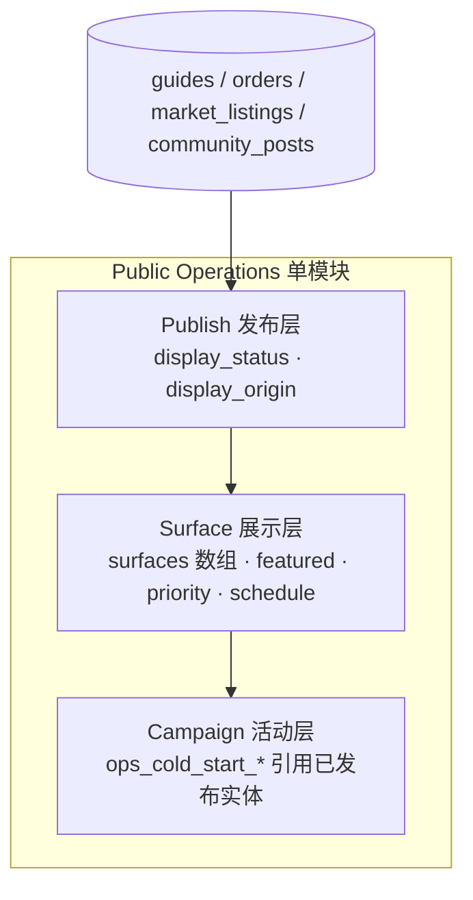

# TT-OFFICIAL-OPS-PUBLIC-OPERATIONS-SSOT

**Version:** 1.0.4 · **生效：** 2026-07-01  
**状态：** **架构 STABLE** · **MVP COMPLETE** · **企业级运营能力 → Official Ops 1.1/1.2**（非「Public Operations 已全部完成」）  
**域冻结：** 见 [`TT-OFFICIAL-OPS-CAPABILITY-MATRIX.md`](TT-OFFICIAL-OPS-CAPABILITY-MATRIX.md) · [`registry/official-ops-domain.v1.yaml`](../../registry/official-ops-domain.v1.yaml)  
**阶段口径：** ① 本地 → ② Staging → ③ Production（与 [`TT-ALIGNMENT-AUDIT-EXPECTED-DIFFERENCE-POLICY.md`](TT-ALIGNMENT-AUDIT-EXPECTED-DIFFERENCE-POLICY.md) 对齐）

**一句话：** **Official Ops → Public Operations** 是 TravelTrust **市场/社区/交易类**公众展示运营的 SSOT；**Content Center** 是 **catalog/media 内容资产**的 SSOT（§2.3）。**不**新增 `showcase_registry`、**不**复制实体；Staging/Production 公众读面 **不**以 env 种子、前端 Mock、Smoke 写入为数据源。

### 产品登记（Phase 0+1 冻结 · 收口点）

| 项 | 值 |
|----|-----|
| **模块** | Public Operations（公众运营） |
| **Architecture** | **STABLE**（槽位已规划 · 后续只填功能） |
| **MVP Status** | **COMPLETE** |
| **Version** | **v1.0** |
| **Scope** | **MVP 基线**（止血 + 只读可观测 · 历史称 Phase 0+1） |
| **Next Feature Level** | **STANDARD**（post Production GO · `display_*` · Publish/Surface） |
| **设计纪律** | 本版 SSOT 与 Admin 路由 **不再推翻**；后续仅在同一模块上增强（Statistics → Publish/Surface/Campaign） |
| **域归属** | **Official Ops 1.0**（`TT_OFFICIAL_OPS_STATUS: STABLE`） |
| **当前主轨** | **[Production Readiness Review → Production GO](PHASE3-PRODUCTION-PREPARATION.md)** |


### 完成度双轨（Roadmap · 非缺陷）

| 口径 | 完成度 | 含义 | 挡 Production GO？ |
|------|--------|------|-------------------|
| **MVP（Phase 0+1）** | **100%** | Statistics · `data_origin` · TEST 规范 · ②③ 禁 mock 作公众数据源 | **否**（已 PASS） |
| **全愿景（Publish→Surface→Campaign→Policy）** | **~40%** | 路线图演进；矩阵精算 **38%** | **否** — **ROADMAP_NOT_DEFECT** |


### 必须具备 vs 必须现在做

企业级终态**必须具备** Publish/Featured/背景图 UI 等能力；**不**等于 PI3 前**必须现在做**。详见 [`TT-OFFICIAL-OPS-ENTERPRISE-ROADMAP.md`](TT-OFFICIAL-OPS-ENTERPRISE-ROADMAP.md)。

**纪律：** 用「全愿景 ~40%」描述 **Roadmap 进度**；**禁止**写成 Admin 缺口或 Production 阻断项。MVP 已 **FROZEN** · 增强归属 **Official Ops 1.1+** · **post Production GO**。

**Feature Level 路线图（post Production GO · 非发版前工作）：**

| Level | 内容 | 状态 |
|-------|------|------|
| **MVP** | Statistics · `data_origin` · TEST 规范 | **✅ 100%** · FROZEN |
| **STANDARD** | `display_*` · Publish · Featured · Priority · Surface | **DEFERRED** |
| **ADVANCED** | Campaign 合并 · Schedule · 推荐池 | **DEFERRED** |
| **ENTERPRISE** | Production Policy · Show Test Data · 三环境硬化 | **DEFERRED** |

三维度状态真源：[`TT-TRAVELTRUST-THREE-DIMENSION-STATUS-SSOT.md`](TT-TRAVELTRUST-THREE-DIMENSION-STATUS-SSOT.md)

---

## 0 · 机读键

```text
TT_PUBLIC_DISPLAY_SSOT: OFFICIAL_OPS
TT_PUBLIC_DISPLAY_MODULE: public_operations
TT_PUBLIC_DISPLAY_ADMIN_ROUTE: /admin/official/public-operations
TT_PUBLIC_DISPLAY_LOGIC_LAYERS: publish,surface,campaign
TT_PUBLIC_DISPLAY_REGISTRY: registry/public-operations-mvp.v1.yaml
TT_PUBLIC_DISPLAY_MERGE_COLD_START_UI: true
TT_PUBLIC_DISPLAY_ENTITY_DUPLICATION: FORBIDDEN
TT_PUBLIC_DISPLAY_STAGING_PROD_DATA_SOURCE: ADMIN_POLICY_AND_DB_ONLY
TT_PUBLIC_DISPLAY_MVP_COMPLETION_PERCENT: 100
TT_PUBLIC_DISPLAY_FULL_VISION_COMPLETION_PERCENT: 40
TT_PUBLIC_DISPLAY_FULL_VISION_MATRIX_CALCULATED_PERCENT: 38
TT_PUBLIC_DISPLAY_VISION_GAP_CLASSIFICATION: ROADMAP_NOT_DEFECT
TT_PUBLIC_DISPLAY_PHASE0_1: PASS
TT_PUBLIC_DISPLAY_STATUS: MVP_COMPLETE
TT_PUBLIC_DISPLAY_VERSION: v1.0
TT_PUBLIC_DISPLAY_FROZEN: true
TT_PUBLIC_DISPLAY_DEV_FROZEN: true
TT_PUBLIC_DISPLAY_DEFER_UNTIL: PRODUCTION_GO
TT_PUBLIC_DISPLAY_ACTIVE_PROGRAM: PHASE3_PRODUCTION_READINESS
TT_PUBLIC_OPERATIONS_ARCHITECTURE: STABLE
TT_PUBLIC_OPERATIONS_MVP: COMPLETE
TT_PUBLIC_OPERATIONS_ENTERPRISE_OPS: DEFERRED_POST_GO
TT_OFFICIAL_OPS_ENTERPRISE_ROADMAP: docs/runbook/TT-OFFICIAL-OPS-ENTERPRISE-ROADMAP.md
TT_PUBLIC_DISPLAY_FEATURE_LEVEL: MVP
TT_PUBLIC_DISPLAY_FEATURE_LEVEL_NEXT: STANDARD
TT_PUBLIC_DISPLAY_FEATURE_LEVEL_ROADMAP: MVP,STANDARD,ADVANCED,ENTERPRISE
TT_THREE_DIMENSION_STATUS_SSOT: ACTIVE
TT_PUBLIC_DISPLAY_CONTENT_CENTER_BOUNDARY: ACTIVE
TT_CATALOG_MEDIA_SSOT: CONTENT_CENTER
TT_OFFICIAL_OPS_CAPABILITY_MATRIX: ACTIVE
TT_OFFICIAL_OPS_CAPABILITY_MATRIX_DOC: docs/runbook/TT-OFFICIAL-OPS-CAPABILITY-MATRIX.md
TT_OFFICIAL_OPS_STATUS: STABLE
TT_OFFICIAL_OPS_VERSION: 1.0
TT_OFFICIAL_OPS_ARCHITECTURE: FROZEN
TT_OFFICIAL_OPS_DOMAIN_REGISTRY: registry/official-ops-domain.v1.yaml
```

**命名澄清：** 本 SSOT 范围是 **Official Ops · Public Operations（公众运营展示）**；**不是** Catalog/POI 媒体资产 SSOT（见 §2.4）。

**Gate（Phase 0+1 闭合后）：** `bash scripts/gates/check-official-ops-public-operations-ssot.sh`

---

## 1 · 治理原则（写死）

| # | 原则 | 说明 |
|---|------|------|
| P1 | **唯一 SSOT（本域）** | **市场/社区/交易展示**治理路径：`Admin → Official Ops → Public Operations`（**不含** catalog POI/背景图） |
| P2 | **不新表复制实体** | 禁止 `showcase_registry` 及任何「展示用 Guide 副本」 |
| P3 | **一模块一界面** | Public Surface 与 Cold Start **菜单合并**为 Public Operations；逻辑仍分 Publish → Surface → Campaign |
| P4 | **实体即数据** | `guides` · `orders` · `market_listings` · `community_posts` 等 **已有行** 挂统一 `display_*` 元数据 |
| P5 | **②③ 不用 env/mock/smoke 作公众数据源** | 本地开发可用；Staging/Production 公众读面仅 `display_status` + policy |
| P6 | **不新增业务流程** | Phase 0–1 仅止血、可观测、标签；不改 Escrow/订单状态机/支付/治理执行 |
| P7 | **不破坏已闭 Gate** | 不得导致 `TT_TESTNET_SIGNOFF` · `PHASE3_PRODUCTION_CONVERGENCE` · UAT 矩阵 **回退** |
| P8 | **与 Content Center 分域** | POI 图 · Landing 背景 · 国家/城市/景区目录 **不得**迁入 Public Operations；见 §2.4 |

**互指（勿分叉）：**

| 文档 | 用途 |
|------|------|
| [`101-CMS与内容运营中心实施蓝图.md`](../handbook/engineering/101-CMS与内容运营中心实施蓝图.md) | **Content Center** · catalog/media 资产 SSOT |
| [`116-S3-W5-POI-Media-Catalog-Report.md`](../handbook/engineering/116-S3-W5-POI-Media-Catalog-Report.md) | POI 图读链路 · `GET /catalog/poi-images` |
| [`TT-ALIGNMENT-AUDIT-EXPECTED-DIFFERENCE-POLICY.md`](TT-ALIGNMENT-AUDIT-EXPECTED-DIFFERENCE-POLICY.md) | Expected Difference vs Drift |
| [`104-Admin-Coverage-Gap-Report.md`](../handbook/engineering/104-Admin-Coverage-Gap-Report.md) §1.8–1.10 | Admin 缺口基线 |
| [`scripts/dev/start-api-with-seed-README.md`](../../scripts/dev/start-api-with-seed-README.md) | ① 本地 `MARKET_CLEAN` · seed 栈 |
| [`registry/test-accounts-business-immutable.v1.yaml`](../../registry/test-accounts-business-immutable.v1.yaml) | C1–C4 · E1 · E2 测试账号 |
| [`frontend/lib/admin/officialOpsL5.ts`](../../frontend/lib/admin/officialOpsL5.ts) | 冷启动 surface 选项 SSOT（迁移前） |
| [`TT-OFFICIAL-OPS-CAPABILITY-MATRIX.md`](TT-OFFICIAL-OPS-CAPABILITY-MATRIX.md) | **Production Review 能力矩阵**（完成度 · 阻断 · post-GO） |
| [`PHASE3-PRODUCTION-PREPARATION.md`](PHASE3-PRODUCTION-PREPARATION.md) | **当前主轨** · Production GO |

## 2 · Admin 架构

### 2.1 模块命名

| 项 | 值 |
|----|-----|
| **产品名（中文）** | 公众运营 |
| **产品名（英文）** | Public Operations |
| **所属** | Official Ops（官方运营） |
| **Admin 路由** | `/admin/official/public-operations` |
| **侧栏 key（规划）** | `admin_shell_nav_official_public_operations` |
| **替代/合并** | 原独立「Public Surface」与「Cold Start」**顶级菜单**；Cold Start 能力收入本模块 **Campaign** 子区 |

### 2.2 Admin 双平面（目标态 · 勿混域）

Public Operations **不是**全站唯一 Admin；与 **Content Center** 并列，各管一类公众可见数据：

```text
Admin
 ├── Content Center（catalog / media 内容资产 SSOT）
 │    ├── POI Images              /admin/content/poi-images
 │    ├── Landing Ambient         /admin/content/landing-ambient
 │    ├── Countries / Cities / POIs
 │    ├── Media Assets            /admin/content/media-assets
 │    └── Publish Queue / Catalog Dashboard …
 │
 └── Official Ops（市场/社区/交易 公众运营展示 SSOT）
      ├── Public Operations       /admin/official/public-operations
      │    ├── Guides / Orders / Listings
      │    ├── Community / DID / Acquisition
      │    ├── Campaign（含原 Cold Start）
      │    └── Statistics
      ├── Official Accounts
      ├── Official Guides
      └── Itinerary Templates
```

侧栏 SSOT：**`content`** 组 → [`adminShellContentNavLinks.ts`](../../frontend/lib/admin/adminShellContentNavLinks.ts)；**`official_ops`** 组 → [`adminShellOfficialOpsNavLinks.ts`](../../frontend/lib/admin/adminShellOfficialOpsNavLinks.ts)。

### 2.3 与 Content Center 的边界（写死）

| 平面 | SSOT | Admin 根 | 管什么 |
|------|------|----------|--------|
| **Content Center** | **catalog / media 内容资产** | `/admin/content` | 国家 · 城市 · 景区 POI · **POI 图片** · **Landing 氛围/背景图** · 媒体资源 · 定价 · 交通 |
| **Public Operations** | **市场/社区/交易 公众运营展示** | `/admin/official/public-operations` | 向导 · discover 订单 · 商家/收购 listing · 社区推荐 · Campaign · Featured · Priority |

**边界纪律：**

1. **POI 图片、Landing 背景、国家/城市/景区目录不得迁入 Public Operations。** 继续在 Content Center 管理（发布路径：`POST …/poi-image-batches/:id/publish` 等；公众读：`GET /api/v1/catalog/poi-images`）。
2. **Public Operations 可以引用已发布内容资产**（例如在行程/市场卡片中展示某 POI 的 `image_url`），但 **不负责** 上传、审核、发布或替换 catalog 媒体本身。
3. **禁止** 为「统一运营」而把 `catalog_*` 表或 POI 图 workflow 合并进 `ops_*` / `display_*` 模型。
4. **禁止** 在 Public Operations 中复制 POI/背景图为 `showcase_registry` 或第二份 Guide 行。
5. 对齐审计时：**CMS 与 Public Operations 差异** = 两平面 **预期分域**（`CONFIRM_DESIGN`），**非** Drift。

**典型对照（运营问路）：**

| 运营意图 | 去哪个后台 |
|----------|------------|
| 换西湖景区卡片图 | Content Center → **POI Images** → Publish |
| 换某国首页氛围背景 | Content Center → **Landing Ambient** |
| 把杭州向导推荐到自由市场 | Official Ops → **Public Operations** → Guides · Market surface |
| 国庆冷启动专题编排 | Official Ops → **Public Operations** → Campaign |

### 2.4 逻辑三层（概念不合并，UI 合并）



| 层 | 运营问题 | 典型字段 / 表 |
|----|----------|----------------|
| **Publish** | 这条内容能不能上线？ | `display_status` · `display_origin` |
| **Surface** | 出现在哪些公众版面？排第几？ | `surfaces[]` · `featured` · `display_priority` · `display_start_at` / `display_end_at` |
| **Campaign** | 某次冷启动/专题如何编排？ | `ops_cold_start_campaigns` · `ops_cold_start_items` → **引用** 已 Publish 实体 |

**运营编辑目标态（Phase 3 · 单页示例）：**

```text
Guide A
  Published ☑
  Surface:  ☑ Homepage  ☑ Market  ☐ Community
  Featured ☑   Priority 95
  Schedule: 2026-07-01 — 2026-12-31
  [可选] Campaign: 国庆杭州专题
  → 保存
```

---

## 3 · 数据模型

### 3.1 禁止项

- **禁止** `showcase_registry` 或任何「展示专用实体副本表」
- **禁止** 为规范化而复制 `Guide` / `Order` / `Listing` / `Post` 行

### 3.2 统一展示元数据（Phase 2 迁移 · 规划）

在下列 **已有表** 增加同构列（命名 SSOT）：

| 字段 | 类型 | 说明 |
|------|------|------|
| `display_status` | `TEXT` | `draft` · `published` · `hidden` · `archived` |
| `display_origin` | `TEXT` | 见 §3.3 |
| `featured` | `BOOLEAN` | 精选（`ops_official_guide_posts` **已有** · 对齐语义） |
| `display_priority` | `INT` | 越大越靠前 · 默认 `0` |
| `display_surfaces` | `TEXT[]` | 公众版面 SSOT · 见 §3.4 |
| `display_region` | `TEXT` | 可选 · 城市/区域槽位键 · 如 `hangzhou_walking` |
| `display_start_at` | `TIMESTAMPTZ` | 可选 · 定时上线 |
| `display_end_at` | `TIMESTAMPTZ` | 可选 · 定时下线 |
| `display_source` | `TEXT` | 审计 · 如 `admin:{user_id}` · `seed:market_showcase` · `smoke:p2` |
| `campaign_id` | `UUID` | 可选 · FK → `ops_cold_start_campaigns.id` |

**首批实体表：**

| 实体 | PostgreSQL 表 | 公众读面 |
|------|---------------|----------|
| 向导 | `guides` | `GET /api/v1/guides` · `/market?view=guides` |
| 订单 | `orders` | `GET /api/v1/discover/orders` · `/market` |
| 商家/收购 listing | `market_listings` | `/market/provider` · `/market/acquisition` |
| 社区帖 | `community_posts` | `/community` feed |
| 官方攻略 | `ops_official_guide_posts` | 经 `community_post_id` 或官方流 |

**过渡期：** 公众过滤与 Admin 统计在 Phase 0–1 仍可读 legacy **`data_origin`**（`production` · `test` · `demo` · `official_seed`）；Phase 2 起 **`display_origin`** 为读面 SSOT，`data_origin` 保留兼容一版。

### 3.3 `display_origin` 枚举（SSOT）

| 值 | 含义 | 典型来源 |
|----|------|----------|
| `REAL` | 真实用户/商家产生 | 注册向导 · 商家上架 |
| `OFFICIAL` | Official Ops 写入 | `ops_official_*` · 运营后台发布 |
| `SHOWCASE` | 官方展示种子 | 原 `market-showcase-*@example.com` |
| `TEST` | 测试账号 | `@test.com` · C1–C4 · E2 |
| `SMOKE` | 烟测/矩阵脚本 | R003 · P2 smoke · landing smoke |
| `SYSTEM` | 系统回填/迁移 | migration backfill · 缺省注入 |

**自 `data_origin` 回填映射（Phase 2 一次性）：**

| legacy `data_origin` | → `display_origin` |
|----------------------|---------------------|
| `production`（非 showcase 启发式） | `REAL` |
| `official_seed` | `OFFICIAL` |
| showcase 固定邮箱种子 | `SHOWCASE` |
| `test` | `TEST` |
| `demo` | `SHOWCASE` 或 `SMOKE`（按启发式审计） |

### 3.4 `display_surfaces[]` 与 Cold Start `surfaces` 对齐

**公众版面（实体级 `display_surfaces` · 规划）：**

| ID | 公众面 |
|----|--------|
| `home_hero` | 首页 Hero / 推荐 |
| `market_feed` | 自由市场主站 `/market` |
| `community_feed` | TT 社区 feed |
| `landing_promo` | 落地页 promo |
| `did_rank` | DID 排行榜（规划） |
| `market_provider` | 商家子站 |
| `market_acquisition` | 收购子站 |

**与现有代码对齐：** [`frontend/lib/admin/officialOpsL5.ts`](../../frontend/lib/admin/officialOpsL5.ts) 中 `OFFICIAL_COLD_START_SURFACE_OPTIONS` 为 **Campaign 层** surface 下拉 SSOT；Phase 2 起 **实体 `display_surfaces`** 与之间 **同名**，避免两套词汇。

### 3.5 公众读面统一谓词（Phase 2+ · 目标）

```text
可见当且仅当：
  display_status = 'published'
  AND display_origin NOT IN (policy.blocked_origins)   -- Production 默认含 SMOKE
  AND (display_origin != 'TEST' OR policy.show_test_data)
  AND (display_end_at IS NULL OR display_end_at > now())
  AND (display_start_at IS NULL OR display_start_at <= now())
  AND surface 匹配当前读面（如 'market_feed' = ANY(display_surfaces)）
排序：
  featured DESC, display_priority DESC, created_at DESC
```

**禁止（②③）：** 用 `TRAVELTRUST_MARKET_PUBLIC_SHOWCASE=1` 启动自动 **published**；用 `NEXT_PUBLIC_MARKET_*` mock 注入公众列表。

---

## 4 · Campaign 与现有 Cold Start 表

### 4.1 现有 DDL（不废弃 · 重定位）

迁移 [`20260607120100_cms_official_ops_p2.sql`](../../crates/api/migrations/20260607120100_cms_official_ops_p2.sql)：

| 表 | 角色 |
|----|------|
| `ops_cold_start_campaigns` | Campaign 头 · `name` · `status` · `surfaces TEXT[]` · `publish_status` |
| `ops_cold_start_items` | Campaign 行 · `item_type` · `item_ref_id` · `sort_order` |

**`item_type` 现有枚举：** `official_account` · `guide_post` · `itinerary_template` · `referral_code` · `featured_slot`

### 4.2 与 Public Operations 关系

```text
实体行（Guide/Order/…）
  display_status = published
  display_surfaces ⊇ campaign.surfaces
        ↑
ops_cold_start_items.item_ref_id 指向该实体（或 official 子资源）
        ↑
ops_cold_start_campaigns（国庆专题 / 冷启动）
```

| 概念 | 职责 |
|------|------|
| **Publish** | 实体能否被公众看到 |
| **Surface** | 实体在哪些版面**有资格**出现 |
| **Campaign** | 某时间段内**编排哪几条**已发布实体到哪些 surface |

**Phase 3 扩展（规划）：** `ops_cold_start_items.item_type` 增加 `guide` · `order` · `market_listing` · `community_post`，picker 从 Public Operations 已 `published` 列表选择。

### 4.3 UI 迁移

| 当前 | 目标 |
|------|------|
| `/admin/official/cold-start` 独立页 | 收入 `/admin/official/public-operations` **Campaign** Tab |
| 过渡期 | 旧路由 **302/别名** 至新模块 Campaign 区 · 侧栏只保留 **Public Operations** 一项 |

---

## 5 · RBAC 边界

权限 SSOT：[`frontend/lib/admin/adminPermissionIds.ts`](../../frontend/lib/admin/adminPermissionIds.ts)

| 能力 | Permission | 默认角色 |
|------|------------|----------|
| 查看 Public Operations · Statistics | `admin.official.read` (`OFFICIAL_READ`) | Admin 只读+ |
| 编辑 display 字段 · Draft | `admin.official.write` (`OFFICIAL_WRITE`) | 运营编辑 |
| Publish / Deploy Campaign / 上下线 | `admin.official.publish` (`OFFICIAL_PUBLISH`) | **SuperAdmin only** |
| 修改公众 policy（Show Test Data） | `admin.official.publish` | SuperAdmin |
| KYB 向导审核 | 现有 `/admin/guides` 权限 | **不变** · 与公众投放分离 |

**边界：**

- **准入（KYB）≠ 公众投放**：`/admin/guides` PATCH 审核 **不**自动 `display_status=published`
- **Public Operations 不写** Escrow 状态 · 订单状态机 · 支付 · 治理执行
- **Internal stats API**（Phase 1）：`GET /api/v1/internal/public-catalog-surface/stats` — 须 `INTERNAL_API_SECRET` 或 Admin 会话代理；**不**对公众开放

---

## 6 · 三环境策略

| 维度 | ① 本地 | ② Staging | ③ Production |
|------|--------|-----------|--------------|
| **公众数据源** | DB + policy；dev 可用 seed **draft** | DB + Admin policy **仅** | DB + Admin policy **仅** |
| **env 种子** | `SEED_TEST_ACCOUNTS=1` · `MARKET_PUBLIC_SHOWCASE` 可 **draft** 注入 | 账号种子可保留；**禁止** auto-publish 市场展示 | **禁止** 市场展示 env 种子 |
| **前端 Mock** | `NEXT_PUBLIC_MARKET_*` 仅 dev 可选 | **OFF**（构建时） | **OFF** |
| **Smoke 写入** | `MARKET_CLEAN=1` 手测推荐 | 脚本 **不得** 污染 C3 canonical 资料 | 无 smoke 写公众面 |
| **TEST 可见** | policy 可 ON · 卡片 `[TEST]` | 默认 OFF · Admin 可 ON | **永远 OFF** |
| **SMOKE 可见** | 仅调试 | OFF | OFF |
| **审计分类** | — | Expected Difference | Expected Difference |

与 [`TT-ALIGNMENT-AUDIT-EXPECTED-DIFFERENCE-POLICY.md`](TT-ALIGNMENT-AUDIT-EXPECTED-DIFFERENCE-POLICY.md)：**Staging 展示数据多于本地** = `CONFIRM_DESIGN`，**非** Drift。

---

## 7 · 分期实施

### Phase 0 · 止血（无新业务流程）

| # | 交付 | 状态 |
|---|------|------|
| 0.1 | `smoke-identity-p2-settings-staging.sh` 不污染 C3 标准 bio | PASS |
| 0.2 | 市场向导/订单卡片 · `display_origin=TEST`（或 `data_origin=test`）显示 **`[TEST]`** 标签 | PASS |
| 0.3 | Staging/Production Dockerfile/构建 **禁用** `NEXT_PUBLIC_MARKET_DEV_VARIETY` · `MARKET_MOCK` · `SUBSITE_DEMO_FALLBACK` | PASS |
| 0.4 | Runbook [`TT-MARKET-DISPLAY-DATA-MANUAL-UAT.md`](TT-MARKET-DISPLAY-DATA-MANUAL-UAT.md)（手测规范） | PASS |
| 0.5 | 本地文档推荐 `TRAVELTRUST_MARKET_CLEAN=1` 手测 | PASS |

### Phase 1 · 可观测（只读 · 无新业务流程）

| # | 交付 | 状态 |
|---|------|------|
| 1.1 | Admin 页 `/admin/official/public-operations` · **Statistics** Tab（只读） | PASS |
| 1.2 | 分桶：`guides` · `orders` · `market_listings` · `community_posts` · acquisition（`market_listings` provider/acquisition 分轨）按 `data_origin` | PASS |
| 1.3 | 展示 `filter_enabled`（`TRAVELTRUST_PUBLIC_CATALOG_SURFACE` 同源） | PASS |
| 1.4 | `/admin/guides` · `/admin/orders` 列表增加 `data_origin` 列（只读） | PASS |
| 1.5 | 证据目录 `evidence/GO_official_ops_public_operations/` | PASS |
| 1.6 | 更新 Dashboard · Registry · 本 SSOT 机读键 `TT_PUBLIC_DISPLAY_MVP_COMPLETION_PERCENT: 100
TT_PUBLIC_DISPLAY_FULL_VISION_COMPLETION_PERCENT: 40
TT_PUBLIC_DISPLAY_FULL_VISION_MATRIX_CALCULATED_PERCENT: 38
TT_PUBLIC_DISPLAY_VISION_GAP_CLASSIFICATION: ROADMAP_NOT_DEFECT
TT_PUBLIC_DISPLAY_PHASE0_1: PASS` | PASS |

### Phase 2 · 字段统一 + 读面收敛（**DEFERRED** · Production GO 后）

> **开发冻结：** 发版前 **不做**。正式上线后按本 SSOT 第一节演进。

- Migration：`display_*` + `display_surfaces` · `data_origin` → `display_origin` backfill
- `market_public_surface.rs` 改读 `display_*`；env 种子仅 ensure **draft**
- Admin policy 表或 config flags：`show_test_data` · `blocked_origins`

### Phase 3 · Public Operations 完整控制台（**DEFERRED** · Production GO 后）

> **开发冻结：** 发版前 **不做**。Cold Start 独立页在 MVP 期 **保持现状**。

- 单模块：Publish · Surface · Featured · Priority · Campaign · Schedule · Statistics
- 实体编辑页合并「保存 = 投放」体验
- Cold Start 旧页并入 Campaign

### Phase 4 · 三环境固化 + 去 Mock（**DEFERRED** · Production GO 后）

> **开发冻结：** 发版前 **不做**。与 Production Policy 一并收口。

- Production：SMOKE/TEST 不可见；无 env 公众种子
- Gate：`check-official-ops-public-operations-ssot.sh` 全量

---

## 8 · Phase 0+1 验收标准

### 8.1 Phase 0

| ID | 验收 |
|----|------|
| AC-0.1 | Staging 跑 `smoke-identity-p2-settings-staging.sh` 后 C3 `guides.bio` **≠** 唯一依赖 smoke 串；或脚本恢复 canonical bio |
| AC-0.2 | `/market?view=guides` 中 `data_origin=test` 向导卡片含 **`[TEST]`** 可见标签（中/英 locale 之一一致即可） |
| AC-0.3 | `tt-web-staging` / production 构建产物 **无** `NEXT_PUBLIC_MARKET_DEV_VARIETY=1` 等 mock 开启 |
| AC-0.4 | `TT-MARKET-DISPLAY-DATA-MANUAL-UAT.md` 存在且含 C3 杭州定位步骤 |
| AC-0.5 | 已闭 UAT / Phase③ Gate **无** 新增 FAIL |

### 8.2 Phase 1

| ID | 验收 |
|----|------|
| AC-1.1 | SuperAdmin 可打开 `/admin/official/public-operations` |
| AC-1.2 | Statistics 展示五轨计数：`guides` · `orders` · `market_listings` · `community_posts` · `acquisition`（或 provider+acquisition 分列） |
| AC-1.3 | 每轨含 `production` / `test` / `demo`（及已有 `official_seed` 若适用）分桶 + total |
| AC-1.4 | 无 `OFFICIAL_READ` 权限用户 **403** |
| AC-1.5 | `/admin/guides` 列表可见 `data_origin` 列 |
| AC-1.6 | 证据：`evidence/GO_official_ops_public_operations/<UTC>/` 含截图或 probe 输出 |
| AC-1.7 | Registry / Dashboard 条目指向本 SSOT |

### 8.3 非目标（Phase 0+1 明确不做）

- 不新增 `showcase_registry`
- **不**将 POI 图 / Landing 背景 / `catalog_*` 迁入 Public Operations（§2.3）
- 不实现 Publish/Unpublish 写按钮（Phase 3）
- 不迁移 Cold Start 路由（Phase 3）
- 不改 `display_origin` 列（Phase 2）
- 不改 Escrow · 支付 · 治理 · 订单状态机 · Content Center POI 发布 workflow

---

## 9 · 现有实现对照（2026-07-01）

| 能力 | 现状 | 本 SSOT 处置 |
|------|------|--------------|
| `GET /internal/public-catalog-surface/stats` | `guides` · `orders` · `market_listings` | Phase 1 扩展 community · acquisition 分轨 |
| `/admin/official/cold-start` | 独立 UI | Phase 1 保留；Phase 3 并入 Campaign |
| `TRAVELTRUST_MARKET_PUBLIC_SHOWCASE` | 启动写 3 向导 | Phase 2 降为 draft-only |
| `market_public_surface.rs` | `data_origin` 启发式 | Phase 2 切换 `display_*` |
| 前端 `marketMockData/*` | dev 可注入 | Phase 0 Staging/Prod 禁用 |
| C3 市场可见 | `TRAVELTRUST_SEED_GUIDE_PUBLIC_MARKET` | Phase 2 改为 Admin policy + `[TEST]` 标签 |

---

## 10 · 证据与 SSOT 更新清单（Phase 0+1 完成后）

| 工件 | 动作 |
|------|------|
| 本文件 §0 机读键 | `TT_PUBLIC_DISPLAY_MVP_COMPLETION_PERCENT: 100
TT_PUBLIC_DISPLAY_FULL_VISION_COMPLETION_PERCENT: 40
TT_PUBLIC_DISPLAY_FULL_VISION_MATRIX_CALCULATED_PERCENT: 38
TT_PUBLIC_DISPLAY_VISION_GAP_CLASSIFICATION: ROADMAP_NOT_DEFECT
TT_PUBLIC_DISPLAY_PHASE0_1: PASS` |
| `evidence/GO_official_ops_public_operations/<UTC>/` | probe 输出 · Admin 截图 · curl stats |
| `registry/` 或 `evidence/manual-uat/summary/` | 增加 public_operations 指针（若机读需要） |
| Dashboard / `docs/spec/00-文档索引.md` | 登记本 SSOT |
| `TT-MARKET-DISPLAY-DATA-MANUAL-UAT.md` | Phase 0 手测规范 |
| `TT-OFFICIAL-OPS-CAPABILITY-MATRIX.md` | **Production Review 标准材料** |

---

## 11 · 变更记录

| 版本 | 日期 | 说明 |
|------|------|------|
| 1.0.4 | 2026-07-01 | 归入 **Official Ops 1.0 域冻结**（`TT_OFFICIAL_OPS_STATUS: STABLE`）· 互指 Capability Matrix |
| 1.0.3 | 2026-07-01 | **开发冻结**：`DEV_FROZEN` · Phase 2–4 `DEFERRED_POST_PRODUCTION_GO`；主轨切回 Production Readiness → GO |
| 1.0.1 | 2026-07-01 | §2.2 Admin 双平面；§2.3 与 Content Center 边界（catalog/media vs 公众运营展示）；P8；机读键 `TT_CATALOG_MEDIA_SSOT` |
| 1.0.0 | 2026-07-01 | 初版：Official Ops → Public Operations SSOT；合并 Public Surface + Cold Start UI；Publish → Surface → Campaign；Phase 0–4 |
