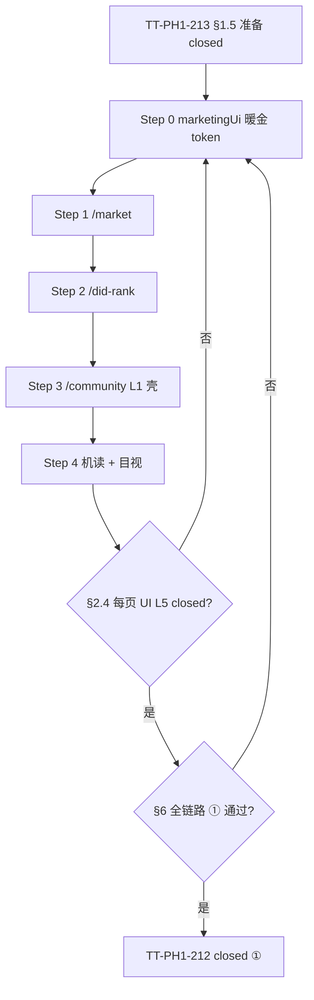

# TT-PH1-SITE-THEME-V1-UPGRADE-001 · 全站主题 V1 外溢（首页 DNA → marketDark 三页）

**Version:** 1.8.5  
**最后更新：** 2026-05-22（**§3.2.11 D10=阶段一①总闸 · D11+才测网** · 与 PI-1 出口对拍）  
**控件矩阵 SSOT：** [TT-PH1-SITE-THEME-V1-CONTROL-MATRIX.md](TT-PH1-SITE-THEME-V1-CONTROL-MATRIX.md)（逐路由 · L0～L5 · 每键位 token · ① 状态）  
**阶段：** **① 本地**（不宣称 ② 测试网 / ③ 生产真链、真 PSP）  
**交付模式：** **独立开发 · 不依赖 PR**（`commit` → `push` + 自留 `exit 0` 证据；见 **§10**）  
**台账入口：** [issues-phase1-ui-ux-traveltrust-v6.md · §五](issues-phase1-ui-ux-traveltrust-v6.md#全站主题-v1-外溢2026-05-22--①)  
**PI-1 闭卷互链：** [issues-phase1-local-traveltrust-v6.md · 主题 V1 出口](issues-phase1-local-traveltrust-v6.md#阶段一出口核对ph-1-签字前)

> **命名澄清（必读）**  
> - **本 runbook 的「全站主题 V1」** = 以 **`/` 首页品牌 DNA** 为参照，把 **`/market`、`/did-rank`、`/community/*`** 收成同一套 Token / L1 壳 / **暖金 Action（主 CTA·Tab·标题）** 规则，且 **范围内每个页面须达到「页面 UI L5」**（见 **§1.6**、**§1.7**、**§2.4**）。**无单独「主题 V2」文档**——历史上曾称 Action SSOT 的增量已并入 V1。  
> - **≠** `frontend/archive/ui-v1/`（**TT-PH1-186** 只读 UI 快照，**非**本轨运行时代码）。  
> - **≠** `/traveltrust` **电影动画 L5**（见 [TT-PH1-CINEMATIC-ANIMATION-L5-001](TT-PH1-CINEMATIC-ANIMATION-L5-001.md)）— 与本轨 **页面 UI L5** 并行、不混批。  
> - **≠** 宣称全站 93 域矩阵、96-20 每路由已验收（见 [TT-9628 · 覆盖边界](TT-9628-main-line-vs-branch-lines-delivery.md#tt-9628-coverage-boundary)）。

---

## 0. AI / 维护者触发话术（复制即用）

```
【全站主题 V1 v1.8.5】D1～D10 = **阶段一① 必须过**（§3.2.11 总闸全 true）→ **第 11 天起** 才开 **② 测试网**（§3.3 + TT-9618）。禁止跳阶。
```

**口语等价：**「按照 V1 版本进行升级优化」「按全站主题 V1 台账」「按 TT-PH1-SITE-THEME-V1 做」「子页跟首页统一」——均指 **本文一整条程序（含原 Action 层）**，不是 archive/ui-v1，也**不是**另一份 V2 runbook。

---

## 文档地图（阅读顺序 · 条文编号保留历史顺序）

| 顺序 | 章节 | 用途 |
|------|------|------|
| 1 | **§1** | 首页 / L0 **锁死参照** |
| 2 | **§1.5** | **开工闸门**（**TT-PH1-213**；D1～D4） |
| 3 | **§1.6 · §1.7** | **页面 UI L5** 定义 + **暖金 Action** 真源 |
| 4 | **§2 · §2.4** | 施工范围、**逐路由 L5 表**（defer 写备注列） |
| 5 | **§3.2 · §3.2.8～3.2.11** | **十日冲刺** + **审计** + **命令** + **D10=阶段一总闸** + **§3.3 ②** |
| 6 | **§4 · §6 · §7** | 进度台账、验收命令、**完成定义**（含 **§7.1 · §7.2**） |
| 7 | **§9 · §10** | 升级审计、证据目录、独立开发交付 |
| 8 | **[控件矩阵](TT-PH1-SITE-THEME-V1-CONTROL-MATRIX.md)** | 逐路由 · 逐控件 · token · ① 状态（企业级 SSOT） |
| 9 | **[证据勾选镜像]( ../../frontend/evidence/GO_local_site_theme_v1/V1-PERCEPTION-CHECKLIST.md)** | 与 **§3.2 / §4.2** 同序；动勾选一处处同步 |

> **212 首次闭卷（2026-05-22）** 与 **§7.1 Action 对齐复验** 分层见 **§7**；勿用旧版 §4.1「D1=B / Feed 全 defer」口径。

---

## 1. 锁死参照（冻结 · 勿在本轨大改）

| 区域 | ① 状态 | 真源 |
|------|--------|------|
| **`/` Web3 旅行首页** | **UI 冻结（① · 2026-05-25）** | **[FIVE-MAIN-ROUTES-PHASE1-FREEZE.md`](../../frontend/evidence/GO_local_marketing_front_closure/FIVE-MAIN-ROUTES-PHASE1-FREEZE.md)** · [`app/(home)/README.md`](../../frontend/app/(home)/README.md) → [88 §一](../spec/88-五主路由页身实现快照与UX缺口审计-20260330.md) |
| **L0 顶栏四链** | **已收口 · 冻结** | [`Header.tsx`](../../frontend/components/Header.tsx) · [`uiSystem.ts`](../../frontend/lib/uiSystem.ts) · [`marketingUi.ts`](../../frontend/lib/marketingUi.ts) · [`GO_local_marketing_front_closure`](../../frontend/evidence/GO_local_marketing_front_closure/README.md) |
| **`/traveltrust` 协议叙事页** | **UI 冻结（① · 2026-05-25）** | **[FIVE-MAIN-ROUTES-PHASE1-FREEZE.md`](../../frontend/evidence/GO_local_marketing_front_closure/FIVE-MAIN-ROUTES-PHASE1-FREEZE.md)** · [`modules/traveltrust-home/README.md`](../../frontend/modules/traveltrust-home/README.md) · layout lock + **L1 portal/CSS 跑马灯** |
| **`/market` · `/did-rank` · `/community/*`** | **UI 冻结（① · 2026-05-25）** | [`FIVE-MAIN-ROUTES-PHASE1-FREEZE.md`](../../frontend/evidence/GO_local_marketing_front_closure/FIVE-MAIN-ROUTES-PHASE1-FREEZE.md) · `app/market|did-rank|community/README.md` |
| **五主路由 ②③ 台账** | **未闭** | 同上 **FIVE-MAIN-ROUTES** §② / §③；**禁止**用 ① 冒充测网/生产 GO |

**首页 DNA（抽成规则，非每页复制摄影 + 全屏点阵）：**

| 层级 | 首页真源 | 全站推广 |
|------|----------|----------|
| Token / class | 首页锁死：`ref-sun` 暖金、Register pill、深条、玻璃卡、`TrustBadgesRow`；Hero 主提交 **`TT_MARKETING_HOME_SUBMIT_FAB`**（**§1.7 暖金 · 非** `bg-cta-gradient`） | 子页 **只**从 **`marketingUi.ts`** 取 `TT_MARKETING_*`；**主路径 Action** 用 **`TT_MARKETING_ACTION_*`** / **`TT_COMMUNITY_FEED_ACTION`**（与 L0 Register 同族暖金渐变）；**禁止** marketDark Hub/Tab/主钮用全局蓝紫 **`bg-cta-gradient`** |
| L0 壳 | Header 深条 + 暖金四链激活 | **已完成**（`headerNavItemIsActive`、marketing 闭卷） |
| 页身氛围 | Ken Burns 摄影 + vignette + `bg-web3-dot-grid` + 冷灰页脚 | **按路由分区**（88 §一）：marketDark 三页用 **`WarmRouteFieldBackdrop` + 弱赛博叠层**；**不**给 `/market` 套 `/` 全屏摄影 Hero |

### 1.6 页面 UI L5（marketDark · 本轨达标定义）

> **命名三分（勿混读）**
>
> | 名称 | 适用路由 | 真源 |
> |------|----------|------|
> | **L0～L4** | 全站 | **结构层**：L0 顶栏 · L1 路由壳 · L2 页头/Hub · L3 列表/卡/抽屉 · L4 loading/error/空态 |
> | **页面 UI L5** | **`/market*`、`/did-rank`、`/community/*`** | **本文 §1.6** — 主题 V1 **闭卷门槛** |
> | **电影动画 L5** | **`/traveltrust` only** | [TT-PH1-CINEMATIC-ANIMATION-L5-001](TT-PH1-CINEMATIC-ANIMATION-L5-001.md) |

**页面 UI L5（① 本地）** 当且仅当该路由（或共用 layout 的一组子路由）**同时**满足：

| # | 维度 | 标准 |
|---|------|------|
| P5-1 | **结构 L0～L4** | L0 沿用冻结 Header；**L1～L4** 按 [88 §一](../spec/88-五主路由页身实现快照与UX缺口审计-20260330.md) 叠层与分区正确（暖场底、无 `/` 摄影 Hero 误套） |
| P5-2 | **Token / 主路径色（含 Action）** | 页壳、Hub/Tab、页头标题渐变、主 CTA、筛选 chip、发布 FAB、错误重试、分页等 **主交互路径** 来自 `TT_MARKETING_*` / **`TT_MARKETING_ACTION_*`** / **`TT_COMMUNITY_FEED_ACTION`** / `TT_COMMUNITY_SHELL_L5` / `TT_MARKETING_DID_RANK_*` / **`TT_MARKETING_MARKET_DARK_PATH`** / **`TT_MARKETING_DID_RANK_PATH`**；**无** teal/cyan/fuchsia **主导** 上述主路径（`rg` 可证） |
| P5-3 | **书面 defer** | **D3**（Market 抽屉 glass **focus** 青色）、帖卡内图标/次要链、PublishDrawer 底部提交钮（若仍品红）等 **仅** 允许在 §2.3 / §9.3 / §2.4 备注登记；**Feed 主路径霓虹已纳入 V1，不再 defer** |
| P5-4 | **状态与 a11y** | `loading` / `error` / 骨架与真页 **同壳同族**；主链操作 **≥44px** 触摸目标（13 / 37）无回退 |
| P5-5 | **证据** | 该机读 contract（若有）+ **§6.2** 该路由 **POST** 截图 ≥1 + §2.4 行勾选 |

**段位（维护用 · 与电影 L5 表同风格）：**

| 段位 | 含义 |
|------|------|
| **L5** | §1.6 全表 + §2.4 该行 **closed ①** |
| **L4.5** | 代码/contract 已合入，缺目视或缺单一子路由 |
| **L4** | Step 208～210 级「主 CTA 暖金」但未逐页 L5 签字 |
| **L3** | 仅 L1 壳或 token 局部 |

**闭卷规则：** **TT-PH1-212** = **closed ①** 要求 **§2.4 表内每一行** 页面 UI L5 = **closed ①**（非仅 207～211 Step 绿）。

### 1.7 暖金 Action 真源（并入 V1 · 子页对齐首页主路径）

> **说明：** 曾用口语「Theme V2 / Action SSOT」描述的本层，已**合并进全站主题 V1**，不再单独发版或另建 evidence 目录。

**问题：** 全局 CSS **`bg-cta-gradient`** 为蓝紫（`#3b82f6→#8b5cf6`），与 L0 **Register 暖金** 不一致；V1 早期若子页 Hub/Tab/主钮复用该 class，目视仍像「旧 Web3 蓝」，未真正跟首页统一。

**真源（代码）：**

| Token 族 | 用途 |
|----------|------|
| **`TT_MARKETING_ACTION_GRADIENT_FILL`** | 与 `REGISTER_PILL_WARM` 同族暖金渐变；marketDark **主 CTA / Hub·Tab 激活** |
| **`TT_MARKETING_ACTION_TITLE_GRADIENT`** | 页头 `h1` 标题渐变（`from-ref-sun` … `ref-coral`） |
| **`TT_MARKETING_ACTION_PERIOD_TAB_*`** | `/did-rank` 周期 Tab |
| **`TT_COMMUNITY_FEED_ACTION`** | `/community` Feed 顶区、主 Tab、筛选 chip、发帖条、Toast、空态重试 |
| **`TT_COMMUNITY_DRAWER_L5`** | 抽屉/弹层/帖卡内（Publish · PostDetail · 徽章 · 发送） |
| **`TT_MARKETING_MARKET_DARK_PATH`** | `/market*` 筛选带、内链、卡描边、空态 CTA 等 |
| **`TT_MARKETING_DID_RANK_PATH`** | `/did-rank` 弹窗壳、徽章、榜内链 |

**施工顺序（固定）：** **市场 → 排行 → 社区**（与 §2.1 一致）。

**机读：** `marketTheme` · `didRankTheme` · **`communityFeedActionTheme`** · **`communityDrawerTheme`** · `communityShellTheme` · `communityPageTheme`（见 §6.1）。

---

## 1.5 升级前准备（动代码前 · 全部勾选再开 Step 0）

> **闸门：** **TT-PH1-213** = **closed ①** 后，才允许把 **TT-PH1-207** 标为进行中或改 `marketingUi.ts` 主题 token。

### 1.5.1 产品决策（四条 · 写入 §2.3 备注列）

| # | 决策项 | 须在开工前选定 | 默认建议（可改） |
|---|--------|----------------|------------------|
| D1 | 社区**发布 FAB**（主路径） | A 全暖金 / B 壳暖金+FAB 品红 | **A**（与首页 Register 同族；已写入 `TT_MARKETING_DARK_ROUTE_PUBLISH_FAB` / `TT_COMMUNITY_FEED_ACTION`） |
| D2 | 社区 **Feed 主路径**（顶区·Tab·筛选·空态） | 改暖金 / 保留霓虹 | **改暖金**（并入 V1；帖卡**内**次要 pill/图标可 §2.4 备注 defer） |
| D3 | Market **玻璃卡 / 抽屉** 内控件 focus | 全改暖金 / **保留** `marketCyan*` | **保留青 focus**（非主路径；Hub/Hero/主 CTA 仍须暖金） |
| D4 | 排除路由 | 写死不改 | **`/`、`/traveltrust`、Console、`/admin/*`** |

### 1.5.2 改前基线（① · 自留证据 · 不依赖 PR/Actions）

```bash
cd frontend && npm run test -- --run lib/uiSystem.test.ts lib/marketingUi.test.ts lib/marketingUi-import-hygiene.test.ts
cd frontend && npm run test -- --run app/(home)/homeMarketing.contract.test.ts components/market/useMarketPage.contract.test.ts
```

- [x] 上列命令 **exit 0**（`PRE-baseline-core-20260522.txt`）
- [x] POST 目视九路由（`POST-screenshots/`）；PRE PNG 见 `PRE-screenshots/README.md`（改前未采 · 口径登记）
- [x] `git status` 干净或已知的无关改动已隔离

**注意：** `useMarketPage.contract.test.ts` **只测 API 路径**，**不能**证明主题已统一；闭卷仍靠 §6.2 目视 +（建议）§9.4 新增 theme contract。

### 1.5.3 范围盘点（只读 · 历史快照 · Step 0 前）

> **注意：** 下表为 **2026-05-22 Step 0 前** 命中约数；**§1.7 Action 合并后** 主路径已收进 `TT_MARKETING_ACTION_*` / `TT_COMMUNITY_FEED_ACTION`。维护者复验须 **重跑** 下列 `rg` 并更新 `SCOPE-inventory-*.txt`（见 **§7.1**）。

在仓库根执行并归档输出（可选贴入 evidence README）：

```bash
rg "from-ref-teal|from-ref-cyan|via-ref-cyan" frontend/components/market frontend/components/did-rank frontend/app/market frontend/app/did-rank -g "*.tsx" -c
rg "ref-cyan|ref-teal" frontend/components/did-rank -g "*.ts*" -c
rg "border-fuchsia|bg-fuchsia" frontend/components/community frontend/app/community -g "*.tsx" -c
```

| 区 | 审计快照（文件命中约数） | 含义 |
|----|--------------------------|------|
| **market** 页内 teal/cyan 主渐变 | **~10** 处组件级（含 Hero、Hub、`ViewSwitcher`、弹窗脚） | Step 1 须逐文件改或收进 token |
| **did-rank** `ref-cyan`/`ref-teal` | **12** 个源文件（含 `itineraryRankBlockTop3Styles.ts`） | 不单靠 `DidRankBoardShell`；Top3 样式分散 |
| **community** fuchsia | **components ~30+**、**app/community ~30+** | 只改壳仍会有「发布」入口品红；选 A 则工作量大 |
| **marketingUi** 定义层 | `MARKET_HUB_NAV_*`、`DARK_ROUTE_TAB_*`、`DID_RANK_TAB_*` 仍为 teal/cyan 渐变 | **Step 0 必先改此处**，否则壳组件联动仍青 |

### 1.5.4 契约与机读缺口（开工前或 Step 0 同批补齐）

| 缺口 | 风险 | 准备动作 |
|------|------|----------|
| 无 did-rank / community **主题** contract | token 改了无护栏 | 新增轻量 `*.contract.test.ts`（禁止 Hero/Hub 主钮 `from-ref-teal`；壳须 import `TT_MARKETING_DARK_ROUTE_*`） |
| `marketingUi.test.ts` 偏 `/`、`/traveltrust` | `DARK_ROUTE_*` 回归无测 | 断言 marketDark 激活 Tab/Hub 含 **`from-[#e8c96a]`**（`TT_MARKETING_ACTION_GRADIENT_FILL`），**不含**子页主路径 `bg-cta-gradient` |
| E2E `e2e:market-community` 等 | 测流程不测色 | **不**用 E2E 绿代替 §6.2 目视 |

### 1.5.5 文档与规格

- [x] 实现以 **本 runbook + `marketingUi.ts` + 88 §一（叠层）** 为准；**88 正文**仍有历史 cyan/社区 Tab 描述 — **默认 defer 文档批**（除非你明确「台账同批」再动 04/88）
- [x] **勿**为纯准备改 **07** 文首完成度 %

### 1.5.6 环境与工程

- [x] 本地 `:3012`；长会话优先 `cd frontend && npm run dev:clean`（防 HMR 假死 · TT-PH1-176）
- [x] 勿改 `globals.css` 中 `did-rank-*` keyframes **除非**单独立项（本轮只改色，不删动画）
- [x] `communityA11yFocus.ts` 与 `marketingUi` **双轨** — 改壳时核对是否仍引用 `communityPublishFabFocus` / `communityCardLinkFocus`（§9.3）

### 1.5.7 准备完成勾选（= TT-PH1-213）

- [x] **D1～D4** 已写入 §2.3 或 §4 表备注
- [x] **1.5.2** 基线 exit 0 + 截图路径已记
- [x] **1.5.3** 盘点已跑（`SCOPE-inventory-20260522.txt`）
- [x] **1.5.4** contract 已落地（§9.4 + guides/traveltrust）
- [x] 已读 **§9 升级审计** 风险表

---

## 2. 本轮必须升级（marketDark · `UiZone = marketDark`）

**代码分区 SSOT：** [`uiSystem.ts`](../../frontend/lib/uiSystem.ts) — `MARKET_DARK_PREFIXES = ["/market", "/community", "/did-rank"]`。

### 2.1 施工顺序（固定 · 减少返工）



| Step | 范围 | 目标 | 主要触点（示例） |
|------|------|------|------------------|
| **0** | `marketingUi.ts` | **§1.7 Action 真源**：`TT_MARKETING_ACTION_*`、`TT_COMMUNITY_FEED_ACTION`、`TT_MARKETING_MARKET_DARK_PATH`、`TT_MARKETING_DID_RANK_PATH`；Hub/Tab/主 CTA **禁止**蓝紫 `bg-cta-gradient` | 见 §1.7 表 |
| **1** | `/market` | 壳 + **Action**：Hero/Hub/筛选/空态/内链/弹窗主 CTA 暖金 | `MarketPageHero`、`MarketHubSubNav`、`ViewSwitcher`、`EmptyState`、`MarketTravelFilterPanel`… |
| **2** | `/did-rank` | 壳 + **Action**：周期 Tab、**竖脊五签** Tab（`DidRankBoardShell`：traveler/guide/**itinerary**/provider/acquisition）、弹窗、Top3 标题/链 | `DidRankHeader*`、`DidRankBoardShell`、`DidRankGuideModal`、`ItineraryRankBlock`… |
| **3** | `/community/*` | L1 壳 + **Feed 主路径 Action**（顶区/Tab/筛选/发布 FAB/空态/Toast） | `CommunityRouteShell*`、`CommunityFeedHeader`、`CommunityFeedFilterBar`、`CommunityFeedList`… |
| **4** | **各页 L5 闭卷** | §2.4 **逐路由** P5-1～P5-5 + §6.1 + §6.2 | §6 · §7 |

### 2.4 各路由页面 UI L5 达标表（212/218 · 行级 closed ① + defer 备注）

> **维护：** 每完成一页改 **页面 L5** 列；**defer** 写进 **备注**（须对应 D2/D3/§9.3）。**Step 208～210 closed ≠ 本表自动 L5。**

| 路由 / 路由组 | 共用 layout | L1 壳 token | 页面 UI L5 | 备注（defer / 证据） |
|---------------|-------------|-------------|------------|----------------------|
| **`/`**（Experience · 摄影壳） | `app/(home)` | `TT_MARKETING_ACTION_*`（波次 C · §1.7） | **closed ①** | **221 + 229 closed ①**（2026-05-24）· POST `home/` · **214** 备注已回写（Hero 暖金） |
| **`/market`**（含 `/market/provider`、`/market/acquisition` 等） | `app/market` + 页内 Hub | `TT_MARKETING_MARKET_HUB_NAV_*` · `TT_MARKETING_ACTION_*` · `TT_MARKETING_MARKET_DARK_PATH` | **closed ①** | **defer D3：** 抽屉/玻璃区 `marketCyan*` focus · **defer：** 非 `darkBg` 的 `EmptyState` 仍可能 `bg-cta-gradient`（Console 浅色分支）· POST `market/` · `market-provider/` · `market-acquisition/` |
| **`/did-rank`** | 单页 + `loading`/`error` | `TT_MARKETING_DID_RANK_*` · `TT_MARKETING_ACTION_PERIOD_TAB_*` | **closed ①** | 主路径暖金 · `didRankTheme` · POST PNG |
| **`/community`**（Feed 首页） | `community/layout` | `TT_COMMUNITY_SHELL_L5` · `TT_COMMUNITY_FEED_ACTION` | **closed ①** | **219：** 帖卡壳 `feedCard` · 发布 `publishSubmit` · 空态暖金 · **defer：** 帖卡内 pill/图标 · PD-1/2 抽屉内 cyan（矩阵 §9） |
| **`/community/explore`** | 同上 | `TT_COMMUNITY_PAGE_L5` | **closed ①** | 壳同 Feed · 栅格内次要链可霓虹 · POST PNG |
| **`/community/friends`** | 同上 | 同上 | **closed ①** | L1/L2 Tab 暖金 · POST PNG |
| **`/community/messages`**（含 `[id]`） | 同上 | 同上 | **closed ①** | 线程主路径暖金 · POST PNG |
| **`/community/me`**（含 `posts`/`collects`/`reports` 等） | 同上 | 同上 | **closed ①** | `me/reports` 等按表验收 · POST PNG |
| **`/community/feedback`** · **`/community/tt`** | 同上 | 同上 | **closed ①** | tt 无第二套 Web3 底 · POST PNG |

**抽样即可否？** **否。** 上表 **每一行** 均须 **closed ①** 方可 **212**；若仅验 Feed 首页，须在备注写明 **其余行 defer ②**（**禁止**在 ① 宣称全社区 L5）。

### 2.2 刻意区分（不是漏做）

| 分区 | 路由 | 本轨规则 |
|------|------|----------|
| **Console** | `/orders`、`/pay`、`/escrow`、`/me`… | **不在本轨**；浅色 `TT_MARKETING_PRODUCT_PAGE_*`；资金区禁 Experience 粒子（13 + 53） |
| **Admin** | `/admin/*` | **不在本轨**；运维浅色，不套 Experience 摄影 |
| **桥接** | `/auth/*`、`/help` | **TT-PH1-217** · 浅色 22 · `travel-*` / `travelLinkFocus`（**无** marketDark 改码） |
| **桥接** | `/guides/*` | **TT-PH1-216** · 主 CTA/面板暖金；内联链 **marketCyan***（88） |

### 2.3 已拍板决策（① · 写入 §2.4 备注 · 回退须改 §1.5.1）

| 项 | **当前 V1 默认** | 废止选项 |
|----|------------------|----------|
| **D1** 社区发布 FAB | **A 暖金**（`TT_MARKETING_DARK_ROUTE_PUBLISH_FAB` / `TT_COMMUNITY_FEED_ACTION`） | B 壳暖金+FAB 品红（**已废止**） |
| **D2** Feed 主路径 | **改暖金**（顶区/Tab/筛选/空态/Toast；**非**帖卡内） | 主路径全保留霓虹（**已废止**） |
| **D3** Market 玻璃 focus | **保留** `marketCyan*` | 全改暖金（**未选**） |

---

## 3. 波次 B（212 之后 · ① 目视 + 边界收口）

> **不**回改 marketDark 三页；**不**宣称电影动画 L5 全页重验。**桥接** `/auth`·`/guides`·`/help` 仍 **88 浅色 + marketCyan***（§2.2），**本波次不改**。

| 路由 | 说明 | ID |
|------|------|-----|
| **`/`** | 主题 DNA **基准**；212 后 **目视签收**（通常 **无需** 改代码） | **TT-PH1-214** |
| **`/traveltrust`** | **电影动画 L5** 另轨（[TT-PH1-CINEMATIC-ANIMATION-L5-001](TT-PH1-CINEMATIC-ANIMATION-L5-001.md)）；本波次仅 **`error.tsx`** 深壳暖金与三页 error 对齐 + POST 截图 | **TT-PH1-215** |

| ID | 内容 | 状态 | 证据 |
|----|------|------|------|
| **TT-PH1-214** | `/` 目视 · 确认无需主题 V1 代码改动 | **closed ①** | `WAVE-B-screenshots/home/` · `WAVE-B-214-215-20260522.txt` |
| **TT-PH1-215** | `/traveltrust` 波次 B · `error` 暖金 + 目视 | **closed ①** | `traveltrustErrorTheme.contract` · `WAVE-B-screenshots/traveltrust/` |
| **TT-PH1-216** | `/guides/*` 桥接 · 市场氛围主路径暖金 | **closed ①** | `TT_MARKETING_GUIDES_ATMOSPHERE` · `guidesTheme.contract` · `WAVE-B-screenshots/guides/` |
| **TT-PH1-217** | `/auth/*`、`/help` 桥接 · console 审计闭卷 | **closed ①** | `authHelpBridgeTheme.contract` · `WAVE-B-screenshots/auth-login|help/` |

**机采：**

```bash
cd frontend && PLAYWRIGHT_REUSE_FE_SERVER=1 npm run e2e:site-theme-v1-wave-b-capture
```

### 3.1 主题 V1 程序 ① 全收口（206～217）

| 轨道 | ID 范围 | ① 状态 |
|------|---------|--------|
| marketDark 三页 + L5 | 206～212 | **closed** |
| Action 并入 V1（§1.7） | **218** | **closed**（机读）· 目视见 **§7.1** |
| 波次 B | 214～215 | **closed** |
| 桥接 | 216 guides · 217 auth/help | **closed** |

**下一阶（非本 runbook）：** **② 测试网** 真数据链 / PSP — [TT-9618-onboarding-local-testnet.md](TT-9618-onboarding-local-testnet.md)；**禁止**用 ① 主题截图冒充 ②。

### 3.2 波次 C · V1 感知完善清单（212 之后 · ① · **按序勾选**）

> **用途：** **206～212 / 219** 解决的是 **机读页面 UI L5**（Token、壳、44px、POST 单路由截图）。若仍感到「视觉差、体验碎」，用本节 **逐步完善** 并在 **§4.2**（或 [证据镜像](../../frontend/evidence/GO_local_site_theme_v1/V1-PERCEPTION-CHECKLIST.md)）**打勾**。  
> **≠** 推翻 §2.4 已 closed 行；**=** 在 **①** 上追加 **感知 L5** 与 **体验债** 收口。  
> **风格宪法互指：** 首页壳 [88 §一](../spec/88-五主路由页身实现快照与UX缺口审计-20260330.md) · [86 §6.1](../spec/86-UI-双系统未来风-风格与动效技术规格.md) · [`app/(home)/README.md`](../../frontend/app/(home)/README.md) — **首页可不套 `WarmRouteFieldBackdrop`**，但 **主 Action 应与 §1.7 同族**。

#### 3.2.0 命名分层（勿混读）

| 名称 | 含义 | 当前 ① 状态（2026-05-22） |
|------|------|---------------------------|
| **页面 UI L5** | §1.6 P5-1～P5-5 · §2.4 逐路由 | marketDark 九路由 **closed ①**（含 defer 登记） |
| **感知 UI L5** | 本节 **Q1～Q5** + 三波勾选项 | **open**（波次 C） |
| **Experience UI L5** | **`/`** 单独：摄影壳 + 暖金主 Action + 28 五幕 | **partial**（壳在 · Hero 仍青紫主路径） |

**闭卷升级规则：** 仅当 **§4.2 三波主项全勾** + **Q1～Q5 目视签字**（**TT-PH1-228**）+ 证据 `WAVE-C-screenshots/` 时，可在台账写 **「全站主题 V1 · 感知层 ① closed」**。**禁止**用机读绿 alone 宣称「五主路由体验已验」。

#### 3.2.1 问题登记（根因 · 为何「表格绿了仍差劲」）

| # | 现象 | 根因 | 对应波次 / ID |
|---|------|------|----------------|
| **P-1** | 顶栏暖金、页身/主钮各说各话 | **`/`** Hero 仍 `ref-cyan` / `bg-cta-gradient`；与子站 **§1.7** 未对齐 | 第一波 **A** · **TT-PH1-221** · **closed ①** |
| **P-2** | `/market` 同一页两套强调色 | Hero/Hub 暖金 + 玻璃区 **D3** `marketCyan*` 排序/订单描边 | 第一波 **B** · **TT-PH1-222** |
| **P-3** | `/` ↔ 三页像换产品 | Ken Burns Hero vs `#14100d` 暖场；进 Console 又浅色跳变 | 第一波 **C** + 第二波 **F** · **223** / **226** |
| **P-4** | 暗场闷、平、像后台 | 暖场无叙事锚点；叠层 market **弱于** community/did-rank | 第一波 **C** · **223** |
| **P-5** | 社区/榜 **扫读累** | 壳 L5 了但首屏任务弱、帖卡/抽屉 defer cyan、密度高 | 第二波 **D/E** · **224** / **225** |
| **P-6** | §6.2 POST 过了仍不像一家 | POST 验 **单路由 P5-2**，未验 **五路由并排 Q1/Q2** | **TT-PH1-228** |
| **P-7** | 88 与实现打架 | 文档写 cyan Tab、实现已暖金；或 defer 未收口 | **TT-PH1-233** · 用户写明「台账同批」时改 88 |
| **P-8** | **`/` 只改 Hero 仍断层** | 结果区/解锁/页脚仍蓝紫·青环·浅色 Console 条 | **221-B～D** · **Q6** · **closed ①** |
| **P-9** | **机读「绿」与 V1 反着** | `homeMarketing.contract.test.ts` **要求** `bg-cta-gradient` | **TT-PH1-229** · **closed ①** |
| **P-10** | **市场 contract 漏网** | `marketTheme.contract` **未覆盖** `MarketContentViewSortBar` / `OrdersSection`（仍 `ref-cyan`） | **222-B** + **TT-PH1-230** |
| **P-11** | **§2.4 纸面 closed ≠ 感知达** | 行内 **defer**（D3、帖卡内、首页未入表）未清 | **§3.2.6** · 勿对外称「体验 L5 已闭」 |
| **P-12** | **证据不可审计** | `219f` · §7.1 POST 目录未入仓 | **TT-PH1-232** |
| **P-13** | **跨路由跳转断色** | `/` 解锁 → 浅色 `UnlockModal`；页脚 `bg-bg-console`；→ `/orders` 浅顶栏 | **221-C/D** · **226** |
| **P-14** | **控件矩阵仍标 △** | 矩阵 §5～7 · §8 **219d** 等「次要/○」未归零 | **TT-PH1-234** · 对照 §3.2.6 |
| **P-15** | **探索页语义 focus 类名误导** | `communityFuchsiaPillFocus` 等 **实为 ref-sun 描边**（非品红债） | 文档注明即可 · **227-H** 仅收 **真 fuchsia/cyan 字面量** |

#### 3.2.2 感知 L5 标准（Q1～Q8 · 目视 + 机读硬杠）

| # | 标准 | 怎么验（①） |
|---|------|-------------|
| **Q1** | **全站一个主行动色**（`TT_MARKETING_ACTION_*` 族） | 硬刷新：`/`、`/market`、`/did-rank`、`/community` 首屏 **主 CTA / 发布 / 规划提交** 同色同形；并排截图入 `WAVE-C-screenshots/five-routes-cta.png` |
| **Q2** | **路由切换不「换产品」** | 连点四链：顶栏 + 主钮 **语言不断裂**（壳可不同） |
| **Q3** | **每页 3 秒一个任务** | `/` 规划 · `/market` 找向导 · `/did-rank` 看榜 · `/community` 刷 Feed — 首屏只推销一件事 |
| **Q4** | **次要色降级** | cyan/fuchsia **仅** 链上标签、DID、危险、**focus ring** — **不出现在** Tab/排序/主钮/发布提交 |
| **Q5** | **暗底可读** | 正文对比抽检 AA；玻璃卡与底图 **明度差 ≥ 一档**（不糊成一团） |
| **Q6** | **`/` 全链路同色** | Hero + **结果卡解锁钮** + **UnlockModal 支付** + **页脚** 主路径无蓝紫/teal 主导条 | `WAVE-C-screenshots/home-full-scroll.png` |
| **Q7** | **机读与 §1.7 同向** | `homeMarketing` **禁止**主路径 `bg-cta-gradient`；`marketTheme` **覆盖** SortBar/OrdersSection | §6.1 扩展用例 **exit 0** |
| **Q8** | **矩阵 △ 收口** | [控件矩阵](TT-PH1-SITE-THEME-V1-CONTROL-MATRIX.md) §5～§9 无未登记 **△**（或全写入 §3.2.6 **defer 列**） | 矩阵维护者签字 |

#### 3.2.3 施工顺序（固定 · 按编号做 · 在 §4.2 勾选）

**第一波（改色为主 · IA 不动 · 痛感最大）**

| 序 | ID | 内容 | 主要文件 / token |
|----|-----|------|------------------|
| **C-1a** | **221-A** | **`/`** `LandingHeroForm` 主路径暖金：外框/标题渐变/环 CTA/圆形提交 → **`TT_MARKETING_ACTION_*`**；日期弹层 **去 `bg-cyan-500/80` 主导**；**保留** 摄影 + vignette + 玻璃 blur | `LandingHeroForm.tsx` · **TT-PH1-229** · 88 记「首页 Action 与 V1 同族」 |
| **C-1a′** | **221-B** | **`/`** 下游同色：`ItineraryResultsSection` 解锁 CTA + 卡 **ring/hover** → 暖金 faint；**非** `bg-cta-gradient` / `ring-ref-cyan` 主路径 | `ItineraryResultsSection.tsx` |
| **C-1a″** | **221-C** | **`/`** `UnlockModal` 支付钮：**深色页上**用暖金主钮或 **`TT_MARKETING_*` dark 变体**（现 `bg-travel-500` + 浅色卡） | `UnlockModal.tsx`（`/market` 等共用须回归） |
| **C-1a‴** | **221-D** | **`/`** `LandingFooter`：**`TT_MARKETING_HOME_FOOTER_*` 冷灰字**接在 Ken Burns Hero 下（**非**浅色 `bg-bg-console` 条） | `LandingFooter.tsx` · `TrustInfraWall` 对比度 · **closed ①** |
| **C-1b** | **222-B** | **`/market`** 关掉同页双主色：`MarketContentViewSortBar` · `MarketContentOrdersSection` · `MerchantShowcaseFormCopyPriceEscrow` → **`TT_MARKETING_MARKET_DARK_PATH`**；**收口 D3** 或 cyan **仅** `focus-visible` | **TT-PH1-230** · 更新 §2.3 D3 |
| **C-1c** | **223-C** | **三页壳**拉齐：`TT_MARKETING_DARK_ROUTE_SCENE.market` podium/vignette **略抬**（仍 &lt; community）；可选极弱纹理（**非** `/` 全屏摄影） | `marketingUi.ts` · `MarketDarkRouteSceneDecor.tsx` |

**第二波（体验 · 少动 spec）**

| 序 | ID | 内容 | 要点 |
|----|-----|------|------|
| **C-2a** | **224-D** | **首屏一任务** | 见 **§3.2.4** 分路由表；压缩社区顶区 chrome、市场 Hero→筛选→卡节奏 |
| **C-2b** | **225-E** | **状态族一致** | loading/error/骨架 **同壳同族**；空态 **一句 + 一个暖金 CTA**；**`EmptyState` 非 `darkBg` 分支** 查 `bg-cta-gradient`（§2.4 defer） |
| **C-2b′** | **225-F** | **市场抽屉 D3** | `GuideDetailDrawer` / `OrderDetailDrawer` / `InviteGuideModal` 等 **glass focus** → 暖金或 **仅** inset ring（收口 **D3**） | 矩阵 §5.1 L3 · §9 |
| **C-2b″** | **225-G** | **社区残余** | 帖卡内 role pill/图标（§2.4 defer）· `PublishDrawer` 非提交区 · 矩阵 **△** 行 | `communityDrawerTheme` · §3.2.6 **C 类** |
| **C-2c** | **226-F** | **路由桥接（可选 P3）** | 深壳 → 浅色 Console **~200ms** 背景 cross-fade；`prefers-reduced-motion` 降级 |

**第三波（品牌溢价 · 按需）**

| 序 | ID | 内容 | 要点 |
|----|-----|------|------|
| **C-3a** | **227-G** | **`/`** Experience 微动效 | Hero 玻璃极弱光晕呼吸；结果卡 stagger 入场（**非** 全屏粒子/地球 · 88/86） |
| **C-3b** | **227-H** | **社区 Feed 版式** | 卡间距/字号走 **25**；探索页语义色 **降饱和** |
| **C-3c** | **227-I** | **摄影/头图资产** | 国家图同 LUT；市场向导头图质量统一 |

**感知签字（波次 C 出口）**

| 序 | ID | 内容 |
|----|-----|------|
| **C-4** | **228** | **Q1～Q5** 目视 + `WAVE-C-screenshots/` + 更新 §2.4 备注（若 **Experience UI L5** 改首页口径） |

#### 3.2.4 分路由最低清单（与 §2.4 并行维护）

**图例：** `[ ]` open · `[x]` closed ① · 勾选用 **§4.2** 或证据镜像同步。

**`/` — Experience UI L5（不并入 marketDark §2.4 表 · 建议 §2.4 增行 **231**）**

- [x] **221-A** Hero：主 CTA / 提交钮 = **`TT_MARKETING_ACTION_*`**；日期弹层无 **cyan 主导**（2026-05-24）
- [x] **221-B** 结果区：解锁钮非 `bg-cta-gradient`；卡 ring 非 `ref-cyan` 主路径（2026-05-24）
- [x] **221-C** `UnlockModal`：支付钮暖金或 dark 变体（非 `bg-travel-500` 浅色卡）（2026-05-24）
- [x] **221-D** `LandingFooter`：深/暖页脚（非 `bg-bg-console` + `ref-teal` 条）（2026-05-24）
- [x] **229** `homeMarketing.contract` 与上一致（2026-05-24）
- [ ] `ref-cyan` **仅** 徽章/点阵/Web3 点缀
- [ ] **Q6** 全滚动截图 · **Q1** 与 `market` 主 CTA 并排

**`/market`**

- [ ] 全页主交互无 **cyan 块**（D3 收口或书面改 §2.3）
- [x] Hero → `StickyFilterBar` → 卡 **间距节奏**（8/12/16 · 224-D · 2026-05-24）
- [ ] 玻璃卡 hover **只 elevation**，不改色相

**`/did-rank`**

- [x] 背景叠层再弱 **10～15%**（`didRank` scene · 2026-05-24）
- [x] Top3 与列表 **同一套 ref-sun**（机读已验 · 2026-05-24）

**`/community/*`（九子路由各 1 POST · 与 §2.4 一致）**

- [ ] `TT_COMMUNITY_DRAWER_L5` 主提交/主钮 **无 cyan/品红主路径**（清矩阵 §9 PD-* defer）
- [ ] Feed **首条** 顶栏下可见（移动尤其）
- [ ] 探索/消息/我 等子路由 **Q3** 首屏任务可读

#### 3.2.5 与历史 ID 的关系

| 历史 ID | 波次 C 说明 |
|---------|-------------|
| **TT-PH1-214** | 212 时「`/` 无需改码」· **波次 C-1a 若做 Hero 暖金须回写本行备注**（不必改 214 状态，在 **221** 记证据） |
| **D3** | **222-B** 默认 **收口**；若保留 cyan focus-only，须在 **§2.3** 与 **§2.4 `/market` 备注** 同步 |
| **矩阵 §9 PD-*** | **225-F/G** + 社区抽屉项并入 **§4.2** |
| **TT-PH1-229** | **`homeMarketing.contract`** 与 V1 对齐前，**禁止**宣称 **`/` 机读 L5** |

#### 3.2.6 L5 不合规项总表（审计补充 · 代码真值 · ①）

> **图例：** **A** = 页面 UI L5（§1.6）纸面缺口 · **B** = 感知 L5（§3.2）· **C** = 书面 defer 未清 · **D** = 机读/证据债  
> **状态列：** `open` · `partial` · `closed ①` · `defer`（须写理由）

| 类 | 路由 | 不合规项 | 代码/规格真值 | 波次 / ID | 状态 |
|----|------|----------|---------------|-----------|------|
| **A+B** | **`/`** | Hero 外框/标题/环 CTA/提交 **`ref-cyan`·`bg-cta-gradient`** | `LandingHeroForm.tsx` | **221-A** | **closed ①** |
| **A+B** | **`/`** | 日期范围选中 **`bg-cyan-500/80`** | `LandingHeroForm.tsx` 弹层 | **221-A** | **closed ①** |
| **A+B** | **`/`** | 结果卡 **`ring-ref-cyan`** + 解锁 **`bg-cta-gradient`** | `ItineraryResultsSection.tsx` · **`TT_MARKETING_HOME_*`** | **221-B** | **closed ①** |
| **A+B** | **`/`** | 解锁弹层浅色卡 + 支付 **`bg-travel-500`** | `UnlockModal.tsx` · **`TT_MARKETING_HOME_UNLOCK_MODAL_PAY_BTN`** | **221-C** | **closed ①** |
| **A+B** | **`/`** | 页脚浅色 **`bg-bg-console`** + **`border-ref-teal`** | `LandingFooter.tsx` · **`TT_MARKETING_HOME_FOOTER_*` 冷灰** | **221-D** | **closed ①** |
| **D** | **`/`** | contract **要求** `bg-cta-gradient` | `homeMarketing.contract.test.ts` · **禁**主路径 `bg-cta-gradient` | **229** | **closed ①** |
| **A** | **`/`** | **§2.4 行 = partial**（v1.8.4 已增） | 感知仍 open · **214** 备注待回写 | **231** | partial |
| **A+C** | **`/market`** | 排序条/订单区 **`ref-cyan` 主路径** | `MarketContentViewSortBar.tsx` · `MarketContentOrdersSection.tsx` | **222-B** | open |
| **A+C** | **`/market`** | 表单区 **`ref-cyan` checkbox 描边** | `MerchantShowcaseFormCopyPriceEscrow.tsx` | **222-B** | open |
| **C** | **`/market`** | 抽屉/玻璃 **`marketCyan*` focus** | §2.3 **D3** · 矩阵 §5.1 | **225-F** | defer |
| **C** | **`/market`** | `EmptyState` 浅色分支 **`bg-cta-gradient`** | §2.4 备注 · 矩阵 §5.1 | **225-E** | defer |
| **D** | **`/market`** | `marketTheme.contract` **未测** SortBar/Orders | 漏网仍可合并 | **230** | open |
| **B** | **`/market`** | `/market/provider`·`acquisition`·子站 **目视未入波次 C** | §2.4 closed · 需 spot-check | **228** 子集 | open |
| **B** | **`/did-rank`** | 背景叠层仍强 · Top3 与列表层次 | 88 §1.1 opacity | **224-D** · **223** | open |
| **C** | **`/community`** | 帖卡内 pill/图标霓虹 | §2.4 · 矩阵 §7.1 | **225-G** | defer |
| **B** | **`/community`** | 移动底栏 + 顶区过高 · Feed 首条 below fold | 布局债 | **224-D** | open |
| **B** | **`/community/explore`** | 话题 vs 目的地 **双 focus 工具类**（`communityFuchsia*` 名） | 色已为 ref-sun · 类名 **227-H** 可选重命名 | partial |
| **B** | **五路由** | 连点 **`/`→market→rank→community→orders** 壳/钮断裂 | P-3 · P-13 | **226** · **Q2** | open |
| **D** | **全轨** | POST/`WAVE-C` 证据未入仓 | §7.1 · **219f** | **232** | open |
| **D** | **全轨** | 88 正文历史 cyan/社区 Tab 描述 | **88-DOC** | **233** | defer |
| **D** | **全轨** | 控件矩阵 **△** 与 §2.4 closed 不同步 | 矩阵 §5～§9 | **234** | open |

**§2.4 行级备注（建议维护者下一步改表，非本批自动改状态）：**

| 路由组 | 现「页面 UI L5」 | 建议备注追加（直至波次 C 清债） |
|--------|------------------|--------------------------------|
| **`/market`** | closed ① | **+ 感知 open：** SortBar/Orders cyan · D3 · EmptyState 浅色分支 |
| **`/community`（Feed）** | closed ① | **+ 感知 open：** 帖卡内 defer · 首屏布局 · 219f 证据 |
| **`/`** | **partial**（v1.8.4） | **感知 open：** 221/229 · POST `home/` |

#### 3.2.7 机读护栏扩展（并入 **TT-PH1-229～230**）

| ID | 新增/修改 contract | 断言要点 |
|----|-------------------|----------|
| **229** | `homeMarketing.contract.test.ts` | 主提交 **含** `TT_MARKETING_ACTION` 或 `data-tt-marketing-action`；**不含**主路径 `bg-cta-gradient`（`ref-cyan` 外框允许 **仅** 若 88 记点缀例外） |
| **230** | `marketTheme.contract.test.ts` | **`MarketContentViewSortBar`** · **`MarketContentOrdersSection`** **无** `ref-cyan` 激活态主导；与 Hero 同族暖金 |

#### 3.2.8 十日冲刺计划（7 天/周 · 14h/天 · **① 本地 D1～D10**）

> **维护者承诺（阶次 · 写死）：** **D1～D10 的目标 = [阶段一 · PI-1 ① 本地闭卷](issues-phase1-local-traveltrust-v6.md#阶段一出口核对ph-1-签字前)**（**§3.2.11 总闸全 true**）。**第 11 天起**才允许开 **② 测试网**（[TT-9618](TT-9618-onboarding-local-testnet.md) · **§3.3**）。**禁止** D10 未完成即部署测试域名或写「已在测试网验收」。  
> **投入口径：** **10 自然日 × 14h ≈ 140h** — 可完成波次 C 标准档 + PI-1 复闸；**不**与 D10 同日宣称 ② 已闭。  
> **每日结构（建议）：** 实施 **~8h** · 机读/contract **~2h** · 硬刷新目视 **~2h** · 勾选台账/证据 **~1h** · 缓冲 **~1h**。  
> **勾选：** 每日末更新 [V1-PERCEPTION-CHECKLIST](../../frontend/evidence/GO_local_site_theme_v1/V1-PERCEPTION-CHECKLIST.md) **「D1…D10」列** + §4.2。

| 日 | 主题 | 交付（必须当天 closed） | 对应 ID |
|----|------|-------------------------|---------|
| **D1** | 首页 Hero + 机读 | `LandingHeroForm` 暖金 + 日期弹层；`TrustBadgesRow`/traveltrust 链；**229**；**§2.4 增 `/` 行**（**231**） | 221-A · 229 · 231 · **G6/G7** |
| **D2** | 首页下游 | `ItineraryResultsSection` · `UnlockModal`；**`home-landing-shell` E2E** | 221-B · 221-C · **G10** |
| **D3** | 首页页脚 + 市场主路径 | `LandingFooter` 深暖；`SortBar` + `OrdersSection` 暖金 | 221-D · 222-B▸ · **221 全勾** |
| **D4** | 市场收口 + 壳 | `MerchantShowcase*` · **230** · **223**；**Hub/ViewSwitcher/StickyFilter** 目视 · **Q1** 草稿 | 222-B · 230 · 223 · **G3** |
| **D5** | 首屏 · market + rank | **224**；did-rank 叠层；**榜内弹窗** spot-check；**provider/acquisition** 0.5h 目视 | 224-D · **G2/G5** |
| **D6** | 首屏 · `/` + community | **224** Feed 首条（**含 mobile 视口**）；**225-E** loading/error 抽查 | 224-D · 225-E▸ · **G9 起草** |
| **D7** | 抽屉 + 空态 + 弹窗 | **225-F**（含 BookGuide/CustomItinerary/Invite/Showcase 各开 1 次）；**225-E** | 225-F · 225-E · **G4** |
| **D8** | 社区 + 机读 | **225-G**；**§6.1 全文** + `rg` 冷色；可选 **227-G**（`motion-reduce`） | 225-G · 227▸ · Q7 · **G12/G13** |
| **D9** | 证据 + 文档 | POST **含 `/` home**（**G1**）；`WAVE-C-*`；`POST-baseline`；**231/234** | 232 · 231 · 234 · **G1** |
| **D10** | **阶段一① 总闸** | **§3.2.11 全部 true**（含 §7.2 感知层 + PI-1 机读复闸 + 人眼签字） | **PI-1** · §7.2 · 228 |

**D10 当晚「① 完成」判定（必须全 true）：** → **以 §3.2.11 为准**（下列为感知层子集，** alone 不够**）

- [x] §4.2 + §3.2.6 无未解释 **open**（允许 **defer P3** 已写字 · `D10-DEFER-20260524.txt`）
- [x] `WAVE-C-signoff-YYYYMMDD.txt`：`TT-PH1-220..234 closed ① local`（`WAVE-C-signoff-20260524-d10.txt`）
- [x] §6.1 **86/86 + homeMarketing（229）** **exit 0**（`site-theme-v1-d10-machine.sh` · 2026-05-24）
- [x] **§3.2.11 阶段一出口核对** 全勾（含 `phase-signoff` **PH-1** · 2026-05-24）
- [x] **未**开测试网 / **未**写「② 已验」

**十日仍可选 defer（不挡 D10，须登记）：** **226** 路由桥接 · **227-H/I** 版式/资产大改 · **233** 88 全文 · 社区帖卡内 pill 全清。

#### 3.2.9 十日冲刺覆盖审计（缺口 · 增补 · 2026-05-22）

> **结论：** D1～D10（**§3.2.8 + v1.8.4 机采/§6.1 对齐**）覆盖约 **92%** 感知债与 **220～234**；下表为易漏验项与文档债。

**A. 已覆盖（与 §3.2.6 / ID 对齐）**

| 域 | 十日计划 |
|----|----------|
| `/` Hero/结果/解锁/页脚 | D1～D3 + D6 叙事 |
| `/` 机读矛盾 | D1 **229** |
| `/market` SortBar/Orders/Showcase | D3～D4 **222/230** |
| 三页壳 **223** | D4 |
| 四路由 **224** | D5～D6 |
| 抽屉/空态 **225** | D7 |
| 社区主路径 **225-G** | D8 |
| Q1～Q8 · 证据 **228～234** | D9～D10 |
| ② 交接 | **§3.3** D11+ |

**B. 缺口（已并入 §3.2.8 或 D9/D10 · 代号 G1～G15）**

| # | 缺口 | 风险 | 增补到 |
|---|------|------|--------|
| **G1** | **`/` POST 机采** | 曾缺 `home` slug | **v1.8.4** 已扩 spec · **D9** 重跑 `e2e:site-theme-v1-capture` |
| **G2** | **market 子站 POST** | provider/acquisition 曾无机采 | **v1.8.4** 已扩 spec · **D5** 仍须 0.5h 目视弹窗/筛选 |
| **G16** | **`/community` 根 vs 子路由** | 子路由在 spec · 根曾易漏勾 | **D6/D9** 确认 `community/` PNG 与 explore 等同批 |
| **G17** | **§6.1 条文 49/49 过期** | 与 evidence **v26·86/86** 不一致 | 以 **§6.1 + §3.2.10** 为准；D8 留 `POST-baseline-YYYYMMDD.txt` |
| **G18** | **`homeMarketing` 未入 §6.1 主块** | 229 前可绿、229 后须进块 | **D1 后** 起 §6.1 **波次 C 扩展** 必跑 |
| **G19** | **`marketTheme` 测 `MarketContent` 不测 SortBar/Orders** | 源码仍 `ref-cyan` | **230** 须点名两文件 · 与 **222-B** 同批 |
| **G20** | **社区扩展路由** | `activity`·`topic/[tag]`·`post/[id]`·`me/*` 未 POST | **D6/D10** 抽 2 条或 **defer P3** 登记 |
| **G21** | **Q2 含 `/orders` 浅色桥** | 226 未做则记断裂 | **D10** Q2 目视 · **226** defer 须写 |
| **G22** | **`UnlockModal` 跨路由** | market 解锁链仍走 landing 组件 | **D2** 从 `/` 解锁 + **D7** 市场弹窗各验 1 次 |
| **G3** | **Hub · ViewSwitcher · StickyFilter** | 222≠筛选条全绿 | **D4** 展开 glass 视图目视 |
| **G4** | **BookGuide/CustomItinerary/Invite/Showcase 弹窗** | D7 易只测抽屉 | **D7** 各开 1 次 |
| **G5** | **DidRank 榜内弹窗** | 排行页漏验 | **D5** |
| **G6** | **`TrustBadgesRow`** | Hero 内 cyan 描边 | **D1** |
| **G7** | **Hero `/traveltrust` 链** | 次要 cyan chip | **D1** 或 defer 点缀 |
| **G8** | **P5-4 · 44px** | 改样式后回缩 | **D10** 主链抽检 |
| **G9** | **移动 390×844** | POST 仅 1280 | **D6/D10** Q3/Q6 |
| **G10** | **`home-landing-shell` E2E** | 改 Hero 后挂 | **D2/D10** |
| **G11** | **`(home)/error.tsx`** | 错误页不连贯 | **D10** 可选 |
| **G12** | **§6.1 全文 + drawer contract** | D8「全绿」含糊 | **D8** + `POST-baseline` |
| **G13** | **community `rg` 冷色** | 矩阵 §12 | **D8** |
| **G14** | **221 台账 ID** | B/C/D 无独立 ID | **D3 末** 勾 **221** 须 A～D 全完成 |
| **G15** | **`prefers-reduced-motion`** | 227-G 违规 | **227-G** + **D10** 抽测 |

**C. ② 测试网增补（§3.3 · T7～T9）** — 见下节表。

**D. 明确不在十日内（防 scope 膨胀）**

| 项 | 处理 |
|----|------|
| `/traveltrust` 电影 L5 | [TT-PH1-CINEMATIC-ANIMATION-L5-001](TT-PH1-CINEMATIC-ANIMATION-L5-001.md) |
| `/guides` · `/auth` · `/orders` 深→浅桥 | **216/217** closed；**226** 可选 |
| **93 域 / R-002 全矩阵 GO** | [TT-9628 覆盖边界](TT-9628-main-line-vs-branch-lines-delivery.md#tt-9628-coverage-boundary) |
| **主网 / 生产 PSP** | **③** 另闸 |

#### 3.2.10 十日冲刺 · 命令速查（① · 复制即用）

> **证据目录：** `frontend/evidence/GO_local_site_theme_v1/` · **勾选：** [V1-PERCEPTION-CHECKLIST](../../frontend/evidence/GO_local_site_theme_v1/V1-PERCEPTION-CHECKLIST.md)

| 何时 | 命令 / 动作 |
|------|-------------|
| **每改一批 UI** | `cd frontend && npm run test -- --run < touched.contract.test.ts >` |
| **D1 后 · D8/D10** | **§6.1 全量**（下）→ 保存 `POST-baseline-YYYYMMDD.txt` |
| **D2** | `cd frontend && PLAYWRIGHT_REUSE_FE_SERVER=1 npm run e2e -- home-landing-shell` |
| **D8** | `rg -n "fuchsia|cyan-500" frontend/components/community --glob "*.tsx"` → 主路径 **0** 或登记 defer |
| **D9** | `PLAYWRIGHT_REUSE_FE_SERVER=1 npm run e2e:site-theme-v1-capture`（含 `home`·market 子站·`mobile-390x844`） |
| **D9** | `PLAYWRIGHT_REUSE_FE_SERVER=1 npm run e2e:site-theme-v1-wave-b-capture`（**旁证** · 勿替代 POST 九+路由） |
| **D10** | 手拼 `WAVE-C-screenshots/five-routes-cta.png` · `home-full-scroll.png` · `WAVE-C-signoff-YYYYMMDD.txt` |

**§6.1 全量（212～218 基线 · evidence v26 = 86/86）：**

```bash
cd frontend && npm run test -- --run lib/uiSystem.test.ts lib/marketingUi.test.ts \
  components/market/marketTheme.contract.test.ts \
  components/market/marketDetailDrawerClasses.contract.test.ts \
  components/did-rank/didRankTheme.contract.test.ts \
  components/community/communityShellTheme.contract.test.ts \
  components/community/communityPageTheme.contract.test.ts \
  components/community/communityFeedActionTheme.contract.test.ts \
  components/community/communityDrawerTheme.contract.test.ts \
  components/guides/guidesTheme.contract.test.ts \
  components/auth/authHelpBridgeTheme.contract.test.ts \
  app/traveltrust/traveltrustErrorTheme.contract.test.ts \
  components/shell/marketDarkRouteScene.contract.test.ts
```

**§6.1 波次 C 扩展（D1 起 · 229/230 落地后必加）：**

```bash
cd frontend && npm run test -- --run app/(home)/homeMarketing.contract.test.ts
# 230：在 marketTheme.contract.test.ts 增 SortBar/Orders 用例后同跑 marketTheme
```

**D10 闭卷 rg（主路径冷色 · 与 Q4 对齐）：**

```bash
rg -n "ref-cyan|bg-cta-gradient|bg-cyan-500" frontend/components/landing frontend/components/market/MarketContentViewSortBar.tsx frontend/components/market/MarketContentOrdersSection.tsx
```

#### 3.2.11 D10 = 阶段一（PI-1）① 总闸 · 第 11 天起才测网

> **口径：** 「第一阶段过了」= **[issues-phase1-local · 阶段一出口核对](issues-phase1-local-traveltrust-v6.md#阶段一出口核对ph-1-签字前)** 可签字，**且** 全站主题 V1 **感知层**（§7.2）closed。**不是**仅 §7.2 或仅 212 首次闭卷。

**A. 主题 V1 感知层（§7.2 · D1～D9 产出 · D10 勾选）**

- [x] **TT-PH1-220～234** = **closed ①**（**226/227/233** defer **P3** · `D10-DEFER-20260524.txt` · 2026-05-24）
- [x] **Q1～Q8** 全勾 · `WAVE-C-screenshots/` 入仓（2026-05-24）
- [x] §3.2.6 无未解释 **open**（G2/G5 目视 **P3** 已登记）
- [x] §6.1 **86/86 + `homeMarketing`（229 后）** · **230** SortBar/Orders 已覆盖（`site-theme-v1-d10-machine.sh` · 2026-05-24）
- [x] **§1.7 Action（口语 V2）** 市场→排行→社区 CTA/Tab/标题/激活态 → `TT_MARKETING_ACTION_*`（镜像 [V1-PERCEPTION-CHECKLIST](../../frontend/evidence/GO_local_site_theme_v1/V1-PERCEPTION-CHECKLIST.md) · 2026-05-24）

**B. PI-1 程序（阶段一出口 · D10 必须复闸）**

> **说明：** P0/P1 表项大多已 **closed**；改 **`/` Hero** 后须 **重跑** 下列机读，避免「主题绿了、PH-1 红了」。

- [x] [issues-phase1-local](issues-phase1-local-traveltrust-v6.md) **P0 全 closed** · **P1** 无未说明 **open**（010/122/123 等已 **defer** 即可 · 2026-05-24）
- [x] **全站主题 V1：** 更新出口行 — **206～217** 已 closed + **220～234** D10 closed + `WAVE-C-signoff` + `POST-baseline`（2026-05-24）
- [x] `npm run e2e:pi1-traveltrust` **33/33**（D10 复跑 · `last-local-gate-20260524T141958Z.txt`）
- [x] `TRAVELTRUST_PH1_E2E=1 E2E_FULL=1 VERIFY_SCREENSHOTS=1` → `bash scripts/gates/traveltrust-ph1-homepage-local.sh` **exit 0**（2026-05-24）
- [x] `npm run e2e:traveltrust-visual` **7/7**（未触 traveltrust 改码 · 沿用 2026-05-19 证据）
- [x] [`human-verify-checklist.md`](../../evidence/GO_local_traveltrust_ph1/human-verify-checklist.md) **150～158 / 190～193** 已签（2026-05-24）
- [x] `evidence/GO_YYYYMMDD/phase-signoff.md` **PH-1** 已签（2026-05-24）

**C. 电影动画 L5（并行轨 · 挡不挡阶段一由你 D1 拍板）**

| 选项 | 做法 |
|------|------|
| **纳入 D10** | [TT-PH1-CINEMATIC-ANIMATION-L5-001](TT-PH1-CINEMATIC-ANIMATION-L5-001.md) **§6** 闭卷（**202/203** 等） |
| **defer ②（常见）** | 在 issues-phase1-local **电影 L5** 行登记 **defer ②** + 理由；**不挡** ①→② 跳阶，但 **须在台账写明** |

**D. 测网开门（第 11 天 · 全部满足才做）**

| # | 条件 |
|---|------|
| **1** | **A + B** 全 true（**C** 若 defer 已登记） |
| **2** | **未**在同一天写「② 数据链/onboarding 已闭」（那是 **TT-9618** 另勾） |
| **3** | 首测网动作 = **§3.3 T1**（测试 `NEXT_PUBLIC_*` + API）→ **T7 build** → **T9 清缓存** → **T2/T8** |

**一句判据（可对团队说）：**  
「十天做完且 **§3.2.11** 全勾 → **阶段一本地过了** → **明天**按 TT-9618 上测试网；十天没勾完 → **不许**测网。」

### 3.3 ② 测试网 UI + 数据链（**第 11 天起 · 仅当 §3.2.11 已过**）

> **阶次纪律：** **§3.2.11 未全 true → 禁止开始本节。** **禁止**用 localhost `WAVE-C` 冒充 **②**；**禁止**用 **②** 冒充 **③ 生产 GO**。

**② UI 最小验收（主题 V1 外，建议 D11～D12 各 4～6h）：**

| # | 项 | 做法 |
|---|-----|------|
| **T1** | 部署 | 前端指向 **测试网 `NEXT_PUBLIC_*` API**；`API_BASE_URL` 与生产隔离（[TT-9618 §3.1](TT-9618-onboarding-local-testnet.md) 步 1） |
| **T2** | 五路由硬刷新 | 测试域名下走 **`/` · `/market` · `/did-rank` · `/community`** — 复用 **Q1～Q5** 目视（可复拍 `WAVE-C-staging/`） |
| **T3** | 顶栏四链连点 | **Q2** 在测试网重做（缓存/CDN 可能与本地不同） |
| **T4** | 登录/注册壳 | `/auth/*` 从深色五主路由跳入 — 记录是否仍「跳白」（**不**在本轨改码，只记 **② 缺口**） |
| **T5** | 证据 | `evidence/GO_local_site_theme_v1/STAGING-visual-YYYYMMDD.txt` + 脱敏 URL 列表 |
| **T6** | 数据链（非纯 UI） | 业务闭环跟 **[TT-9618](TT-9618-onboarding-local-testnet.md)** §3.1 步 2～8 — **UI 绿 ≠ onboarding 绿** |
| **T7** | **构建与部署** | `next build` + 测试 FE 发布；env 与 **T1** 一致（**§3.2.9 C**） |
| **T8** | **移动 + 子站** | **390** 复验 Q3/Q6；**`/market/provider`** 等若需要 |
| **T9** | **缓存** | 硬刷新 / CDN 清缓存后再 **T2** |

**② 完成一句（允许写进台账）：**  
「全站主题 V1 **① 感知层** 已于 `YYYY-MM-DD` 本地闭卷；**② 测试网** 五主路由目视 + TT-9618 相关步 __ 已于 `YYYY-MM-DD` 在测试域名复现。」

**③ 不在本计划：** 主网、生产 PSP、Production GO — 见 `go-live-checklist`。

---

## 4. 进度台账（维护时只改本节勾选 + 状态列）

**图例：** `open` · `partial` · `closed ①` · `defer ②③`

| ID | Step | 内容 | 状态 | 完成标记 / 证据 |
|----|------|------|------|-----------------|
| **TT-PH1-206** | — | 本 runbook + issues-phase1 §五 登记 | **closed ①** | 本文 v1.1.0；2026-05-22 入仓 |
| **TT-PH1-213** | 准备 | §1.5 + §6.2 POST 目视机采 | **closed ①** | `POST-visual-20260522.txt` · `npm run e2e:site-theme-v1-capture` |
| **TT-PH1-207** | 0 | `marketingUi.ts` marketDark 共用 token 暖金化 | **closed ①** | `marketingUi.test.ts` · 2026-05-22 |
| **TT-PH1-208** | 1 | `/market` 页身主 CTA / Hero / Hub / 筛选 | **closed ①**（Step） | **页面 L5 closed ①** · D3 defer · §2.4 `/market` |
| **TT-PH1-209** | 2 | `/did-rank` 榜单与 Tab 暖金族 | **closed ①**（Step） | **页面 L5 closed ①** · §2.4 `/did-rank` 行 |
| **TT-PH1-210** | 3 | `/community/*` L1+页身 chrome | **closed ①** | `TT_COMMUNITY_PAGE_L5` · batch3 · `communityPageTheme.contract` |
| **TT-PH1-211** | 4 | 三页机读 + `uiSystem` 分区测试 | **closed ①** | §6.1 **49/49** |
| **TT-PH1-212** | — | **阶段一 · 主题 V1 ① 首次全链路闭卷** | **closed ①** | `PAGE-L5-SIGNOFF-20260522.md` · `POST-212-closure-20260522.txt`（**30/30** 历史基线） |
| **TT-PH1-218** | 增补 | **§1.7 Action 并入 V1**（文档+token+contract 对齐） | **closed ①** | `communityFeedActionTheme` · §6.1 基线 **44/44** |
| **TT-PH1-219** | 收口 | **企业级统一**（主路径+抽屉+帖卡内+community 树） | **closed ①** | `TT_COMMUNITY_DRAWER_L5` · [矩阵 §8–11](TT-PH1-SITE-THEME-V1-CONTROL-MATRIX.md) · **49/49** |
| **TT-PH1-220** | C·— | **波次 C 登记** · §3.2 感知完善清单入册 | **open** | 本文 v1.8.0 · [V1-PERCEPTION-CHECKLIST](../../frontend/evidence/GO_local_site_theme_v1/V1-PERCEPTION-CHECKLIST.md) |
| **TT-PH1-221** | C·1 | 第一波 **A** · `/` Hero→页脚暖金（**221-A～D**） | **closed ①** | `LandingHeroForm` · `ItineraryResultsSection` · `UnlockModal` · `LandingFooter` · 2026-05-24 |
| **TT-PH1-222** | C·1 | 第一波 **B** · `/market` 收口 D3 / 玻璃区暖金（**222-B**） | **closed ①** | SortBar · Orders · MerchantShowcase* · 2026-05-24 |
| **TT-PH1-223** | C·1 | 第一波 **C** · 三页壳叠层拉齐（**223-C**） | **closed ①** | `TT_MARKETING_DARK_ROUTE_SCENE.market` 略抬 · 2026-05-24 |
| **TT-PH1-224** | C·2 | 第二波 **D** · 首屏一任务（四路由） | **closed ①** | market+rank+`/`+community · `homeMarketing`/`communityFeedActionTheme` · 2026-05-24 |
| **TT-PH1-225** | C·2 | 第二波 **E/F/G** · 状态族 + 抽屉 + 社区主路径 | **closed ①** | **225-E/F/G** · `POST-baseline-20260524-d8` **119/119** · 2026-05-24 |
| **TT-PH1-226** | C·2 | 第二波 **F** · 深→浅路由桥接（**可选**） | **open** | layout cross-fade · P3 |
| **TT-PH1-227** | C·3 | 第三波 **G/H/I** · 微动效/版式/资产（按需） | **open** | §3.2.3 第三波 |
| **TT-PH1-228** | C·4 | **Q1～Q8 感知 L5 目视 + 机读签字** | **partial** | Q3/Q4/Q7 机读 **D10** · Q1/Q2/Q6 目视 · `WAVE-C-signoff-20260524-d10` |
| **TT-PH1-229** | C·1 | **`homeMarketing.contract`** 与 §1.7 对齐（禁主路径 `bg-cta-gradient`） | **closed ①** | `app/(home)/homeMarketing.contract.test.ts` · 2026-05-24 |
| **TT-PH1-230** | C·1 | **`marketTheme.contract`** 覆盖 SortBar/OrdersSection | **closed ①** | `MarketContentViewSortBar` · `MarketContentOrdersSection` · 2026-05-24 |
| **TT-PH1-231** | C·— | **§2.4 `/` Experience UI L5 行** + 备注列 | **closed ①** | §2.4 行已维护 · 221-A 备注已回写 · 全页 L5 待 **221** 闭卷 |
| **TT-PH1-232** | C·4 | **证据入仓** · 219f · §7.1 POST · `WAVE-C-screenshots/` | **closed ①** | `POST-screenshots/` 含 **home** · `POST-visual-20260524-d9` · 2026-05-24 |
| **TT-PH1-233** | C·— | **88 文档 cyan/Tab 历史句** 同步（可选） | **defer** | **88-DOC** · 用户「台账同批」 |
| **TT-PH1-234** | C·4 | **控件矩阵 △ 与 §3.2.6 对账清零** | **partial** | 主路径 **D9** 已对账 · 次要 ○ **D10** |

### 4.1 Step 细项勾选（可选 · 动代码时同步）

**Step 0 — marketingUi（§1.7 Action 真源）**

- [x] `TT_MARKETING_ACTION_GRADIENT_FILL` / `TT_MARKETING_ACTION_*` 落地；子页 Hub/Tab/主 CTA **禁止**蓝紫 `bg-cta-gradient`
- [x] `TT_MARKETING_MARKET_HUB_NAV_LINK_ACTIVE` → 暖金 `from-[#e8c96a]` 族（非 teal→cyan）
- [x] `TT_MARKETING_DARK_ROUTE_TAB_ACTIVE` / 顶栏边线 → 对齐 L0 暖金底条语义
- [x] `TT_MARKETING_DID_RANK_TAB_ACTIVE` · `TT_MARKETING_ACTION_PERIOD_TAB_*` → 暖金激活
- [x] `TT_COMMUNITY_FEED_ACTION` · `TT_MARKETING_MARKET_DARK_PATH` · `TT_MARKETING_DID_RANK_PATH` 已导出并被壳/Feed 消费

**Step 1 — /market**

- [x] `MarketPageHero` / `MarketHeroFrame` 主 CTA
- [x] `MarketHubSubNav` / `ViewSwitcher` 激活态
- [x] 弹窗主提交（`MerchantShowcaseStudioModal*` 等）→ `TT_MARKETING_BTN_MARKET_PRIMARY`
- [x] 空态 CTA 已与 `EmptyState` 暖金一致（抽查）

**Step 2 — /did-rank**

- [x] `DidRankHeader` 标题渐变 / 筛选 chip（主路径暖金）
- [x] `ItineraryRankBlock` Top3 卡 / 主钮
- [x] `TravelerRankBlock` 高亮环（非 cyan ring）
- [x] `DidRankFetchErrorBanner` 重试钮

**Step 3 — /community**

- [x] L1 Tab 激活 = 暖金（`TT_MARKETING_DARK_ROUTE_TAB_*`）
- [x] 移动/桌面顶栏标题链接色（`HEADER_LINK_*`）与 L0 一致
- [x] 发布 FAB = **D1=A 暖金**（`TT_MARKETING_DARK_ROUTE_PUBLISH_FAB` / shell FAB）
- [x] Feed **主路径** 暖金（`CommunityFeedHeader` / `FilterBar` / 空态重试 / `communityFeedActionTheme`）
- [x] **219：** 帖卡壳 `feedCard` · `PublishDrawer` `publishSubmit` · 空态 `primaryCtaFilled`
- [x] **defer：** 帖卡内 pill · 抽屉内 cyan（矩阵 §9 PD-*）

**Step 4 — 各页 L5 验收**

- [x] §6.1 Vitest / contract（**44/44** · 见 §6.1 分项表）
- [x] §6.2 **§2.4 表内每一路由** POST 目视（Playwright 九路由）
- [x] §2.4 **页面 UI L5** 列全部为 **closed ①**
- [x] 回写 **TT-PH1-207～218** + **§2.4**（页面 L5 + defer 备注）
- [ ] **§7.1** POST 证据复验（证据目录未入仓时须补；见 §10）

### 4.2 波次 C 勾选（§3.2 · **与证据镜像同步**）

> **维护规则：** 完成一项即在下面打 `[x]`，并同步 [V1-PERCEPTION-CHECKLIST.md](../../frontend/evidence/GO_local_site_theme_v1/V1-PERCEPTION-CHECKLIST.md) 同序号；回写 **§4** 对应 **TT-PH1-22x** 列为 **closed ①**。

**登记 · 感知标准**

- [ ] **TT-PH1-220** §3.2 + **§3.2.6** 已读 · **P-1～P-15** 已对齐
- [ ] **Q1** 五路由主 CTA 并排截图
- [ ] **Q2** 四链连点不断裂
- [ ] **Q3** 四路由首屏任务目视
- [ ] **Q4** 无 cyan/fuchsia 主导 Tab/排序/主钮
- [ ] **Q5** 暗底可读抽检
- [ ] **Q6** `/` 全滚动（Hero+结果+解锁+页脚）同色
- [ ] **Q7** `homeMarketing` + `marketTheme` 扩展 contract 绿
- [ ] **Q8** 控件矩阵 △ 与 §3.2.6 对账

**第一波 C-1（优先）**

- [x] **221-A** `LandingHeroForm` 暖金 + 日期弹层去 cyan 主导（2026-05-24）
- [x] **221-B** `ItineraryResultsSection` 解锁/卡 ring 暖金（2026-05-24）
- [x] **221-C** `UnlockModal` 支付钮/壳 深色场域变体（2026-05-24）
- [x] **221-D** `LandingFooter` 深/暖页脚（非浅色 console 条）（2026-05-24）
- [x] **229** `homeMarketing.contract` 与 §1.7 同向（2026-05-24）
- [x] **222-B** `MarketContentViewSortBar` · `OrdersSection` · `MerchantShowcase*` 暖金（2026-05-24）
- [x] **230** `marketTheme.contract` 覆盖 SortBar/Orders/Showcase（2026-05-24）
- [x] **223-C** `TT_MARKETING_DARK_ROUTE_SCENE.market` 叠层拉齐（2026-05-24）
- [x] **TT-PH1-221** · **229** · **222** · **223** → **closed ①**（2026-05-24）

**第二波 C-2**

- [x] **224-D** `/` 首屏一级叙事（ambient 暖向 + `data-tt-home-first-task` · 2026-05-24）
- [x] **224-D** `/market` Hero→筛选→卡节奏（2026-05-24）
- [x] **224-D** `/did-rank` Top3 实体 above fold（叠层弱化 + 压顶区 · 2026-05-24）
- [x] **224-D** `/community` Feed 首条顶栏下可见（`community-feed-first-post` · mobile E2E · 2026-05-24）
- [x] **225-E** 五路由状态族 + `EmptyState` 浅色 cross-nav（`siteThemeV1StateFamily.contract` · 2026-05-24）
- [x] **225-F** Invite 玻璃壳 + drawer 暖 focus/avatar + G4 弹窗机读（2026-05-24）
- [x] **225-G** 社区主路径 fuchsia 别名 + `communityMainPathRg` + Feed 筛选 chip（2026-05-24）
- [ ] **226-F** 深→浅桥接（若做）
- [ ] **TT-PH1-224～226** → **closed ①**（**226** 可 **defer P3**）

**第三波 C-3（按需）**

- [ ] **227-G** `/` 微动效（无粒子/地球）
- [ ] **227-H** 社区版式/探索语义（仅真 neon 字面量）
- [ ] **227-I** 摄影/头图资产
- [ ] **TT-PH1-227** → **closed ①** 或 **defer P3**

**出口 C-4 · 文档/证据**

- [ ] **231** §2.4 增 **`/`** Experience UI L5 行 + 备注
- [ ] **232** `GO_local_site_theme_v1` POST + `WAVE-C-screenshots/` 入仓
- [ ] **233** 88 历史句（可选 · 台账同批）
- [ ] **234** 控件矩阵 △ 清零登记
- [ ] **228** Q1～Q8 目视签字
- [ ] **§7.2** 全勾 · **「V1 感知层 ① closed」**

---

## 5. 落地纪律（避免返工）

1. **只改** `marketingUi.ts`、壳组件（`CommunityRouteShell`、`MarketHubSubNav`、`DidRankBoardShell`…）；**不在**业务 page 里抄 Tailwind 长串。  
2. **页身叠层** 以 [88 §一](../spec/88-五主路由页身实现快照与UX缺口审计-20260330.md) 为准；`/market` **不加** `/` 全屏摄影。  
3. **主 CTA 统一（五主路由 + `/` 主路径）：** **`TT_MARKETING_ACTION_*`** 族；**勿**主路径 **`bg-cta-gradient`**（**221/229** **closed ①** · `homeMarketing.contract` 已对齐 §1.7）。  
4. **禁止假完成：** ① 测试绿 **≠** ②③ 真数据链；见 [CONTRIBUTING · 禁止假完成](../../CONTRIBUTING.md#no-false-completion)。  
5. **独立开发：** 不以 PR 合并或 Actions 顶栏绿为收口；见 **§10**。

---

## 6. ① 验收命令（阶段一主题 V1 全链路）

> **维护者自留 `exit 0` 证据**（与 [solo-dev-rhythm §6.5](../solo-dev-rhythm.md)、[CONTRIBUTING · GitHub Actions unavailable](../../CONTRIBUTING.md#github-actions-unavailable)、**§10 单人交付** 同口径）。

### 6.1 机读（每 Step 或合批后）

> **当前 ① 基线：** `frontend/evidence/GO_local_site_theme_v1/POST-baseline-20260522-v26.txt` = **86/86**（13 文件）。**十日冲刺命令全集**见 **§3.2.10**。

**212～218 全量（marketDark + 抽屉 + 子站 · 每日 D8/D10 必跑）：**

```bash
cd frontend && npm run test -- --run lib/uiSystem.test.ts lib/marketingUi.test.ts \
  components/market/marketTheme.contract.test.ts \
  components/market/marketDetailDrawerClasses.contract.test.ts \
  components/did-rank/didRankTheme.contract.test.ts \
  components/community/communityShellTheme.contract.test.ts \
  components/community/communityPageTheme.contract.test.ts \
  components/community/communityFeedActionTheme.contract.test.ts \
  components/community/communityDrawerTheme.contract.test.ts \
  components/guides/guidesTheme.contract.test.ts \
  components/auth/authHelpBridgeTheme.contract.test.ts \
  app/traveltrust/traveltrustErrorTheme.contract.test.ts \
  components/shell/marketDarkRouteScene.contract.test.ts
```

**波次 C 扩展（D1 落地 229 后 · D4 落地 230 后 · 并入 D8/D10）：**

```bash
cd frontend && npm run test -- --run app/(home)/homeMarketing.contract.test.ts
```

**可选旁证（不挡本轨）：** `useMarketPage.contract.test.ts` · `UnlockModal.test.tsx` · `LandingFooter.test.tsx`。

**历史基线（勿混用为当前收口）：** `POST-212-closure` **30/30** · `POST-baseline-v17` **49/49** · `v18～v25` 见 evidence `README`。

**§6.1 分项（2026-05-22 · v26 基线）：**

| 文件 | 用例数（约） |
|------|----------------|
| `lib/uiSystem.test.ts` | 11 |
| `lib/marketingUi.test.ts` | 3 |
| `marketTheme.contract.test.ts` | 24 |
| `marketDetailDrawerClasses.contract.test.ts` | 1 |
| `didRankTheme.contract.test.ts` | 14 |
| `communityShellTheme.contract.test.ts` | 3 |
| `communityPageTheme.contract.test.ts` | 4 |
| `communityFeedActionTheme.contract.test.ts` | 9 |
| `communityDrawerTheme.contract.test.ts` | 6 |
| `guidesTheme.contract.test.ts` | 3 |
| `authHelpBridgeTheme.contract.test.ts` | 4 |
| `traveltrustErrorTheme.contract.test.ts` | 1 |
| `marketDarkRouteScene.contract.test.ts` | 3 |
| **合计** | **86** |
| **波次 C +** `homeMarketing.contract.test.ts` | **+3**（229 后） |

**不纳入本轨阻塞：** `marketingUi-import-hygiene.test.ts`（全仓 `travelFocusRing*` / `btn-console` 存量债）。

**已知漏网（须 230 补）：** `MarketContentViewSortBar.tsx` · `MarketContentOrdersSection.tsx` 仍含 `ref-cyan`；`marketTheme` 已测 `MarketContent.tsx` **≠** 两子组件已暖金。

### 6.2 目视（页面 UI L5 · 与 §2.4 逐行对齐 · 硬刷新）

| 路由 | L5 看什么（P5-2 主路径） | defer（须在 §2.4 备注） |
|------|--------------------------|-------------------------|
| `/market` | 暖场底；Hero/Hub/筛选/空态/内链**主 CTA** 暖金（§1.7） | 抽屉 `marketCyan*` **focus**（**D3**） |
| `/did-rank` | 周期 Tab、**五签** Tab、页头/弹窗/Top3/分页/错误重试暖金同族 | — |
| `/community` | L1 + Feed + 抽屉/帖卡内（§1.7 · `TT_COMMUNITY_DRAWER_L5`） | 仅 Market **D3** focus（不在 community） |
| `/community/explore` | 壳与 Feed 一致；空态 CTA 暖金或 ghost 同族 | 探索栅格内次要链可霓虹 |
| `/community/friends` | L1/L2 Tab 暖金；列表主链 44px | — |
| `/community/messages` | 同上 + 线程页顶栏/发送钮主路径 | — |
| `/community/me` 及子路径 | 玻璃卡 + 空态 CTA；无第二套冷色底 | `me/reports` 等按表验收 |
| `/community/feedback` · `/community/tt` | 无重复 Web3 全屏底；壳暖金 | tt 前景玻璃卡 |

截图目录：`evidence/GO_local_site_theme_v1/POST-screenshots/<route-slug>/`（与 PRE 成对）。

**POST 机采路由（`site-theme-v1-evidence-capture.spec.ts` · v1.8.4）：**

| slug | path | 视口 |
|------|------|------|
| `home` | `/` | desktop + **mobile** |
| `market` | `/market` | desktop + mobile |
| `market-provider` | `/market/provider` | desktop |
| `market-acquisition` | `/market/acquisition` | desktop |
| `did-rank` | `/did-rank` | desktop + mobile |
| `community` | `/community` | desktop + mobile |
| `explore` … `tt` | `/community/*` | desktop |

产出：`desktop-1280x800.png`；移动子集另产 `mobile-390x844.png`（`home`·`market`·`did-rank`·`community`）。

**未入机采（D6/D10 抽验或 defer）：** `/community/activity` · `/community/topic/*` · `/community/post/*` · `/community/me/posts` 等 — 见 **§3.2.9 G20**。

**机采命令（213 · 仅 FE，复用已起的 `:3012` dev）：**

```bash
cd frontend && PLAYWRIGHT_REUSE_FE_SERVER=1 npm run e2e:site-theme-v1-capture
```

配置：`playwright.site-theme-v1.config.ts`（**无** `setup-meta-chain`）。日志示例：`evidence/GO_local_site_theme_v1/POST-visual-20260522.txt`。

**波次 B 旁证（含 `/`·`/traveltrust`·`/guides`·`/auth` — 不替代 POST）：**

```bash
cd frontend && PLAYWRIGHT_REUSE_FE_SERVER=1 npm run e2e:site-theme-v1-wave-b-capture
```

**证据目录状态：** `frontend/evidence/GO_local_site_theme_v1/` **可能未提交 git**（仅本地维护者盘留）。**禁止**在无 POST 截图时对外宣称「九路由目视已验」；补证据见 **§7.1**、**§10**。

### 6.3 与 PH-1 首页轨关系

- **TT-PH1-030b/050、traveltrust-ph1-homepage-local.sh** — **不替代**本轨；本轨全绿 **不**等于 PH-1 人眼签字已完成。  
- **TT-PH1-212 closed ①** 后，在 [issues-phase1-local](issues-phase1-local-traveltrust-v6.md) 勾选 **「阶段一 · 主题 V1」** 项。

---

## 7. 阶段一完成定义（本 V1 轨）

### 7.0 首次闭卷（TT-PH1-212 · 2026-05-22）

当且仅当以下全部为真，可在台账标 **「阶段一 · 全站主题 V1 · ① 首次完成」**（壳 + 主 CTA 第一波）：

- [x] **TT-PH1-213** = **closed ①**（§1.5 全勾选）
- [x] **TT-PH1-207～211** 均为 **closed ①**（Step 级）
- [x] **§2.4 各路由页面 UI L5** 均为 **closed ①**（九路由 POST PNG · 2026-05-22 批次）
- [x] **TT-PH1-212** = **closed ①**（`PAGE-L5-SIGNOFF-20260522.md`）
- [x] §6.1 当时命令 **exit 0**（`POST-212-closure-20260522.txt` **30/30** — **历史基线**，不含 `communityFeedActionTheme`）
- [x] §6.2 **§2.4 表内每一行** POST 目视已做（Playwright 机采 + 图审 · 2026-05-22）
- [x] **未**宣称 ② 测试网 / ③ 生产 GO
- [x] **波次 B**（214/215）与 **桥接 216/217** 已单独闭卷；**未**宣称 R-002 全矩阵 GO

### 7.1 Action 对齐复验（v1.5 · §1.7 并入后）

**TT-PH1-218** 与文档 **v1.5** 对齐项；**机读已闭**，下列为**维护者按需复验**（证据未入仓时优先补）：

- [x] **§1.5.1 D1=A、D2=主路径暖金** 与 **§4.1 Step 3** 一致（无 D1=B 口径）
- [x] §6.1 上列命令 **exit 0**（**49/49** · 含 `communityDrawerTheme`）
- [x] community 树 `rg fuchsia|cyan-500` 主路径 **0 命中**（矩阵 §12）
- [ ] `frontend/evidence/GO_local_site_theme_v1/` 含 **POST** 截图 + `POST-baseline-*.txt`（**86/86** + 229 后 **+homeMarketing**）· README 索引
- [ ] §6.2 硬刷新复验 **`/market`、`/did-rank`、`/community`** 主路径暖金（对照 [控件矩阵](TT-PH1-SITE-THEME-V1-CONTROL-MATRIX.md)）
- [x] **§2.4 / 矩阵 §9** defer 已登记（D3 · PD-* · FC-1）
- [x] **219b/c：** `CommunityFeedCard` · `PublishDrawer` 提交 · 空态 **primaryCtaFilled** 批量
- [x] **219d/e：** `TT_COMMUNITY_DRAWER_L5` · PostDetail/Publish 暖壳 · explore/messages 暖 chip

**台账口径：** **206～217 + 218（机读）** = **① 程序 closed**；**§7.1 未勾目视/evidence** 时 **勿**对外说「九路由 POST 已在仓库可审计」。

### 7.2 波次 C · 感知层完成定义（TT-PH1-220～228）

当且仅当以下全部为真，可在台账标 **「全站主题 V1 · 感知层 · ① closed」**（**不**替代 §7.0 首次闭卷；**叠加**在其上）：

- [ ] **TT-PH1-220** = **closed ①**
- [ ] **TT-PH1-221** + **229** + **222** + **230** + **223**（第一波 + 机读）= **closed ①**
- [ ] **TT-PH1-224～225** + **225-F/G** = **closed ①**（**226** 可选 · **defer P3** 须写 §4.2）
- [ ] **§4.2** 中 **Q1～Q8** 全勾
- [ ] **TT-PH1-228** + **232** + **234** = **closed ①** · `WAVE-C-screenshots/`
- [ ] **TT-PH1-231** §2.4 **`/`** 行已增（**233** 可选）
- [ ] **§3.2.6** 总表无未解释 **open**（允许登记 **defer**）
- [ ] **未**宣称 ②③ / staging 全矩阵 GO / 「五主路由 UX 穷举已验」

**建议施工顺序（波次 C）：** **220 → 229+221(A～D) → 230+222 → 223 → 224 → 225(E/F/G) →（226）→（227）→ 231+232+234+228** — 与 [issues-phase1-ui-ux §五](issues-phase1-ui-ux-traveltrust-v6.md#全站主题-v1-外溢2026-05-22--①) 表同步。

**完成后可选：** 跑既有营销闭卷旁证（不挡本轨，但利于全矩阵对齐）：

```bash
cd frontend && npm run test -- --run lib/uiSystem.test.ts
# 若仓库已有全矩阵本地闸，按 TT-9628 §0.0.2a 索引追加；勿用窄切片 report.json --require-go 冒充 staging GO
```

---

## 8. 文档互指

| 文档 | 关系 |
|------|------|
| [issues-phase1-ui-ux-traveltrust-v6.md §五](issues-phase1-ui-ux-traveltrust-v6.md#全站主题-v1-外溢2026-05-22--①) | 问题明细表（与 §4 ID 同步） |
| [issues-phase1-local-traveltrust-v6.md](issues-phase1-local-traveltrust-v6.md) | PI-1 签字前出口勾选 |
| [GO_local_marketing_front_closure](../../frontend/evidence/GO_local_marketing_front_closure/README.md) | L0 + `/` 冻结证据 |
| [88 §一](../spec/88-五主路由页身实现快照与UX缺口审计-20260330.md) | 五主路由页身 · 首页 vs marketDark 壳差异 |
| [86 §6.0](../spec/86-UI-双系统未来风-风格与动效技术规格.md) | 顶栏与分区 |
| [`app/(home)/README.md`](../../frontend/app/(home)/README.md) | **`/`** 代码 SSOT |
| [TT-PH1-CINEMATIC-ANIMATION-L5-001](TT-PH1-CINEMATIC-ANIMATION-L5-001.md) | **`/traveltrust` 电影动画 L5**（≠ 本文 **页面 UI L5**） |
| [TT-PH1-SITE-THEME-V1-CONTROL-MATRIX.md](TT-PH1-SITE-THEME-V1-CONTROL-MATRIX.md) | **企业级控件矩阵**（逐路由 · 逐键位 · ① 状态） |
| [V1-PERCEPTION-CHECKLIST.md](../../frontend/evidence/GO_local_site_theme_v1/V1-PERCEPTION-CHECKLIST.md) | **§3.2 / §4.2 勾选镜像**（波次 C） |
| [TT-PH1-TRAVELTRUST-V6-HOMEPAGE-AUDIT-001](TT-PH1-TRAVELTRUST-V6-HOMEPAGE-AUDIT-001.md) | `/traveltrust` 电影轨（并行，不混批） |
| [solo-dev-rhythm §6.5](../solo-dev-rhythm.md) | Actions 不可用时本地集 + 证据 |
| [CONTRIBUTING · solo push vs PR](../../CONTRIBUTING.md#solo-push-vs-pr) | 不建 PR 的推送口径 |

---

## 9. 升级审计（2026-05-22 · 风险与约束 · 动刀前必读）

> 本节由仓库只读扫描得出；**随代码演进须重跑 §1.5.3** 并更新快照日期。

### 9.1 约束（硬边界）

| 约束 | 说明 |
|------|------|
| **阶次** | 仅 **① 本地** UI；**禁止**用文档勾选 / 本地 Vitest 绿宣称 ②③ 真链或 staging 全矩阵 GO |
| **参照锁** | **`/`、`L0` 不改**；误改会导致全站回归，且与 `GO_local_marketing_front_closure` 冲突 |
| **叠层** | marketDark 三页 **禁止** `/` 全屏摄影 Hero；保持 `WarmRouteFieldBackdrop` + 弱赛博（88 §1.1） |
| **Token 单源** | 新样式进 **`marketingUi.ts`**；`marketingUi-import-hygiene` 禁止产品路径新增 `btn-console`、`travel-*` 色 |
| **覆盖边界** | 本 V1 **≠** 93 域 / 96-20 每路由已验；**≠** R-002 全矩阵 GO（[TT-9628](TT-9628-main-line-vs-branch-lines-delivery.md#tt-9628-coverage-boundary)） |
| **并行轨** | **PH-1 电影 / L5**（`traveltrust-ph1-homepage-local.sh`）与 **主题 V1** 分支隔离，避免同文件冲突 |

### 9.2 高风险误伤（审计项）

| 风险 | 触发方式 | 缓解 |
|------|----------|------|
| **Step 0 一改全站青变金** | `DARK_ROUTE_*` 被 `CommunityRouteShellInner` 等大量引用 | Step 0 后**立即**目视 `/community` L1；未准备好勿合并其它 UI 批 |
| **只改 token 不改页内手写** | market Hero/Hub、did-rank `ItineraryRankBlock` 等仍有 **内联** teal/cyan | Step 1～2 按 §1.5.3 文件清单逐一点名；`rg` 验收 |
| **社区主路径漏改** | 品红/cyan 仍留在 **Feed 顶区/Tab/筛选**（§1.5.3 历史命中） | V1 默认 **D1/D2 主路径暖金**；仅帖卡内与 PublishDrawer 可 defer |
| **Market 可读性回退** | 抽屉/卡片浅色区改暖金 focus 后与玻璃底对比变差 | 坚持 **D3**：玻璃区继续 `TT_MARKETING_FOCUS_RING_DARK_SURFACE` / `marketCyan*` |
| **`TT_MARKETING_BTN_ESCROW_DID_PRIMARY` 误改** | 深色 escrow **刻意青色**（`marketingUi` 注释） | Step 0 **勿**替换该 token；只改 Hub/Tab/主 CTA 族 |
| **`travelLinkFocus` 体系** | Market 列表/抽屉大量 `travelFocusRingCoreOffset2` + `ring-offset-bg-console`（88 有意） | **不在本轨**批量替换为暖金 ring；与「主 CTA 暖金」分层 |
| **假完成** | `useMarketPage.contract` / 仅 `uiSystem.test` 绿 | §6.2 三页目视 +（建议）theme contract；POST 截图对比 PRE |
| **88/86 文档打架** | 实现暖金后 88 仍写 cyan Tab | 默认实现优先；文档 **defer** 或你指定「台账同批」 |
| **globals / 动画** | `animate-did-*` 与青色装饰耦合 | 只改 **class token**，不删 `@keyframes` |
| **双轨 focus** | `communityA11yFocus.ts` 与 `marketingUi` 并存 | 壳改 `DARK_ROUTE_*` 时同步检查 `communityCardLinkFocus` 是否仍故意 cyan |

### 9.3 与现有 token 的刻意不一致（升级后仍允许）

| 元素 | 保留理由 |
|------|----------|
| `TT_MARKETING_BTN_ESCROW_DID_PRIMARY` | Escrow DID 深色区业务语义 |
| Market 玻璃输入 / 浅色卡片 `travelFocusRing*` | 撮合区可读性（88） |
| 社区 Feed **帖卡内** role pill / 图标霓虹 | 非 §1.7 主路径；须在 §2.4 备注 |
| `MarketAmbientBackdrop` 弱 cyan 叠层 | 88 §1.1 刻意低于 community 赛博强度 |
| `/traveltrust` 协议段青链 CTA | 波次 B；本轨不碰 |

### 9.4 建议新增的机读护栏（TT-PH1-211 子项）

| 文件（建议路径） | 断言要点 |
|------------------|----------|
| `frontend/components/market/marketTheme.contract.test.ts` | 主 CTA/Hub 用 `TT_MARKETING_*` + **暖金 Action**；不含 `from-ref-teal via-ref-cyan`、子页主路径 `bg-cta-gradient` |
| `frontend/components/community/communityFeedActionTheme.contract.test.ts` | `CommunityFeedHeader` / `CommunityFeedFilterBar` 用 `TT_COMMUNITY_FEED_ACTION`；主路径无 cyan/fuchsia 霓虹 |
| `frontend/components/did-rank/didRankTheme.contract.test.ts` | `DidRankBoardShell` 用 `TT_MARKETING_DID_RANK_TAB_*`；`itineraryRankBlockTop3Styles` 激活态含暖金/ref-sun（Step 2 后） |
| `frontend/components/community/communityShellTheme.contract.test.ts` | `CommunityRouteShellInner` 使用 `TT_MARKETING_DARK_ROUTE_TAB_*`；无新增手写 `from-ref-teal` 于 Tab 轨 |

（实现前可在 **213** 备注中只登记路径，**211 closed** 时须已落地。）

### 9.5 审计结论（v1.5 · 当前）

- **① 程序：** **213 + 207～212 + 214～217 + 218（机读）** 已 **closed**；**§6.1 = 86/86**（v26 · 不含 `homeMarketing` 至 229 闭卷）。  
- **剩余视觉债（已 defer，非假完成）：** `CommunityFeedCard` 帖卡边框 · `PublishDrawer` 底栏 · Market 抽屉 **D3** focus · 非 darkBg `EmptyState` 蓝紫 · 88 正文历史 cyan 描述。  
- **证据债：** `GO_local_site_theme_v1` **可能仅本地** — 合入或推送前按 **§7.1** 补 POST + baseline 文本。  
- **最大回归面（历史）：** `DARK_ROUTE_*` 一次变更影响 **整个 `/community/*` 壳** — Step 0 已落地，后续改色仍须 §6.2 三页抽查。

---

## 10. 独立开发交付（不建 PR）

| 项 | 口径 |
|----|------|
| **合并** | **无 PR**；`commit` → `push origin <branch>`（可与 `main` 直连，见 [CONTRIBUTING · solo push](../../CONTRIBUTING.md#solo-push-vs-pr)） |
| **收口** | **不以** GitHub Actions 顶栏绿为唯一依据；§6.1 **本地 exit 0** + `evidence/GO_local_site_theme_v1/` 自留（[solo-dev-rhythm §6.5](../solo-dev-rhythm.md)） |
| **commit 建议** | ① 准备/证据（`PRE-baseline`、截图、盘点 log）② `marketingUi` Step 0 ③ 分路由 market / did-rank / community ④ contract ⑤ 台账勾选 **206～212** — **两段式**亦可：代码一段 + 证据/台账一段（[solo-dev-rhythm §3](../solo-dev-rhythm.md)） |
| **推送节奏** | 每 Step 或每日 push，避免长会话未 push（§6.5） |
| **CI 恢复后** | Actions 可作**旁证**复跑 §6.1；**不**替代已留本地证据 |

**证据目录（建议）：**

```
frontend/evidence/GO_local_site_theme_v1/
  README.md                 # 维护者、日期、PRE/POST 路径索引、§7.0 vs §7.1
  PRE-baseline-YYYYMMDD.txt
  PRE-screenshots/          # 与 §2.4 路由 slug 同目录结构
  POST-screenshots/         # 每路由 ≥1（页面 UI L5 · §6.2）
  POST-baseline-YYYYMMDD.txt    # 须含「Tests 44 passed」或 Vitest 末行摘要
  POST-212-closure-20260522.txt # 历史 30/30（保留，勿删）
  PAGE-L5-SIGNOFF-20260522.md   # §7.0 首次签字
  PAGE-L5-checklist-YYYYMMDD.md # 可选：§2.4 勾选镜像（§7.1）
  SCOPE-inventory-YYYYMMDD.txt   # §1.5.3 rg 输出（Action 后建议重跑）
```

**git 策略：** 证据目录**建议**纳入版本库（或 `.gitignore` + 维护者本地清单二选一，须在 `README.md` 写明）；**禁止**文档写 closed 而仓库与本地均无 POST 索引。

---

**维护者：** **Sebastian Ward（塞巴斯蒂安·沃德）**（单人独立开发 · 本地）  
**Runbook：** v1.7.0 · 2026-05-22  
**① 状态：** **marketDark 机读统一 closed（49/49）** · **§7.1** 仅 POST 目视/evidence 待补  
**升级审计复核：** 2026-05-22（§9.5）
