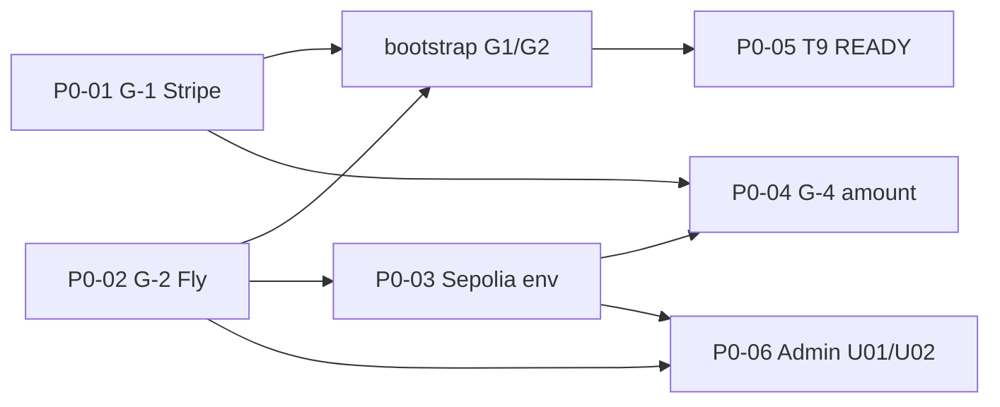

# TT-PHASE2-STAGING-P0-CLEARANCE-PLAN

> **SUPERSEDED · READ-ONLY · LEGACY** — Staging P0 计划内嵌 Pre–GovFreeze-V2 env 锚；**LEGACY** `TIMELOCK_ADDRESS` 等须与 GovFreeze V2 基线对读。**ACTIVE 读口：** [GOV-FREEZE-V2-SEPOLIA-BASELINE-FREEZE.md](../spec/governance-token/GOV-FREEZE-V2-SEPOLIA-BASELINE-FREEZE.md)

**阶段口径：** **① 本地 → ② 测试网（Staging + Sepolia）→ ③ 公网/生产**（须顺序；禁止跳阶）

**文档类型：** Phase ② · **Staging 全矩阵前 P0 清零执行计划**

**前置态（已达成）：**

| 项 | 结论 |
|----|------|
| Sepolia 序 1～5 主脊 | **PASS** · [TT-PHASE2-SEPOLIA-SYSTEM-ACCEPTANCE-REPORT](./TT-PHASE2-SEPOLIA-SYSTEM-ACCEPTANCE-REPORT.md) |
| 新增链上 broadcast | **暂停** · `PAUSED_BY_POLICY` |
| 社区 C1～C12 | **ALL PASS**（窄槽 · **不** 替代本计划 P0） |
| `TT_PHASE2_GO_VERDICT` | **NOT_MET**（本计划 **不** 宣称 Phase ② GO） |

**互指：** [TT-PHASE2-STAGING-READINESS-REPORT](./TT-PHASE2-STAGING-READINESS-REPORT.md) · [PHASE2-START-CHECKLIST](./PHASE2-START-CHECKLIST.md) · [PHASE2-G1-ENV-ISOLATION-DECISION](./PHASE2-G1-ENV-ISOLATION-DECISION.md) · [PHASE2-ADMIN-STAGING-ADM-U01-U02](./PHASE2-ADMIN-STAGING-ADM-U01-U02.md) · [protocol-convergence-deployments.v1.yaml](../../registry/protocol-convergence-deployments.v1.yaml)

**最后更新：** 2026-06-05

---

## 0 · 诚实边界

| 本计划 P0 清零 **完成后** | **仍不等于** |
|---------------------------|--------------|
| G-1/G-2 机读绿 + T9 `READY_FOR_C1_C12` | **Staging 全矩阵 GO** · **`TT_PHASE2_GO_VERDICT: GO`** |
| Admin `TT_PHASE2_ADMIN_STAGING: PASS` | **③ Production GO** · 主网真链 · 真 PSP |
| Sepolia env 注入 + HTTP 读链绿 | **ISS-007 / R-002 `--require-go`** 全站矩阵 |
| G-4 非零 amount 四方对拍 | **Escrow Sepolia 实例 E2E**（留 P1） |

**命名说明：** [PHASE2-START-CHECKLIST](./PHASE2-START-CHECKLIST.md) 中 **G-3** = 书面范围闸（**已 PASS**）。本计划 **P0-03** 指 Owner 所称「注入 Sepolia 序 1～5 env」— 与官方 G-3 **不同键**，下文一律称 **P0-03 · Sepolia env**。

---

## 1 · P0 总表与依赖

| 序 | ID | 目标 | 机读出口 | 依赖 |
|----|-----|------|----------|------|
| **1** | **P0-01 · G-1** | 真实 Stripe `sk_test_*` / `whsec_*` | `check-phase2-onboarding-staging-ready.sh` 不 FAIL secrets | Owner Dashboard |
| **2** | **P0-02 · G-2** | 持久 Fly HTTPS · `/health=200` | `curl $STAGING_API_BASE/health` → 200 | Fly 部署 |
| **3** | **P0-03 · Sepolia env** | Staging API 注入序 1～5 地址 + RPC | HTTP steward/redemption/country-ledger 对链 | P0-02 |
| **4** | **P0-04 · G-4** | 非零 `amount_minor` 四方对拍 | ONB-P2-004/005 · smoke 片段 | P0-01 + P0-02 |
| **5** | **P0-05 · T9** | Transition Audit | `TT_PHASE2_READY_VERDICT: READY_FOR_C1_C12` | P0-01 + P0-02 |
| **6** | **P0-06 · Admin** | ADM-U01→U02 六角色矩阵 | `TT_PHASE2_ADMIN_STAGING: PASS` | P0-02 + P0-03 |

**编排原则：** **P0-01 与 P0-02 可并行准备** → **`bootstrap-phase2-g1-g2.sh` 一次过 P0-01/02/05 机读** → **P0-03 随 Fly secrets 注入** → **P0-04 webhook 与 PI 闭环** → **P0-06 最后（须持久 FE + SEED_TEST_ACCOUNTS）**。



---

## 2 · Wave 0 · 准备（Owner · 单次）

### 2.1 文件模板（勿提交）

```bash
cp scripts/dev/staging-onboarding.env.example scripts/dev/.env.staging-onboarding.local
cp scripts/dev/staging-secrets.env.example scripts/dev/.env.staging-secrets.local
# 链上地址 SSOT（已 broadcast · 只读复制到 staging 清单）
# scripts/dev/.env.phase2-chain-deploy.local
```

### 2.2 G-1 决策书

[PHASE2-G1-ENV-ISOLATION-DECISION](./PHASE2-G1-ENV-ISOLATION-DECISION.md) **已签字（2026-06-03）** — **≠** 机读绿；须 **P0-01** 填真密钥后复验。

---

## 3 · P0-01 · G-1 Stripe 真实密钥

| 步 | 动作 | 负责 |
|----|------|------|
| 1 | Stripe Dashboard → **Test mode** → Developers → API keys → 复制 **`sk_test_…`** | Owner |
| 2 | 创建 Webhook 端点（见 §5）或 `stripe listen` → 复制 **`whsec_…`**（**独立**于 ① IT 合成值） | Owner |
| 3 | 写入 **`scripts/dev/.env.staging-secrets.local`**（**勿提交**） | Owner |

```bash
# scripts/dev/.env.staging-secrets.local
TRAVELTRUST_STRIPE_SECRET_KEY=sk_test_<REAL>
TRAVELTRUST_STRIPE_WEBHOOK_SECRET=whsec_<REAL>
# 可选 · staging 独立内网密钥
# INTERNAL_API_SECRET=<staging-only>
```

| 步 | 动作 |
|----|------|
| 4 | staging FE（Fly）注入 **`NEXT_PUBLIC_STRIPE_PUBLISHABLE_KEY=pk_test_…`**（与 sk_test **同账户**） |
| 5 | 确认 **无** prod `sk_live_*` / prod `whsec` 出现在 staging 文件 |

**清零判据：**

- `bootstrap-phase2-g1-g2.sh` 不在 `TRAVELTRUST_STRIPE_SECRET_KEY unset` 处 FAIL
- `check-phase2-onboarding-staging-ready.sh` **exit 0**

**阻塞 ID（当前）：** **B-G1-01** · **B-G1-02** — 见 [STAGING-READINESS §2.2](./TT-PHASE2-STAGING-READINESS-REPORT.md#22-g-1g-2-阻塞根因可机读)

---

## 4 · P0-02 · G-2 持久 Fly HTTPS

| 组件 | 要求 | 建议 |
|------|------|------|
| **API** | HTTPS · `GET /health` → **200** | `STAGING_API_BASE=https://<fly-api>.fly.dev` |
| **FE** | HTTPS · Admin Playwright / Checkout | `STAGING_FE_BASE=https://<fly-fe>.fly.dev` |
| **PG** | `traveltrust_staging` · **与 ① `traveltrust` 零共享** | Fly Postgres 或托管 PG |
| **migrate** | 空库 → 最新 migration | `record-phase2-g2-staging-sqlx-migrate-evidence.sh` |

### 4.1 Fly API 最低 env（与 onboarding 合并）

| 变量 | 值 / 规则 |
|------|-----------|
| `DATABASE_URL` | staging 专用 PG |
| `TRAVELTRUST_ONBOARDING_STRIPE_ENABLED` | `1` |
| `TRAVELTRUST_ONBOARDING_LOCAL_DEV` | **unset 或 `0`**（G-4 预备） |
| `SEED_TEST_ACCOUNTS` | **`1`**（Admin U01/U02 需要） |
| `TRAVELTRUST_ONBOARDING_STRIPE_ENABLED` | `1` |
| Stripe 密钥 | 来自 secrets · 或 Fly secrets 直注 |

### 4.2 更新 onboarding local

```bash
# scripts/dev/.env.staging-onboarding.local
API_BASE=https://<fly-api-host>
DATABASE_URL=postgresql://<user>:<pass>@<host>:5432/traveltrust_staging
TRAVELTRUST_ONBOARDING_STRIPE_ENABLED=1
# TRAVELTRUST_ONBOARDING_LOCAL_DEV=0   # 显式关零金额
# SEED_TEST_ACCOUNTS=1                 # Admin ② 需要
```

### 4.3 验证

```bash
curl -sf "https://<fly-api-host>/health" | head -c 200
# 期望 HTTP 200 · body 含 ok/healthy 语义
```

**禁止：** 用 **`*.loca.lt` 隧道** 或过期 tunnel URL 宣称 **P0-02 清零**（C 槽预演 **≠** 本计划 PASS）。

**阻塞 ID（当前）：** **B-G2-01** · **B-G2-02**

---

## 5 · P0-03 · Sepolia 序 1～5 env 注入（Staging API）

**SSOT 来源：**

- `scripts/dev/.env.phase2-chain-deploy.local`（序 1～5 已填）
- `registry/protocol-convergence-deployments.v1.yaml` · `environments.sepolia.addresses`

**须注入 Staging API（Fly secrets / staging `.env`）— 最低集：**

| 变量 | Sepolia 值（2026-06-05） | 用途 |
|------|--------------------------|------|
| `CHAIN_RPC_URL` | `https://sepolia.drpc.org`（或 Owner RPC） | 读链 |
| `CHAIN_ID` | `11155111` | meta / 校验 |
| `GOVERNANCE_TOKEN_ADDRESS` | `0xaC2E29AC7089e4863C21dAF232cF8bbb025d91ca` | governance |
| `GOVERNOR_ADDRESS` | `0xa79c8df5C225825f6d04a497043dB0F1995B55ae` | governance |
| `TIMELOCK_ADDRESS` | `0x0359d4fB9c4B9f69188A1E9AE2202ABfeD1fEe8f` | 控制面 |
| `ESCROW_FACTORY_ADDRESS` | `0xbf746B6a330e61416c6D87aB9b0758f7107C8006` | escrow |
| `FEE_ROUTER_ADDRESS` | `0x81A8009210c5215100564c6E4123F672c4459306` | fee / escrow PI |
| `REGION_STEWARD_STAKE_POOL_ADDRESS` | `0x16F914f3D50f7Aa02665589e715F94CA3b7Ab47c` | stake-quote |
| `COUNTRY_POOL_REDEMPTION_EPOCH_CN_ADDRESS` | `0x712050e4b1517C3f3ab39B32Cabb70CC0E1C0829` | redemption |
| `COUNTRY_POOL_LEDGER_PILOT_ADDRESS` | `0x63bd7d5ee5c5dde707e5e65303f3876267c78e97` | ledger pilot |
| `COUNTRY_POOL_LEDGER_ADDRESS` | `0x63bd7d5ee5c5dde707e5e65303f3876267c78e97` | API alias（= pilot） |
| `REDEMPTION_ASSET_ADDRESS` | `0x4825693A7B333B8b2b73ad5632C60A9b7cAa51F9` | epoch asset |

**建议同批注入（FundStack 读面 / meta · env-only）：**

`REGION_VAULT_ADDRESS` · `TREASURY_ADDRESS` · `RESERVE_VAULT_ADDRESS` · `GUIDE_STAKING_POOL_ADDRESS` · `PROVIDER_STAKING_POOL_ADDRESS` · `FUND_STACK_TOKEN_ADDRESS` · `COUNTRY_LEDGER_SSOT_TOKEN_ADDRESS` — 见 `.env.phase2-chain-deploy.local`。

**部署后动作：**

1. **重启** staging API（env 热加载不可靠）
2. HTTP 探针（对 `$STAGING_API_BASE`）：

```bash
curl -sf "$STAGING_API_BASE/api/v1/steward/stake-quote?jurisdictions=CN"
curl -sf "$STAGING_API_BASE/api/v1/redemption/quote?jurisdiction=CN"
curl -sf "$STAGING_API_BASE/api/v1/governance/country-ledger/DE"
curl -sf "$STAGING_API_BASE/api/v1/governance/protocol-reference" | head -c 400
```

3. 可选复跑 Sepolia 链验收（**无新 deploy**）：

```bash
export API_BASE="$STAGING_API_BASE"
export PHASE2_VERIFY_RPC_URL=https://sepolia.drpc.org
bash scripts/dev/phase2-sepolia-system-acceptance.sh
# 期望 http_live 改善 · 末行 PASS
```

**清零判据：** 上列 HTTP **200** · country-ledger/DE **非** empty/error · **P1-API-01** protocol-reference 版本漂移可单独 follow-up

---

## 6 · 一键机读 · P0-01 + P0-02 + P0-05（bootstrap）

**在 P0-01 密钥 + P0-02 Fly URL 就绪后：**

```bash
export STAGING_API_BASE=https://<fly-api-host>
# 勿用 STAGING_USE_LOCAL_TUNNEL=1 作为本计划清零证据

bash scripts/dev/bootstrap-phase2-g1-g2.sh
```

**期望 exit 0 与末行：**

| 输出 | 含义 |
|------|------|
| `TT_PHASE2_G2_STAGING_MIGRATE: OK` | G-2 migrate 证据 |
| `TT_CHECK_PHASE2_ONBOARDING_STAGING: OK` | G-1/G-2 onboarding 就绪 |
| `TT_PHASE2_READY_VERDICT: READY_FOR_C1_C12` | **P0-05 T9 清零** |

**证据目录：** `evidence/GO_phase2_testnet_20260526/transition-audit/latest/`

**若 T9 仍 FAIL：** 读 `run-phase1-to-phase2-transition-audit.sh` 日志中失败锚（常见：04 路由漂移 · health 非 200 · secrets 占位）— **逐项回修 P0-01/02**，**禁止** 跳阶宣称 T9 绿。

---

## 7 · P0-04 · G-4 非零 amount_minor

**前置：** P0-01 · P0-02 · staging API **`TRAVELTRUST_ONBOARDING_LOCAL_DEV=0`**

| 步 | 动作 | 出口 |
|----|------|------|
| 1 | Stripe Dashboard Webhook → `https://<fly-api>/api/v1/hooks/stripe/onboarding` · 事件含 `payment_intent.succeeded` | **P0-07 webhook** 与 G-4 同批 |
| 2 | staging 创建 provider onboarding · 选 **US**（示例 **29900** minor） | ONB-P2-001 |
| 3 | 完成 test 卡支付 | ONB-P2-004 |
| 4 | 机读四方对拍：quote · PI · entitlement · **`PaymentIntent.amount`** | ONB-P2-005 |
| 5 | 全链 smoke | `bash scripts/dev/smoke-onboarding-testnet.sh` |

**清零判据：**

- `amount_minor` **≠ 0** · 与 `fee_schedule_v1` computed 一致
- ONB-P2-005 断言 **exit 0**（staging）
- **无** staging 进程 env 中 `TRAVELTRUST_ONBOARDING_LOCAL_DEV=1`

**阻塞 ID：** **B-G4-01**

---

## 8 · P0-06 · Admin ADM-U01/U02 六角色矩阵

**前置：** P0-02 持久 Fly · P0-03 Sepolia env（Admin 链上读面可选但推荐）· **`SEED_TEST_ACCOUNTS=1`**

| 步 | 命令 / 文档 | 出口 |
|----|-------------|------|
| 1 | 设持久闸 | `ADM_U01_REQUIRE_PERSISTENT_HOST=1` · `ADM_U02_REQUIRE_PERSISTENT_HOST=1` |
| 2 | 一键编排 | `bash scripts/dev/record-phase2-admin-adm-u01-then-u02.sh` |
| 3 | 合并校验 | `bash scripts/gates/validate-phase2-admin-staging-closure.sh` |

```bash
export STAGING_API_BASE=https://<fly-api-host>
export STAGING_FE_BASE=https://<fly-fe-host>
export STAGING_DATABASE_URL=postgresql://<user>:<pass>@<host>:5432/traveltrust_staging
export ADM_U01_REQUIRE_PERSISTENT_HOST=1
export ADM_U02_REQUIRE_PERSISTENT_HOST=1
export ADM_U01_NO_LOCAL_FE_FALLBACK=1

bash scripts/dev/record-phase2-admin-adm-u01-then-u02.sh
bash scripts/gates/validate-phase2-admin-staging-closure.sh
```

**六角色（探针 SSOT）：** SuperAdmin · Ops · CS · Risk · Finance · Auditor — [registry/admin-rbac-staging-probes.v1.yaml](../../registry/admin-rbac-staging-probes.v1.yaml)

**清零判据：**

| 步 | 末行 / artifact |
|----|-----------------|
| U01 | `TT_ADM_U01_EVIDENCE: PASS` · `adm-u01-report.json` → `release_gate: GO` |
| U02 | `TT_ADM_U02_STAGING_EVIDENCE: PASS` · `adm-u02-report.json` → `GO` |
| 合并 | **`TT_PHASE2_ADMIN_STAGING: PASS`** · `closure-report.json` |

**证据根：** `evidence/GO_phase2_admin_staging_closure/latest/`

**禁止：** `evidence/GO_staging_admin_rbac_matrix/run_adm_u01_close_20260603/`（tunnel 预演）**冒充** P0-06 清零。

---

## 9 · P0 清零总 checklist（Owner 勾选）

| ☐ | ID | 清零判据 | 证据 / 命令 |
|---|-----|----------|-------------|
| ☐ | **P0-01** | 真 `sk_test_*` + `whsec_*` 写入 secrets | `.env.staging-secrets.local` |
| ☐ | **P0-02** | Fly API `/health=200` · FE HTTPS · staging PG migrate | `curl $STAGING_API_BASE/health` |
| ☐ | **P0-03** | Sepolia 序 1～5 env 注入 + API 重启 | HTTP 四路由 200 · 见 §5 |
| ☐ | **P0-04** | 非零 amount · ONB-P2-004/005 | smoke / 对拍脚本 exit 0 |
| ☐ | **P0-05** | `TT_PHASE2_READY_VERDICT: READY_FOR_C1_C12` | `bootstrap-phase2-g1-g2.sh` |
| ☐ | **P0-06** | `TT_PHASE2_ADMIN_STAGING: PASS` | U01→U02 编排 + validate |
| ☐ | **Webhook** | Stripe 真投递闭环 ONB-P2-003 | Dashboard + staging 日志 |

**全部 ☑ 后：** 可宣称 **Staging 全矩阵 P0 闸已清** · **仍须** 宽轨 P1（Escrow E2E · ISS-007 边界 · `TT_PHASE2_GO_VERDICT`）另闸 · **仍 ≠ ③**

---

## 10 · 建议执行日历（单维护者）

| 日次 | 焦点 | 产出 |
|------|------|------|
| **D0** | P0-01 Stripe + P0-02 Fly 骨架部署 | secrets 填毕 · `/health=200` |
| **D1** | `bootstrap-phase2-g1-g2.sh` + P0-03 Sepolia secrets | T9 READY · HTTP 读链绿 |
| **D2** | Webhook + P0-04 G-4 支付对拍 | ONB-P2-004/005 证据 |
| **D3** | P0-06 Admin U01→U02 | `TT_PHASE2_ADMIN_STAGING: PASS` |
| **D4** | 汇总证据 · 更新 STAGING-READINESS 状态行 | 准备宽轨 P1 backlog |

---

## 11 · 机读摘要（计划态）

```text
TT_PHASE2_STAGING_P0_CLEARANCE: PARTIAL (2026-06-05T10:54Z)
P0-01 G-1 Stripe: PASS (sk_test validated · whsec set)
P0-02 G-2 Fly HTTPS: OPEN — fly.io unreachable from dev env; interim tunnel API_BASE patched by bootstrap
  canonical target: https://tt-api-staging.fly.dev
  Owner: fly auth login && PHASE2_STAGING_FLY_DEPLOY=1 bash scripts/dev/phase2-staging-fly-deploy-and-sync.sh
P0-03 Sepolia env: PASS (merged into onboarding.local · local API steward/redemption HTTP 200)
bootstrap-phase2-g1-g2.sh: exit 0 · TT_CHECK_PHASE2_ONBOARDING_STAGING: OK
T9 transition audit: NOT_READY (04 routes drift: /me/role-applications · /me/wallets — fix before C1-C12 GO)
next: Fly deploy → patch API_BASE → fix 04 §3.4 → re-run transition audit → C1-C12 matrix
```

---

## 12 · 变更记录

| Date | Note |
|------|------|
| 2026-06-05 | 初版：Sepolia PASS 后 Staging P0 清零顺序 · G-1/G-2/G-4/T9/Admin/Sepolia env |

---

**End of TT-PHASE2-STAGING-P0-CLEARANCE-PLAN · ② Staging P0 清零 · 非 ③ GO · 链上 broadcast 仍暂停**
