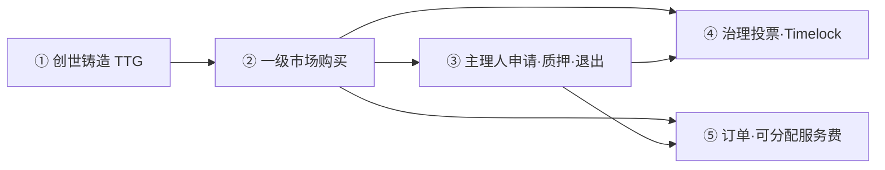
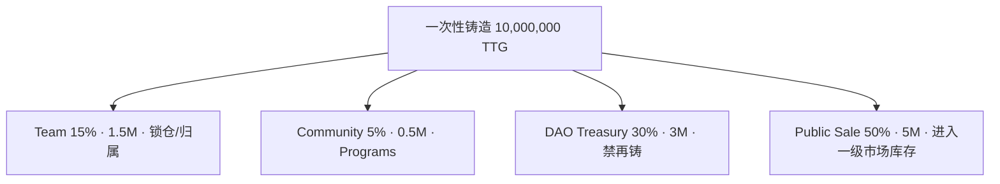
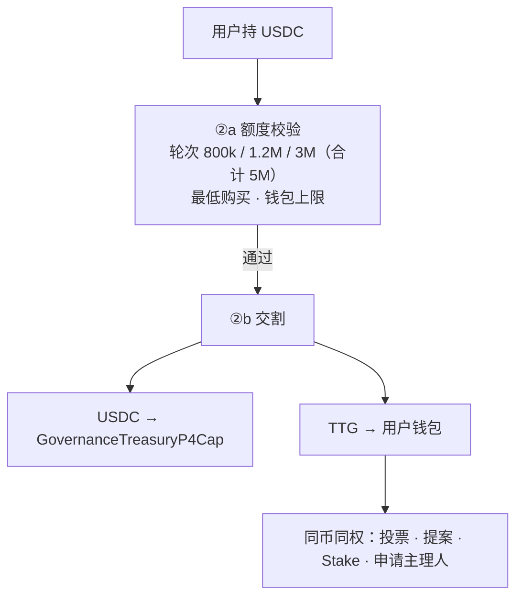
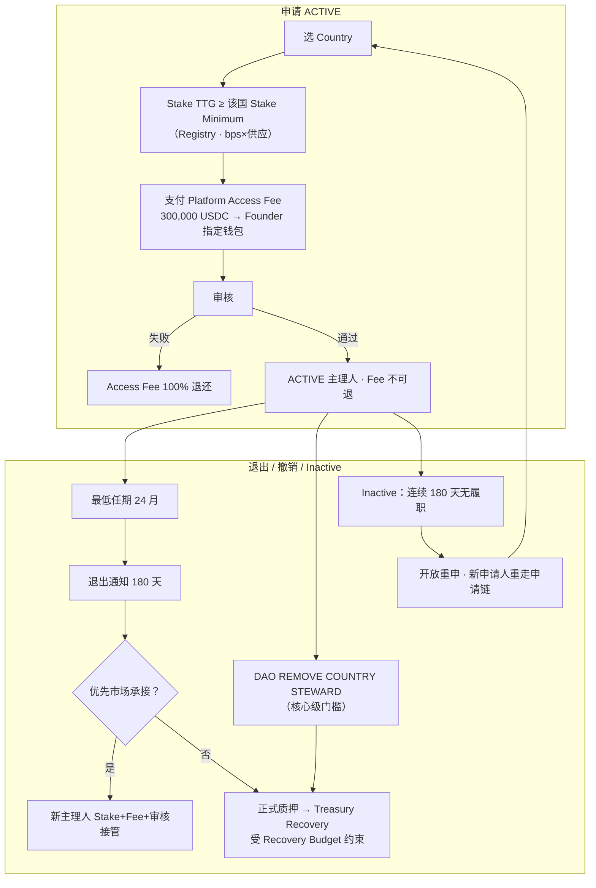
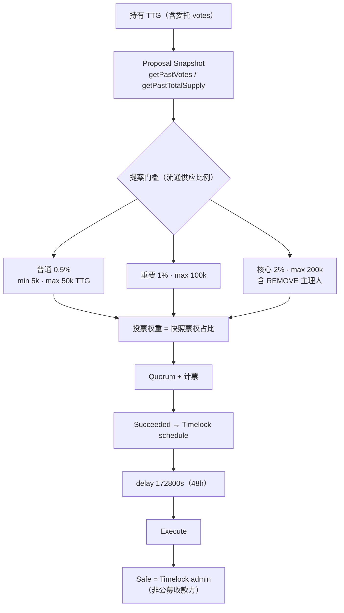
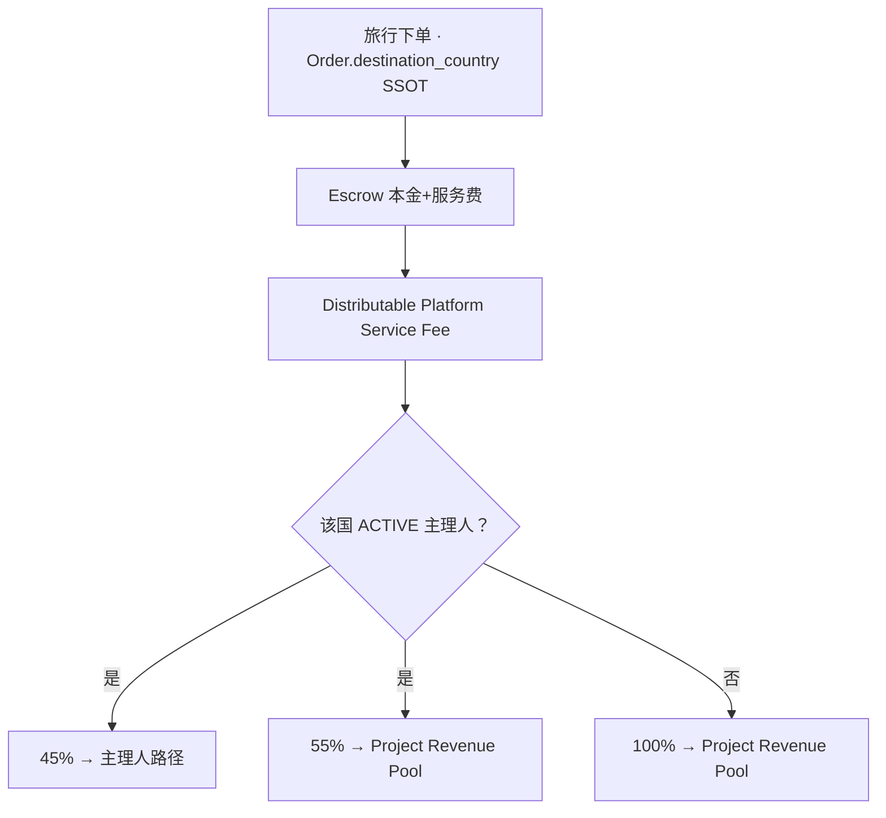

# TravelTrust Web3 · 中文分步流程图 L5（V3.1.1）

> **Official Product Truth（活面）：** TravelTrust Official · **OPS-2026.08.20-v9** (`3e356617` / `2026-08-20T00:51:57Z` / `hybrid-…-v9`) · API `8df2ab21…` · historical `daa5ae87` SUPERSEDED · SSOT [`TT-OFFICIAL-LIVING-PIN-INDEX-LATEST`](./TT-OFFICIAL-LIVING-PIN-INDEX-LATEST.md)

**Machine:** `TT_WEB3_L5_FLOW_V311`  
**SSOT 宪章:** [TT-ECONOMIC-CONSTITUTION-V3.1.1-FINAL.md](../spec/governance-token/TT-ECONOMIC-CONSTITUTION-V3.1.1-FINAL.md) · **LOCKED**  
**Visual:** `assets/traveltrust-web3-l5-flow-v311.png`（相对仓库：可复制至 `docs/spec/governance-token/` 存档）  
**Recorded:** 2026-07-18  
**Status:** L5 · 机读 + 图面双真源

> **读图纪律：** Genesis V2 = **供应结构 LEGACY 对照**（10M 一次铸造仍同构）；**经济目标 / 主理人 / 投票 / 退出** 一律以 **V3.1.1** 为准。  
> 公募 USDC → **P4Cap**（≠ Safe）。Safe = Timelock **admin**。  
> FeeRouter 平台费 45/55 与主理人 Distributable 45/55 **正交**。

---

## 0 · 总览（五段）

---

## ① 创世铸造（一次 10M · 禁增发）

---

## ② 一级市场（USDC→TTG）

---

## ③ 国家区域主理人（申请 = 质押 + Access Fee）

| Access Fee 退款 | |
|----------------|--|
| 审核失败 | **100% 退** |
| 通过 / 退出 / REMOVE / Inactive 重申 | **不可退** |

---

## ④ 治理投票（按持有治理币票权比例）

**纪律：** 同币同权；票权 = Snapshot 时持仓/委托比例，**不是**身份特权。主理人有提案权，通过与否由 DAO 决定。

---

## ⑤ 订单与可分配服务费

**正交：** FeeRouter 平台费分账（历史 45/55 国池叙事）≠ 本章 Distributable 主理人分成。

---

## L5 相对旧图新增点

| 主题 | L5 表现 |
|------|---------|
| 申请主理人 | Stake Minimum + 30万 Access Fee + 审核退款表 |
| 退出 | 24月 · 180天通知 · 市场承接优先 · Recovery Budget |
| REMOVE / Inactive | DAO 核心提案 · 180天失联重开 |
| 投票 | 快照票权比例 + 三级门槛钳制 |
| 公募收款 | 明确 P4Cap ≠ Safe |
| 归因 | `Order.destination_country` |

---

## 相关实现（① 本地已对齐 · 非冒充 ③ GO）

- Stake：`RegionStewardStakePool.stakeMinimumTtg` · `registry/v311-stake-minimum-by-country.v1.yaml`
- 门槛：`V311DaoProposalThresholds` · `TravelTrustGovernor.propose(tier)`
- 退出语义：`V311StewardLifecycle` · `registry/v311-steward-lifecycle.v1.yaml`
- Access Fee：`registry/v311-platform-access-fee.v1.yaml` · `access_fee_refund_v311`
- 分成：`V311DistributableSplit` 45/55 · 100% Pool
