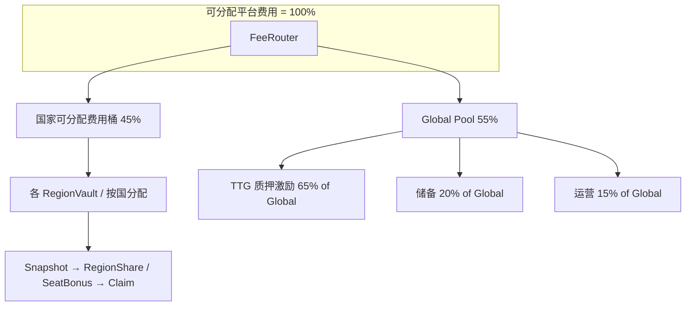

# 08-4 附录 — 收益流闭环图（FeeRouter · Target）

**用途**：落实 [08-4-对外口径包](08-4-对外口径包.md) **第 2 章**「企业级须补齐一页**收益流闭环图**」中，与 **可分配订单手续费** 相关的 **Target** 扩展路径；可直接 **复制到 PPT / PDF / 官网说明**（须与法务定稿后的对外话术一致）。  
**状态**：`Target`（链上 FeeRouter 未部署前以合约为准）  
**参数单源**：[83-区域治理与收益分配-协议白皮书](83-区域治理与收益分配-协议白皮书.md) **§3**、[84-第一阶段10国Country-Pool发行参数总表](84-第一阶段10国Country-Pool发行参数总表.md) **§一**；**「可分配费用 100%」分母与 gas/仲裁/slash 正交**见 **84 §1.1.1**、[Runbook](../../ops/RUNBOOK.md) **§7.1**（与 [08-4 第 2 章](08-4-对外口径包.md) 扩展条一致）。  
**版本**：1.0.3  
**最后更新**：2026-03-31  

### 读前摘要

| 你要找什么 | 单源 |
|------------|------|
| **与 Escrow 本金、仲裁、slash 的边界** | **§1 范围说明** |
| **一页 Mermaid 总图** | **§2** |
| **参数与分母 SSOT** | **[83 §3](83-区域治理与收益分配-协议白皮书.md)、[84 §1.1.1](84-第一阶段10国Country-Pool发行参数总表.md)、[Runbook §7.1](../../ops/RUNBOOK.md)** |
| **对外话术与证券隔离** | **[08-4 第 2 章](08-4-对外口径包.md)**、**governance-token LEGAL-SIGNOFF** |
| **§2 百分数 ↔ API 镜像机读** | **`scripts/check-governance-doc-linkage.sh`**：§2 **Mermaid** 节点 **45/55**、**Global 65/20/15** 锚点与 **`governance_doc_reference::protocol_reference_json`**（04 **`GET …/governance/protocol-reference`**）交叉校验；改本图或镜像须同 PR **`cargo test -p traveltrust-api` `routes::governance_doc_reference`** |

---

## 1. 范围说明（必读）

- 本图描述的是 **订单完成、平台收取的可分配手续费**（进入 **FeeRouter** 的基数 = **100%**），**不是** Escrow 内游客/向导订单本金；**本金**仍按 Escrow 合约释放，与本图并行独立。**100% 的闭合定义**（含 **不扣减** 用户自付 **L1/L2 gas**）见 **[84 §1.1.1](84-第一阶段10国Country-Pool发行参数总表.md)**。
- **仲裁费、向导质押罚没（如 `Staking.slash`）** 与上图 **45/55** **正交**；归宿与科目见 **[Runbook](../../ops/RUNBOOK.md) §7.1** 专表、[08-4](08-4-对外口径包.md) 第 2 章；**不得**与本图混为一条线而不加脚注。
- **对外披露**：任何「质押 TTG 参与分配」表述须通过 [08-4](08-4-对外口径包.md) 证券隔离与 [governance-token/LEGAL-SIGNOFF-CHECKLIST](governance-token/LEGAL-SIGNOFF-CHECKLIST.md)。

---

## 2. 一页总图（Mermaid）



---

## 3. ASCII 备用（纯文本环境）

```text
                    可分配平台费用（FeeRouter 入账）= 100%
                                      │
                    ┌─────────────────┴─────────────────┐
                    ▼                                   ▼
        国家可分配费用桶 45%                    Global Pool 55%
                    │                                   │
        ┌───────────┴───────────┐           ┌───────────┼───────────┐
        ▼                       ▼           ▼           ▼           ▼
  各 RegionVault          Snapshot     TTG 质押    储备 20%    运营 15%
  （按国/区）           RegionShare      激励 65%   （of Global）（of Global）
                        SeatBonus
                        → Claim
```

---

## 4. 占「可分配费用 100%」的合成分解（便于投资人表）

| 路径 | 占可分配费用（约） | 备注 |
|------|-------------------|------|
| 国家桶合计 | **45%** | 各国再分见 **84** 主表「费用百分点」 |
| → Global → TTG 质押 | **55% × 65% ≈ 35.75%** | 须与对外话术区分「激励」vs「分红」 |
| → Global → 储备 | **55% × 20% = 11%** | 科目细分见治理 / Runbook |
| → Global → 运营 | **55% × 15% = 8.25%** | 同上 |

---

## 5. 与 08-4「收益证券隔离」对齐的检查句（内部用）

- 本图**不**构成「购买 TTG = 购买股权/固定股息」的表述依据。  
- 若对外介绍 **Country Pool / RegionShare**，须同步 **83** 风险披露与 **84** 免责声明。  

---

## 6. 变更记录

| 版本 | 日期 | 说明 |
|------|------|------|
| 1.0.3 | 2026-03-31 | **读前摘要** 增 **§2 ↔ `protocol-reference`** 机读行；**`check-governance-doc-linkage.sh`** 增 **§2 Mermaid** 五节点 **`grep -F`** + **`governance_doc_reference`** **45/55·65/20/15** 交叉锚点（与 **07 §二 2.4 CI 基线** 同批叙述）。 |
| 1.0.1 | 2026-03-26 | 文首参数单源与 **§1** 互链 **84 §1.1.1**、**Runbook §7.1**（分母与正交路径闭合）。 |
| 1.0.0 | 2026-03-26 | 初版：45/55、Global 65/20/15、Mermaid+ASCII、合成分解表；与 08-4 §2 配套。 |

---

*本文与 [08-4-对外口径包](08-4-对外口径包.md) 第 2 章、[83](83-区域治理与收益分配-协议白皮书.md)、[84](84-第一阶段10国Country-Pool发行参数总表.md) 配套。*
