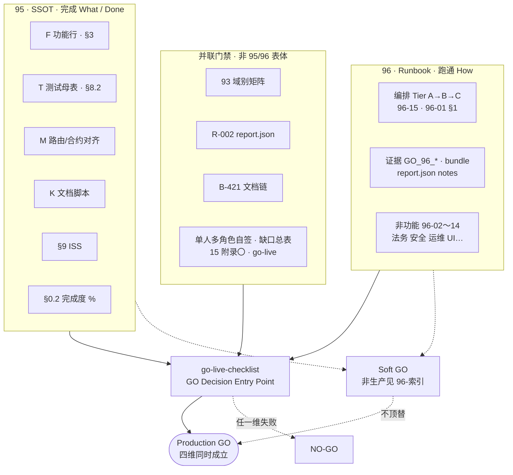
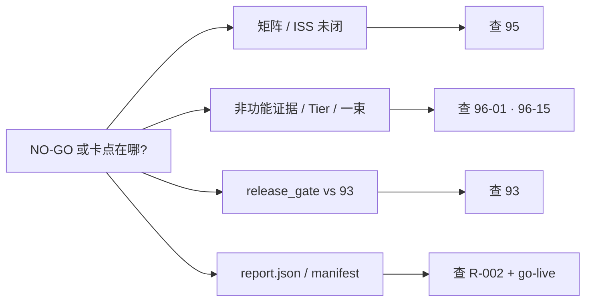

# 95 + 96 · 系统架构一览（一眼图）

**Version:** 1.0.2  
**Status:** Living — **图示 SSOT 在本文件**；条款真值仍以 **[95](95-全链路生产就绪检查清单与完成度矩阵.md)**、**[96-索引](96-索引-全链路外生产验收分册.md)**、**[go-live-checklist.md](../go-live-checklist.md)** 为准。  
**Parent：** 与 **[96-索引 · Declaration](96-索引-全链路外生产验收分册.md#95-96-execution-linkage-declaration)**、**[96-索引 · Why 96](96-索引-全链路外生产验收分册.md#96-core-value-why)** 并联。  
**本地验证（GitHub CI 非必须）：** **[TT-9600](../runbook/TT-9600-96-HUB-LOCAL-VERIFICATION-PACK.md)** — 分册 **P0/P1/P2** 索引、**`evidence/`** 模板、脚本入口、**NO-GO** 总表；与 **93 / R-002 / B-421** 并联读图。

---

## 1. 总览（双轨 + 收口）

**读图要点**

- **左轨 95**：只回答 **「做完了没有」**（状态真值）。  
- **右轨 96**：回答 **「怎么跑、证据在哪、非功能过没过」**（编排 + 证据 + NFR）。  
- **下方门禁**：**93 / R-002 / B-421 / 签字** 与 **95、96 正交并联**，**不**写进 **95** 的 F 表体。  
- **收口**：唯 **`go-live`** 的 **GO Decision** 把四维合成 **Production GO**；**Soft GO** 仅 **staging/demo/路演**，见 **[96-索引 · Soft GO](96-索引-全链路外生产验收分册.md#soft-go-non-production)**。  
- **不依赖在线 CI**：执行清单与命令以 **[TT-9600](../runbook/TT-9600-96-HUB-LOCAL-VERIFICATION-PACK.md)** 为准（与 **96-索引** 文首、「**附 · 本地验证收口包**」互证）。  
- **多重身份（账号 vs 向导 DID）**：图示不展开字段表；条款真值以 **[64 §五](64-申请向导-行业标准与DID检查清单.md#五钱包与账号体系多钱包--换绑--向导-vs-旅行者)** 为 SSOT，与 **[93 §1](93-全站功能验证矩阵-域别回归清单.md#1-a-域--账号--注册--登录--me--密码--邮箱)**、**[96-17](96-17-多重身份与钱包真值.md#identity-multi-wallet-ssot)**、**[97](97-登录找回密码钱包态企业级审计清单.md)** 读前摘要一致。

---

## 2. NO-GO 归因（与总览对照）

细则表见 **[96-索引 · NO-GO 归因](96-索引-全链路外生产验收分册.md#nogo-attribution)**。

---

## 3. 变更记录

| Version | 日期 | 摘要 |
|---------|------|------|
| 1.0.2 | 2026-04-27 | **读图要点**：补 **多重身份** 与 **64 / 93 §1 / 96-17 `#identity-multi-wallet-ssot` / 97** 互指（不替代 **64 §五** 正文）。 |
| 1.0.1 | 2026-04-25 | 文首 + **读图要点** 互指 **[TT-9600](../runbook/TT-9600-96-HUB-LOCAL-VERIFICATION-PACK.md)**（本地验证、**CI 非必须**）。 |
| 1.0.0 | 2026-04-25 | 初版：总览图 + NO-GO 归因简图。 |

---

**End of 95-96-系统架构一览**
