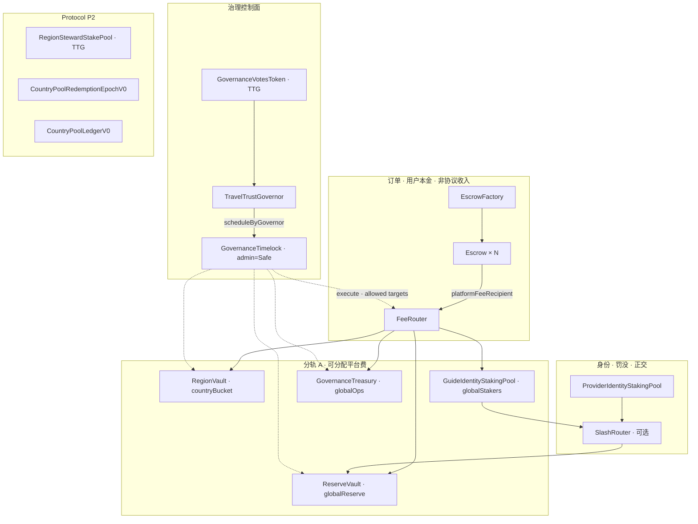

# 99 — 链上合约与池子总览（企业级 · L5 SSOT）


> **STATUS (V9 Documentation Truth Convergence · phase-2):** **SUPERSEDED as Official ACTIVE V9 path** · **DO_NOT_USE_AS_ACTIVE_TRUTH** · **HISTORICAL**.  
> Sole living upstream: [`TT-TTG-V9-DOCUMENTATION-TRUTH-BASELINE-LATEST`](TT-TTG-V9-DOCUMENTATION-TRUTH-BASELINE-LATEST.md) · Design Lock **DL_R1** · Mainnet `DEPLOYED_PENDING_CUTOVER` / `TIMELOCK_CUTOVER_PENDING` · **≠** `MAINNET_FULLY_ACTIVE` · **≠** `TT_PRODUCTION_GO`.  
> Public-sale USDC→P4Cap · globalStakers 35.75% · R2_FINAL/Remint · Safe/old Timelock as V9 Official admin = **LEGACY / SUPERSEDED**. Evidence retained.

**Version:** 1.1.0  
**最后更新：** 2026-06-05  
**文档编号：** 99  
**Tier：** **L5（对内链域总览 · 维护入口 · 审计可对拍）**  
**阶段口径：** **① 本地 → ② Sepolia 测试网 → ③ 主网/Production**  
**状态：** **ACTIVE** — 描述 **设计与代码真源**；**已部署地址**以 **② `registry`** 为准；**≠ ③ Production GO**  
**受众：** 合约、后端、前端/DApp、运维、审计、产品、法务（链上边界）  
**维护责任：** 工程 Owner（Sebastian Ward）；**动 `contracts/src` / 部署序 / 控制面 / 升级路径** → **同批** 更新本文 **§五～§十三** + **[registry/protocol-convergence-deployments.v1.yaml](../../registry/protocol-convergence-deployments.v1.yaml)** + 受影响 **[14](14-合约-API-ABI-前后端对齐.md)** 行

> **SSOT（必读）**  
> - **契约表体 / HTTP 路由 / ABI 字节**：**[14 §1.1](14-合约-API-ABI-前后端对齐.md)** + **`contracts/abi/`** + **`run-check-04-routes`**  
> - **分轨 A/B 硬约束 / 防混账**：**[91](91-协议金库与资金池-技术索引.md)**  
> - **协议数值（bps/锁仓/辖区）**：**[governance-token/protocol-ssot.v1.md](governance-token/protocol-ssot.v1.md)** — **禁止** 在本文硬编码冲突数字  
> - **③ 终验签字**：**[96-07](96-07-链上资金与合约终验.md)** · **[go-live-checklist](../go-live-checklist.md)**  
> - **Forge 命令**：**[contracts/README.md](../../contracts/README.md)**  
> - **诚实边界**：① 绿 / ② pregate 绿 **≠** ③ 主网真链 GO；**R-01** 外部审计 **OPEN** 时 ② 窄广播可 proceed，**③ 前须关**

---

## §0 读前摘要（30 秒定位）

| 你要找什么 | 单源（本文章节） |
|------------|------------------|
| **③ 运营总图（角色×功能×合约×池×Wave×Evidence）** | **[WEB3-SYSTEM-MASTER-MAP-V1](../runbook/WEB3-SYSTEM-MASTER-MAP-V1.md)** · **机读：** [web3-system-master-map.v1.yaml](../../registry/web3-system-master-map.v1.yaml) |
| **全合约清单 + 实现态** | **§五** 总表 · **§六** 实现态矩阵 |
| **有几个池 / 金库 · 别混账** | **§四** · 分轨详 **[91 §二～§四](91-协议金库与资金池-技术索引.md)** |
| **Sepolia 部署顺序与 env** | **§七** · **[TT-PHASE2-CHAIN-DEPLOYMENT-GATE](../runbook/TT-PHASE2-CHAIN-DEPLOYMENT-GATE.md)** |
| **② FundStack 默认接线（四腿落哪）** | **§八** — **`DeployFundStackUnderTimelock.s.sol` 代码真源** |
| **谁能调什么（权限）** | **§九** 权限矩阵 |
| **怎么升级 /  immutable 什么** | **§十** |
| **事件 · indexer · API** | **§十一** |
| **L5 审计 / 本地闸** | **§十二** |
| **缺口 · Target 登记** | **§十三** |

---

## §1 L5 十维覆盖矩阵（企业级自检）

| # | 维度 | 本文覆盖 | 更深 SSOT |
|---|------|----------|-----------|
| 1 | **架构分层 / 资金流** | §三 · §四 | [02 §十](02-架构设计.md) · [91](91-协议金库与资金池-技术索引.md) |
| 2 | **合约全集与职责** | §五 · §六 | `contracts/src/` · [14 §1.1](14-合约-API-ABI-前后端对齐.md) |
| 3 | **部署序与环境** | §七 · §八 | [registry](../../registry/protocol-convergence-deployments.v1.yaml) · runbook |
| 4 | **控制面 R-02** | §七 · §九 | `Phase2ControlPlane.sol` |
| 5 | **升级 / 变更类型** | §十 | [Runbook §7](../../ops/RUNBOOK.md) · B-407 |
| 6 | **权限 / 多签 / Timelock** | §九 | [TT-PHASE2-GOVERNANCE-SAFE-EXECUTION-PLAN](../runbook/TT-PHASE2-GOVERNANCE-SAFE-EXECUTION-PLAN.md) |
| 7 | **事件 · 索引 · 对账** | §十一 | [36](36-区块链事件与状态机完整文档.md) · [110](110-阶段开发链上索引器与事件同步器.md) |
| 8 | **API · env · 前端 ABI** | §十一 | [04 §3.4](04-后端与API.md) · `check-55-s13.sh` |
| 9 | **测试 · 证据** | §十二 | `contracts/test/` · `evidence/GO_*` |
| 10 | **阶段 · 风险 · 缺口** | §二 · §十二 · §十三 | [96-07](96-07-链上资金与合约终验.md) · R-01/R-02/R-03 |

---

## §2 阶段与风险闸（禁止跳阶）

| 阶段 | 链上范围 | 本文用法 |
|------|----------|----------|
| **① 本地** | Anvil · `Deploy.s.sol` · forge test | 允许 deployer 任 admin/guardian；**不可** 冒充 ②③ |
| **② Sepolia** | `DeployGovernanceStack` → `DeployFundStackUnderTimelock` → P2 脚本 | **当前广播目标**；地址填 registry |
| **③ 主网** | 同架构 · 生产 delay/多签/审计 | **须** R-01 关 · go-live 签字 |

| 风险 ID | 项 | ② 要求 | ③ 要求 |
|---------|-----|--------|--------|
| **R-01** | 第三方合约审计 | **OPEN 可 proceed**（窄广播） | **必须关闭** |
| **R-02** | 控制面 ≠ deployer EOA | Safe admin · guardian/owner → Timelock | 同左 + 运维 cast 验证 |
| **R-03** | registry 地址对拍 | 广播后 **15 分钟内** 填 `addresses.*` | Explorer verified + 台账 |

**机读闸（② broadcast 前）：**

```bash
bash scripts/gates/check-phase2-chain-deployment-gate.sh
bash scripts/gates/check-protocol-convergence-pregate.sh
bash scripts/gates/check-phase2-chain-broadcast-pregate.sh
bash scripts/dev/phase2-sepolia-deploy-dry-run.sh
```

---

## §3 架构分层（四条正交资金流）



| # | 路径 | 代币 | 模块 | 会计分轨 |
|---|------|------|------|----------|
| 1 | **订单托管** | USDC/USDT 等 | `Escrow` | 用户本金 · **禁止** 计入协议收入 |
| 2 | **可分配平台费** | 稳定币 | `Escrow` → `FeeRouter.distribute` | **分轨 A** · [83](83-区域治理与收益分配-协议白皮书.md)/[84](84-第一阶段10国Country-Pool发行参数总表.md) |
| 3 | **治理/融资金库** | TTG + 可选稳定币 | `GovernanceTreasury` | **分轨 B** · [91 §三](91-协议金库与资金池-技术索引.md) |
| 4 | **身份 / Seat 抵押** | 稳定币 · TTG | 双身份池 · `RegionStewardStakePool` | 与 FeeRouter **正交** · [81](81-经济模型-向导质押与订单押金.md) |

**经典误读（审计必问）：** 把 Escrow 余额、FeeRouter 暂存、Treasury 余额、RegionVault 余额说成「一个协议金库总池」→ **错**（见 **[91 §4.4](91-协议金库与资金池-技术索引.md)**）。

---

## §4 池子与金库一览（运维数法）

| 名称 | 合约 | 实例数 | 持有什么 | 受控入口 |
|------|------|--------|----------|----------|
| 治理金库 | `GovernanceTreasury` | 1 | TTG/ERC20/ETH | **`spend`/`spendETH` 仅 spender=Timelock** |
| 国家桶 | `RegionVault` | 1（MVP） | 稳定币 | **`forward` 仅 owner** |
| FeeRouter 暂存 | `FeeRouter` | 1 | 待分配稳定币 | **`distribute` 仅 owner** |
| 罚没准备金 | `ReserveVault` | 1 | 稳定币 | **`withdraw` 仅 Timelock** |
| Guide 身份池 | `GuideIdentityStakingPool` | 1 | 稳定币质押 | stake/withdraw/slash |
| Provider 身份池 | `ProviderIdentityStakingPool` | 1 | 稳定币质押 | 同上 · **独立地址** |
| 主理人 TTG 池 | `RegionStewardStakePool` | 1 | TTG 按辖区 | stake/release 状态机 |
| 赎回窗 | `CountryPoolRedemptionEpochV0` | 1+ 辖区 | 稳定币 | epoch open/settle/claim |
| 试点账本 | `CountryPoolLedgerV0` | 1 试点 | 稳定币 | **`credit` 仅 owner** |
| 订单托管 | `Escrow` | **每单 1** | 旅行者本金 | 状态机 · **无 admin** |
| SubVault 登记 | `CountryPoolSubVaultsV0` | 0～1 | **无** | 地址登记簿 |

**FeeRouter 四腿默认语义（② DeployFundStack 接线见 §八）：** `countryBucket` · `globalStakers` · `globalReserve` · `globalOps` — 各占一路 BPS（默认 4500 + 3575 + 1100 + 825 = 10000，Global 内 65/20/15 叙事见 protocol-ssot）。

---

## §5 合约全表（`contracts/src` · 29 模块）

| 合约 | 集群 | ② 部署脚本 | env / registry 键 | 升级 |
|------|------|------------|-------------------|------|
| `GovernanceVotesToken` | 治理 | `DeployGovernanceStack` | `GOVERNANCE_TOKEN_ADDRESS` | C |
| `GovernanceTimelock` | 治理 | `DeployGovernanceStack` | `TIMELOCK_ADDRESS` | A/B · delay **immutable** |
| `TravelTrustGovernor` | 治理 | `DeployGovernanceStack` | `GOVERNOR_ADDRESS` | A |
| `GovernanceTreasury` | 资金 | `DeployFundStackUnderTimelock` | `TREASURY_ADDRESS` / `GOVERNANCE_TREASURY_ADDRESS` | A/B |
| `FeeRouter` | 资金 | `DeployFundStackUnderTimelock` | `FEE_ROUTER_ADDRESS` | A |
| `RegionVault` | 资金 | `DeployFundStackUnderTimelock` | `REGION_VAULT_ADDRESS` | A/B |
| `ReserveVault` | 罚没 | `DeployFundStackUnderTimelock` | `RESERVE_VAULT_ADDRESS` | B |
| `SlashRouter` | 罚没 | 扩展/手动 | — | C · BPS immutable |
| `EscrowFactory` | 订单 | `DeployFundStackUnderTimelock` | `ESCROW_FACTORY_ADDRESS` | B |
| `Escrow` | 订单 | Factory `new` | 每单链上地址 | **不可变** |
| `GuideIdentityStakingPool` | 身份 | `DeployFundStackUnderTimelock` | `GUIDE_STAKING_POOL_ADDRESS` | C |
| `ProviderIdentityStakingPool` | 身份 | `DeployFundStackUnderTimelock` | `PROVIDER_STAKING_POOL_ADDRESS` | C |
| `Registry` | 身份 | `DeployFundStackUnderTimelock` | `REGISTRY_ADDRESS` | B |
| `RegionStewardStakePool` | P2 | `DeployRegionStewardStakePool` | `REGION_STEWARD_STAKE_POOL_ADDRESS` | A/B |
| `CountryPoolRedemptionEpochV0` | P2 | `DeployCountryPoolRedemptionEpochV0` | `COUNTRY_POOL_REDEMPTION_EPOCH_CN_ADDRESS` | A · 参数 mostly immutable |
| `CountryPoolSubVaultsV0` | P2 | 可选 | — | A |
| `CountryPoolLedgerV0` | P5 | `DeployP51CountryLedger` | `COUNTRY_POOL_LEDGER_PILOT_ADDRESS` | A |
| `InvestorDistributionClaim` | 分红 | FundStack 同批 | — | A |
| `RegionDistributionClaim` | 分红 | FundStack 同批 | — | Target 叙事 |
| `InvestorShareLockLedger` | 锁仓 | 可选 | — | 记账 only |
| `OnboardingFeeReceiver` | 准入费 | 可选 | — | A · [96-18](96-18-商家与主理人准入费用与治理币兑换设计.md) |
| `RouterTreasuryGovernancePayload` | 辅助 | 不部署 | — | encode SSOT |
| `StakeAccountingLib` | 库 | — | — | — |
| `MockERC20` | 测试 | 脚本内 | `FUND_STACK_TOKEN_ADDRESS` | ①② only |
| `IERC20` / `ISlashRouter` | 接口 | — | — | — |

**升级类型：** **A** 参数 · **B** 角色 · **C** 重部署（§十）。

---

## §6 实现态矩阵（文档 vs 工程 · 2026-06-05）

| 模块 | 链上 Solidity | Foundry 测试 | ② Sepolia 脚本 | Indexer/API | 文档态 |
|------|---------------|--------------|----------------|-------------|--------|
| Escrow + Factory | ✅ | ✅ `Escrow.t.sol` | ✅ FundStack | ✅ 事件投影 | **Implemented** |
| FeeRouter | ✅ | ✅ `FeeRouter.t.sol` | ✅ FundStack | ✅ B-116 | **Partial（MVP）** |
| RegionVault | ✅ | ✅ `RegionVault.t.sol` | ✅ FundStack | ✅ B-116 | **Partial（MVP）** |
| 双身份池 | ✅ | ✅ | ✅ FundStack | 部分 | **Partial** |
| SlashRouter + ReserveVault | ✅ | ✅ `SlashRouter.t.sol` | ✅ ReserveVault · router 常 **0** | 部分 | **Partial** |
| GovernanceTimelock | ✅ | ✅ | ✅ GovStack | 部分 | **Implemented** |
| TravelTrustGovernor + TTG | ✅ | ✅ | ✅ GovStack | ✅ proposals | **Implemented（②）** |
| GovernanceTreasury | ✅ | ✅ | ✅ FundStack | B-090/B-110 | **Partial** |
| RegionStewardStakePool | ✅ | ✅ | ✅ 序 3 | ✅ stake-quote | **P2 · ② 切片** |
| CountryPoolRedemptionEpochV0 | ✅ | ✅ | ✅ 序 4 | redemption-quote | **P2 · ② 切片** |
| CountryPoolLedgerV0 | ✅ | ✅ | 可选序 5 | country-ledger API | **P5 试点** |
| CountryPoolSubVaultsV0 | ✅ | ✅ | 未入默认序 | — | **Target 登记** |
| RegionDistributionClaim | ✅ | 部分 | ✅ deploy | — | **Target** |
| OnboardingFeeReceiver | ✅ | 部分 | 未默认 | **USDC 官方收款（产品默认）** · Stripe ② 旁路 | **Partial** |
| Reputation | — | — | — | — | **未实现** |

**Partial 含义：** 合约与核心测试已有 · **测试网运维/evidence/全链路对账** 未宣称 ③ 终验（与 **[14 §1.1.1](14-合约-API-ABI-前后端对齐.md)** 同源）。

---

## §7 ② Sepolia 部署顺序与控制面

| 序 | 脚本 / 动作 | 产出 | 广播密钥 |
|----|-------------|------|----------|
| **0** | `provision-phase2-timelock-admin-safe.sh` | Safe → `TIMELOCK_ADMIN_ADDRESS` | 本地 |
| **1** | `DeployGovernanceStack.s.sol` | TTG · Timelock · Governor · Phase B Safe 配置 | **deployer `PRIVATE_KEY`**（付 gas · **非** admin） |
| **2** | `DeployFundStackUnderTimelock.s.sol` | FundStack 全批 + `setAllowedExecutionTarget` ×4 | **`PRIVATE_KEY` = `Timelock.admin()`** |
| **3** | `DeployRegionStewardStakePool.s.sol` | 主理人 TTG 池 | Timelock admin 或 deployer 视脚本 |
| **4** | `DeployCountryPoolRedemptionEpochV0.s.sol` | CN 赎回窗（可配置） | owner = `resolveChainOwner` → Timelock |
| **5** | `DeployP51CountryLedger.s.sol` | 试点账本 | 可选 |

**R-02 解析（`Phase2ControlPlane.sol`）：**

| 角色 | env | Sepolia 默认 |
|------|-----|--------------|
| Timelock.admin | `TIMELOCK_ADMIN_ADDRESS` | **Safe ≠ deployer** |
| P2 owner / Claim owner | `PHASE2_CHAIN_OWNER_ADDRESS` 或 `TIMELOCK_ADDRESS` | **Timelock** |
| EscrowFactory.guardian | `ESCROW_FACTORY_GUARDIAN_ADDRESS` 或 Timelock | **Timelock** |

**Anvil (31337)：** 上表可回落 **deployer**（`smoke-steward-stake-anvil.sh` 等）。

**人工 broadcast：** [TT-PHASE2-GOVERNANCE-STACK-SEPOLIA-BROADCAST-CHECKLIST](../runbook/TT-PHASE2-GOVERNANCE-STACK-SEPOLIA-BROADCAST-CHECKLIST.md) — Owner 授权 **`TRAVELTRUST_PHASE2_SEPOLIA_BROADCAST_OK=1`** 后 Agent 可代跑 **`phase2-sepolia-broadcast-governance-stack.sh`**（**② only** · **≠ ③**）。

---

## §8 FundStack 默认接线真源（② · 必读）

以下来自 **`DeployFundStackUnderTimelock.s.sol`** 构造函数与 **`setRoutingConfig` 隐含默认 BPS**，是 **② 测试网** 的 **代码 SSOT**（非叙事推测）：

| FeeRouter 腿 | 默认接收地址（② 脚本） | 合约角色 |
|--------------|-------------------------|----------|
| **`countryBucket`** | `RegionVault` | 国家桶池 |
| **`globalStakers`** | `GuideIdentityStakingPool` | Global 65% 叙事 · **激励/质押侧** |
| **`globalReserve`** | `ReserveVault` | Global 20% · **罚没准备金托管** |
| **`globalOps`** | `GovernanceTreasury` | Global 15% · **运营/金库侧** |

| 其它绑定 | 值 |
|----------|-----|
| `FeeRouter.owner` | **`GovernanceTimelock`** |
| `RegionVault.owner` | **Timelock** |
| 双池 `slasher` | **Timelock** |
| 双池 `slashRouter` | **`address(0)`**（罚没留池内 · 生产宜接 SlashRouter） |
| `GovernanceTreasury.owner` + `spender` | **Timelock** |
| `EscrowFactory.guardian` | **`resolveEscrowFactoryGuardian` → Timelock** |
| `InvestorDistributionClaim` / `RegionDistributionClaim` owner | **`resolveChainOwner` → Timelock** |
| Timelock `setAllowedExecutionTarget(true)` | **FeeRouter · Treasury · ReserveVault · RegionVault** |

**Escrow 接线（企业级默认）：** 新单 **`platformFeeRecipient` = `FEE_ROUTER_ADDRESS`**，与 **`NEXT_PUBLIC_FEE_ROUTER_ADDRESS`** / Runbook §7.1 **同址**。

**⚠️ 禁止：** 在已有 Timelock 环境 **整包** 跑 **`Deploy.s.sol`**（会 **`new GovernanceTimelock`**）— 用 **FundStack** 脚本（TT-B435）。

---

## §9 权限矩阵（L5 · 审计对拍）

| 合约 | 特权角色 | 关键仅特权操作 | ② 期望持有者 |
|------|----------|----------------|--------------|
| `GovernanceTimelock` | `admin` | `schedule` · `setGovernor` · `setAllowedExecutionTarget` | **Safe** |
| `GovernanceTimelock` | `governor` | `scheduleByGovernor` | `TravelTrustGovernor` |
| `GovernanceTimelock` | 任意 | `execute`（delay 后） | 公开 |
| `TravelTrustGovernor` | 持票者 | `propose` · `castVote` | TTG 持有人 |
| `FeeRouter` | `owner` | `distribute` · `setRoutingConfig` · `setDistributePaused` | **Timelock** |
| `RegionVault` | `owner` | `forward` | **Timelock** |
| `GovernanceTreasury` | `spender` | `spend` · `spendETH` | **Timelock** |
| `GovernanceTreasury` | `owner` | `setSpender` · allowlist | Timelock admin 路径 |
| `ReserveVault` | `timelock` | `withdraw` | **Timelock** |
| `EscrowFactory` | `guardian` | `setFactoryPaused` · `transferGuardian` | **Timelock** |
| `Escrow` | — | **无 admin** | — |
| 身份池 | `slasher` | `slash` / `slashToReserve` | **Timelock** |
| `Registry` | `authority` | `approve` / `revoke` | ② 宜 Timelock · ① 常 deployer |
| `RegionStewardStakePool` | `owner` | `configureJurisdiction` | **Timelock** |
| P2/P5 合约 | `owner` | epoch/ledger 运维 | **Timelock** |

**治理变更标准路径（③ 亦同）：**

```text
propose → vote → Succeeded → queue (Timelock) → delay → execute → target.call(data)
```

**测试网短路径：** Timelock **`admin`（Safe）** 可直接 **`schedule`** — 仅 ② 调试；**③ 禁止** 绕过 Governor 常态。

---

## §10 升级、immutable 与变更纪律

### 10.1 三类变更

| 类型 | 定义 | 示例 | 留痕要求 |
|------|------|------|----------|
| **A · 参数** | 同地址改配置 | `setRoutingConfig` · `configureJurisdiction` | Governor 提案或 Safe schedule · 更新 registry/**`/meta`** · evidence |
| **B · 角色** | 改 owner/admin/guardian | `transferOwnership` · `setGovernor` | 链上 tx + 台账 |
| **C · 逻辑** | bytecode 变 | 新 `FeeRouter` 部署 | 新地址 · 关旧入口 · Escrow **新单** 改 recipient |

### 10.2 Immutable / 不可变字段（改 = 类型 C）

| 合约 | 部署后不可变 |
|------|--------------|
| `GovernanceTimelock` | **`delay`** |
| `TravelTrustGovernor` | token · timelock · voting 参数 · quorum/threshold |
| 身份池 | **`token` · `slasher` · `minIdentityStake` · `slashRouter`** |
| `SlashRouter` | token · 三地址 · 三 BPS |
| `ReserveVault` | **`asset` · `timelock`** |
| `RegionStewardStakePool` | TTG · supply units · release delay/vest |
| `CountryPoolRedemptionEpochV0` | jurisdiction · asset · maxNavPctBps · windowSeconds |
| `CountryPoolLedgerV0` | **`pilotJurisdiction`** |
| `Escrow`（每实例） | 全部 init 参数 · **无升级** |

### 10.3 B-407 allowlist（新 target 接入清单）

部署/迁移后 **必须** 对 Timelock 执行 **`setAllowedExecutionTarget(addr, true)`** 的常见 target：

- `FeeRouter` · `GovernanceTreasury` · `ReserveVault` · `RegionVault`
- `TravelTrustGovernor`（`setGovernor` 时绑定）
- 未来：新 Router · 新 Vault · Governor 参数更新

未 allowlist → **`TargetNotAllowed`** revert。

---

## §11 事件 · Indexer · API · env 对拍

### 11.1 主路径事件（Indexer 消费）

| 合约 | 核心事件 | API / 投影（示例） |
|------|----------|-------------------|
| `Escrow` | `EscrowCreated` · `Deposited` · `Released` · `Refunded` · `ResolutionExecuted` | 订单投影 · [36](36-区块链事件与状态机完整文档.md) |
| `FeeRouter` | `PlatformFeeRouted` · `RoutingConfigSet` · `DistributePausedSet` | `GET …/governance/fee-routes` |
| `RegionVault` | `RegionVaultForwarded` | `GET …/governance/vault-forwards` |
| `IdentityStakingPool` | `Staked` · `Withdrawn` · `Slashed` | 质押读链 · topic0 与 B-088 对齐 |
| `TravelTrustGovernor` | `ProposalCreated` · `VoteCast` · `ProposalExecuted` | `GET …/governance/proposals` |
| `CountryPoolLedgerV0` | `CountryLedgerCredited` | `GET …/governance/country-ledger/{jurisdiction}` |
| `RegionStewardStakePool` | `StewardStaked` · `StewardReleased` | `GET …/steward/stake-status` |

**Finality：** `finalityN=12` · checkpoint `(blockNumber, logIndex)` — [02 §七](02-架构设计.md) · [110](110-阶段开发链上索引器与事件同步器.md)。

### 11.2 env / registry / 前端（节选 · 全表见 14）

| env 键 | 用途 | 消费方 |
|--------|------|--------|
| `GOVERNANCE_TOKEN_ADDRESS` | TTG | Governor · 钱包 · API |
| `TIMELOCK_ADDRESS` | 控制面 hub | 执行器 · P2 owner 默认 |
| `GOVERNOR_ADDRESS` | 提案/投票 | 前端 governance |
| `FEE_ROUTER_ADDRESS` | 平台费路由 | Escrow recipient · `/meta` · DApp |
| `REGION_VAULT_ADDRESS` | 国家桶 | `governance/pool` country_pool SSOT |
| `GOVERNANCE_TREASURY_ADDRESS` | 治理金库 | treasury_pool SSOT |
| `ESCROW_FACTORY_ADDRESS` | 下单托管 | createEscrow |
| `REGION_STEWARD_STAKE_POOL_ADDRESS` | 主理人质押 | stake-quote |
| `NEXT_PUBLIC_*` | 前端只读 | 须与上表 **同址** |

**Registry 对拍：** `registry/protocol-convergence-deployments.v1.yaml` → `environments.sepolia.env_to_registry`（8+ 键）。

### 11.3 Escrow 状态机（链上真源）

```text
None → Created → Funded → Completed | Refunded | PartiallyRefunded | Slashed
                              ↓
                           Disputed → Resolved
```

- **无** emergency withdraw · **无** admin 改余额  
- 平台费腿：`release` / `releasePartialRefund` / `releaseSlashed` 按 **`platformFeeBps`** 或裁决 calldata — **[14 §1.1.0a](14-合约-API-ABI-前后端对齐.md)**

---

## §12 L5 审计清单与本地闸

### 12.1 改链上代码前（Owner 自检）

| # | 项 | 通过标准 |
|---|-----|----------|
| L5-01 | 本文 §五 行存在 | 新合约已登记 |
| L5-02 | protocol-ssot | 动 bps/锁仓/辖区 **先改 SSOT** |
| L5-03 | 91 分轨 | 新资金路径 **唯一分轨** |
| L5-04 | 14 ABI | `sync-abi-from-forge.sh` + `check-55-s13.sh` |
| L5-05 | forge test | 受影响 `contracts/test/*.t.sol` exit 0 |
| L5-06 | ② 闸 | pregate + dry-run（若 broadcast） |
| L5-07 | registry | 部署后 15 分钟内填址 |
| L5-08 | 阶段口径 | 未用 ①② 冒充 ③ GO |

### 12.2 推荐命令集（① · 改 `contracts/` 后）

```bash
cd contracts && forge test
bash scripts/sync-abi-from-forge.sh
bash scripts/gates/check-55-s13.sh
bash scripts/gates/check-protocol-convergence-pregate.sh
cargo test -p traveltrust-api -- chain governance fee_router
```

### 12.3 ③ 追加（[96-07 §1](96-07-链上资金与合约终验.md)）

- Explorer verified · 字节码 ↔ Git SHA  
- pause 位与 `GET /meta` 一致  
- Timelock delay · Safe 成员 · 紧急路径演练  
- 目标链 happy path + 争议 path **tx hash** 清单入 `evidence/`

---

## §13 缺口登记（Target · 勿假完成）

| ID | 缺口 | 当前态 | 目标阶段 |
|----|------|--------|----------|
| GAP-99-01 | 外部审计 R-01 | **OPEN** | ③ 前关闭 |
| GAP-99-02 | `SlashRouter` 接入双池（非 0 router） | FundStack 默认 **0** | ② 后期 / ③ |
| GAP-99-03 | RegionVault 逐国 Snapshot/Claim | **Target** | 83/84 批次 |
| GAP-99-04 | `CountryPoolSubVaultsV0` 默认部署 | 未入 deploy_order | P2 扩展 |
| GAP-99-05 | `Reputation.sol` | **未实现** | 可选 |
| GAP-99-06 | `/meta` pause 与链上完全自动对拍 | Partial | ②/③ 运维 |
| GAP-99-07 | 主网 chainId / 多链 registry 槽 | 仅 sepolia + anvil | ③ |
| GAP-99-08 | 旅行收购 PD-009 | **链下门闸为主** · [94](94-自由市场-商家橱窗与旅行收购-链上托管技术规格.md) | ① 已闭数据链 |

**旅行收购说明：** `/market/acquisition` 信任/门闸以 **`acquisition_publish_gate`** + Admin 为主；**非** 第五链上 `users.role` — 链上章节见 **[94](94-自由市场-商家橱窗与旅行收购-链上托管技术规格.md)**，**不** 与本节 FundStack 混部署序。

---

## §14 分集群设计摘要（详述）

### 14.1 治理栈

- **TTG：** 10M 默认供应 · checkpoint 投票权重 · 符号 **TTG** · [82](82-治理币-文档总览.md)  
- **Timelock：** 延迟壳 + allowlist execute · admin=Safe · governor=Governor  
- **Governor：** 快照块 `getPastVotes` · quorum/threshold · queue→execute  
- **Safe 双阶段：** [TT-PHASE2-GOVERNANCE-SAFE-EXECUTION-PLAN](../runbook/TT-PHASE2-GOVERNANCE-SAFE-EXECUTION-PLAN.md)

### 14.2 资金路由

- **FeeRouter：** 分轨 A 唯一链上拆分入口 · pause 阻断 **新** distribute  
- **RegionVault：** 国家桶 **forward** · MVP 单实例  
- **Treasury：** 分轨 B 支出 · **非** FeeRouter 替代品  
- **ReserveVault：** 罚没准备金 · **非** FeeRouter globalReserve 的同一合约（地址可相同接线 · **语义独立**）

### 14.3 订单 Escrow

- Factory pause 仅 **新单** · 实例 **不可升级**  
- 与 **FeeRouter** 通过 **`platformFeeRecipient`** 连接

### 14.4 身份质押（81 v2.1）

- **两池两地址** · 三账本 `StakeAccountingLib`  
- **slash 仅 slasher** · 可选 SlashRouter 分流

### 14.5 主理人 TTG（P2）

- **`steward_stake_bps` ≠ `fee_route_bps`** — [protocol-ssot §0](governance-token/protocol-ssot.v1.md)  
- API：`GET /api/v1/steward/stake-quote` · `stake-status`

### 14.6 Country Pool

- **RedemptionEpochV0：** 季度窗 · pro-rata · [fund-flow-ssot §4](governance-token/fund-flow-ssot.v1.md)  
- **LedgerV0：** 试点 **`credit`** · **不** 接 FeeRouter 自动账 · [P5-1](P5-1-逐国链上账本SSOT-一国辖区端到端.md)

### 14.7 准入费 · 分红 · 锁仓

- **OnboardingFeeReceiver：** B 轨 **USDC `pay`** · **`ONBOARDING_FEE_RECEIVER_ADDRESS`** · **≠** Escrow · **≠** 身份质押池  
- **InvestorDistributionClaim：** B-087 领取路径 · operator accrual  
- **InvestorShareLockLedger：** 仅记账 · 不托管 token

---

## §15 脚本对照（① vs ②）

| 场景 | 脚本 | 注意 |
|------|------|------|
| ① Anvil 全栈 | `Deploy.s.sol` | new Timelock · deployer 特权 |
| ② 仅治理 | `DeployGovernanceStack.s.sol` | Phase A+B Safe |
| ② 资金栈 | `DeployFundStackUnderTimelock.s.sol` | **已有 Timelock 时用** |
| Phase B 补跑 | `ConfigureGovernanceTimelockViaSafe.s.sol` | 已部署 Timelock |
| Safe 预置 | `DeployPhase2TimelockAdminSafe.s.sol` | G-05 |
| 治理证据 | `SepoliaPropose*.s.sol` | B-417 / Treasury spend |

---

## §16 相关文档索引

| 主题 | 文档 |
|------|------|
| 架构 §十 | [02-架构设计](02-架构设计.md) |
| 金库分轨 | [91](91-协议金库与资金池-技术索引.md) |
| ABI/API | [14](14-合约-API-ABI-前后端对齐.md) |
| 数值 SSOT | [protocol-ssot.v1.md](governance-token/protocol-ssot.v1.md) |
| 身份经济 | [81](81-经济模型-向导质押与订单押金.md) |
| 区域/Country | [83](83-区域治理与收益分配-协议白皮书.md) · [84](84-第一阶段10国Country-Pool发行参数总表.md) |
| 角色体系 | [87](87-TravelTrust-角色体系技术文档-融合架构版.md) |
| 事件/索引 | [36](36-区块链事件与状态机完整文档.md) · [110](110-阶段开发链上索引器与事件同步器.md) |
| ③ 终验 | [96-07](96-07-链上资金与合约终验.md) |
| ② 部署闸 | [TT-PHASE2-CHAIN-DEPLOYMENT-GATE](../runbook/TT-PHASE2-CHAIN-DEPLOYMENT-GATE.md) |
| 可审计架构 | [TT-CHAIN-ARCHITECTURE-AUDITABLE-SPEC](../runbook/TT-CHAIN-ARCHITECTURE-AUDITABLE-SPEC.md) |
| Forge | [contracts/README.md](../../contracts/README.md) |

---

## §17 变更记录

| Version | 日期 | 摘要 |
|---------|------|------|
| 1.1.0 | 2026-06-05 | **L5 企业级升格**：十维矩阵 · 实现态 · FundStack 接线真源 · 权限矩阵 · immutable 表 · 事件/API 对拍 · L5 审计清单 · 缺口登记 |
| 1.0.0 | 2026-06-05 | 首版总览 |

---

**End of 99**
