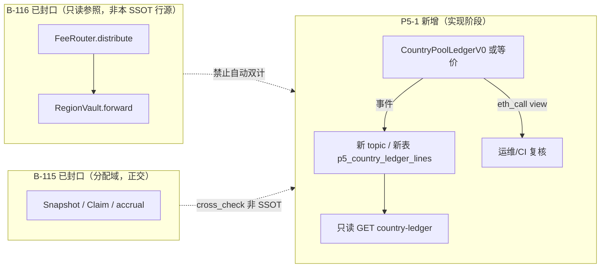

# P5-1 — 逐国链上账本 SSOT 定义（一国/一辖区端到端 · 设计收口）

**Epic**：**P5 / 84 外环**（与 **[84 §读前摘要](84-第一阶段10国Country-Pool发行参数总表.md)**「**逐国链上再分 / 专用对账导出** 仍 **Target**」对齐）。  
**本文性质**：**规格与设计** + **A/B/C 已落地后的台账互指**；**不**替代 **[B-115](../../evidence/GO_B115_CLOSE.md)**、**[B-116](../../evidence/GO_B116_CLOSE.md)** 已封口范围。  
**台账封口**：**[evidence/GO_P5_1_CLOSE.md](../../evidence/GO_P5_1_CLOSE.md)**（**`TT-DOC-P5-1-PM-CLOSE-001`**）；**任务母表** **P5-1** 行；**evidence/README** **`#p5-1-country-ledger-ssot-v0-close`**。  
**硬约束（后续变更仍须遵守）**：**禁止**修改 **B-115**（Snapshot / Claim / 分配 / `region_share_snapshot_lines` / 相关 internal·索引语义）与 **B-116**（FeeRouter / RegionVault / `fee_router_routed_events` / `region_vault_forwarded_events` / `indexer_tick` 写入路径 / `fee-pool-aggregates` Σ 规则）的**既有**实现、表结构或语义；P5-1 演进只允许 **新增/并列** 合约·表·路由·索引 topic（**新 migration 前缀 / 新模块**），**不**把 **B-116 投影 Σ** 升格为本账本 SSOT。

---

## 1. SSOT 一句话

**`country_ledger_ssot_v0`（试点）**：在**单一试点辖区** `J*` 上，**链上可验证余额视图**（或与之 **1:1** 的只读投影行集）为该国 **「Country Pool 运营账本」** 的 **唯一真源**；**不**承担 **B-115** 投资者分配 Σ、**不**承担 **B-116** 平台费路由 Σ。

---

## 2. 辖区键与试点选取

| 项 | 约定 |
|----|------|
| **辖区键 `jurisdiction_id`** | 与 **B-083**（母表）/ 订单 **`fee_route_country`** / **[84](84-第一阶段10国Country-Pool发行参数总表.md)** 十国表 **同一枚举**（建议 **ISO 3166-1 alpha-2** 大写，如 `DE`、`JP`）。 |
| **试点 `J*`** | **一国锁定**：由产品从 **84 表「第一阶段 10 国」** 指定 **一行** 为 `J*`（文档登记即可；**不**在本文内改 84 表数据）。 |
| **非试点辖区** | API/合约 **404 / empty**，或显式 **`implementation_status: not_pilot`**；**禁止**与试点混 Σ。 |

---

## 3. 账本记什么 / 不记什么

### 3.1 记入 SSOT v0 的行（概念）

仅包含 **明确归因到 `J*`** 且 **可链上或投影核对** 的 **「国家池运营侧」** 变动，例如（实现时二选一或组合，**须在实现 PR 钉死**）：

- **链上子账**：新合约 **`CountryPoolLedgerV0`**（或等价命名）在 `J*` 下对 **单一试点 ERC20**（如治理配置的稳定币）的 **`balanceOf(ledger)`** 为 **主读**；**入账**仅通过合约 **显式** `credit` / `sweepIn`（带 **ref**、**jurisdiction**、**amount**）事件。
- **投影行（可选与链上 1:1）**：新表 **`p5_country_ledger_lines`**（**仅 P5** migration）存 **`(chain_id, jurisdiction_id, token, amount_delta, ref_tx_hash, log_index, source_kind)`**，由 **新 indexer topic** 或 **只读回填** 写入；**不得**从 **`fee_router_routed_events`** / **`region_vault_forwarded_events`** **自动派生行**作为 SSOT（防与 **B-116** 双计）。

### 3.2 明确排除（边界）

| 域 | 说明 |
|----|------|
| **B-116** | **`PlatformFeeRouted` → 国家桶 → `RegionVault`** 整条为 **平台费路由 MVP**；**不**自动等于 **某国 Country Pool 账本**；若未来做 **对照**，仅可 **`cross_check` / `note`**，**非** SSOT 行。 |
| **B-115** | **`region_share_snapshot_lines` / Claim / accrual** 为 **分配与领取** 域；与本 **运营账本** **正交**；对账文档可要求 **`Σ(accrual)` 与账本无未解释缺口**，但 **不得**合并 JSON 根级 SSOT 键名。 |
| **`fee-pool-aggregates`** | **B-084** 投影 Σ；**不得**作为 **`country_ledger_ssot_v0`** 的 Σ 来源。 |

---

## 4. 数据流（端到端 · 试点）

**叙述闭环（试点）**：

1. **入金**：仅通过 **P5 新合约**（或经 **Timelock 执行** 的确定性调用）产生 **带 `jurisdiction=J*`** 的 **Credit** 类事件。  
2. **索引（若走投影）**：**新**解析器 → **`p5_country_ledger_lines`**；**不**扩展 **`indexer.rs`** 内对 **`RegionShareSnapshotLine`** / **`PlatformFeeRouted`** 的 **既有** 分支语义。  
3. **只读消费**：**`GET …/governance/country-ledger/{jurisdiction}`**（路径可在 **04** 登记）返回 **`rule_version: country_ledger_ssot_v0`** + **`lines`/`balance_view`**；**或** 无 API 阶段仅用 **`cast call`** 读 **view**。  
4. **出金**（若需要）：同合约 **`debit`/`sweepOut`** 事件，仍带 **`jurisdiction`**，便于与 **Runbook** 演练对齐。

---

## 5. 最小可验证路径（验收）

**阶段 A（纯规格，当前）**：本文档 **§1～§4** + **§6** 经 **84/14** 对口评审勾选。

**阶段 B（实现 PR，另开）** — 满足 **任一** 即视为 P5-1 **可验证**：

| 路径 | 验收步骤 |
|------|----------|
| **链上 view** | 部署 **`CountryPoolLedgerV0(J*)`** 至 dev/anvil；**`cast call`**（或 `forge script`）读 **`totalCredited(J*, token)`** / **`version()`**；与 **一笔** 已知 **`credit`** 交易 **对账**。 |
| **只读 API** | **`GET /api/v1/governance/country-ledger/{jurisdiction}`**（**仅当** `jurisdiction==J*` 有数据）返回 **与链上 view 一致** 的 **数值**（**integration test** 或 **fixture**）；**根级** **不得** 出现 **`fee_pool_aggregates` / `rule_version: fee_pool_aggregates_*`** 键。 |

**回归门禁**：**`cargo test -p traveltrust-api`** 与 **`forge test`** **全绿**；**不**减少 **B-115/B-116** 既有用例。

---

## 6. 与既有系统边界（对照表）

| 系统 | 关系 |
|------|------|
| **84** | **叙事母本**；试点 **J*** 选自十国表；**逐国账本** 从 **Target** 收敛为 **`country_ledger_ssot_v0` 试点** 可交付定义。 |
| **14 §1.1.1** | 新合约 ABI / 只读路由 **另起一行** 登记；**不**改写 **FeeRouter/RegionVault** 行。 |
| **110** | 新事件 **新 anchor**；**不**改 **`indexer-reconcile-gate`** 对 B-116 表的 **既有** 锚点语义。 |
| **Runbook** | **§7.1** 费用基数 **仍** 以 **83/84** 与 **B-116** 为准；P5-1 仅增加 **「试点国账本复核」** 子段（实现后补）。 |

---

## 7. 实现清单与封口状态（A/B/C）

**证据包**：**[GO_P5_1_CLOSE.md](../../evidence/GO_P5_1_CLOSE.md)**（子波次表 · 验收命令 · **B-115/B-116** 边界）。

- [x] **P5-1-A**：**`CountryPoolLedgerV0`** + Foundry + ABI + **`DeployP51CountryLedger.s.sol`**（**不**改 **`Deploy.s.sol`**）；试点 **`J*`** 在合约/测试中钉为 **DE**（产品写入 **84 读前**仍可为待办）。  
- [x] **P5-1-B**：**`p5_country_ledger_lines`** + **`CountryLedgerCredited`** 解码 + **`indexer_tick` 追加**（**禁止**从 **`fee_router_routed_events` / `region_vault_forwarded_events`** 派生 SSOT 行）。  
- [x] **P5-1-C**：**`GET /api/v1/governance/country-ledger/:jurisdiction`**；**[04 §3.4](04-后端与API.md)**、**[14 §1.1](14-合约-API-ABI-前后端对齐.md)** 已登记；根级与 **B-110** 池键 **正交**。  
- [x] **evidence / 母表**：**`GO_P5_1_CLOSE.md`**、**`evidence/README.md`** 锚点、**`docs/任务母表.md`** **P5-1** 行、**`TT-DOC-P5-1-PM-CLOSE-001`**。  
- [ ] **`cross_check` JSON** 与 **B-116/B-115** 的**自动化**对照字段（若产品要 **fee-pool-aggregates** 侧并列展示）：**另卡**，**不**阻塞 P5-1 封口。

---

**文档版本**：0.2（**P5-1 A/B/C 台账封口** · 2026-04-08）  
**互指**：**[GO_P5_1_CLOSE.md](../../evidence/GO_P5_1_CLOSE.md)** · **[GO_B116_CLOSE.md](../../evidence/GO_B116_CLOSE.md)** · **[GO_B115_CLOSE.md](../../evidence/GO_B115_CLOSE.md)**
