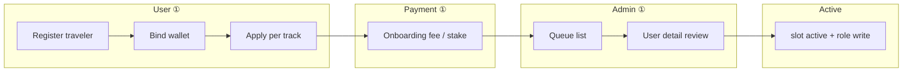

# Identity · Multi-Slot · Naming — L5 产品与技术方案 v1

**Status:** **ACTIVE（① 本地 · 升级轨）** — **不**替代 [identity-unified-model.v1.md](identity-unified-model.v1.md) **PD-001～009**；**补全** 名称分层、页面 IA、Admin 审批链、验收与分阶段落地。

**阶段：** **① 本地** 设计与 gap 对拍；**② 测试网** 须 PD + Admin 队列 + 质押真链分项 GO；**③ 生产** 另闸。

**硬边界（与 PD 同源）：**

- **不改五主路由 UI**（`/` · `/traveltrust` · `/market` · `/did-rank` · `/community/*` 结构/视觉 lock）。
- **可改** `/me/*` · `/guide/*`（非五主）· `/provider/register` · `/admin/*` · API · DB（Phase A 双写）。
- **`users.role` 仍仅四值**；**acquisition 仍非第五 role**（PD-009）。

**读序：**

| 顺序 | 文档 |
|------|------|
| 1 | [identity-unified-model.v1.md](identity-unified-model.v1.md) — PD-001～009 · 三表 · 状态机 |
| 2 | 本文 — L5 命名 · 页面 · Admin · 验收 · 升级阶段 |
| 3 | [frontend/app/me/identities/README.md](../../../frontend/app/me/identities/README.md) — Hub 代码 SSOT |
| 4 | [frontend/evidence/GO_local_auth_l5/IDENTITY-MULTI-SLOT-NAMING-L5-UPGRADE-PLAN.md](../../../frontend/evidence/GO_local_auth_l5/IDENTITY-MULTI-SLOT-NAMING-L5-UPGRADE-PLAN.md) — 工程 backlog |

---

## 1. 总原则（LOCKED · 与 PD 一致）

TravelTrust **不**采用「一个账号只能一个身份」，也 **不**采用「一个账号同时混乱显示全部身份」。

采用：

**一个 Account + 一个默认旅行者侧身份 + 多个可申请 Identity Slots + 分场景名称管理 + 分场景工作台（未来顶栏切换）**

| 原则 | 说明 |
|------|------|
| **Account** | 登录、安全、社区昵称 — `/me/settings/profile` |
| **Protocol role** | `users.role` 四值 — 审核通过后写入（PD-003） |
| **Identity slots** | `GET /api/v1/me` → `identity_slots[]` 五轨展示 — `/me/identities` |
| **Public listing persona** | 市场/子站展示用 **业务资料**，与 nickname **分离** |
| **Admin RBAC** | `super_admin` / 控制台角色 — **独立于** C 端旅行身份 |

**L5 文案口径（对用户）：**

> 不同场景使用不同资料：账户昵称用于顶栏与社区；向导挂牌用于市场预约；商家资料用于店铺展示；法定姓名仅用于平台审核。

**禁止对用户说：**「你有多个名字，请分别设置。」

---

## 2. 名称分层（Normative · ① 现状 + TARGET）

### 2.1 账户层（Account · IMPL ✅）

| 字段 | 存储 | 用途 | 入口 |
|------|------|------|------|
| `email` | `users.email` | 登录 | `/auth/login` · 安全流程改邮箱 |
| `password` | hash | 凭证 | `/me/password` |
| `nickname` | `users.nickname` | 顶栏、社区、消息 | **`/me/settings/profile`** |
| `avatar_url` | `users.avatar_url` | 社区/设置头像 | 同上 + presign（生产） |
| `bio` | `users` / settings | 社区简介（feature flag） | 同上 |
| `default_wallet_address` | `users` | 主钱包 | 顶栏 + `/me/security` |

**验收（① 已有）：** 改 nickname → 顶栏/资料页更新；**不**改变市场 `{city} 向导` 标题（B-471 · `formatGuideDisplayName`）。

### 2.2 向导挂牌层（Guide listing · IMPL 部分 / TARGET 补 settings 页）

| 字段 | ① 存储 SSOT | 市场消费 | 用户可改入口（TARGET） |
|------|-------------|----------|------------------------|
| 列表标题 | **`guides.city`** → `{city} 向导` | `GuideCard` · `formatGuideDisplayName` | 改 **服务城市** |
| `guide_public_title` | **未实现** | — | **Phase C 可选**；① 保持 `{city} 向导` |
| `bio` | `guides.bio` | 卡片 teaser · 详情 | **`/me/identities/guide/settings`** 或 `/guide/profile` |
| `service_types` | `guides.service_types` | 标签 | 同上 |
| `languages` | `guides.languages` | 标签 | 同上 |
| `hourly_rate` 等 | API 决策字段 | 详情 | 同上 |
| `real_name` | `guides.real_name` | **不公开展示** | 仅入驻/KYC；Admin 可见 |
| 头像 | 可复用 `users.avatar_url` 或 guide 级 | 卡片 | settings 模块「公开头像」 |

**① 现状 gap：** 入驻在 **`/guide/register`**；**无** 独立「向导业务资料 settings」路由 — 改资料须重走 register 草稿或 Admin/DB（**不满足** L5 运营预期）。

**TARGET 市场标题（① 冻结建议）：** 继续 **`{city} 向导`**；**不**在 ① 引入 `Junxi · 杭州向导`（隐私 + 审核复杂度 · 与用户方案 §3.2 一致）。

### 2.3 商家挂牌层（Provider · IMPL 部分）

| 字段 | ① SSOT | 市场展示 | 入口 |
|------|--------|----------|------|
| 店铺名等 | `market_listings.payload` + provider 申请 | `/market/provider` | **`/provider/register`** → onboarding |
| KYB | `role_documents` / 申请快照 | 不公开展示 | Admin 审核 |

**TARGET 展示：** `{business_name} · {city}{type}` — **①** 以 listing payload + PG 为准；**`/me/identities/merchant/settings`** **未建**。

### 2.4 区域主理人（region_steward · IMPL 部分）

| 维度 | ① 路径 |
|------|--------|
| 申请 | `/steward/register` → `/me/onboarding?role=region_steward` |
| 质押 | Anvil / `staking_positions` · TTG README |
| 工作台 | `/governance?view=region`（Hub active CTA） |
| 公开资料 settings | **未建** — TARGET **`/me/identities/region-steward/settings`** |

### 2.5 收购能力（acquisition · PD-009 · ① 已闭数据链）

| 维度 | ① SSOT |
|------|--------|
| 非 role | `identity_slots.acquisition` + `trust.acquisition_*` |
| 门闸 | `acquisition_publish_gate.rs` · bond / trust ≥700 |
| 子站 | `/market/acquisition` |
| 资料 settings | **未建** — 可选 **`/me/identities/acquisition/settings`**（简介/偏好） |

---

## 3. 身份中心 IA（`/me/identities`）

### 3.1 页面职责（IMPL ✅ · UI 冻结）

| 区块 | ① 行为 |
|------|--------|
| 旅行者 callout | 状态脊签 + 注册/登录 |
| Provider / Steward **核心卡** | `meIdentitiesCoreCardModel` — 申请/审核/付费/开通态 |
| 向导 / 收购 **分轨卡** | 链到 `/guide/register` · `/market/acquisition` |
| 底栏 | 社区资料 · onboarding · Console 说明 |

**TARGET 文案（与用户方案对齐 · i18n 升级轨）：**

- 标题：**身份中心**
- 副标题：**一个账号可以管理多个 TravelTrust 身份。旅行者是默认身份，向导、商家和区域主理人需要申请或审核。**

### 3.2 槽位状态映射（API SSOT → UI）

| UI 态（用户方案） | `identity_slots[].state` / 申请态 | ① 来源 |
|-------------------|-----------------------------------|--------|
| active | `active` | `GET /me` |
| pending | `pending` + `role_applications` submitted/reviewing | 核心卡 hook |
| locked | `inactive` | 默认未申请 |
| rejected | `restricted` + rejection | 申请单 |
| suspended | `restricted` / admin suspend | acquisition · guide status |

**注意：** Hub 卡 **不**并列展示全部「工作台名称」；仅 **状态 + CTA**（避免「混乱显示全部身份」）。

---

## 4. 设置页 IA（Current vs TARGET）

### 4.1 `/me/settings/profile`（IMPL ✅ · 冻结）

**只管 Account：** 昵称、头像、简介、语言（子页）、隐私、钱包写入提示。

**须追加 L5 提示（TARGET · 文案轨）：**

> 这里修改的是账户资料，用于顶栏、社区和消息。向导、商家等公开业务资料请到身份中心管理。

**链接：** → `/me/identities`（各身份卡）→ 各 `…/settings` 子页（**IMPL 2026-06-10**）。

### 4.2 分身份 settings 子页（IMPL ✅ · ① · Identity Center P2 冻结）

| 路由 | 阶段 | 模块 | API |
|------|------|------|-----|
| **`/me/identities/guide/settings`** | **P1 ✅** | 公开展示 · 资质只读 · `GuideCard` 预览 | `GET/PATCH /api/v1/me/guide-profile` |
| **`/me/identities/merchant/settings`** | **P2 ✅** | 店铺展示 · 审核只读 · masonry 预览 | `GET/PATCH /api/v1/me/merchant-profile` |
| **`/me/identities/region-steward/settings`** | **P2 ✅** | 区域简介 · 质押/治理只读 | `GET/PATCH /api/v1/me/region-steward-profile` |
| **`/me/identities/acquisition/settings`** | **P2 ✅** | 收购简介 · trust/bond 只读 · 预览 | `GET/PATCH /api/v1/me/acquisition-profile` |

**冻结 SSOT：** [IDENTITY-CENTER-PHASE2-FREEZE.md](../../../frontend/evidence/GO_local_auth_l5/IDENTITY-CENTER-PHASE2-FREEZE.md) — **禁止**再增身份体系产品功能；**OUT** 顶栏 workspace switcher（P3）。

**别名（可选 backlog）：** `/guide/profile` 301 → guide settings。

**冻结边界：** 子页须 **Auth L5 同族** + **不**改 Hub 卡 layout lock；允许 **数据链 + i18n + a11y**。

---

## 5. Admin 审批链（① 可行性审计）

### 5.1 已通（① 本地 smoke）

| 身份轨 | 用户路径 | Admin 列表 | Admin 详情审核 | 审核 API |
|--------|----------|------------|----------------|----------|
| **商家 provider** | `/provider/register` → onboarding | **`/admin/provider-applications`** | **`/admin/users/[id]`** · `AdminProviderApplicationReviewCard` | `PATCH …/provider-application-review` |
| **主理人 region_steward** | `/steward/register` → onboarding | **`/admin/steward-applications`** | **`/admin/users/[id]`** · `AdminStewardApplicationReviewCard` | `PATCH …/steward-application-review` |
| **收购 suspend** | `/market/acquisition` | — | **`/admin/users/[id]`** | `PATCH …/acquisition-publish-suspend` |
| **向导 guide** | `/guide/register` · **`/me/identities/guide/settings`** | **`/admin/guide-applications`** | **`/admin/users/[id]`** · `AdminGuideApplicationReviewCard` | `PATCH …/guide-application-review` |

### 5.2 缺口（TARGET · 行业标准对齐）

| 缺口 | 风险 | 建议 |
|------|------|------|
| **Hub 卡 blocked_reason 三行**（wallet/payment/review） | 用户只在 settings 子页看见原因 | **backlog** 扩展 `useMeIdentitiesCoreCardSignals`（**非** Identity Center 冻结 blocker） |
| **PD-003 vs ① dev** provider 可先 role-confirm 后 approve | 文档/体验不一致 | 保持 **identity-unified-model §3.3 差分**；Operator Guide 写清「市场写三门闸」 |
| **状态机六字** 在 UI 全链路可见性 | 用户不知卡在 paid 还是 reviewing | 核心卡 copy 已部分覆盖；**P1** 统一 `application_status` 字段于 `GET /me` |

### 5.3 审批流程通畅性结论（①）

| 轨 | ① 通畅？ | 条件 |
|----|----------|------|
| Provider | **是** | smoke-provider-onboarding-local.sh |
| Steward | **是** | smoke-steward-onboarding-local.sh |
| Guide | **基本** | register + guides 双写；Admin 队列 **弱** |
| Acquisition | **是（能力非 role）** | smoke-acquisition-pd009-local.sh |
| Traveler | **是** | 注册即 active |

---

## 6. 质押与付费（PD-005 · 顺序 LOCKED）

**行业标准顺序：** **绑主钱包 → 申请/资料 → 质押或准入费 → 审核 → role/slot 生效**

| 轨 | 质押/费用 kind | ① 实现 | 与名称/settings 关系 |
|----|----------------|--------|----------------------|
| Guide | `identity_pool_guide` | stake + `guides.stake_amount` 双写 | settings **只读** 展示 stake；**改 stake 走链/专用 flow** |
| Provider | `onboarding_fee` | onboarding_entitlements + PG | settings **不**改准入费 |
| Steward | `region_steward_onboarding` + TTG stake | Anvil 脚本 + stake-status | governance 页只读 |
| Acquisition | `acquisition_publish_bond` | mock lock API | trust strip 只读 |

**不通顺点（须 P2 产品化）：** 用户在 **单一 settings 页** 内须看见「为何 locked」— 链 wallet / 付费 / 审核 三因 **分列**，禁止只显示 inactive。

---

## 7. 顶栏身份切换（TARGET · 未实现）

用户方案 §6：**当前身份：旅行者 ▼** → 切换工作台默认首页。

| 当前身份 | TARGET 默认首页 | ① 现状 |
|----------|-----------------|--------|
| 旅行者 | `/` · `/orders` | 无切换器；顶栏显示 nickname |
| 向导 | `/guide` | `/guide` 存在；无 switcher |
| 商家 | `/provider` 或 `/market/provider` | 部分 |
| 主理人 | `/governance` | Hub CTA |
| 收购 | `/market/acquisition` | Hub CTA |

**建议：** **P2** `HeaderIdentitySwitcher` — 仅列出 **active + pending** 槽；**不**改登录 session；持久化 `tt_active_workspace=traveler|guide|…`（localStorage）。**须** ADR + 顶栏 freeze 例外评审（touch `HEADER-UTILITY-MENU-L5-FREEZE`）。

---

## 8. 数据模型（与用户方案对齐 · 不新增第六 role 表）

**Normative：** 以 [identity-unified-model §4](identity-unified-model.v1.md) 为准。

用户方案中的 `guide_profiles` / `merchant_profiles` **在 Phase A 不新建表** — 语义映射：

| 用户方案表 | Phase A 映射 |
|------------|--------------|
| `guide_profiles` | **`guides`** + `role_documents` |
| `merchant_profiles` | **`role_applications` metadata** + **`market_listings.payload`** |
| `steward_profiles` | **`role_applications`** + governance 配置 |
| `acquisition_capabilities` | **`GET /me.trust`** + `staking_positions` |
| `identity_slots` | **派生 JSON**（`GET /me`）；Phase B 可落表 |

**可选列（Phase C）：** `guides.public_title` — **仅当**产品批准 `{name} · {city} 向导`。

---

## 9. 验收标准（L5 · 可机读映射）

### 9.1 账户 settings

| # | 断言 | ① 机读 |
|---|------|--------|
| A1 | 改 nickname → 顶栏变 | `meSettings*` vitest · smoke-me-settings |
| A2 | 不改 market 标题 | `guideDisplayName.test.ts` |
| A3 | 不改订单 guide_id | 订单 API 不变 |

### 9.2 向导 settings（TARGET P1）

| # | 断言 | 机读（待建） |
|---|------|--------------|
| G1 | 改 city → 市场标题变 | `guideDisplayName` + API PATCH guides |
| G2 | 改 service_types → 标签变 | market contract |
| G3 | real_name 不在 title | `formatGuideDisplayName` 仅用 city |
| G4 | 预览块 ≈ `/market` 卡片 | settings contract test |

### 9.3 身份中心

| # | 断言 | ① 机读 |
|---|------|--------|
| I1 | 注册后 traveler active | seed + `GET /me` |
| I2 | acquisition 非 role | identity-unified-model tests |
| I3 | 核心卡状态 | `meIdentitiesCoreCardModel.test.ts` |

### 9.4 Admin

| # | 断言 | ① 机读 |
|---|------|--------|
| D1 | provider 队列 approve | smoke-provider-onboarding |
| D2 | steward 队列 approve | smoke-steward-onboarding |
| D3 | acquisition suspend | smoke-acquisition-pd009 |

---

## 10. 分阶段升级方案（可行性 · 行业标准）

### Phase 0 — 文档与口径（**本轮 · 无 UI 破冻结**）

- [x] 本文 + [UPGRADE-PLAN](../../../frontend/evidence/GO_local_auth_l5/IDENTITY-MULTI-SLOT-NAMING-L5-UPGRADE-PLAN.md)
- [ ] i18n：profile 页「分场景资料」提示句（**仅文案** · settings 冻结例外）
- [ ] Operator Guide §身份与名称 链到本文

### Phase 1 — 向导资料 settings + Admin 向导队列（**① 最高 ROI**）

| 项 | 交付 |
|----|------|
| FE | **`/me/identities/guide/settings`** · L5 壳 · PATCH 公开展示字段 |
| API | `PATCH /api/v1/me/guide-profile` 或扩展现有 guide update（须 04 登记） |
| Admin | **`/admin/guide-applications`** 列表 + 复用 user 详情审核 pattern |
| 测试 | vitest + `smoke-guide-profile-settings-local.sh` |
| **不做的** | `guide_public_title` · 顶栏 switcher |

### Phase 2 — 商家/主理人 settings + 槽位 locked 原因 UX

| 项 | 交付 |
|----|------|
| FE | merchant / steward settings 子页 |
| UX | `identity_slots` + application 合并「待钱包/待付费/待审核」三行原因 |
| Admin | 与 Operator Guide 队列截图对齐 |

### Phase 3 — 顶栏工作台切换 + 可选 public_title

| 项 | 交付 |
|----|------|
| FE | HeaderIdentitySwitcher + workspace 路由表 |
| 产品 | ADR：是否启用 `{nickname} · {city} 向导` |
| ② | staging 全矩阵 + 真 stake / 真 webhook |

### 不做（① 明确 OUT）

- 第五 `users.role` 或 acquisition 升格为 role
- 五主路由 market 卡片 layout 回流
- 在 settings/profile 混合编辑 guide 城市/ bio（**必须分轨**）

---

## 11. 最终产品口径（对用户 · 可直接粘贴 Help）

TravelTrust 的身份设计不是「一个用户一个名字」，而是：

**一个账号管理多个身份，每个身份有自己的公开资料；账户昵称、向导挂牌、商家名称、合规实名分别服务不同场景。**

用户只需理解：

| 我想… | 去哪里 |
|-------|--------|
| 改社区称呼 | **设置 → 个人资料** |
| 改向导市场挂牌 | **身份中心 → 向导 → 管理向导资料**（P1 起） |
| 改店铺展示 | **身份中心 → 商家 → 管理商家资料**（P2 起） |
| 法定姓名 | **仅入驻/审核**；市场标题 **不**展示 |

---

## 12. 变更记录

| 日期 | 版本 | 说明 |
|------|------|------|
| 2026-06-10 | v1.0 | 初始 L5 方案：对齐 PD-001～009 · ① gap 矩阵 · P0～P3 升级轨 |
