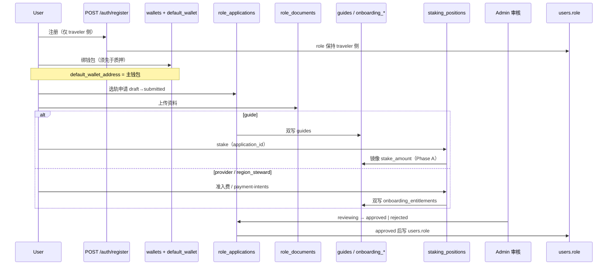

# Identity · Wallet · Onboarding · Staking · State Machine · DB — 统一模型 v1

**Status:** **LOCKED（PD-001～009）** — **①.5 工程真源**；**PD-009 旅行收购 ① 已闭**（**§3.5** · **[acquisition-publish-trust-rules §8.1](acquisition-publish-trust-rules.v1.md#81-第一阶段--本地--closed2026-05-27)**）；合规/工程签字见 §7.2。**不**替代 [87](../87-TravelTrust-角色体系技术文档-融合架构版.md)、[04](../04-后端与API.md)、[96-17](../96-17-多重身份与钱包真值.md)、[96-18](../96-18-商家与主理人准入费用与治理币兑换设计.md) 正文；**migration / seed / API·IT** 须与本文件 **同批对拍**。

**阶段：** **①.5 本地** — **② 测试网全矩阵暂缓**（[PHASE2-TESTNET-ACCEPTANCE.md](../../runbook/PHASE2-TESTNET-ACCEPTANCE.md)）。

**硬边界：** **不改五主路由 UI**；可改 `/me/*`、**`/provider/register`**、**`/admin/provider-applications`**、`/guide/register`、`/governance/*`、API、DB。

**工程顺序：** PD 已锁 → **04 / 96-17 台账句** → **SQL migration（Phase A 双写）** → **seed** → **cargo API·IT** → **② staging**。

---

## 0. 读前摘要

| 你要定什么 | 本节 |
|------------|------|
| **已锁 PD-001～008** | **§0.1** |
| **L5 命名 · 分身份 settings · Admin · 升级阶段** | **[identity-multi-slot-naming-l5.v1.md](identity-multi-slot-naming-l5.v1.md)** |
| 身份枚举与产品名 | §1 |
| 注册 / 钱包 / 申请 / 质押 / 审核 顺序 | §2 |
| 每身份矩阵 | §3 |
| 三表 + 双写 ER | §4 |
| 统一状态机 | §5 |
| HTTP 清单 | §6 |
| 签字与 migration 出口 | §7 |

### 0.1 产品决策（**LOCKED** · 2026-05-26）

| ID | **锁定结论** | 工程约束 |
|----|--------------|----------|
| **PD-001** | **`users.role` 仅四值：** `traveler` \| `guide` \| `provider` \| `region_steward`（`tourist` 只读 legacy）；**禁止** 新增第六种 `users.role`（须 ADR + 87/04 同批） | 注册、RBAC、`identity_slots` 派生均不得发明 `merchant`/`agency`/`host`/`steward` 为 role |
| **PD-002** | **「商家」为产品名，** 映射 **`provider`**；**`identity_slots[].id=merchant`**、**`?board=provider`** 为展示别名，**不是** `users.role`。**「区域主理人」** 映射 **`region_steward`**（87 第四协议角色），**不是** `provider` 子类型 | 文档/UI 禁止把主理人写成第六种 role；禁止 `users.role=merchant` |
| **PD-003** | **注册不自动开通** 非旅行者身份：**仅 `traveler` 侧在注册后即时可用**；`guide` / `provider` / `region_steward` **全部**走 **`role_applications` 审核流**，**`approved` 后才**写 `users.role` 与能力门禁 | **禁止** `POST /auth/register` 直接落 `users.role=guide|provider|region_steward`；`role-confirm` 须在 **`approved` + 付费/资料齐备** 之后 |
| **PD-004** | **支持多钱包**；**`users.default_wallet_address` = 主钱包**（治理投票、默认展示）；附属地址进 **`wallets`** 表 | Me/治理读主钱包；增删绑走 `wallets` + 同步 primary |
| **PD-005** | **先绑钱包，后质押**；**质押仓位只挂 `role_applications` / `staking_positions`**，**禁止**在 `users` 上新增质押列 | `guides.stake_amount` Phase A 可双写镜像，读路径以 `staking_positions` 为准（Phase B 切读） |
| **PD-006** | **必建三表：** `role_applications`、`role_documents`、`staking_positions`（+ **`wallets`** 支撑 PD-004） | ①.5 migration 最小集；资料元数据统一进 `role_documents` |
| **PD-007** | **统一申请状态：** `draft` → `submitted` → `reviewing` → `approved` \| `rejected`；自 `approved` 可 → `suspended` | `identity_slots`、admin 审核、用户查询 **以 `role_applications.status` 为 SSOT**（双写期可派生旧列） |
| **PD-008** | **Phase A 双写：** 保留 **`guides`**、**`onboarding_entitlements`***；写入/更新时 **同步** `role_applications` / `role_documents` / `staking_positions` | **禁止** 大 bang 删旧表；Phase B 读切；Phase C 弃旧列另 ADR |
| **PD-009** | **旅行收购发布** = **附加能力**（**非** 第五 **`users.role`**）：**任意旅行者侧账号** 可发 **`variant=acquisition`** listing；门闸 = **登录 + 主钱包 + 发布保证金（`staking_positions.kind=acquisition_publish_bond`）或信用 ≥700 免押 + 频控 + `agree_escrow_copy`** — **[acquisition-publish-trust-rules v1](acquisition-publish-trust-rules.v1.md)**。**禁止** 以 **`region_steward`**、**商家 KYB** 或 **96-18 准入费** 作为收购 **发布** 前置 | **① 已闭（2026-05-27）** · **`acquisition_publish_gate.rs`** + **`orders.order_kind=acquisition_listing`** + **`GET /me.trust`** 收购扩展；**不**进 **`role_applications` v1** 全量 KYB；**②③** 见 **acquisition-publish-trust-rules §8** |

\* `onboarding_payment_events`、合规审计等 **KEEP**，经 `legacy_ref` 关联。

**防炸 schema 原则：** **guide 轨、provider 轨、onboarding 付费轨** 在 DB 层 **收敛为同一申请单 + 三表**；旧表仅为 **兼容投影**，不得再各写一套独立状态机。

---

## 1. 身份类型清单（闭合枚举）

### 1.1 协议角色（`users.role` · PD-001）

| 中文 | API/DB `role` | 注册后即时 `users.role`？ | 开通主路径 | 备注 |
|------|---------------|---------------------------|------------|------|
| 旅行者 | `traveler` / `tourist`（legacy 读） | **是**（旅行者侧） | 注册即可 | `identity_slots.traveler` |
| 向导 | `guide` | **否**（PD-003） | `/guide/register` → `role_applications` + `guides` 双写 | **approved** 后写 `users.role=guide` |
| 商铺 | `provider` | **否** | `/me/onboarding` + 96-18 → 审核 → `role-confirm` | UI **商家**（PD-002） |
| 区域主理人 | `region_steward` | **否** | 同上，`role_target=region_steward` | **≠** provider（PD-002） |

**注册 `POST /auth/register`：** 仅允许创建 **旅行者侧账号**（`role` 省略或 `traveler`/`tourist`）；**`guide` → `invalid_registration_role`**；**`provider` / `region_steward` → 仅意向/预填（可选）或拒绝直写** — 实现以 **04** 同批，语义以 **PD-003** 为准。

### 1.2 产品榜脊签（DID · 非 `users.role`）

| 脊签 | `?board=` | `identity_slots[].id` | 协议角色 |
|------|-----------|------------------------|----------|
| 旅行者榜 | `traveler` | `traveler` | 展示 |
| 向导榜 | `guide` | `guide` | `guide` + `approved` |
| 商家榜 | `provider` | `merchant` | **`provider`**（PD-002） |
| 旅行收购 | `acquisition` | `acquisition` | **94** listing；**非** 第五 `users.role` |
| （无榜） | — | `region_steward` | **`region_steward`** |

### 1.3 经济/质押分轨

| 概念 | 落库（PD-005/006） | 说明 |
|------|-------------------|------|
| 身份质押（81 Guide/Provider 池） | `staking_positions` + `application_id` | **先** `wallets` 主钱包/轨钱包 **再** stake |
| 准入费（96-18） | `staking_positions.kind=onboarding_fee` 或 entitlement 双写 | webhook `paid` → 申请单进 `reviewing`/`approved` 流程 |
| TTG 治理 | 非本文 | ≠ 身份质押 |
| 订单风险押金 | 订单域 | ①.5 不展开 |
| 收购发布/履约保证金 | `staking_positions` **`acquisition_publish_bond`** / **`acquisition_fulfillment_bond`** | **PD-009**；参数 **81 附录 E**；**≠** Guide 池 |

---

## 2. 端到端链路（锁定序）



**①.5 验收故事（seed + API·IT）：**

| # | 故事 | 通过标准 |
|---|------|----------|
| S1 | 注册 → 绑主钱包 → `GET /me` | `wallets` + `default_wallet_address` 一致 |
| S2 | 向导：申请 → 审过 → **已绑钱包** → stake | `role_applications.approved` + `staking_positions`；`users.role=guide` |
| S3 | 商家：申请 → 付费 → 审过 → role 生效 | **注册时无 `provider` role**（**`registration_role_for_user_store`**）；**① Phase A**：**paid + role-confirm** 或 **Admin approve** 后 **`users.role=provider`**；**发橱窗**另须 **approved 申请**（三门闸，**`market_merchant_gate.rs`**）。**`GET /me.role`** 读 **chain_off 内存**，**role-confirm** 后须 **`sync_user_role_in_memory_when_pg_matches`** |
| S4 | 主理人 | 同 S3，`kind=region_steward_onboarding` |

---

## 3. 主矩阵：身份 × 钱包 × 入驻 × 质押 × 状态机 × DB

**图例：** **IMPL** = 现有代码；**TARGET** = PD 锁定后须达到；双写 = **PD-008**。

### 3.1 旅行者（traveler）

| 维度 | 内容 |
|------|------|
| **钱包** | `wallets` + `users.default_wallet_address`（**TARGET** 多钱包） |
| **入驻** | 注册即旅行者侧；无 `role_applications` |
| **质押** | N/A |
| **状态** | 无申请单；`identity_slots.traveler` = **active** |
| **DB** | `users`、`wallets` |

### 3.2 向导（guide）

| 维度 | 内容 |
|------|------|
| **钱包** | 主钱包 `default_wallet_address`；向导轨 **`wallets` 或 `guides.wallet_address`** 与 96-17 一致，**须先绑再 stake**（PD-005） |
| **资料** | **`role_documents`**；Phase A 双写 `guides` 证件列 |
| **质押** | **`staking_positions`**（`identity_pool_guide`）；双写 `guides.stake_amount` |
| **状态** | **`role_applications.status`**（PD-007）；双写 `guides.status` |
| **DB** | `role_applications` + `role_documents` + `staking_positions` + `guides`（KEEP） |

### 3.3 商铺（provider · 产品名「商家」）

| 维度 | 内容 |
|------|------|
| **钱包** | 多钱包 + 主钱包（PD-004） |
| **资料** | **`role_documents`** + 合规模块 |
| **付费** | 96-18 → **`staking_positions.kind=onboarding_fee`** + 双写 `onboarding_entitlements` |
| **质押** | Phase A：**准入费即开通主路径**；Provider **IdentityStakingPool**（81）若启用，**仅** `staking_positions`，**Phase B** |
| **状态** | **PD-007**；**PD-003** 注册不写 `users.role=provider` |
| **DB** | 三表 + `onboarding_*`（KEEP） |

**① Phase A 实现快照（2026-05-27 · 代码 SSOT · 不替代 PD）：**

| 维度 | **① 现行代码** |
|------|----------------|
| **页面** | **`/auth/register?role=provider`** → **`/provider/register?step=1..3`** → **`/me/onboarding`** → **`/admin/provider-applications`**（列表）→ **`/admin/users/[id]`**（**`AdminProviderApplicationReviewCard`** 审核）→ **`/market/provider`** |
| **注册** | API 接受 **`role=provider`** 但 **落库 `traveler`**；FE **`postRegister` 不传 role** |
| **资质 SSOT** | **chain_off 内存** **`provider_applications_by_user`**；PG **`role_applications`** 双写 |
| **Admin** | **列表** **`GET …/admin/provider-applications`**（内存）；**审核** **`PATCH …/users/:id/provider-application-review`** on **`/admin/users/[id]`**；**approve** 写内存 **`role=provider`** + PG |
| **准入费** | PG **`onboarding_entitlements`** / events；**`POST …/role-confirm`** body **`{ "role" }`** |
| **role 生效** | PG 写 role 后 **内存同步**；**发 listing** 须 PG **三门闸**（role + paid + approved） |
| **① 烟测** | **`bash scripts/dev/smoke-provider-onboarding-local.sh`** |
| **本地锚** | **[`frontend/app/provider/register/README.md`](../../../frontend/app/provider/register/README.md)** |

**与 PD-003 差分（须知晓）：** **role-confirm** 可在 **paid** 后于 **Admin approve 前** 写 PG **`users.role=provider`**（**① 本地 dev** 路径）；**市场写**仍要求 **approved 申请**。**TARGET** 仍以 **PD-003「approved + paid 后 role-confirm」** 为准。

### 3.4 区域主理人（region_steward）

同 §3.3，`kind=region_steward_onboarding`、`role_target=region_steward`；**PD-002** 与 provider **分轨**，禁止合并为同一 `users.role`。

### 3.5 旅行收购（acquisition · **PD-009** · **① 已闭**）

**非** `users.role`；**不**进 `role_applications` v1 全量 KYB；listing/**94** 主链 + **Escrow** 订单（**`order_kind=acquisition_listing`**）。

| 维度 | 产品规则（LOCKED） | **① 代码（2026-05-27）** |
|------|-------------------|---------------------------|
| **委托方（发 listing）** | 旅行者侧 + **主钱包** + **发布保证金或信用 ≥700 免押** + **频控 ≤5/24h** + **`agree_escrow_copy`** | **`ensure_acquisition_market_write_allowed`**（**`acquisition_publish_gate.rs`**） |
| **受托方（接单）** | 登录 + **`GET /me.trust`** 无阻塞 + 大额 **履约保证金**（**`bounty_max_usdc` ≥ 1000**） | **`POST …/acquisition/listings/:id/orders`** · 自动 **`acquisition_fulfillment`** guide |
| **质押** | **`staking_positions`** **`acquisition_publish_bond`** / **`acquisition_fulfillment_bond`** | **`POST /api/v1/me/acquisition/publish-bond`** / **`…/fulfillment-bond`**（mock lock） |
| **Admin** | 风控 **suspend**；**不**审每条 listing KYB | **`PATCH …/admin/users/:id/acquisition-publish-suspend`** |
| **信用 L4** | 收购分池评价 + 争议 slash | **`compute_acquisition_trust_score`** · **`chain_off/acquisition_trust`** parity |
| **文档 SSOT** | **[acquisition-publish-trust-rules v1](acquisition-publish-trust-rules.v1.md)** **§8.1** | — |
| **① 烟测** | **`bash scripts/dev/smoke-acquisition-pd009-local.sh`** | **[`frontend/app/market/acquisition/README.md`](../../../frontend/app/market/acquisition/README.md)** |

**`GET /api/v1/me` · `identity_slots[id=acquisition]`（有 PG 时由 `acquisition_trust_snapshot` 覆写）：**

| **`state`** | 条件（**`db/acquisition_trust.rs`**） |
|-------------|--------------------------------------|
| **`active`** | **`publish_eligible`**：钱包已绑 + 未 trust 阻塞 + 未 suspend +（**发布 bond ACTIVE** ∨ **trust_score ≥ 700**） |
| **`inactive`** | 未满足上式（缺钱包 / 无 bond 且信用未达阈） |
| **`restricted`** | **`identity_status=restricted`** 或 **`risk_level=high`**，或 **`acquisition_publish_suspended_until > now()`** |

**`stake_display`**：有效 **`acquisition_publish_bond`** 展示串（无 bond 时为 **`null`**）。

**`GET /api/v1/me` · `trust` 收购扩展（有 PG 快照时）：** **`acquisition_trust_score`**、**`acquisition_publish_eligible`**、**`acquisition_publish_bond_waived`**、**`acquisition_publish_bond_active`**、**`acquisition_publish_bond_display`**、**`acquisition_listings_published_24h`**、**`acquisition_publish_suspended`**、**`acquisition_fulfillment_bond_active`**、**`acquisition_fulfillment_bond_display`**。**无 PG** 时仅内存 **`acquisition_trust_score`**。

**与 `region_steward` 正交：** **`users.role=region_steward`** **不**是收购发布前置；**`identity_slots.region_steward`** 与 **`identity_slots.acquisition`** 独立计档（**96-17 §0.3.2**）。

**②③ backlog：** **[acquisition-publish-trust-rules §8.2/§8.3](acquisition-publish-trust-rules.v1.md#82-第二阶段--测试网--待验backlog)** · **94 §9.1～§9.2**。

---

## 4. 数据模型（Phase A · PD-006/008）

### 4.1 逻辑 ER（目标）

```
users
  ├── default_wallet_address   -- 主钱包（PD-004）
  └── role                     -- 仅 PD-001 四值；非 traveler 须 approved 后写入（PD-003）

wallets                        -- user_id, address, label, is_primary, verified_at, …

role_applications              -- 统一申请单（PD-007 status）
role_documents                 -- application_id, doc_type, storage_url, content_hash, …
staking_positions              -- application_id, kind, amount, …, status（PD-005 不挂 users）

guides                         -- KEEP；legacy_ref + 双写字段
onboarding_entitlements        -- KEEP；legacy_ref + 双写
onboarding_payment_events      -- KEEP
```

### 4.2 `role_applications`（DDL 意图）

| 列 | 说明 |
|----|------|
| `id` | UUID PK |
| `user_id` | FK → users |
| `kind` | `guide` \| `provider_onboarding` \| `region_steward_onboarding` |
| `status` | **PD-007** 六字状态机 |
| `legacy_ref` | `{"guides_id":"…"}` / `{"entitlement_id":"…"}` |
| `submitted_at` / `decided_at` | |
| `rejection_codes` / `rejection_message` | |
| `metadata` | SKU、`fee_schedule_version` 等 |

**约束：** 每 `(user_id, kind)` 仅一条 **非终态** 活跃单（`rejected` 后可新开一行）。

### 4.3 `role_documents`

| 列 | 说明 |
|----|------|
| `application_id` | FK |
| `doc_type` | `passport` \| `id_photo` \| `language_cert` \| `guide_license` \| `kyc` \| `business_license` \| `travel_agency_permit` \| `insurance` \| `tax_id` \| `legal_representative_id` \| `beneficial_owner_id` \| … |
| `storage_url` / `content_hash` | |
| `legacy_column` | 可选：指向 `guides.id_photo_url` 等迁移期 |

### 4.4 `staking_positions`

| 列 | 说明 |
|----|------|
| `application_id` | FK（**必填**；PD-005） |
| `kind` | `identity_pool_guide` \| `identity_pool_provider` \| `onboarding_fee` |
| `wallet_id` | 可选 FK → `wallets`（质押所用地址） |
| `amount` / `currency` / `chain_id` / `tx_hash` | |
| `status` | `pending` \| `locked` \| `released` \| `slashed` |

### 4.5 `wallets`

| 列 | 说明 |
|----|------|
| `user_id` | FK |
| `address` | 唯一 per user 或全局唯一（实现定） |
| `is_primary` | 恰一 true / user；与 `users.default_wallet_address` 同步 |
| `verified_at` | 可选 |

### 4.6 Phase A 双写规则（PD-008）

| 事件 | 新表 | 旧表（镜像） |
|------|------|----------------|
| 创建向导申请 | `role_applications` + `role_documents` | `INSERT guides` + 证件列 |
| 更新申请状态 | `role_applications.status` | `guides.status` 映射 §5.2 |
| 向导 stake | `staking_positions` | `guides.stake_amount` |
| 创建准入费 | `role_applications` + `staking_positions` | `onboarding_entitlements` |
| entitlement paid | `approved` 或 `reviewing→approved` | `status=paid` |
| Admin 拒绝 | `rejected` | rejection_* / entitlement revoked |

**读路径（Phase A）：** API 可仍读旧表；**新 IT** 须同时断言三表与双写一致。

---

## 5. 统一状态机（PD-007）

### 5.1 字面量

```
draft → submitted → reviewing → approved | rejected
approved → suspended
```

### 5.2 旧列映射（双写 · 固定）

| 来源 | 旧值 | → `role_applications.status` |
|------|------|------------------------------|
| `guides.status` | `pending` | `submitted` |
| `guides.status` | `active` | `approved` |
| `guides.status` | `suspended` | `suspended` |
| `guides` rejection 有值 | — | `rejected` |
| `onboarding_entitlements` | `pending` | `submitted` |
| | `paid` | `approved`（若仍需人工审，先 `reviewing` 再 `approved`） |
| | `revoked` / `expired` | `suspended` |
| | `refunded` | `rejected` |

### 5.3 `identity_slots[].state`

**TARGET：** 由 **`role_applications.status`** + **`users.role`** 派生（`chain_off/me.rs` 改造）；`approved` → 对应槽 **`active`**；否则 **`inactive`/`pending`/`restricted`**（与 96-17 一致）。

---

## 6. HTTP / 页面（相对 PD 的增量）

| 步骤 | 路径 | PD 要求 | **① Phase A 实现（代码）** |
|------|------|---------|---------------------------|
| 注册 | `POST /auth/register` | **仅 traveler**；禁止直写 guide/provider/steward role（**PD-003**） | **`provider`/`region_steward` 请求 → 存 **`traveler`**；FE 注册页 **不传 role** |
| 资质 | **`POST /api/v1/provider-applications`** | — | **内存 SSOT** + PG 双写；KYB **`provider_kyb.rs`** |
| 钱包 | `PUT /me` + **`/api/v1/me/wallets`**（**TARGET**） | 多钱包 + 主钱包（**PD-004**） | **`…/me/wallet/verify/*`**；**`STRICT_SESSION_GATE=1`** 须 Bearer |
| 申请查询 | **`GET /api/v1/me/role-applications`**（**TARGET**） | SSOT 状态（**PD-007**） | **`GET …/me/provider-application`**（内存） |
| 向导 | `POST /guides`、stake、admin PATCH | 双写三表（**PD-008**） | （略） |
| onboarding | quote / payment-intents / role-confirm | **role-confirm** 仅当 **`approved`** + paid（**PD-003**） | body **`role`**；paid 后可 role-confirm；**内存 sync**；市场写另要 **approved** |
| 市场 | **`POST …/market/provider/listings`** | — | **三门闸** **`market_merchant_gate.rs`** |
| ① 烟测 | — | — | **`scripts/dev/smoke-provider-onboarding-local.sh`** |

---

## 7. 签字与 ①.5 出口

### 7.1 PD 状态

| ID | 状态 |
|----|------|
| PD-001～PD-008 | **LOCKED**（产品建议版，2026-05-26） |

### 7.2 签字栏（合规/工程）

| 角色 | 签字 | 日期 |
|------|------|------|
| Product | ☑ PD 锁定 · **Sebastian Ward（塞巴斯蒂安·沃德）** | 2026-06-03 |
| Compliance | ☑ **Sebastian Ward（塞巴斯蒂安·沃德）**（Owner 自证 · 非法律顾问 · [签字索引](../../../frontend/evidence/GO_local_phase1/SOLO-MAINTAINER-SIGNATURE-INDEX.md)） | 2026-06-03 |
| Engineering | ☑ **Sebastian Ward（塞巴斯蒂安·沃德）** · §3 + S1–S4 IT + `/me/wallets` + `/me/role-applications` + PD-003 | 2026-06-03 |

### 7.3 migration 前 checklist

- [x] **PD-001～008** 写入本文 §0.1
- [x] **04** §3.4：`/me/wallets`、`/me/role-applications`、注册 role 限制（**2026-06-03** · `routes/me.rs` · **PD-003** `registration_role_stored`）
- [x] **96-17 §0.3** 与 PD-003/007 对拍（**2026-06-03** · `didRankUtils.test.ts` · 本文件 §3）
- [x] **SQL**：`20260601120000_role_identity_phase_a_dual_write.sql`（`wallets` + 三表）
- [x] **应用层双写（Phase A）**：`crates/api/src/db/role_identity/` — guides / onboarding 写路径；**读仍走旧表**
- [x] **seed** S1–S4（**①** · `smoke-phase15-identity-demo-local.sh` · `run-phase15-s1-s4-it-green.sh`）
- [x] **双写 IT**（`cargo test -p traveltrust-api role_identity_dual_write -- --nocapture`；须 **`DATABASE_URL`**）
- [x] **API·IT** 全链 S1–S4 — **`run-phase15-s1-s4-it-green.sh`** · **`phase15_identity_s*`** + **`role_identity_dual_write`**
- [x] **`gate:phase1-linkage`**（五主防回流 · 与 onboarding 正交）

---

## 8. 变更记录

| 版本 | 日期 | 说明 |
|------|------|------|
| v1.0-draft | 2026-05-26 | 初稿 |
| **v1.0-locked** | 2026-05-26 | **PD-001～008 锁死**；全文对齐三表+双写+多钱包 |
| **v1.0-locked+impl** | 2026-05-27 | **§3.3 / §6 / S3**：**商家入驻 ① Phase A 实现快照**（内存/PG 分层、烟测、与 PD-003 差分）；**不**改 PD 锁 |

**维护：** 变更 PD 须 ADR；变更表结构须同步 [PHASE1_5-DATA-LINK-MODEL-GATE.md](../../runbook/PHASE1_5-DATA-LINK-MODEL-GATE.md)。
