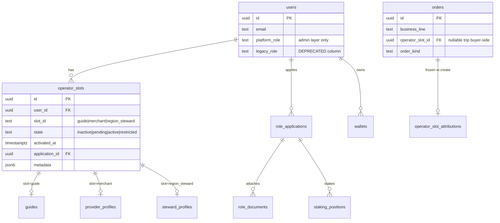

# Multi-Operator Identity Sprint · 架构规格 v1

**Status:** **DRAFT · 待 Owner 签字后实施**（**先设计、后编码** — 本文 **不** 宣称已落地）

**阶段口径：** ① 本地 → ② 测试网 → ③ 公网/生产（须顺序；**禁止**用 ① 设计签字冒充 ②③ GO）

**Sprint 代号：** **MOIS-001**（Multi-Operator Identity Sprint）

**规范句（TARGET · LOCKED 待签）：**

> **一个 Account 可同时拥有多个 Active Operator Slots；`identity_slots` 为经营权限唯一真源；`Workspace Context` 为单笔业务流程的责任归属键；禁止身份混用同一笔业务流。**

**读序：**

| 顺序 | 文档 | 关系 |
|------|------|------|
| 1 | **本文** | 数据/权限/订单/迁移/风险 — **实施前 SSOT** |
| 2 | [identity-unified-model.v1.md](identity-unified-model.v1.md) | PD-001～009 **将被本文 supersede 的经营语义**（须 ADR 同批） |
| 3 | [WORKSPACE-DEFINITION-SSOT.v1.md](../../../frontend/evidence/GO_local_identity_workspace/WORKSPACE-DEFINITION-SSOT.v1.md) | Workspace IA · Order Bus — **与本文对齐，不扩五主 UI** |
| 4 | [96-17](../96-17-多重身份与钱包真值.md) · [87](../87-TravelTrust-角色体系技术文档-融合架构版.md) | 脊签/协议角色 — **§迁移后** 修订 |
| 5 | [04](../04-后端与API.md) §3.4 | HTTP 契约 — **M2 同批改路由表 |

**诚实边界：** 本文 **① 架构设计** ≠ ② staging 全矩阵 GO ≠ ③ Production GO；**ISS-007** 窄切片 **不得** 冒充 MOIS 全站收口。

---

## 0. Executive Summary

### 0.1 要废弃什么

| 旧模型 | 问题 | 处置 |
|--------|------|------|
| **`users.role` 单值 = 经营真源** | Admin approve provider → **覆盖** role；同账号无法 **guide + merchant + steward** 全 active 且 **写权限** 齐备 | **废弃为经营 SSOT**；保留 **平台层** 映射（见 §3.2） |
| **三选一 operator 互斥** | `role=guide` 时 merchant 写 API 403；Hub 可见 ≠ 可经营 | **删除互斥**；每槽独立 lifecycle |
| **RBAC 读 `users.role` 写路径** | `market_merchant_gate` · `identity_slot_profiles` · stats 分支等 **~40+ 处** | **统一切** `require_active_slot(slot_id)` + `Workspace Context` |
| **半成品双读** | 槽位 UI 来自 slots、写权限来自 role | **禁止长期并存**；迁移窗 **≤1 个 Phase B**（见 §8） |

### 0.2 目标态（一句话）

**Account**（登录/安全） + **Multi Active Operator Slots**（`identity_slots` SSOT） + **Workspace Context**（当前经营上下文，HTTP Header + 会话） + **Order Bus**（`business_line` + `operator_slot_id` 归因） + **独立 Workspace/Settings/Stats**（已有 IA，补权限与数据真源）。

### 0.3 与现有 Completion Sprint 关系

| 项 | 现状（2026-06-11） | MOIS 后 |
|----|-------------------|---------|
| Hub / Settings IA | ✅ W0–W4 已闭 | **维持 UI 冻结**；改 **门闸与 Context** |
| `build_identity_slots()` | ✅ 独立派生，**仍读 role 加速** | **只读** `operator_slots` 表 |
| `business_line` 过滤 | ✅ W4 | **加** `operator_slot_id` / `acting_as` |
| Workspace Switcher | OUT P3 | **升为 P0**（MOIS 必需，非可选美化） |

---

## 1. 核心概念模型

### 1.1 四层架构

```
┌─────────────────────────────────────────────────────────────┐
│ Account Layer          登录 · 安全 · 社区昵称 · 主钱包       │
├─────────────────────────────────────────────────────────────┤
│ Identity Slot Layer    traveler + operator slots 状态机      │
│                        SSOT: identity_slots[] + DB 投影      │
├─────────────────────────────────────────────────────────────┤
│ Workspace Context      当前经营上下文（单选 operator 槽）     │
│                        Header: X-TravelTrust-Workspace-Context│
├─────────────────────────────────────────────────────────────┤
│ Business Flow Layer    订单 · Escrow · 分账 · 治理写 · Admin  │
│                        每笔流携带 operator_slot_id 归因       │
└─────────────────────────────────────────────────────────────┘
```

### 1.2 术语表

| 术语 | 定义 | **不是** |
|------|------|----------|
| **Account** | `users.id` 一行；认证与账户安全 | 经营身份 |
| **Capability Slot** | `traveler` · `acquisition` — **能力槽**，非 operator | `users.role` |
| **Operator Slot** | `guide` · `merchant` · `region_steward` — 可独立 **active** 的经营槽 | 登录 role |
| **Active Operator Slot** | `state=active` 且通过该槽门禁的 operator | 「主 role」 |
| **Workspace** | 单 operator 槽的经营 UI 壳（路由 SSOT 见 WORKSPACE-DEFINITION） | Account settings |
| **Workspace Context** | 用户 **当前选中的 operator 槽**（会话级）；决定 **写操作** 默认归因 | 订单永久属性（订单有自己的 `operator_slot_id`） |
| **Platform Role** | `admin` · `super_admin` · `arbitrator` — **平台权限**，与 C 端 operator **正交** | Operator slot |

### 1.3 Slot 闭合枚举（不变）

| `identity_slots[].id` | 类型 | 可并存 Active？ | Workspace |
|----------------------|------|----------------|-----------|
| `traveler` | Capability | 始终 active（已注册） | — |
| `guide` | Operator | ✅ | `/guide` |
| `merchant` | Operator | ✅ | `/provider` |
| `region_steward` | Operator | ✅ | `/governance?view=region` |
| `acquisition` | Capability | ✅（PD-009 门闸） | `/market/acquisition` |

**约束：** 同一 Account **可同时** `guide=active` + `merchant=active` + `region_steward=active` + `acquisition=active`。

### 1.4 Workspace Context 语义

| 维度 | 规则 |
|------|------|
| **Cardinality** | 任意时刻 **至多一个** operator Context；Capability 动作（traveler 下单、acquisition 发 listing）**不强制** Context |
| **Transport** | `X-TravelTrust-Workspace-Context: guide \| merchant \| region_steward`（**小写 slot id**；`merchant` 非 `provider`） |
| **Session fallback** | Cookie / localStorage `tt_workspace_context` — 与 Header **同键**；Header 优先 |
| **Default** | 登录后 **无** Context → 写 operator API **400 `workspace_context_required`**；读 **GET /me** 返回 `active_operator_slots[]` 供 Switcher 选 |
| **Switch 规则** | 仅可切换到 **`state=active`** 的 operator 槽；切换 **不** 改订单历史归因 |
| **Workbench 进入** | 进入 `/guide` 等 **自动 set Context** 为该槽（显式 UX + API 同步） |

### 1.5 禁止身份混用（Hard Rule）

| 场景 | 规则 |
|------|------|
| **向导接单** | 必须 `Context=guide` + 订单 `business_line=trip` + `guide_id` 指向 **本账号 guides 行** |
| **商家 listing 写** | 必须 `Context=merchant` + `business_line=merchant_service` |
| **主理人治理写** | 必须 `Context=region_steward` + 治理 API 白名单 |
| **收购 listing 写** | **Capability** 路径；**建议** `Context` 缺省 OK，但订单 **`operator_slot_id=acquisition`** 固化 |
| **Escrow 签名** | 按订单 **`participant_role`** + **`operator_slot_id`** 校验，**非**当前 Context 单独决定 |
| **跨槽冒充** | `Context=guide` 调 merchant write → **403 `workspace_context_mismatch`** |

---

## 2. 数据模型

### 2.1 ER（TARGET）



### 2.2 新表 `operator_slots`（SSOT）

| 列 | 类型 | 说明 |
|----|------|------|
| `id` | UUID PK | 槽实例 id；**订单归因键** |
| `user_id` | UUID FK → users | 所属 Account |
| `slot_id` | TEXT CHECK | `guide` \| `merchant` \| `region_steward` |
| `state` | TEXT CHECK | `inactive` \| `pending` \| `active` \| `restricted` |
| `application_id` | UUID NULL | → `role_applications.id` |
| `activated_at` | TIMESTAMPTZ NULL | 首次 active |
| `restricted_reason` | TEXT NULL | Admin suspend / 风控 |
| `metadata` | JSONB | 扩展；**非**业务真源 |
| **UNIQUE** | | `(user_id, slot_id)` |

**`identity_slots[]` 派生：** `SELECT … FROM operator_slots WHERE user_id = $1` **UNION** capability 槽（traveler/acquisition 规则不变）。

### 2.3 `users.role` 处置（**不保留为业务真源**）

| 阶段 | 列名 | 语义 |
|------|------|------|
| **M1 前** | `users.role` | 旧单值 operator + platform 混写 |
| **M1** | 重命名 → `users.legacy_role` | **只读**；迁移脚本填充 |
| **M1** | 新增 `users.platform_role` | `NULL` \| `admin` \| `super_admin` \| `arbitrator` |
| **M4 后** | 删除 `legacy_role` | 或永久只读审计列（ADR 二选一） |

**`GET /me.role` 对外字段（BREAKING）：**

- **删除** 单一 `role` 作为经营含义
- **新增** `platform_role`（可选）
- **新增** `identity_slots[]`（已有）
- **新增** `workspace_context`（当前会话，可 null）
- **新增** `active_operator_slots[]`（`state=active` 的子集，供 Switcher）

### 2.4 与现有表关系

| 现有表 | MOIS 处置 |
|--------|-----------|
| `guides` | 加 `operator_slot_id` FK；**一 user 一行 guide 槽**（UNIQUE user_id） |
| `role_applications` | 保留；approve 时 **写 `operator_slots` 而非 `users.role`** |
| `provider_applications` (memory) / PG | 合并为 **`role_applications` WHERE target=provider** |
| `staking_positions` | 不变；挂 `application_id` |
| `onboarding_entitlements` | 不变；门禁改查 **`operator_slots.merchant|region_steward`** |

### 2.5 Workspace Context 持久化

| 存储 | 用途 | TTL |
|------|------|-----|
| `user_workspace_sessions`（新表，可选 M2） | 服务端 Context；多端同步 | 30d sliding |
| 客户端 `localStorage` | ① 可先行 | 直到 logout |

**② 目标：** 服务端 session 为准，防 Tab A=guide Tab B=merchant 无感混用（写 API 仍强制 Header）。

---

## 3. 权限模型

### 3.1 判定顺序（Normative）

```
1. Authenticated?           → 401
2. Platform admin path?     → platform_role + admin_console_roles（不变）
3. Operator write path?     → require_active_slot(slot_id)
4. Context header match?    → context == required_slot_for_route
5. Resource ownership?      → order.guide_id / listing.owner / steward.region
6. Business gate?           → trust / bond / entitlement（槽位 scoped）
```

### 3.2 平台层 vs 经营层

| 层 | 真源 | 示例 |
|----|------|------|
| **Platform** | `users.platform_role` + `admin_console_roles` | `/admin/*` · 争议仲裁 |
| **Operator** | `operator_slots.state=active` | `/guide/*` 写 · `POST …/market/provider/listings` |
| **Capability** | `identity_slots.acquisition.state` + trust | 收购 publish gate |

**Admin C 端 impersonation：** 不变；**不**授予 operator 写，除非目标用户槽 active。

### 3.3 路由 → Required Context 映射（摘录）

| 路由前缀 / 方法 | Required Slot | 备注 |
|-----------------|---------------|------|
| `PATCH /me/guide-profile` | `guide` active | Context=guide |
| `POST /guides` · 向导接单 | `guide` active | |
| `POST …/market/provider/listings` | `merchant` active | 三门闸改查 merchant **slot** |
| `PATCH /me/merchant-profile` | `merchant` active | |
| `POST …/governance/proposals` | `region_steward` active | Context=region_steward |
| `POST …/acquisition/listings` | acquisition **capability** active | Context 可选 |
| `POST /orders` (trip) | **traveler** capability | 消费者路径；**无** operator Context |

### 3.4 统一 middleware 签名（Rust TARGET）

```rust
/// 经营写路径门禁 — **唯一**入口；禁止散落 `user.role == "provider"`。
pub async fn require_operator_slot(
    state: &AppState,
    user_id: Uuid,
    slot_id: OperatorSlotId,
    workspace_context: Option<&str>,
) -> Result<OperatorSlotRow, ApiError> {
    // 1. load operator_slots WHERE user_id AND slot_id
    // 2. state must be active (or pending for read-only onboarding)
    // 3. if write: context must match slot_id
}
```

**替换清单（实施时 grep）：**

- `market_merchant_gate.rs` → slot-based
- `identity_slot_profiles.rs` → 去掉 `user.role == "provider"`
- `me.rs` stats → **按 slot 聚合**，非 `match user.role`
- Admin approve handlers → `upsert operator_slots` not `users.role = …`

### 3.5 Stats 权限

| Stats 块 | 条件 |
|----------|------|
| `guide_workspace_stats` | `guide` slot active |
| `merchant_workspace_stats` | `merchant` slot active |
| `steward_workspace_stats` | `region_steward` slot active |
| `acquisition_workspace_stats` | acquisition capability active |

**`GET /me`：** 返回 **所有 active 槽** 的 stats **数组**；前端按 Context 高亮，**非** 只返回一个 role 的 stats。

---

## 4. 订单模型

### 4.1 字段扩展

| 字段 | 位置 | 说明 |
|------|------|------|
| `business_line` | 已有 | `trip` \| `merchant_service` \| `acquisition` |
| `operator_slot_id` | **新增** orders | 创建时 **冻结** 的 operator 槽实例 UUID |
| `acting_slot_id` | **新增** order_events | 状态变更时操作者槽（审计） |
| `tourist_id` | 已有 | 消费者 **Account** |
| `guide_id` | 已有 | **guides 行 id**（非 user_id） |

### 4.2 创建规则

| business_line | operator_slot_id 填充 |
|---------------|-------------------------|
| `trip` | **NULL**（消费者）或 guide 槽 id（向导侧视角标记 **optional**） |
| `merchant_service` | **merchant** slot id of seller |
| `acquisition` | **acquisition** capability 标记（或 dedicated pseudo-slot UUID） |

### 4.3 参与方校验（替代 role 校验）

```text
accept_order(user, order):
  assert order.business_line == "trip"
  guide_row = guides.find(order.guide_id)
  assert guide_row.user_id == user.id
  assert user has active guide operator_slot
  assert workspace_context == "guide" OR explicit accept API sets context
```

**多槽同账号：** 同一 user 既是 tourist 又是 guide → 订单列表 **并集**；**工作台 inbox** 按 Context **过滤**。

### 4.4 Escrow / 分账 / 治理

| 域 | 归因键 |
|----|--------|
| **Escrow Release** | 订单 `operator_slot_id` + 链上 `guides.wallet_address` / merchant wallet |
| **FeeRouter 区域分账** | `region_steward` slot + `steward_profiles.region_code` |
| **治理投票** | **TTG 钱包** + `region_steward` slot active（**非** Context） |
| **Admin 争议** | `platform_role`；**不**读 operator slot |

### 4.5 Order Bus API

| 参数 | 语义 |
|------|------|
| `GET /orders?business_line=` | 已有 |
| `GET /orders?operator_slot_id=` | **新增** — 仅返回该槽相关订单 |
| `GET /orders?workspace=inbox` | **新增** — 等价于当前 Context + 默认 inbox 规则 |

---

## 5. 前端架构（IA 不变 · 行为升级）

### 5.1 Workspace Switcher（**P0 · 原 P3 升格**）

| 项 | 定义 |
|----|------|
| 位置 | 顶栏 Account 菜单下 · **Identity 分组** |
| 数据源 | `GET /me` → `active_operator_slots[]` |
| 行为 | 切换 → 写 `tt_workspace_context` + `PATCH /me/workspace-context` |
| 视觉 | 当前 Context 徽章；**不改五主路由 layout** |

### 5.2 API Client

- `lib/api/client.ts`：**所有 operator 写请求** 带 `X-TravelTrust-Workspace-Context`
- 进入 workbench 路由：**自动 setContext(slotId)**

### 5.3 与 UI 冻结兼容

| 冻结文档 | MOIS 允许 |
|----------|-----------|
| FIVE-MAIN-ROUTES | **仅** Switcher **数据链**；**禁止** 五主结构改动 |
| ME-IDENTITIES-UI-FREEZE | Hub 卡片逻辑 **数据链** |
| WORKSPACE-DEFINITION | **完全对齐** |

---

## 6. HTTP 契约变更摘要（→ 04 §3.4 同批）

| 方法 | 路径 | 变更 |
|------|------|------|
| GET | `/api/v1/me` | +`active_operator_slots` · +`workspace_context` · `-role` 经营语义 |
| PUT | `/api/v1/me/workspace-context` | **新增** body `{ "slot_id": "guide" }` |
| GET | `/api/v1/orders` | +`operator_slot_id` filter · 响应项 +`operator_slot_id` |
| POST | `/api/v1/orders` | 内部写入 `operator_slot_id` |
| * | operator 写路径 | 400/403 新码：`workspace_context_required` · `workspace_context_mismatch` · `operator_slot_inactive` |

---

## 7. Admin / 审核流变更

| 事件 | 旧 | 新 |
|------|----|----|
| Provider approve | `users.role=provider` | `operator_slots(merchant).state=active` |
| Steward approve | `users.role=region_steward` | `operator_slots(region_steward).state=active` |
| Guide approve | `users.role=guide` + guides | `operator_slots(guide).state=active` + guides |
| Suspend merchant | 改 role? | `operator_slots(merchant).state=restricted` |
| Admin 用户详情 | 显示单 role | 显示 **operator_slots 矩阵** |

**关键：** 同一 user **可累计** 多个 approve 事件；**不** 覆盖 sister slots。

---

## 8. 迁移方案（**无长期双读**）

### 8.1 原则

1. **一个迁移窗**（Phase B ≤ 2 周 ① 本地 / ② staging 各一次）
2. **迁移脚本一次性** 从 `users.role` + 申请单 + guides **回填** `operator_slots`
3. **切换日** 同时：API 只读 slots · 前端发 Context · 删除 role 写门禁
4. **不回滚** 到 role 真源（仅 DB backup 灾难恢复）

### 8.2 迁移波次

| 波 | 名称 | 交付 | ① 验收 |
|----|------|------|--------|
| **M0** | 设计签字 | 本文 + ADR + 04/87/96-17 修订 PR | Owner sign-off |
| **M1** | Schema | migration SQL · `operator_slots` · orders 列 | migrate up/down 测试 |
| **M2** | 回填 | `scripts/sql/backfill_operator_slots_from_legacy_role.sql` | 100% user 覆盖审计 |
| **M3** | API 内核 | `require_operator_slot` · Context middleware · Admin 改 | `cargo test` MOIS suite |
| **M4** | 前端 Context | Switcher · api client · workbench auto-set | vitest + 手测 multi-demo |
| **M5** | 切读 + 删 role 门禁 | 移除 `user.role` 经营判断 | smoke 全链 |
| **M6** | 列 deprecate | `legacy_role` 只读 · 文档 CLOSED | preflight exit 0 |

### 8.3 回填规则

| legacy `users.role` | 回填 |
|---------------------|------|
| `guide` | `operator_slots(guide)=active` + guides 链接 |
| `provider` | `operator_slots(merchant)=active` |
| `region_steward` | `operator_slots(region_steward)=active` |
| `tourist`/`traveler` | 仅 traveler capability；**无** operator 行 |
| 有 approved 申请但 role 未写 | **按申请单** 建 slot active（修复 multi-demo 类场景） |

### 8.4 测试账号

| 账号 | 用途 |
|------|------|
| `multi-demo@test.com` | 三 operator 槽 + acquisition · **M4 主验** |
| `guide@test.com` / `tourist@test.com` | 回归 |
| 新 seed `triple-operator@test.com` | guide+merchant+steward **全 active** + 全 RBAC |

---

## 9. 风险评估

| ID | 风险 | 严重度 | 缓解 |
|----|------|--------|------|
| R1 | **PD-001～003 冲突**（role 四值 SSOT） | 高 | **ADR-MOIS-001** 修订 PD；87/04 同批；**禁止** 无 ADR 编码 |
| R2 | **~40+ 处 role 判断遗漏** | 高 | `require_operator_slot` **唯一入口** + grep CI 门禁 `users\.role\s*==` |
| R3 | **Escrow 链上签名** 仍绑 `guides.wallet_address` | 中 | 槽位 → guide 行 1:1；**不** 一账号多 guide 行 |
| R4 | **双 Tab Context 不一致** | 中 | 写 API 强制 Header；② 服务端 session |
| R5 | **Admin 审批逻辑分散** | 中 | 统一 `OperatorSlotService::activate_from_application` |
| R6 | **第三方/缓存读旧 `GET /me.role`** | 中 | 版本化 API `Accept-Version` · 迁移窗公告 |
| R7 | **Stats/报表历史口径** | 低 | 订单 `operator_slot_id` 冻结；报表 JOIN 新列 |
| R8 | **五主 UI 误触** | 低 | Switcher **仅** Header 菜单；PR 禁 `app/(home)` 等 |
| R9 | **② 测试网 staging 未清 G-1/G-2** | 高 | MOIS **① 完成** 后再 **②** 专项；不跳阶 |
| R10 | **治理 TTG 与 slot 脱钩** | 中 | steward slot active **必要**非充分；链上仍读 wallet |

---

## 10. 验收标准（① 本地 · MOIS DONE 定义）

| # | 清单项 | 标准 |
|---|--------|------|
| 1 | 同账号三 operator **全 active** | `multi-demo` 或 `triple-operator` 登录可见 |
| 2 | merchant 写 **不依赖** `users.role=provider` | `role=guide` + merchant slot active → listing POST **200** |
| 3 | Context 必填 | 无 Header 写 guide → **400** |
| 4 | Context 不匹配 | Context=guide 写 merchant → **403** |
| 5 | 订单归因 | 创建后 `operator_slot_id` **非空**（operator 路径） |
| 6 | Admin approve **不覆盖** 姐妹槽 | approve merchant 后 guide slot **仍 active** |
| 7 | Switcher | 切换后 inbox/stats **随 Context 变** |
| 8 | 机读 | `cargo test mois_` · vitest `multiIdentityWorkspaceSprint` · smoke 三链 **exit 0** |
| 9 | 文档 | 04 §3.4 · 87 §11.1 · 96-17 §0.3 · identity-unified-model **同批** |
| 10 | 无 role 经营门禁 | CI grep **`user\.role\s*==\s*"(provider|guide|region_steward)"`** 在 routes/ 为 **0** |

**MOIS DONE ≠ ② staging GO ≠ ③ Production GO**

---

## 11. 与 LOCKED PD 的修订请求（须 ADR）

| PD | 现 LOCKED | MOIS 修订 |
|----|-----------|-----------|
| PD-001 | `users.role` 四值 | **Platform + legacy only**；operator **四槽** 在 `operator_slots` |
| PD-003 | approve 写 `users.role` | approve 写 **`operator_slots.state=active`** |
| PD-007 | 申请状态 SSOT | **不变**；投影到 `operator_slots` |
| PD-009 | acquisition 非 role | **不变** |

**须新增 PD-010：** Workspace Context 协议 · Header 名 · 错误码 · 订单 `operator_slot_id`。

---

## 12. 实施顺序（签字后）

```text
M0 签字 → M1 migration → M2 backfill → M3 API 内核 + 测试
        → M4 前端 Context + Switcher → M5 删 role 门禁 → M6 文档 CLOSED
        → ② staging MOIS 专项（G-1/G-2 后）
```

**禁止：** 未 M0 签字先改 `market_merchant_gate` · **禁止** 长期 `if slot.active || user.role==provider` 双读。

---

## 13. Owner 确认表（**待签**）

| # | 确认项 | 结论 |
|---|--------|------|
| 1 | 废弃 `users.role` 作经营真源 | ⏸ |
| 2 | `operator_slots` + Context 为写路径 SSOT | ⏸ |
| 3 | Workspace Switcher 从 P3 升 P0 | ⏸ |
| 4 | 迁移 **无** 长期双读（§8） | ⏸ |
| 5 | PD-001/003 修订走 ADR | ⏸ |
| 6 | 五主 UI 冻结不变 | ⏸ |

**签字：** _pending_ · **日期：** _pending_

---

**Maintainer：** Sebastian Ward · MOIS-001 架构主持 · ① 本地
