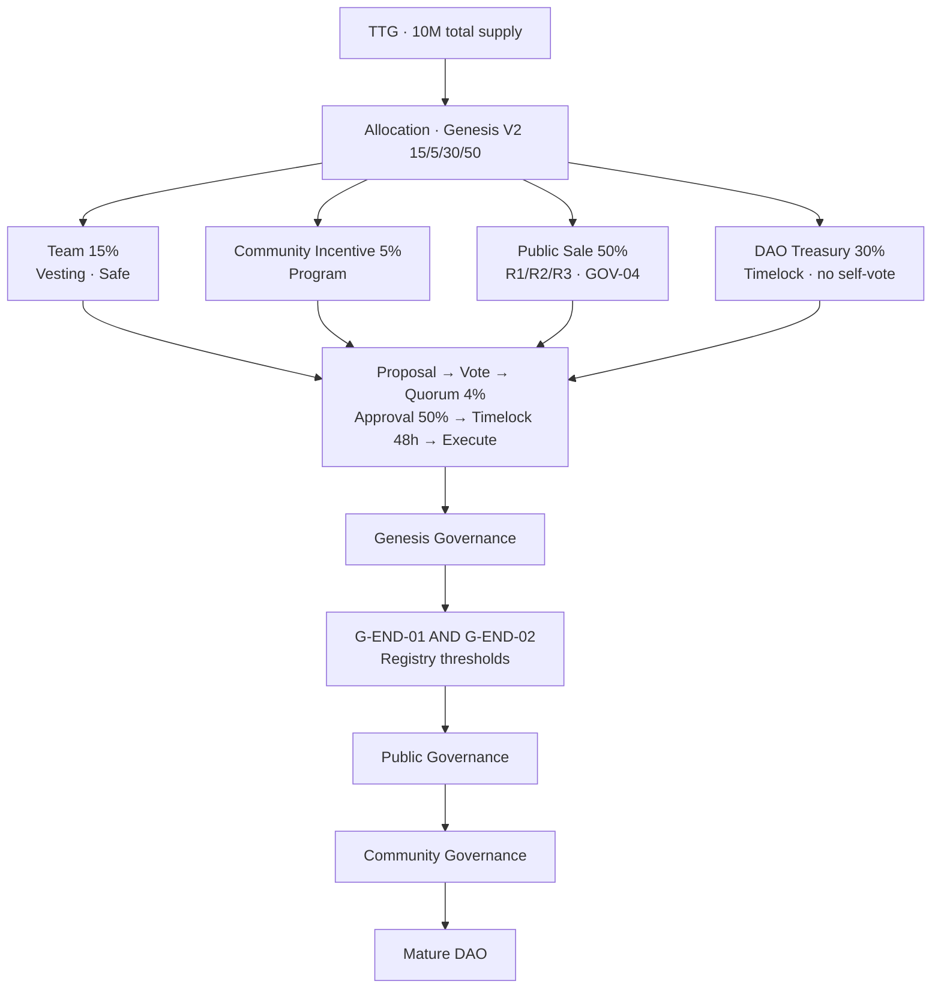

# TTG Governance Lifecycle — 治理生命周期总图（5 分钟读口）

**Document ID:** `TTG-GOVERNANCE-LIFECYCLE`  
**Version:** v1-20260712  
**Status:** **ACTIVE（① 导读 · 不改规则 · 数值读 SSOT / Registry）**  

> **本文件职责：** **一张总图** + 最短路径，让任何人 **5 分钟** 看懂 TTG 从分配到成熟 DAO 的治理系统。  
> **禁止：** 在本文件另造 bps、阈值、供应比例 — 真源见下方索引。

**阶段口径：** ① 文档收口 **≠** ② Sepolia 部署 **≠** ③ Production GO  

---

## §0 从这里开始（60 秒）

| 你要… | 读 |
|--------|-----|
| **看总图（本页）** | §1 ASCII · §2 Mermaid |
| **Genesis 为何能启动** | [GENESIS-GOVERNANCE-PHASE.md](GENESIS-GOVERNANCE-PHASE.md) |
| **Public 进入后发生什么** | [PUBLIC-GOVERNANCE-PHASE.md](PUBLIC-GOVERNANCE-PHASE.md) |
| **GOV-01～04 数值** | [TTG-TOKENOMICS-FREEZE-V1.md](TTG-TOKENOMICS-FREEZE-V1.md)（分配 → [Genesis V2](TTG-TOKENOMICS-GENESIS-V2.md)） |
| **Genesis 退出阈值** | [registry/governance-phase-transition.v1.yaml](../../../registry/governance-phase-transition.v1.yaml) |
| **框架已冻结？** | [TTG-GOVERNANCE-FREEZE-CERTIFICATE.md](TTG-GOVERNANCE-FREEZE-CERTIFICATE.md) |

---

## §1 总图（ASCII）

```text
                        TTG · 10,000,000
                              │
                              ▼
                Allocation（Genesis V2 四块 · FROZEN）
                              │
        ┌─────────────────────┼─────────────────────┐
        │                     │                     │
   Team 15%          Community Incentive 5%   DAO Treasury 30%
   (1.5M Vesting)    (0.5M Program)           (3M · ≠ vote source)
        │                     │                     │
        │              Public Sale 50% (5M)
        │              R1 800K / R2 1.2M / R3 3M
        │                     │                     │
        ▼                     ▼                     ▼
   Vesting · Safe         Primary Market        Timelock · Safe
   (OWNER_INPUT)          GOV-04 cap            默认不 Vote
        │                     │                     │
        └─────────────────────┴─────────────────────┘
                              │
                    流程保护（全阶段）
         Proposal → Vote → Quorum 4% → Approval 50% → Timelock 48h → Execute
                              │
                              ▼
                   Genesis Governance Phase
              team 启动 · 披露 · Seat 一国一控
              Steward：自持 TTG 质押（无 Country Shelf）
                              │
                              ▼
              ┌───────────────────────────────┐
              │  G-END-01  AND  G-END-02      │
              │  Round3 closed  +  Registry   │
              │  public_governance_threshold  │
              └───────────────────────────────┘
                              │
                              ▼
                   Public Governance Phase
              社区持有人实质参与 · 同上 GOV-02
                              │
                              ▼
                  Community Governance
           Community Incentive Program · DAO 按 SSOT 拨付
                              │
                              ▼
                        Mature DAO
              team ≈15% 全供应 · Active Supply 分散
```

---

## §2 总图（Mermaid · 可渲染）



---

## §3 四块一览（读口 · 真源 Genesis V2）

| 块 | 占比 | 治理生命周期中的角色 |
|----|------|----------------------|
| 初创团队 Team | 15% | Genesis 启动 · Vesting（**OWNER_INPUT**） |
| Community Incentive Allocation | 5% | Program 发放 · **非** standard vesting |
| DAO Treasury | 30% | Timelock · **Proposal 动用 · 默认不 Vote** · **≠** 投票权来源 · 禁 Mint 补仓 |
| Public Sale | 50% | R1 → R2 → R3（Registry 初值 800K/1.2M/3M）· Public 阶段社区投票权来源 |

**已取消：** advisors 创世桶 · `country_pool_shelf` · 独立 ecosystem 创世桶。  
**Steward：** 自持 TTG 质押达门槛（无 Country Shelf）。

**数值真源：** [TTG-TOKENOMICS-GENESIS-V2](./TTG-TOKENOMICS-GENESIS-V2.md) · [protocol-ssot §1](protocol-ssot.v1.md)

## §4 三阶段治理（一句话各）

| 阶段 | 一句话 |
|------|--------|
| **Genesis** | Governor 已部署 · 有效 snapshot 内 team/early public 占多数 · **允许** 启动第一批提案（须 GOV-02 + 披露） |
| **Public** | **G-END-01 ∧ G-END-02** 后 · 公募闭合且投票供应达 Registry 阈 · 社区 **实质** 参与 |
| **Community / Mature DAO** | Community Incentive Program / DAO 桶按 SSOT 拨付 · team 占 **Active Voting Supply** 持续下降 · 占 **全供应** 长期 ≈15% |

**Seat（全阶段）：** GOV-03 V1.1 — **一国一控** · `cap_disabled`（无单地址权重上限 · ≠ 无投票权）。

---

## §5 保护栏（不必记细节 · 记这 7 条）

1. **Team Vesting** — schema 已定 · 商业参数 **OWNER_INPUT**  
2. **Safe Multisig** — team / treasury  custody  
3. **Proposal** — 任何 Treasury / P4 / 参数修订须提案  
4. **Quorum 4%** — 按 **总供应** 10M（GOV-02）  
5. **Approval 50%** — 已投权重（GOV-02）  
6. **Timelock 48h** — 执行延迟（GOV-02）  
7. **Seat 一国一控** — 同一控制主体 ≤1 Active Seat（GOV-03）

---

## §6 文档栈（深度阅读顺序）

```text
TTG-GOVERNANCE-LIFECYCLE.md          ← 你在这里（总图）
        ↓
TTG-TOKENOMICS-FREEZE-V1.md          GOV-01～04 数值
        ↓
GENESIS-GOVERNANCE-PHASE.md          启动期解释
        ↓
PUBLIC-GOVERNANCE-PHASE.md           Public / Community
        ↓
GOV-03-AMENDMENT-V1.1.md             Seat-only · cap_disabled
        ↓
ttg-allocation-permissions-flows-ssot-v1.md   权限 · 资金流图解
        ↓
TTG-GOVERNANCE-FREEZE-CERTIFICATE.md  框架冻结签收
```

---

## §7 维护规则

| 变更 | 动作 |
|------|------|
| 改 **总图阶段命名或顺序** | 本文件 + [82-治理币-文档总览](../82-治理币-文档总览.md) · **须** [TTG-GOVERNANCE-FREEZE-CERTIFICATE](TTG-GOVERNANCE-FREEZE-CERTIFICATE.md) 解冻或新版 Certificate |
| 改 **任何 GOV 数值 / 阈值** | **禁止** 静默改本文件 → **Governance Proposal（GOV-02）** + 对应 SSOT / Registry |
| 改 **Mermaid/ASCII 排版** | 本文件 only（不改语义） |

---

## §8 变更记录

| 版本 | 日期 | 说明 |
|------|------|------|
| v1-20260712 | 2026-07-12 | 初版：5 分钟总图 · 链至 Genesis / Public / Freeze Certificate |
