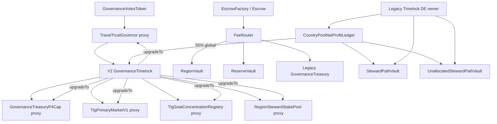

# TravelTrust Web3 Protocol Master Audit Report v1

**Audit ID:** `WEB3_PROTOCOL_MASTER_AUDIT_V1`  
**Sprint:** **W5** · Web3 Master Audit (read-only · no deploy/upgrade)  
**Next:** W6 Runtime Activation Plan → W7 Sepolia Upgrade Execution  
**Generated:** 2026-07-09  
**Scope:** Repository-wide Web3 asset audit — **no code / SSOT / on-chain changes**  
**Machine SSOT:** [registry/traveltrust-web3-protocol-master-matrix.v1.yaml](../../../registry/traveltrust-web3-protocol-master-matrix.v1.yaml)  
**Active deploy baseline:** `gov_freeze_v2_clean_baseline` · Sepolia `11155111`

---

## W5 · Core finding

**Vacancy is not an exception.** The repo exposes a systemic pattern:

| Pattern | Example | Meaning |
|---------|---------|---------|
| **Env / naming evolution** | `TREASURY_ADDRESS` → `GOVERNANCE_TREASURY_P4CAP_ADDRESS` + `LEGACY_TREASURY_ADDRESS` | Historical keys still referenced in API/scripts |
| **Protocol ≠ runtime bytecode** | Repo Vacancy V1 · chain Q-F01 | Latest spec complete · on-chain still legacy stack |
| **Dual control planes** | V2 Gov Timelock vs legacy DE settlement owner | Same network · different admin for settlement triplet |

**Vacancy Ledger accurate state:**

| Layer | Scope | Status |
|-------|-------|--------|
| **Protocol** | SSOT · Solidity · Invariant · PCM · Tests | ✅ **COMPLETE** |
| **Runtime** | Sepolia DE CountryPool stack · Q-F01 legacy | ⏳ **PENDING** |
| **Transparency** | Indexer → Governance Transparency → Operations Console | ✅ **COMPLETE** |

Vacancy does **not** need more product features before runtime activation. It needs **upgrade path confirmation → migration → RUNTIME ACTIVE**.

---

## Three-status model (W5 SSOT)

Every module is classified on **three independent axes**:

| Axis | Enum | Question answered |
|------|------|-----------------|
| **Protocol Status** | `COMPLETE` · `IN_PROGRESS` · `DEPRECATED` | Is the rule/code/spec finished in repo? |
| **Deployment Status** | `NOT_DEPLOYED` · `DEPLOYED` · `VERIFIED` | Is there a known address on ② Sepolia? |
| **Runtime Status** | `ACTIVE` · `LEGACY` · `PENDING_UPGRADE` · `UNKNOWN` | Does on-chain bytecode match current protocol? |

**Verdict** (audit rollup): `PASS` · `CHECK` · `DRIFT` · `PENDING`

---

## 1. Module inventory (Protocol · Chain runtime · Three statuses)

Sepolia `11155111` unless noted. **Chain runtime** = bytecode generation actually running on-chain.

| Module | Protocol (repo) | Chain runtime | Protocol | Deployment | Runtime | Verdict |
|--------|-------------------|---------------|----------|------------|---------|---------|
| **TTG Token** | V1 / GOV-Freeze | V1 immutable | COMPLETE | VERIFIED | ACTIVE | **PASS** |
| **Governor** | V2 clean baseline | V2 proxy | COMPLETE | VERIFIED | ACTIVE | **PASS** |
| **Timelock (V2)** | V2 controller | V2 immutable shell | COMPLETE | VERIFIED | ACTIVE | **PASS** |
| **Treasury P4Cap** | V2 · GOV-01 | V2 proxy | COMPLETE | VERIFIED | ACTIVE | **CHECK** (env/API naming drift) |
| **Treasury Legacy** | Fund-stack | V1 `GovernanceTreasury` | DEPRECATED | VERIFIED | LEGACY | **PASS** (FeeRouter 15% leg · intentional) |
| **Primary Market** | V1 · GOV-04 | V2 proxy deployed | COMPLETE | VERIFIED | ACTIVE | **CHECK** (UI deferred · ops not exercised) |
| **Seat Registry** | V2 · GOV-03 | V2 proxy | COMPLETE | VERIFIED | ACTIVE | **PASS** |
| **Steward Stake Pool** | V2 | V2 proxy | COMPLETE | VERIFIED | ACTIVE | **PASS** |
| **Escrow V1** | V1 | V1 factory + instances | COMPLETE | VERIFIED | ACTIVE | **PASS** (② only · mainnet forbidden) |
| **Escrow V2** | V2 bilateral | — | COMPLETE | NOT_DEPLOYED | UNKNOWN | **PENDING** (mainnet required) |
| **FeeRouter** | D-4555-A 45/55 | V1 deployed | COMPLETE | VERIFIED | ACTIVE | **PASS** |
| **Region Vault** | Fund stack | V1 | COMPLETE | VERIFIED | ACTIVE | **PASS** |
| **Reserve Vault** | Fund stack | V1 | COMPLETE | VERIFIED | ACTIVE | **PASS** |
| **Country Pool Ledger (DE)** | D-4555-B + Vacancy V1 spec | **Q-F01** stack | COMPLETE | VERIFIED | **LEGACY** | **DRIFT** |
| **Steward Path Vault (DE)** | V1 | Q-F01 | COMPLETE | VERIFIED | LEGACY | **DRIFT** |
| **Unallocated / Vacancy Vault (DE)** | **Vacancy V1** | **Q-F01** | COMPLETE | VERIFIED | **LEGACY** | **PENDING** |
| **Vacancy Ledger (logic)** | V1 PCM S1–S4 | Q-F01 (no V1 views) | COMPLETE | DEPLOYED | LEGACY | **PENDING** |
| **Country Pool Ledger V0 (CN pilot)** | V0 pilot | V0 | COMPLETE | VERIFIED | ACTIVE | **PASS** (separate pilot · not DE net-profit) |
| **Redemption Epoch V0 (CN)** | V0 pilot | V0 | COMPLETE | VERIFIED | ACTIVE | **PASS** |
| **Distribution Claim** | Spec + contracts | Not on Sepolia spine | COMPLETE | NOT_DEPLOYED | UNKNOWN | **CHECK** |
| **Indexer / Transparency** | W3 + W4a/W4b | Off-chain | COMPLETE | DEPLOYED | ACTIVE | **PASS** |

**Vacancy one-liner:**

```
Protocol: COMPLETE  |  Deployment: DEPLOYED  |  Runtime: LEGACY
```

---

## Executive summary

| Dimension | Verdict | Notes |
|-----------|---------|-------|
| Protocol numerics SSOT | **Aligned** | `protocol-ssot.v1.yaml` v1.0.3 ↔ MD ↔ `TtgGovFreezeConstants.sol` |
| Sepolia address spine | **Aligned** | V2 baseline matches `protocol-convergence-deployments` ↔ master matrix |
| On-chain governance posture | **Sound** | 5 proxy shells · Timelock-only upgrade admin · token immutable |
| Settlement / Vacancy | **Split boundary** | Protocol **COMPLETE** · DE runtime **LEGACY** (Q-F01 bytecode) |
| Env / API / FE drift | **Material** | Treasury key sprawl · stale tokenomics doc version · chain default 137 |
| Mainnet readiness | **Gated** | EscrowFactory V2 unset · dual Timelock on DE stack · ③ not started |

### Gate result

```
WEB3_PROTOCOL_MASTER_AUDIT_GATE: WARN
```

**Rationale:** Core SSOT and Sepolia spine are coherent; no evidence of Timelock bypass for proxy upgrades. WARN reflects **documented HIGH-severity env/API treasury drift**, **runtime-vs-protocol gap** on Vacancy DE vaults, **EscrowFactory V2 PENDING**, and **master matrix human doc lag** — none block ② pilot ops but must be resolved before ③ Production GO.

**Honest boundary:** ① doc/registry audit ≠ ② on-chain verification ≠ ③ mainnet GO.

**Recommended sequence (confirmed by audit):**

```
W5 Web3 Master Audit     ← this document (COMPLETE · WARN)
        ↓
W6 Runtime Activation Plan   (upgrade map · migration · capability probes)
        ↓
W7 Sepolia Upgrade Execution (Governor → Timelock · no EOA shortcuts)
```

---

## 2. Upgrade map (Proxy → Implementation → Admin)

All governable shells use **`TimelockUpgradeableProxy`**. Upgrade method: **`upgradeTo(address)`** on proxy, callable only by proxy admin (= V2 Timelock). Path: **`Governor.propose → Timelock.schedule (48h) → Timelock.execute`**.

| Contract | Proxy | Implementation | Admin / Upgrade admin | Timelock delay | Upgrade method |
|----------|-------|----------------|----------------------|----------------|----------------|
| TravelTrustGovernor | `0x847b00ddb6ffed71812abc358a407dad4b099fcb` | `0x91C479a93dA2B4D78C03EeE03Db9A5AD65d09968` | `0x904a6c4c6aab698afbf08ec6151d317c393520cc` | 48h | `upgradeTo` |
| GovernanceTreasuryP4Cap | `0xc1de17cd47b3ef2a68a4dc6cb1a5cc4fd4eb5ce2` | `0xeb2542f912215d1cA46394360a854b32586b8303` | V2 Timelock | 48h | `upgradeTo` |
| TtgPrimaryMarketV1 | `0x7af15f98622b9282298ca3070a698ca4a96a4016` | `0x94F23511fe808efdc2DDA5b98dCE34c513644F12` | V2 Timelock | 48h | `upgradeTo` |
| TtgSeatConcentrationRegistry | `0xc99776e980d33f1857d5bb9a57b35ab7669aad1f` | `0xa6326194358C0D8dd22950Ffe8071C7BE1d21e9D` | V2 Timelock | 48h | `upgradeTo` |
| RegionStewardStakePool | `0x3a89378bfad12d1028707dd37055294854c8784e` | `0x7e9B940302E3aEf8e880F49BDe88247A2721ac2f` | V2 Timelock | 48h | `upgradeTo` |

**Non-proxy · immutable exempt (no `upgradeTo`):** `CountryPoolNetProfitLedger`, `StewardPathVault`, `UnallocatedStewardPathVault`, `FeeRouter`, `EscrowFactory`, fund-stack pools. **Vacancy V1 runtime activation on DE requires redeploy or governed migration** — not proxy upgrade.

**DE settlement owner (separate from V2 gov):** legacy Timelock `0x0359d4fB9c4B9f69188A1E9AE2202ABfeD1fEe8f` owns DE triplet at deploy time.

---

## 3. Treasury / fund flow audit

### 3.1 Two treasuries — roles must not collide

| Treasury | Address | Receives from | Does NOT receive |
|----------|---------|---------------|------------------|
| **GovernanceTreasuryP4Cap (ACTIVE)** | `0xc1de17cd…` | Primary Market USDC · governance-approved spend | FeeRouter per-order platform fees |
| **GovernanceTreasury (LEGACY)** | `0x6a8323fb…` | FeeRouter global 55% → **15% operations leg only** | Primary Market proceeds |

**Audit conclusion:** On-chain **route separation is correct** — the same user USDC payment does **not** hit both treasuries. **Risk is off-chain naming:** deprecated `TREASURY_ADDRESS` and API fallbacks can **mis-label** RegionVault or wrong key as treasury (see W3-AUDIT-001～003). That is **metadata drift**, not double-collection on-chain.

### 3.2 Route A — Primary Market → Governance Treasury

```
User USDC → TtgPrimaryMarketV1 (0x7af15f98…) → GovernanceTreasuryP4Cap (0xc1de17cd…)
Spend: Governor → V2 Timelock → execute (GOV-01 30% quarterly cap)
```

### 3.3 Route B — Escrow → FeeRouter → pools / legacy treasury

```
User Payment → EscrowFactory → Escrow → FeeRouter (0x81A80092…)
  → 45% RegionVault (0x2Ea061d5…)
  → 55% global split → 65% stake incentive / 20% ReserveVault / 15% Legacy Treasury (0x6a8323fb…)
```

Net profit (DE D-4555-B) is a **separate quarter-close rail** on `CountryPoolNetProfitLedger` — not the same entrypoint as per-order FeeRouter.

---

## 4. Settlement audit (duplicate ledger check)

| Ledger / vault | Purpose | Jurisdiction | Duplicate? |
|----------------|---------|--------------|------------|
| `CountryPoolNetProfitLedger` | Quarter net profit · splitNetProfit · Vacancy gate | DE | **Primary DE settlement SSOT** |
| `CountryPoolLedgerV0` | Pilot subscription ledger | CN pilot | **No** — different product generation |
| `StewardPathVault` / `UnallocatedStewardPathVault` | 45% profit path legs | DE | **No** — vault legs, not competing ledgers |
| Indexer `vacancy_ledger_projections` | Off-chain event projection | All indexed | **No** — read model only · forbidden reserve recompute |
| `InvestorDistributionClaim` / `RegionDistributionClaim` | Claim contracts | Not on Sepolia spine | **No collision today** · deploy before production claims |

**Finding:** No **duplicate on-chain ledger** for DE net profit. **Runtime drift** (Q-F01 vs Vacancy V1) is a **version** problem, not two ledgers writing the same jurisdiction.

---

## A. Smart Contract Inventory (detail)

**Status enum:** `PROTOCOL_COMPLETE` · `DEPLOYED` · `VERIFIED` · `RUNTIME_ACTIVE` · `PENDING_UPGRADE` · `LEGACY` · `UNKNOWN`

**Active network for ②:** Sepolia (`11155111`). Deploy blocks not recorded in registry → `null`.

### A.1 Governance & token

| Contract | Purpose | Solidity Path | Version | Proxy | Proxy Address | Implementation | Network | Owner / Admin | Timelock | Upgrade Admin | ABI | Registry | Status |
|----------|---------|---------------|---------|-------|---------------|----------------|---------|---------------|----------|---------------|-----|----------|--------|
| GovernanceVotesToken | TTG voting token · snapshot votes | `contracts/src/GovernanceVotesToken.sol` | GOV-Freeze V1 | Non-proxy | — | same | Sepolia | initialHolder at deploy | — | N/A (immutable) | `contracts/abi/GovernanceVotesToken.json` | `gov_freeze_v2` · `governance_token_address` | **DEPLOYED** · **VERIFIED** |
| GovernanceTimelock | 48h delay controller | `contracts/src/GovernanceTimelock.sol` | V2 clean baseline | Non-proxy | — | same | Sepolia | TIMELOCK_ADMIN (Safe) | — | N/A (fresh deploy only) | `contracts/abi/GovernanceTimelock.json` | `timelock_address` | **DEPLOYED** |
| TravelTrustGovernor | OpenZeppelin-style governor | `contracts/src/TravelTrustGovernor.sol` | V2 | **Proxy** | `0x847b00ddb6ffed71812abc358a407dad4b099fcb` | `0x91C479a93dA2B4D78C03EeE03Db9A5AD65d09968` | Sepolia | Timelock (via proxy admin) | `0x904a6c4c6aab698afbf08ec6151d317c393520cc` | V2 Timelock | `contracts/abi/TravelTrustGovernor.json` | `governor_address` | **DEPLOYED** · **VERIFIED** |
| GovernanceTreasuryP4Cap | DAO treasury · GOV-01 P4 cap | `contracts/src/GovernanceTreasuryP4Cap.sol` | V2 | **Proxy** | `0xc1de17cd47b3ef2a68a4dc6cb1a5cc4fd4eb5ce2` | `0xeb2542f912215d1cA46394360a854b32586b8303` | Sepolia | Timelock | V2 Timelock | V2 Timelock | `contracts/abi/GovernanceTreasuryP4Cap.json` | `treasury_p4_cap_address` | **DEPLOYED** · **VERIFIED** |
| GovernanceTreasury | Legacy FeeRouter globalOps leg | `contracts/src/GovernanceTreasury.sol` | Fund stack | Non-proxy | — | same | Sepolia | Fund stack deploy | Legacy fund Timelock | N/A | `contracts/abi/GovernanceTreasury.json` | `legacy_treasury_address` | **LEGACY** · **DEPLOYED** |
| TtgPrimaryMarketV1 | Public sale rounds (GOV-04) | `contracts/src/TtgPrimaryMarketV1.sol` | V2 | **Proxy** | `0x7af15f98622b9282298ca3070a698ca4a96a4016` | `0x94F23511fe808efdc2DDA5b98dCE34c513644F12` | Sepolia | Timelock | V2 Timelock | V2 Timelock | `contracts/abi/TtgPrimaryMarketV1.json` | `primary_market_address` | **DEPLOYED** · UI **DEFER** |
| TtgSeatConcentrationRegistry | Seat concentration (GOV-03) | `contracts/src/TtgSeatConcentrationRegistry.sol` | V2 | **Proxy** | `0xc99776e980d33f1857d5bb9a57b35ab7669aad1f` | `0xa6326194358C0D8dd22950Ffe8071C7BE1d21e9D` | Sepolia | Timelock | V2 Timelock | V2 Timelock | `contracts/abi/TtgSeatConcentrationRegistry.json` | `seat_registry_address` | **DEPLOYED** |
| RegionStewardStakePool | Region steward seat stake | `contracts/src/RegionStewardStakePool.sol` | V2 | **Proxy** | `0x3a89378bfad12d1028707dd37055294854c8784e` | `0x7e9B940302E3aEf8e880F49BDe88247A2721ac2f` | Sepolia | Timelock | V2 Timelock | V2 Timelock | `contracts/abi/RegionStewardStakePool.json` | `region_steward_stake_pool_proxy_address` | **DEPLOYED** |
| TimelockUpgradeableProxy | EIP-1967 proxy shell | `contracts/src/upgrade/TimelockUpgradeableProxy.sol` | G24 | Proxy shell | per contract | — | Sepolia | V2 Timelock | — | V2 Timelock | *(no checked-in ABI)* | `g24-p-upgrade-01-contract-posture` | **DEPLOYED** |
| TtgGovFreezeConstants | GOV-01～04 constants lib | `contracts/src/TtgGovFreezeConstants.sol` | — | N/A | — | — | — | — | — | — | — | protocol-ssot | **PROTOCOL_COMPLETE** |
| RouterTreasuryGovernancePayload | Governance calldata helpers | `contracts/src/RouterTreasuryGovernancePayload.sol` | — | N/A | — | — | — | — | — | — | — | — | **PROTOCOL_COMPLETE** |

### A.2 Payment & escrow

| Contract | Purpose | Path | Proxy | Sepolia Address | ABI | Status |
|----------|---------|------|-------|-----------------|-----|--------|
| EscrowFactory | Per-order Escrow deploy (V1) | `EscrowFactory.sol` | Non-proxy | `0xbf746B6a330e61416c6D87aB9b0758f7107C8006` | `contracts/abi/EscrowFactory.json` | **DEPLOYED** · mainnet **FORBIDDEN** |
| EscrowFactoryV2 | Bilateral confirmation escrow | `EscrowFactoryV2.sol` | Non-proxy | `null` | *(no ABI in repo)* | **PENDING_UPGRADE** · mainnet **REQUIRED** |
| Escrow | Order escrow instance | `Escrow.sol` | Per-instance | via factory | `contracts/abi/Escrow.json` | **DEPLOYED** (instances) |
| EscrowV2 | V2 escrow instance | `EscrowV2.sol` | Per-instance | — | *(no ABI)* | **PROTOCOL_COMPLETE** · not broadcast |
| FeeRouter | Platform fee 45/55 split | `FeeRouter.sol` | Non-proxy | `0x81A8009210c5215100564c6E4123F672c4459306` | `contracts/abi/FeeRouter.json` | **DEPLOYED** |
| OnboardingFeeReceiver | Onboarding fee sink | `OnboardingFeeReceiver.sol` | Non-proxy | env-only | `contracts/abi/OnboardingFeeReceiver.json` | **UNKNOWN** (not in master matrix) |
| MockERC20 | Sepolia USDC track | `MockERC20.sol` | Non-proxy | `0x241948bE49a778490c8A4Ae8D98b7537fE001f63` | `contracts/abi/MockERC20.json` | **DEPLOYED** |

### A.3 Staking & reserve

| Contract | Purpose | Path | Proxy | Sepolia | Status |
|----------|---------|------|-------|---------|--------|
| GuideIdentityStakingPool | Guide identity stake | `GuideIdentityStakingPool.sol` | No | `0x5bdACF35292bDd681103BBb50865d8D2Fd49653f` | **DEPLOYED** |
| ProviderIdentityStakingPool | Provider identity stake | `ProviderIdentityStakingPool.sol` | No | `0xa90cA23767C1DdcA1Eb8AB292185e9af1106b075` | **DEPLOYED** |
| ReserveVault | FeeRouter 20% reserve leg | `ReserveVault.sol` | No | `0xbC541FAf26e139eF1f0AC22b52c4b4F85FFF7855` | **DEPLOYED** |
| SlashRouter | Slash routing | `SlashRouter.sol` | No | — | **UNKNOWN** (no Sepolia address in registry) |
| IdentityStakingPool | Abstract base | `IdentityStakingPool.sol` | N/A | — | **PROTOCOL_COMPLETE** |

### A.4 Region / distribution / registry

| Contract | Purpose | Path | Sepolia | Status |
|----------|---------|------|---------|--------|
| RegionVault | Country bucket 45% leg | `RegionVault.sol` | `0x2Ea061d50393c09af2f607Ee9f89679642A3a65B` | **DEPLOYED** |
| Registry | On-chain registry | `Registry.sol` | `0xc50913e154f850583D0afbE9158a75E0e2167AAb` | **DEPLOYED** |
| InvestorDistributionClaim | Investor claim | `InvestorDistributionClaim.sol` | — | **UNKNOWN** |
| RegionDistributionClaim | Region distribution claim | `RegionDistributionClaim.sol` | — | **UNKNOWN** |
| InvestorShareLockLedger | Share lock ledger | `InvestorShareLockLedger.sol` | — | **UNKNOWN** |

### A.5 Country pool · settlement · vacancy (D-4555-B)

| Contract | Purpose | Path | Proxy | Sepolia | Owner Timelock | Status |
|----------|---------|------|-------|---------|----------------|--------|
| CountryPoolNetProfitLedger | Net profit ledger · splitNetProfit | `CountryPoolNetProfitLedger.sol` | No | `0x2704566A6657DcbEEBB71e43cEca381f16E1a8Aa` | Legacy `0x0359d4fB…` | **DEPLOYED** · Vacancy views **LEGACY** |
| StewardPathVault | Q-01～Q-04 steward path | `StewardPathVault.sol` | No | `0x6B3391c0b6297A5866c0bB7AD06dA99E08F0a3fb` | Legacy Timelock | **DEPLOYED** |
| UnallocatedStewardPathVault | Q-F01 / vacancy vault | `vacancy/UnallocatedStewardPathVault.sol` | No | `0xAbE36f8eF43D544b9D0e1c0A5F9638dC37Ed33D0` | Legacy Timelock | **DEPLOYED** · runtime **LEGACY** |
| CountryPoolLedgerV0 | Pilot ledger (CN) | `CountryPoolLedgerV0.sol` | No | `0x63bd7d5ee5c5dde707e5e65303f3876267c78e97` | — | **DEPLOYED** (pilot) |
| CountryPoolRedemptionEpochV0 | Redemption epoch pilot | `CountryPoolRedemptionEpochV0.sol` | No | `0x712050e4b1517C3f3ab39B32Cabb70CC0E1C0829` | — | **DEPLOYED** (CN) |
| CountryPoolSubVaultsV0 | Sub-vault target | `CountryPoolSubVaultsV0.sol` | No | — | — | **PROTOCOL_COMPLETE** · not deployed |
| CountryPoolNetProfitGovernancePayload | Governance calldata | `CountryPoolNetProfitGovernancePayload.sol` | N/A | — | — | **PROTOCOL_COMPLETE** |
| VacancyGovernance / Lib / Events / Types | Vacancy V1 support | `vacancy/*.sol` | N/A | — | — | **PROTOCOL_COMPLETE** |

**Vacancy runtime note:** Forge + indexer prove **Vacancy Ledger V1 protocol path**; DE Sepolia vault bytecode is **Q-F01_LEGACY_BYTECODE** — capability probe returns `SKIPPED_PRE_V1`. Status = **PROTOCOL_COMPLETE** (repo) + **LEGACY** (on-chain runtime).

### A.6 ABI coverage gap

| Missing checked-in ABI | Risk |
|------------------------|------|
| `EscrowV2`, `TimelockUpgradeableProxy`, `InvestorShareLockLedger` | FE/API integration blocked until export |
| Vacancy libs (events-only) | Low — consumed via manifest |

**Frontend ABI mirror:** `frontend/dapp/abis/` — 11 files (subset of `contracts/abi/`).

---

## B. Token System Audit

### B.1 On-chain & SSOT parameters

| Field | SSOT | Contract / deploy | Match |
|-------|------|-------------------|-------|
| Symbol | TTG | `GovernanceVotesToken.symbol` | ✅ |
| Decimals | 18 | `decimals` constant | ✅ |
| Total supply | 10,000,000 TTG | Constructor mint once | ✅ |
| Sepolia address | `0x2837ea0c50e27d59b88af617abbb231a040062c5` | Registry | ✅ |
| Mint after deploy | **Forbidden** | No mint function | ✅ |
| Burn on-chain | **None** | No `_burn` | ✅ (policy burn = governance narrative only) |
| Voting delegation | `getPastVotes` / checkpoints | Implemented | ✅ |

### B.2 Allocation (10,000 bps)

| Bucket | bps | TTG units | SSOT | Freeze doc |
|--------|-----|-----------|------|------------|
| country_pool_shelf | 2500 | 2,500,000 | ✅ | ✅ |
| public_global | 2000 | 2,000,000 | ✅ | ✅ |
| ecosystem | 1500 | 1,500,000 | ✅ | ✅ |
| team | 1500 | 1,500,000 | ✅ | ✅ |
| advisors | 500 | 500,000 | ✅ | ✅ |
| treasury_dao | 2000 | 2,000,000 | ✅ | ✅ |

**Public sale (GOV-04):** rounds 500k / 500k / 1M TTG · 25k wallet cap · 100 USDC min — frozen in `TTG-TOKENOMICS-FREEZE-V1.md`.

### B.3 Cross-surface consistency

| Surface | Version / data | Status |
|---------|----------------|--------|
| `protocol-ssot.v1.yaml` | v1.0.3 | ✅ authoritative |
| `protocol-ssot.v1.md` | v1.0.3 | ✅ |
| `TtgGovFreezeConstants.sol` | GOV-01～04 | ✅ |
| API `PROTOCOL_SSOT_VERSION` | 1.0.3 | ✅ |
| `frontend/lib/governance/protocolSsot.v1.ts` | 1.0.3 | ✅ |
| `frontend/lib/governance/governanceParamsTokenomicsModel.ts` | **1.0.2** string | ⚠️ **DRIFT** (numerics OK) |

---

## C. Governance Architecture

### C.1 Components (Sepolia V2)

| Role | Contract | Address | Upgrade |
|------|----------|---------|---------|
| Token | GovernanceVotesToken | `0x2837ea0c…` | Immutable |
| Governor | TravelTrustGovernor (proxy) | `0x847b00dd…` | Timelock → `upgradeTo` |
| Timelock | GovernanceTimelock | `0x904a6c4c…` | Non-upgradeable controller |
| Treasury (active) | GovernanceTreasuryP4Cap (proxy) | `0xc1de17cd…` | Timelock |
| Primary Market | TtgPrimaryMarketV1 (proxy) | `0x7af15f98…` | Timelock · UI deferred |
| Seat registry | TtgSeatConcentrationRegistry | `0xc99776e9…` | Timelock |

### C.2 Proposal flow

```
TTG Holder
  → Governor.propose(targets, values, calldatas, description)
  → castVote (for/against/abstain)
  → queue (timelock)
  → Timelock.schedule (48h delay)
  → Timelock.execute
  → target contract (spend / upgrade / param change)
```

### C.3 Voting parameters (frozen)

| Parameter | Value | Source |
|-----------|-------|--------|
| Quorum | 400 bps of supply at snapshot | GOV-02 |
| Approval | 5000 bps of cast votes | GOV-02 |
| Timelock delay | 48 hours | GOV-02 · immutable in Timelock |
| Max voting power / address | 400 bps | GOV-03 |
| P4 deploy cap / quarter | 3000 bps of reserve | GOV-01 |

### C.4 Admin roles & bypass check

| Check | Result |
|-------|--------|
| Proxy upgrade admin = V2 Timelock | ✅ Verified in `proxy_implementations` |
| Governor owned by Timelock (not EOA) | ✅ G24 posture |
| Token mint after deploy | ✅ No path |
| Bare EOA upgrade on governable shells | ✅ Forbidden by `TimelockUpgradeableProxy` |
| **Dual Timelock on DE settlement** | ⚠️ DE triplet owner = **legacy** `0x0359d4fB…` ≠ V2 `0x904a6c4c…` — **documented** · not a bypass of V2 gov stack but **operational split** |

**Legacy baseline:** `gov_freeze_v1_baseline` superseded — do not roll back.

---

## D. Treasury Flow Audit

### D.1 TTG / primary market rail

```
User USDC
    │
    ▼
TtgPrimaryMarketV1 (proxy · 0x7af15f98…)
    │
    ▼
GovernanceTreasuryP4Cap (proxy · 0xc1de17cd…)
    │
    └── spend via Governor → Timelock → execute (GOV-01 cap)
```

| Step | Address | Governance controlled | Auto |
|------|---------|----------------------|------|
| Primary Market | `0x7af15f98622b9282298ca3070a698ca4a96a4016` | Yes (proxy) | Sale rules in contract |
| P4Cap Treasury | `0xc1de17cd47b3ef2a68a4dc6cb1a5cc4fd4eb5ce2` | Yes | No auto spend |

### D.2 Travel payment rail (D-4555-A)

```
User Payment (USDC)
    │
    ▼
EscrowFactory → Escrow (per order)
    │
    ▼
FeeRouter (0x81A80092…)
    ├── 45% → RegionVault (0x2Ea061d5…)
    └── 55% → Global Pool split
            ├── 65% TTG staking incentive
            ├── 20% ReserveVault (0xbC541FAf…)
            └── 15% Legacy Treasury (0x6a8323fb…)
```

| Leg | Contract | Governance | Auto |
|-----|----------|------------|------|
| Country bucket | RegionVault | Timelock-owned fund stack | On fee route |
| Reserve | ReserveVault | Fund stack | On fee route |
| Ops / legacy treasury | GovernanceTreasury | Fund stack | On fee route |

### D.3 Net profit rail (D-4555-B · DE pilot)

```
Quarter close → CountryPoolNetProfitLedger.splitNetProfit(epochId)
    ├── 45% → StewardPathVault OR UnallocatedStewardPathVault (Q-F01)
    └── 55% → Global Treasury (V2 Timelock as globalTreasury target)
         └── evaluateVacancySweep (when SWEEP + sweepEnabled + V1 runtime)
```

| Vault | Address | Owner | Governance disburse |
|-------|---------|-------|---------------------|
| Net profit ledger | `0x2704566A…` | Legacy Timelock | `disburseJurisdictionReserve` via Gov→Timelock |
| Unallocated / Vacancy | `0xAbE36f8e…` | Legacy Timelock | Same · **V1 views pending deploy** |

---

## E. Pool System Audit

| Pool / module | Token | Accounting model | Owner | Release / claim |
|---------------|-------|------------------|-------|-----------------|
| Region Vault | USDC | FeeRouter country 45% bucket | Fund stack Timelock | Forward / internal ops |
| Steward stake pool | TTG | StakeAccountingLib | V2 Timelock (proxy) | Unstake rules + slash |
| Guide / Provider stake | TTG | Identity staking | Fund stack | Identity unlock paths |
| Country Pool (target) | USDC | NAV = assets − reserves − pending | Per jurisdiction | Subscription / redemption queue |
| Country Pool Ledger V0 | USDC | Pilot CN ledger | — | Pilot only |
| Redemption Epoch V0 | MockERC20 (pilot) | Epoch queue | CN pilot | Redemption window |
| Reserve (FeeRouter) | USDC | 20% global leg | ReserveVault | Ops / governance |
| Unallocated path | USDC | Q-F01 vacant steward deposits | Legacy Timelock | Vacancy sweep path |
| Vacancy Ledger | USDC (reserve leg) | `principal/swept/reserve/disbursed` event SSOT | Governance params | Sweep via settlement · disburse via Gov |

**Indexer discipline:** `reserve` from events only — **forbidden:** `reserve = principal - swept - disbursed`.

---

## F. Settlement System Audit

| Capability | Spec / contract | Sepolia DE | Status |
|------------|-----------------|------------|--------|
| Settlement ledger | `CountryPoolNetProfitLedger` | Deployed | ✅ ABI frozen |
| Epoch | `splitNetProfit(epochId)` | Callable | ✅ |
| Snapshot | Indexer projections + reconcile | W3 gate PASS | ✅ |
| Claim | `InvestorDistributionClaim` / region variants | Addresses not in spine | ⚠️ partial |
| Distribution | FeeRouter + RegionVault | Deployed | ✅ |
| Accounting mapping | `country-pool-net-profit-accounting-spec-v1.md` | SSOT | ✅ |
| Vacancy six-event indexer | `vacancy-ledger-indexer-schema-v1.json` | PASS | ✅ |
| Live reconcile vs chain views | capability probe | **SKIPPED_PRE_V1** | ⚠️ runtime gap |

---

## G. Dependency Graph



### G.1 Core dependencies

| Dependency | Type |
|------------|------|
| Timelock as sole proxy admin | **Core** · upgrade choke point |
| TTG → Governor voting | **Core** |
| FeeRouter → RegionVault / Reserve / Legacy Treasury | **Core** payment |
| Ledger → Vault triplet | **Core** settlement (DE) |
| Indexer → API → Governance/Admin UI | **Core** observability |

### G.2 Upgrade surfaces

| Surface | Admin | Risk |
|---------|-------|------|
| 5× TimelockUpgradeableProxy | V2 Timelock | **Governed** · 48h delay |
| DE settlement triplet | Legacy Timelock owner | **Immutable exempt** · redeploy for Vacancy V1 |
| EscrowFactory V2 | Timelock guardian (design) | **Pending** broadcast |
| GovernanceVotesToken | — | **None** |

### G.3 Single-point / split risks

| Risk | Severity | Mitigation |
|------|----------|------------|
| Dual Timelock (V2 gov vs DE settlement owner) | MEDIUM | Documented · migrate DE owner or align on upgrade |
| Legacy Treasury still on FeeRouter 15% leg | LOW | Deprecated naming · still receives fees |
| EscrowFactory V1 on Sepolia while V2 required mainnet | MEDIUM | Broadcast V2 before ③ |
| Vacancy protocol complete but DE runtime legacy | HIGH (ops) | Deploy Vacancy V1 bytecode to DE triplet |

---

## H. Drift Audit

| Issue ID | Severity | Location | Current | Expected | Recommended Action |
|----------|----------|----------|---------|----------|-------------------|
| W3-AUDIT-001 | **HIGH** | `crates/api/src/chain/mod.rs` | `treasury_address` falls back to `REGION_VAULT_ADDRESS` | P4Cap only via `GOVERNANCE_TREASURY_P4CAP_ADDRESS` | Remove region vault fallback; separate fields in `/meta` |
| W3-AUDIT-002 | **HIGH** | `crates/api/src/routes/governance/governance_pool.rs` | Reads `GOVERNANCE_TREASURY_ADDRESS` | `GOVERNANCE_TREASURY_P4CAP_ADDRESS` per W2 catalog | Alias or fix env key; document in catalog |
| W3-AUDIT-003 | **HIGH** | `scripts/dev/phase2-sepolia-fundstack-verify-bindings.sh` | Verifies `FeeRouter.globalOps` vs `TREASURY_ADDRESS` / `GOVERNANCE_TREASURY_ADDRESS` | `LEGACY_TREASURY_ADDRESS` (`0x6a8323…`) | Update verify script keys (post-audit PR) |
| W3-AUDIT-004 | **MEDIUM** | `docs/spec/governance-token/traveltrust-web3-protocol-master-matrix-v1.md` vs `.yaml` | MD: W3 NEXT · S4b PLANNED · dashboard PLANNED | YAML: W3/W4/W4a/W4b COMPLETE | Refresh human matrix doc from YAML |
| W3-AUDIT-005 | **MEDIUM** | DE `UnallocatedStewardPathVault` on Sepolia | Q-F01 legacy bytecode | Vacancy V1 view selectors present | Deploy/upgrade Vacancy V1 runtime · capability probe PASS |
| W3-AUDIT-006 | **MEDIUM** | Master matrix `layers.vacancy` | S4a IN_PROGRESS · S4b PLANNED | S4a/S4b/W4a/W4b COMPLETE per PCM | Sync matrix layer block (audit YAML) |
| W3-AUDIT-007 | **MEDIUM** | `escrow_factory_v2_address` | `null` on Sepolia | Populated before mainnet GO | Broadcast `DeployEscrowFactoryV2.s.sol` |
| W3-AUDIT-008 | **MEDIUM** | Dual Timelock | DE owner `0x0359d4fB…` vs V2 `0x904a6c4c…` | Single operational story or explicit migration plan | Document in runbook · plan owner transfer or redeploy |
| W3-AUDIT-009 | **MEDIUM** | `crates/api/src/chain/mod.rs` | `COUNTRY_POOL_LEDGER_ADDRESS` aliases net-profit ledger | Pilot vs net-profit distinct contracts | Restrict alias · use explicit env keys |
| W3-AUDIT-010 | **MEDIUM** | Prod/staging API env | Missing `SETTLEMENT_TOKEN` | `0x241948bE…` matching FE fly build | Add to API env templates |
| W3-AUDIT-011 | **LOW** | `governanceParamsTokenomicsModel.ts` | `PROTOCOL_SSOT_DOC_VERSION = "1.0.2"` | `"1.0.3"` | Bump display version |
| W3-AUDIT-012 | **LOW** | `frontend/lib/chainEnv.ts` · API `chain/mod.rs` | Default chain **137** | **11155111** for phase2-aligned dev | Change defaults or fail-fast without env |
| W3-AUDIT-013 | **LOW** | `GOV-FREEZE-V2-SEPOLIA-BASELINE-FREEZE.md` | Omits `treasury_p4_cap_address` in freeze table | Include `0xc1de17cd…` | Doc patch |
| W3-AUDIT-014 | **LOW** | `contracts/abi/` | No ABI for EscrowV2 / TimelockUpgradeableProxy | Exported ABIs in repo | Run export after deploy |
| W3-AUDIT-015 | **LOW** | `frontend/dapp/abis/` | 11 ABIs vs 30 canonical | Expand or document subset policy | Sync critical settlement ABIs |
| W3-AUDIT-016 | **INFO** | `registry/api-build-health.v1.yaml` | Full API bin ~46 compile errors | Isolated from Vacancy gates | Track via `API_BUILD_HEALTH` gate |
| W3-AUDIT-017 | **MEDIUM** | D-4555-A vs D-4555-B docs | Both use 45/55 split language | Explicit labels FeeRouter vs net profit | Training / doc headers only |
| W3-AUDIT-018 | **LOW** | `.env.production.example` · `.env.preprod.local.example` | Placeholder `TREASURY_ADDRESS` | W2 keys P4Cap + LEGACY | Example env cleanup |
| W3-AUDIT-019 | **LOW** | `scripts/dev/.env.production.local` | Empty `REGION_VAULT_ADDRESS` | `0x2Ea061d5…` | Fill for spine completeness |
| W3-AUDIT-020 | **LOW** | `deploy/fly/tt-web-prod/build.env.sepolia-prod.example` | Empty staking provider | `0xa90cA237…` | Fill template |

---

## SSOT documents scanned

| Category | Paths |
|----------|-------|
| Protocol SSOT | `docs/spec/governance-token/protocol-ssot.v1.{md,yaml}` |
| Tokenomics freeze | `TTG-TOKENOMICS-FREEZE-V1.md` · `ttg-allocation-permissions-flows-ssot-v1.md` |
| Governance freeze | `GOV-FREEZE-V2-SEPOLIA-BASELINE-FREEZE.md` · `registry/governance-freeze.v1.yaml` |
| Settlement | `country-pool-net-profit-accounting-spec-v1.md` · `fund-flow-ssot.v1.md` |
| Vacancy PCM | `protocol-conformance-matrix-vacancy-ledger-v1.md` |
| Deployment | `registry/protocol-convergence-deployments.v1.yaml` · `config/jurisdiction_country_pool_net_profit.sepolia.json` |
| Security / upgrade | `registry/g24-p-upgrade-01-contract-posture.v1.yaml` |
| Whitepaper / draft | `01-对外白皮书-草案.md` · superseded revenue drafts marked |

---

## Next phase (post-audit · not in scope)

1. **Sepolia DE Vacancy V1 runtime deploy** → capability probe PASS → live reconcile ENABLED  
2. **EscrowFactory V2 Sepolia broadcast** → registry populate  
3. **Treasury env unification** (W3-AUDIT-001～003)  
4. **Human master matrix doc refresh** (W3-AUDIT-004)  
5. **③ Mainnet package** with W2 treasury keys only  

---

## Gate certificate

```
WEB3_PROTOCOL_MASTER_AUDIT_GATE: WARN
Sprint: W5 COMPLETE
Next: W6 Runtime Activation Plan (no on-chain execution until W6 approved)
Audit report: docs/spec/governance-token/traveltrust-web3-protocol-master-audit-report-v1.md
Drift report: docs/spec/governance-token/traveltrust-web3-protocol-drift-report-v1.md
Master matrix: registry/traveltrust-web3-protocol-master-matrix.v1.yaml
Drift count: 20 (3 HIGH · 9 MEDIUM · 7 LOW · 1 INFO)
Modules with runtime DRIFT/PENDING: Country Pool DE stack · Vacancy · Escrow V2
```

**Pre-W7 guard:** No Vacancy upgrade · no proxy `upgradeTo` · no settlement redeploy until **W6 Runtime Activation Plan** is reviewed.

**Signed by:** automated repository scan · 2026-07-09 · read-only · no mutations applied.
