# TTG 治理币 · 分配 · 权限 · 申请流程 SSOT（图解真源）

> **ALLOCATION SUPERSEDED (2026-07-12):** §1 供应六桶表 / pie 为 **历史快照**。  
> **现行创世分配唯一真源：** [TTG-TOKENOMICS-GENESIS-V2.md](./TTG-TOKENOMICS-GENESIS-V2.md) — Team 15% · Community Incentive 5% · DAO Treasury 30% · Public Sale 50%。  
> **仍有效（非分配表）：** 四轨资金 · 两轨收益 · FeeRouter 45/55 · 申请/权限图 · GOV-01～04 引用。  
> 改分配比例 **禁止** 只改本文件 — 须改 Genesis V2 + `protocol-ssot` §1 + Registry。

**Document ID:** `ttg-allocation-permissions-flows-ssot-v1`  
**Version:** v1-20260616  
**Status:** **PARTIALLY SUPERSEDED（① 图解 · 分配表 → Genesis V2；其余 ACTIVE）**  
**Phase:** **① 本地文档 + 公示 UI** · **② 测试网链上对齐 NOT STARTED** · **≠ ③ Production GO**

> **本文件职责：** 用**一张总图 + 分图**描述 TTG 供应、四类资金轨、两轨收益、申请流程与链上/链下权限边界。  
> **数值真源（分配）：** [TTG-TOKENOMICS-GENESIS-V2](./TTG-TOKENOMICS-GENESIS-V2.md) · [protocol-ssot.v1.md](protocol-ssot.v1.md) §1；**资金流** 归 **[fund-flow-ssot.v1.md](fund-flow-ssot.v1.md)**；**状态机** 归 **[state-machine.v1.md](state-machine.v1.md)**；**净利润 45/55 + Treasury 用途** 归 **[country-revenue-model-v1-draft §2.1](country-revenue-model-v1-draft.md)**。  
> **UI 镜像：** [`/governance/params`](../../../frontend/app/governance/params/README.md)

**诚实边界：** ① 图解与 SSOT 文档一致 **≠** ② Sepolia / staging 全链已验收 **≠** ③ 法务对外印刷签字。

---

## §0 维护规则（写死 · 改逻辑必改图）

### 0.1 何时必须改本文件

| 变更类型 | 须同步的本文章节 | 须同批对读/改写的其它真源 |
|----------|------------------|---------------------------|
| TTG 供应四块比例（Genesis V2） | §1 | `TTG-TOKENOMICS-GENESIS-V2` · `protocol-ssot.v1 §1` · `protocol-ssot.v1.yaml` · `/governance/params` TTG 供应表 |
| FeeRouter 第一层 45/55 或 Global 65/20/15 | §3A | `protocol-ssot.v1 §2` · `08-4-附录` Mermaid · `governance_doc_reference.rs` |
| 国家池净利润 45/55 | §3B 上半 | `country-revenue-model §2` · `accounting-spec §6` · Settlement 设计包（**合约另闸**） |
| Global Treasury 用途顺序 P1～P4 | §3B 下半 | `country-revenue-model §2.1` · **`TTG-TOKENOMICS-FREEZE-V1` GOV-01** · `ttg-primary-market-and-exit-policy-v1` · `/governance/params` Treasury 卡 |
| GOV-01～04 治理硬闸 | §10 · `/governance/params#gov-params-tokenomics-freeze` | **`TTG-TOKENOMICS-FREEZE-V1`** · `protocol-ssot.v1.yaml` `governance_freeze_v1` |
| 早期 USDC 兑换 · P4 治理 · 主理人退出 | §10 | `ttg-primary-market-and-exit-policy-v1` · **`TTG-TOKENOMICS-FREEZE-V1`** · `/governance/params` |
| Unallocated / Q-F01 规则 | §3B · §7 核对表 #4 | `accounting-spec §6.3` · `settlement-architecture-package` |
| Steward 申请 / Seat 状态 | §4 · §4.1–§4.2 | `state-machine.v1 §1–§2` · `/steward/register` · Genesis V2（自持 TTG · 无 Country Shelf） |
| 收购 PD-009 门闸 | §4 | `acquisition-publish-trust-rules` · `94 §1.3` |
| B 轨 onboarding 准入费 | §4 · §6 | `onboarding-fee-schedule.v1` · `96-18 §3.6` |
| Timelock / Governor 权限 | §5 | `TT-CHAIN-ARCHITECTURE-AUDITABLE-SPEC §4` · `02 §4.6` |
| 三轨独立参数（募资/质押/Fee Points） | §6 | `country-pool-fundraise-governance-v1` · `THREE-TRACK-*-AUDIT` |

### 0.2 合并前检查（① 本地）

```bash
bash scripts/gates/check-governance-doc-linkage.sh
```

须 **exit 0**；若只改 UI 文案而逻辑未变，仍须确认本文件 **Mermaid 与 §7 核对表** 无需更新。

### 0.3 禁止

- **禁止** 在 Pitch Deck / 白皮书 / `/governance/params` 单独改分配或权限叙事而不同步本文件与 Genesis V2  
- **禁止** 用本文件 **另造** 与 Genesis V2 / `protocol-ssot` 冲突的百分比  
- **禁止** 在 Gate-2.4 合约冻结期内 **breaking change** Settlement / FeeRouter ABI（见 [gate2.4-prerequisites](country-pool-settlement-gate2.4-prerequisites-checklist.md) **G23-04**）

---

## §1 TTG 全供应结构（10M）

**数值 SSOT：** [TTG-TOKENOMICS-GENESIS-V2](./TTG-TOKENOMICS-GENESIS-V2.md) · [protocol-ssot.v1 §1](protocol-ssot.v1.md)

| 类别 | 占供应 | `token_allocation_bps` 键 |
|------|--------|---------------------------|
| 初创团队 Team | **15%** | `team` |
| Community Incentive Allocation | **5%** | `community_incentive` |
| DAO Treasury | **30%** | `treasury_dao` |
| Public Sale | **50%** | `public_sale` |
| **合计** | **100%** | sum = 10000 bps |

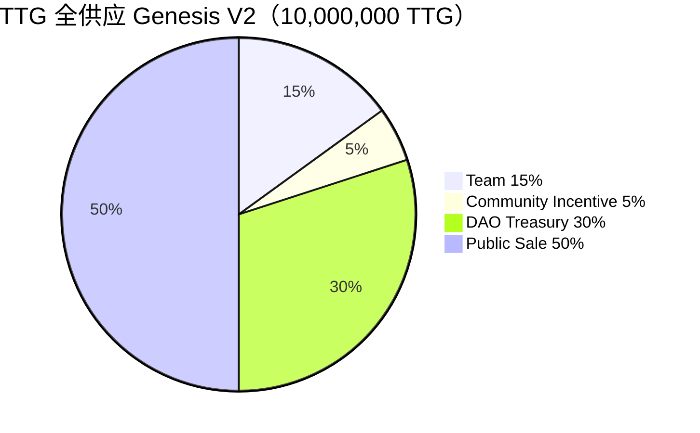

**已取消：** `advisors` · `country_pool_shelf` · 独立 `ecosystem` 创世桶 · `public_global` 20%（升为 Public Sale 50%）。

**读法：** Steward Seat 须锁 **自持** TTG（Same Protocol Rights · **无 Country Shelf**）；**持 TTG 本身不自动获得国家池 45% 净收益**（见 §2）。**`team` 15% = 初创团队** vesting；**`community_incentive` = Program**（非 standard vesting）。**DAO Treasury ≠ 投票权来源** · **禁止 Mint 补仓**。

<details>
<summary>ARCHIVED · V1 六桶表（勿作现行政策）</summary>

| 类别 | 占供应 | 旧键 |
|------|--------|------|
| 国家承销桶 | 25% | `country_pool_shelf` |
| 公众发行 | 20% | `public_global` |
| 生态激励 | 15% | `ecosystem` |
| 初创团队 | 15% | `team` |
| 顾问 | 5% | `advisors` |
| DAO Treasury | 20% | `treasury_dao` |

</details>

---
## §2 边界：四条禁止混读

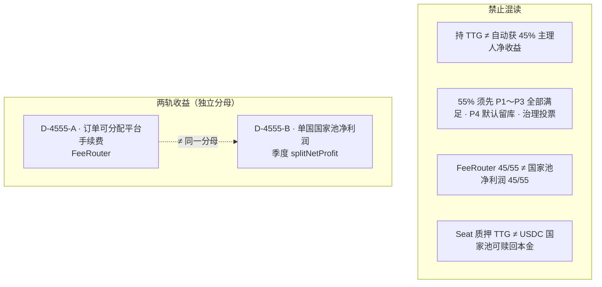

---

## §3 资金轨与收益流

### §3.0 四类资金轨（永不混账）

**SSOT：** [fund-flow-ssot.v1](fund-flow-ssot.v1.md)

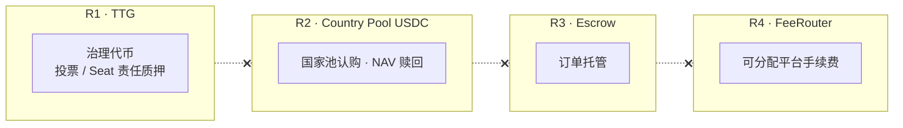

### §3A D-4555-A · 订单平台手续费（Escrow → FeeRouter）

**分母：** 可分配平台费用 100% · **非** TTG 供应 · **非** 国家池净利润

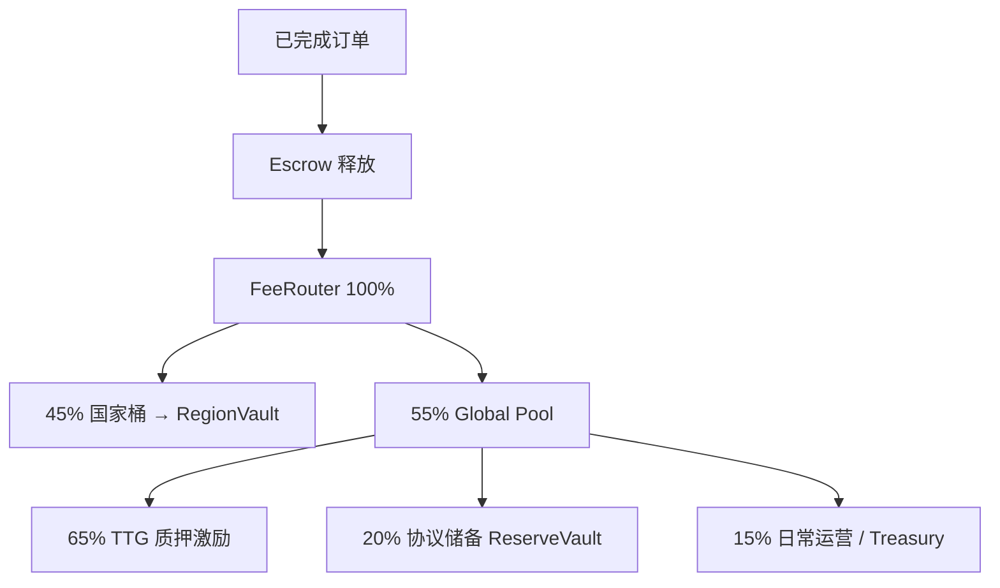

**参数：** [protocol-ssot.v1 §2](protocol-ssot.v1.md) · Mermaid 镜像 [08-4-附录](../08-4-附录-收益流闭环图-FeeRouter-Target.md)

### §3B D-4555-B · 单国国家池净利润 + Global Treasury 用途

**分母：** 该国单 epoch **正 NetProfit** · **非** FeeRouter 100% · **非** 全球混池

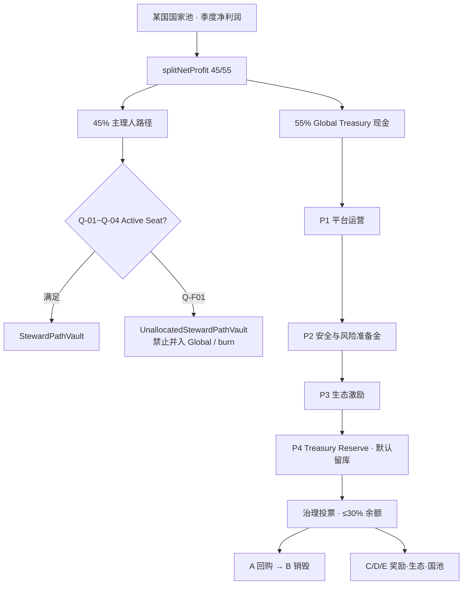

**P1 明细（产品冻结）：** 运营 · 安全 · 法务 · 会计 · 客服 · 市场 · 研发 — [country-revenue-model §2.1](country-revenue-model-v1-draft.md)

**链上模块（② 设计 · Gate-2.3 EXIT）：** [settlement-architecture-package-v1](country-pool-settlement-architecture-package-v1.md) · **Sepolia broadcast NOT STARTED**

---

## §4 申请与准入流程

### §4.0 总览

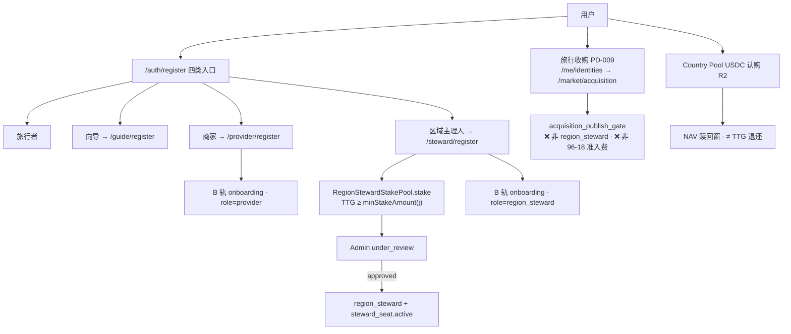

### §4.1 Steward 申请（`steward_application`）

**SSOT：** [state-machine.v1 §1](state-machine.v1.md)

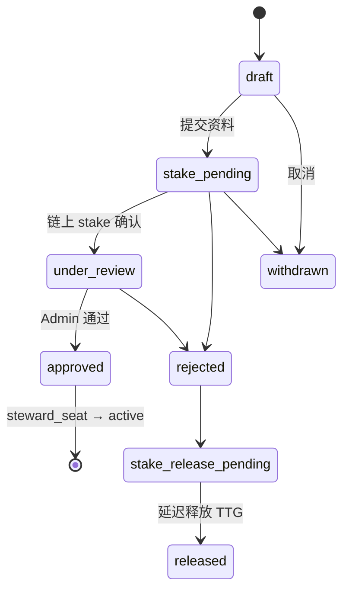

**锁仓：** [protocol-ssot §3](protocol-ssot.v1.md) · 最短任期 24 月 · 释放延迟 90d + vest 365d · **非本金刚性兑付**

### §4.2 Seat 任期 KPI（`steward_seat`）

**SSOT：** [state-machine.v1 §2](state-machine.v1.md) · [83 附录 A](../83-区域治理与收益分配-协议白皮书.md)

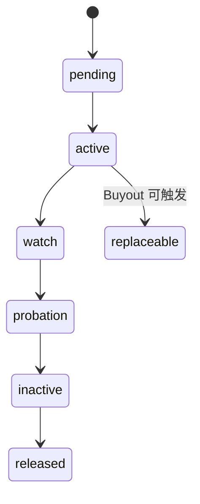

| Seat 状态 | SeatBonus |
|-----------|-----------|
| active | 100% |
| watch | 70% |
| probation / inactive / replaceable | 0% |

### §4.3 净利润结算 epoch（`country_pool_net_profit_settlement` · 正交于赎回）

**SSOT：** [state-machine.v1 §4a](state-machine.v1.md)

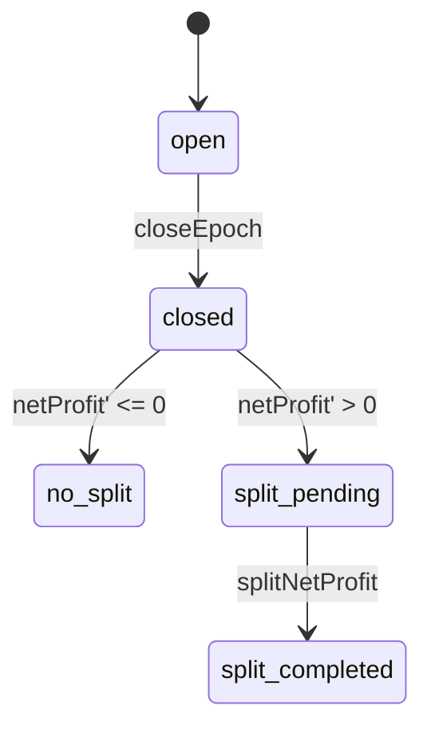

---

## §5 权限与治理控制面

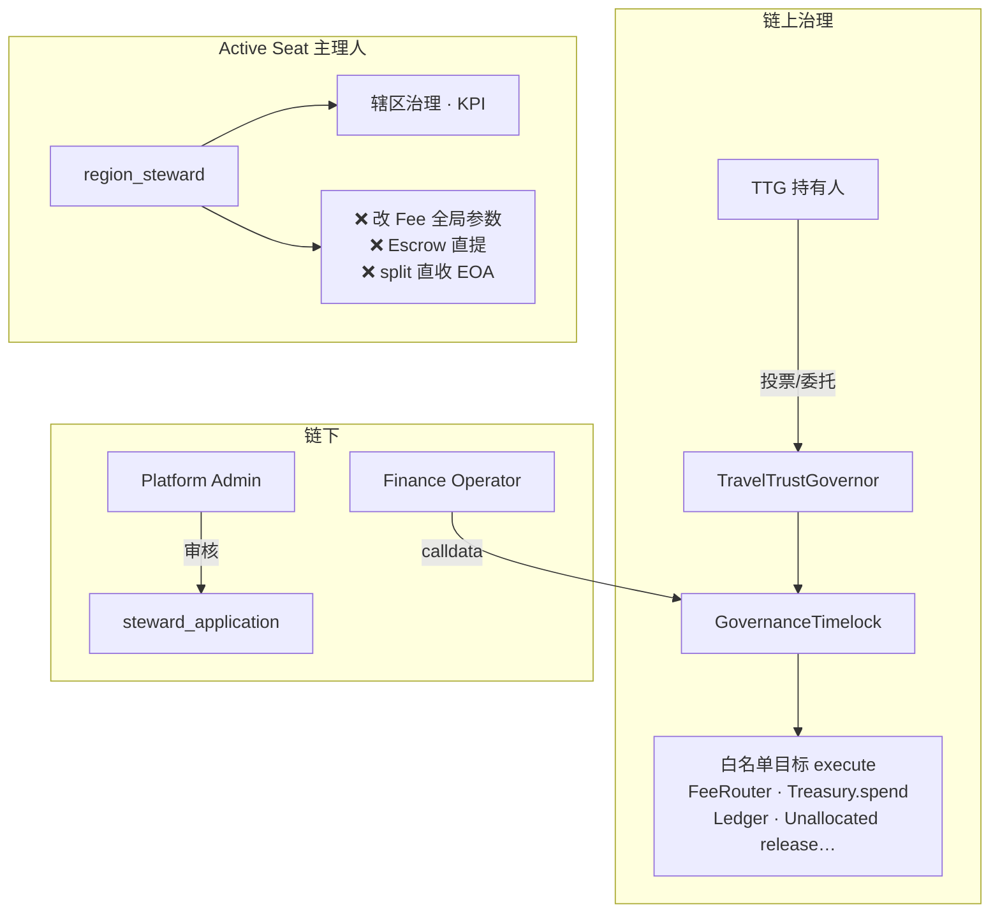

| 角色 | 能 | 不能 |
|------|-----|------|
| TTG 持有人 | 治理投票（`getPastVotes`） | 自动 45% 主理人净收益；自动分 Treasury 55% |
| Active Seat | 辖区治理参与 | 单方改 Snapshot/Global/FeeRouter；Escrow 资金 |
| Governor + Timelock | 参数 · Treasury spend · split · Unallocated 释放 | 修改已部署 Escrow 实例 |
| Country Pool 认购人 | NAV 赎回（R2） | 不要求 Seat 身份 |
| PD-009 收购发布者 | acquisition listing | 非 Seat；非 onboarding 准入费 |

**详表：** [TT-CHAIN-ARCHITECTURE-AUDITABLE-SPEC §4](../../runbook/TT-CHAIN-ARCHITECTURE-AUDITABLE-SPEC.md)

---

## §6 三轨独立参数（禁止自动换算）

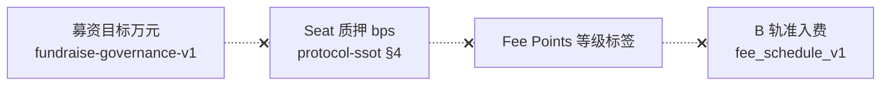

---

## §7 核对清单（产品 / 法务 / 工程）

| # | 断言 | ① 文档 | ② 链上 |
|---|------|--------|--------|
| 1 | TTG 10M · Genesis V2 15/5/30/50 | ✅ Genesis V2 · protocol-ssot | Target |
| 2 | 净利润第一步 45/55 | ✅ revenue-model §2 | Gate-2.3 EXIT · ② broadcast NS |
| 3 | Treasury 55%：P1→P2→P3→P4 治理+30% cap | ✅ revenue-model §2.1 · primary-market §1 | ② 预算科目待对齐 |
| 4 | 无 Active Steward：45%→Unallocated | ✅ accounting-spec | Gate-2.3 EXIT |
| 5 | 55% 不因 Q-F01 增加 | ✅ accounting-spec Q-F02 | Gate-2.3 EXIT |
| 6 | 持 TTG ≠ 45% 主理人收益 | ✅ 本文件 §2 | — |
| 7 | FeeRouter 45/55 独立轨 | ✅ protocol-ssot §2 | ① 已实现 |
| 8 | Seat 申请 + stake + 审核 | ✅ state-machine §1 | ① 本地 API |
| 9 | PD-009 非 Seat 门闸 | ✅ 94 / acquisition rules | ① 已闭 |
| 10 | Escrow 与治理资金隔离 | ✅ fund-flow §5 | ✅ Immutable |

**图例：** NS = NOT STARTED · ② broadcast 须 Gate-2.4 前置 + Owner 授权

---

## §8 项目绑定索引

| 消费方 | 路径 / 入口 |
|--------|-------------|
| **本文件（图解 SSOT）** | `docs/spec/governance-token/ttg-allocation-permissions-flows-ssot-v1.md` |
| 数值 SSOT | [protocol-ssot.v1.md](protocol-ssot.v1.md) |
| 资金流 SSOT | [fund-flow-ssot.v1.md](fund-flow-ssot.v1.md) |
| 状态机 SSOT | [state-machine.v1.md](state-machine.v1.md) |
| 净利润 + Treasury 政策 | [country-revenue-model-v1-draft.md](country-revenue-model-v1-draft.md) |
| **GOV-01～04 · Tokenomics V1 冻结** | **[TTG-TOKENOMICS-FREEZE-V1.md](TTG-TOKENOMICS-FREEZE-V1.md)** · [Final Audit Report](TTG-TOKENOMICS-FREEZE-V1-FINAL-AUDIT-REPORT.md) |
| 早期 USDC 兑换 · P4 治理 · Seat 退出 | [ttg-primary-market-and-exit-policy-v1-draft.md](ttg-primary-market-and-exit-policy-v1-draft.md) |
| 分账规格 | [country-pool-net-profit-accounting-spec-v1.md](country-pool-net-profit-accounting-spec-v1.md) |
| Settlement 架构 | [country-pool-settlement-architecture-package-v1.md](country-pool-settlement-architecture-package-v1.md) |
| Gate-2.4 前置 | [country-pool-settlement-gate2.4-prerequisites-checklist.md](country-pool-settlement-gate2.4-prerequisites-checklist.md) |
| 链权限审计 | [TT-CHAIN-ARCHITECTURE-AUDITABLE-SPEC.md](../../runbook/TT-CHAIN-ARCHITECTURE-AUDITABLE-SPEC.md) |
| 公示 UI | [`/governance/params`](../../../frontend/app/governance/params/README.md) |
| 目录索引 | [governance-token/README.md](README.md) · [82-治理币-文档总览](../82-治理币-文档总览.md) |
| 联动门禁 | `bash scripts/gates/check-governance-doc-linkage.sh` |

---

## §10 公众三轮 · P4 治理分配 · Seat 解锁退出（Owner 2026-06-16d）

**细则 SSOT：** [ttg-primary-market-and-exit-policy-v1-draft.md](ttg-primary-market-and-exit-policy-v1-draft.md)

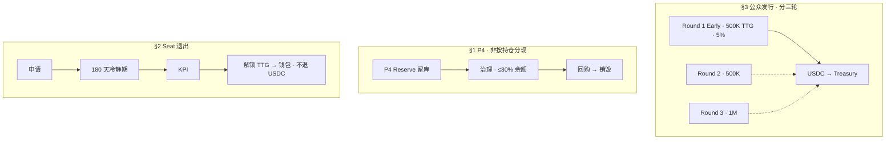

**与 §2 边界一致：** P4 **≠** 45% · **禁止** 自动现金分红 · Seat 退出 **≠** USDC 兑付 · TTG 价格 **市场决定**

---

## §9 变更记录

| Version | Date | Note |
|---------|------|------|
| v1-20260616 | 2026-06-16 | 初版：TTG 供应 · 四轨 · D-4555-A/B · Treasury P1～P4 · 申请/权限分图 · 维护规则 §0 |
| v1-20260616b | 2026-06-16 | §1：`team` 15% 措辞定为 **初创团队** · 与商家「橱窗 listing」显式区分 |
| v1-20260616c | 2026-06-16 | §3B P4 改为 TTG/总供应持有人分配 · 新增 §10 早期兑换/退出 · 链 `ttg-primary-market-and-exit-policy-v1` |
| v1-20260616d | 2026-06-16 | **Owner 修订：** P4 治理+30% cap · 回购/销毁 · Seat 仅解锁 TTG · 公众三轮 500K/500K/1M |
| v1-20260616e | 2026-06-16 | **GOV-01～04 冻结：** 链 **`TTG-TOKENOMICS-FREEZE-V1`** · §0 维护表 · §10 标注 GOV 硬闸 |
