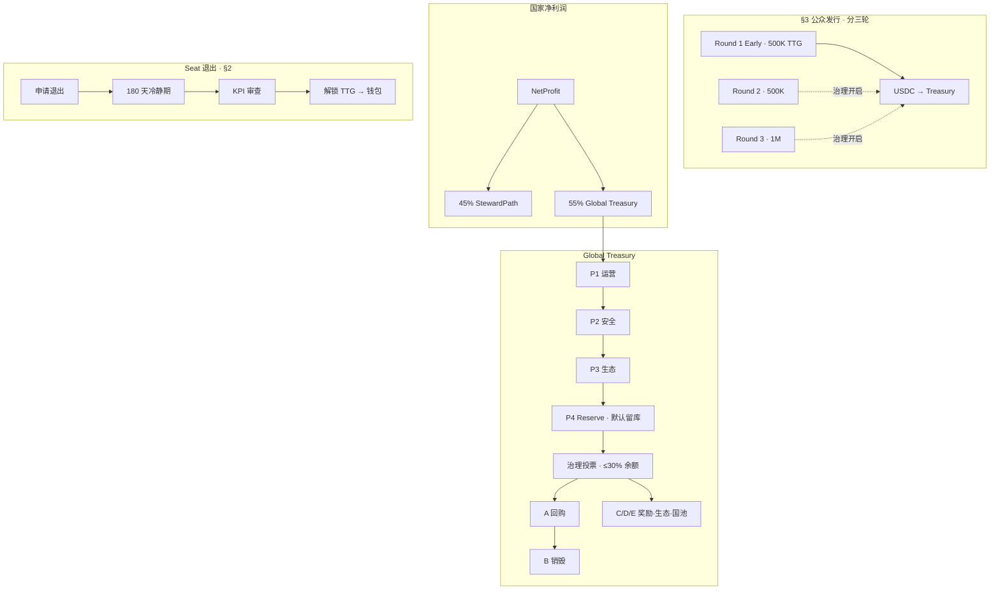

# TTG 公众发行轮次 · Treasury 治理分配 · Seat 退出 SSOT v1 草案

**Document ID:** `ttg-primary-market-and-exit-policy-v1`  
**Version:** v1-draft-20260616e  
**Status:** **SUPERSEDED BY [TTG-TOKENOMICS-FREEZE-V1](TTG-TOKENOMICS-FREEZE-V1.md) · 细节保留**  
**Companion：** [protocol-ssot.v1 §1](protocol-ssot.v1.md) · [country-revenue-model-v1-draft §2.1](country-revenue-model-v1-draft.md) · [ttg-allocation-permissions-flows-ssot-v1.md](ttg-allocation-permissions-flows-ssot-v1.md) · [ttg-reference-price-v1-draft.md](ttg-reference-price-v1-draft.md)

**阶段：** ① 文档 + Mock API · **②** Primary Market / Buyback / Seat 退出链上 **NOT STARTED** · **≠** Gate-2.4 Settlement 合约变更

---

## §0 Owner 拍板摘要（2026-06-16 · 修订）

| # | 议题 | 拍板结论 |
|---|------|----------|
| **Q1** | Global Treasury **55%** · P1～P3 后 **结余** | **不按持仓分现** · P4 = **Treasury Reserve（金库储备）** · **须治理投票** 决定是否动用 · 单周期 **可动用 ≤ Treasury 余额 30%** |
| **Q2** | **治理可选项**（经投票 · 非默认自动） | **A** 回购 TTG · **B** 销毁 TTG · **C** 持币奖励 · **D** 生态补贴 · **E** 国家池补贴 · **行业推荐默认叙事：回购 → 销毁** |
| **Q3** | **Seat 退出** | **申请 → 180 天冷静期 → KPI 审查 → 解锁 TTG 回钱包** · **不退 USDC** · TTG 价格 **由市场决定** |
| **Q4** | **公众发行 20%** | **分三轮释放 · 不一次卖完** · Early **50 万 TTG（5% 总供应）** |

**图解 SSOT：** 变更须同步 [ttg-allocation-permissions-flows-ssot-v1 §3B·§10](ttg-allocation-permissions-flows-ssot-v1.md) · [country-revenue-model §2.1](country-revenue-model-v1-draft.md)

---

## §1 Global Treasury P4 · 治理分配（非按持仓分现）

**对象：** 各国 `splitNetProfit` 汇总进入 **GovernanceTreasury** 的 **55% 现金腿**（D-4555-B）。

**顺序（写死）：**

1. **P1** 平台运营 — 预算 **须全部满足**  
2. **P2** 安全与风险准备金 — 预算 **须全部满足**  
3. **P3** 生态激励 — 经治理批准的预算 **须全部满足**  
4. **P4** **Treasury Reserve** — 剩余 **留库** · **默认不流出**

### §1.1 为何禁止「自动按 TTG 持仓分现金」

| 场景 | 风险 |
|------|------|
| Treasury **100 万 USDC** · P1～P3 各 **20 万** · 结余 **60 万** | 若 **自动** 把 60 万发出去 → 次年遇风险/运营缺口 → **金库掏空** |
| 行业惯例 | **Treasury → 治理决定** · **不是** 按持仓分现 |

### §1.2 治理动用规则

| 规则 ID | 内容 |
|---------|------|
| **P4-G-01** | P1～P3 **预算全部满足后**，**方可** 发起 **GlobalDAO / Timelock** 提案动用 P4 储备 |
| **P4-G-02** | **GOV-01** · `deployCap = min(P4Surplus, TreasuryReserveBalance × treasury_p4_deploy_cap_bps / 10000)` · **`treasury_p4_deploy_cap_bps=3000`** |
| **P4-G-03** | **禁止** 跳过 P1～P3 直接把 **55% 全额** 按 TTG 持仓 **自动** 发现金 |
| **P4-G-04** | **与 45% 主理人路径正交：** P4 **不** 替代 Steward 45% |

### §1.3 治理投票可选项（A～E）

| 选项 | 说明 | 行业常见度 |
|------|------|------------|
| **A · 回购 TTG** | 用 Treasury USDC 在公开市场/DEX **回购 TTG** | **高（推荐默认叙事）** |
| **B · 销毁 TTG** | 回购后 **burn** · 减少流通供应 | **高（常与 A 串联）** |
| **C · 持币奖励** | 向 TTG 持有人 **发放 TTG 或经治理批准的激励**（**非** 默认定额 USDC 分红） | 中 |
| **D · 生态补贴** | 注入 P3 或独立生态 Grant | 中 |
| **E · 国家池补贴** | 向指定 Country Pool **补充运营/风险缓冲**（**非** 混读 45% 主理人路径） | 低～中 |

**推荐默认路径（对外叙事 · ③ 法务改写）：**

```text
国家净利润 → 55% Global Treasury
  → P1 运营 · P2 安全 · P3 生态（全部满足）
  → P4 储备留库
  → 治理投票（≤30% 余额 cap）
  → 优先：回购 TTG → 销毁
```

**好处：** **不直接分钱** · 通过 **供应收缩 / 市场定价** 间接提升代币价值 · 比 **刚性现金分红** 更稳

### §1.5 治理程序（② 设计默认）

| 规则 ID | 内容 |
|---------|------|
| **P4-G-05** | **GOV-02** · Quorum **`governance_quorum_bps=400`** · Approval **`5000`** · Timelock **`48h`** |
| **P4-G-06** | **Timelock：** 提案通过 → **48h** 延迟 execute（与现有 Governor 对齐） |
| **P4-G-07** | **冲突披露：** `team` / `advisors` / 初创团队 multisig 成员 **须** 披露与回购/销毁提案利益关系 · **禁止** 未披露投票 |
| **P4-G-08** | **回购执行：** **TWAP** 窗口 **≥ 7 天** · 单笔 **≤ 5%** 当日 DEX 深度 · **禁止** 公告前 insider 买入 |

### §1.6 对外措辞

- **允许：** 「结余 **经治理** 决定回购、销毁或经批准的生态/国家池用途」  
- **禁止：** 「固定收益 / 按持仓分现 / 保本 / 与 45% 主理人净收益混读」

---

## §2 Seat 退出（不退 USDC · 仅解锁 TTG）

**适用：** 主动辞任 / 审核通过后退出 Seat · **非** 收购 Buyout（仍走 [state-machine §2](state-machine.v1.md)）

```text
steward 提交 exit_application
  → 180 天冷静期（= steward_resign_notice_days）
  → KPI / 履职审查（Admin · ② 链上 Council）
  → RegionStewardStakePool 解锁
  → TTG 回到 steward 钱包
  → steward_seat → released
  → 45% 路径等待新 Active Seat
```

| 规则 ID | 内容 |
|---------|------|
| **EX-01** | **不退 USDC** · **无** 项目方刚性兑付 · **无** Primary Market 原价赎回 |
| **EX-02** | **TTG 去向：** 回到 **申请人钱包**（已质押的同一批 TTG）· **不是** 销毁 · **不是** 强制转入 Unallocated 池（除非 KPI 违规 slash 另案） |
| **EX-03** | **TTG 值多少钱：** **市场决定**（DEX/二级市场）· **不是** 项目定价回购 |
| **EX-04** | **最短任职：** [protocol-ssot §3](protocol-ssot.v1.md) **`steward_seat_min_tenure_months: 24`** · **通知期 **`steward_resign_notice_days: 180`** |
| **EX-05** | **与 R2 正交：** Country Pool **USDC NAV 赎回** **不** 走本路径 |

**行业读法：** `Stake → 申请退出 → 冷静期 → 解锁 TTG → 拿回 TTG` — **标准 DeFi 质押退出** · **不是** 「质押退本金 USDC」

---

## §3 公众发行轮次（Q4 · 分三轮）

**供应来源：** **`public_global` 20%** = **2,000,000 TTG**（[protocol-ssot §1](protocol-ssot.v1.md)）· **禁止** 一次卖完

### §3.1 三轮结构（写死 · ① 默认）

| 轮次 | TTG 数量 | 占总供应 | 占公众 20% 桶 | 代号 |
|------|----------|----------|---------------|------|
| **第一轮 · Early** | **500,000** | **5%** | **25%** | `public_round_1_early` |
| **第二轮** | **500,000** | **5%** | **25%** | `public_round_2` |
| **第三轮** | **1,000,000** | **10%** | **50%** | `public_round_3` |
| **合计** | **2,000,000** | **20%** | **100%** | — |

```text
public_global 2,000,000 TTG
  ├─ Round 1 Early     500,000  (5% total)   ← 当前 Phase 1 早期轮
  ├─ Round 2           500,000  (5% total)   ← 治理开启后
  └─ Round 3         1,000,000 (10% total)   ← 治理开启后
```

### §3.2 Early Round 参数（Round 1 · 推荐）

| 参数 | 值 | 说明 |
|------|-----|------|
| **`round_1_ttg_cap`** | **500,000 TTG** | = 总供应 **5%** |
| **`round_1_price_reference`** | [ttg-reference-price-v1](ttg-reference-price-v1-draft.md) Mock **~27.7778 USDC/TTG** | ① 公示参考 · ② 曲线另闸 |
| **`round_1_per_wallet_cap`** | **25,000 TTG**（**GOV-04** · **0.25%** 总供应） | 防巨鲸 |
| **`round_1_min_purchase`** | **100 USDC** | dust 防护 |
| **`round_1_lock_months`** | **12**（一般）/ **24**（12 个月内走 Seat 路径） | 与 SSOT 锁仓对齐 |
| **USDC 去向** | **进入 GovernanceTreasury**（P1/P4 子账 · **非** Steward 退出兑付池） | 与 §2 一致 |

**Round 2 / Round 3：** 额度见 §3.1 · **须** 各轮 **独立治理提案** 开启 · 参数 **②** 链上 `TTGPrimaryMarket` 配置

### §3.3 公募合规（③ · 开工前必填）

| 项 | 要求 |
|----|------|
| **KYC/AML** | 各轮开启前 **须** 完成辖区清单 + 供应商选型 · **① 文档占位** |
| **合格投资者** | 视辖区可能要求 **accredited / professional** 门槛 · **③ 法务** |
| **披露** | 固定参考价 **非** 保本 · 须与 [08-4 §9-b](../08-4-对外口径包.md) 同步 |
| **锁仓披露** | Early 12m / Seat 路径 24m · 与 **team vest** 对照表同页披露 |

---

## §4 Treasury 子账结构（Target · ②）

```text
GovernanceTreasury（55% 现金汇总）
  ├─ OperationsSubVault          ← P1
  ├─ SecurityReserveSubVault     ← P2
  ├─ EcosystemBudgetSubVault     ← P3
  └─ TreasuryReserveSubVault     ← P4 · 默认留库 · 治理动用 ≤30% 余额

（无 PrimaryMarketRedemptionPool · 无废止「持仓分红金库」按持仓分现路径）
```

**早期发行 USDC：** 记入 Treasury · **不** 承诺 Seat 退出 USDC 兑付

---

## §5 端到端流程图



---

## §6 与 Gate-2.4 / Settlement 边界

| 项 | 是否改动 |
|----|----------|
| `splitNetProfit` 45/55 | **否** |
| `GovernanceTreasury.receive` | **否** |
| Buyback / Primary Market / Seat 解锁 | **② 新合约 · 独立 Gate** |

---

## §7 定稿门禁

- [x] Owner Q1～Q4 修订拍板 · 2026-06-16d  
- [ ] 法务 ③：回购/销毁叙事 · 非证券 · 无 USDC 退出承诺  
- [ ] ②：`TTGPrimaryMarket` + `TreasuryBuyback` + Seat 解锁 PR  
- [ ] 同步 `/governance/params` · [ttg-allocation-permissions-flows-ssot-v1 §10](ttg-allocation-permissions-flows-ssot-v1.md)

---

## §8 变更记录

| Version | Date | Note |
|---------|------|------|
| v1-draft-20260616 | 2026-06-16 | 初版四问（已 supersede） |
| v1-draft-20260616e | 2026-06-16 | 企业级修补：30% Reserve 定义 · P4 quorum/TWAP/冲突披露 · §3.3 KYC · Seat 时钟对齐 protocol-ssot |
