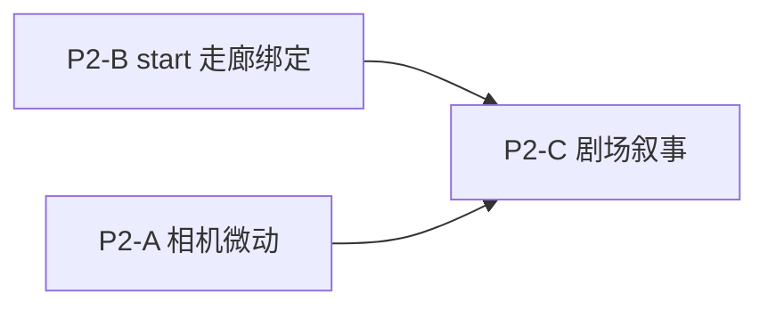

# P2 Hero / 全页叙事联动方案（仅规划 · ①）

**前置：** P0 目视冻结 `TT-GLOBE-L5-FROZEN-2026-05` · P1 联动已验收（见 [`p1-acceptance/`](./p1-acceptance/)）。

**P2 允许：** 相机微动 · `#start` 三步与走廊强绑定 · 角色剧场与区域叙事联动。

**P2 禁止：** 恢复/新增 P0 遮挡层（sky-wash、sky-cap、veil、video、warm-base、scrim、shimmer、warm-band、bridge-shimmer、grain、underlay 暖墨）· 修改冻结 mesh / WebGL 调色 token / 新增全幅 DOM 背景板。

---

## 1. 目标与验收阶次

| 轨 | 用户可感知结果 | ① 验收 |
|----|----------------|--------|
| **P2-A** | 悬停枢纽/CTA 时地球有**轻微**相机俯仰/偏航（无新 DOM 层） | 录屏 + `data-tt-traveltrust-camera-p2-mode` 机读 |
| **P2-B** | `#start` 三步 `plan/match/escrow` 与 Phase1 **走廊/region** 强绑定（选步即换示意路径/文案） | Playwright hash+step 断言 |
| **P2-C** | `#roles` 剧场 tab/进入与 Hero 所选 **region/corridor** 叙事一致 | 剧场 data 属性 + 埋点 |

**不做的 P2 项：** 新渐变遮罩 · Hero video · 球面材质/光照改版 · ②③ 真链/真 MP4。

---

## 2. P2-A · 相机微动（非冻结编排层）

### 现状

- `PageCameraRig` in `TravelTrustPageCinematicScene.tsx`（**非**冻结清单）已随 `heroT` 滚动推拉。
- P1 `focusedRegionId` 在 `traveltrustHeroGlobeP1Link.ts`（非冻结）。

### 方案

1. 新增 **`traveltrustHeroGlobeP2Camera.ts`**（lib · 非冻结）：`regionId → { yawOffset, pitchOffset, dollyMul }` 小表（±3° 量级），**不**改 `TRAVELTRUST_GLOBE_SUN_DIR` 等冻结 token。
2. 在 **`PageCameraRig`** 内读取 `getHeroGlobeP1FocusedRegion()` / P1 store，对 `smooth.current` 目标施加 **damp** 偏移（`heroT < 0.92` 时生效）。
3. **不**新增 Canvas CSS 层；**不**改 `TourismGlobe` mesh。

### 文件清单（预计改）

| 操作 | 路径 |
|------|------|
| 新建 | `frontend/lib/traveltrustHeroGlobeP2Camera.ts` |
| 新建 | `frontend/lib/traveltrustHeroGlobeP2Camera.test.ts` |
| 改 | `frontend/components/traveltrust/cinematic/TravelTrustPageCinematicScene.tsx`（仅 `PageCameraRig`） |
| 改 | `frontend/components/traveltrust/cinematic/TravelTrustPageCinematicCanvas.tsx`（`data-tt-traveltrust-camera-p2-*` 探针） |
| 新建 | `frontend/e2e/traveltrust-hero-p2-camera.probe.spec.ts` |

### 禁止触碰

`traveltrustHeroGlobeFrozenManifest.ts` 所列全部路径 · `TravelTrustPageCinematicCanvas` 内 overlay/warm-base 分支。

---

## 3. P2-B · `#start` 三步与走廊强绑定

### 现状

- `TRAVELTRUST_START_L5_STEPS = plan | match | escrow`（`traveltrustStartStepL5.ts`）。
- `TT_START_ROUTE_PATHS_L5[stepIndex]` 固定 SVG 路径（`traveltrustCinematicNonGlobeL5.ts`）。
- P1 已有 `#start?region=` + `startPrefillRegionId`。

### 方案

1. 新增 **`traveltrustStartCorridorBinding.ts`**：`regionId` + `routeBias` → `{ stepPaths[3], stepLabels, corridorId }`（示意，非航班数据）。
2. **`TravelTrustStartRoutePreview`**：按 `prefillRegionId` 选路径集；`activeStep` 变化时更新 `data-tt-traveltrust-start-corridor` / `data-tt-traveltrust-start-step-id`。
3. **`TravelTrustStartSection`**：三步 pill 点击写入 hash `#start?region=cn&step=match`（可选），与 P1 store 双向同步。
4. Hero CTA 点击时除 `region` 外可默认 `step=plan`。

### 文件清单

| 操作 | 路径 |
|------|------|
| 新建 | `frontend/lib/traveltrustStartCorridorBinding.ts` |
| 新建 | `frontend/lib/traveltrustStartCorridorBinding.test.ts` |
| 改 | `frontend/components/traveltrust/cinematic/TravelTrustStartRoutePreview.tsx` |
| 改 | `frontend/components/traveltrust/cinematic/TravelTrustStartSection.tsx` |
| 改 | `frontend/lib/traveltrustHeroGlobeP1Link.ts`（扩展 parse hash `step` · 非视觉） |
| 改 | `frontend/locales/zh.ts` / `en.ts`（走廊专用 step 副标题，纯文案） |
| 新建 | `frontend/e2e/traveltrust-start-corridor-p2.probe.spec.ts` |

### 不恢复

`TravelTrustStartSection` 内 `start-tail-atmosphere` 渐变若加重 opacity 属 **禁止**；仅允许改 **文案/SVG 路径数据/机读属性**。

---

## 4. P2-C · 角色剧场与区域叙事联动

### 现状

- `#roles` · `TravelTrustIdentityTheater` · `traveltrustIdentityModel` 五角色。
- P1 focus 未传入剧场。

### 方案

1. **`traveltrustHeroGlobeP1Link`** 增加 `corridorNarrativeId`（`atlantic | asia | any`），由 `regionId` 推导。
2. **`TravelTrustIdentityTheater`**：接收 context 或 subscribe P1 store；活跃 tab 文案/副标题带「示意走廊」；`data-tt-traveltrust-theater-corridor`。
3. **不**加全屏遮罩；剧场视频层 opacity/滤镜 **不改**（避免视觉层争议）。

### 文件清单

| 操作 | 路径 |
|------|------|
| 改 | `frontend/lib/traveltrustHeroGlobeP1Link.ts` |
| 改 | `frontend/components/traveltrust/cinematic/TravelTrustIdentityTheater.tsx` |
| 改 | `frontend/components/traveltrust/cinematic/TravelTrustBelowFoldSections.tsx`（透传，若有） |
| 改 | `frontend/app/traveltrust/traveltrustIdentityModel.ts`（仅文案 key 映射表，可选） |
| 改 | `frontend/locales/zh.ts` / `en.ts` |
| 探针 | 扩展 `traveltrust-hero-p2-theater.probe.spec.ts` 或 pi1 切片 |

---

## 5. 推荐实施顺序



1. **P2-B** — 承接 P1 `#start?region=`，用户路径最短。  
2. **P2-A** — 依赖稳定 `focusedRegionId`。  
3. **P2-C** — 依赖 corridor SSOT。

每批合并前：**P0 + P1 探针全绿**。

---

## 6. ① 回归命令（P2 开发时）

```bash
cd frontend && PLAYWRIGHT_REUSE_FE_SERVER=1 npx playwright test traveltrust-hero-p0-globe-acceptance traveltrust-hero-p1-linkage --config=playwright.scene-debug.probe.config.ts
cd frontend && npm run test -- traveltrustHeroGlobeFrozen traveltrustHeroGlobeP1Link
```

---

## 7. 与 spec / 证据对齐

| 文档 | 关系 |
|------|------|
| [`docs/spec/85-TravelTrust网络落地页-融资级设计与开发规格.md`](../../../docs/spec/85-TravelTrust网络落地页-融资级设计与开发规格.md) | IA · #start · #roles |
| [`HOMEPAGE-NON-DATA-CLOSURE.md`](../GO_local_cinematic_l5_closure/HOMEPAGE-NON-DATA-CLOSURE.md) | 首页冻结边界 |
| [`README.md`](./README.md) | P0/P1 签收 |

**P2 完成后：** 在 `README.md` 增「P2 closed ①」表；**不** bump `TT-GLOBE-L5-FROZEN_LOCKED_AT`（除非触及冻结清单内文件）。
