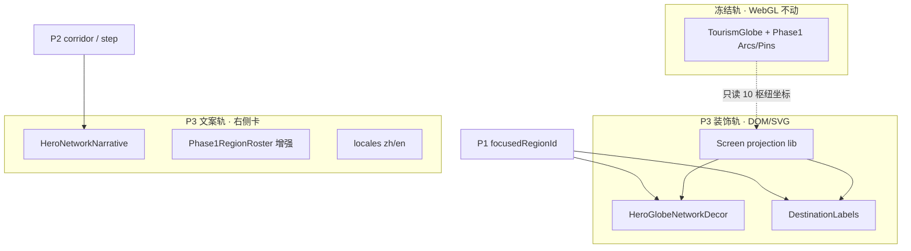
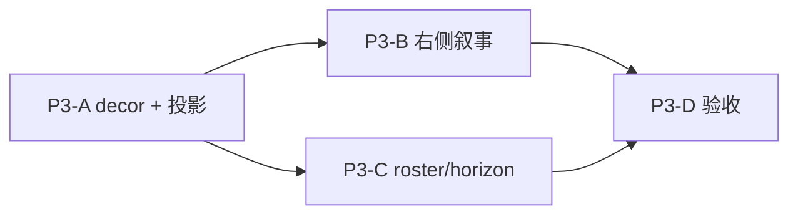

# P3 Hero L5 视觉升级方案（仅规划 · ①）

**前置：** P0 目视冻结 · P1 联动 · P2-B 走廊 · P2-C 剧场 — **技术验收已通过**（机读 8/8 + Vitest 22/22），**视觉未达 Web3 旅游 L5 目标**，故 **不提交 P0–P2-C**，在本 diff 上叠 P3。

**P3 定位：** **主视觉叙事增强**（全球旅游网络感），**不**做交互/state 大改（P1/P2 已闭）。

---

## 1. 硬边界（与 P0/P2 同源 · 不可破）

| 禁止 | 说明 |
|------|------|
| 恢复 P0 遮挡栈 | `hero-loop` video、`sky-wash` / `sky-cap` / `dom-veil`、`canvas-warm-base`（`heroGlobeUnobstructed=0` 分支）、`copy-scrim` / `copy-shimmer`、`warm-band` / `bridge-shimmer`、全幅暖墨天幕、`TravelTrustHeroFixedInkMask` 挂载 |
| 改冻结 mesh / WebGL 调色 | [`traveltrustHeroGlobeFrozenManifest.ts`](../../lib/traveltrustHeroGlobeFrozenManifest.ts) 所列 **全部路径**（含 `TravelTrustTourismGlobe*`、`Phase1TravelArcs`、`Phase1GlobeHighlights`、`traveltrustCinematicVisual` 球面 token 等） |
| P2-A 相机微动 | **仍不做**（避免与「纯叙事层」混淆；若以后要动，单独立项） |
| ②③ 真链 / 真航班 | 示意数据 · 免责声明保持 |

**允许：** Hero **左侧 viewport 内** 新增 **非 WebGL** 装饰层（SVG/DOM · `pointer-events-none` 或仅只读标签）；**右侧文案卡** 结构与 copy；**roster / horizon** 等非冻结 L5 组件；**locale** 纯文案；**只读** 消费 P1 `focusedRegionId` / P2 走廊 id（不改写入逻辑）。

---

## 2. 目标叙事（用户一眼应读到什么）

1. **全球旅游网络**：比 Phase1 的 10 个 WebGL 枢纽 **视觉上更密**（更多「城市光点 + 走廊弧线」），但不增加可点击 WebGL 针脚。  
2. **航线在流动**：示意走廊上有 **脉冲/流光**（SVG `stroke-dashoffset` 或 CSS motion，非改 `TravelTrustPhase1TravelArcs` 材质）。  
3. **目的地可读**：悬停/聚焦时 **目的地标签**（城市名 + tier/走廊短标）出现在 globe viewport 内，与 P1 roster 同步。  
4. **右侧旅游化**：标题区下方增加 **「此刻走廊 / 示意行程」** 一条；trust chips 偏 **托管/匹配/跨境** 旅游语境。  
5. **Web3 托管叙事**：文案卡内 **plan → match → escrow** 一行微时间轴（链到已有 `#start?step=`），强调「链上托管示意 · 非真资金」。

---

## 3. 技术策略：双轨叠加（不碰冻结 WebGL）

- **装饰轨**：新建 `traveltrustHeroP3DecorNodes.ts`（**示意** 18–24 城 · lat/lon · 仅用于 DOM 投影，**不**写入 `traveltrustPhase1GlobeRegions.ts`）。  
- **投影**：`traveltrustHeroP3ScreenProjection.ts` 将 lat/lon → `%` 位置（对齐 `--tt-hero-globe-optical-x/y` + viewport `getBoundingClientRect`）；与 WebGL 针脚 **近似对齐**，允许 ±2% 视觉误差。  
- **流动弧线**：`traveltrustHeroP3CorridorPaths.ts` 存 SVG path d（大西洋/亚太/跨欧非等 6–8 条），动画仅在 decor 层；**不**改 `TRAVELTRUST_PHASE1_TRAVEL_ROUTES` 消费逻辑。  
- **聚焦联动**：decor 层 listen `useHeroGlobeP1Link().focusedRegionId` + `useTraveltrustGlobeHeroHud().routeBias` — 高亮相关节点/弧线，**不**向冻结组件传新 props。

---

## 4. 分轨方案

### P3-A · Globe viewport 网络装饰层（核心视觉）

| 元素 | 做法 | 机读 |
|------|------|------|
| 扩展城市光点 | decor 节点 18–24 · tier 大小区分 · 弱呼吸 | `data-tt-traveltrust-hero-p3-node` · `data-tt-traveltrust-hero-p3-node-id` |
| 走廊弧线 | 6–8 条 SVG 弧线 + dash 流动动画 | `data-tt-traveltrust-hero-p3-corridor` |
| 路径脉冲 | 沿 path 的 moving dot / gradient sweep | `data-tt-traveltrust-hero-p3-pulse` |
| 目的地标签 | 聚焦枢纽显示 `name` + `corridor` 短标；其余半透明 | `data-tt-traveltrust-hero-p3-label` |

**挂载点：** `TravelTrustCinematicHero` 内 `globeViewportRef` 子树，**在** `TravelTrustPhase1RegionRoster` **之下**、`hero-globe-decor` **之上**（z-index 见 `traveltrustHeroLayout` / `TT_Z`，**不**盖住右侧 copy 卡）。

**降动效：** `prefers-reduced-motion` → 静态弧 + 无 pulse。

### P3-B · 右侧文案卡旅游化 + Web3 托管叙事

| 元素 | 做法 |
|------|------|
| 走廊实况条 | kicker 下 1 行：`{corridorLabel} · {focusedCity} → 示意目的地`（读 P1/P2 状态，纯文案） |
| 托管微时间轴 | 3 格 `plan | match | escrow`（样式轻量 · 非 start 区重复 UI）· 链 `#start?region=&step=` |
| Trust chips | 改 locale 为「跨境托管示意 / 向导匹配 / 多枢纽网络」等（**不**增 chip 数量避免挤版） |
| Tagline / title 微调 | 仅 `locales` · 强调「全球定制旅行网络」 |

**禁止：** 给 `TT_HERO_COPY_CARD` 加厚 scrim / 大面积渐变底（P0 已关 `UNIFIED_PAGE_3D` 下 scrim）；允许 **1px 边框 / 内阴影** 级 L5 卡片增强（`traveltrustCinematicNonGlobeL5` 已有 token）。

### P3-C · Roster + Horizon 旅游化（非 WebGL）

| 组件 | 增强 |
|------|------|
| `TravelTrustPhase1RegionRoster` | compact 行展示 **走廊名** + 当前 focus 城；secondary 城名来自 P3 decor 表（只读展示「+N 枢纽」） |
| `TravelTrustHorizonArc` | 底缘弧线加 2–3 个 **示意旅行动点** 动画（已有结构可扩 · 非冻结） |

### P3-D · 验收与回归（①）

| 项 | 命令 / 证据 |
|----|-------------|
| P0 不回归遮挡 | `traveltrust-hero-p0-globe-acceptance` + `traveltrust-layer-kill-audit` |
| P1/P2 不破坏 | 现有 8 探针全批 |
| P3 新增 | `traveltrust-hero-p3-network-decor.probe.spec.ts` |
| 冻结契约 | `npm run test -- traveltrustHeroGlobeFrozen` |
| 目视 | `p3-acceptance/` 硬刷新 3 张：默认 / focus-cn / focus-us |

---

## 5. 推荐实施顺序

1. **P3-A** — 视觉密度主体；先定投影与路径数据。  
2. **P3-B** — 与 P1 focus 同步的文案叙事（依赖 A 的 corridor 常量可共享 lib）。  
3. **P3-C** — 锦上添花。  
4. **P3-D** — 全回归 + `p3-acceptance` 截图。

---

## 6. 文件清单

### 6.1 新建（P3 主工作量）

| 路径 | 用途 |
|------|------|
| `frontend/lib/traveltrustHeroP3DecorNodes.ts` | 示意扩展城市表（lat/lon/tier/corridorId） |
| `frontend/lib/traveltrustHeroP3CorridorPaths.ts` | SVG path + corridor 元数据 |
| `frontend/lib/traveltrustHeroP3ScreenProjection.ts` | lat/lon → viewport % |
| `frontend/lib/traveltrustHeroP3ScreenProjection.test.ts` | 投影数学单测 |
| `frontend/lib/traveltrustHeroP3Narrative.ts` | region/corridor → 文案 key 映射 |
| `frontend/lib/traveltrustHeroP3Narrative.test.ts` | 映射单测 |
| `frontend/components/traveltrust/cinematic/TravelTrustHeroGlobeNetworkDecor.tsx` | SVG 弧 + 节点 + pulse |
| `frontend/components/traveltrust/cinematic/TravelTrustHeroDestinationLabels.tsx` | 聚焦标签层 |
| `frontend/components/traveltrust/cinematic/TravelTrustHeroNetworkNarrative.tsx` | 右侧走廊条 + 托管微时间轴 |
| `frontend/hooks/useTraveltrustHeroP3Projection.ts` | viewport resize + 光学变量 |
| `frontend/e2e/traveltrust-hero-p3-network-decor.probe.spec.ts` | P3 机读 + 截图 |
| `frontend/evidence/GO_local_hero_globe_a_closure/p3-acceptance/README.md` | 证据索引 |

### 6.2 修改（非冻结 · 预期）

| 路径 | 改动范围 |
|------|----------|
| `frontend/components/traveltrust/cinematic/TravelTrustCinematicHero.tsx` | 挂载 decor/labels/narrative；**不**打开 scrim/shimmer 分支 |
| `frontend/components/traveltrust/cinematic/TravelTrustPhase1RegionRoster.tsx` | 走廊/扩展枢纽文案展示 |
| `frontend/components/traveltrust/cinematic/TravelTrustHorizonArc.tsx` | 底缘动点增强（可选 P3-C） |
| `frontend/lib/traveltrustCinematicNonGlobeL5.ts` | **仅** 新增 P3 decor/label 的 class token（**禁止** 改 `TT_HERO_GLOBE_L5_PALETTE` / globe 相关色） |
| `frontend/lib/traveltrustHeroLayout.ts` | decor 层 z-index / viewport `position:relative`（若无则补） |
| `frontend/locales/zh.ts` / `en.ts` | hero 旅游化 + 托管叙事 key |
| `frontend/app/traveltrust/traveltrustNetworkPage.contract.test.ts` | 断言 `data-tt-traveltrust-hero-p3-*` 存在 |
| `frontend/playwright.scene-debug.probe.config.ts` | `testMatch` 加入 p3 probe |
| `frontend/evidence/GO_local_hero_globe_a_closure/README.md` | P3 表 + 提交前检查项 |
| `frontend/evidence/GO_local_hero_globe_a_closure/P3-PLAN.md` | 本文件 |

### 6.3 只读依赖（不改）

| 路径 | 用途 |
|------|------|
| `frontend/lib/traveltrustHeroGlobeP1Link.ts` | `focusedRegionId` / `startPrefill*` |
| `frontend/lib/traveltrustGlobeHeroHud.ts` | `routeBias` |
| `frontend/lib/traveltrustStartCorridorBinding.ts` | 走廊 id 与 P2-B 对齐 |
| `frontend/hooks/useTraveltrustHeroGlobeOpticalAlign.ts` | 光学中心 CSS 变量 |

### 6.4 禁止触碰（冻结 + P0）

`traveltrustHeroGlobeFrozenManifest.ts` 中 **每一行**；另 **禁止** 在 `TravelTrustPageCinematicCanvas` 将 `heroGlobeUnobstructed` 置 0 以「加氛围」；**禁止** `TravelTrustCinematicHero` 在 `UNIFIED_PAGE_3D` 下渲染 `copy-shimmer` / scrim / `hero-top-vignette` 加重 opacity。

---

## 7. ① 验收标准（目视 + 机读）

| # | 目视 | 机读 |
|---|------|------|
| P3-1 | 首屏 **肉眼可见** 多于 10 个旅游光点 + 多条流动弧线 | `data-tt-traveltrust-hero-p3-node` 计数 ≥ 18 |
| P3-2 | 悬停 roster 或 CTA 时 **标签 + 弧** 随 focus 变化 | `data-tt-traveltrust-hero-p3-label-visible=1` |
| P3-3 | 右侧卡读出「旅游网络 + 托管示意」 | 新 locale key 出现在 DOM |
| P3-4 | 地球仍完整可见 · **无** 横条压球 / 无全屏 wash | P0 + layer-kill **仍 PASS** |
| P3-5 | WebGL 球面色相与 P0 样张一致 | `traveltrustHeroGlobeFrozen` + 目视 diff `p0-acceptance` |

**阶段：** 仅 **① 本地**；目视由维护者签收 `p3-acceptance/*.png`，**不** 等同 ②③ GO。

---

## 8. 可选分支（默认不做）

| 分支 | 条件 | 说明 |
|------|------|------|
| **解除冻结** `TT-GLOBE-L5-FROZEN` | 书面 unlock + 更新 manifest `LOCKED_AT` | 方可在 `Phase1GlobeHighlights` 真增 WebGL 针脚/改 arc 材质 |
| **P2-A 相机** | 用户单独立项 | 与 P3 视觉正交 |
| **Hero 视频回潮** | **否决** | P0 根因层 |

---

## 9. 与提交关系

- **当前：** 保留 P0–P2-C diff，**不提交**。  
- **P3 完成后建议两次提交：**  
  1. `feat(frontend): hero P0–P2-C linkage and acceptance (①)`  
  2. `feat(frontend): hero P3 L5 network decor and tourism narrative (①)`  

---

**维护：** 实施前与 [`README.md`](./README.md)「冻结后禁止」表对拍；动 non-globe L5 token 时跑 `npm run verify:cinematic-l5`（全页 L5 锁 · 非地球轨）。
